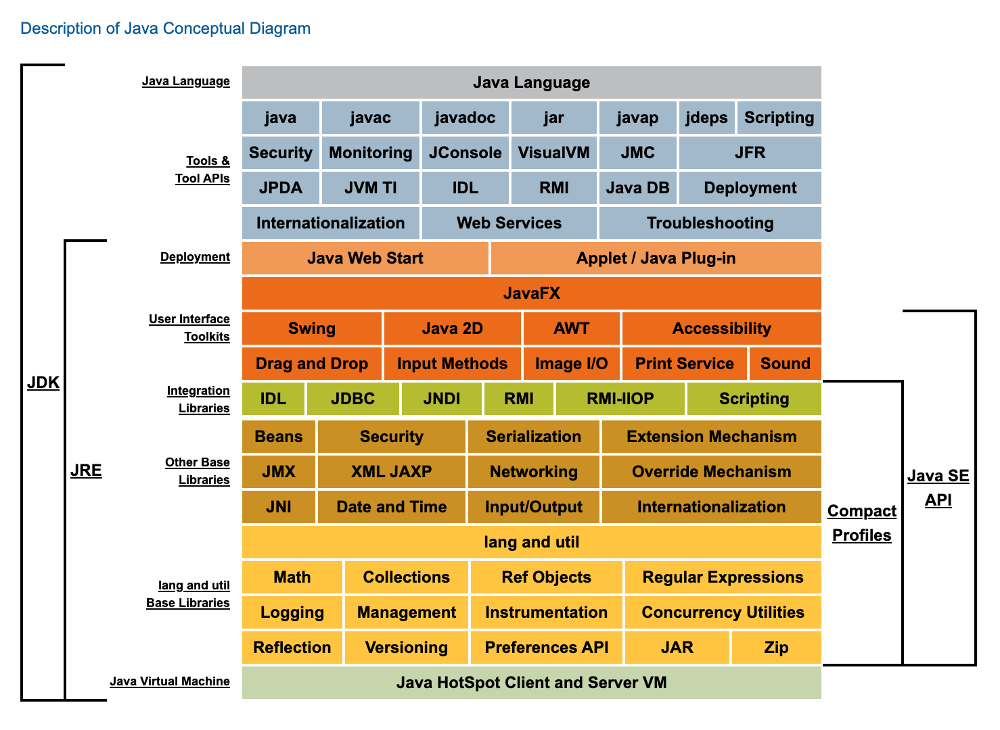

<h1 align="center">JVM</h1>

[toc]

## JDK

[Java SE 8 Documentation](https://docs.oracle.com/javase/8/)

[Java Platform Standard Edition 8 Documentation](https://docs.oracle.com/javase/8/docs/?xd_co_f=c41e3b8b-3463-45e4-94ba-8485b4aaf3b9)

[Java Language and Virtual Machine Specifications](https://docs.oracle.com/javase/specs/index.html)

[The Java® Virtual Machine Specification](https://docs.oracle.com/javase/specs/jvms/se8/html/index.html)

[Description of Java Conceptual Diagram](https://docs.oracle.com/javase/8/docs/technotes/guides/desc_jdk_structure.html)

## OpenJDK

* [OpenJDK](https://adoptopenjdk.net/)
* [OpenJDK](https://openjdk.java.net/)
* [OpenJDK Download](http://jdk.java.net/archive/)
* [AdoptOpenJDK - Open source, prebuilt OpenJDK binaries](https://adoptopenjdk.net/index.html?variant=openjdk8&jvmVariant=hotspot)

## GC回收过程及原理

* [Java GC系列（1）：Java垃圾回收简介](http://www.importnew.com/13504.html)
* [Java GC系列（2）：Java垃圾回收是如何工作的？](http://www.importnew.com/13493.html)
* [Java GC系列（3）：垃圾回收器种类](http://www.importnew.com/13827.html)
* [Java GC系列（4）：垃圾回收监视和分析](http://www.importnew.com/13838.html)

## Java虚拟机原理
* [理解Java虚拟机体系结构](https://www.cnblogs.com/lao-liang/p/5110710.html)
* [《深入理解 Java 内存模型》读书笔记](http://www.54tianzhisheng.cn/2018/02/28/Java-Memory-Model/)
* [《Java虚拟机原理图解》 1.1、class文件基本组织结构](https://blog.csdn.net/luanlouis/article/details/39892027)
* [《Java虚拟机原理图解》 1.2、class文件中的常量池](https://blog.csdn.net/luanlouis/article/details/40148053)
* [《Java虚拟机原理图解》 1.2.2、Class文件中的常量池详解（上）](https://blog.csdn.net/luanlouis/article/details/39960815)
* [《Java虚拟机原理图解》 1.2.3、Class文件中的常量池详解（下）](https://blog.csdn.net/luanlouis/article/details/40301985)
* [《Java虚拟机原理图解》1.3、class文件中的访问标志、类索引、父类索引、接口索引集合](https://blog.csdn.net/luanlouis/article/details/41039269)
* [《Java虚拟机原理图解》1.4 class文件中的字段表集合--field字段在class文件中是怎样组织的](https://blog.csdn.net/luanlouis/article/details/41046443)
* [《Java虚拟机原理图解》1.5、 class文件中的方法表集合--method方法在class文件中是怎样组织的](https://blog.csdn.net/luanlouis/article/details/41113695)
* [《Java虚拟机原理图解》3、JVM运行时数据区](https://blog.csdn.net/luanlouis/article/details/40043991)
* [《Java虚拟机原理图解》4.JVM机器指令集](https://blog.csdn.net/luanlouis/article/details/50412126)
* [《Java虚拟机原理图解》5. JVM类加载器机制与类加载过程](https://blog.csdn.net/luanlouis/article/details/50529868)

## GC

* [What Is Garbage Collection](https://plumbr.io/handbook/what-is-garbage-collection)
* [Garbage Collection in Java](https://plumbr.io/handbook/garbage-collection-in-java)
* [GC Algorithms: Basics](https://plumbr.io/handbook/garbage-collection-algorithms)
* [GC Algorithms: Implementations](https://plumbr.io/handbook/garbage-collection-algorithms-implementations)
* [GC Turning:Basics](https://plumbr.io/handbook/gc-tuning)
* [GC Turning: Tooling](https://plumbr.io/handbook/gc-tuning-measuring)
* [GC Turning: In Practice](https://plumbr.io/handbook/gc-tuning-in-practice)

   

## 编译原理

* [基本功 | Java即时编译器原理解析及实践](https://tech.meituan.com/2020/10/22/java-jit-practice-in-meituan.html)

