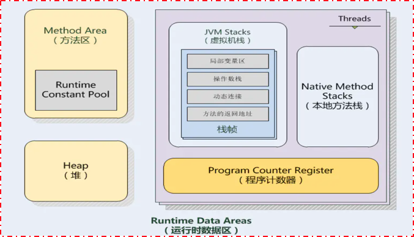

<h1 align="center">JVM架构体系与GC命令小总结</h1>




```
1. Overview
2. JVM架构体系
    1) 垃圾回收
        - 对象存活性判断
        - 垃圾回收算法
        - 垃圾回收器（回收算法的具体实现）
    2) 类装载子系统
        - 启动类加载器
        - 扩展类加载器
        - 应用程序类加载器
        - 自定义类加载器
    3) 执行引擎
        - 解释器
        - 即时编译器
    4) 运行时数据区
        - 堆Heap
        - 方法区
        - 程序计数器
        - 虚拟机栈
        - 本地方法栈
3. 垃圾回收器开启命令
4. Reference
```

## **Overview**

---

Java虚拟机Java virtual machine(JVM) 是物理机器的软件实现。java编译器javac将源码文件.java编译成字节码文件.class，然后这个字节码文件.class被放到JVM中，装载并执行字节码文件.class。JVM架构图如下。


JVM Architecture

## **JVM架构体系**

---

1. 垃圾回收（garbage collection）：负责回收堆内存heap中没有被使用的对象

   判断对象是否存活，可达性检测

2. 1. 引用计数算法：给对象添加一个引用计数器，每当有一个地方引用它时，计数器值就加1，当引用失效时，计数器值就减1。任何时刻计数器为0的对象就是不可能再被使用的
   2. 根搜索算法：通过一系列名为“GC Roots”的对象作为起始点，从这些节点开始向下搜索，搜索所走过的路径称为引用链，当一个对象到 GC Roots 没有任何引用链相连时，就证明此对象是不可用的


垃圾回收算法

1. 标记-清除算法Mark-Sweep：首先标记出所有需要回收的对象，在标记完成后统一回收所有被标记的对象

2. - 效率问题：标记和清除动作都不是高效动作
   - 空间问题：标记清除之后产生大量不连续的内存碎片，碎片太多导致分配较大对象时无法找到足够的连续内存而不得不提前触发另一次gc

3. 复制算法Copying：它将可用内存按容量划分为大小相等的两块，每次只使用其中的一块。当这一块的内存用完了，就将还存活着的对象复制到另外一块上面，然后再把已使用过的内存空间一次清理掉

4. 1. 可用内存缩小为原来的一半
   2. 每次收集时，所有的标记对象都要被拷贝，从而导致一些生命周期很长的对象被来回拷贝多次，消耗大量的时间 ->分代回收来解决这个问题

5. 分代回收算法Generational Collecting：根据对象存活周期的不同将内存划分为几块

   新生代：内存分为一块较大的Eden空间和两块较小的Survivor空间。新建object在Eden，Eden满时触发YGC，Eden中存活对象被移动到S0区，清空Eden；等Eden再满再YGC，Eden和S0中的存活对象被复制到S1（复制算法保证了S1中来自Eden和S0两部分的存活对象占用连续的内存空间，避免了碎片化）；清空Eden和S0。下一轮的时候S0和S1交换角色，如此循环往复。如果对象的复制次数达到15次，该对象就会被送到老年代。

   老年代：对象存活率高

- 垃圾回收器（垃圾回收算法的具体实现）

- 并行与并发

- - 并行Parallel：指多条垃圾收集线程并行工作，但此时用户线程仍然处于等待状态
   - 并发Concurrent：指用户线程与垃圾收集线程同时执行，用户程序在继续运行，而垃圾收集程序运行于另一个CPU上

- 新生代minor gc：新生代内存不是很大，miinor gc回收速度一般比较快

- 老年代major gc/ full gc：老年代内存一般比较大，用于缓存大对象，所以回收速度约minor gc的10倍以上

- 吞吐量throughput：JVM总共运行了100分钟，其中垃圾收集花掉1分钟，那吞吐量就是99%，即(all-gc)/all（for batch pipeline）

- 停顿时间：垃圾回收器正在运行时，应用程序的暂停时间（for streaming pipeline）


回收器类型

1. NEW

2. - serial，单线程
   - parNew，serial多线程版
   - Parallel Scavenge，复制算法，并行，优先保证吞吐量，不顾及用户STW感受，吞吐量方面优化的系统，停顿时间长是可以接收的。

3. OLD/tenured

4. - Serial Old，Serial回收器的老年代版本，单线程，标记-整理算法
   - Parallel Old，Parallel Scavenge回收器的老年代版本，多线程，标记-整理算法
   - Concurrent Mark Sweep, CMS：优先最短回收停顿时间，用户体验好，标记-清除算法

5. NEW and OLD

6. - 关键点：region内存划分，优先级区域回收方式。优先回收价值最大的region

7. - garbage first, G1：它将整个Java堆划分为多个大小相等的独立区域（Region），虽然还保留有新生代和老年代的概念，但新生代和老年代不再是物理隔离的了，它们都是一部分Region（不需要连续）的集合。


类装载子系统（classloader sub-system）：定位和导入二进制class文件，校验导入类的正确性，为类变量分配并初始化内存，解析符号引用

- 启动类加载器bootstrap classloader，负责加载JAVA_HOME/lib下的合法类文件
- 扩展类加载器extension classloader，负责加载JAVA_HOME/lib/ext下的合法类文件
- 应用程序类加载器application classloader，负责加载用户路径classpath下的合法类文件
- 自定义类加载器user defined classloader，`class MyClassLoader extends ClassLoader`
- JVM通过双亲委派模型进行类的加载，先交给其最底层父类去加载，父类无法加载时才自己试着去加载。if(parent != null) parent.loadclass(name) 递归recursion，`application classloader -> extension classloader -> bootstrap classloader`
- 先看user defined classloader是否缓存了，如果缓存了，就直接返回，如果没有，委派父classloader去加载，如果父缓存了，就直接返回，否则再委派给父classloader；直到最后的bootstrap classloader，如果其缓存找不到，则在其路径下找，找到则至二级返回，否则往其子类返回，让其子类在其路径下找；最后又回到自定义classloader，如果还找不到就抛异常


执行引擎（execution engine）：执行classloader中的方法指令

- 解释器Interpreter：读取源码或字节码，并逐条直接执行（javac是在JVM外的）
- 即时编译器Just-In-Time compiler/JIT: 读取源码，更多情况下是字节码，然后即时编译为机器码并执行
- Java虚拟机是可运行Java代码的假想计算机，java源文件(.java)通过java编译器javac生成字节码文件（.class），字节码文件（.class）通过JVM中的解释器再翻译成特定机器上的机器码
   `即，源码/源代码/Source code/.java -> 字节码/Bytecode/.class -> 机器码/Machine code/原生码/Native Code`


运行时数据区（runtime data areas）：JVM运行时需要从整个计算机内存中划出一块内存区域存储jvm需要用到的东西

- 堆Heap：JVM内共享/线程间共享，保存了所有类实例/对象本身instance，不存储基本数据类型对象和自定义对象引用（这些存在各线程的JVM Stack中），是gc的主要回收区
- 方法区Method Area/永久代Permanent Generation：JVM内共享/线程间共享，保存了每个类的信息（类的名称、字段信息、方法信息）class、静态变量static等
- 程序计数器Program Counter Register/PC寄存器：线程内共享，保存每个线程正在执行的虚拟机字节码指令的地址；若该方法为Native的，则计数器置空Undefined
- 虚拟机栈JVM Stack/线程栈：线程内共享，保存基本数据类型的对象和自定义对象的引用，执行环境的上下文
- 本地方法栈Native Method Stacks：线程内共享，与JVM Stack所发挥的作用是非常相似的，其区别不过是虚拟机栈为虚拟机执行Java方法（也就是字节码）服务，而本地方法栈则是为虚拟机执行的Native方法服务


## **垃圾回收器开启命令**

---

| Command line              | 新生代gc模式       | 老年代gc模式        |
| ------------------------- | ------------------ | ------------------- |
| `-XX:+UseSerialGC`        | serial串行回收器   | serialOld串行回收器 |
| `-XX:+UseParNewGC`        | parNew并行回收器   | default             |
| `-XX:+UseParallelGC`      | parallel并行回收器 | default             |
| `-XX:+UseParallelOldGC`   | default            | parallel并行回收器  |
| `-XX:+UseConcMarkSweepGC` | default            | CMS并行回收器       |
| `-XX:+UseG1GC`            | G1回收器           | G1回收器            |

根据上表新生代与老年代的gc模式互为搭配一起为垃圾回收器服务。

### Default garbage collectors,

- Java 7 - Parallel GC
- Java 8 - Parallel GC
- Java 9 - G1 GC

本文作者是chenfh5，根据所读过的书和博客整理而成。

## 来源

---

https://mp.weixin.qq.com/s/Xuadm-zuYMcL-yCWpi4M3A