# 1.2.2、Class文件中的常量池详解（上）

**NO1.常量池在class文件的什么位置？**

​     我的上一篇文章《Java虚拟机原理图解》 1、class文件基本组织结构中已经提到了class的文件结构，在class文件中的魔数、副版本号、主版本之后，紧接着就是常量池的数据区域了，如下图用红线包括的位置：

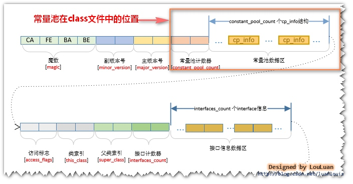


   知道了常量池的位置后，然后让我们来揭秘常量池里究竟有什么东西吧～   

**NO2.常量池的里面是怎么组织的？**

   常量池的组织很简单，前端的两个字节占有的位置叫做**常量池计数器**(**constant_pool_count**)，它记录着常量池的组成元素 **常量池项(cp_info)** 的个数。紧接着会排列着**constant_pool_count-1**个**常量池项(cp_info)**。如下图所示：

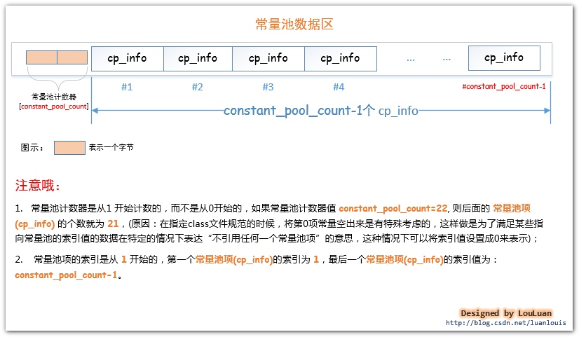


**NO3.常量池项 (cp_info) 的结构是什么？**

  每个**常量池项(cp_info)** 都会对应记录着class文件中的某中类型的字面量。让我们先来了解一下**常量池项(cp_info)**的结构吧：

 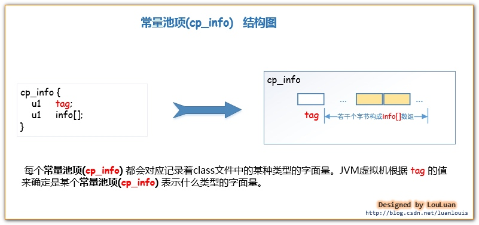


   JVM虚拟机规定了不同的tag值和不同类型的字面量对应关系如下：

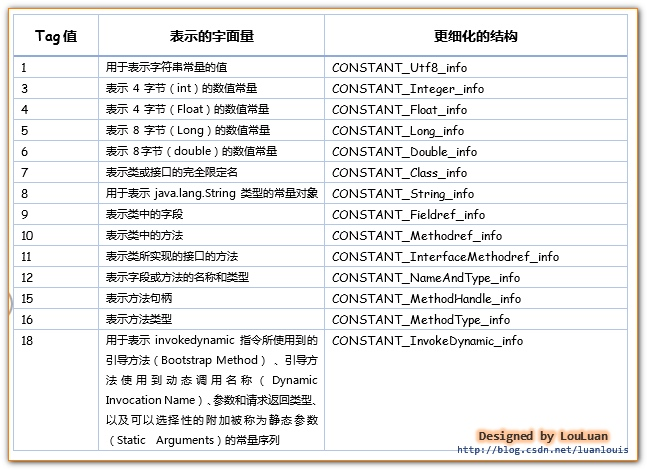


​      所以根据cp_info中的tag 不同的值，可以将cp_info 更细化为以下结构体：
​          **CONSTANT_Utf8_info,CONSTANT_Integer_info,CONSTANT_Float_info,CONSTANT_Long_info,**
  **CONSTANT_Double_info,CONSTANT_Class_info,CONSTANT_String_info,CONSTANT_Fieldref_info,**
 **CONSTANT_Methodref_info,CONSTANT_InterfaceMethodref_info,CONSTANT_NameAndType_info,CONSTANT_MethodHandle_info,**

​      **CONSTANT_MethodType_info,CONSTANT_InvokeDynamic_info**。

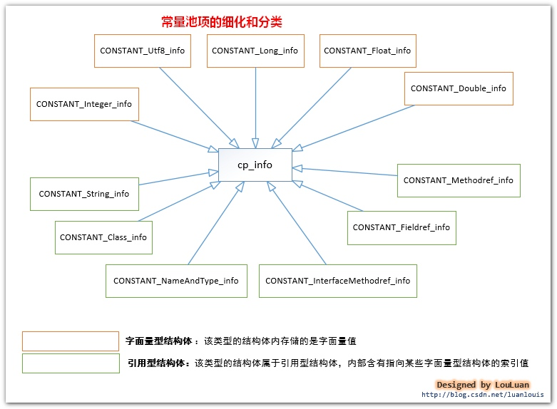


​       现在让我们看一下细化了的常量池的结构会是类似下图所示的样子：

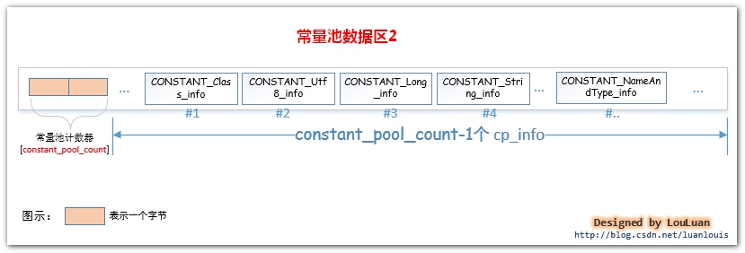

**NO4.常量池能够表示那些信息？**

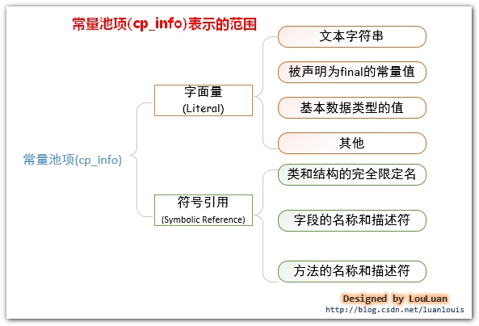


**NO5. int和float数据类型的常量在常量池中是怎样表示和存储的？****(CONSTANT_Integer_info, CONSTANT_Float_info****)**

 Java语言规范规定了 int类型和Float 类型的数据类型占用 **4** 个字节的空间。那么存在于class字节码文件中的该类型的常量是如何存储的呢？相应地，在常量池中，将 int和Float类型的常量分别使用CONSTANT_Integer_info和 Constant_float_info表示，他们的结构如下所示：

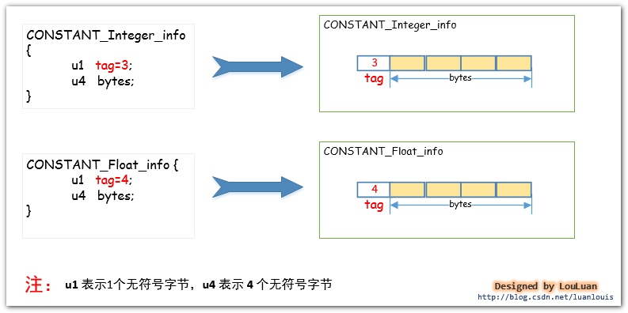


举例：建下面的类 IntAndFloatTest.java，在这个类中，我们声明了五个变量，但是取值就两种int类型的**10** 和Float类型的**11f**。

```java
package com.louis.jvm;
 
public class IntAndFloatTest {
​	
	private final int a = 10;
	private final int b = 10;
	private float c = 11f;
	private float d = 11f;
	private float e = 11f;

}
```

然后用编译器编译成IntAndFloatTest.class字节码文件，我们通过**javap -v IntAndFloatTest** 指令来看一下其常量池中的信息，可以看到虽然我们在代码中写了两次**10** 和三次**11f**，但是常量池中，就只有一个常量**10** 和一个常量**11f**,如下图所示:

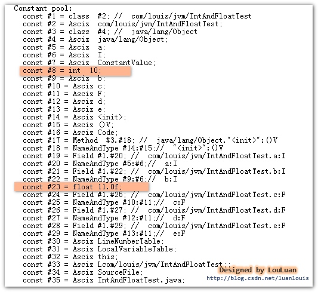


从结果上可以看到常量池第**#8** 个**常量池项(cp_info)** 就是CONSTANT_Integer_info,值为**10**；第**#23**个**常量池项(cp_info)** 就是CONSTANT_Float_info,值为**11f**。(*常量池中其他的东西先别纠结啦，我们会面会一一讲解的哦*)。

 代码中所有用到 int 类型 **10** 的地方，会使用指向常量池的指针值**#8** 定位到第**#8** 个**常量池项(cp_info)，**即值为 **10**的结构体 CONSTANT_Integer_info，而用到float类型的**11f**时，也会指向常量池的指针值#23来定位到第#23个**常量池项(cp_info)** 即值为**11f**的结构体CONSTANT_Float_info。如下图所示：

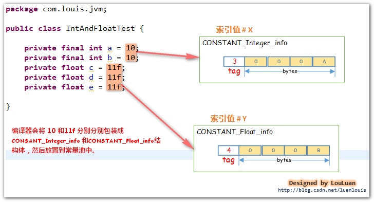


**NO6. long和 double数据类型的常量在常量池中是怎样表示和存储的？(****CONSTANT_Long_info、CONSTANT_Double_info** **)**

Java语言规范规定了 **long** 类型和 **double**类型的数据类型占用**8** 个字节的空间。那么存在于class 字节码文件中的该类型的常量是如何存储的呢？相应地，在常量池中，将**long**和**double**类型的常量分别使用CONSTANT_Long_info和Constant_Double_info表示，他们的结构如下所示：

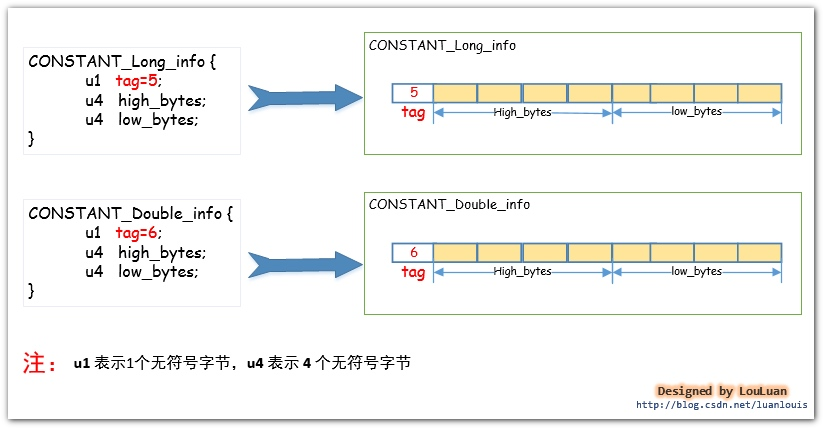


   举例：建下面的类 LongAndDoubleTest.java，在这个类中，我们声明了六个变量，但是取值就两种**Long** 类型的**-6076574518398440533L** 和**Double** 类型的**10.1234567890D**。

```java
package com.louis.jvm;

public class LongAndDoubleTest {
	
	private long a = -6076574518398440533L;
​	private long b = -6076574518398440533L;
	private long c = -6076574518398440533L;
	private double d = 10.1234567890D;
​	private double e = 10.1234567890D;
​	private double f = 10.1234567890D;
}
```

   然后用编译器编译成 LongAndDoubleTest.class 字节码文件，我们通过**javap -v LongAndDoubleTest**指令来看一下其常量池中的信息，可以看到虽然我们在代码中写了三次**-6076574518398440533L** 和三次**10.1234567890D**，但是常量池中，就只有一个常量**-6076574518398440533L** 和一个常量**10.1234567890D**,如下图所示:

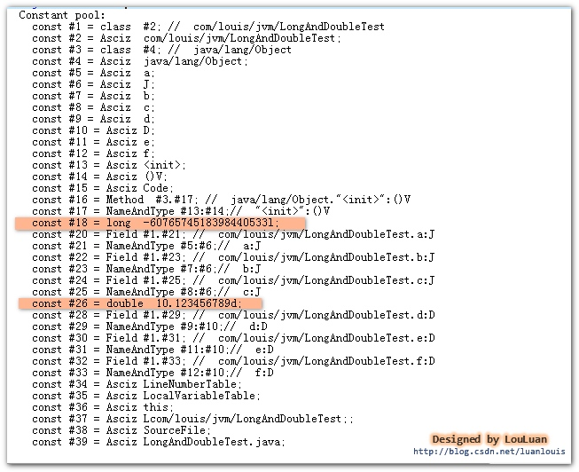


   从结果上可以看到常量池第  **#18** 个**常量池项(cp_info)** 就是**CONSTANT_Long_info**,值为**-6076574518398440533L** ；第 **#26**个**常量池项(cp_info)** 就是**CONSTANT_Double_info**,值为**10.1234567890D**。(常量池中其他的东西先别纠结啦，我们会面会一一讲解的哦)。

​    代码中所有用到 long 类型**-6076574518398440533L** 的地方，会使用指向常量池的指针值**#18** 定位到第 **#18** 个**常量池项(cp_info)，**即值为**-6076574518398440533L**  的结构体**CONSTANT_Long_info**，而用到double类型的**10.1234567890D**时，也会指向常量池的指针值**#26** 来定位到第 **#26** 个**常量池项(cp_info)** 即值为**10.1234567890D**的结构体**CONSTANT_Double_info**。如下图所示：

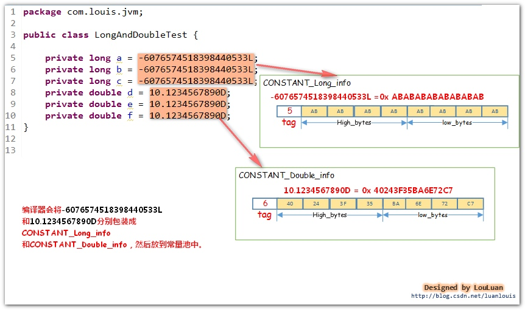


**NO7. String类型的字符串常量在常量池中是怎样表示和存储的？（****CONSTANT_String_info、CONSTANT_Utf8_info）**


   对于字符串而言，JVM会将字符串类型的字面量以UTF-8 编码格式存储到在class字节码文件中。这么说可能有点摸不着北，我们先从直观的Java源码中中出现的用双引号"" 括起来的字符串来看，在编译器编译的时候，都会将这些字符串转换成**CONSTANT_String_info**结构体，然后放置于常量池中。其结构如下所示：

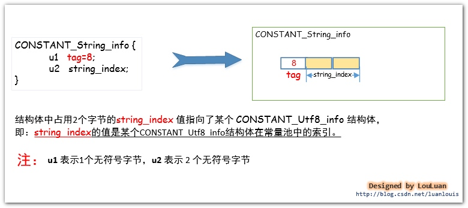


   如上图所示的结构体，**CONSTANT_String_info** 结构体中的string_index的值指向了CONSTANT_Utf8_info结构体，而字符串的utf-8编码数据就在这个结构体之中。如下图所示：

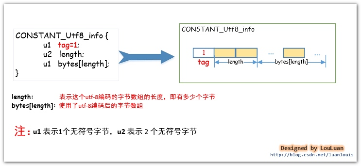


请看一例，定义一个简单的StringTest.java类，然后在这个类里加一个"JVM原理" 字符串，然后，我们来看看它在class文件中是怎样组织的。

```java
package com.louis.jvm;

public class StringTest {
	private String s1 = "JVM原理";
	private String s2 = "JVM原理";
	private String s3 = "JVM原理";
	private String s4 = "JVM原理";
}
```

将Java源码编译成StringTest.class文件后，在此文件的目录下执行 javap -v StringTest 命令，会看到如下的常量池信息的轮廓：

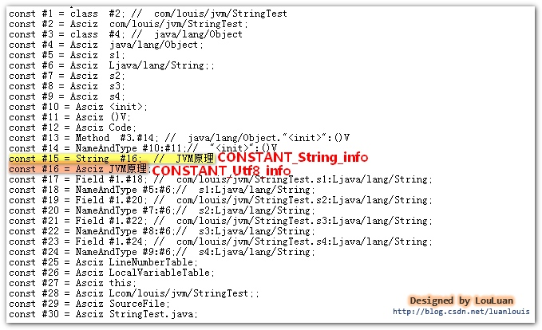


 (PS :使用javap -v 指令能看到易于我们阅读的信息，查看真正的字节码文件可以使用HEXWin、NOTEPAD++、UtraEdit 等工具。)

​    在面的图中，我们可以看到**CONSTANT_String_info** 结构体位于常量池的第**#15**个索引位置。而存放"Java虚拟机原理" 字符串的 UTF-8编码格式的字节数组被放到**CONSTANT_Utf8_info**结构体中，该结构体位于常量池的第**#16**个索引位置。上面的图只是看了个轮廓，让我们再深入地看一下它们的组织吧。请看下图：

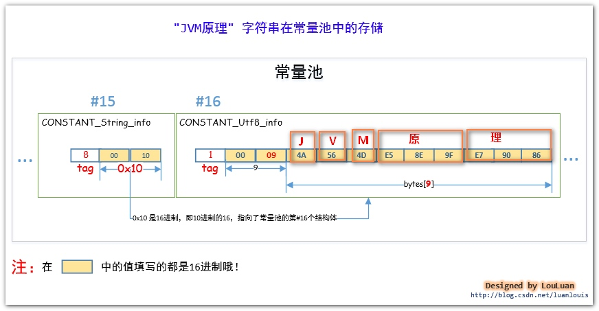


由上图可见：“**JVM原理**”的UTF-8编码的数组是：4A564D E5 8E 9FE7 90 86，并且存入了**CONSTANT_Utf8_info**结构体中。


**NO8. 类文件中定义的类名和类中使用到的类在常量池中是怎样被组织和存储的？**(CONSTANT_Class_info)**

   JVM会将某个Java 类中所有使用到了的**类的完全限定名** 以**二进制形式的完全限定名** 封装成**CONSTANT_Class_info**结构体中，然后将其放置到常量池里。**CONSTANT_Class_info** 的tag值为 **7 。**其结构如下：

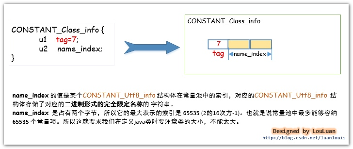


Tips：**类的完全限定名**和**二进制形式的完全限定名**

   在某个Java源码中，我们会使用很多个类，比如我们定义了一个 **ClassTest**的类，并把它放到**com.louis.jvm** 包下，则 **ClassTest**类的完全限定名为**com****.****louis****.****jvm.ClassTest**，将JVM编译器将类编译成class文件后，此完全限定名在class文件中，是以二进制形式的完全限定名存储的，即它会把完全限定符的"**.**"换成**"****/****"** ，即在class文件中存储的 **ClassTest**类的完全限定名称是"**com****/****louis****/****jvm****/****ClassTest** "。因为这种形式的完全限定名是放在了class二进制形式的字节码文件中，所以就称之为 **二进制形式的完全限定名。**

举例，我们定义一个很简单的**ClassTest**类，来看一下常量池是怎么对类的完全限定名进行存储的。

```java
package com.jvm;
import  java.util.Date;
public class ClassTest {
	private Date date =new Date();
}
```

将Java源码编译成**ClassTest.class**文件后，在此文件的目录下执行 javap -v ClassTest 命令，会看到如下的常量池信息的轮廓：

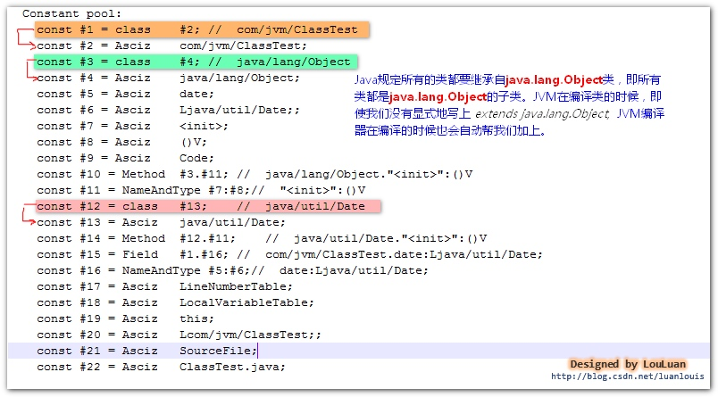


如上图所示，在**ClassTest.class**文件的常量池中，共有 3 个**CONSTANT_Class_info**结构体，分别表示**ClassTest** 中用到的Class信息。 我们就看其中一个表示**com/jvm.ClassTest**的**CONSTANT_Class_info** 结构体。它在常量池中的位置是**#1**，它的name_index值为**#2**，它指向了常量池的第**2** 个常量池项，如下所示:


**注意：**

   对于某个类而言，其class文件中至少要有两个CONSTANT_Class_info常量池项，用来表示自己的类信息和其父类信息。(除了java.lang.Object类除外，其他的任何类都会默认继承自java.lang.Object）如果类声明实现了某些接口，那么接口的信息也会生成对应的CONSTANT_Class_info常量池项。

 除此之外，如果在类中使用到了其他的类，只有真正使用到了相应的类，JDK编译器才会将类的信息组成CONSTANT_Class_info常量池项放置到常量池中。如下图：

```java
package com.louis.jvm;

import java.util.Date;
 
public  class Other{
	private Date date;
	
	public Other()
	{
​		Date da;
​	}
}
```

 上述的Other的类，在JDK将其编译成class文件时，常量池中并没有java.util.Date对应的CONSTANT_Class_info常量池项，为什么呢?

  在Other类中虽然定义了Date类型的两个变量date、da，但是JDK编译的时候，认为你只是声明了“Ljava/util/Date”类型的变量，并没有实际使用到Ljava/util/Date类。将类信息放置到常量池中的目的，是为了在后续的代码中有可能会反复用到它。很显然，JDK在编译Other类的时候，会解析到Date类有没有用到，发现该类在代码中就没有用到过，所以就认为没有必要将它的信息放置到常量池中了。

  将上述的Other类改写一下，仅使用new Date()，如下图所示：

```java
package com.louis.jvm;

import java.util.Date;
 
public  class Other{
	public Other()
	{
		new Date();
	}
}
```

 这时候使用javap -v Other ，可以查看到常量池中有表示java/util/Date的常量池项：

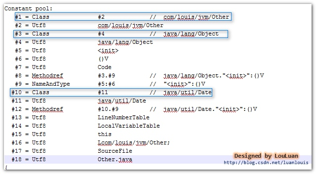


 总结：

   1. 对于某个类或接口而言，其自身、父类和继承或实现的接口的信息会被直接组装成CONSTANT_Class_info常量池项放置到常量池中； 

   2. 类中或接口中使用到了其他的类，只有在类中实际使用到了该类时，该类的信息才会在常量池中有对应的CONSTANT_Class_info常量池项；

   3. 类中或接口中仅仅定义某种类型的变量，JDK只会将变量的类型描述信息以UTF-8字符串组成CONSTANT_Utf8_info常量池项放置到常量池中，上面在类中的private Date date;JDK编译器只会将表示date的数据类型的“Ljava/util/Date”字符串放置到常量池中。