# 1.2.3、Class文件中的常量池详解（下）

**NO9.类中引用到的field字段在常量池中是怎样描述的？(****CONSTANT_Fieldref_info****, CONSTANT_Name_Type_info)**

   一般而言，我们在定义类的过程中会定义一些 field 字段，然后会在这个类的其他地方（如方法中）使用到它。有可能我们在类的方法中只使用field字段一次，也有可能我们会在类定义的方法中使用它很多很多次。

   举一个简单的例子，我们定一个叫Person的简单java bean，它有name和age两个field字段，如下所示：

```java
package com.louis.jvm;

public class Person {
 
	private String name;
	private int age;
​	
	public String getName() {
		return name;
	}
​	
​	public void setName(String name) {
		this.name = name;
​	}
	public int getAge() {
		return age;
 ​ }
​	
	public void setAge(int age) {
		this.age = age;
​	}
​}
```

在上面定义的类中，我们在Person类中的一系列方法里，多次引用到namefield字段 和agefield字段，对于JVM编译器而言，name和age只是一个符号而已，并且它在由于它可能会在此类中重复出现多次，所以JVM把它当作常量来看待，将name和age以field字段常量的形式保存到常量池中。

将它name和age封装成 CONSTANT_Fieldref_info 常量池项，放到常量池中，在类中引用到它的地方，直接放置一个指向field字段所在常量池的索引。

上面的Person类，使用**javap -v Person**指令，查看class文件的信息，你会看到，在Person类中引用到age和namefield字段的地方，都是指向了常量池中age和namefield字段对应的常量池项中。表示field字段的常量池项叫做CONSTANT_Fieldref_info。

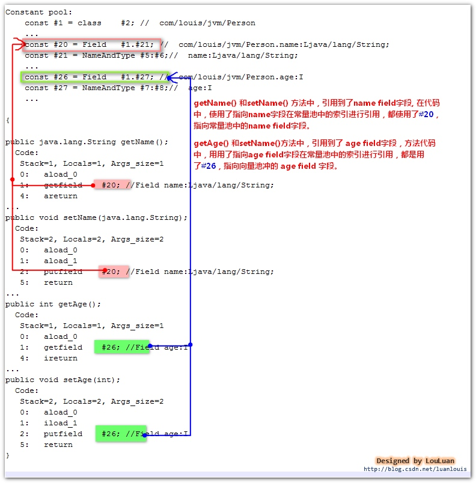


怎样描述某一个field字段的引用？

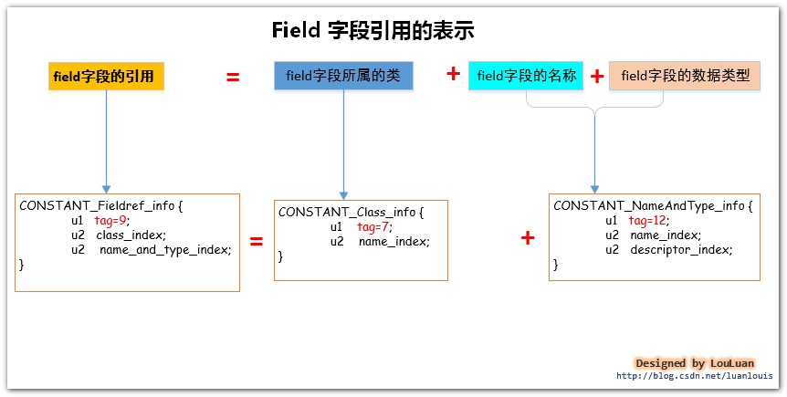

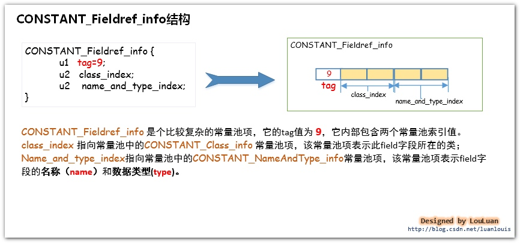

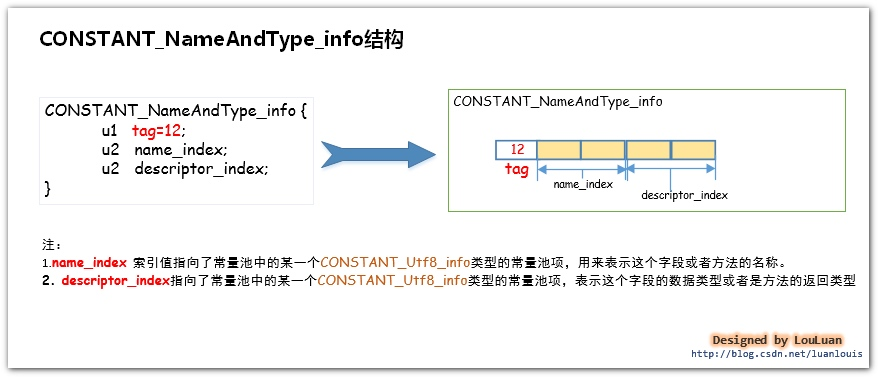

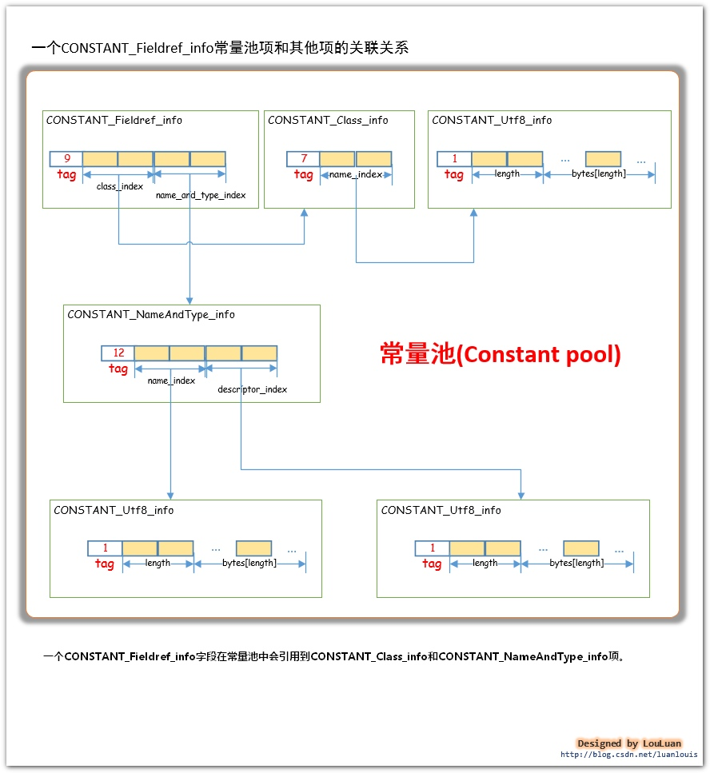


  实例解析： 现在，让我们来看一下**Person**类中定义的namefield字段在常量池中的表示。通过使用**javap -v Person**会查看到如下的常量池信息：

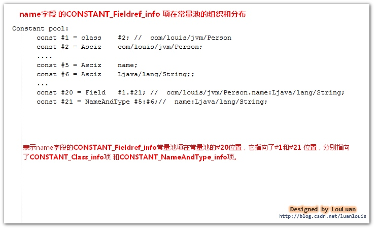

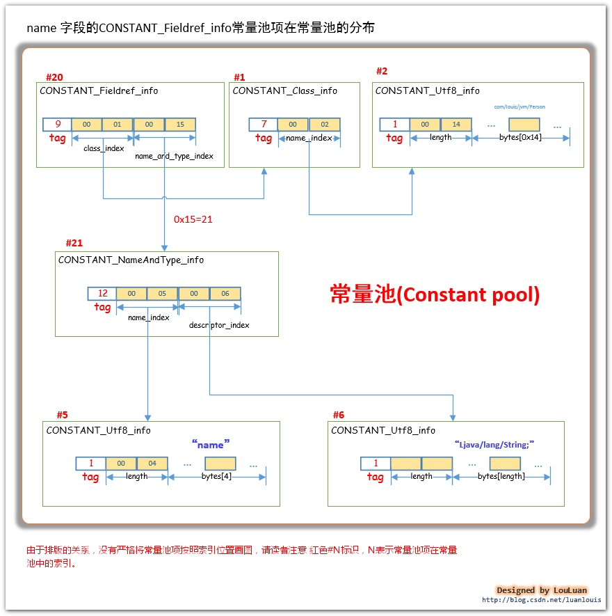


  请读者看上图中**name**field字段的数据类型，它在**#6**个常量池项，以UTF-8编码格式的字符串“**Ljava/lang/String;**” 表示，这表示着这个field 字段是**java.lang.String** 类型的。关于field字段的数据类型，class文件中存储的方式和我们在源码中声明的有些不一样。请看下图的对应关系：

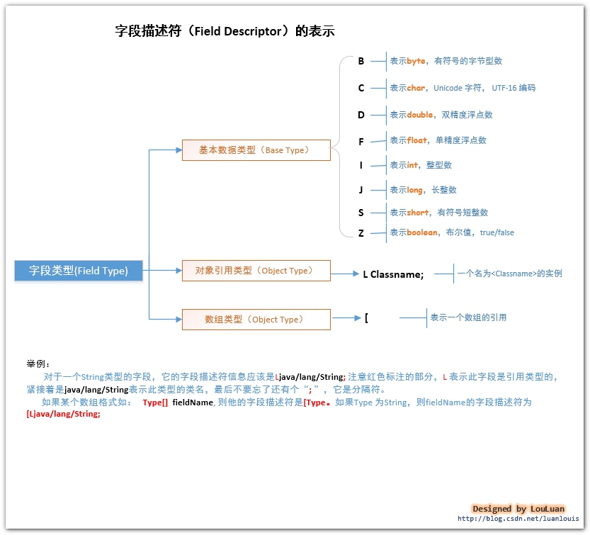


**请注意！！！**

  如果我们在类中定义了field 字段，但是没有在类中的其他地方用到这些字段，它是不会被编译器放到常量池中的。读者可以自己试一下。（当然了，定义了但是没有在类中的其它地方引用到这种情况很少。）

**只有在类中的其他地方****引用****到了，才会将他放到常量池中**。

**NO10.类中引用到的method方法在常量池中是怎样描述的？(****CONSTANT_Methodref_info****, CONSTANT_Name_Type_info)**

   **1.举例：**

​       还是以**Person**类为例。在**Person**类中，我们定义了**setName(String name)、getName()、setAge(int age)、getAge()**这些方法：  

```java
package com.louis.jvm;
 
public class Person {
 
	private String name;
​	private int age;
​	
​	public String getName() {
		return name;
​	}
​	
​	public void setName(String name) {
 ​	     this.name = name;
​	}
	public int getAge() {
		return age;
	}
​	
​	public void setAge(int age) {
		this.age = age;
​	}
​	
}
```

 虽然我们定义了方法，但是这些方法没有在类总的其他地方被用到（即没有在类中其他的方法中引用到），所以它们的方法引用信息并不会放到常量中。

现在我们在类中加一个方法 **getInfo()**，调用了**getName()**和**getAge()** 方法：

```java
public String getInfo()
{
	return getName()+"\t"+getAge();
}
```

这时候**JVM**编译器会将**getName()**和**getAge()**方法的引用信息包装成**CONSTANT_Methodref_info**结构体放入到常量池之中。

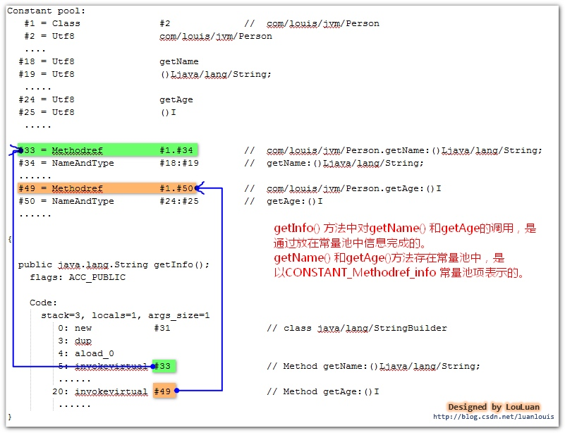


  这里的方法调用的方式牵涉到Java非常重要的一个术语和机制，叫动态绑定。这个动态绑定问题以后在单独谈谈。

 
**2. 怎样表示一个方法引用？**

请看下图：

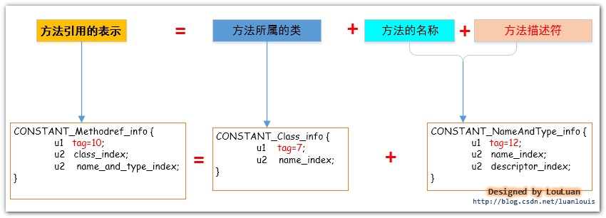

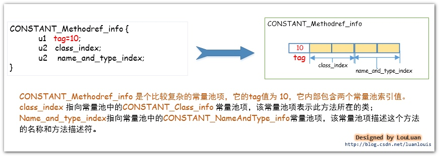

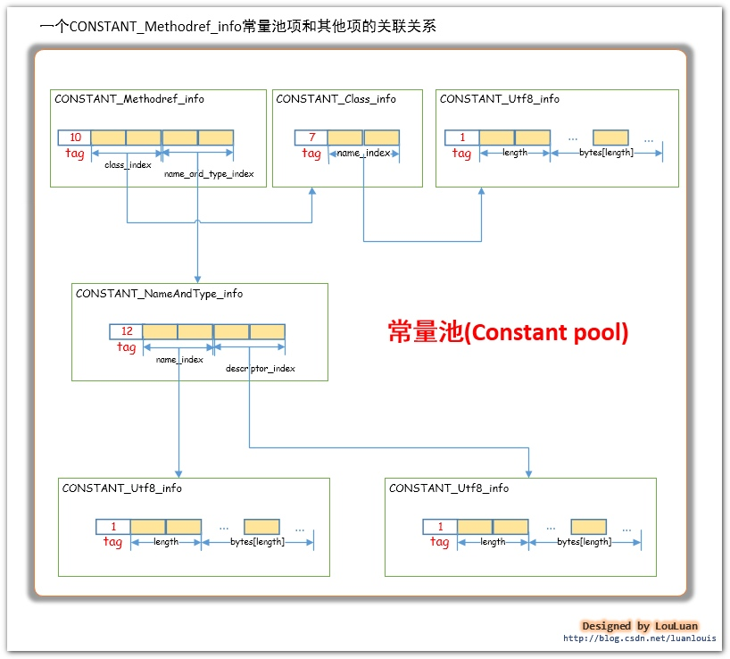


**3. 方法描述符的组成**

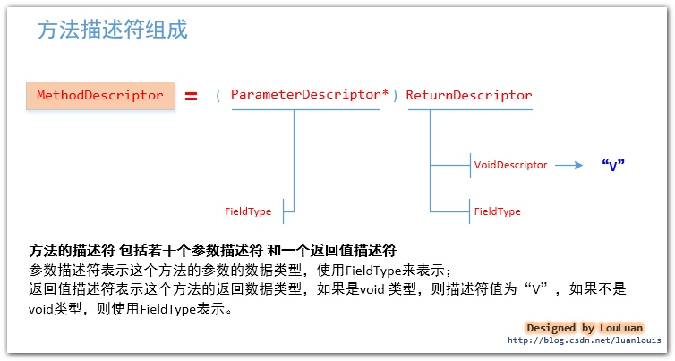

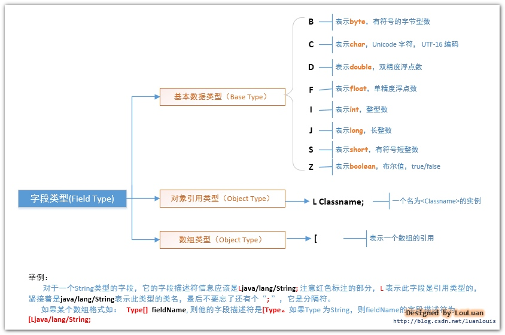


**4. getName() 方法引用在常量池中的表示**

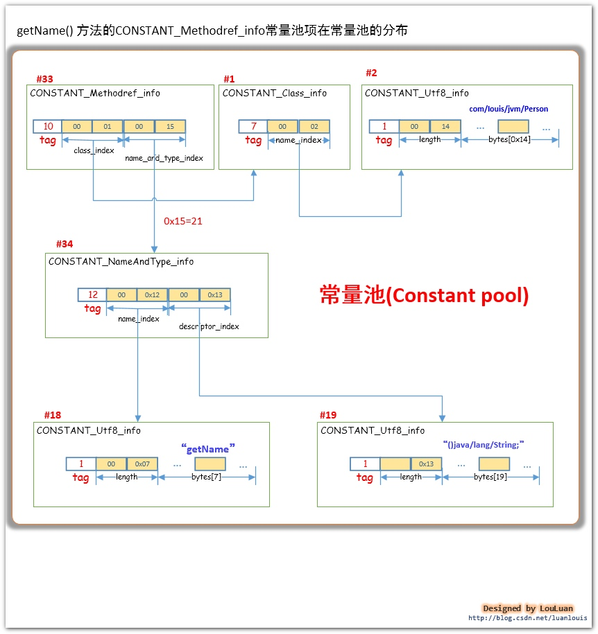

**NO11.类中引用到某个接口中定义的method方法在常量池中是怎样描述的？(****CONSTANT_InterfaceMethodref_info****, CONSTANT_Name_Type_info)**

当我们在某个类中使用到了某个接口中的方法，JVM会将用到的接口中的方法信息方知道这个类的常量池中。

比如我们定义了一个**Worker**接口，和一个**Boss**类，在**Boss**类中调用了**Worker**接口中的方法，这时候在**Boss**类的常量池中会有**Worker**接口的方法的引用表示。

```java
package com.louis.jvm;

*/***
 ** Worker 接口类*
 *** *@author* *luan louis*
 **/*
public interface Worker{
​	
	public void work();
  
}

package com.louis.jvm;
 
*/***
 ** Boss 类，makeMoney()方法 调用Worker 接口的work*
 *** *@author* *louluan*
 **/*
public class Boss {
	
	public void makeMoney(Worker worker)
	{
		worker.work();
​	}
 
}
```

我们对**Boss.class**执行**javap -v Boss**,然后会看到如下信息：

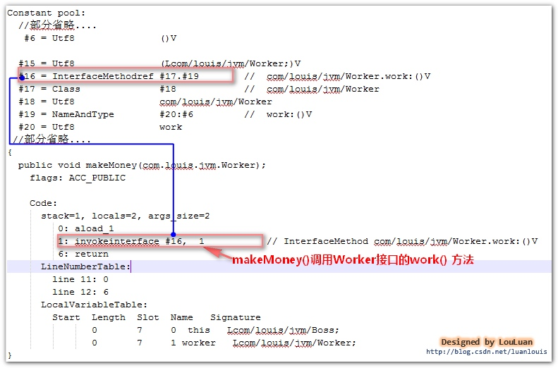


如上图所示，在**Boss**类的**makeMoney()**方法中调用了**Worker**接口的**work()**方法，机器指令是通过**invokeinterface**指令完成的，**invokeinterface**指令后面的操作数，是指向了**Boss**常量池中**Worker**接口的**work()**方法描述，表示的意思就是：“我要调用**Worker**接口的**work()**方法”。

**Worker**接口的**work()**方法引用信息，JVM会使用**CONSTANT_InterfaceMethodref_info**结构体来描述，**CONSTANT_InterfaceMethodref_info**定义如下：

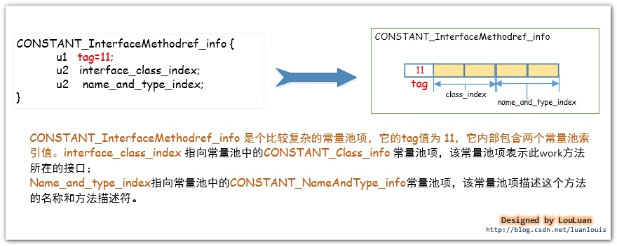


  **CONSTANT_InterfaceMethodref_info**结构体和上面介绍的**CONSTANT_Methodref_info** 结构体很基本上相同，它们的不同点只有：

  1. **CONSTANT_InterfaceMethodref_info** 的tag 值为11，而**CONSTANT_Methodref_info**的tag值为10；

  2. **CONSTANT_InterfaceMethodref_info** 描述的是接口中定义的方法，而**CONSTANT_Methodref_info**描述的是实例类中的方法；

小试牛刀

关于方法的描述,完全相同**CONSTANT_InterfaceMethodref_info**和上述的**CONSTANT_Methodref_info** 结构体完全一致，这里就不单独为**CONSTANT_InterfaceMethodref_info**绘制结构图了，请读者依照**CONSTANT_Methodref_info**的描述，结合本例子关于**Worker**接口和**Boss**类的关系，使用javap -v Boss,查看常量池信息，然后根据常量池信息，自己动手绘制work() 方法在常量池中的结构。

**NO12.CONSTANT_MethodType_info，CONSTANT_MethodHandle_info，CONSTANT_InvokeDynamic_info**

​    如果你从我的《常量池详解》**NO1**节看到了**NO11**节，那么恭喜你，你已经学会了几乎所有的常量池项！只要你掌握了上述的常量池项，你就可以读懂你平常所见到的任何一个**class**文件的常量池了。

​    至于**NO12**所列出来的三项：**CONSTANT_MethodType_info,CONSTANT_MethodHandle_info,CONSTANT_InvokeDynamic_info**，我想对你说，暂时先不管它吧。

​    这三项主要是为了让Java语言支持动态语言特性而在Java 7 版本中新增的三个常量池项，只会在极其特别的情况能用到它，在class文件中几乎不会生成这三个常量池项。  其实我花了一些时间来研究这三项，并且想通过各种方式生成这三项，不过没有成功，最后搞的还是迷迷糊糊的。从我了解到的信息来看，Java 7对动态语言的支持很笨拙，并且当前没有什么应用价值，然后就对着三项的研究先放一放了。）

​    如果读者有兴趣了解这三项，建议读者搜索关于**Java 7 动态语言特性**方面的文章，推荐阅读：

​    [ 探秘Java 7：JVM动态语言支持详解](7：JVM动态语言支持详解)

​    [执行篇：解析JDK 7的动态类型语言支持](http://icyfenix.iteye.com/blog/1392441)