# 1.4 class文件中的字段表集合--field字段在class文件中是怎样组织的

**0.前言**

​     了解JVM虚拟机原理是每一个Java程序员修炼的必经之路。但是由于JVM虚拟机中有很多的东西讲述的比较宽泛，在当前接触到的关于JVM虚拟机原理的教程或者博客中，绝大部分都是充斥的文字性的描述，很难给人以形象化的认知，看完之后感觉还是稀里糊涂的。

​     感于以上的种种，我打算把我在学习JVM虚拟机的过程中学到的东西，结合自己的理解，总结成《Java虚拟机原理图解》 这个系列，以图解的形式，将抽象的JVM虚拟机的知识具体化，希望能够对想了解Java虚拟机原理的的Java程序员 提供点帮助。

读完本文，你将会学到：

1、**类中定义的field字段是如何在class文件中组织的**

2、**不同的数据类型在class文件中是如何表示的**

3、**static final类型的field字段的初始化赋值问题**

**1.概述**

   **字段表集合**是指由若干个**字段表（field_info）**组成的集合。对于在类中定义的若干个字段，经过**JVM**编译成**class**文件后，会将相应的字段信息组织到一个叫做字段表集合的结构中，字段表集合是一个类数组结构，如下图所示：

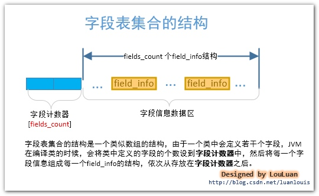

注意：这里所讲的字段是指在类中定义的静态或者非静态的变量，而不是在类中的方法内定义的变量。请注意区别。

比如，如果某个类中定义了5个字段，那么，**JVM**在编译此类的时候，会生成5个**字段表（field_info）**信息,然后将字段表集合中的字段计数器的值设置成5，将5个字段表信息依次放置到字段计数器的后面。

**2. 字段表集合在class文件中的位置**

**字段表集合**紧跟在**class**文件的**接口索引集合**结构的后面，如下图所示：

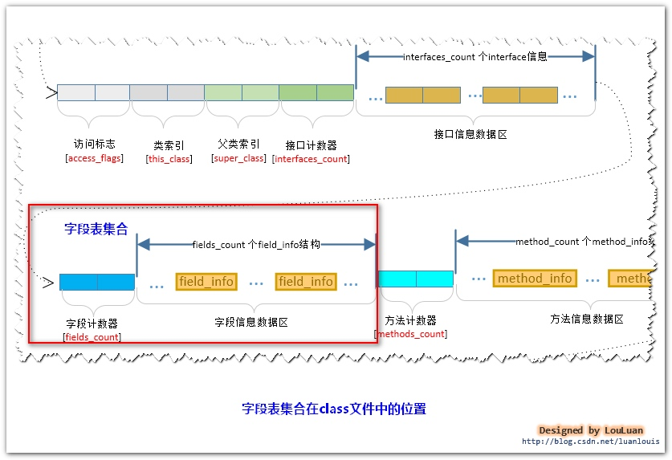

**3. Java中的一个Field字段应该包含那些信息？------字段表field_info结构体的定义**  

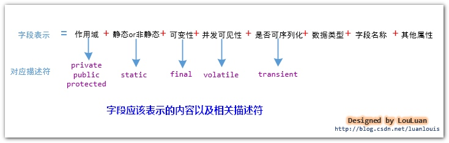

  针对上述的字段表示，**JVM**虚拟机规范规定了**field_info**结构体来描述字段，其表示信息如下：

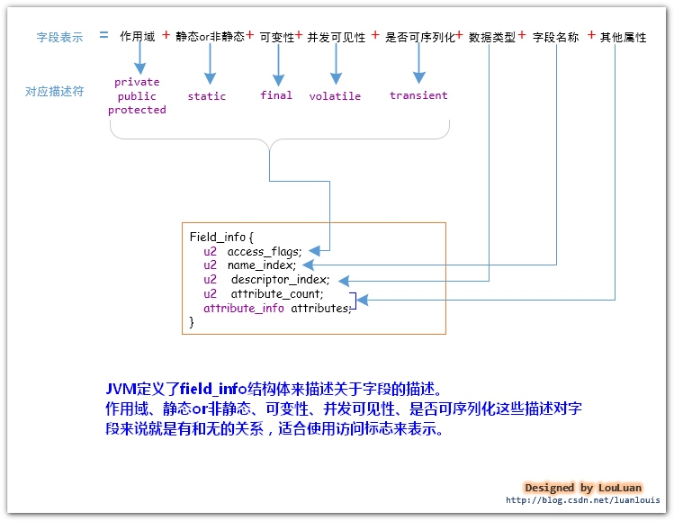

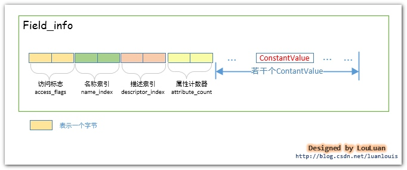

下面我将一一讲解**FIeld_info**的组成元素：**访问标志（access_flags）**、**名称索引（name_index）**、**描述索引（descriptor_index）**、**属性表集合**

 **4. field字段的访问标志**

   如上图所示定义的**field_info**结构体，**field**字段的**访问标志(access_flags)**占有两个字节，它能够表述的信息如下所示：

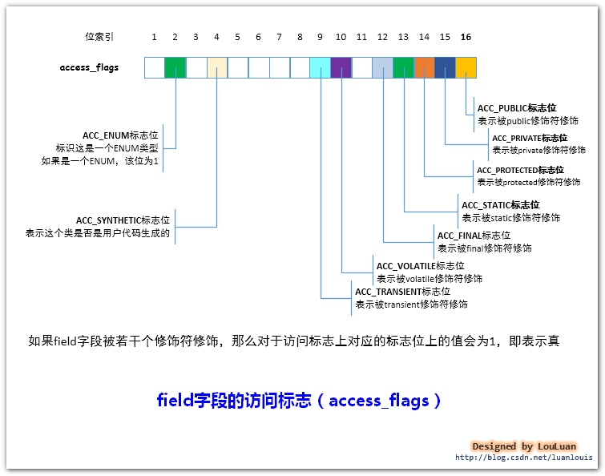

举例：如果我们在某个类中有定义**field**域：private static String str;，那么在访问标志上，第**15**位**ACC_PRIVATE**和第**13**位**ACC_STATIC**标志位都应该为1。**field**域**str**的访问标志信息应该是如下所示：

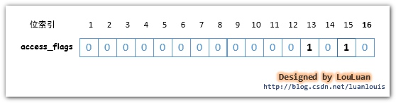

如上图所示，**str**字段的**访问标志**的值为**0x000A**，它由两个修饰符**ACC_PRIVATE**和**ACC_STATIC**组成。

根据给定的**访问标志（access_flags）**，我们可以通过以下运算来得到这个域有哪些修饰符：

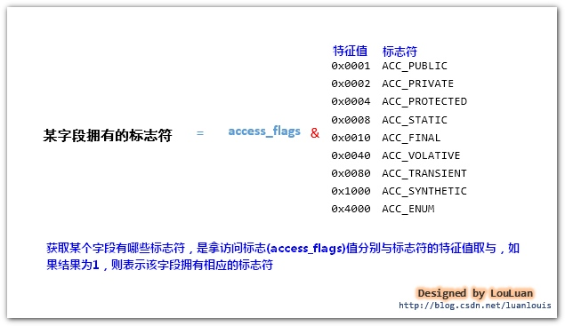

上面列举的str字段的访问标志的值为**000A**，那么分别域上述的标志符的特征值取&，结果为**1**的只有**ACC_PRIVATE**和**ACC_STATIC**，所以该字段的标志符只有有**ACC_PRIVATE**和**ACC_STATIC**。

**5. 字段的数据类型表示和字段名称表示**

**class**文件对数据类型的表示如下图所示：

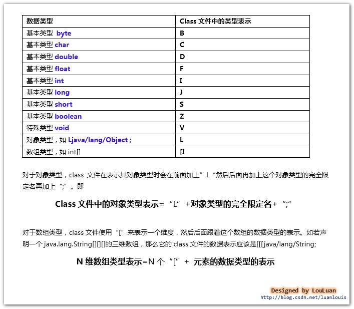

**field**字段名称，我们定义了一个形如**private static String str**的**field**字段，其中"**str**"就是这个字段的名称。

**class**文件将字段名称和**field**字段的数据类型表示作为字符串存储在常量池中。在**field_info**结构体中，紧接着访问标志的，就是字段名称索引和字段描述符索引，它们分别占有两个字节，其内部存储的是指向了常量池中的某个常量池项的索引，对应的常量池项中存储的字符串，分别表示该字段的名称和字段描述符。

**6.属性表集合-----静态field字段的初始化**

在定义**field**字段的过程中，我们有时候会很自然地对**field**字段直接赋值，如下所示：

1. ​	public static final int MAX=100;
2. ​	public  int count=0;

对于虚拟机而言，上述的两个**field**字段赋值的时机是不同的：

- ​    对于非静态（即无**static**修饰）的**field**字段的赋值将会出现在实例构造方法**()**中
- ​    对于静态的**field**字段，有两个选择：1、在静态构造方法**()**中进行；2 、使用**ConstantValue**属性进行赋值

Sun javac编译器对于静态**field**字段的初始化赋值策略

目前的Sun javac编译器的选择是：如果使用**final**和**static**同时修饰一个**field**字段，并且这个字段是基本类型或者**String**类型的，那么编译器在编译这个字段的时候，会在对应的**field_info**结构体中增加一个**ConstantValue**类型的结构体，在赋值的时候使用这个**ConstantValue**进行赋值；如果该**field**字段并没有被**final**修饰，或者不是基本类型或者**String**类型，那么将在类构造方法**()**中赋值。

对于上述的**public static final init MAX=100;**  javac编译器在编译此**field**字段构建**field_info**结构体时，除了访问标志、名称索引、描述符索引外，会增加一个**ConstantValue**类型的属性表。

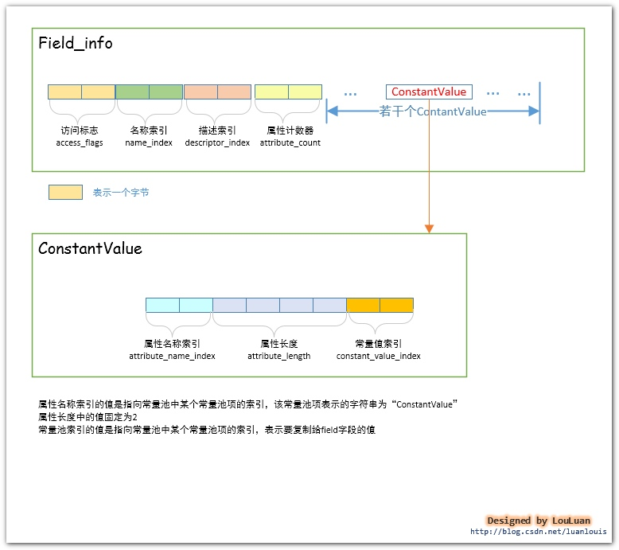

**7.实例解析：**

定义如下一个简单的**Simple**类，然后通过查看**Simple.class**文件内容并结合**javap -v Simple** 生成的常量池内容，分析**str field**字段的结构：

1. package com.louis.jvm;
2.  
3. public class Simple {
4.  
5. ​	private  transient static final String str ="This is a test";
6. }

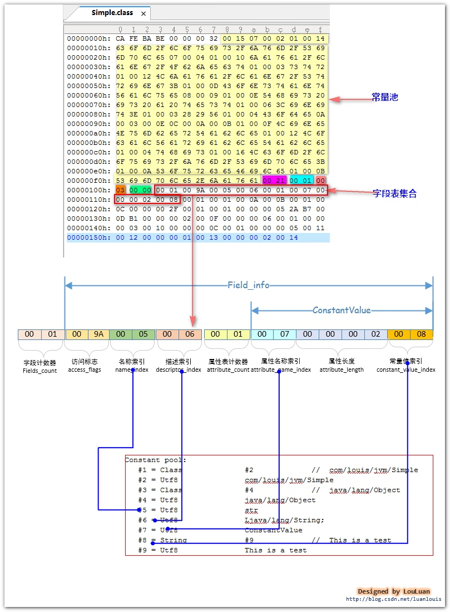

**注：**

1. **字段计数器**中的值为**0x0001**,表示这个类就定义了一个**field字段**

2. **字段的访问标志**是**0x009A**,二进制是**00000000 10011010**，即第**9、12、13、15**位标志位为**1**，这个字段的标志符有：**ACC_TRANSIENT、ACC_FINAL、ACC_STATIC、ACC_PRIVATE;**

3. **名称索引**中的值为**0x0005**,指向了常量池中的第**5**项，为“**str**”,表明这个**field字段**的名称是**str**；

4. **描述索引**中的值为**0x0006**,指向了常量池中的第**6**项，为"**Ljava/lang/String;**"，表明这个**field字段**的数据类型是**java.lang.String**类型；

5. **属性表计数器**中的值为**0x0001,**表明**field_info**还有一个属性表；

6. **属性表名称索引**中的值为**0x0007**,指向常量池中的第**7**项，为“**ConstantValue**”,表明这个属性表的名称是**ConstantValue**，即属性表的类型是**ConstantValue**类型的；

7. 属性长度中的值为**0x0002**，因为此属性表是**ConstantValue**类型，它的值固定为**2**；

8. 常量值索引 中的值为**0x0008**,指向了常量池中的第**8**项，为**CONSTANT_String_info**类型的项，表示“**This is a test**” 的常量。在对此**field**赋值时，会使用此常量对**field**赋值。