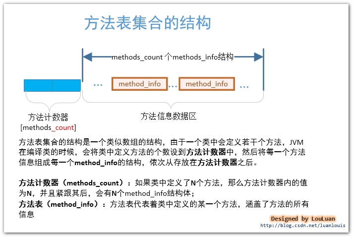
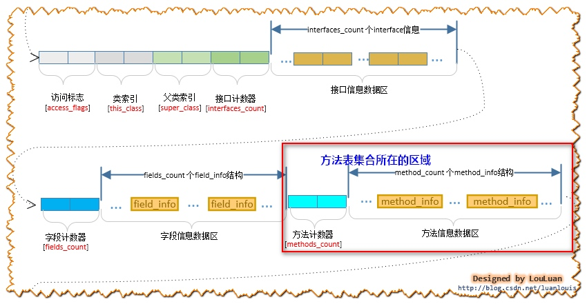
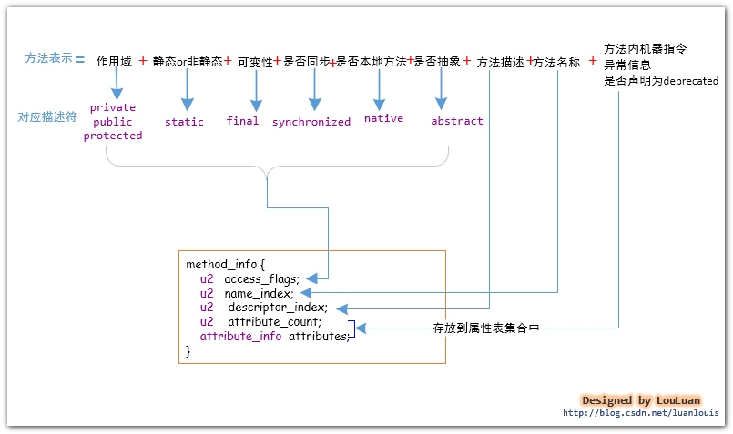
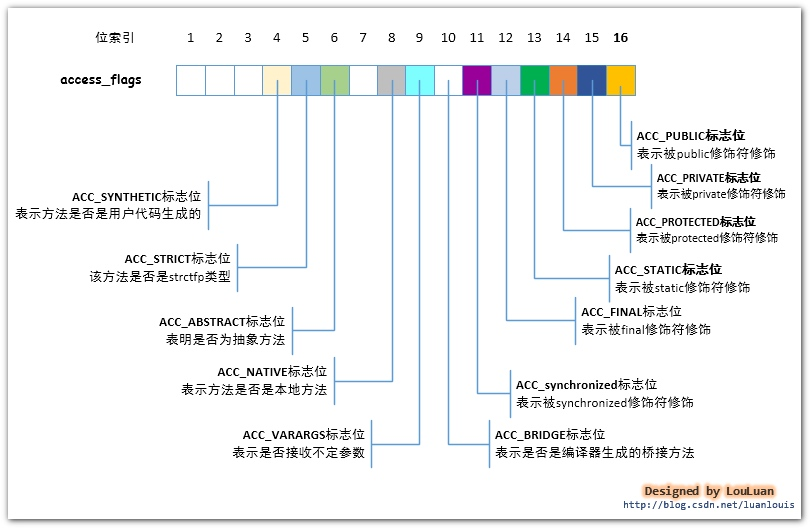
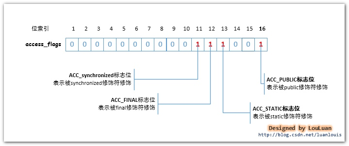
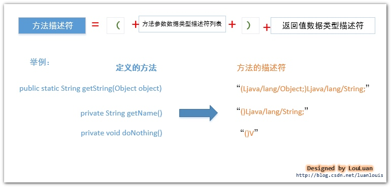
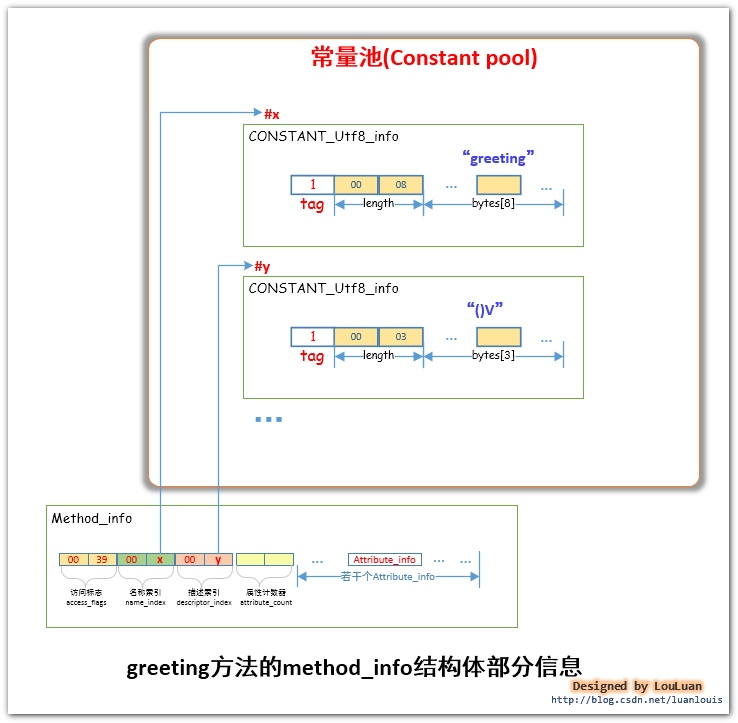
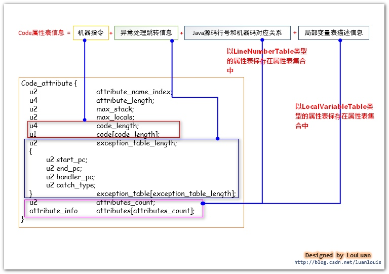
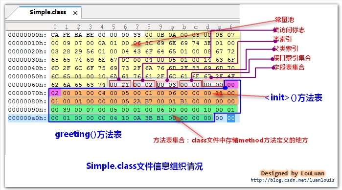
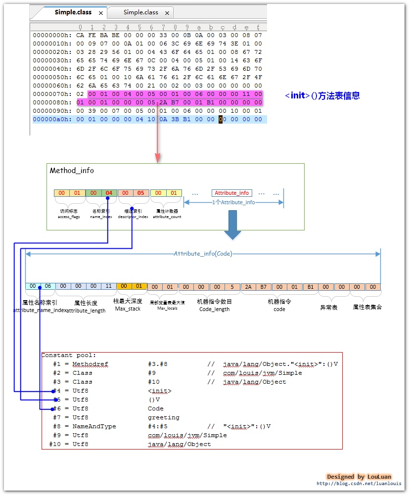

# 1.5、 class文件中的方法表集合--method方法在class文件中是怎样组织的

## **0. 前言**

​     了解JVM虚拟机原理是每一个Java程序员修炼的必经之路。但是由于JVM虚拟机中有很多的东西讲述的比较宽泛，在当前接触到的关于JVM虚拟机原理的教程或者博客中，绝大部分都是充斥的文字性的描述，很难给人以形象化的认知，看完之后感觉还是稀里糊涂的。

​     感于以上的种种，我打算把我在学习JVM虚拟机的过程中学到的东西，结合自己的理解，总结成《Java虚拟机原理图解》 这个系列，以图解的形式，将抽象的JVM虚拟机的知识具体化，希望能够对想了解Java虚拟机原理的的Java程序员 提供点帮助。

读完本文，你将会学到：

* **1、类中定义的method方法是如何在class文件中组织的**

* **2、method方法的表示-方法表集合在class文件的什么位置**

* **3、类中的method方法的实现代码---即机器码指令存放到哪了，并初步了解机器指令**

* **4. 为什么没有在类中定义自己的构造函数，却可以使用new ClassName()构造函数创建对象**

* **5. IDE代码提示功能的基本原理**

## **1.概述**

   **方法表集合**是指由若干个**方法表（method_info）**组成的集合。对于在类中定义的若干个，经过**JVM**编译成**class**文件后，会将相应的**method**方法信息组织到一个叫做**方法表集合**的结构中，**字段表集合**是一个类数组结构，如下图所示：




**2. method方法的描述-方法表集合在class文件中的位置**

​      **method**方法的描述-**方法表集合**紧跟在**字段表集合**的后面（想了解**字段表集合**的读者可以[点击我查看](http://blog.csdn.net/luanlouis/article/details/41046443)），如下图所示：

   


接下来让我们看看**Method_info** 结构体是怎么组织**method**方法信息的:

**3. 一个类中的method方法应该包含哪些信息？----method_info结构体的定义**

​      对于一个方法的表示，我们根据我们可以概括的信息如下所示：

   


   实际上**JVM**还会对**method**方法的描述添加其他信息，我们将在后面详细讨论。如上图中的**method_info结构体**的定义，该结构体的定义跟描述**field字段** 的**field_info结构体**的结构几乎完全一致,如下图所示。

​    


  方法表的结构体由：**访问标志(access_flags)、名称索引(name_index)、描述索引(descriptor_index)、属性表(attribute_info)集合**组成。

**访问标志(access_flags)：**

**method_info结构体**最前面的**两个字节**表示的**访问标志（access_flags）**，记录这这个方法的作用域、静态or非静态、可变性、是否可同步、是否本地方法、是否抽象等信息，实际上不止这些信息，我们后面会详细介绍访问标志这两个字节的每一位具体表示什么意思。

**名称索引(name_index)：**

紧跟在访问标志（access_flags）后面的**两个字节**称为**名称索引**，这两个字节中的值指向了常量池中的某一个常量池项，这个方法的名称以UTF-8格式的字符串存储在这个**常量池项**中。如public void methodName(),很显然，“methodName”则表示着这个方法的名称，那么在常量池中会有一个CONSTANT_Utf8_info格式的常量池项，里面存储着“methodName”字符串，而mehodName()方法的方法表中的名称索引则指向了这个常量池项。

**描述索引(descriptor_index)：**

**描述索引表示的是这个方法的特征或者说是签名**，**一个方法会有若干个参数和返回值**，而若干个参数的数据类型和返回值的数据类型构成了这个方法的描述，其基本格式为：   **(参数数据类型描述列表)返回值数据类型**  。我们将在后面继续讨论。

**属性表(attribute_info)集合：**

  这个属性表集合非常重要，方法的实现被JVM编译成JVM的**机器码指令**，**机器码指令**就存放在一个**Code**类型的属性表中；如果方法声明要抛出异常，那么异常信息会在一个**Exceptions**类型的属性表中予以展现。**Code**类型的属性表可以说是非常复杂的内容，也是本文最难的地方。

*接下来，我们将一一击破它们，看看它们到底是怎么表示的。*

**4. 访问标志(access_flags)---记录着method方法的访问信息**

访问标志（**access_flags**）共占有**2** 个字节，分为 **16** 位，这 **16**位 表示的含义如下所示：




举例：某个类中定义了如下方法：

```java
public static synchronized final void greeting(){
}
```

**greeting()**方法的修饰符有：public、static、synchronized、final 这几个修饰符修饰，那么相对应地，**greeting()**方法的访问标志中的ACC_PUBLIC、ACC_STATIC、ACC_SYNCHRONIZED、ACC_FINAL标志位都应该是**1**，即：




从上图中可以看出**访问标志**的值应该是二进制**00000000 00111001,即十六进制0x0039**。我们将在文章的最后一个例子中证实这里点。

**5. 名称索引和描述符索引----一个方法的签名**

  紧接着**访问标志（access_flags）**后面的**两个字节**，叫做**名称索引**(**name_index**)，这两个字节中的值是指向了常量池中某个常量池项的索引，该常量池项表示这这个方法名称的字符串。

  **方法描述符索引(descrptor_index)**是紧跟在**名称索引**后面的两个字节，这两个字节中的值跟名称索引中的值性质一样，都是指向了常量池中的某个常量池项。这两个字节中的指向的常量池项，**是表示了方法描述符的字符串**。

  **所谓的方法描述符，实质上就是指用一个什么样的字符串来描述一个方法，**方法描述符的组成如下图所示：




​        关于不同的**数据类型的描述符**是怎样的，我已经在[《Java虚拟机原理图解》1.4 class文件中的字段表集合--field字段在class文件中是怎样组织的](http://blog.csdn.net/luanlouis/article/details/41046443) 第五部分字段的数据类型表示和字段名称表示 进行过详细的阐释，感兴趣的读者可以前去查看。

​     

​      举例：对于如下定义的的**greeting()**方法，我们来看一下对应的**method_info**结构体中的名称索引和描述符索引信息是怎样组织的。

```java
public static synchronized final void greeting(){
}
```

​       如下图所示,**method_info**结构体的名称索引中存储了一个索引值**x**，指向了常量池中的第**x**项，第 **x**项表示的是字符串"**greeting**",即表示该方法名称是"**greeting**"；描述符索引中的**y** 值指向了常量池的第**y**项，该项表示字符串"**()V**"，即表示该方法没有参数，返回值是**void**类型。




**6.属性表集合--记录方法的机器指令和抛出异常等信息**

​     属性表集合记录了某个方法的一些属性信息，这些信息包括：

- 这个方法的代码实现，即**方法的可执行的机器指令**
- 这个方法声明的**要抛出的异常信息**
- 这个方法是否**被@deprecated注解表示**
- 这个方法是否是**编译器自动生成的**

​    **属性表（attribute_info）**结构体的一般结构如下所示：

​        


**6.1 Code类型的属性表--method方法中的机器指令的信息**

   **Code**类型的**属性表(****attribute_info****)**可以说是**class**文件中最为重要的部分，因为它包含的是**JVM**可以运行的机器码指令，**JVM**能够运行这个类，就是从这个属性中取出机器码的。除了要执行的机器码，它还包含了一些其他信息，如下所示：




**Code属性表**的组成部分：

**机器指令----code：**

目前的**JVM**使用一个字节表示机器操作码，即对**JVM**底层而言，它能表示的机器操作码不多于**2**的 **8** 次方，即 **256**个。**class**文件中的机器指令部分是**class**文件中最重要的部分，并且非常复杂，本文的重点不止介绍它，我将专门在一片博文中讨论它，敬请期待。

**异常处理跳转信息---exception_table：**

如果代码中出现了**try{}catch{}**块，那么**try{}**块内的机器指令的地址范围记录下来，并且记录对应的**catch{}**块中的起始机器指令地址，当运行时在**try**块中有异常抛出的话，**JVM**会将**catch{}**块对应懂得其实机器指令地址传递给**PC寄存器**，从而实现指令跳转；

**Java源码行号和机器指令的对应关系---LineNumberTable属性表：**

**编译器在将java源码编译成class文件时，会将源码中的语句行号跟编译好的机器指令关联起来，这样的class文件加载到内存中并运行时，如果抛出异常，JVM可以根据这个对应关系，抛出异常信息，告诉我们我们的源码的多少行有问题，方便我们定位问题。**这个信息不是运行时必不可少的信息，但是默认情况下，编译器会生成这一项信息，如果你项取消这一信息，你可以使用**-g:none** 或**-g:lines**来取消或者要求设置这一项信息。如果使用了**-g:none**来生成class文件，**class文件中将不会有LineNumberTable属性表，造成的影响就是 将来如果代码报错，将无法定位错误信息报错的行，并且如果项调试代码，将不能在此类中打断点（因为没有指定行号。）**

**局部变量表描述信息----LocalVariableTable属性表：**

局部变量表信息会记录栈帧局部变量表中的变量和**java**源码中定义的变量之间的关系，这个信息不是运行时必须的属性，默认情况下不会生成到**class**文件中。你可以根据**javac**指令的**-g:none**或者**-g:vars**选项来取消或者设置这一项信息。

**它有什么作用呢？** 当我们使用IDE进行开发时，最喜欢的莫过于它们的代码提示功能了。如果在项目中引用到了第三方的jar包，而第三方的包中的class文件中有无**LocalVariableTable**属性表的区别如下所示：


Code属性表结构体的解释：

1.**attribute_name_index****,属性名称索引**，占有**2**个字节，其内的值指向了常量池中的某一项，该项表示字符串“**Code**”;

\2. **attribute_length****,属性长度**，占有 **4**个字节，其内的值表示后面有多少个字节是属于此Code属性表的；

\3. **max_stack,****操作数栈深度的最大值**，占有 **2** 个字节，在方法执行的任意时刻，操作数栈都不应该超过这个值，虚拟机的运行的时候，会根据这个值来设置该方法对应的**栈帧(Stack Frame)**中的操作数栈的深度；

\4. **max_locals**,**最大局部变量数目，**占有 **2**个字节，其内的值表示局部变量表所需要的存储空间大小；

\5. **code_length**,**机器指令长度**，占有 **4** 个字节，表示跟在其后的多少个字节表示的是机器指令；

\6. **code,****机器指令区域**，该区域占有的字节数目由 **code_length**中的值决定。JVM最底层的要执行的机器指令就存储在这里；

\7. **exception_table_length**,**显式异常表长度**，占有**2**个字节，如果在方法代码中出现了try{} catch()形式的结构，该值不会为空，紧跟其后会跟着若干个**exception_table**结构体，以表示异常捕获情况；

\8. **exception_table**，**显式异常表**，占有**8** 个字节，**start_pc,end_pc,handler_pc**中的值都表示的是**PC**计数器中的指令地址。**exception_table**表示的意思是：如果字节码从第**start_pc**行到第**end_pc**行之间出现了**catch_type**所描述的异常类型，那么将跳转到**handler_pc**行继续处理。

\9. **attribute_count,****属性计数器**，占有 **2** 个字节，表示**Code**属性表的其他属性的数目

\10. **attribute_info**,表示**Code****属性表**具有的属性表，它主要分为两个类型的属性表：“**LineNumberTable**”类型和“**LocalVariableTable**”类型。

“**LineNumberTable**”类型的属性表记录着**Java**源码和机器指令之间的对应关系

“**LocalVariableTable**”类型的属性表记录着局部变量描述

**举例：**

  *如下定义Simple类，使用javac -g:none Simple.java 编译出Simple.class 文件，并使用javap -v Simple > Simple.txt 查看反编译的信息，然后看Simple.class文件中的方法表集合是怎样组织的：*

```java
package com.louis.jvm;

public class Simple {

	public static synchronized final void greeting(){
		int a = 10;
​	}
}
```

**1. Simple.class文件组织信息如下所示：**




如上所示，方法表集合使用了蓝色线段圈了起来。

请注意：方法表集合的头两个字节，即**方法表计数器（****method_count****）**的值是**0x0002**，它表示该类中有**2** 个方法。细心的读者会注意到，我们的**Simple.java**中就定义了一个greeting()方法，为什么**class**文件中会显示有两个方法呢？？

在**Simple.classz中**出现了两个方法表，分别代表构造方法**()**和 **greeting()**方法，现在让我们分别来讨论这两个方法：

**2. Simple.class 中的() 方法:**




 **解释：**

     1. **方法访问标志(****access_flags****)**： 占有 **2**个字节，值为**0x0001**,即标志位的第 **16** 位为 **1**，所以该**()**方法的修饰符是：**ACC_PUBLIC**;
    
     2. **名称索引(****name_index****)**： 占有 **2** 个字节，值为 **0x0004**，指向常量池的第 **4**项，该项表示字符串“****”，即该方法的名称是“****”;
    
     3. **.描述符索引(****descriptor_index****)**: 占有 **2** 个字节，值为**0x0005**,指向常量池的第 **5** 项，该项表示字符串“**()V**”，即表示该方法不带参数，并且无返回值（构造函数确实也没有返回值）；
    
    4. **属性计数器（****attribute_count****):** 占有 **2** 个字节，值为**0x0001**,表示该方法表中含有一个属性表，后面会紧跟着一个属性表；
    
    5. **属性表的名称索引(****attribute_name_index****)**：占有 **2** 个字节，值为**0x0006**,指向常量池中的第**6** 项，该项表示字符串“**Code**”，表示这个属性表是**Code**类型的属性表；
    
    6. **属性长度（****attribute_length****）**：占有**4**个字节，值为**0x0000 0011**，即十进制的 **17**，表明后续的 **17** 个字节可以表示这个**Code**属性表的属性信息；
    
    7. **操作数栈的最大深度（****max_stack****）**：占有**2**个字节，值为**0x0001**,表示栈帧中操作数栈的最大深度是**1**；
    
    8. **局部变量表的最大容量（****max_variable****）**：占有**2**个字节，值为**0x0001**, **JVM**在调用该方法时，根据这个值设置栈帧中的局部变量表的大小；
    
    9. **机器指令数目(****code_length****)**：占有**4**个字节，值为**0x0000 0005**,表示后续的**5** 个字节 **0x2A 、0xB7、 0x00、0x01、0xB1**表示机器指令;
    
    10. **机器指令集(****code[code_length]****)**：这里共有 **5**个字节，值为**0x2A 、0xB7、 0x00、0x01、0xB1**；
    
    11. **显式异常表集合（****exception_table_count****）**： 占有**2** 个字节，值为**0x0000**,表示方法中没有需要处理的异常信息；
    
    12. **Code属性表的属性表集合（****attribute_count****）**： 占有**2** 个字节，值为**0x0000**，表示它没有其他的属性表集合，因为我们使用了**-g:none** 禁止编译器生成**Code****属性表**的 **LineNumberTable 和LocalVariableTable**;