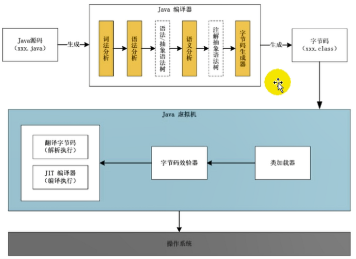
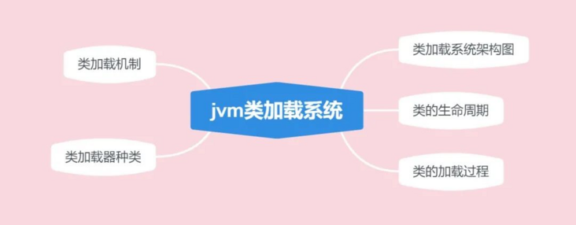
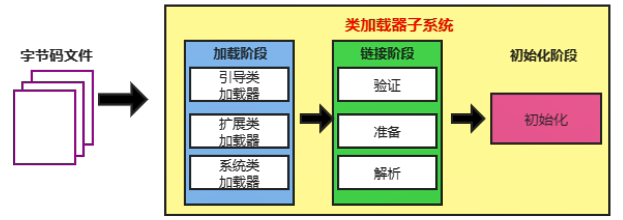
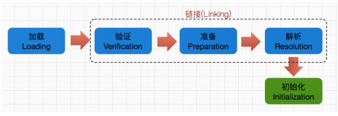
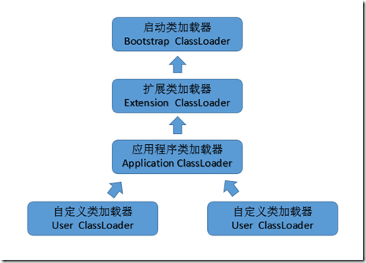
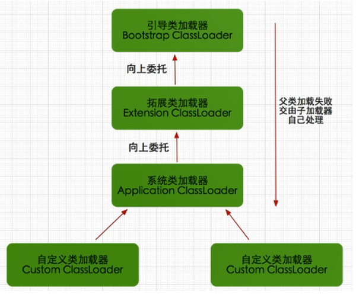
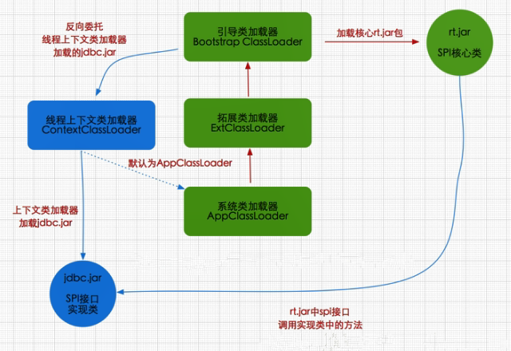

<h1 align="center">jvm类加载器，类加载机制详解</h1>

[TOC]

## 前言

今天我们来讲讲`jvm`里`类加载`的过程，我们写了那么多类，却不知道类的加载过程，岂不是很`尴尬`。

`jvm`的启动是通过引导类加载器（bootstrap class loader）创建一个初始类（initial class）来完成的，这个类是由`jvm`的具体实现指定的。[来自官方规范]

jvm组成结构之一就是`类装载器子系统`，我们今天就来仔细讲讲这个组件。

## Java代码执行流程图

大家通过这个流程图，了解一下我们写好的Java代码是如何执行的，其中要经历`类加载器`这个流程，我们就来仔细讲讲这里面的知识点。



## 类加载子系统



### 类加载系统架构图

暂时看不懂这两张图没关系，跟着`老哥`往下看



### 类的生命周期

类的生命周期包括：加载、链接、初始化、使用和卸载，其中`加载`、`链接`、`初始化`，属于`类加载的过程`，我们下面仔细讲解。使用是指我们new对象进行使用，卸载指对象被垃圾回收掉了。

### 类加载的过程



- **第一步：Loading加载**

> 通过类的全限定名（包名 + 类名），获取到该类的.class文件的二进制字节流
>
> 将二进制字节流所代表的静态存储结构，转化为方法区运行时的数据结构
>
> 在`内存`中生成一个代表该类的`java.lang.Class`对象，作为方法区这个类的各种数据的访问入口

总结：`加载二进制数据到内存` —> `映射成jvm能识别的结构` —> `在内存中生成class文件`。

- **第二步：Linking链接**

链接是指将上面创建好的class类合并至Java虚拟机中，使之能够执行的过程，可分为`验证`、`准备`、`解析`三个阶段。

**① 验证（Verify）**

> 确保class文件中的字节流包含的信息，符合当前虚拟机的要求，保证这个被加载的class类的正确性，不会危害到虚拟机的安全。

**② 准备（Prepare）**

> 为类中的`静态字段`分配内存，并设置默认的初始值，比如int类型初始值是0。被final修饰的static字段不会设置，因为final在编译的时候就分配了

**③ 解析（Resolve）**

> 解析阶段的目的，是将常量池内的符号引用转换为直接引用的过程（将常量池内的符号引用解析成为实际引用）。如果符号引用指向一个未被加载的类，或者未被加载类的字段或方法，那么解析将触发这个类的加载（但未必触发这个类的链接以及初始化。）
>
> 事实上，解析器操作往往会伴随着 JVM 在执行完初始化之后再执行。 符号引用就是一组符号来描述所引用的目标。符号引用的字面量形式明确定义在《Java 虚拟机规范》的Class文件格式中。直接引用就是直接指向目标的指针、相对偏移量或一个间接定位到目标的句柄。
>
> 解析动作主要针对类、接口、字段、类方法、接口方法、方法类型等。对应常量池中的 CONSTANT_Class_info、CONSTANT_Fieldref_info、CONSTANT_Methodref_info等。

- **第三步：initialization初始化**

> 初始化就是执行类的构造器方法init()的过程。
>
> 这个方法不需要定义，是javac编译器自动收集类中所有类变量的赋值动作和静态代码块中的语句合并来的。
>
> 若该类具有父类，`jvm`会保证父类的`init`先执行，然后在执行子类的`init`。

### 类加载器的分类



- **第一个：启动类/引导类：Bootstrap ClassLoader**

> 这个类加载器使用C/C++语言实现的，嵌套在JVM内部，java程序无法直接操作这个类。
>
> 它用来加载Java核心类库，如：`JAVA_HOME/jre/lib/rt.jar`、`resources.jar`、`sun.boot.class.path`路径下的包，用于提供jvm运行所需的包。
>
> 并不是继承自java.lang.ClassLoader，它没有父类加载器
>
> 它加载`扩展类加载器`和`应用程序类加载器`，并成为他们的父类加载器
>
> 出于安全考虑，启动类只加载包名为：java、javax、sun开头的类

- **第二个：扩展类加载器：Extension ClassLoader**

> Java语言编写，由sun.misc.Launcher$ExtClassLoader实现，我们可以用Java程序操作这个加载器派生继承自java.lang.ClassLoader，父类加载器为`启动类加载器`
>
> 从系统属性：`java.ext.dirs`目录中加载类库，或者从JDK安装目录：`jre/lib/ext`目录下加载类库。我们就可以将我们自己的包放在以上目录下，就会自动加载进来了。

- **第三个：应用程序类加载器：Application Classloader**

> Java语言编写，由sun.misc.Launcher$AppClassLoader实现。
>
> 派生继承自java.lang.ClassLoader，父类加载器为`启动类加载器`
>
> 它负责加载`环境变量classpath`或者`系统属性java.class.path`指定路径下的类库
>
> 它是程序中默认的类加载器，我们Java程序中的类，都是由它加载完成的。
>
> 我们可以通过`ClassLoader#getSystemClassLoader()`获取并操作这个加载器

- **第四个：自定义加载器**

> 一般情况下，以上3种加载器能满足我们日常的开发工作，不满足时，我们还可以`自定义加载器`
>
> 比如用网络加载Java类，为了保证传输中的安全性，采用了加密操作，那么以上3种加载器就无法加载这个类，这时候就需要`自定义加载器`

**自定义加载器实现步骤**

> 继承`java.lang.ClassLoader`类，重写findClass()方法
>
> 如果没有太复杂的需求，可以直接继承`URLClassLoader`类，重写`loadClass`方法，具体可参考`AppClassLoader`和`ExtClassLoader`。

**获取ClassLoader几种方式**

它是一个抽象类，其后所有的类加载器继承自 ClassLoader（不包括启动类加载器）

```
// 方式一：获取当前类的 ClassLoader
clazz.getClassLoader()
// 方式二：获取当前线程上下文的 ClassLoader
Thread.currentThread().getContextClassLoader()
// 方式三：获取系统的 ClassLoader
ClassLoader.getSystemClassLoader()
// 方式四：获取调用者的 ClassLoader
DriverManager.getCallerClassLoader()
```

### 类加载机制—双亲委派机制

jvm对class文件采用的是按需加载的方式，当需要使用该类时，jvm才会将它的class文件加载到内存中产生class对象。

在加载类的时候，是采用的`双亲委派机制`，即把请求交给父类处理的一种任务委派模式。



- **工作原理**

（1）如果一个`类加载器`接收到了`类加载`的请求，它自己不会先去加载，会把这个请求委托给`父类加载器`去执行。

（2）如果父类还存在父类加载器，则继续向上委托，一直委托到`启动类加载器：Bootstrap ClassLoader`

（3）如果父类加载器可以完成加载任务，就返回成功结果，如果父类加载失败，就由子类自己去尝试加载，如果子类加载失败就会抛出`ClassNotFoundException`异常，这就是`双亲委派模式`

- **第三方包加载方式：反向委派机制**

在Java应用中存在着很多服务提供者接口（Service Provider Interface，SPI），这些接口允许第三方为它们提供实现，如常见的 SPI 有 JDBC、JNDI等，这些 SPI 的接口属于 Java 核心库，一般存在rt.jar包中，由Bootstrap类加载器加载。而Bootstrap类加载器无法直接加载SPI的实现类，同时由于双亲委派模式的存在，Bootstrap类加载器也无法反向委托AppClassLoader加载器SPI的实现类。在这种情况下，我们就需要一种特殊的类加载器来加载第三方的类库，而线程上下文类加载器（双亲委派模型的破坏者）就是很好的选择。

从图可知rt.jar核心包是有Bootstrap类加载器加载的，其内包含SPI核心接口类，由于SPI中的类经常需要调用外部实现类的方法，而jdbc.jar包含外部实现类(jdbc.jar存在于classpath路径)无法通过Bootstrap类加载器加载，因此只能委派线程上下文类加载器把jdbc.jar中的实现类加载到内存以便SPI相关类使用。显然这种线程上下文类加载器的加载方式破坏了“双亲委派模型”，它在执行过程中抛弃双亲委派加载链模式，使程序可以逆向使用类加载器，当然这也使得Java类加载器变得更加灵活。



- **沙箱安全机制**

自定义 String 类，但是在加载自定义 String 类的时候会率先使用引导类加载器加载，而引导类加载器在加载的过程中会先加载 JDK 自带的文件（rt.jar 包中的 javalangString.class），报错信息说没有 main 方法就是因为加载的 rt.jar 包中的 String 类。这样可以保证对 Java 核心源代码的保护，这就是沙箱安全机制。


## 链接

[jvm类加载器，类加载机制详解](https://segmentfault.com/a/1190000037574626)

