<h1 align="center">万字精美图文带你掌握JVM垃圾回收</h1>

## 前言

往期文章：

- [带你掌握JVM类加载机制](https://juejin.im/post/6844904035082846215)
- [🔥精美图文带你掌握 JVM内存布局](https://juejin.im/post/6844904033396719624)

垃圾回收（ Garbage Collection 以下简称 GC）诞生于1960年 MIT 的 Lisp 语言，有半个多世纪的历史。在Java 中，JVM 会对内存进行自动分配与回收，其中 GC 的主要作用就是**清楚不再使用的对象，自动释放内存**。

GC 相关的研究者们主要是思考这3件事情。

- 哪些内存需要回收？
- 什么时候回收？
- 如何回收？

本文也大致按照这个思路，为大家描述垃圾回收的相关知识。因为会有很多内存区域相关的知识，希望读者先学习完[精美图文带你掌握 JVM 内存布局](http://ricstudio.top/archives/jvm_memory_structure)再来阅读本文。

> 在这里先感谢周志明大佬的新鲜出炉的大作：《深入理解Java 虚拟机》- 第3版
>
> 拜读之后对JVM有了更深的理解，强烈推荐大家去看。

本文的主要内容如下（建议大家在阅读和学习的时候，也大致按照以下的思路来思考和学习）：

- 哪些内存需要回收？即GC 发生的内存区域？

- 如何判断这个对象需要回收？即**GC 的存活标准**？

   这里又能够引出以下的知识概念：

   - 引用计数法
   - **可达性分析法**
   - 引用的种类和特点、区别 **（强引用、软引用、弱引用、虚引用）** 
   - 延伸知识：(WeakHashMap) (引用队列)

- 有了对象的存活标准之后，我们就需要知道**GC 的相关算法（思想）**

   - **标记-清除（Mark-Sweep）算法**
   - **复制（Copying）算法**
   - **标记-整理（Mark-Compact）算法**

- 在下一步学习之前，还需要知道一些**GC的术语**📖，防止对一些概念描述出现混淆

- 知道了算法之后，自然而然我们到了JVM中对这些算法的实现和应用，即各种**垃圾收集器（Garbage Collector）**

   - 串行收集器
   - 并行收集器
   - ⭐**CMS 收集器** 
   - ⭐**G1 收集器**

## 一、GC 的 目标区域

> 一句话：GC 主要关注 堆和方法区

在[精美图文带你掌握 JVM 内存布局](http://ricstudio.top/archives/jvm_memory_structure)一文中，理解介绍了Java 运行时内存的分布区域和特点。

其中我们知道了程序计数器、虚拟机栈、本地方法栈3个区域是随线程而生，随线程而灭的。栈中的栈帧随着方法的进入和退出而有条不紊地执行着出栈和入栈操作。每一个栈帧中分配多少内存基本上是在类结构确定下来时就已知的（尽管在运行期会由JIT编译器进行一些优化，但在本章基于概念模型的讨论中，大体上可以认为是编译期可知的），因此这几个区域的内存分配和回收都具备确定性，在**这几个区域内就不需要过多考虑回收的问题，因为方法结束或者线程结束时，内存自然就跟随着回收**了。

而**堆和方法区**则不一样，一个接口中的多个实现类需要的内存可能不一样，一个方法中的多个分支需要的内存也可能不一样，我们**只有在程序处于运行期间时才能知道会创建哪些对象**，这部分内存的分配和回收都是**动态**的。GC 关注的也就是这部分的内存区域。

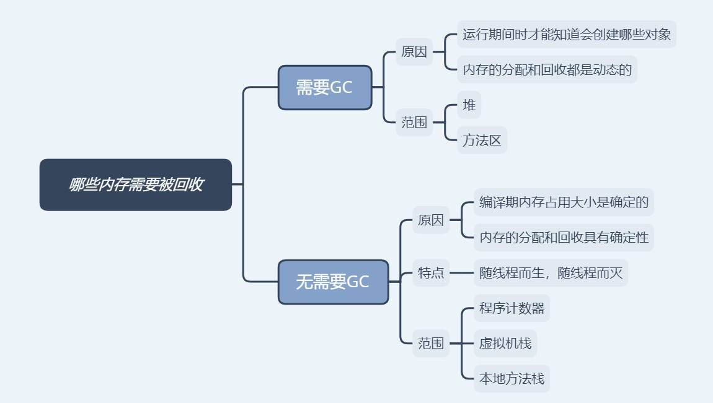

## 二、GC 的存活标准

知道哪些区域的内存需要被回收之后，我们自然而然地想到了，如何去判断一个对象需要被回收呢？（回收对象...没对象的我听着怎么有点怪怪的😂）

对于如何判断对象是否可以回收，有两种比较经典的判断策略。

- 引用计数算法
- 可达性分析算法

### 1. 引用计数法

在对象头维护着一个 counter 计数器，对象被引用一次则计数器 +1；若引用失效则计数器 -1。当计数器为 0 时，就认为该对象无效了。

主流的Java虚拟机里面没有选用引用计数算法来管理内存，其中最主要的原因是它很难解决对象之间相互循环引用的问题。发生循环引用的对象的引用计数永远不会为0，结果这些对象就永远不会被释放。

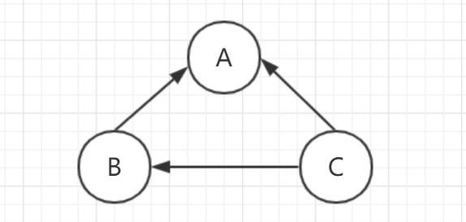

### 2. 可达性分析算法 ⭐

从**GC Roots 为起点**开始向下搜索，搜索所走过的路径称为引用链。**当一个对象到GC Roots 没有任何引用链相连时，则证明此对象是不可用的。不可达对象。**

Java 中，GC Roots 是指：

- **Java 虚拟机栈（栈帧中的本地变量表）中引用的对象**
- **本地方法栈中引用的对象**
- **方法区中常量引用的对象**
- **方法区中类静态属性引用的对象**

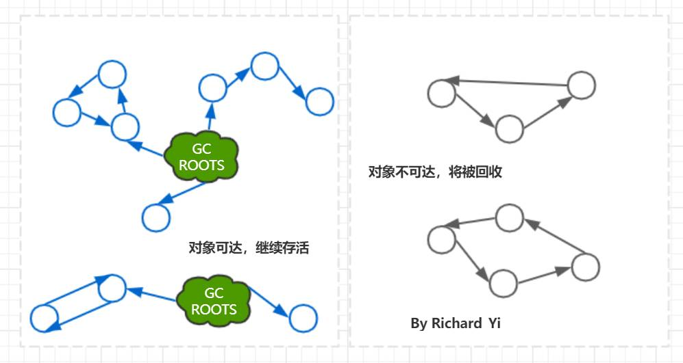

### 3. Java 中的引用  ⭐

Java对引用的概念进行了扩充，将引用分为强引用（Strong Reference）、软引用（Soft Reference）、弱引用（Weak Reference）、虚引用（Phantom Reference）4种，这4种**引用强度依次逐渐减弱**。

这样子设计的原因主要是为了描述这样一类对象：当内存空间还足够时，则能保留在内存之中；如果内存空间在进行垃圾收集后还是非常紧张，则可以抛弃这些对象。很多系统的缓存功能都符合这样的应用场景。

也就是说，对不同的引用类型，JVM 在进行GC 时会有着不同的执行策略。所以我们也需要去了解一下。

#### a. 强引用（Strong Reference）

```
MyClass obj = new MyClass(); // 强引用

obj = null // 此时‘obj’引用被设为null了，前面创建的'MyClass'对象就可以被回收了
复制代码
```

只要强引用存在，垃圾收集器永远不会回收被引用的对象，只有当引用被设为null的时候，对象才会被回收。但是，如果我们**错误地保持了强引用**，比如：赋值给了 static 变量，那么对象在很长一段时间内不会被回收，会产生内存泄漏。

#### b. 软引用（Soft Reference）

软引用是一种相对强引用弱化一些的引用，可以让对象豁免一些垃圾收集，只有当 JVM 认为内存不足时，才会去试图回收软引用指向的对象。**JVM 会确保在抛出 OutOfMemoryError 之前，清理软引用指向的对象**。软引用通常用来**实现内存敏感的缓存**，如果还有空闲内存，就可以暂时保留缓存，当内存不足时清理掉，这样就保证了使用缓存的同时，不会耗尽内存。

```
SoftReference<MyClass> softReference = new SoftReference<>(new MyClass());
复制代码
```

#### c. 弱引用（Weak Reference）

弱引用的**强度比软引用更弱**一些。当 JVM 进行垃圾回收时，**无论内存是否充足，都会回收**只被弱引用关联的对象。

```
WeakReference<MyClass> weakReference = new WeakReference<>(new MyClass());
复制代码
```

> 弱引用可以引申出来一个知识点， WeakHashMap&ReferenceQueue
>
> ReferenceQueue 是GC回调的知识点。这里因为篇幅原因就不细讲了，推荐引申阅读：[ReferenceQueue的使用](https://www.iflym.com/index.php/java-programe/201407140001.html)

#### d. 幻象引用/虚引用（Phantom References）

虚引用也称为幽灵引用或者幻影引用，它是**最弱**的一种引用关系。一个对象是否有虚引用的存在，**完全不会对其生存时间构成影响**，也无法通过虚引用来取得一个对象实例。为一个对象设置虚引用关联的**唯一目的就是能在这个对象被收集器回收时收到一个系统通知**。

```
PhantomReference<MyClass> phantomReference = new PhantomReference<>(new MyClass(), new ReferenceQueue<>());
复制代码
```

## 三、GC 算法 ⭐

有了判断对象是否存活的标准之后，我们再来了解一下GC的相关算法。

- **标记-清除（Mark-Sweep）算法**
- **复制（Copying）算法**
- **标记-整理（Mark-Compact）算法**

### 1. 标记-清除（Mark-Sweep）算法

标记-清除算法在概念上是最简单最基础的垃圾处理算法。

该方法简单快速，但是缺点也很明显，一个是效率问题，标记和清除两个过程的效率都不高；另一个是空间问题，**标记清除之后会产生大量不连续的内存碎片**，空间碎片太多可能会导致以后在程序运行过程中需要分配较大对象时，无法找到足够的连续内存而不得不提前触发另一次垃圾收集动作。

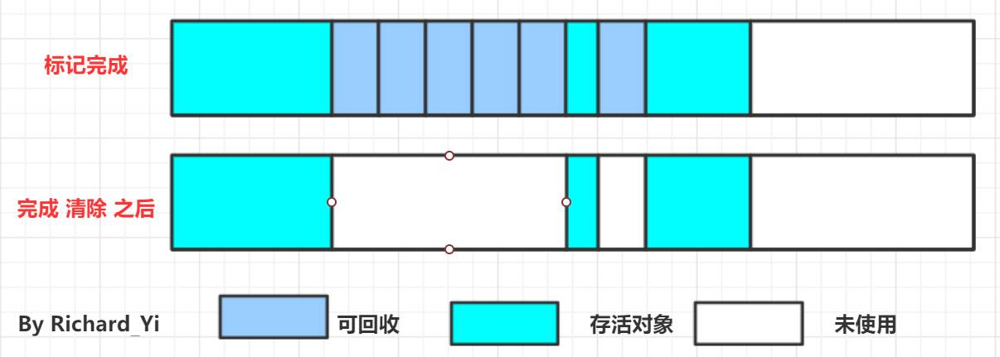

后续的收集算法都是基于这种思路并对其不足进行改进而得到的。

### 2. 复制（Copying）算法

复制算法改进了标记-清除算法的效率问题。

它将可用内存按容量划分为大小相等的两块，每次只使用其中的一块。当这一块的内存用完了，就将还存活着的对象复制到另外一块上面，然后再把已使用过的内存空间一次清理掉。

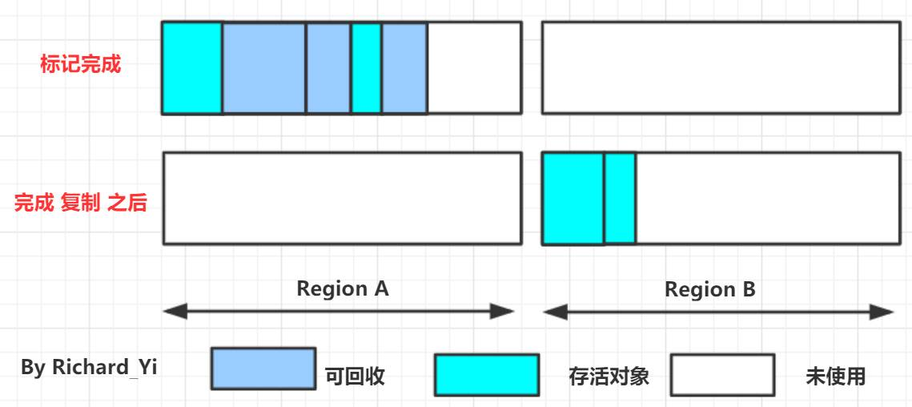

这样使得**每次都是对整个半区进行内存回收，内存分配时也就不用考虑内存碎片等复杂情况，只要移动堆顶指针，按顺序分配内存即可**，实现简单，运行高效。

缺点也是明显的，**可用内存缩小到了原先的一半**。

现在的商业虚拟机都采用这种收集算法来回收**新生代**，IBM公司的专门研究表明，新生代中的对象`98%`是“朝生夕死”的，**所以并不需要按照1:1的比例来划分内存空间**，而是将内存分为一块较大的Eden空间和两块较小的Survivor空间，每次使用Eden和其中一块Survivor。

在前面的文章中我们提到过，HotSpot默认的`Eden:survivor1:survivor2=8:1:1`，如下图所示。

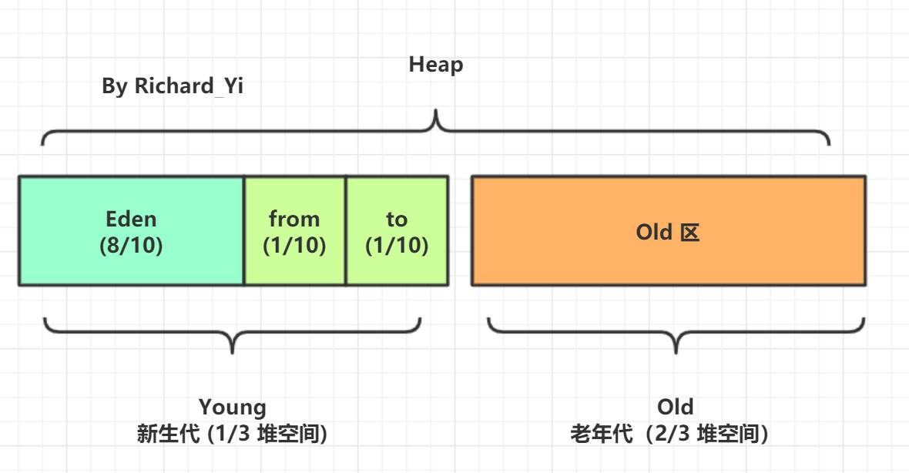

#### 延伸知识点：内存分配担保

当然，98%的对象可回收只是一般场景下的数据，我们没有办法保证每次回收都只有不多于10%的对象存活，当Survivor空间不够用时，需要依赖其他内存（这里指老年代）进行**分配担保（Handle Promotion）**。

内存的分配担保就好比我们去银行借款，如果我们信誉很好，在98%的情况下都能按时偿还，于是银行可能会默认我们下一次也能按时按量地偿还贷款，只需要有一个担保人能保证如果我不能还款时，可以从他的账户扣钱，那银行就认为没有风险了。内存的分配担保也一样，如果另外一块Survivor空间没有足够空间存放上一次新生代收集下来的存活对象时，这些对象将直接通过分配担保机制进入老年代。

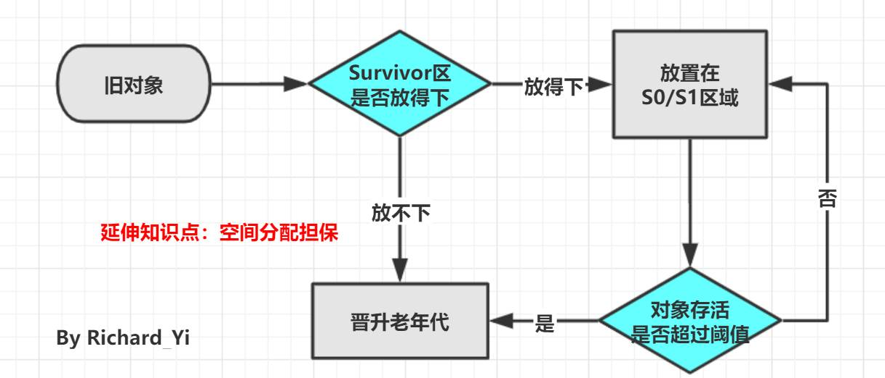

### 3. 标记-整理算法

前面说了**复制算法主要用于回收新生代的对象**，但是这个算法并不适用于老年代。因为老年代的对象存活率都较高（毕竟大多数都是经历了一次次GC千辛万苦熬过来的，身子骨很硬朗😎）

根据老年代的特点，提出了另外一种标记-整理（Mark-Compact）算法，标记过程仍然与“标记-清除”算法一样，但后续步骤不是直接对可回收对象进行清理，而是让所有存活的对象都向一端移动，然后直接清理掉端边界以外的内存。

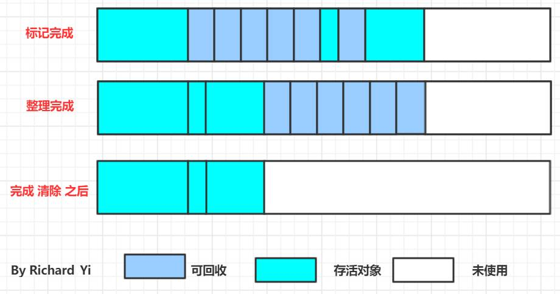

### 4. 分代收集算法

有没有注意到了，我们前面的表述当中就引入了新生代、老年代的概念。准确来说，是先有了**分代收集算法**的这种思想，才会将Java堆分为新生代和老年代。这两个概念之间存在着一个先后因果关系。

这个算法很简单，就是**根据对象存活周期的不同，将内存分块**。在Java 堆中，内存区域被分为了新生代和老年代，这样就可以根据各个年代的特点采用最适当的收集算法。

就如我们在介绍上面的算法时描述的，在**新生代中，每次垃圾收集时都发现有大批对象死去，只有少量存活**，那就选用**复制算法**，只需要付出少量存活对象的复制成本就可以完成收集。而**老年代中因为对象存活率高、没有额外空间对它进行分配担保**，就必须使用 **“标记—清理”** 或者 **“标记—整理” 算法** 来进行回收。

- 新生代：复制算法
- 老年代：标记-清除算法、标记-整理算法

### 5. 重新回顾 创建对象时触发GC的流程

这里重新回顾一下[精美图文带你掌握 JVM 内存布局](http://ricstudio.top/archives/jvm_memory_structure)里面JVM创建一个新对象的内存分配流程图。这张图也描述了GC的流程。

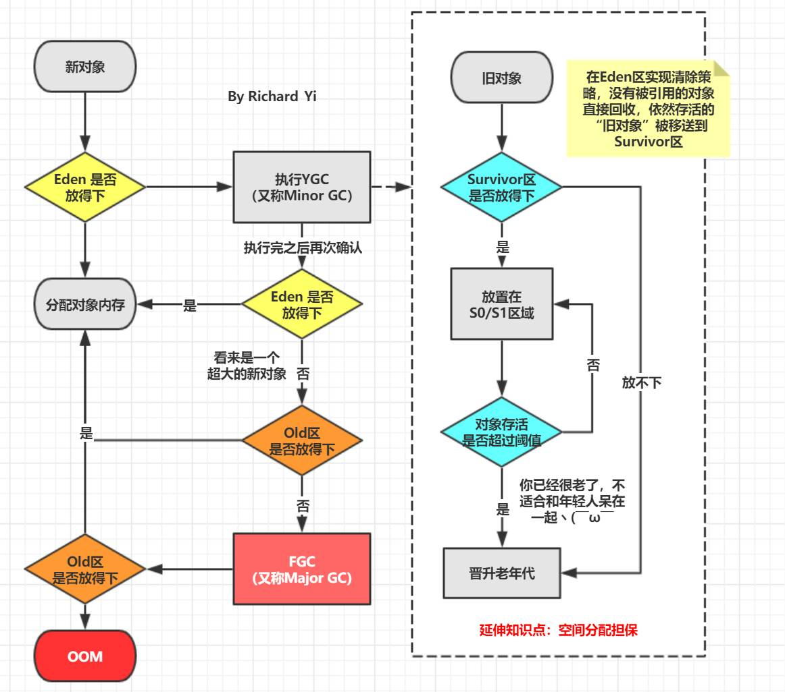

## 四、GC 术语 📖

在学习垃圾收集器知识点之前，需要向读者大大们科普一些GC的术语😊，方便你们后面理解。

- 部分收集

   （Partial GC）：指目标不是完整收集整个Java堆的垃圾收集，其中又分为：

   - **新生代收集（Minor GC/Young GC）**：指目标只是**新生代**的垃圾收集。
   - **老年代收集（Major GC/Old GC）**：指目标只是**老年代**的垃圾收集。目前只有CMS收集器会有单独收集老年代的行为。另外请注意“Major GC”这个说法现在有点混淆，在不同资料上常有不同所指，读者需按上下文区分到底是指老年代的收集还是整堆收集。
   - **混合收集（Mixed GC）**：指目标是收集整个新生代以及部分老年代的垃圾收集。目前只有G1收集器会有这种行为。

- **整堆收集（Full GC）**：收集整个Java堆和方法区的垃圾收集。

- **并行（Parallel）** ：在JVM运行时，同时存在应用程序线程和垃圾收集器线程。 并行阶段是由多个GC 线程执行，即GC 工作在它们之间分配。

- **串行（Serial）**：串行阶段仅在单个GC 线程上执行。

- **STW** ：Stop The World 阶段，应用程序线程被暂停，以便GC线程 执行其工作。 当应用程序因为GC 暂停时，这通常是由于Stop The World 阶段。

- **并发（Concurrent）**：用户线程与垃圾收集器线程同时执行，不一定是并行执行，可能是交替执行（竞争）

- **增量**：如果一个阶段是增量的，那么它可以运行一段时间之后由于某些条件提前终止，例如需要执行更高优先级的GC 阶段，同时仍然完成生产性工作。 增量阶段与需要完全完成的阶段形成鲜明对比。

## 五、垃圾收集器 ⭐

知道了算法之后，自然而然我们到了JVM中对这些算法的实现和应用，即各种**垃圾收集器（Garbage Collector）**。

首先要认识到的一个重要方面是，对于大多数JVM，**需要两种不同的GC算法，一种用于清理新生代，另一种用于清理老年代**。

意思就是说，在JVM中你通常会看到两种收集器组合使用。下图是JVM 中所有的收集器（Java 8 ），其中有连线的就是可以组合的。

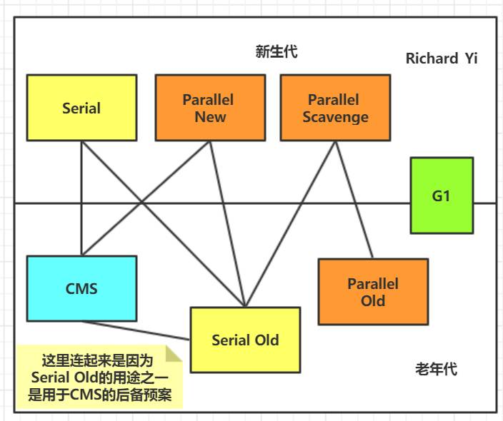

为了减小复杂性，快速记忆，我这边直接给出比较常用的几种组合。其他的要么是已经废弃了要么就是在现实情况下不实用的。

| **新生代**            | 老年代           | **JVM options**                              |
| :-------------------- | :--------------- | :------------------------------------------- |
| **Serial**            | **Serial Old**   | **-XX:+UseSerialGC**                         |
| **Parallel Scavenge** | **Parallel Old** | **-XX:+UseParallelGC -XX:+UseParallelOldGC** |
| **Parallel New**      | **CMS**          | **-XX:+UseParNewGC -XX:+UseConcMarkSweepGC** |
| **G1**                | **G1**           | **-XX:+UseG1GC**                             |

接下去我们开始具体介绍上各个垃圾收集器。这里需要提一下的是，我这边是将垃圾收集器分成以下几类来讲述的：

- **Serial GC**
- **Parallel GC**
- **Concurrent Mark and Sweep （CMS）**
- **G1 - Garbage First**

理由无他，我觉得这样更符合理解的思路，你更好理解。

### 4.1 串行收集器

Serial 翻译过来可以理解成单线程。单线程收集器有Serial 和 Serial Old 两种，它们的唯一区别就是：**Serial 工作在新生代，使用“复制”算法，Serial Old 工作在老年代，使用“标志-整理”算法**。所以这里将它们放在一起讲。

串行收集器收集器是最经典、最基础，也是最好理解的。它们的特点就是单线程运行及独占式运行，因此会带来很不好的用户体验。虽然它的收集方式对程序的运行并不友好，但由于它的单线程执行特性，应用于单个CPU硬件平台的性能可以超过其他的并行或并发处理器。

“单线程”的意义**并不仅仅是说明它只会使用一个处理器或一条收集线程去完成垃圾收集工作，更重要的是强调在它进行垃圾收集时，必须暂停其他所有工作线程，直到它收集结束（STW阶段）**。

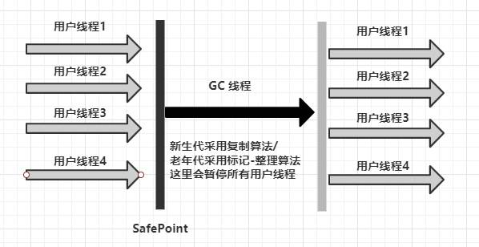

STW 会带给用户恶劣的体验，所以从JDK 1.3开始，一直到现在最新的JDK 13，HotSpot虚拟机开发团队为消除或者降低用户线程因垃圾收集而导致停顿的努力一直持续进行着，从Serial收集器到Parallel收集器，再到Concurrent Mark Sweep（CMS）和Garbage First（G1）收集器，最终至现在垃圾收集器的最前沿成果Shenandoah和ZGC等。

虽然新的收集器很多，但是串行收集器仍有其适合的场景。迄今为止，它依然是HotSpot虚拟机运行在客户端模式下的默认新生代收集器，有着优于其他收集器的地方，那就是简单而高效。对于内存资源受限的环境，它是所有收集器里额外内存消耗最小的，单线程没有线程交互开销。（这里实际上也是一个时间换空间的概念）

> 通过JVM参数 `-XX:+UseSerialGC` 可以使用串行垃圾回收器（上面表格也有说明）

### 4.2 并行收集器

按照程序发展的思路，单线程处理之后，下一步很自然就到了多核处理器时代，程序多线程并行处理的时代。并行收集器是多线程的收集器，在多核CPU下能够很好的提高收集性能。

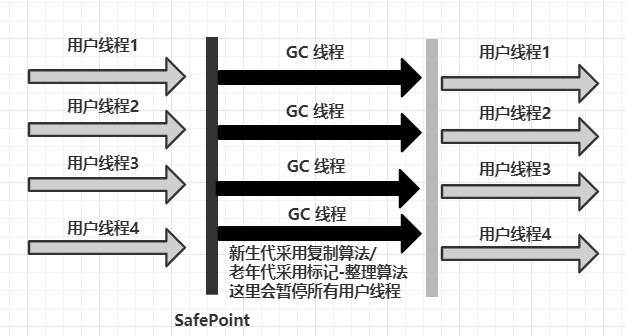

这里我们会介绍：

- ParNew
- Parallel Scavenge
- Parallel Old

> 这里还是提供太长不看版白话总结，方便理解。因为我知道有些人刚开始学习JVM 看这些名词都会觉得头晕。
>
> - ParNew收集器 就是 Serial收集器的多线程版本，基于“复制”算法，其他方面完全一样，在JDK9之后差不多退出历史舞台，只能配合CMS在JVM中发挥作用。
> - Parallel Scavenge 收集器 和 ParNew收集器类似，基于“复制”算法，但前者更关注**可控制的吞吐量**，并且能够通过`-XX：+UseAdaptiveSizePolicy`打开垃圾收集**自适应调节策略**的开关。
> - Parallel Old 就是 Parallel Scavenge 收集器的**老年代**版本，基于**“标记-整理”算法**实现。

#### a. ParNew 收集器

ParNew收集器除了支持**多线程并行收集**之外，其他与Serial收集器相比并没有太多创新之处，但它却是不少运行在服务端模式下的HotSpot虚拟机，尤其是**JDK 7**之前的遗留系统中首选的**新生代收集器**，其中有一个与功能、性能无关但其实很重要的原因是：**除了Serial收集器外，目前只有它能与CMS收集器配合工作**。

但是从G1 出来之后呢，ParNew的地位就变得微妙起来，自**JDK 9**开始，ParNew加CMS收集器的组合就不再是官方推荐的服务端模式下的收集器解决方案了。官方**希望它能完全被G1所取代**，甚至还取消了『ParNew + Serial Old』 以及『Serial + CMS』这两组收集器组合的支持（其实原本也很少人这样使用），并直接取消了`-XX：+UseParNewGC`参数，这意味着**ParNew 和CMS 从此只能互相搭配使用**，再也没有其他收集器能够和它们配合了。可以理解为从此以后，ParNew 合并入CMS，成为它专门处理新生代的组成部分。

#### b. Parallel Scavenge收集器

Parallel Scavenge收集器与ParNew收集器类似，也是使用**复制算法的并行的多线程新生代收集器**。但Parallel Scavenge收集器关注可控制的吞吐量（Throughput）

> 注：吞吐量是指CPU用于运行用户代码的时间与CPU总消耗时间的比值，即**吞吐量 = 运行用户代码时间 /（ 运行用户代码时间 + 垃圾收集时间 ）**

Parallel Scavenge收集器提供了几个参数用于精确控制吞吐量和停顿时间：

| 参数                       | 作用                                                         |
| -------------------------- | ------------------------------------------------------------ |
| --XX: MaxGCPauseMillis     | 最大垃圾收集停顿时间，是一个大于0的毫秒数，收集器将回收时间尽量控制在这个设定值之内；但需要注意的是在同样的情况下，回收时间与回收次数是成反比的，回收时间越小，相应的回收次数就会增多。所以这个值并不是越小越好。 |
| -XX: GCTimeRatio           | 吞吐量大小，是一个(0, 100)之间的整数，表示垃圾收集时间占总时间的比率。 |
| XX: +UseAdaptiveSizePolicy | 这是一个开关参数，当这个参数被激活之后，就不需要人工指定新生代的大小（-Xmn）、Eden与Survivor区的比例（-XX：SurvivorRatio）、晋升老年代对象大小（-XX：PretenureSizeThreshold）等细节参数了，虚拟机会根据当前系统的运行情况收集性能监控信息，动态调整这些参数以提供最合适的停顿时间或者最大的吞吐量。这种调节方式称为垃圾收集的自适应的调节策略（GC Ergonomics） |

#### c. Parallel Old收集器

Parallel Old是Parallel Scavenge收集器的老年代版本，多线程，基于“标记-整理”算法。这个收集器是在JDK 1.6中才开始提供的。

由于如果新生代选择了Parallel Scavenge收集器，老年代除了Serial Old（PS MarkSweep）收集器外别无选择(Parallel Scavenge无法与CMS收集器配合工作)，Parallel Old收集器的出现就是为了解决这个问题。Parallel Scavenge和Parallel Old收集器的组合**更适用于注重吞吐量以及CPU资源敏感的场合**。

### 4.3 ⭐ **Concurrent Mark and Sweep （CMS）**

CMS(Concurrent Mark Sweep，并发标记清除) 收集器是以**获取最短回收停顿时间为目标的收集器（追求低停顿）**，它在垃圾收集时使得用户线程和 GC 线程**并发**执行，因此在垃圾收集过程中用户也不会感到明显的卡顿。

从名字就可以知道，CMS是基于“**标记-清除**”算法实现的。它的工作过程相对于上面几种收集器来说，就会复杂一点。整个过程分为以下四步：

1）初始标记 （CMS initial mark)：主要是**标记 GC Root 开始的下级（注：仅下一级）对象**，这个过程会 **STW**，但是跟 GC Root 直接关联的下级对象不会很多，因此这个过程其实很快。

2）并发标记 (CMS concurrent mark)：根据上一步的结果，继续向下标识所有关联的对象，直到这条链上的最尽头。这个过程是多线程的，虽然耗时理论上会比较长，但是**其它工作线程并不会阻塞**，**没有 STW**。

3）重新标记（CMS remark）：顾名思义，就是要再标记一次。为啥还要再标记一次？因为**第 2 步并没有阻塞其它工作线程，其它线程在标识过程中，很有可能会产生新的垃圾**。

> 这里举一个很形象的例子：
>
> 就比如**你和你的小伙伴（多个GC线程）\**给一条长走廊打算卫生，从一头打扫到另一头。当你们打扫到走廊另一头的时候，可能有同学（用户线程）丢了新的垃圾。所以，为了打扫干净走廊，需要\**你示意所有的同学（用户线程）别再丢了（进入STW阶段）**，然后你和小伙伴迅速把刚刚的新垃圾收走。当然，因为刚才**已经收过一遍垃圾**，所以这次收集新产生的垃圾，用不了多长时间（即：**STW 时间不会很长**）。

4）并发清除（CMS concurrent sweep）：

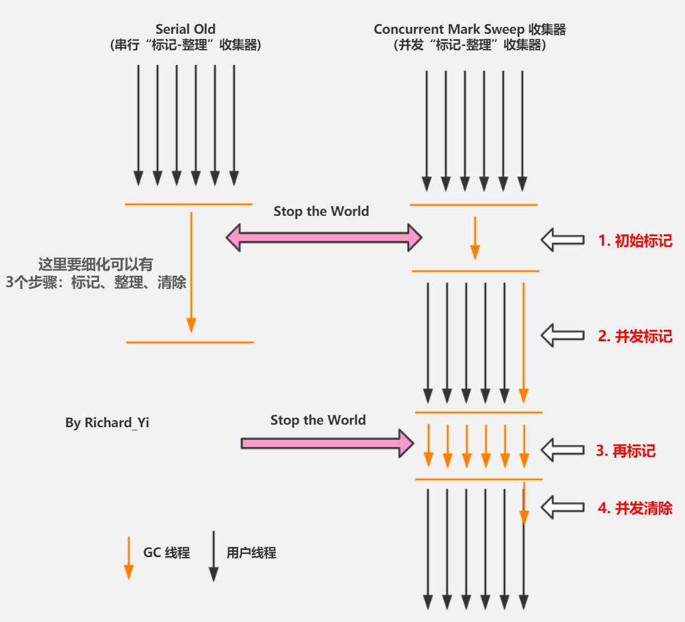

> ❔❔❔ 提问环节：为什么CMS要使用“标记-清除”算法呢？刚才我们不是提到过“标记-清除”算法，会留下很多内存碎片吗？

确实，但是也没办法，如果换成“标记 - 整理”算法，把垃圾清理后，剩下的对象也顺便整理，会导致这些对象的内存地址发生变化，别忘了，**此时其它线程还在工作，如果引用的对象地址变了，就天下大乱了**。

对于上述的问题JVM提供了两个参数：

| 参数                                  | 作用                                                         |
| ------------------------------------- | ------------------------------------------------------------ |
| --XX: +UseCMS-CompactAtFullCollection | （默认是开启的，此参数从JDK 9开始废弃）用于在CMS收集器不得不进行FullGC时开启内存碎片的合并整理过程，内存整理的过程是无法并发的，空间碎片问题没有了，但停顿时间不得不变长。 |
| --XX: CMSFullGCsBeforeCompaction      | （此参数从JDK 9开始废弃）这个参数的作用是要求CMS收集器在执行过若干次（数量由参数值决定）不整理空间的Full GC之后，下一次进入Full GC前会先进行碎片整理（默认值为0，表示每次进入Full GC时都进行碎片整理） |

另外，由于最后一步并发清除时，并不阻塞其它线程，**所以还有一个副作用，在清理的过程中，仍然可能会有新垃圾对象产生，只能等到下一轮 GC，才会被清理掉**。

### 4.4 ⭐ **G1 - Garbage First**

> JDK 9发布之日，G1宣告取代Parallel Scavenge加Parallel Old组合，成为服务端模式下的默认垃圾收集器。

鉴于 CMS 的一些不足之外，比如: 老年代内存碎片化，STW 时间虽然已经改善了很多，但是仍然有提升空间。G1 就横空出世了，它对于堆区的内存划思路很新颖，有点算法中分治法“分而治之”的味道。具体什么意思呢，让我们继续看下去。

G1 将连续的Java堆划分为**多个大小相等的独立区域（Region）**，每一个Region都可以根据需要，扮演**新生代的Eden空间、Survivor空间，或者老年代空间**。每个Region的大小可以通过参数`-XX：G1HeapRegionSize`设定，取值范围为**1MB～32MB，且应为2的N次幂**。

Region中还有一类特殊的**Humongous**区域，专门用来**存储大对象**。**G1认为只要大小超过了一个Region容量一半的对象即可判定为大对象。对于那些超过了整个Region容量的超级大对象，将会被存放在N个连续的Humongous Region之中**。

> Humongous，简称 H 区，是专用于存放超大对象的区域，通常 `>= 1/2 Region Size`，**G1的大多数行为都把Humongous Region作为老年代的一部分来进行看待**。

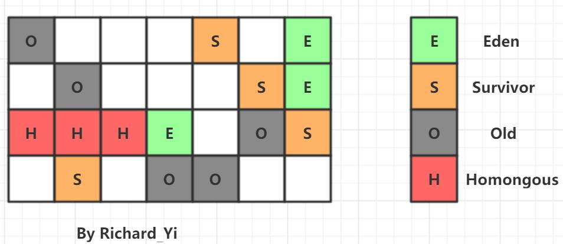

认识了G1中的内存规划之后，我们就可以理解为什么它叫做"Garbage First"。所有的垃圾回收，都是基于 region 的。G1根据各个Region回收所获得的空间大小以及回收所需时间等指标在后台维护一个优先列表，每次根据允许的收集时间，优先回收**价值最大（垃圾）\**的Region，从而可以\**有计划地避免在整个Java堆中进行全区域的垃圾收集**。这也是 "Garbage First" 得名的由来。

G1**从整体来看是基于“标记-整理”算法实现的收集器**，但**从局部（两个Region之间）上看又是基于“标记-复制”算法实现**，无论如何，这两种算法都意味着**G1运作期间不会产生内存空间碎片**，垃圾收集完成之后能提供规整的可用内存。这种特性有利于程序长时间运行，在程序为大对象分配内存时不容易因无法找到连续内存空间而提前触发下一次GC。

> ❔❔❔ 提问环节：
>
> 一个对象和它内部所引用的对象可能不在同一个 Region 中，那么当垃圾回收时，是否需要扫描整个堆内存才能完整地进行一次可达性分析？

这里就需要引入 **Remembered Set** 的概念了。

答案是**不需要**，每个 Region 都有一个 **Remembered Set （记忆集）**，**用于记录本区域中所有对象引用的对象所在的区域，进行可达性分析时，只要在 GC Roots 中再加上 Remembered Set 即可防止对整个堆内存进行遍历**。

再提一个概念，**Collection Set** ：简称 CSet，**记录了等待回收的 Region 集合，GC 时这些 Region 中的对象会被回收（copied or moved）**。

#### G1 运作步骤

如果不计算维护 Remembered Set 的操作，G1 收集器的工作过程分为以下几个步骤：

- 初始标记（Initial Marking）：Stop The World，仅使用一条初始标记线程对所有与 GC Roots 直接关联的对象进行标记。
- 并发标记（Concurrent Marking）：使用一条标记线程与用户线程并发执行。此过程进行可达性分析，速度很慢。
- 最终标记（Final Marking）：Stop The World，使用多条标记线程并发执行。
- 筛选回收（Live Data Counting and Evacuation）：回收废弃对象，此时也要 Stop The World，并使用多条筛选回收线程并发执行。（还会更新Region的统计数据，对各个Region的回收价值和成本进行排序）

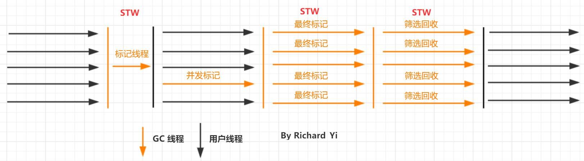

> 从上述阶段的描述可以看出，G1收集器除了并发标记外，其余阶段也是要完全暂停用户线程的，换言之，它并非纯粹地追求低延迟，官方给它设定的目标是在**延迟可控的情况下获得尽可能高的吞吐量**。

#### G1 的 Minor GC/Young GC

在分配一般对象时，当所有eden region使用达到最大阈值并且无法申请足够内存时，会触发一次YGC。每次YGC会回收所有Eden以及Survivor区，并且将存活对象复制到Old区以及另一部分的Survivor区。

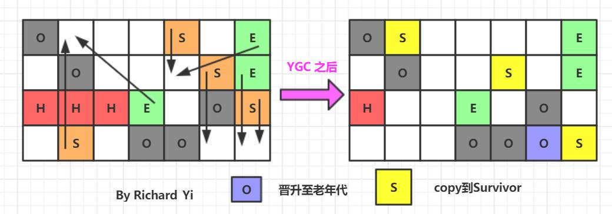

下面是一段经过抽取的GC日志：

```
GC pause (G1 Evacuation Pause) (young)
  ├── Parallel Time
    ├── GC Worker Start
    ├── Ext Root Scanning
    ├── Update RS
    ├── Scan RS
    ├── Code Root Scanning
    ├── Object Copy
  ├── Code Root Fixup
  ├── Code Root Purge
  ├── Clear CT
  ├── Other
    ├── Choose CSet
    ├── Ref Proc
    ├── Ref Enq
    ├── Redirty Cards
    ├── Humongous Register
    ├── Humongous Reclaim
    ├── Free CSet  
复制代码
```

由这段GC日志我们可知，整个YGC由多个子任务以及嵌套子任务组成，且一些核心任务为：**Root Scanning，Update/Scan RS，Object Copy，CleanCT，Choose CSet，Ref Proc，Humongous Reclaim，Free CSet**。

> 推荐阅读：[深入理解G1的GC日志](https://www.javazhiyin.com/36101.html)
>
> 这篇文章通过G1 GC日志介绍了GC的几个步骤。对上面英文单词概念不清楚的可以查阅。
>
> 英文好的更推荐这篇：[garbage-collection-algorithms-implementations](https://plumbr.io/handbook/garbage-collection-algorithms-implementations)

#### G1 的 Mixed GC

当越来越多的对象晋升到老年代Old Region 时，为了避免堆内存被耗尽，虚拟机会触发一个混合的垃圾收集器，即Mixed GC，是收集整个新生代以及部分老年代的垃圾收集。除了回收整个Young Region，还会回收一部分的Old Region ，这里需要注意：**是一部分老年代，而不是全部老年代**，可以选择哪些Old Region 进行收集，从而可以对垃圾回收的耗时时间进行控制。

Mixed GC的整个子任务和YGC完全一样，只是回收的范围不一样。

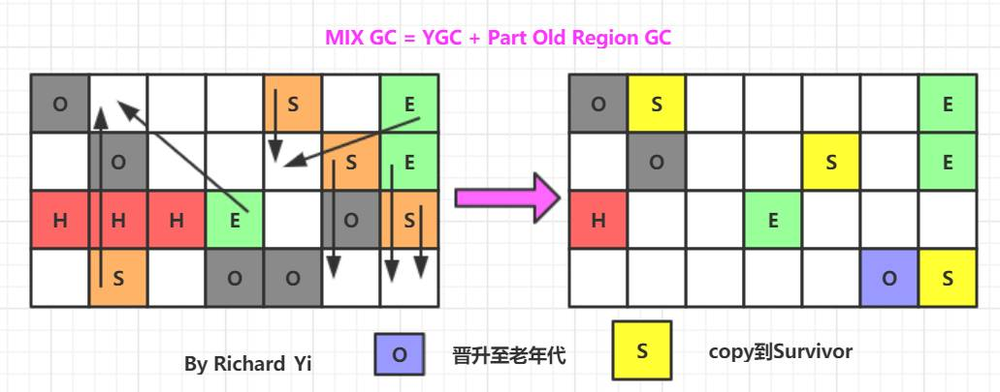

> 注：G1 一般来说是没有FGC的概念的。因为它本身不提供FGC的功能。
>
> 如果 Mixed GC 仍然效果不理想，跟不上新对象分配内存的需求，会使用 Serial Old GC 进行 Full GC强制收集整个 Heap。

相比CMS，G1总结有以下优点：

- G1运作期间不会产生内存空间碎片，垃圾收集完成之后能提供规整的可用内存。这种特性有利于程序长时间运行。
- G1 能预测 GC 停顿时间， STW 时间可控（G1 uses a pause prediction model to meet a user-defined pause time target and selects the number of regions to collect based on the specified pause time target.）

> 关于G1实际上还有很多的细节可以讲，这里希望读者去阅读《深入理解Java虚拟机》或者其他资料来延伸学习，查漏补缺。

**相关参数：**

| 参数                 | 作用             |
| -------------------- | ---------------- |
| -XX:+UseG1GC         | 采用 G1 收集器   |
| -XX:G1HeapRegionSize | 每个Region的大小 |

> 更多的参数和调优参考详见：[分析和性能来调整和调优 G1 GC](https://www.oracle.com/technetwork/cn/articles/java/g1gc-1984535-zhs.html)

## 后记

本系列关于JVM 垃圾回收的知识就到这里了。

因为篇幅的关系，也受限于能力水平，本文很多细节没有涉及到，只能算是为学习JVM的同学打开了一扇的门（一扇和平常看到的文章相比要大那么一点点的门，写了这么久允许我自恋一下吧😂😂）。希望不过瘾的同学能自己更加深入的学习。

> 如果本文有帮助到你，希望能点个赞，这是对我的最大动力🤝🤝🤗🤗。

## 参考

- [深入理解G1的GC日志](https://www.javazhiyin.com/36101.html)
- [Java Hotspot G1 GC的一些关键技术](https://tech.meituan.com/2016/09/23/g1.html)
- 《深入理解Java虚拟机》- 第三版
- [www.infoq.cn/article/3Wy…](https://www.infoq.cn/article/3WyReTKqrHIvtw4frmr3)
- [plumbr.io/handbook/ga…](https://plumbr.io/handbook/garbage-collection-algorithms-implementations)


作者：Richard_Yi
链接：https://juejin.im/post/6844904040346681352
来源：掘金
著作权归作者所有。商业转载请联系作者获得授权，非商业转载请注明出处。

