<h1 align="center">从Java代码运行聊到JVM及对象创建-分配-定位-布局-垃圾回收</h1>

[TOC]

## Java 代码到底是如何运行的呢？

看下面的流程图理解 Java 代码是如何运行：

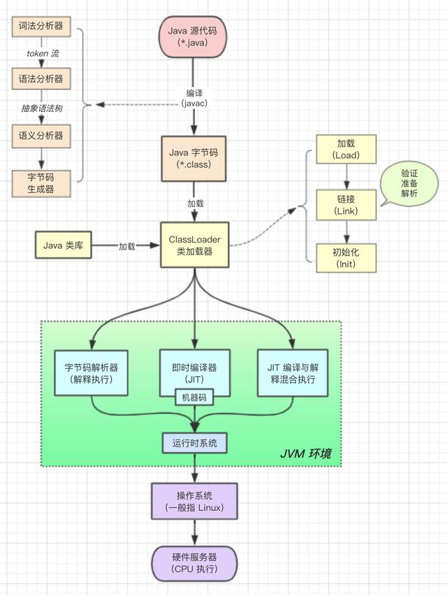

Java 代码运行过程

概括一下：程序员小张编写好的 Java 源代码文件经过 Java 编译器编译成字节码文件后，通过类加载器加载到内存中，才能被实例化，然后到 Java 虚拟机中解释执行，最后通过操作系统操作 CPU 执行获取结果。

具体的 javac 编译和类加载器过程请见下图：

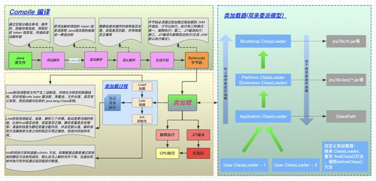

编译和类加载过程

本文主要介绍 **JVM 内存模型**、**参数设置说明**、**对象创建过程解析、初始 GC**。下面请大家进入正题吧！！！

## JVM 内存布局是什么样的呢？

简单的说，共有 5 大块，它们分别是堆区（Java Heap）、虚拟机栈（Virtual Machine Stacks）、本地方法栈（Native Method Stacks）、元空间（Meta Spaces）、程序计数器（Program Counter Register）。

如下图所示（先大概了解一下各自区域都存了啥，后面会一一图文解读）：

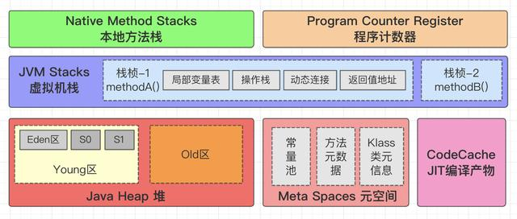

JVM 内存布局

**按线程的共享与私有（线程安全）分类：**

共享区域：

- 堆区
- 元空间

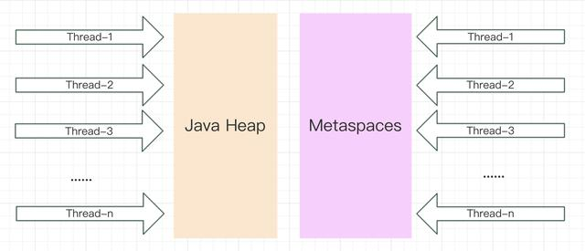

JVM 线程共享区域

私有区域：

- 虚拟机栈
- 本地方法栈
- 程序计数器

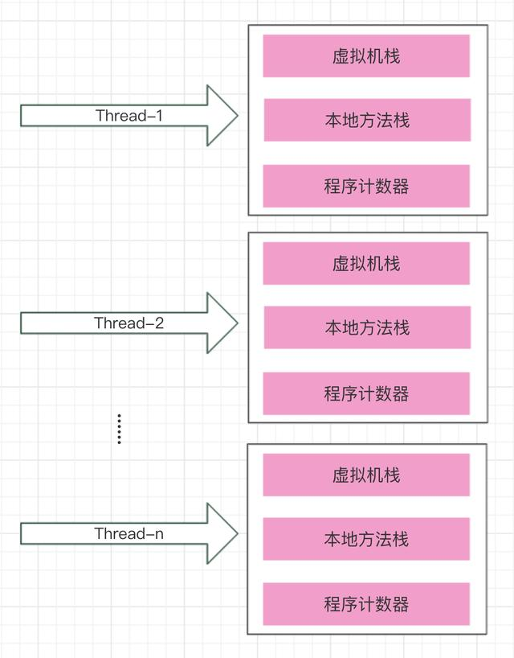

JVM 线程私有区域

下面从简单的 JVM 划分区域开始说起：

**程序计数器**

- 占用的 JVM 内存空间较小
- 每个线程生命周期内独享自己的程序计数器（内部存放的是字节码指令的地址引用）
- 不会发生 OOM

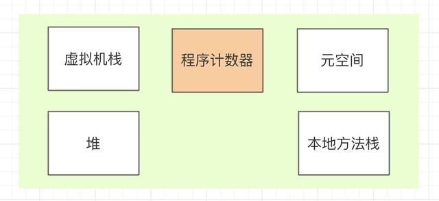

程序计数器

**虚拟机栈**

- 内部结构是栈帧，每个方法在执行的时候都会创建一个栈帧，用于存储局部变量表，操作数栈，动态链接，方法返回地址等信息
- 某方法在调用另一个方法是通过动态链接在常量池中查询方法的引用，进而完成方法调用
- 某方法在调用另一个方法的过程，即是一个栈帧在虚拟机中的入栈到出栈的过程
- 虚拟机中的方法入栈的顺序和方法的调用顺序是一致的

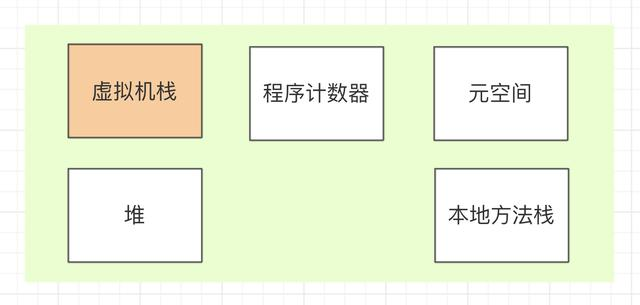

虚拟机栈

详细的虚拟机栈解读请查看下图，一目了然：

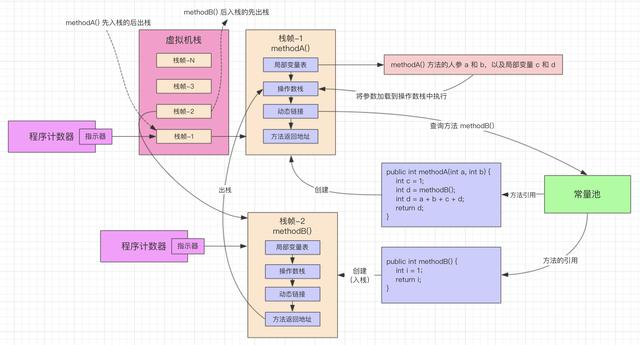

虚拟机栈详细图解

**对于 JVM 中虚拟机栈参数的设置**

-Xss ：用于设置栈的大小，栈的大小决定了方法调用的深度。

```
# 设置线程栈大小为 512k（以字节为单位）
-Xss512k
```

该区域可能会出现 StackOverflowException 栈溢出异常。

**本地方法栈**

- 和虚拟机栈类似，内部结构是栈帧，每个 Native 方法执行时创建一个栈帧
- 该部分没有规定内存大小

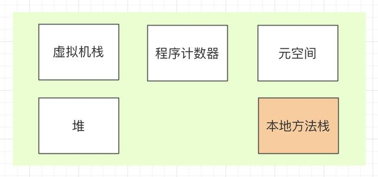

本地方法栈

**堆区**

- 存放 Java 对象和数组
- 虚拟机中存储空间比较大的区域
- 可能出现 OOM 异常区域
- 该区域是 GC 的主要区域，堆区由年轻代和老年代组成，年轻代又分为 Eden 区、S0区（from survivor）、S1 区（to survivor）；新生代对应 Minor GC（Young GC），老年代对应 Full GC（Old GC）。

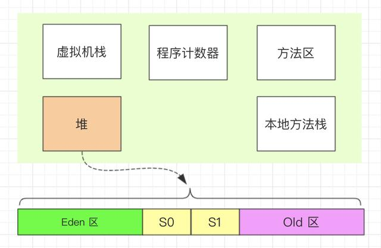

堆区

**对于 JVM 中堆区参数的设置**

```
# 设置堆区的初始大小
-Xms1024m
# 设置堆区的存储空间最大值，一般与堆区的初始大小相等
-Xmx1024m
# 设置年轻代堆的大小
-Xmn512m
# 设置如下参数，在出现OOM时进行堆转储
-XX:+HeapDumpOnOutOfMemoryError
# 设置以上设置时，需配置以下参数，堆转储文件输出的位置
-XX:HeapDumpPath=/usr/log/java_dump.hprof
```

**方法区与永久代**

- 方法区被所有线程共享。采用永久代的方式实现了方法区。
- jdk 8 以前（不包括 jdk8）存在永久代（Perm区），jdk 8 以后（包括 jdk 8）移除了永久代。如下图所示。

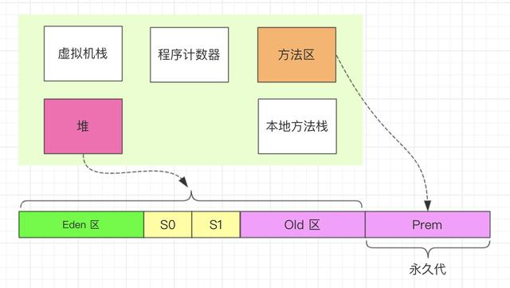

方法区与永久代

**方法区在不同 JDK 版本的变化**

请见下图：

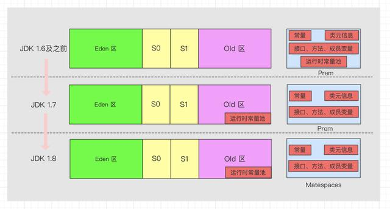

方法区在不同 JDK 版本比较

**方法区和元空间的区别**

请见下图：

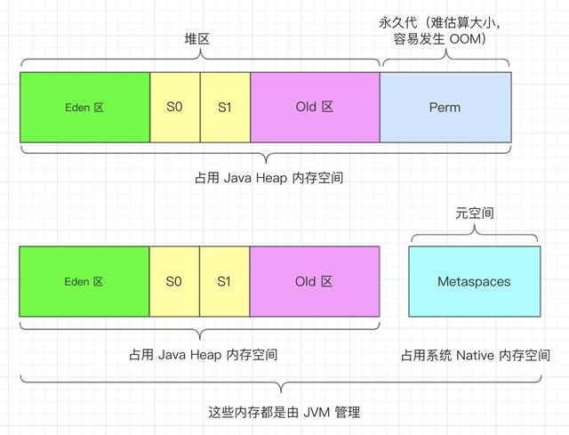

方法区和元空间区别

**对于 JVM 中永久代或元空间参数的设置**

```
# jdk1.7 设置永久代内存初始大小
-XX:PermSize=512m
# jdk1.7 设置永久代内存最大值
-XX:MaxPermSize=512m
# jdk1.8 设置元空间内存初始大小
-XX:MetaspaceSize=1024m
# jdk1.8 设置元空间内存最大值
-XX:MaxMetaspaceSize=1024m
```

## 以 ObjectA a = new ObjectA(); 为例

聊一聊，对象在 JVM 虚拟机中是如何创建的，在什么地方分配内存，又是如何分配的，对象是如何定位的，以及对象的内存布局，最后又是如何回收的。

**1）对象的创建**

先在虚拟机栈创建栈帧，栈帧内创建对象的引用，在方法区进行类的加载，然后去 Java 堆区进行分配内存并内存初始化，再回到栈帧中初始化对象的数据，完成对象的创建。见下图：

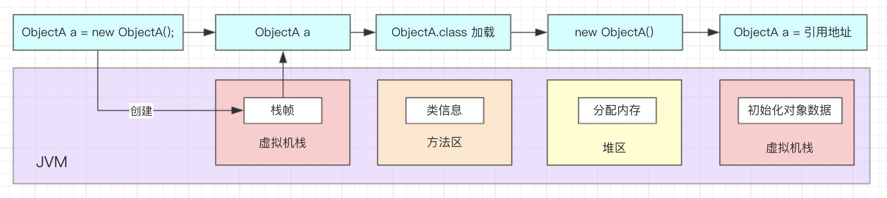

对象创建过程

**2）Java 堆内存分配过程**

想要更好的理解 Java 堆区内存分配过程，得先了解内存分配方法有哪些，内存分配方法分为**指针碰撞法**和**空闲列表法**。

- **指针碰撞法**
   支持**压缩整理**功能的垃圾回收器 Serial、ParNew 等（**Compact** 过程），使得已使用的内存和未使用的内存分开，两者之间存在一个指针作为分界点指示器。
   分配内存只需移动指针，分界点指示器向未使用的内存一侧移动一段与对象大小相等的空间，这种分配内存的方法叫做指针碰撞法。如下图所示：

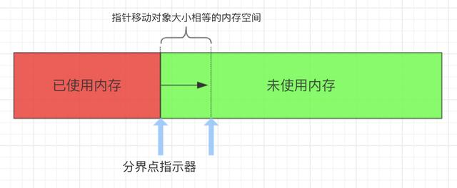

指针碰撞法

- **空闲列表法**
   基于**标记清除**（Mark-Sweep）算法的 CMS 垃圾回收器，其内存划分成网格区（Region），内存分配不规整，即已使用的和未使用的内存随机分布，JVM 会维护一个记录表，用于记录那些内存可用于分配，当需要给对象分配内存区域时，寻找一块足够大的内存空间分配给对象，并更新记录表，这种分配内存的方法叫做空闲列表法。如下图所示：

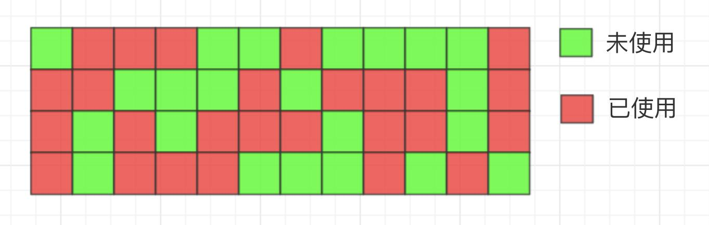

空闲列表法

**Java 堆区对象内存分配**

JVM 中内存分配纷繁复杂，为了防止内存分配混乱，需要解决并发问题，解决并发问题有两种方式：**同步处理方式**和 **TLAB 方式**

- **同步处理**：内存分配的动作采用同步机制，JVM 为了增加效率采用了 CAS 方式。

> 在计算机科学中，比较和交换（Conmpare And Swap）是用于实现多线程同步的原子指令。它将内存位置的内容与给定值进行比较，只有在相同的情况下，将该内存位置的内容修改为新的给定值。这是作为单个原子操作完成的。

- **TLAB 方式**：每个线程在 Java 堆中预先分配一小块内存，叫做本地线程分配缓冲区。TLAB 的全称是 Thread Local Allocation Buffer。这个 TLAB 和 Java 中的 ThreadLocal 类有点像，每个线程独享线程本地变量。
   哪个线程需要分配内存先去各自的 TLAB 中分配，但是这个缓冲区比较小，是为了加速对象的分配。只有在线程的 TLAB 用完才会去堆中进行内存分配，此时才需要同步机制。如下图所示：

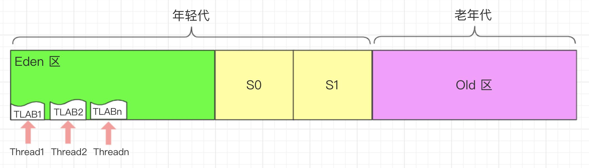

TLAB 缓冲区

**3）对象的访问定位**

- 句柄访问，见下图所示：

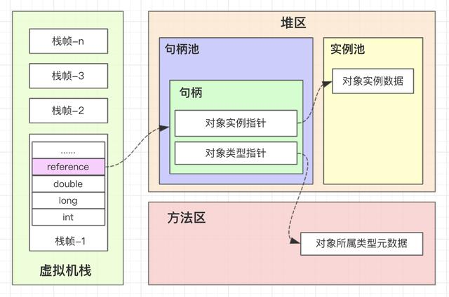

句柄访问

注：句柄池是 Java 堆分配用于存放对象指针的内存空间。

**优点**：在垃圾回收的时候对象要经常转移，这时候只需改变句柄中指向对象实例数据的指针即可（不用修改 reference）。

- 直接访问，见下图所示：

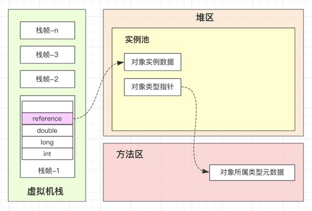

直接访问

**优点**：相对于句柄访问定位的方式，减少了一次指针定位的开销（也减少了句柄池的存储空间），HotSpot JVM 实现采用的是**直接访问**的方式进行对象访问定位。

**4）对象的内存布局**

对象的组成：对象头（对象自身运行时数据和类型指针）、实例数据和对齐填充。

可参考这篇文章（[记一次生产频繁出现 Full GC 的 GC日志图文详解](https://www.toutiao.com/i6799522958990639628/?group_id=6799522958990639628)）中的第 3 部分关于线上系统 JVM 内存估算方法。如下图所示：

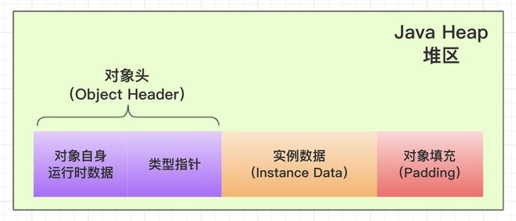

对象的内存布局

## 初始 Java GC

这里只做简单了解，如果后面有时间会对 JVM 垃圾回收深入分析。

- 针对上面 Java 创建对象过程的例子。 ObjectA a = new ObjectA()；类似这样创建对象的即是强引用，如果该引用存在，则垃圾回收器就不会回收它。 注：对象引用类型（由强到弱）分为强引用、软引用、弱引用、虚引用。
- GC 针对的 JVM 区域 从上面对 JVM 内存布局的介绍，发生 GC 主要是针对 Java Heap 区 和 元空间（或方法区）。其他区域都是线程私有的，即随着线程的创建而创建，随着线程的销毁而销毁。
- 对于 JVM 中 GC 参数的设置

```
# 在控制台输出GC情况
-verbose:gc 
# GC日志输出
-XX:+PrintGC
# GC日志详细输出
-XX:+PrintGCDetails
# GC输出时间戳
-XX:+PrintGCDateStamps
# GC日志输出指定文件中
-Xloggc:/log/gc.log
```

## 小结

从 Java 代码如何运行的，聊到 JVM 内存布局，虚拟机参数的配置说明，Java 对象的创建（new）过程，包括对象内存的堆分配、对象的定位、对象内存布局等，以及最后简单介绍了垃圾回收相关内容。本文以图文并茂的方式分享，希望加速大家的理解和阅读体验，也希望本文能给大家带来一些小小的收获。


source: https://www.toutiao.com/i6797907413220459019/?tt_from=weixin&utm_campaign=client_share&wxshare_count=1&timestamp=1596039536&app=news_article&utm_source=weixin&utm_medium=toutiao_android&use_new_style=1&req_id=202007300018550100210341010525843B&group_id=6797907413220459019