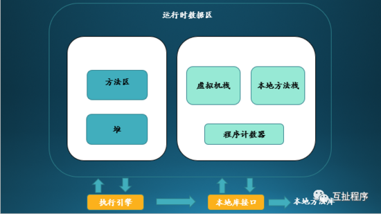
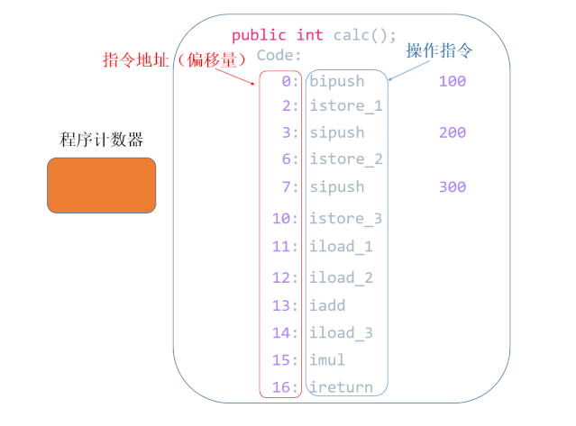
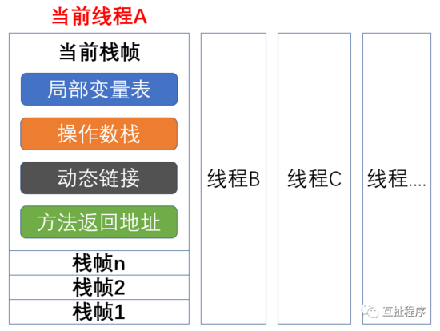
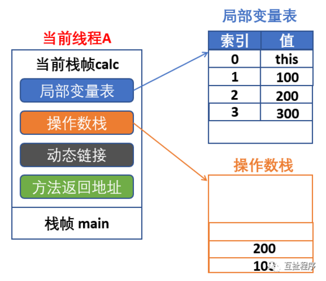
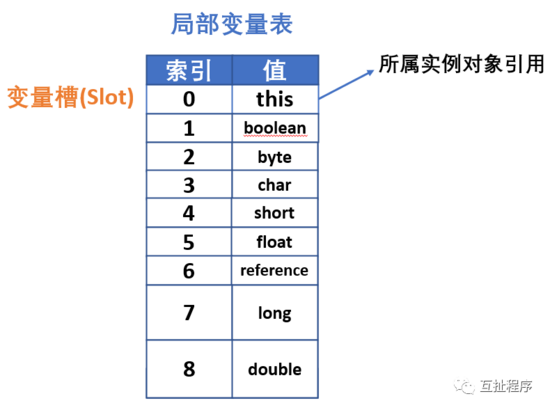
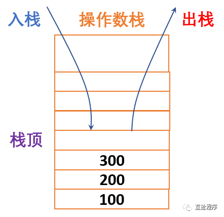
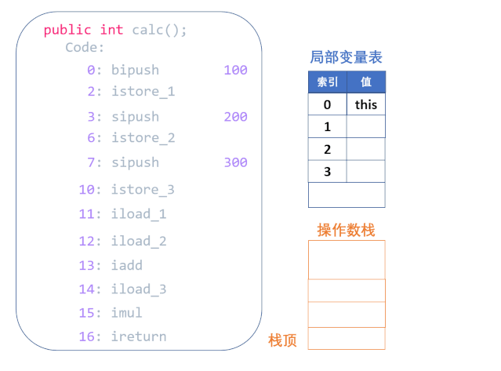
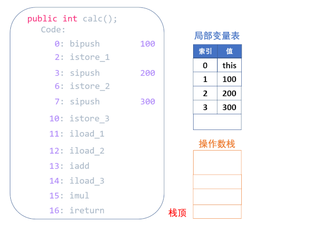
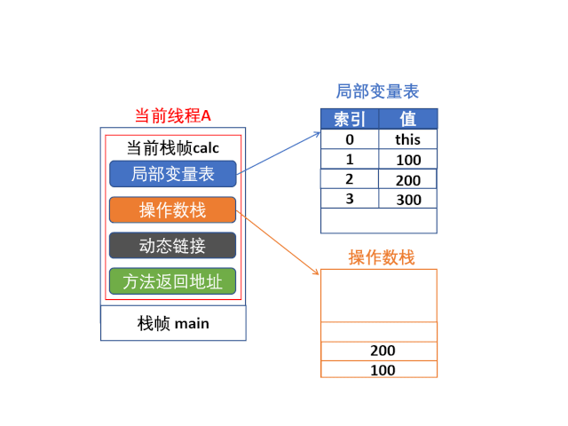
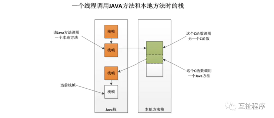

<h1 align="center">深度解析 JVM 运行时数据区之线程独占区</h1>



策划了很久了，一直在想用什么样的方式讲解知识点，能让大家一目了然，更容易的学到知识，并且还能加深记忆。思考良久，所以想到用动画的形式来展示。首次尝试，也希望大家多提出宝贵意见。后续可能会添加故事以及录音讲解的形式跟大家分享。

今天我们来了解一下JVM的运行时数据区，这部分内容是面试中90%的会问到的知识点。

## JAVA虚拟机

**JVM** ：就是JAVA虚拟机，在JAVA程序运行的过程中，会将它所管理的内存划分为若干个不同的数据区域，这些区域有的随着JVM的启动而创建，有的随着用户线程的启动和结束而建立和销毁。

一个基本的JVM运行时内存模型如下所示：


上图展示的是 **JVM虚拟机规范** 。注意，不同的虚拟机实现还是有一些出入的，Oracle在发布新的JAVA版本时，可能会对JVM做一定的优化和改进，例如在JDK8的版本中，方法区被移除，取而代之的是metaspace（元数据空间）

从上图我们可以看出，内存区域主要分为两部分：

1. 线程独占区，包括：程序计数器，虚拟机栈，本地方法栈
2. 线程共享区，包括： **方法区** ， **堆**

我们先从线程独占区开始讲起

## 程序计数器

**程序计数器** ：一块较小的内存空间，记录着当前线程所执行的字节码的行号指示器，也就是指向下一条指令的地址，即将执行的指令代码。由执行引擎读取下一条指令。

字节码解释器工作时通过改变这个计数器的值来选取下一条需要执行的字节码指令，读取一个指令就将其翻译成固定的操作，根据这些操作进行分支、循环、跳转等动作。

异常处理、线程恢复等功能都需要依赖这个计数器来完成。

我们在其他地方也看到过程序计数器也叫 **PC寄存器** （Program Counter Register），Register的命名源于CPU的寄存器，寄存器存储指令相关的现场信息。CPU只有把数据装载到寄存器才能运行。

特点

1. 如果线程正在执行的是Java 方法，则这个计数器记录的是正在执行的虚拟机字节码指令地址。

2. 如果正在执行的是Native 方法，则这个计数器值为空（Undefined）。

   因为native方法是java通过JNI直接调用本地C/C++库，可以近似的认为native方法相当于C/C++暴露给java的一个接口，java通过调用这个接口从而调用到C/C++方法。

   由于该方法是通过C/C++而不是java进行实现。那么自然无法产生相应的字节码，并且C/C++执行时的内存分配是由自己语言决定的，而不是由JVM决定的。

3. 此内存区域是唯一一个在Java虚拟机规范中没有规定任何OOM情况的区域。

### 作用

JVM的多线程是通过CPU时间片轮转（即线程轮流切换并分配处理器执行时间）算法来实现的。也就是说，某个线程在执行过程中可能会因为时间片耗尽而被挂起，而另一个线程获取到时间片开始执行。

当被挂起的线程重新获取到时间片的时候，它要想从被挂起的地方继续执行，就必须知道它上次执行到哪个位置，在JVM中，通过程序计数器来记录某个线程的字节码执行位置。

因此，程序计数器是具备线程隔离的特性，也就是说，每个线程工作时都有属于自己的独立计数器。不同线程之间的程序计数器互不影响，独立存储。

我们看下面的例子：

```java
public class JavaPTest {

    public static int calc(){
        int a = 100;
        int b = 200;
        int c = 300;
        int d = ( a + b ) * c;
        return d;
    }

    public static void main(String[] args) {
        calc();
    }
}
```

## 执行：javap -c JavaPTest.class

javap是jdk自带的反解析工具。它的作用就是根据class字节码文件，反解析出当前类对应的code区（汇编指令）、本地变量表、异常表和代码行偏移量映射表、常量池等等信息。

```java
public class com.JavaPTest {
  public com.JavaPTest();
    Code:
       0: aload_0
       1: invokespecial #1 // Method java/lang/Object."
 
  ":()V
 
       4: return

  public static int calc();
    Code:
       0: bipush        100
       2: istore_0
       3: sipush        200
       6: istore_1
       7: sipush        300
      10: istore_2
      11: iload_0
      12: iload_1
      13: iadd
      14: iload_2
      15: imul
      16: ireturn

  public static void main(java.lang.String[]);
    Code:
       0: invokestatic  #2 // Method calc:()I
       3: pop
       4: return
}
```

我们先看一下程序计数器如何记录的，下面将虚拟机栈的时候再对每条命令进行分解。



## 虚拟机栈

**虚拟机栈** ：Java方法执行的内存模型。每当启动一个新线程的时候，java虚拟机都会为它分配一个java栈。

java以栈帧为单位保存线程的运行状态。

虚拟机只会对java栈执行两种操作：以栈帧为单位的压栈或者出栈。

java栈会抛出

StackOverflowError 和 OutOfMemoryError 异常。

**栈帧：** 每个方法 被执行的时候都会创建一个 栈帧 **，** 用于存储 **局部变量表** ， **操作栈** ， **动态链接，方法出口** 等信息。



每一个方法被调用的过程就对应一个栈帧在虚拟机栈中从入栈到出栈的过程。

栈先进后出

我们对照上面的代码，当线程调用main函数的时候，这时候会创建栈帧main压入栈顶，当main函数调用calc函数的时候，系统会创建栈帧calc压入栈顶。下图所示。



局部变量表 ： 一片连续的内存空间，用来存放方法参数，以及方法内定义的局部变量，存放着编译期间已知的数据类型(八大基本类型和对象引用(reference类型)，returnAddress类型。

它的最小的局部变量表空间单位为Slot，虚拟机没有指明Slot的大小，但在jvm中，long和double类型数据明确规定为64位，这两个类型占2个Slot，其它基本类型固定占用1个Slot。

reference类型：与基本类型不同的是它不等同本身，即使是String，内部也是char数组组成，它可能是指向一个对象起始位置指针，也可能指向一个代表对象的句柄或其他与该对象有关的位置。

需要注意的是，局部变量表所需要的内存空间在编译期完成分配，当进入一个方法时，这个方法在栈中需要分配多大的局部变量空间是完全确定的，在方法运行期间不会改变局部变量表大小。

如果是实例方法（非static的方法），那么局部变量表中第0位索引的Slot默认是用于传递方法所属对象实例的引用" **this** "。其余参数则按照参数表的顺序来排列，占用从1开始的局部变量Slot



**操作数栈 (Operand Stack）**也常称为**操作栈**，它是一个先入后出栈。

当一个方法刚刚开始执行的时候，这个方法的操作数栈是空的，在方法的执行过程中，会有各种字节码指令往操作数栈中写入和提取内容，也就是出栈/入栈操作。

例如，在做算术运算的时候是通过操作数栈来进行的，又或者在调用其他方法的时候是通过操作数栈来进行参数传递的。

举个例子，整数加法的字节码指令iadd在运行的时候操作数栈中最接近栈顶的两个元素已经存入了两个int型的数值，当执行这个指令时，会将这两个int值出栈并相加，然后将相加的结果入栈。



下面我们用动画的形式分解一下刚才的代码：

bipush 100 将单字节的常量值100 (-128~127)压入操作数栈顶

istore_1 将操作数栈顶int型数值存入第二个局部变量

sipush 200 将一个短整型常量200 (-32768~32767)压入操作数栈顶

istore_2 将操作数栈顶int型数值存入第三个局部变量

sipush 300 将一个短整型常量300 (-32768~32767)压入操作数栈顶

istore_3 将操作数栈顶int型数值存入第四个局部变量



iload_1 将第二个int型局部变量推送至操作数栈顶

iload_2 将第三个int型局部变量推送至操作数栈顶

iadd 将栈顶两int型数值相加并将结果压入栈顶

iload_3 将第四个int型局部变量推送至操作数栈顶

imul 将栈顶两int型数值相乘并将结果压入栈顶

ireturn 从当前方法返回int



**动态连接**

每个栈帧都包含一个指向运行时常量池中该栈帧所属方法的引用，持有这个引用是为了支持方法调用过程中的动态连接(Dynamic Linking)。

**方法返回地址**

当一个方法开始执行后，只有两种方式可以退出，一种是遇到方法返回的字节码指令；一种是遇见异常，并且这个异常没有在方法体内得到处理。

无论采用何种退出方式，在方法退出之后，都需要返回到方法被调用的位置，程序才能继续执行，方法返回时可能需要在栈帧中保存一些信息，用来帮助恢复它的上层方法的执行状态。

一般来说，方法正常退出时，调用者的程序计数器的值可以作为 **返回地址** ，栈帧中很可能会保存这个计数器值。而方法异常退出时，返回地址是要通过异常处理器表来确定的，栈帧中一般不会保存这部分信息。

方法退出的过程实际上就等同于把当前栈帧出栈，因此退出时可能执行的操作有： 恢复上层方法的局部变量表和操作数栈，把返回值(如果有的话)压入调用者栈帧的操作数栈中，调整程序计数器的值以指向方法调用指令后面的一条指令等。



## 本地方法栈

**本地方法栈** （Native Method Stacks）与 Java 虚拟机栈所发挥的作用是非常相似的，Java虚拟机栈用于管理Java方法的调用，而本地方法栈用于管理本地方法的调用

虚拟机规范中对本地方法栈中的方法使用的语言、使用方式与数据结构并没有强制规定，因此具体的虚拟机可以自由实现它。

Navtive 方法是 Java 通过 JNI 直接调用本地 C/C++ 库，可以认为是 Native 方法相当于 C/C++ 暴露给 Java 的一个接口，Java 通过调用这个接口从而调用到 C/C++ 方法。

当线程调用 Java 方法时，虚拟机会创建一个栈帧并压入 Java 虚拟机栈。然而当它调用的是 native 方法时，虚拟机会保持 Java 虚拟机栈不变，也不会向 Java 虚拟机栈中压入新的栈帧，虚拟机只是简单地动态连接并直接调用指定的 native 方法。



例如我们常用的System.currentTimeMillis();就是一个本地方法

public static native long currentTimeMillis();

特点

1. 本地方法也可以通过本地方法接口来访问虚拟机的运行时数据区。

2. 它甚至可以直接使用本地处理器中的寄存器

3. 直接从本地内存的堆中分配任意数量的内存

4. 本地方法栈也会抛出

StackOverflowError 和 OutOfMemoryError 异常。


source: [动画：深度解析JVM运行时数据区 之 线程独占区](https://mp.weixin.qq.com/s?__biz=Mzg5NjMxMTYxNQ==&mid=2247486046&idx=1&sn=26a5dd2a9bd4057e8df87ebed1cd9c23&source=41#wechat_redirect)

