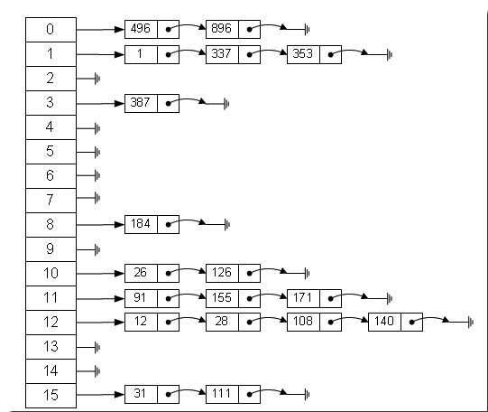

# HashMap、ArrayMap、SparseArray分析比较

## 一、原理分析 
#### 1、HashMap分析 
HashMap是基于hash表非同步map实现，key和value都可以为null。其hash表实现方式是”拉链法”，可理解为链表的数组，如下图所示： 


 
HashMap部分源码如下：

```java
/**
 * The hash table. If this hash map contains a mapping for null, it is
 * not represented this hash table.
 */
 transient HashMapEntry<K, V>[] table;

/**
 * Maps the specified key to the specified value.
 *
 * @param key
 *            the key.
 * @param value
 *            the value.
 * @return the value of any previous mapping with the specified key or
 *         {@code null} if there was no such mapping.
 */
@Override public V put(K key, V value) {
    if (key == null) {
        return putValueForNullKey(value);
    }

    int hash = Collections.secondaryHash(key);
    HashMapEntry<K, V>[] tab = table;
    int index = hash & (tab.length - 1);
    for (HashMapEntry<K, V> e = tab[index]; e != null; e = e.next) {
        if (e.hash == hash && key.equals(e.key)) {
            preModify(e);
            V oldValue = e.value;
            e.value = value;
            return oldValue;
        }
    }

    // No entry for (non-null) key is present; create one
    modCount++;
    if (size++ > threshold) {
        tab = doubleCapacity();
        index = hash & (tab.length - 1);
    }
    addNewEntry(key, value, hash, index);
    return null;
}

/**
 * Returns the value of the mapping with the specified key.
 *
 * @param key
 *            the key.
 * @return the value of the mapping with the specified key, or {@code null}
 *         if no mapping for the specified key is found.
 */
public V get(Object key) {
    if (key == null) {
        HashMapEntry<K, V> e = entryForNullKey;
        return e == null ? null : e.value;
    }

    int hash = Collections.secondaryHash(key);
    HashMapEntry<K, V>[] tab = table;
    for (HashMapEntry<K, V> e = tab[hash & (tab.length - 1)];
         e != null; e = e.next) {
        K eKey = e.key;
        if (eKey == key || (e.hash == hash && key.equals(eKey))) {
            return e.value;
        }
    }
    return null;
}

/**
 * Creates a new entry for the given key, value, hash, and index and
 * inserts it into the hash table. This method is called by put
 * (and indirectly, putAll), and overridden by LinkedHashMap. The hash
 * must incorporate the secondary hash function.
 */
void addNewEntry(K key, V value, int hash, int index) {
    table[index] = new HashMapEntry<K, V>(key, value, hash, table[index]);
}

static class HashMapEntry<K, V> implements Map.Entry<K, V> {
    final K key;
    V value;
    final int hash;
    HashMapEntry<K, V> next;

    HashMapEntry(K key, V value, int hash, HashMapEntry<K, V> next) {
        this.key = key;
        this.value = value;
        this.hash = hash;
        this.next = next;
    }

HashMap的HashMapEntry
/**
 * Doubles the capacity of the hash table. Existing entries are placed in
 * the correct bucket on the enlarged table. If the current capacity is,
 * MAXIMUM_CAPACITY, this method is a no-op. Returns the table, which
 * will be new unless we were already at MAXIMUM_CAPACITY.
 */
private HashMapEntry<K, V>[] doubleCapacity() {
    HashMapEntry<K, V>[] oldTable = table;
    int oldCapacity = oldTable.length;
    if (oldCapacity == MAXIMUM_CAPACITY) {
        return oldTable;
    }
    int newCapacity = oldCapacity * 2;
    HashMapEntry<K, V>[] newTable = makeTable(newCapacity);
    if (size == 0) {
        return newTable;
    }

    for (int j = 0; j < oldCapacity; j++) {
        /*
         * Rehash the bucket using the minimum number of field writes.
         * This is the most subtle and delicate code in the class.
         */
        HashMapEntry<K, V> e = oldTable[j];
        if (e == null) {
            continue;
        }
        int highBit = e.hash & oldCapacity;
        HashMapEntry<K, V> broken = null;
        newTable[j | highBit] = e;
        for (HashMapEntry<K, V> n = e.next; n != null; e = n, n = n.next) {
            int nextHighBit = n.hash & oldCapacity;
            if (nextHighBit != highBit) {
                if (broken == null)
                    newTable[j | nextHighBit] = n;
                else
                    broken.next = n;
                broken = e;
                highBit = nextHighBit;
            }
        }
        if (broken != null)
            broken.next = null;
    }
    return newTable;
}

/**
 * Allocate a table of the given capacity and set the threshold accordingly.
 * @param newCapacity must be a power of two
 */
private HashMapEntry<K, V>[] makeTable(int newCapacity) {
    @SuppressWarnings("unchecked") HashMapEntry<K, V>[] newTable
            = (HashMapEntry<K, V>[]) new HashMapEntry[newCapacity];
    table = newTable;
    threshold = (newCapacity >> 1) + (newCapacity >> 2); // 3/4 capacity
    return newTable;
}
```

扩容时执行makeTable方法，new一个原来两倍大小的HashMapEntry数据，并替换原table。

##### 2、ArrayMap分析 
android.util.ArrayMap存储结构是由int[] mHashes和Object[] mArray两个数据组成，mHashes保存key的hashCode，mArray以键值对形式保存key和value。 
ArrayMap取数据时通过二分法查找index，获取相应value。 
ArrayMap在remove和clear后，会重新收缩数据，节约空间，但会降低执行效率。ArrayMap是牺牲了时间换取空间。官方给出的说明如下：

Note that this implementation is not intended to be appropriate for data structures that may contain large numbers of items. It is generally slower than a traditional HashMap, since lookups require a binary search and adds and removes require inserting and deleting entries in the array. For containers holding up to hundreds of items, the performance difference is not significant, less than 50%.

根据官方描述，由于查找方式采用的是二分法，并且当你删除或者添加数据时，会对空间重新调整，ArrayMap不太适合数据量比较大的场景。 
部分源码如下： 
put:

```java
/**
 * Add a new value to the array map.
 * @param key The key under which to store the value.  If
 * this key already exists in the array, its value will be replaced.
 * @param value The value to store for the given key.
 * @return Returns the old value that was stored for the given key, or null if there
 * was no such key.
 */
@Override
public V put(K key, V value) {
    final int hash;
    int index;
    if (key == null) {
        hash = 0;
        index = indexOfNull();
    } else {
        hash = key.hashCode();
        index = indexOf(key, hash);
    }
    if (index >= 0) {
        index = (index<<1) + 1;
        final V old = (V)mArray[index];
        mArray[index] = value;
        return old;
    }

    index = ~index;
    // 容量不够
    if (mSize >= mHashes.length) {
        final int n = mSize >= (BASE_SIZE*2) ? (mSize+(mSize>>1))
                : (mSize >= BASE_SIZE ? (BASE_SIZE*2) : BASE_SIZE);

        if (DEBUG) Log.d(TAG, "put: grow from " + mHashes.length + " to " + n);

        final int[] ohashes = mHashes;
        final Object[] oarray = mArray;
        // 分配新容器
        allocArrays(n);

        if (mHashes.length > 0) {
            if (DEBUG) Log.d(TAG, "put: copy 0-" + mSize + " to 0");
            // copy方式存入新容器
            System.arraycopy(ohashes, 0, mHashes, 0, ohashes.length);
            System.arraycopy(oarray, 0, mArray, 0, oarray.length);
        }

        freeArrays(ohashes, oarray, mSize);
    }

    if (index < mSize) {
        if (DEBUG) Log.d(TAG, "put: move " + index + "-" + (mSize-index)
                + " to " + (index+1));
        System.arraycopy(mHashes, index, mHashes, index + 1, mSize - index);
        System.arraycopy(mArray, index << 1, mArray, (index + 1) << 1, (mSize - index) << 1);
    }

    mHashes[index] = hash;
    mArray[index<<1] = key;
    mArray[(index<<1)+1] = value;
    mSize++;
    return null;
}

private void allocArrays(final int size) {
    if (mHashes == EMPTY_IMMUTABLE_INTS) {
        throw new UnsupportedOperationException("ArrayMap is immutable");
    }
    if (size == (BASE_SIZE*2)) {
        synchronized (ArrayMap.class) {
            if (mTwiceBaseCache != null) {
                final Object[] array = mTwiceBaseCache;
                mArray = array;
                mTwiceBaseCache = (Object[])array[0];
                mHashes = (int[])array[1];
                array[0] = array[1] = null;
                mTwiceBaseCacheSize--;
                if (DEBUG) Log.d(TAG, "Retrieving 2x cache " + mHashes
                        + " now have " + mTwiceBaseCacheSize + " entries");
                return;
            }
        }
    } else if (size == BASE_SIZE) {
        synchronized (ArrayMap.class) {
            if (mBaseCache != null) {
                final Object[] array = mBaseCache;
                mArray = array;
                mBaseCache = (Object[])array[0];
                mHashes = (int[])array[1];
                array[0] = array[1] = null;
                mBaseCacheSize--;
                if (DEBUG) Log.d(TAG, "Retrieving 1x cache " + mHashes
                        + " now have " + mBaseCacheSize + " entries");
                return;
            }
        }
    }

    mHashes = new int[size];
    mArray = new Object[size<<1];
}
```

remove:

```java
/**
 * Remove the key/value mapping at the given index.
 * @param index The desired index, must be between 0 and {@link #size()}-1.
 * @return Returns the value that was stored at this index.
 */
public V removeAt(int index) {
    final Object old = mArray[(index << 1) + 1];
    if (mSize <= 1) {
        // Now empty.
        if (DEBUG) Log.d(TAG, "remove: shrink from " + mHashes.length + " to 0");
        freeArrays(mHashes, mArray, mSize);
        mHashes = EmptyArray.INT;
        mArray = EmptyArray.OBJECT;
        mSize = 0;
    } else {
        if (mHashes.length > (BASE_SIZE*2) && mSize < mHashes.length/3) {
            // Shrunk enough to reduce size of arrays.  We don't allow it to
            // shrink smaller than (BASE_SIZE*2) to avoid flapping between
            // that and BASE_SIZE.
            final int n = mSize > (BASE_SIZE*2) ? (mSize + (mSize>>1)) : (BASE_SIZE*2);

            if (DEBUG) Log.d(TAG, "remove: shrink from " + mHashes.length + " to " + n);

            final int[] ohashes = mHashes;
            final Object[] oarray = mArray;
            allocArrays(n);

            mSize--;
            if (index > 0) {
                if (DEBUG) Log.d(TAG, "remove: copy from 0-" + index + " to 0");
                System.arraycopy(ohashes, 0, mHashes, 0, index);
                System.arraycopy(oarray, 0, mArray, 0, index << 1);
            }
            if (index < mSize) {
                if (DEBUG) Log.d(TAG, "remove: copy from " + (index+1) + "-" + mSize
                        + " to " + index);
                System.arraycopy(ohashes, index + 1, mHashes, index, mSize - index);
                System.arraycopy(oarray, (index + 1) << 1, mArray, index << 1,
                        (mSize - index) << 1);
            }
        } else {
            mSize--;
            if (index < mSize) {
                if (DEBUG) Log.d(TAG, "remove: move " + (index+1) + "-" + mSize
                        + " to " + index);
                System.arraycopy(mHashes, index + 1, mHashes, index, mSize - index);
                System.arraycopy(mArray, (index + 1) << 1, mArray, index << 1,
                        (mSize - index) << 1);
            }
            mArray[mSize << 1] = null;
            mArray[(mSize << 1) + 1] = null;
        }
    }
    return (V)old;
}
```

get:

```java
@Override
public V get(Object key) {
    final int index = indexOfKey(key);
    return index >= 0 ? (V)mArray[(index<<1)+1] : null;
}

public int indexOfKey(Object key) {
    return key == null ? indexOfNull() : indexOf(key, key.hashCode());
}

int indexOf(Object key, int hash) {
    final int N = mSize;

    // Important fast case: if nothing is in here, nothing to look for.
    if (N == 0) {
        return ~0;
    }

    // 二分法查找
    int index = ContainerHelpers.binarySearch(mHashes, N, hash);

    // If the hash code wasn't found, then we have no entry for this key.
    if (index < 0) {
        return index;
    }

    // If the key at the returned index matches, that's what we want.
    if (key.equals(mArray[index<<1])) {
        return index;
    }

    // Search for a matching key after the index.
    int end;
    for (end = index + 1; end < N && mHashes[end] == hash; end++) {
        if (key.equals(mArray[end << 1])) return end;
    }

    // Search for a matching key before the index.
    for (int i = index - 1; i >= 0 && mHashes[i] == hash; i--) {
        if (key.equals(mArray[i << 1])) return i;
    }

    // Key not found -- return negative value indicating where a
    // new entry for this key should go.  We use the end of the
    // hash chain to reduce the number of array entries that will
    // need to be copied when inserting.
    return ~end;
}
```

#### 3、SparseArray分析 
SparseArray解析 
这篇文章中已做了分析。

## 二、比较 
HashMap、ArrayMap、SparseArray比较如下：

| 类   | cpu   | 内存  | 适用场景  |
| --- | --- | --- | --- |
| HashMap  | 增、删、查找速度较快                                         | 双倍扩容、不做空间整理，内存使用效率低                    | 数据量较大或内存空间相对宽裕                                 |
| ArrayMap    | 增、删、查速度较慢                                           | size大于8扩容时，只增大当前数组大小的一半，做空间收缩整理 | 数据量小于1000时，速度相对差别不大，可替代HashMap            |
| SparseArray | 增、查速度较慢，由于延迟删除机制，删速度比ArrayMap快，比HashMap慢 | 矩阵压缩，大大减少了存储空间，节约内存                    | 避免了key的自动装箱，空间压缩等机制，使得其在key是Integer、Long，且数据量较小场景下性能最优 |

参考文章： 
http://zha-zi.iteye.com/blog/1124484