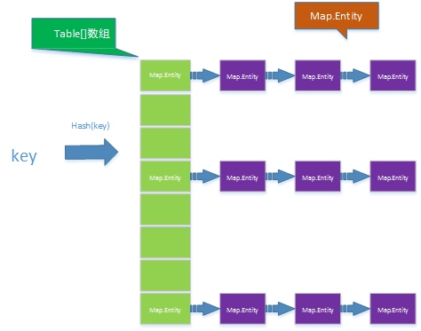
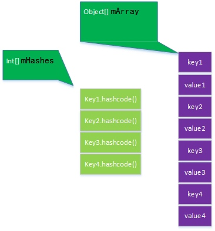
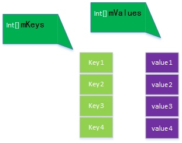
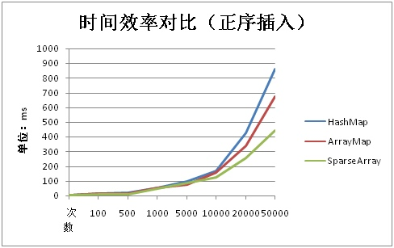
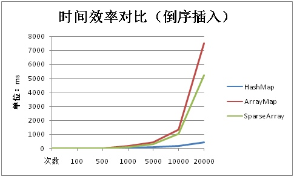
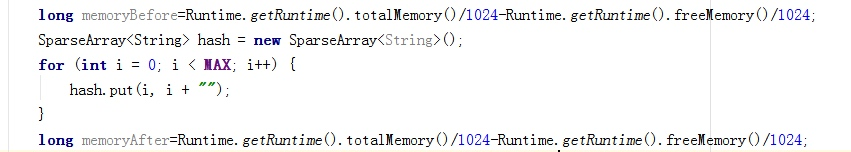
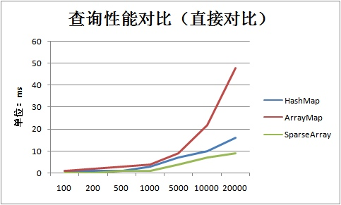
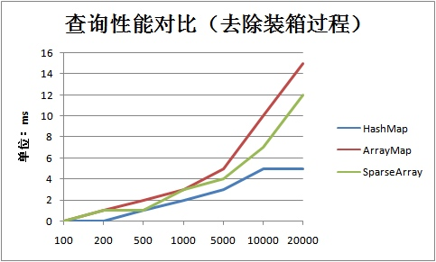

# HashMap，ArrayMap，SparseArray源码分析及性能对比

ArrayMap及SparseArray是android的系统API，是专门为移动设备而定制的。用于在一定情况下取代HashMap而达到节省内存的目的。
一.源码分析(由于篇幅限制，源码分析部分会放在单独的文章中)
二.实现原理及数据结构对比
三.性能测试对比
四.总结

## 一.源码分析
稍后会在下一篇文章中补充（都写在一篇，篇幅太长了）
## 二.实现原理及数据结构对比

#### 1. hashMap


Paste_Image.png

从hashMap的结构中可以看出，首先对key值求hash，根据hash结果确定在table数组中的位置，当出现哈希冲突时采用开放链地
址法进行处理。Map.Entity的数据结构如下：

```java
static class HashMapEntry<K, V> implements Entry<K, V> {    
final K key;    
V value; 
final int hash;   
 HashMapEntry<K, V> next;
}  
```

具体的hashmap源码细节会在其他文章中进行分析，这里可以看出来的是，从空间的角度分析，HashMap中会有一个利用率不超过负载因子（默认为0.75）的table数组，其次，对于HashMap的每一条数据都会用一个HashMapEntry进行记录，除了记录key，value外，还会记录下hash值，及下一个entity的指针。
时间效率方面，利用hash算法，插入和查找等操作都很快，且一般情况下，每一个数组值后面不会存在很长的链表（因为出现hash冲突毕竟占比较小的比例），所以不考虑空间利用率的话，HashMap的效率非常高。

#### 2.ArrayMap


Paste_Image.png

ArrayMap利用两个数组，mHashes用来保存每一个key的hash值，mArrray大小为mHashes的2倍，依次保存key和value。源码的细节方面会在下一篇文章中说明。现在我们先抛开细节部分，只看关键语句：

```java
mHashes[index] = hash;
mArray[index<<1] = key;
mArray[(index<<1)+1] = value;
```

相信看到这大家都明白了原理了。但是它怎么查询呢？答案是二分查找。当插入时，根据key的hashcode()方法得到hash值，计算出在mArrays的index位置，然后利用二分查找找到对应的位置进行插入，当出现哈希冲突时，会在index的相邻位置插入。
总结一下，空间角度考虑，ArrayMap每存储一条信息，需要保存一个hash值，一个key值，一个value值。对比下HashMap 粗略的看，只是减少了一个指向下一个entity的指针。还有就是节省了一部分可见空间上的内存节省也不是特别明显。是不是这样呢？后面会验证。
时间效率上看，插入和查找的时候因为都用的二分法，查找的时候应该是没有hash查找快，插入的时候呢，如果顺序插入的话效率肯定高，但如果是随机插入，肯定会涉及到大量的数组搬移，数据量大，肯定不行，再想一下，如果是不凑巧，每次插入的hash值都比上一次的小，那就得次次搬移，效率一下就扛不住了的感脚。

#### 3.SparseArray


Paste_Image.png
sparseArray相对来说就简单的多了，但是不要以为它可以取代前两种，sparseArray只能在key为int的时候才能使用，注意是int而不是Integer，这也是sparseArray效率提升的一个点，去掉了装箱的操作!。
因为key为int也就不需要什么hash值了，只要int值相等，那就是同一个对象，简单粗暴。插入和查找也是基于二分法，所以原理和Arraymap基本一致，这里就不多说了。
总结一下：空间上对比，与HashMap，去掉了Hash值的存储空间，没有next的指针占用，还有其他一些小的内存占用，看着节省了不少。
时间上对比：插入和查找的情形和Arraymap基本一致，可能存在大量的数组搬移。但是它避免了装箱的环节，不要小看装箱过程，还是很费时的。所以从源码上来看，效率谁快，就看数据量大小了。
好啦，说半天都是分析，下面来点实际的，用数据说话！


## 三.性能测试对比
我们从插入和查询两方面来比对试试看。

#### 1.插入性能时间对比
测试代码：

```java
long start = System.currentTimeMillis();
Map<Integer, String> hash = new HashMap<Integer, String>();
for (int i = 0; i < MAX; i++) { 
   hash.put(i, i+"");
}
long ts = System.currentTimeMillis() - start;
```

就贴这一段吧，其他两段代码无非就是把HashMap换掉，通过改变Max值就行对比。


Paste_Image.png

分析：从结果上来看，数据量小的时候，差异并不大（当然了，数据量小，时间基准小，内容太多,就不贴数据表了，确实差异不大），当数据量大于5000左右，SparseArray，最快，HashMap最慢，乍一看，好像SparseArray是最快的，但是要注意，这是顺序插入的。也就是SparseArray和Arraymap最理想的情况。
来个逆序插入的试试

```java
long start = System.currentTimeMillis();
HashMap<Integer, String> hash = new HashMap<Integer, String>();
for (int i = 0; i < MAX; i++) {    
hash.put(MAX-1-i, i+"");
}
long ts = System.currentTimeMillis() - start;
```


Paste_Image.png

分析：从结果上来看，果然，HashMap远超Arraymap和SparseArray，也前面分析一致。
当然了，数据量小的时候，例如1000以下，这点时间差异也是可以忽略的。
下面来看看空间对比：先说一下测试方法，因为测试内存，所以尤其要注意的一点，就是测试的过程不要发生GC，如果发生了GC，那数据就不准了，想了想，用了个比较简单的方法：
Runtime.getRuntime().totalMemory()//获取应用已经申请到的总的内存

Runtime.getRuntime().freeMemory()//获取应用内存的free部分

两个方法的差值就是应用已经使用的内存部分。

Paste_Image.png

值得注意的是当MAX值很大的时候，可能在代码执行过程发生GC，此时可以同时用Android Monitor的Memory窗口监视内存，没有发生gc的过程结果才有效。假设数据量比较大的时候，每测完一次手动GC一次，这样基本上每次都能测试成功；因为数据量也不是特别大，只有很少一部分情况测试过程会发生GC，所以也没有去进一步探究其他方式，比如设置虚拟机参数来延长GC时间，有空了可以搞一下。上数据：


Paste_Image.png
可见，SparseArray在内存占用方面的确要优于HashMap和ArrayMap不少，通过数据观察，大致节省30%左右，而ArrayMap的表现正如前面说的，优化作用有限，几乎和HashMap相同。

#### 2.查找性能对比

```java
long start = System.currentTimeMillis();    
SparseArray<String> hash = new SparseArray<String>();
for (int i = 0; i < MAX; i++) {   
 hash.get(i);
}
long ts = System.currentTimeMillis() - start;
```


Paste_Image.png

发现SparseArray比HashMap要快，和前面假设的不符，二分查找难道比Hash快？
再一想，因为用这样的代码测试有点不公平，因为SparseArray没有装箱，HashMap有个装箱的过程，似乎不太公平。那么想个办法再来测试下，

```java
ArrayList<IntEntity> intEntityList=new ArrayList<IntEntity>();
private void boxing(){  
  for(int i=0;i<MAX;i++){      
  IntEntity entity=new IntEntity();  
      entity.i1=i;        
    entity.i2=Integer.valueOf(i);       
 intEntityList.add(entity);  
  }
}
class IntEntity{    
 int i1;   
 Integer i2;
}
```

给HashMap和ArrayMap的时候给它提前装箱，这样似乎公平些。

```java
long start = System.currentTimeMillis();
HashMap<Integer, String> hash = new HashMap<Integer, String>();
for (int i = 0; i < MAX; i++) { 
 //  hash.get(i); 
  hash.get(intEntityList.get(i).i2);
}
long ts = System.currentTimeMillis() - start;
```


Paste_Image.png

果然结果不一样了，HashMap才是查询最快的，这才符合逻辑嘛，但是我们正常用的时候是不管装不装箱的，所以综合起来还是使用SparseArray效率最高。
扯了这么多，终于到了该总结的时候了。

## 四、总结
1.在数据量小的时候一般认为1000以下，当你的key为int的时候，使用SparseArray确实是一个很不错的选择，内存大概能节省30%，相比用HashMap，因为它key值不需要装箱，所以时间性能平均来看也优于HashMap,建议使用！

2.ArrayMap相对于SparseArray，特点就是key值类型不受限，任何情况下都可以取代HashMap,但是通过研究和测试发现，ArrayMap的内存节省并不明显，也就在10%左右，但是时间性能确是最差的，当然了，1000以内的数据量也无所谓了，加上它只有在API>=19才可以使用，个人建议没必要使用！还不如用HashMap放心。估计这也是为什么我们再new一个HashMap的时候google也没有提示让我们使用的原因吧。


作者：jjlanbupt
链接：https://www.jianshu.com/p/7b9a1b386265
來源：简书
简书著作权归作者所有，任何形式的转载都请联系作者获得授权并注明出处。