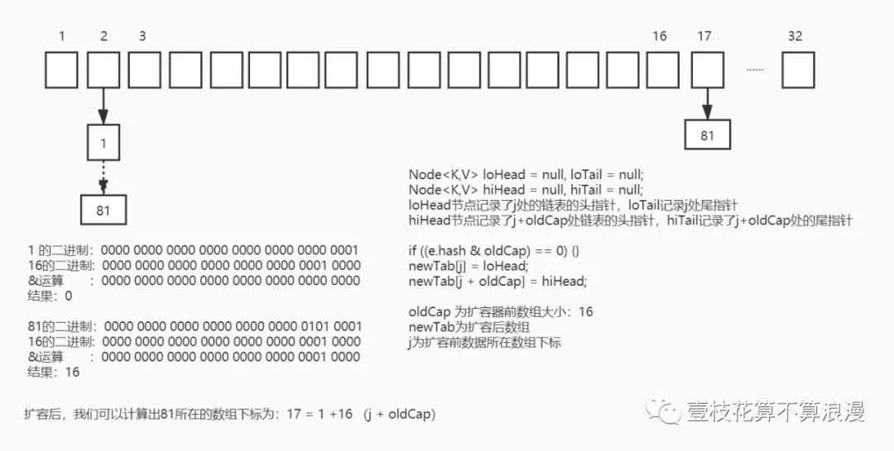
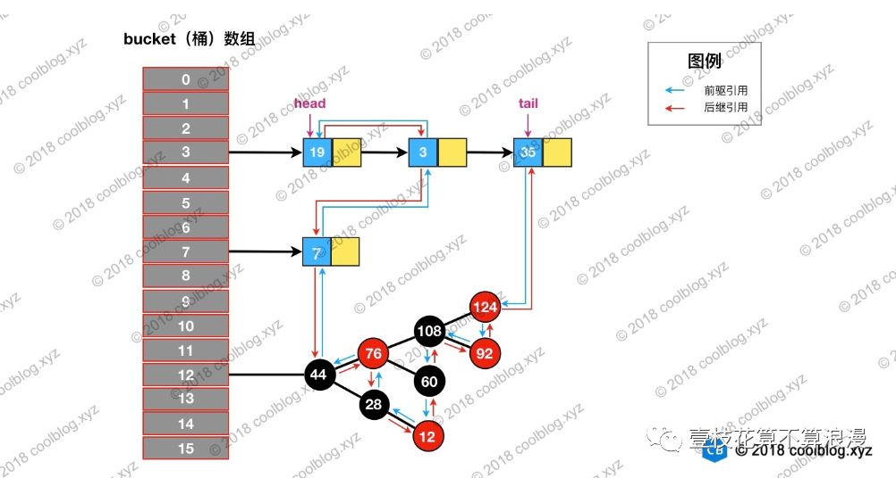

<h1 align="center">JDK源码之集合篇</h1>

[toc]

## ArrayList，LinkedList

### 使用到的工具类

System.arraycopy(srcElements, srcIndex, targetElement, tarIndex, srcLength);

Arrays.copyOf(数组,型数组长度);

### 位运算复习

x>>1  等价于：x / 2  (2的1次方)

x<<1  等价于：x * 2  (2的1次方)

^ 异或  1 ^ 0 = 1,  1 ^ 1 = 0,  0 ^ 0 = 0

& 与   1 & 1 = 1 其余都为0  所以&结果都趋向0

| 或   0 | 0 为0 其余都为1  所以|结果都趋向1

## HashMap

### logn、 lgn 数学知识学习

一般的，如果a^x = N

那么数x叫做以a为底N的对数，x = logaN， 其中a叫做底数

lgn是以10位底n的对数

时间复杂度：Ο(1)＜Ο(log2n)＜Ο(n)＜Ο(nlog2n)＜Ο(n2)＜Ο(n3)＜O(n!)

### JDK8中hash算法

hash算法：return (key == null) ? 0 : (h = key.hashCode()) ^ (h >>> 16);

h是key的hashcode, 结果为a

h右移16位 也就是key的高16位移动到低16位，结果为b

a ^ b 相当于：key的hashcode高16位和低16位异或运算，能够使hashcode低16位更加散乱, 真正计算槽位的算法只有低16位会参与运算

hashMap key值寻找数组位置的方法：(n - 1) & hash  n是数组长度

hashMap默认长度为16，这个算法为 15 & hash

### 几个问题：

#### 为什么用右移16位

真正计算数组位置的用的是低16位，所以右移可以将高16位起到作用，使得hash更加散乱

#### 为什么用^计算高16位和低16位

&结果趋向0  |结果趋向1  只有^后的结果会更加散乱

& 计算只有两个都为1 才是1，所以结果趋向0

| 计算还有两个都为0才是0， 所以结果趋向1

#### 为什么槽位必须是2^n

1. 例如长度是17， 17 - 1 = 16，二进制是 00010000 最后计算&操作时，结果不是1就是16，而16 - 1 = 15, 二进制是00001111, 低4位1111计算会有更多结果
2. 方便位运算：key % (2^n) 等价于 key & (2^n - 1)

### put的详细解读

```java
 1final V putVal(int hash, K key, V value, boolean onlyIfAbsent,
 2                   boolean evict) {
 3    Node<K,V>[] tab; Node<K,V> p; int n, i;
 4    // 如果table没有初始化，那么则先使用resize，newCap = DEFAULT_INITIAL_CAPACITY; 这里初始化数组大小的意思 默认为1<<4=16
 5    if ((tab = table) == null || (n = tab.length) == 0)
 6        n = (tab = resize()).length;
 7    // tab[i=(n-1)&hash] 意思是 计算数组的槽位，n-1&hash 等价于 hash%n
 8    // p就是这个通过hash计算的槽位的Node信息
 9    if ((p = tab[i = (n - 1) & hash]) == null)
10        tab[i] = newNode(hash, key, value, null);
11    else {
12        Node<K,V> e; K k;
13        // p.hash == hash  说明通过hash计算的槽位已经有值了
14        // (k = p.key) == key  说明传入的key值和当前槽位的值地址相同
15        // key.equals(k) 说明传入的key值和当前槽位的值相同
16        // 如果hash值和key都相等  那么则将传入的value替换成当前槽位的值
17        if (p.hash == hash &&
18            ((k = p.key) == key || (key != null && key.equals(k))))
19            e = p;
20        else if (p instanceof TreeNode)
21            // 如果是树结构
22            e = ((TreeNode<K,V>)p).putTreeVal(this, tab, hash, key, value);
23        else {
24            // 此时说明hash冲突，且链表还没有转化成树
25            for (int binCount = 0; ; ++binCount) {
26                // 判断当前槽位的next是否为空
27                if ((e = p.next) == null) {
28                    // 如果为空，则新建一个Node，p.Next = newNode
29                    p.next = newNode(hash, key, value, null);
30                    // 如果当前链表的长度，大于等于TREEIFY_THRESHOLD - 1 = 7 转化为红黑树
31                    // bincount 从0开始的, 所以当bincount为7时，链表长度为8（算上数组槽位开始的那个节点，总长度为9）
32                    if (binCount >= TREEIFY_THRESHOLD - 1) // -1 for 1st
33                        treeifyBin(tab, hash);
34                    break;
35                }
36                // 和上面判断一致，判断hash和e=p.next的key值是否一致
37                // 如果一致则直接退出，此时e=p.next 下面判断e!= null，则e.value=value替换
38                if (e.hash == hash &&
39                    ((k = e.key) == key || (key != null && key.equals(k))))
40                    break;
41                // p = e = p.next 然后继续for循环
42                p = e;
43            }
44        }
45        if (e != null) { // existing mapping for key
46            V oldValue = e.value;
47            if (!onlyIfAbsent || oldValue == null)
48                // 将value值覆盖当前槽位的值
49                e.value = value;
50            afterNodeAccess(e);
51            return oldValue;
52        }
53    }
54    ++modCount;
55    // 判断是否需要扩容，size 是hashMap中key-value键值对的数量
56    // threshold = 数组长度(模拟了16) * 负载因子(默认0.75) = 12
57    if (++size > threshold)
58        resize();
59    afterNodeInsertion(evict);
60    return null;
61}
```

### hashmap扩容原理

#### 扩容之桶计算规则

n = 16：

n - 1   0000 0000 0000 0000 0000 0000 0001 1111

hash1   1111 1111 1111 1111 0000 1111 0000 0101

&结果    0000 0000 0000 0000 0000 0000 0000 0101 = 5（index = 5的位置）

扩容后 n = 32：

n -1    0000 0000 0000 0000 0000 0000 0001 1111

hash2   1111 1111 1111 1111 0000 1111 0001 0101

&结果    0000 0000 0000 0000 0000 0000 0001 0101 = 21（index = 21的位置）

JDK 1.8，扩容一定是2的倍数，从16到32到64到128

就可以保证说，每次扩容之后，你的每个hash值要么是停留在原来的那个index的地方，要么是变成了原来的index（5） + oldCap（16） = 21

因此，我们在扩充HashMap的时候，不需要像JDK1.7的实现那样重新计算hash，只需要看看原来的hash值新增的那个bit是1还是0就好了，是0的话索引没变，是1的话索引变成“原索引+oldCap”。

### 扩容之桶计算规则图解



01_JDK1.8 HashMap resize原理.jpg

#### 扩容核心算法：

```java
 1final Node<K,V>[] resize() {
 2    // 核心源码，省略了其他代码
 3    // 遍历就数组元素
 4    for (int j = 0; j < oldCap; ++j) {
 5        Node<K,V> e;
 6        // e等于当前j位置头结点元素
 7        if ((e = oldTab[j]) != null) {
 8            // 已经赋值给e了，这里可以直接设置为null，方便gc
 9            oldTab[j] = null;
10            // 如果该处next元素为null，说明没有链表结构，直接做类似rehash操作
11            if (e.next == null)
12                newTab[e.hash & (newCap - 1)] = e;
13            else if (e instanceof TreeNode)
14                // 红黑树特殊处理
15                ((TreeNode<K,V>)e).split(this, newTab, j, oldCap);
16            else { // preserve order
17                // 扩容后的节点不在j位置就在j+oldCap(原始数组大小)位置
18                // loHead为j处位置节点低位node，loTail为j处节点最末端node
19                // hiHead为j+oldCap处位置节点低位node，hiTail为j+oldCap处节点最末端node
20                Node<K,V> loHead = null, loTail = null;
21                Node<K,V> hiHead = null, hiTail = null;
22                Node<K,V> next;
23                do {
24                    next = e.next;
25                    // 如果为0，说明扩容后的元素还在j这个节点位置
26                    // 如果不为0，说明扩容后的元素会在j + oldCap节点位置
27                    if ((e.hash & oldCap) == 0) {
28                        // 如果j处尾节点为null，说明第一次设置。则设置e为头结点
29                        if (loTail == null)
30                            loHead = e;
31                        else
32                            // 设置头结点的next为e
33                            loTail.next = e;
34                        // e设置为尾结点，这就是尾插法
35                        loTail = e;
36                    }
37                    else {
38                        // 这个else分支就说明扩容后这些节点会散落到j+oldCap数组的桶上
39                        // 同上，如果j+oldCap的尾节点为空 说明第一次设置，设置头结点为e
40                        if (hiTail == null)
41                            hiHead = e;
42                        else
43                            hiTail.next = e;
44                        hiTail = e;
45                    }
46                    // 这里while循环是将j对应的桶上面所有的链表或者红黑树的Node全都rehash完
47                } while ((e = next) != null);
48                // 这里已经设置好 一个完整的链表结构了，这里是设置j和j+oldCap桶位置数据
49                if (loTail != null) {
50                    loTail.next = null;
51                    newTab[j] = loHead;
52                }
53                if (hiTail != null) {
54                    hiTail.next = null;
55                    newTab[j + oldCap] = hiHead;
56                }
57            }
58        }
59    }
60    return newTab;
61}
```

### hashmap jdk1.8相对于1.7 优化了什么

1. 数据结构改变
   数组+链表 改为：数组+链表+红黑树
2. hash算法改变
   1.8中hash算法改为：(h = key.hashCode) ^ (h>>>16)  高低16位混合运算
3. 扩容方式改变
   头插法变成尾插法，并发情况下不会形成死锁

#### 参考文章：

1. 品HashMap（java8）：https://juejin.im/post/5dec684e6fb9a016227786c0
2. HashMap中的hash算法中的几个疑问：https://www.cnblogs.com/zxporz/p/11204233.html
3. Java源码分析：HashMap 1.8 相对于1.7 到底更新了什么？：https://www.jianshu.com/p/8324a34577a0

## LinkedHashMap

### 数据结构

LinkedHashMap 继承自 HashMap，在 HashMap 基础上，通过维护一条双向链表，解决了 HashMap 不能随时保持遍历顺序和插入顺序一致的问题。除此之外，LinkedHashMap 对访问顺序也提供了相关支持。在一些场景下，该特性很有用，比如缓存。

数据结构如图：（原图地址:http://www.tianxiaobo.com/2018/01/24/LinkedHashMap-源码详细分析（JDK1-8）/）



image.png

### 插入数据

```java
 1// HashMap 中实现
 2Node<K,V> newNode(int hash, K key, V value, Node<K,V> next) {
 3    return new Node<>(hash, key, value, next);
 4}
 5
 6// LinkedHashMap 中覆写
 7Node<K,V> newNode(int hash, K key, V value, Node<K,V> e) {
 8    LinkedHashMap.Entry<K,V> p =
 9        new LinkedHashMap.Entry<K,V>(hash, key, value, e);
10    // 将 Entry 接在双向链表的尾部
11    linkNodeLast(p);
12    return p;
13}
14
15// LinkedHashMap 中实现
16private void linkNodeLast(LinkedHashMap.Entry<K,V> p) {
17    LinkedHashMap.Entry<K,V> last = tail;
18    tail = p;
19    // last 为 null，表明链表还未建立
20    if (last == null)
21        head = p;
22    else {
23        // 将新节点 p 接在链表尾部
24        p.before = last;
25        last.after = p;
26    }
27}
```

### LinkedHashMap维护访问顺序

```java
1// 如果accessOrder为true
2// 调用get/getOrDefault/replace方法 会将这些方法访问的节点移动到链表的尾部
3void afterNodeAccess(Node<K,V> p) { }
4// putValue的时候对调用
5void afterNodeInsertion(boolean evict) { }
6// remove时候调用
7void afterNodeRemoval(Node<K,V> p) { }
```

通过回调的方式，让 LinkedHashMap 有机会做一些后置操作。上述三个方法的具体实现在 LinkedHashMap中。

```java
 1// LinkedHashMap 中覆写
 2public V get(Object key) {
 3    Node<K,V> e;
 4    if ((e = getNode(hash(key), key)) == null)
 5        return null;
 6    // 如果 accessOrder 为 true，则调用 afterNodeAccess 将被访问节点移动到链表最后
 7    if (accessOrder)
 8        afterNodeAccess(e);
 9    return e.value;
10}
11
12// LinkedHashMap 中覆写
13void afterNodeAccess(Node<K,V> e) { // move node to last
14    LinkedHashMap.Entry<K,V> last;
15    if (accessOrder && (last = tail) != e) {
16        LinkedHashMap.Entry<K,V> p =
17            (LinkedHashMap.Entry<K,V>)e, b = p.before, a = p.after;
18        p.after = null;
19        // 如果 b 为 null，表明 p 为头节点
20        if (b == null)
21            // 将p的后置节点设置为head节点
22            head = a;
23        else
24            // 如果b不为空，说明p前置存在节点
25            // 那么将p的后置节点设置为b的后置节点
26            b.after = a;
27
28        // 判断p的后置节点，如果不为空    
29        if (a != null)
30            设置a的前置节点为b
31            a.before = b;
32
33        // 如果p的后置节点为空, 这说明p为尾节点
34        // 这种情况会将p的前置节点设置为尾节点
35        else
36            last = b;
37
38        // 如果last为空，这说明链表没有元素，所以head = p
39        if (last == null)
40            head = p;
41        else {
42            // 将 p 接在链表的最后
43            p.before = last;
44            last.after = p;
45        }
46        tail = p;
47        ++modCount;
48    }
49}
```

### LinkedHashMap实现LRU算法

上面已经知道，如果accessOrder是true，那么get等操作都会将tail指正指向该元素
HashMap putValue的时候对调用：afterNodeInsertion(evict) -> removeEldestEntry()

我们需要复写removeEldestEntry() 方法指定移除策略，然后会移除first元素

代码实现可参考我的demo：https://github.com/barrywangmeng/java-learning/tree/master/java-learning/src/main/java/cn/barrywangmeng/cache/lru

## 来源

https://mp.weixin.qq.com/s/zJ4MWU8J8pqJBIvrlKoJAA

