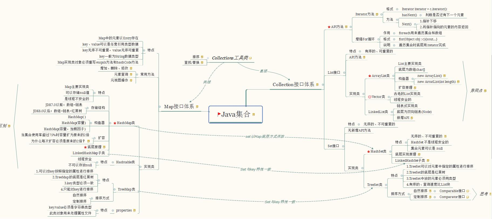
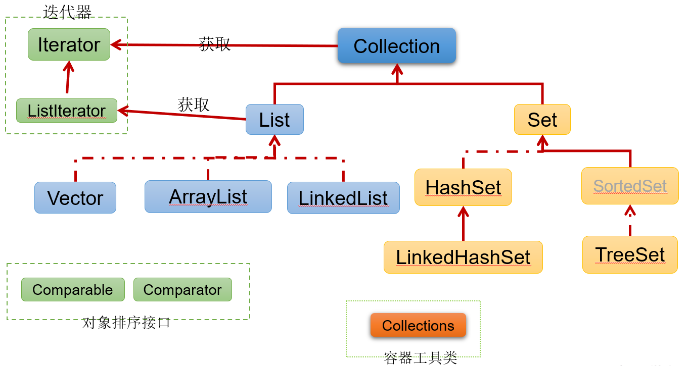
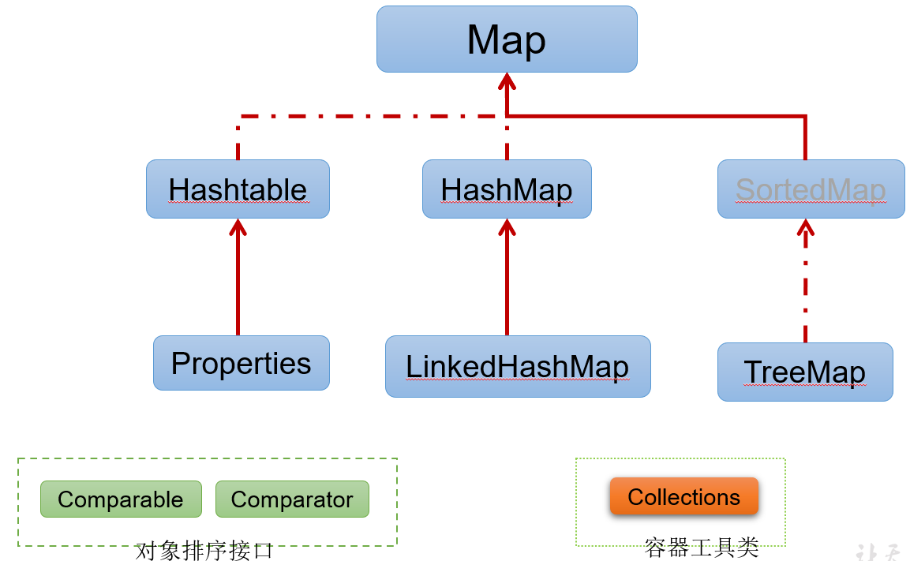
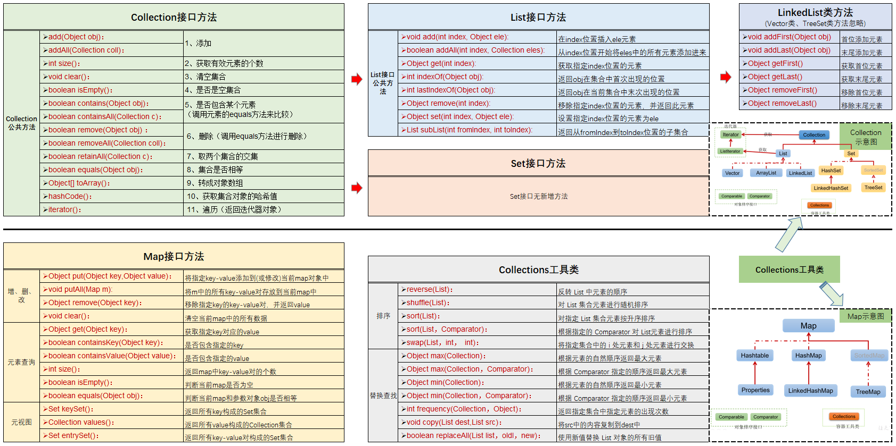

<h1 align="center">Java集合</h1>

[TOC]

## Java集合框架图

## Collection接口和实现类

### List

- `ArrayList`：线程不同步。默认初始容量为10，当数组大小不足时增长率为当前长度的`50%`。
- `Vector`：**线程同步**。默认初始容量为10，当数组大小不足时增长率为当前长度的`100%`。它的同步是通过`Iterator`方法加`synchronized`实现的。
- `Stack`：**线程同步**。继承自`Vector`，添加了几个方法来完成栈的功能。
- `LinkedList`：线程不同步。**双端队列形式**。

### Set：Set是一种不包含重复元素的Collection，Set最多只有一个null元素。

- `HashSet`：线程不同步，内部使用`HashMap`进行数据存储，提供的方法基本都是调用`HashMap`的方法，所以两者本质是一样的。**集合元素可以为**`NULL`。
- `NavigableSet`：添加了搜索功能，可以对给定元素进行搜索：小于、小于等于、大于、大于等于，放回一个符合条件的最接近给定元素的 key。
- `TreeSet`：线程不同步，内部使用`NavigableMap`操作。默认元素“自然顺序”排列，可以通过`Comparator`改变排序。
- `EnumSet`：线程不同步。内部使用Enum数组实现，速度比`HashSet`快。**只能存储在构造函数传入的枚举类的枚举值**。

### Set和List的区别

- Set 接口实例存储的是**无序的，不重复**的数据。List 接口实例存储的是有序的，可以重复的元素。
- Set 检索效率低下，删除和插入效率高，插入和删除不会引起元素位置改变 **<实现类有HashSet,TreeSet>**。
- List 和数组类似，可以动态增长，根据实际存储的数据的长度自动增长List的长度。查找元素效率高，插入删除效率低，因为会引起其他元素位置改变 **<实现类有ArrayList,LinkedList,Vector>** 。

## Map接口和实现类

- `HashMap`：线程不同步。根据`key`的`hashcode`进行存储，内部使用静态内部类`Node`的数组进行存储，默认初始大小为16，每次扩大一倍。当发生Hash冲突时，采用拉链法（链表）。**可以接受为null的键值\(key\)和值\(value\)**。JDK 1.8中：当单个桶中元素个数大于等于8时，链表实现改为红黑树实现；当元素个数小于6时，变回链表实现。由此来防止hashCode攻击。
- `LinkedHashMap`：**保存了记录的插入顺序**，在用Iterator遍历LinkedHashMap时，先得到的记录肯定是先插入的. 也可以在构造时用带参数，按照应用次数排序。在遍历的时候会比HashMap慢，不过有种情况例外，当HashMap容量很大，实际数据较少时，遍历起来可能会比LinkedHashMap慢，因为LinkedHashMap的遍历速度只和实际数据有关，和容量无关，而HashMap的遍历速度和他的容量有关。
- `TreeMap`：线程不同步，基于 **红黑树*- （Red-Black tree）的NavigableMap 实现，**能够把它保存的记录根据键排序,默认是按键值的升序排序，也可以指定排序的比较器，当用Iterator 遍历TreeMap时，得到的记录是排过序的。**
- `HashTable`：线程安全，HashMap的迭代器\(Iterator\)是`fail-fast`迭代器。**HashTable不能存储NULL的key和value。**
- `ConcurrentHashmap`：支持并发操作的 Hash 表，`ConcurrentHashmap` 具有和 `HashTable` 同样的功能，并且具有相应的方法。即使所有操作都是线程安全的，但是并不需要进行加锁。

## 集合接口方法

| 序号 | 接口描述                                                     |
| :--- | :----------------------------------------------------------- |
| 1    | Collection 接口 Collection 是最基本的集合接口，一个 Collection 代表一组 Object，即 Collection 的元素, Java不提供直接继承自Collection的类，只提供继承于的子接口(如List和set)。 Collection 接口存储一组不唯一，无序的对象。 |
| 2    | List 接口  List接口是一个有序的 Collection，使用此接口能够精确的控制每个元素插入的位置，能够通过索引(元素在List中位置，类似于数组的下标)来访问List中的元素，第一个元素的索引为 0，而且允许有相同的元素。 List 接口存储一组不唯一，有序（插入顺序）的对象。 |
| 3    | Set  Set 具有与 Collection 完全一样的接口，只是行为上不同，Set 不保存重复的元素。 Set 接口存储一组唯一，无序的对象。 |
| 4    | SortedSet  继承于Set保存有序的集合。                    |
| 5    | Map  Map 接口存储一组键值对象，提供key（键）到value（值）的映射。 |
| 6    | Map.Entry  描述在一个Map中的一个元素（键/值对）。是一个 Map 的内部接口。 |
| 7    | SortedMap  继承于 Map，使 Key 保持在升序排列。          |
| 8    | Enumeration  这是一个传统的接口和定义的方法，通过它可以枚举（一次获得一个）对象集合中的元素。这个传统接口已被迭代器取代。 |

## 常用集合整理

| 名称                     | 初始容量 |           扩容            | 值重复 | 底层实现                                                     |
| ------------------------ | :------: | :-----------------------: | :----: | ------------------------------------------------------------ |
| **ArrayList**            |    10    |            1.5            |  允许  | 数组                                                         |
| **LinkedList**           |    -     |             -             |  允许  | 链表                                                         |
| **CopyOnWriteArrayList** |    0     |            +1             |  允许  | 线程安全(lock)的ArrayList变体                                |
| HashSet                  |    16    |             2             |   no   | HashMap                                                      |
| LinkedHashSet            |    16    |             2             |   no   | HashMap                                                      |
| TreeSet                  |    -     |      树结构，无扩容       |   no   | 实现了NavigableMap接口,  一种SortedMap                  |
| CopyOnWriteArraySet      |    0     |            +1             |   no   | CopyOnWriteArrayList                                         |
| **HashMap**              |    16    |             2             | value  | 1.7：哈希数组+链表 1.8：哈希数组+链表+红黑树 （**当链表长度超过阈值（8）时， 将链表转换为红黑树**） |
| **ConcurrentHashMap**    |    0     | 实际容量>=sizeCtl，则扩容 | value  | HashMap+CAS无锁算法                                          |
| **LinkedHashMap**        |    16    |             2             | value  | HashMap+双向链表                                             |
| **HashTable**            |    11    |           2倍+1           |  允许  | 数组                                                         |
| **TreeMap**              |    -     |      树结构，无扩容       | value  | 红黑树                                                       |

##  对集合的选择

### 1、对List的选择

* 对于随机查询与迭代遍历操作，数组比所有的容器都要快。所以在随机访问中一般使用ArrayList
* LinkedList使用双向链表对元素的 `增加` 和 `删除` 提供了非常好的支持，而ArrayList执行增加和删除元素需要进行元素位移。
* 对于Vector而已，我们一般都是避免使用。
* 将ArrayList当做首选，毕竟对于集合元素而已我们都是进行遍历，只有当程序的性能因为List的频繁插入和删除而降低时，再考虑LinkedList。

### 2、对Set的选择

* HashSet由于使用HashCode实现，所以在某种程度上来说它的性能永远比TreeSet要好，尤其是进行增加和查找操作。
* 虽然TreeSet没有HashSet性能好，但是由于它可以维持元素的排序，所以它还是存在用武之地的。

### 3、 集合实现方式以及存储方式

* collection  集合层次中的根接口，jdk没有提供这个接口直接实现的类。
* set         是一个无序的集合，不能包含重复的元素。
* list        是一个有序的集合可以包含重复的元素，提供了按索引访问的方式。
* map         包含了key-value对，map中key必须唯一，value可以重复。

## [系列教程](https://github.com/CarpenterLee/JCFInternals)

1. [Java Collections Framework概览](http://www.cnblogs.com/CarpenterLee/p/5414253.html) 对Java Collections Framework，以及Java语言特性做出基本介绍。
2. [Java ArrayList源码剖析](http://www.cnblogs.com/CarpenterLee/p/5419880.html) 结合源码对*ArrayList*进行讲解。
3. [Java LinkedList源码剖析](http://www.cnblogs.com/CarpenterLee/p/5457150.html) 结合源码对*LinkedList*进行讲解。
4. [Java ArrayDeque源码剖析](http://www.cnblogs.com/CarpenterLee/p/5468803.html) 以*AarryDeque*为例讲解*Stack*和*Queue*。
5. [史上最清晰的红黑树讲解（上）](http://www.cnblogs.com/CarpenterLee/p/5503882.html)和[史上最清晰的红黑树讲解（下）](http://www.cnblogs.com/CarpenterLee/p/5525688.html) 结合源码对*TreeSet*和*TreeMap*进行讲解。
6. [Java HashSet和HashMap源码剖析](http://www.cnblogs.com/CarpenterLee/p/5440428.html) 结合源码对*HashSet*和*HashMap*进行讲解。
7. [Java集合框架源码剖析：LinkedHashSet 和 LinkedHashMap](http://www.cnblogs.com/CarpenterLee/p/5541111.html) 结合源码对*LinkedHashSet*和*LinkedHashMap*进行讲解。
8. [深入理解Java PriorityQueue](http://www.cnblogs.com/CarpenterLee/p/5488070.html) 结合源码对*PriorityQueue*进行讲解。
9. [浅谈WeakHashMap](https://github.com/CarpenterLee/JCFInternals/blob/master/markdown/9-WeakHashMap.md) 对*WeakHashMap*做出基本介绍。

## 参考

* [Java集合大整理](https://blog.csdn.net/u010887744/java/article/details/51002358)
* [AbstractQueuedSynchronizer 原理分析 - Condition 实现原理](http://www.tianxiaobo.com/2018/05/04/AbstractQueuedSynchronizer-%E5%8E%9F%E7%90%86%E5%88%86%E6%9E%90-Condition-%E5%AE%9E%E7%8E%B0%E5%8E%9F%E7%90%86/)
* [AbstractQueuedSynchronizer 原理分析 - 独占/共享模式](http://www.tianxiaobo.com/2018/05/01/AbstractQueuedSynchronizer-%E5%8E%9F%E7%90%86%E5%88%86%E6%9E%90-%E7%8B%AC%E5%8D%A0-%E5%85%B1%E4%BA%AB%E6%A8%A1%E5%BC%8F/)
* [LinkedHashMap 源码详细分析（JDK1.8）](http://www.tianxiaobo.com/2018/01/24/LinkedHashMap-%E6%BA%90%E7%A0%81%E8%AF%A6%E7%BB%86%E5%88%86%E6%9E%90%EF%BC%88JDK1-8%EF%BC%89/)
* [LinkedList 源码分析(JDK 1.8)](http://www.tianxiaobo.com/2018/01/31/LinkedList-%E6%BA%90%E7%A0%81%E5%88%86%E6%9E%90-JDK-1-8/)
* [HashMap 源码详细分析(JDK1.8)](http://www.tianxiaobo.com/2018/01/18/HashMap-%E6%BA%90%E7%A0%81%E8%AF%A6%E7%BB%86%E5%88%86%E6%9E%90-JDK1-8/)
* [Java 8系列之重新认识HashMap](https://zhuanlan.zhihu.com/p/21673805)：美团技术团队
* [为什么一般hashtable的桶数会取一个素数](https://blog.csdn.net/liuqiyao_01/article/details/14475159)
* [TreeMap源码分析](http://www.tianxiaobo.com/2018/01/11/TreeMap%E6%BA%90%E7%A0%81%E5%88%86%E6%9E%90/)
* [红黑树详细分析](http://www.tianxiaobo.com/2018/01/11/%E7%BA%A2%E9%BB%91%E6%A0%91%E8%AF%A6%E7%BB%86%E5%88%86%E6%9E%90/)
* [Java源码分析：HashMap 1.8 及与HashMap1.7比较](https://www.jianshu.com/p/8cbd941a89a7?utm_campaign=haruki&utm_content=note&utm_medium=reader_share&utm_source=weixin)
* [图解HashMap原理](https://www.jianshu.com/p/dde9b12343c1)
* [图解LinkedHashMap原理](https://www.jianshu.com/p/8f4f58b4b8ab)
* [Java集合框架源码剖析：LinkedHashSet 和 LinkedHashMap](https://www.cnblogs.com/CarpenterLee/p/5541111.html)
* [图解ArrayList](https://www.jianshu.com/p/be1ff16dfcbd)
* [ArrayList必懂知识点](https://www.jianshu.com/p/124422326c07)
* [这几道Java集合框架面试题在面试中几乎必问](https://zhuanlan.zhihu.com/p/42806127?utm_source=wechat_session&utm_medium=social&utm_oi=570186956055588864)
* [教你初步了解红黑树](https://blog.csdn.net/v_JULY_v/article/details/6105630)
* [史上最清晰的红黑树讲解（上）](https://www.cnblogs.com/carpenterlee/p/5503882.html)
* [史上最清晰的红黑树讲解（下）](https://www.cnblogs.com/CarpenterLee/p/5525688.html)
* [30张图带你彻底理解红黑树](https://www.jianshu.com/p/e136ec79235c)
* [红黑树详细分析，看了都说好](https://segmentfault.com/a/1190000012728513)