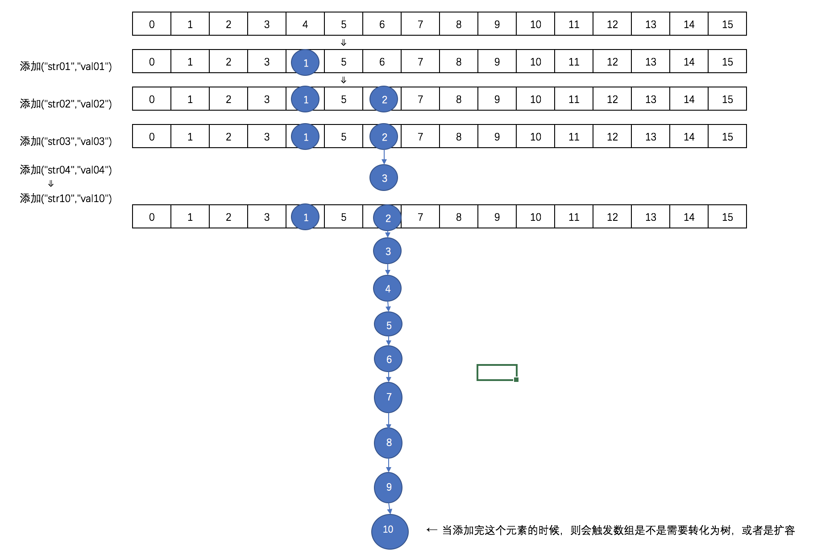
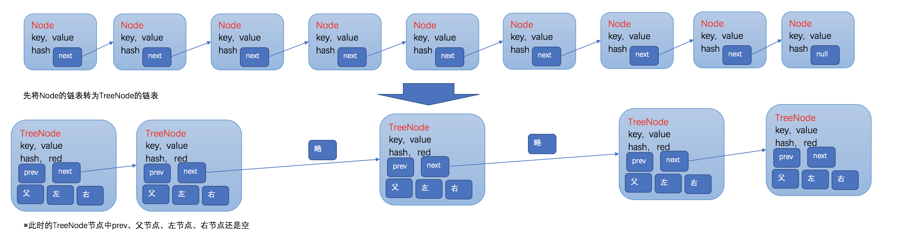
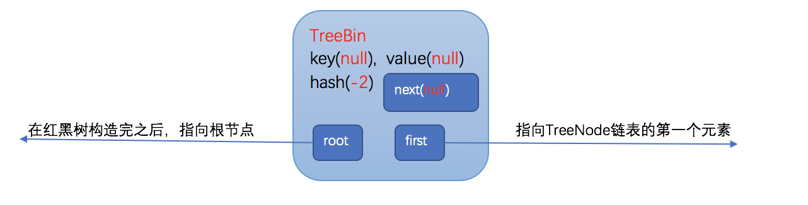
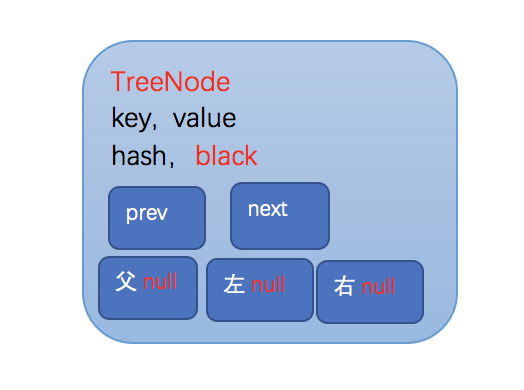
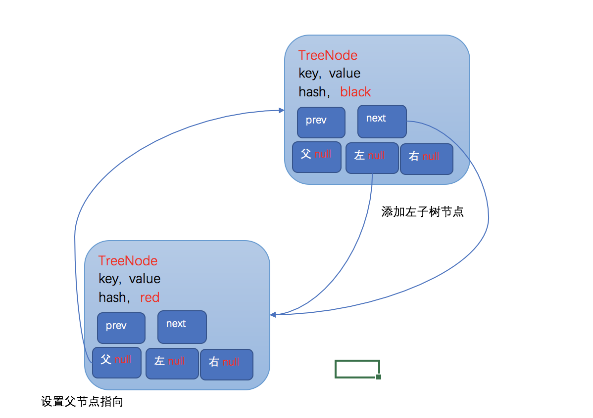

<h1 align="center">ConcurrentHashMap源码分析(1.8)</h1>

[TOC]

**0、说明**

 ※为了分析源码的时候方便调试，把ConcurrentHashMap的源码放在本地了，名字改为了ConcurrentHashMapDebug

由于源码中的unsafe有很多限制，不能直接在本地使用，所以，在源码的最后面的静态代码块处修改了U的初始化方法。

```java
private static final sun.misc.Unsafe U;
static{
    U = getUnsafe();
    ....          
}
static sun.misc.Unsafe getUnsafe() throws Exception {
        java.lang.reflect.Field field = Unsafe.class.getDeclaredField("theUnsafe");
        field.setAccessible(true);
        Unsafe unsafe=(Unsafe) field.get(null);
        return unsafe;
       }
```

**1、ConcurrentHashMap跟HashMap，HashTable的对比**

　　我们都知道HashMap不是线程安全的，所以在处理并发的时候会出现问题。

　　而HashTable虽然是线程安全的，但是是通过整个来加锁的方式，当一个线程在写操作的时候，另外的线程则不能进行读写。

　　而ConcurrentHashMap则可以支持并发的读写。跟1.7版本相比，1.8版本又有了很大的变化，已经抛弃了Segment的概念，虽然源码里面还保留了，也只是为了兼容性的考虑。

 

**2、ConcurrentHashMap原理概览**

 　在ConcurrentHashMap中通过一个Node<K,V>[]数组来保存添加到map中的键值对，而在同一个数组位置是通过链表和红黑树的形式来保存的。但是这个数组只有在第一次添加元素的时候才会初始化，否则只是初始化一个ConcurrentHashMap对象的话，只是设定了一个sizeCtl变量，这个变量用来判断对象的一些状态和是否需要扩容，后面会详细解释。

　　第一次添加元素的时候，默认初期长度为16，当往map中继续添加元素的时候，通过hash值跟数组长度取与来决定放在数组的哪个位置，如果出现放在同一个位置的时候，优先以链表的形式存放，在同一个位置的个数又达到了8个以上，如果数组的长度还小于64的时候，则会扩容数组。如果数组的长度大于等于64了的话，在会将该节点的链表转换成树。

　　通过扩容数组的方式来把这些节点给分散开。然后将这些元素复制到扩容后的新的数组中，同一个链表中的元素通过hash值的数组长度位来区分，是还是放在原来的位置还是放到扩容的长度的相同位置去 。在扩容完成之后，如果某个节点的是树，同时现在该节点的个数又小于等于6个了，则会将该树转为链表。

　　取元素的时候，相对来说比较简单，通过计算hash来确定该元素在数组的哪个位置，然后在通过遍历链表或树来判断key和key的hash，取出value值。

　　往ConcurrentHashMap中添加元素的时候，里面的数据以数组的形式存放的样子大概是这样的：

 

 

　　这个时候因为数组的长度才为16，则不会转化为树，而是会进行扩容。

　　扩容后数组大概是这样的：

　　

　　需要注意的是，扩容之后的长度不是32，扩容后的长度在后面细说。

　　如果数组扩张后长度达到64了，且继续在某个节点的后面添加元素达到8个以上的时候，则会出现转化为红黑树的情况。

　　转化之后大概是这样：


 

**3、ConcurrentHashMap几个重要概念** 

下面是几个重要的属性

```java
private static final int MAXIMUM_CAPACITY = 1 << 30;
private static final int DEFAULT_CAPACITY = 16;
static final int TREEIFY_THRESHOLD = 8;
static final int UNTREEIFY_THRESHOLD = 6;
static final int MIN_TREEIFY_CAPACITY = 64;
static final int MOVED     = -1; // 表示正在转移
static final int TREEBIN   = -2; // 表示已经转换成树
static final int RESERVED  = -3; // hash for transient reservations
static final int HASH_BITS = 0x7fffffff; // usable bits of normal node hash
transient volatile Node<K,V>[] table;//默认没初始化的数组，用来保存元素
private transient volatile Node<K,V>[] nextTable;//转移的时候用的数组
/**
     * 用来控制表初始化和扩容的，默认值为0，当在初始化的时候指定了大小，这会将这个大小保存在sizeCtl中，大小为数组的0.75
     * 当为负的时候，说明表正在初始化或扩张，
     *     -1表示初始化
     *     -(1+n) n:表示活动的扩张线程
     */
    private transient volatile int sizeCtl;
```

**几个重要的类**

Node<K,V>,这是构成每个元素的基本类。

```java
static class Node<K,V> implements Map.Entry<K,V> {
        final int hash;    //key的hash值
        final K key;       //key
        volatile V val;    //value
        volatile Node<K,V> next; //表示链表中的下一个节点

        Node(int hash, K key, V val, Node<K,V> next) {
            this.hash = hash;
            this.key = key;
            this.val = val;
            this.next = next;
        }
        public final K getKey()       { return key; }
        public final V getValue()     { return val; }
        public final int hashCode()   { return key.hashCode() ^ val.hashCode(); }
    }
```

 TreeNode，构造树的节点

```java
static final class TreeNode<K,V> extends Node<K,V> {
        TreeNode<K,V> parent;  // red-black tree links
        TreeNode<K,V> left;
        TreeNode<K,V> right;
        TreeNode<K,V> prev;    // needed to unlink next upon deletion
        boolean red;

        TreeNode(int hash, K key, V val, Node<K,V> next,
                 TreeNode<K,V> parent) {
            super(hash, key, val, next);
            this.parent = parent;
        }
}
```

TreeBin 用作树的头结点，只存储root和first节点，不存储节点的key、value值。

```java
static final class TreeBin<K,V> extends Node<K,V> {
        TreeNode<K,V> root;
        volatile TreeNode<K,V> first;
        volatile Thread waiter;
        volatile int lockState;
        // values for lockState
        static final int WRITER = 1; // set while holding write lock
        static final int WAITER = 2; // set when waiting for write lock
        static final int READER = 4; // increment value for setting read lock
}
```

ForwardingNode在转移的时候放在头部的节点，是一个空节点

```java
static final class ForwardingNode<K,V> extends Node<K,V> {
        final Node<K,V>[] nextTable;
        ForwardingNode(Node<K,V>[] tab) {
            super(MOVED, null, null, null);
            this.nextTable = tab;
        }
}
```

**4、ConcurrentHashMap几个重要方法**

　　在ConcurrentHashMap中使用了unSafe方法，通过直接操作内存的方式来保证并发处理的安全性，使用的是硬件的安全机制。

```java
/*
     * 用来返回节点数组的指定位置的节点的原子操作
     */
    @SuppressWarnings("unchecked")
    static final <K,V> Node<K,V> tabAt(Node<K,V>[] tab, int i) {
        return (Node<K,V>)U.getObjectVolatile(tab, ((long)i << ASHIFT) + ABASE);
    }

    /*
     * cas原子操作，在指定位置设定值
     */
    static final <K,V> boolean casTabAt(Node<K,V>[] tab, int i,
                                        Node<K,V> c, Node<K,V> v) {
        return U.compareAndSwapObject(tab, ((long)i << ASHIFT) + ABASE, c, v);
    }
    /*
     * 原子操作，在指定位置设定值
     */
    static final <K,V> void setTabAt(Node<K,V>[] tab, int i, Node<K,V> v) {
        U.putObjectVolatile(tab, ((long)i << ASHIFT) + ABASE, v);
    }
```

**5、ConcurrentHashMap的初始化**

 　首先我们看看构造方法

```java
//空的构造
public ConcurrentHashMapDebug() {
    }
//如果在实例化对象的时候指定了容量，则初始化sizeCtl
public ConcurrentHashMapDebug(int initialCapacity) {
        if (initialCapacity < 0)
            throw new IllegalArgumentException();
        int cap = ((initialCapacity >= (MAXIMUM_CAPACITY >>> 1)) ?
                   MAXIMUM_CAPACITY :
                   tableSizeFor(initialCapacity + (initialCapacity >>> 1) + 1));
        this.sizeCtl = cap;
    }
//当出入一个Map的时候，先设定sizeCtl为默认容量，在添加元素
public ConcurrentHashMapDebug(Map<? extends K, ? extends V> m) {
        this.sizeCtl = DEFAULT_CAPACITY;
        putAll(m);
    }
```

　　可以看到，在任何一个构造方法中，都没有对存储Map元素Node的table变量进行初始化。而是在第一次put操作的时候在进行初始化。

　　下面来看看数组的初始化方法initTable

```java
/**
     * 初始化数组table，
     * 如果sizeCtl小于0，说明别的数组正在进行初始化，则让出执行权
     * 如果sizeCtl大于0的话，则初始化一个大小为sizeCtl的数组
     * 否则的话初始化一个默认大小(16)的数组
     * 然后设置sizeCtl的值为数组长度的3/4
     */
    private final Node<K,V>[] initTable() {
        Node<K,V>[] tab; int sc;
        while ((tab = table) == null || tab.length == 0) {    //第一次put的时候，table还没被初始化，进入while
            if ((sc = sizeCtl) < 0)                            //sizeCtl初始值为0，当小于0的时候表示在别的线程在初始化表或扩展表
                Thread.yield(); // lost initialization race; just spin
            else if (U.compareAndSwapInt(this, SIZECTL, sc, -1)) {    //SIZECTL：表示当前对象的内存偏移量，sc表示期望值，-1表示要替换的值，设定为-1表示要初始化表了
                try {
                    if ((tab = table) == null || tab.length == 0) {
                        int n = (sc > 0) ? sc : DEFAULT_CAPACITY;        //指定了大小的时候就创建指定大小的Node数组，否则创建指定大小(16)的Node数组
                        @SuppressWarnings("unchecked")
                        Node<K,V>[] nt = (Node<K,V>[])new Node<?,?>[n];
                        table = tab = nt;
                        sc = n - (n >>> 2);
                    }
                } finally {
                    sizeCtl = sc;            //初始化后，sizeCtl长度为数组长度的3/4
                }
                break;
            }
        }
        return tab;
    }
```

 6、ConcurrentHashMap的put操作详解

　　下面看看put方法的源码

```java
/*
     *    单纯的额调用putVal方法，并且putVal的第三个参数设置为false
     *  当设置为false的时候表示这个value一定会设置
     *  true的时候，只有当这个key的value为空的时候才会设置
     */
    public V put(K key, V value) {
        return putVal(key, value, false);
    }
```

　　再来看putVal

```java
/*
     * 当添加一对键值对的时候，首先会去判断保存这些键值对的数组是不是初始化了，
     * 如果没有的话就初始化数组
     *  然后通过计算hash值来确定放在数组的哪个位置
     * 如果这个位置为空则直接添加，如果不为空的话，则取出这个节点来
     * 如果取出来的节点的hash值是MOVED(-1)的话，则表示当前正在对这个数组进行扩容，复制到新的数组，则当前线程也去帮助复制
     * 最后一种情况就是，如果这个节点，不为空，也不在扩容，则通过synchronized来加锁，进行添加操作
     *    然后判断当前取出的节点位置存放的是链表还是树
     *    如果是链表的话，则遍历整个链表，直到取出来的节点的key来个要放的key进行比较，如果key相等，并且key的hash值也相等的话，
     *          则说明是同一个key，则覆盖掉value，否则的话则添加到链表的末尾
     *    如果是树的话，则调用putTreeVal方法把这个元素添加到树中去
     *  最后在添加完成之后，会判断在该节点处共有多少个节点（注意是添加前的个数），如果达到8个以上了的话，
     *  则调用treeifyBin方法来尝试将处的链表转为树，或者扩容数组
     */
    final V putVal(K key, V value, boolean onlyIfAbsent) {
        if (key == null || value == null) throw new NullPointerException();//K,V都不能为空，否则的话跑出异常
        int hash = spread(key.hashCode());    //取得key的hash值
        int binCount = 0;    //用来计算在这个节点总共有多少个元素，用来控制扩容或者转移为树
        for (Node<K,V>[] tab = table;;) {    //
            Node<K,V> f; int n, i, fh;
            if (tab == null || (n = tab.length) == 0)    
                tab = initTable();    //第一次put的时候table没有初始化，则初始化table
            else if ((f = tabAt(tab, i = (n - 1) & hash)) == null) {    //通过哈希计算出一个表中的位置因为n是数组的长度，所以(n-1)&hash肯定不会出现数组越界
                if (casTabAt(tab, i, null,        //如果这个位置没有元素的话，则通过cas的方式尝试添加，注意这个时候是没有加锁的
                             new Node<K,V>(hash, key, value, null)))        //创建一个Node添加到数组中区，null表示的是下一个节点为空
                    break;                   // no lock when adding to empty bin
            }
            /*
             * 如果检测到某个节点的hash值是MOVED，则表示正在进行数组扩张的数据复制阶段，
             * 则当前线程也会参与去复制，通过允许多线程复制的功能，一次来减少数组的复制所带来的性能损失
             */
            else if ((fh = f.hash) == MOVED)    
                tab = helpTransfer(tab, f);
            else {
                /*
                 * 如果在这个位置有元素的话，就采用synchronized的方式加锁，
                 *     如果是链表的话(hash大于0)，就对这个链表的所有元素进行遍历，
                 *         如果找到了key和key的hash值都一样的节点，则把它的值替换到
                 *         如果没找到的话，则添加在链表的最后面
                 *  否则，是树的话，则调用putTreeVal方法添加到树中去
                 *  
                 *  在添加完之后，会对该节点上关联的的数目进行判断，
                 *  如果在8个以上的话，则会调用treeifyBin方法，来尝试转化为树，或者是扩容
                 */
                V oldVal = null;
                synchronized (f) {
                    if (tabAt(tab, i) == f) {        //再次取出要存储的位置的元素，跟前面取出来的比较
                        if (fh >= 0) {                //取出来的元素的hash值大于0，当转换为树之后，hash值为-2
                            binCount = 1;            
                            for (Node<K,V> e = f;; ++binCount) {    //遍历这个链表
                                K ek;
                                if (e.hash == hash &&        //要存的元素的hash，key跟要存储的位置的节点的相同的时候，替换掉该节点的value即可
                                    ((ek = e.key) == key ||
                                     (ek != null && key.equals(ek)))) {
                                    oldVal = e.val;
                                    if (!onlyIfAbsent)        //当使用putIfAbsent的时候，只有在这个key没有设置值得时候才设置
                                        e.val = value;
                                    break;
                                }
                                Node<K,V> pred = e;
                                if ((e = e.next) == null) {    //如果不是同样的hash，同样的key的时候，则判断该节点的下一个节点是否为空，
                                    pred.next = new Node<K,V>(hash, key,        //为空的话把这个要加入的节点设置为当前节点的下一个节点
                                                              value, null);
                                    break;
                                }
                            }
                        }
                        else if (f instanceof TreeBin) {    //表示已经转化成红黑树类型了
                            Node<K,V> p;
                            binCount = 2;
                            if ((p = ((TreeBin<K,V>)f).putTreeVal(hash, key,    //调用putTreeVal方法，将该元素添加到树中去
                                                           value)) != null) {
                                oldVal = p.val;
                                if (!onlyIfAbsent)
                                    p.val = value;
                            }
                        }
                    }
                }
                if (binCount != 0) {
                    if (binCount >= TREEIFY_THRESHOLD)    //当在同一个节点的数目达到8个的时候，则扩张数组或将给节点的数据转为tree
                        treeifyBin(tab, i);    
                    if (oldVal != null)
                        return oldVal;
                    break;
                }
            }
        }
        addCount(1L, binCount);    //计数
        return null;
    }
```

 **7、ConcurrentHashMap的扩容详解**

 　在put方法的详解中，我们可以看到，在同一个节点的个数超过8个的时候，会调用treeifyBin方法来看看是扩容还是转化为一棵树

　　同时在每次添加完元素的addCount方法中，也会判断当前数组中的元素是否达到了sizeCtl的量，如果达到了的话，则会进入transfer方法去扩容

```java
/**
     * Replaces all linked nodes in bin at given index unless table is
     * too small, in which case resizes instead.
     * 当数组长度小于64的时候，扩张数组长度一倍，否则的话把链表转为树
     */
    private final void treeifyBin(Node<K,V>[] tab, int index) {
        Node<K,V> b; int n, sc;
        if (tab != null) {
                System.out.println("treeifyBin方\t==>数组长："+tab.length);
            if ((n = tab.length) < MIN_TREEIFY_CAPACITY)    //MIN_TREEIFY_CAPACITY 64
                tryPresize(n << 1);        // 数组扩容
            else if ((b = tabAt(tab, index)) != null && b.hash >= 0) {
                synchronized (b) {    //使用synchronized同步器，将该节点出的链表转为树
                    if (tabAt(tab, index) == b) {
                        TreeNode<K,V> hd = null, tl = null;    //hd：树的头(head)
                        for (Node<K,V> e = b; e != null; e = e.next) {
                            TreeNode<K,V> p =
                                new TreeNode<K,V>(e.hash, e.key, e.val,
                                                  null, null);
                            if ((p.prev = tl) == null)        //把Node组成的链表，转化为TreeNode的链表，头结点任然放在相同的位置
                                hd = p;    //设置head
                            else
                                tl.next = p;
                            tl = p;
                        }
                        setTabAt(tab, index, new TreeBin<K,V>(hd));//把TreeNode的链表放入容器TreeBin中
                    }
                }
            }
        }
    }
```

　　可以看到当需要扩容的时候，调用的时候tryPresize方法，看看trePresize的源码

```java
    /**
     * 扩容表为指可以容纳指定个数的大小（总是2的N次方）
     * 假设原来的数组长度为16，则在调用tryPresize的时候，size参数的值为16<<1(32)，此时sizeCtl的值为12
     * 计算出来c的值为64,则要扩容到sizeCtl≥为止
     *  第一次扩容之后 数组长：32 sizeCtl：24
     *  第二次扩容之后 数组长：64 sizeCtl：48
     *  第二次扩容之后 数组长：128 sizeCtl：94 --> 这个时候才会退出扩容
     */
    private final void tryPresize(int size) {
            /*
             * MAXIMUM_CAPACITY = 1 << 30
             * 如果给定的大小大于等于数组容量的一半，则直接使用最大容量，
             * 否则使用tableSizeFor算出来
             * 后面table一直要扩容到这个值小于等于sizeCtrl(数组长度的3/4)才退出扩容
             */
        int c = (size >= (MAXIMUM_CAPACITY >>> 1)) ? MAXIMUM_CAPACITY :
            tableSizeFor(size + (size >>> 1) + 1);
        int sc;
        while ((sc = sizeCtl) >= 0) {
            Node<K,V>[] tab = table; int n;
//            printTable(tab);    调试用的
            /*
             * 如果数组table还没有被初始化，则初始化一个大小为sizeCtrl和刚刚算出来的c中较大的一个大小的数组
             * 初始化的时候，设置sizeCtrl为-1，初始化完成之后把sizeCtrl设置为数组长度的3/4
             * 为什么要在扩张的地方来初始化数组呢？这是因为如果第一次put的时候不是put单个元素，
             * 而是调用putAll方法直接put一个map的话，在putALl方法中没有调用initTable方法去初始化table，
             * 而是直接调用了tryPresize方法，所以这里需要做一个是不是需要初始化table的判断
             */
            if (tab == null || (n = tab.length) == 0) {
                n = (sc > c) ? sc : c;
                if (U.compareAndSwapInt(this, SIZECTL, sc, -1)) {    //初始化tab的时候，把sizeCtl设为-1
                    try {
                        if (table == tab) {
                            @SuppressWarnings("unchecked")
                            Node<K,V>[] nt = (Node<K,V>[])new Node<?,?>[n];
                            table = nt;
                            sc = n - (n >>> 2);
                        }
                    } finally {
                        sizeCtl = sc;
                    }
                }
            }
            /*
             * 一直扩容到的c小于等于sizeCtl或者数组长度大于最大长度的时候，则退出
             * 所以在一次扩容之后，不是原来长度的两倍，而是2的n次方倍
             */
            else if (c <= sc || n >= MAXIMUM_CAPACITY) {
                    break;    //退出扩张
            }
            else if (tab == table) {
                int rs = resizeStamp(n);
                /*
                 * 如果正在扩容Table的话，则帮助扩容
                 * 否则的话，开始新的扩容
                 * 在transfer操作，将第一个参数的table中的元素，移动到第二个元素的table中去，
                 * 虽然此时第二个参数设置的是null，但是，在transfer方法中，当第二个参数为null的时候，
                 * 会创建一个两倍大小的table
                 */
                if (sc < 0) {
                    Node<K,V>[] nt;
                    if ((sc >>> RESIZE_STAMP_SHIFT) != rs || sc == rs + 1 ||
                        sc == rs + MAX_RESIZERS || (nt = nextTable) == null ||
                        transferIndex <= 0)
                        break;
                    /*
                     * transfer的线程数加一,该线程将进行transfer的帮忙
                     * 在transfer的时候，sc表示在transfer工作的线程数
                     */
                    if (U.compareAndSwapInt(this, SIZECTL, sc, sc + 1))
                        transfer(tab, nt);
                }
                /*
                 * 没有在初始化或扩容，则开始扩容
                 */
                else if (U.compareAndSwapInt(this, SIZECTL, sc,
                                             (rs << RESIZE_STAMP_SHIFT) + 2)) {
                        transfer(tab, null);
                }
            }
        }
    }
```

在tryPresize方法中，并没有加锁，允许多个线程进入，如果数组正在扩张，则当前线程也去帮助扩容。

数组扩容的主要方法就是transfer方法

```java
/**
     * Moves and/or copies the nodes in each bin to new table. See
     * above for explanation.
     * 把数组中的节点复制到新的数组的相同位置，或者移动到扩张部分的相同位置
     * 在这里首先会计算一个步长，表示一个线程处理的数组长度，用来控制对CPU的使用，
     * 每个CPU最少处理16个长度的数组元素,也就是说，如果一个数组的长度只有16，那只有一个线程会对其进行扩容的复制移动操作
     * 扩容的时候会一直遍历，知道复制完所有节点，没处理一个节点的时候会在链表的头部设置一个fwd节点，这样其他线程就会跳过他，
     * 复制后在新数组中的链表不是绝对的反序的
     */
    private final void transfer(Node<K,V>[] tab, Node<K,V>[] nextTab) {
        int n = tab.length, stride;
        if ((stride = (NCPU > 1) ? (n >>> 3) / NCPU : n) < MIN_TRANSFER_STRIDE)    //MIN_TRANSFER_STRIDE 用来控制不要占用太多CPU
            stride = MIN_TRANSFER_STRIDE; // subdivide range    //MIN_TRANSFER_STRIDE=16
        /*
         * 如果复制的目标nextTab为null的话，则初始化一个table两倍长的nextTab
         * 此时nextTable被设置值了(在初始情况下是为null的)
         * 因为如果有一个线程开始了表的扩张的时候，其他线程也会进来帮忙扩张，
         * 而只是第一个开始扩张的线程需要初始化下目标数组
         */
        if (nextTab == null) {            // initiating
            try {
                @SuppressWarnings("unchecked")
                Node<K,V>[] nt = (Node<K,V>[])new Node<?,?>[n << 1];
                nextTab = nt;
            } catch (Throwable ex) {      // try to cope with OOME
                sizeCtl = Integer.MAX_VALUE;
                return;
            }
            nextTable = nextTab;
            transferIndex = n;
        }
        int nextn = nextTab.length;
        /*
         * 创建一个fwd节点，这个是用来控制并发的，当一个节点为空或已经被转移之后，就设置为fwd节点
         * 这是一个空的标志节点
         */
        ForwardingNode<K,V> fwd = new ForwardingNode<K,V>(nextTab);
        boolean advance = true;    //是否继续向前查找的标志位
        boolean finishing = false; // to ensure sweep(清扫) before committing nextTab,在完成之前重新在扫描一遍数组，看看有没完成的没
        for (int i = 0, bound = 0;;) {
            Node<K,V> f; int fh;
            while (advance) {
                int nextIndex, nextBound;
                if (--i >= bound || finishing) {
                    advance = false;
                }
                else if ((nextIndex = transferIndex) <= 0) {
                    i = -1;
                    advance = false;
                }
                else if (U.compareAndSwapInt
                         (this, TRANSFERINDEX, nextIndex,
                          nextBound = (nextIndex > stride ?
                                       nextIndex - stride : 0))) {
                    bound = nextBound;
                    i = nextIndex - 1;
                    advance = false;
                }
            }
            if (i < 0 || i >= n || i + n >= nextn) {
                int sc;
                if (finishing) {        //已经完成转移
                    nextTable = null;
                    table = nextTab;
                    sizeCtl = (n << 1) - (n >>> 1);    //设置sizeCtl为扩容后的0.75
                    return;
                }
                if (U.compareAndSwapInt(this, SIZECTL, sc = sizeCtl, sc - 1)) {
                    if ((sc - 2) != resizeStamp(n) << RESIZE_STAMP_SHIFT) {
                            return;
                    }
                    finishing = advance = true;
                    i = n; // recheck before commit
                }
            }
            else if ((f = tabAt(tab, i)) == null)            //数组中把null的元素设置为ForwardingNode节点(hash值为MOVED[-1])
                advance = casTabAt(tab, i, null, fwd);
            else if ((fh = f.hash) == MOVED)
                advance = true; // already processed
            else {
                synchronized (f) {                //加锁操作
                    if (tabAt(tab, i) == f) {
                        Node<K,V> ln, hn;
                        if (fh >= 0) {        //该节点的hash值大于等于0，说明是一个Node节点
                                /*
                                 * 因为n的值为数组的长度，且是power(2,x)的，所以，在&操作的结果只可能是0或者n
                                 * 根据这个规则
                                 *         0-->  放在新表的相同位置
                                 *         n-->  放在新表的（n+原来位置）
                                 */
                            int runBit = fh & n; 
                            Node<K,V> lastRun = f;
                            /*
                             * lastRun 表示的是需要复制的最后一个节点
                             * 每当新节点的hash&n -> b 发生变化的时候，就把runBit设置为这个结果b
                             * 这样for循环之后，runBit的值就是最后不变的hash&n的值
                             * 而lastRun的值就是最后一次导致hash&n 发生变化的节点(假设为p节点)
                             * 为什么要这么做呢？因为p节点后面的节点的hash&n 值跟p节点是一样的，
                             * 所以在复制到新的table的时候，它肯定还是跟p节点在同一个位置
                             * 在复制完p节点之后，p节点的next节点还是指向它原来的节点，就不需要进行复制了，自己就被带过去了
                             * 这也就导致了一个问题就是复制后的链表的顺序并不一定是原来的倒序
                             */
                            for (Node<K,V> p = f.next; p != null; p = p.next) {
                                int b = p.hash & n;    //n的值为扩张前的数组的长度
                                if (b != runBit) {
                                    runBit = b;
                                    lastRun = p;
                                }
                            }
                            if (runBit == 0) {
                                ln = lastRun;
                                hn = null;
                            }
                            else {
                                hn = lastRun;
                                ln = null;
                            }
                            /*
                             * 构造两个链表，顺序大部分和原来是反的
                             * 分别放到原来的位置和新增加的长度的相同位置(i/n+i)
                             */
                            for (Node<K,V> p = f; p != lastRun; p = p.next) {
                                int ph = p.hash; K pk = p.key; V pv = p.val;
                                if ((ph & n) == 0)
                                        /*
                                         * 假设runBit的值为0，
                                         * 则第一次进入这个设置的时候相当于把旧的序列的最后一次发生hash变化的节点(该节点后面可能还有hash计算后同为0的节点)设置到旧的table的第一个hash计算后为0的节点下一个节点
                                         * 并且把自己返回，然后在下次进来的时候把它自己设置为后面节点的下一个节点
                                         */
                                    ln = new Node<K,V>(ph, pk, pv, ln);
                                else
                                        /*
                                         * 假设runBit的值不为0，
                                         * 则第一次进入这个设置的时候相当于把旧的序列的最后一次发生hash变化的节点(该节点后面可能还有hash计算后同不为0的节点)设置到旧的table的第一个hash计算后不为0的节点下一个节点
                                         * 并且把自己返回，然后在下次进来的时候把它自己设置为后面节点的下一个节点
                                         */
                                    hn = new Node<K,V>(ph, pk, pv, hn);    
                            }
                            setTabAt(nextTab, i, ln);    
                            setTabAt(nextTab, i + n, hn);
                            setTabAt(tab, i, fwd);
                            advance = true;
                        }
                        else if (f instanceof TreeBin) {    //否则的话是一个树节点
                            TreeBin<K,V> t = (TreeBin<K,V>)f;
                            TreeNode<K,V> lo = null, loTail = null;
                            TreeNode<K,V> hi = null, hiTail = null;
                            int lc = 0, hc = 0;
                            for (Node<K,V> e = t.first; e != null; e = e.next) {
                                int h = e.hash;
                                TreeNode<K,V> p = new TreeNode<K,V>
                                    (h, e.key, e.val, null, null);
                                if ((h & n) == 0) {
                                    if ((p.prev = loTail) == null)
                                        lo = p;
                                    else
                                        loTail.next = p;
                                    loTail = p;
                                    ++lc;
                                }
                                else {
                                    if ((p.prev = hiTail) == null)
                                        hi = p;
                                    else
                                        hiTail.next = p;
                                    hiTail = p;
                                    ++hc;
                                }
                            }
                            /*
                             * 在复制完树节点之后，判断该节点处构成的树还有几个节点，
                             * 如果≤6个的话，就转回为一个链表
                             */
                            ln = (lc <= UNTREEIFY_THRESHOLD) ? untreeify(lo) :
                                (hc != 0) ? new TreeBin<K,V>(lo) : t;
                            hn = (hc <= UNTREEIFY_THRESHOLD) ? untreeify(hi) :
                                (lc != 0) ? new TreeBin<K,V>(hi) : t;
                            setTabAt(nextTab, i, ln);
                            setTabAt(nextTab, i + n, hn);
                            setTabAt(tab, i, fwd);
                            advance = true;
                        }
                    }
                }
            }
        }
    }
```

　　到这里，ConcurrentHashMap的put操作和扩容都介绍的差不多了，

　　下面的两点一定要注意：

　　　　·复制之后的新链表不是旧链表的绝对倒序。

　　　　·在扩容的时候每个线程都有处理的步长，最少为16，在这个步长范围内的数组节点只有自己一个线程来处理

**8、ConcurrentHashMap的get操作详解**

　　相比put操作，get操作就显得很简单了。废话少说，直接上源码分析。

```java
/*
     * 相比put方法，get就很单纯了，支持并发操作，
     * 当key为null的时候回抛出NullPointerException的异常
     * get操作通过首先计算key的hash值来确定该元素放在数组的哪个位置
     * 然后遍历该位置的所有节点
     * 如果不存在的话返回null
     */
    public V get(Object key) {
        Node<K,V>[] tab; Node<K,V> e, p; int n, eh; K ek;
        int h = spread(key.hashCode());
        if ((tab = table) != null && (n = tab.length) > 0 &&
            (e = tabAt(tab, (n - 1) & h)) != null) {
            if ((eh = e.hash) == h) {
                if ((ek = e.key) == key || (ek != null && key.equals(ek)))
                    return e.val;
            }
            else if (eh < 0)
                return (p = e.find(h, key)) != null ? p.val : null;
            while ((e = e.next) != null) {
                if (e.hash == h &&
                    ((ek = e.key) == key || (ek != null && key.equals(ek))))
                    return e.val;
            }
        }
        return null;
    }
```

 

**9、ConcurrentHashMap的同步机制**

　　前面分析了下ConcurrentHashMap的源码，那么，对于一个映射集合来说，ConcurrentHashMap是如果来做到并发安全，又是如何做到高效的并发的呢？

　　首先是读操作，从源码中可以看出来，在get操作中，根本没有使用同步机制，也没有使用unsafe方法，所以读操作是支持并发操作的。

　　那么写操作呢？

　　分析这个之前，先看看什么情况下会引起数组的扩容，扩容是通过transfer方法来进行的。而调用transfer方法的只有trePresize、helpTransfer和addCount三个方法。

　　这三个方法又是分别在什么情况下进行调用的呢？

　　·tryPresize是在treeIfybin和putAll方法中调用，treeIfybin主要是在put添加元素完之后，判断该数组节点相关元素是不是已经超过8个的时候，如果超过则会调用这个方法来扩容数组或者把链表转为树。

　　·helpTransfer是在当一个线程要对table中元素进行操作的时候，如果检测到节点的HASH值为MOVED的时候，就会调用helpTransfer方法，在helpTransfer中再调用transfer方法来帮助完成数组的扩容

　　·addCount是在当对数组进行操作，使得数组中存储的元素个数发生了变化的时候会调用的方法。

　　

　　**所以引起数组扩容的情况如下**：

　　·只有在往map中添加元素的时候，在某一个节点的数目已经超过了8个，同时数组的长度又小于64的时候，才会触发数组的扩容。

　　·当数组中元素达到了sizeCtl的数量的时候，则会调用transfer方法来进行扩容

　　

　　**那么在扩容的时候，可以不可以对数组进行读写操作呢？**

　　事实上是可以的。当在进行数组扩容的时候，如果当前节点还没有被处理（也就是说还没有设置为fwd节点），那就可以进行设置操作。

　　如果该节点已经被处理了，则当前线程也会加入到扩容的操作中去。

　　

　　**那么，多个线程又是如何同步处理的呢？**

　　在ConcurrentHashMap中，同步处理主要是通过Synchronized和unsafe两种方式来完成的。

　　·在取得sizeCtl、某个位置的Node的时候，使用的都是unsafe的方法，来达到并发安全的目的

　　·当需要在某个位置设置节点的时候，则会通过Synchronized的同步机制来锁定该位置的节点。

　　·在数组扩容的时候，则通过处理的步长和fwd节点来达到并发安全的目的，通过设置hash值为MOVED

　　·当把某个位置的节点复制到扩张后的table的时候，也通过Synchronized的同步机制来保证现程安全

 

 **10、链表转为红黑树的过程** 

 　前面在讲解tryifyBin的源码的时候讲到过，如果在当个bin上的元素超过了8个的时候，就会尝试去扩容数组或者是将链表转为红黑树。

源码：

```java
private final void treeifyBin(Node<K,V>[] tab, int index) {
        System.out.println("当前线程:"+Thread.currentThread().getName()+"进入treeifyBin方法");
        Node<K,V> b; int n, sc;
        if (tab != null) {
            if ((n = tab.length) < MIN_TREEIFY_CAPACITY)    //MIN_TREEIFY_CAPACITY 64
                tryPresize(n << 1);        // 数组扩容
            else if ((b = tabAt(tab, index)) != null && b.hash >= 0) {
                synchronized (b) {    //使用synchronized同步器，将该节点出的链表转为树
                    if (tabAt(tab, index) == b) {
                        TreeNode<K,V> hd = null, tl = null;    //hd：树的头(head)
                        for (Node<K,V> e = b; e != null; e = e.next) {
                            TreeNode<K,V> p =
                                new TreeNode<K,V>(e.hash, e.key, e.val,
                                                  null, null);
                            if ((p.prev = tl) == null)        //把Node组成的链表，转化为TreeNode的链表，头结点任然放在相同的位置
                                hd = p;    //设置head
                            else
                                tl.next = p;
                            tl = p;
                        }
                        setTabAt(tab, index, new TreeBin<K,V>(hd));//把TreeNode的链表放入容器TreeBin中
                    }
                }
            }
        }
    }
```

　　首先将Node的链表转化为一个TreeNode的链表，然后将TreeNode链表的头结点来构造一个TreeBin。　　

　　下面是TreeBin构造方法的源码：

```java
TreeBin(TreeNode<K,V> b) {
            super(TREEBIN, null, null, null);    //创建的TreeBin是一个空节点，hash值为TREEBIN（-2）
            this.first = b;
            TreeNode<K,V> r = null;
            for (TreeNode<K,V> x = b, next; x != null; x = next) {
                next = (TreeNode<K,V>)x.next;
                x.left = x.right = null;
                if (r == null) {
                    x.parent = null;
                    x.red = false;
                    r = x;
                }//
                else {
                    K k = x.key;
                    int h = x.hash;
                    Class<?> kc = null;
                    for (TreeNode<K,V> p = r;;) {//x代表的是转换为树之前的顺序遍历到链表的位置的节点，r代表的是根节点
                        int dir, ph;
                        K pk = p.key;
                        if ((ph = p.hash) > h)    //
                            dir = -1;
                        else if (ph < h)
                            dir = 1;
                        else if ((kc == null &&
                                  (kc = comparableClassFor(k)) == null) ||
                                 (dir = compareComparables(kc, k, pk)) == 0)
                            dir = tieBreakOrder(k, pk);    //当key不可以比较，或者相等的时候采取的一种排序措施
                            TreeNode<K,V> xp = p;
                        if ((p = (dir <= 0) ? p.left : p.right) == null) {//在这里判断要放的left/right是否为空，不为空继续用left/right节点来判断
                            x.parent = xp;
                            if (dir <= 0)
                                xp.left = x;
                            else
                                xp.right = x;
                            r = balanceInsertion(r, x); //每次插入一个元素的时候都调用balanceInsertion来保持红黑树的平衡
                            break;
                        }
                    }
                }
            }
            this.root = r;
            assert checkInvariants(root);
        }
```

　　转化的过程大概如下：

 

　　接下来，用链表头部的TreeNode来构造一个TreeBin，在TreeBin容器中，将链表转化为红黑树。

   首先是构造一个如下的TreeBin空节点。



　　构造完TreeBin这个空节点之后，就开始构造红黑树，首先是第一个节点，左右子节点设置为空，作为红黑树的root节点，设置为黑色，父节点为空。



接下来遍历链表的后续节点，没添加一个元素的时候，都会通过判断hash值来决定是放在根节点的左节点还是有节点，如果左/右节点不为空，则继续以左/右节点来重复判断，直到左/右节点为空，则添加到左/右位置。　　　　　

 

然后在每次添加完一个节点之后，都会调用balanceInsertion方法来维持这是一个红黑树的属性和平衡性。红黑树所有操作的复杂度都是O(logn)，所以当元素量比较大的时候，效率也很高。


## 参考

[ConcurrentHashMap源码分析(1.8)](https://www.cnblogs.com/zerotomax/p/8687425.html)