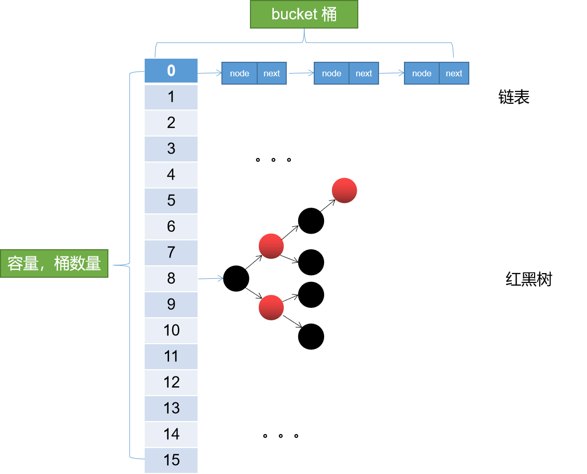
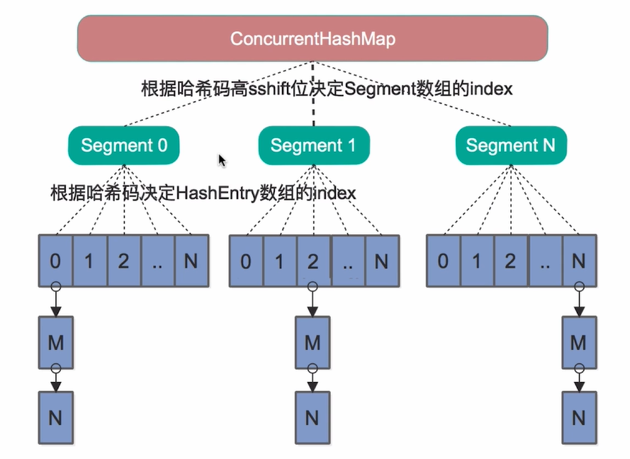
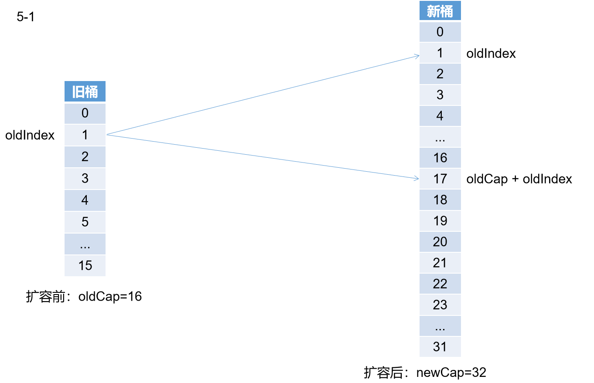
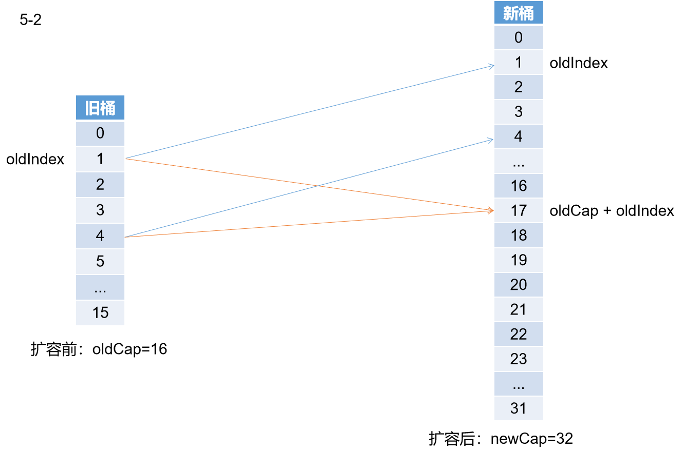
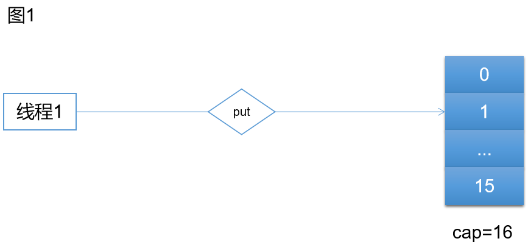
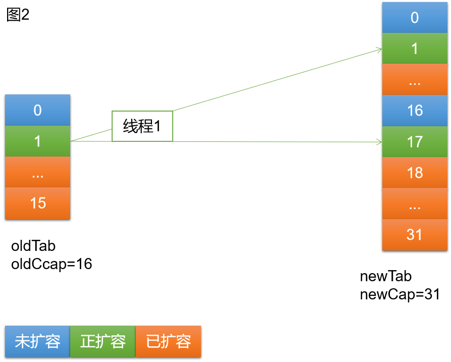
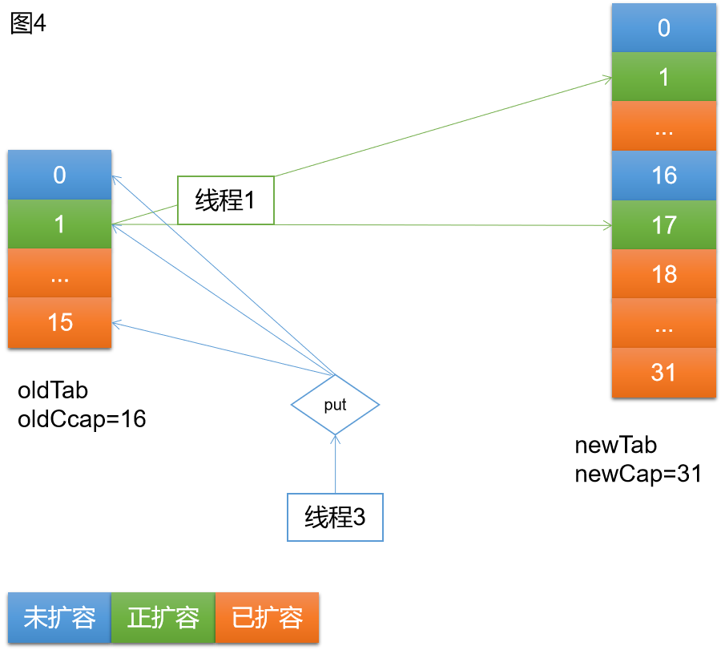

<h1 align="center">ConcurrentHashMap源码解析（1.8</h1>

[TOC]

## 一、简介

[上篇文章](https://www.cnblogs.com/hello-shf/p/12168181.html)详细介绍了HashMap的源码及原理，本文趁热打铁继续分析ConcurrentHashMap的原理。

首先在看本文之前，希望对HashMap有一个详细的了解。不然看直接看ConcurrentHashMap的源码还是有些费劲的。

相信对HashMap，HashTable有一定了解，应该知道HashMap是不具备线程安全性的，在resize时会丢数据（JDK8），而HashTable虽然保证了线程安全性，但是其是通过给每个方法加Synchronized关键字达到的同步目的。但是都知道Synchronized在竞争激烈的多线程并发环境中，在性能上的表现是非常不如人意的。那在高并发环境中HashMap如何保证线程安全而又不浪费太多性能呢？答案就是Java J.U.C并发包中的ConcurrentHashMap。

依然开局一张图。JDK8中的ConcurrentHashMap数据结构。

 

呃呵，和HashMap的结构是一样的，没错在数据结构层面，ConcurrentHashMap和HashMap是完全一样的。有了这个基础继续往下看。

## 二、历史版本

ConcurrentHashMap的历史版本大致分界线在JDK8。也就是可以分为JDK8和JDK8以前版本。

**数据结构的区别**

在JDK8之前HashMap没有引入红黑树，同样的ConcurrentHashMap也没有引入红黑树。而且ConcurrentHashMap采用的是分段数组的底层数据结构。

在JDK7中的数据结构。



从上图我们不难看出其在数据结构方面的差别。

**锁的区别**

JDK7中为了提高并发性能采用了这种分段的设计。所以在JDK7中ConcurrentHashMap采用的是分段锁，也就是在每个Segment上加ReentrantLock实现的线程安全线。关于ReetrantLock后面有时间会介绍，大致来说ReetrantLoack是比Synchronized更细粒度的一种锁。使用得当的话其性能要比Synchronized表现要好，但是如果实现不得当容易造成死锁。

这种基于Segment和ReetrantLock的设计相对HashTable来说大大提高了并发性能。也就是说多个线程可以并发的操作多个Segment，而HashTable是通过给每个方法加Synchronized即将多线程串行而实现的。所以在一定程度上提高了并发性能。但是这种性能的提升表现相对JDK8来说显得不值一提。

如果说JDK7 ConcurrentHashMap相对HashTable来说是串行到多个线程并发的改进。而JDK8则是通过比Segment更细粒度的并发控制大大提高了其并发表现。

JDK8中ConcurrentHashMap采用的是CAS+Synchronized锁并且锁粒度是每一个桶。简单来说JDK7中锁的粒度是Segment，JDK8锁粒度细化到了桶级别。可想而知锁粒度是大大提到了。辅之以代码的优化，JDK8中的ConcurrentHashMap在性能上的表现非常优秀。

简单总结一下，从HashTable到JDK7 ConcurrentHashMap再到JDK8 ConcurrentHashMap。是从同步到并发再到高并发的进步。

## 三、基础知识

### 3.1、常量

```java
//正在扩容，对应fwd类型的节点的hash
static final int MOVED     = -1; // hash for forwarding nodes 
//当前数组
transient volatile Node<K,V>[] table;
//扩容时用到的，扩容后的数组。
private transient volatile Node<K,V>[] nextTable;
//1，大于零，表示size * 0.75。
//2，等于-1，表示正在初始化。
//3，-(n + 1)，表示正在执行扩容的线程其只表示基数，而不是真正的数量，需要计算得出的哦
private transient volatile int sizeCtl;
```

## 3.2、Unsafe类方法

```java
@SuppressWarnings("unchecked")  //transient volatile Node<K,V>[] table; tab变量确实是volatile
    static final <K,V> Node<K,V> tabAt(Node<K,V>[] tab, int i) {//获取table中索引 i 处的元素。
        return (Node<K,V>)U.getObjectVolatile(tab, ((long)i << ASHIFT) + ABASE);//如果tab是volatile变量，则该方法保证其可见性。
    }

    static final <K,V> boolean casTabAt(Node<K,V>[] tab, int i,//通过CAS设置table索引为 i 处的元素。
                                        Node<K,V> c, Node<K,V> v) {
        return U.compareAndSwapObject(tab, ((long)i << ASHIFT) + ABASE, c, v);
    }
            //transient volatile Node<K,V>[] table; tab变量确实是volatile
    static final <K,V> void setTabAt(Node<K,V>[] tab, int i, Node<K,V> v) {//修改table 索引 i 处的元素。
        U.putObjectVolatile(tab, ((long)i << ASHIFT) + ABASE, v);//如果tab是volatile变量，则该方法保证其可见性。
    }
```

我们不难看出 以上三个方法都是调用的Unsafe（U）类中的方法，Unsafe类中定义了大量对内存的操作方法，是native的，不建议开发者直接使用。

tabAt和setTabAt最终调用的两个方法分别是 U.getObjectVolatile()和U.putObjectVolatile 顾名思义其是通过volatile保证的tab的可见性（Volatile只保证可见性不保证原子性哦）。前提是tab变量是Volatile修饰的变量。我们通过调用栈，最红可以看到其实tab就是ConcurrentHashMap中的table。而这个变量是这么定义的。

```java
transient volatile Node<K,V>[] table;
```

可见其确实是Volatile修饰的变量。

再看

casTabAt方法，这个就是CAS方法了。

CAS：Compare and Swap三个单词的缩写，即：比较交换的意思。CAS在Java中又称之为乐观锁即我们总认为是没有锁的。

```java
while(true){
    CAS();  
}
```

一般的通过上述用法达到自旋的目的。CAS一般通过自旋达到自旋锁的目的，即认为没有锁，失败重试，这种思路。更多内容请自行百度。CAS很重要哦。

# 四、put过程源码

```java
public V put(K key, V value) {
    return putVal(key, value, false);
}

/** Implementation for put and putIfAbsent */
final V putVal(K key, V value, boolean onlyIfAbsent) {
    if (key == null || value == null) throw new NullPointerException();
    int hash = spread(key.hashCode());//hash，对hashcode再散列
    int binCount = 0;
    for (Node<K,V>[] tab = table;;) {//迭代桶数组，自旋
        Node<K,V> f; int n, i, fh;
        if (tab == null || (n = tab.length) == 0)//懒加载。如果为空，则进行初始化
            tab = initTable();//初始化桶数组
        //(n - 1) & hash)计算下标，取值，为空即无hash碰撞
        else if ((f = tabAt(tab, i = (n - 1) & hash)) == null) {
            if (casTabAt(tab, i, null,
                         new Node<K,V>(hash, key, value, null)))//通过cas插入新值
                break;                   // no lock when adding to empty bin
        }
        //判断是否正在扩容。如果正在扩容，当前线程帮助进行扩容。
        //每个线程只能同时负责一个桶上的数据迁移，并且不影响其它桶的put和get操作。
        //（很牛逼的思路，能这么做建立在更细粒度的锁基础上）
        else if ((fh = f.hash) == MOVED)
            tab = helpTransfer(tab, f);
        else {//put5,存在hash碰撞
            V oldVal = null;
            //此处，f在上面已经被赋值，f为当前下标桶的首元素。对链表来说是链表头对红黑树来说是红黑树的头元素。
            synchronized (f) {
                //再次检查当前节点是否有变化，有变化进入下一轮自旋
                //为什么再次检查？因为不能保证，当前线程到这里，有没有其他线程对该节点进行修改
                if (tabAt(tab, i) == f) {
                    if (fh >= 0) {//当前桶为链表
                        binCount = 1;
                        for (Node<K,V> e = f;; ++binCount) {//迭代链表节点
                            K ek;
                            if (e.hash == hash &&//key相同，覆盖（onlyIfAbsent有什么用？）
                                ((ek = e.key) == key ||
                                 (ek != null && key.equals(ek)))) {
                                oldVal = e.val;
                                if (!onlyIfAbsent)
                                    e.val = value;
                                break;
                            }
                            Node<K,V> pred = e;
                            //找到链表尾部，插入新节点。（什么这里不用CAS？因为这在同步代码块里面）
                            if ((e = e.next) == null) {
                                pred.next = new Node<K,V>(hash, key,
                                                          value, null);
                                break;
                            }
                        }
                    }
                    else if (f instanceof TreeBin) {//当前桶为红黑树
                        Node<K,V> p;
                        binCount = 2;
                        if ((p = ((TreeBin<K,V>)f).putTreeVal(hash, key,
                                                       value)) != null) {//想红黑树插入新节点
                            oldVal = p.val;
                            if (!onlyIfAbsent)
                                p.val = value;
                        }
                    }
                }
            }
            if (binCount != 0) {
                //树化。binCount > 8，进行树化，链表转红黑树
                if (binCount >= TREEIFY_THRESHOLD)
                    //如果容量 < 64则直接进行扩容；不转红黑树。
                    //（你想想，假如容量为16，你就插入了9个元素，巧了，都在同一个桶里面，
                    //如果这时进行树化，时间复杂度会增加，性能下降，不如直接进行扩容，空间换时间）
                    treeifyBin(tab, i);
                if (oldVal != null)
                    return oldVal;
                break;
            }
        }
    }
    addCount(1L, binCount);//扩容。addCount内部会进行判断要不要扩容
    return null;
}
```

总结以上过程

1，懒加载，未初始化则初始化table

2，hash，hashcode再散列，并计算下标

3，无碰撞，通过CAS插入

4，有碰撞
　	　4.1、如果正在扩容，协助其它线程去扩容
　	　4.2、如果是链表，插入链表
　	　4.3、如果是红黑树，插入红黑树
　	　4.4、如果链表长度超过8，树化
　	　4.5，如果key已经存在，覆盖旧值

5，需要扩容，则扩容

相比HashMap过程多了一个协助扩容。

以上源码需要注意的是

```java
for (Node<K,V>[] tab = table;;) {//迭代桶数组，自旋
     
}
```

这是一个自旋的过程，如果CAS修改失败会进入下一轮自旋。很久以前看这段源码的时候，我总是在想，CAS失败了不就丢数据了吗？所以这个自旋，也称之为自旋锁会保证数据一定能插入成功。

说说上面锁竞争的情况，以上过程我们不难发现对table的修改都是通过CAS操作实现的。比如下面这行代码，如果已经有线程正在操作 i 位置的元素，则意味着本轮自旋将会失败，继续自旋，当其他线程修改完成，本线程再次运行到tabAt以为是Volatile操作，其他线程的修改对本线程立即可见（详见Volatile关键字内存语义的内容）。本线程通过tabAt发现该处已经存在元素，即发生碰撞，继续往下运行。

```java
 else if ((f = tabAt(tab, i = (n - 1) & hash)) == null) {
     if (casTabAt(tab, i, null, new Node<K,V>(hash, key, value, null)))//通过cas插入新值
      break;                   // no lock when adding to empty bin
 }
```

线程的调度需要操作系统从用户态转为内核态，这是非常重量级的操作。CAS+自旋组成的自旋锁保证了线程不会进入阻塞态。

然后继续往下看

```java
synchronized (f) {
    //再次检查当前节点是否有变化，有变化进入下一轮自旋
    //为什么再次检查？因为不能保证，当前线程运行到这里，有没有其他线程对该节点进行修改
    if (tabAt(tab, i) == f) {
```

先看这行代码 synchronized (f) 这个f是一个桶的头元素。也就是说在JDK8中synchronized锁仅仅只锁链表头或者红黑树的头（其实就是锁一个桶，因为要访问链表或者红黑树总要从头开始访问吧）

再看 if (tabAt(tab, i) == f) {} 其实就是双重检测（参考单例的双重检测），为什么要再检查一遍呢？因为不能保证当前线程运行到这里，有没有其他线程已经对该节点进行了修改。

**initTable()**

```java
private final Node<K,V>[] initTable() {
    Node<K,V>[] tab; int sc;
    while ((tab = table) == null || tab.length == 0) {
        // 赋值sc。并当sizeCtl == -1 即当前有线程正在执行初始化
        if ((sc = sizeCtl) < 0)
            //yield()暂停当前正在执行的线程，执行其他线程
            //（这是一个通知，但是这是不一定会让当前线程停止，要取决于线程调度器）
            //就是我想让出资源，但是这只是一厢情愿的事情，线程调度器会考虑你的方法，但是不一定采纳。
            Thread.yield();
        //修改 sizeCtl 的值为 -1。 SIZECTL 为 sizeCtl 的内存地址。
        else if (U.compareAndSwapInt(this, SIZECTL, sc, -1)) {
            try {
                //执行初始化过程
                if ((tab = table) == null || tab.length == 0) {
                    //sc在上面已经赋值，=原来 sizeCtl的值。是非讨厌JDK源码这种赋值方式。
                    int n = (sc > 0) ? sc : DEFAULT_CAPACITY;
                    @SuppressWarnings("unchecked")
                    //创建一个sc长度的table。
                    Node<K,V>[] nt = (Node<K,V>[])new Node<?,?>[n];
                    table = tab = nt;
                    sc = n - (n >>> 2);
                }
            } finally {
                //初始化完成, sizeCtl重新赋值为当前数组的长度。
                sizeCtl = sc;
            }
            break;
        }
    }
    return tab;
}
```

以上过程，同样是通过CAS实现的初始化控制，保证只有一个线程去执行初始化。

helpTransfer(tab, f);方法我们后面介绍完扩容再说。

看完以上put过程，我们能发现，JDK8通过CAS+自旋锁将锁的粒度控制在每一个桶上，相对于JDK7中Segment锁，锁粒度提高了很多。并且CAS+自旋锁保证了不会出现线程的切花这种重量级的操作。

# 五、扩容

```java
//tab旧桶数组，nextTab新桶数组
private final void transfer(Node<K,V>[] tab, Node<K,V>[] nextTab) {
    int n = tab.length, stride;
    //控制并发数，控制CPU的资源
    if ((stride = (NCPU > 1) ? (n >>> 3) / NCPU : n) < MIN_TRANSFER_STRIDE)
        stride = MIN_TRANSFER_STRIDE; // subdivide range
    if (nextTab == null) {            // initiating//新数组为空，则初始化新数组
        try {
            @SuppressWarnings("unchecked")
            //扩容为原来的两倍 n << 1
            Node<K,V>[] nt = (Node<K,V>[])new Node<?,?>[n << 1];
            nextTab = nt;
        } catch (Throwable ex) {      // try to cope with OOME
            sizeCtl = Integer.MAX_VALUE;
            return;
        }
        nextTable = nextTab;
        transferIndex = n;
    }
    int nextn = nextTab.length;
    //在这里面进行new Node将node.hash置为-1。表示该桶正在进行移动。
    //（这里很重要的一点是，只锁表头，所以只需要将链表（或者红黑树）头结点.hash置为-1即可）
    ForwardingNode<K,V> fwd = new ForwardingNode<K,V>(nextTab);
    //advance是控制是否继续进行移动的条件，当advance == false，表示正在移动一个桶。
    //true表示可以继续进行下一个桶的移动
    boolean advance = true;
    boolean finishing = false; // to ensure sweep before committing nextTab
    for (int i = 0, bound = 0;;) {//自旋
        Node<K,V> f; int fh;
        while (advance) {//start
            int nextIndex, nextBound;
            //当前桶是不是已经移动完了
            if (--i >= bound || finishing)
                advance = false;
            //两个停止移动的条件。移动完了。（这个是真正停止的条件。下面那个条件会进行一次检查）
            else if ((nextIndex = transferIndex) <= 0) {
                i = -1;
                advance = false;
            }
            else if (U.compareAndSwapInt
                     (this, TRANSFERINDEX, nextIndex,
                      nextBound = (nextIndex > stride ?
                                   nextIndex - stride : 0))) {
                bound = nextBound;
                i = nextIndex - 1;
                advance = false;
            }
        }
        if (i < 0 || i >= n || i + n >= nextn) {
            int sc;
            if (finishing) {//结束扩容
                nextTable = null;
                table = nextTab;
                sizeCtl = (n << 1) - (n >>> 1);
                return;
            }
            if (U.compareAndSwapInt(this, SIZECTL, sc = sizeCtl, sc - 1)) {
                if ((sc - 2) != resizeStamp(n) << RESIZE_STAMP_SHIFT)
                    return;
                finishing = advance = true;
                i = n; // recheck before commit 再次检查一遍，防止有桶中还有数据没移动。
            }
        }//end 从start到end可看可不看就是条件控制，包括结束条件的控制，移动进度的控制等。
        //该桶没数据
        else if ((f = tabAt(tab, i)) == null)
            //将oldtab中的该桶设置为fwd节点，hash=-1
            advance = casTabAt(tab, i, null, fwd);
        //已经移动过的桶其hash=-1
        else if ((fh = f.hash) == MOVED)
            advance = true; // already processed
        else {
            synchronized (f) {//上锁
                if (tabAt(tab, i) == f) {
                    //ln新链表，不需要移动的节点重新组组织成的链表。
                    //hn新链表，需要移动的节点重新组织成的链表
                    Node<K,V> ln, hn;
                    if (fh >= 0) {//链表
                        int runBit = fh & n;
                        Node<K,V> lastRun = f;
                        //start
                        //从start，到end之间。不看也行。实在费脑子。其实这段代码写的有点让人费解
                        //主要是不认真看不知道作者的意图。本意是这样的。判断是不是可以从某个节点n开始
                        //后面的节点是不是都是和节点n一样，移动的目标桶一样的。
                        //如果是一样的，则后面的这些节点就不用移动了，只需要移动n节点即可。
                        //（注意链表的引用，next指针就把后面的都带过去了）
                        //想一个极端情况，如果在这里迭代后发现，所有节点，扩容后数据移动的目标桶都是一样的。
                        //则只需要移动头结点即可。不用重新拼接链表了。
                        for (Node<K,V> p = f.next; p != null; p = p.next) {
                            int b = p.hash & n;
                            if (b != runBit) {
                                runBit = b;
                                lastRun = p;
                            }
                        }
                        if (runBit == 0) {// runBit== 0 表示该节点不需要移动
                            ln = lastRun;
                            hn = null;
                        }
                        else {
                            hn = lastRun;
                            ln = null;
                        }//end
                        for (Node<K,V> p = f; p != lastRun; p = p.next) {
                            int ph = p.hash; K pk = p.key; V pv = p.val;
                            if ((ph & n) == 0)
                                ln = new Node<K,V>(ph, pk, pv, ln);
                            else
                                hn = new Node<K,V>(ph, pk, pv, hn);
                        }
                        setTabAt(nextTab, i, ln);
                        setTabAt(nextTab, i + n, hn);
                        setTabAt(tab, i, fwd);
                        advance = true;
                    }
                    else if (f instanceof TreeBin) {//红黑树
                        TreeBin<K,V> t = (TreeBin<K,V>)f;
                        TreeNode<K,V> lo = null, loTail = null;
                        TreeNode<K,V> hi = null, hiTail = null;
                        int lc = 0, hc = 0;
                        for (Node<K,V> e = t.first; e != null; e = e.next) {
                            int h = e.hash;
                            TreeNode<K,V> p = new TreeNode<K,V>
                                (h, e.key, e.val, null, null);
                            if ((h & n) == 0) {
                                if ((p.prev = loTail) == null)
                                    lo = p;
                                else
                                    loTail.next = p;
                                loTail = p;
                                ++lc;
                            }
                            else {
                                if ((p.prev = hiTail) == null)
                                    hi = p;
                                else
                                    hiTail.next = p;
                                hiTail = p;
                                ++hc;
                            }
                        }
                        ln = (lc <= UNTREEIFY_THRESHOLD) ? untreeify(lo) :
                            (hc != 0) ? new TreeBin<K,V>(lo) : t;
                        hn = (hc <= UNTREEIFY_THRESHOLD) ? untreeify(hi) :
                            (lc != 0) ? new TreeBin<K,V>(hi) : t;
                        setTabAt(nextTab, i, ln);
                        setTabAt(nextTab, i + n, hn);
                        setTabAt(tab, i, fwd);
                        advance = true;
                    }
                }
            }
        }
    }
}
```

## 5.1、扩容前准备阶段

**ForwardingNode**

```java
 static final class ForwardingNode<K,V> extends Node<K,V> {
     final Node<K,V>[] nextTable;
     ForwardingNode(Node<K,V>[] tab) {
         super(MOVED, null, null, null);
         this.nextTable = tab;
     }
 }
```

看一下这个内部类，其实呢其就是一个起到标识作用的节点，该节点看上面代码可知，该节点最主要的特点就是hash=MOVED=-1。hash=-1的节点在ConcurrentHashMap中表示该桶是被扩容过程迁移过的桶。然后当前线程判断如果该桶已经被迁移。无论put还是get都去新的数组中操作。还有一点很重要，还可以通过ForwardingNode中 nextTable获取到新的数组。

```java
 //该桶没数据
 else if ((f = tabAt(tab, i)) == null)
     //将oldtab中的该桶设置为fwd节点，hash=-1
     advance = casTabAt(tab, i, null, fwd);
```

看上面代码，先判断该桶还有没有数据。没数据不用迁移，等同于已经迁移完了。其他线程put会直接put到新的数组中。

```java
 //已经移动过的桶其hash=-1；
 else if ((fh = f.hash) == MOVED)
     advance = true; // already processed
```

如果该桶已经移动则跳过。

到此我们能看出什么？主要是已经移动完的设置成fwd节点，其它线程看到该桶已经移动，则会到新的table中操作。如果未移动，还直接操作当前table，因为就算put，待会处理到该桶，一样移动到新桶，也没啥影响。如果是正在移动的接下来会看到加了Synchronized锁，保证只有一个线程能操作当前桶。简直不要太妙。


## 5.2、扩容过程

**画重点，扩容过程**

```java
synchronized (f) {//上锁
    if (tabAt(tab, i) == f) {
        //ln新链表，不需要移动的节点重新组组织成的链表。
        //hn新链表，需要移动的节点重新组织成的链表
        Node<K,V> ln, hn;
        if (fh >= 0) {//链表
            int runBit = fh & n;
            Node<K,V> lastRun = f;
            //start
            //从start，到end之间。不看也行。实在费脑子。其实这段代码写的有点让人费解
            //主要是不认真看不知道作者的意图。本意是这样的。判断是不是可以从某个节点n开始
            //后面的节点是不是都是和节点n一样，移动的目标桶一样的。
            //如果是一样的，则后面的这些节点就不用移动了，只需要移动n节点即可。
            //（注意链表的引用，next指针就把后面的都带过去了）
            //想一个极端情况，如果在这里迭代后发现，所有节点，扩容后数据移动的目标桶都是一样的。
            //则只需要移动头结点即可。不用重新拼接链表了。
            for (Node<K,V> p = f.next; p != null; p = p.next) {
                int b = p.hash & n;
                if (b != runBit) {
                    runBit = b;
                    lastRun = p;
                }
            }
            if (runBit == 0) {// runBit== 0 表示该节点不需要移动
                ln = lastRun;
                hn = null;
            }
            else {
                hn = lastRun;
                ln = null;
            }//end
            for (Node<K,V> p = f; p != lastRun; p = p.next) {
                int ph = p.hash; K pk = p.key; V pv = p.val;
                if ((ph & n) == 0)
                    ln = new Node<K,V>(ph, pk, pv, ln);
                else
                    hn = new Node<K,V>(ph, pk, pv, hn);
            }
            setTabAt(nextTab, i, ln);
            setTabAt(nextTab, i + n, hn);
            setTabAt(tab, i, fwd);
            advance = true;
        }
        else if (f instanceof TreeBin) {//红黑树
            //红黑树跳过
        }
    }
}
```

 **5.2.1、并发控制**

**首先扩容过程是在synchronized同步代码块中的。并且只锁了一个表头。可看到没有锁新数组nextTab的桶。想想，oldTab（tab变量）和nextTab都是多个线程共享的变量，为什么只有只锁了oldTab正在操作的桶？如果有多个线程向nextTab同时迁移数据怎么办？会不会存在线程安全性问题？**

```
TIPS：
    统一术语
    tab = oldTab = table（旧数组）
    newTab = nextTab（扩容后新数组）
    oldIndex即在oldTab中的索引位
    newIndex即在newTab中的位置
```

在[上一篇文章](https://www.cnblogs.com/hello-shf/p/12168181.html)中介绍HashMap的时候详细介绍了HashMap扩容中，oldTab旧桶迁移向newTab只有两个目标桶。再简单回顾一遍。



上面这张图形象的展示了旧桶在扩容后的两个去向：1，索引位原地不动，2，索引位为oldCap+oldIndex。（关于为什么是这两个去向，在[HashMap](https://www.cnblogs.com/hello-shf/p/12168181.html)扩容中已经详细介绍了）

如果你还没懂我的疑问，请参考下面这个图。



前提，ConcurrentHashMap是并发扩容，可以有多个线程同时扩容，其次如果如上图红线那样，oldTab中有多个桶中的数据迁移到newTab中的同一个桶中，如果出现这种情况就意味着存在线程安全性问题。

从上图5-1中，两个数据迁移的方向可知，扩容前，oldIndex不同就表示不在一个桶，扩容后的两个去向如果oldIndex不一样，也一定不在同一个桶。所以不会出现5-2图中红线的那种情况，也就说明在扩容过程中不需要锁newTab。佩服+2

 

**5.2.2、数据迁移**

```java
//ln新链表，不需要移动的节点重新组组织成的链表。
//hn新链表，需要移动的节点重新组织成的链表
Node<K,V> ln, hn;
int runBit = fh & n;
```

看两个变量，上面说过扩容后，旧桶中的数据只有两个迁移的方向。ln正是数据迁移后索引位依然是oldIndex的数据的链表，hn是迁移后需要迁移到oldCap + oldIndex索引位的链表。

关注一下runBit变量，如果 runBit == 0 成立则说明迁移后桶的索引位依然是oldIndex。详见[HashMap](https://www.cnblogs.com/hello-shf/p/12168181.html)扩容分析。

**重点关注一下start到end之间的代码**

关于这段代码，首选我们假设一种极端情况，如果当前正在移动的桶中的数据在rehash之后，数据迁移的目标桶除了第一个节点的目标桶是oldIndex之外，后面的数据的目标桶都是oldIndex + oldCap。我们还需要处理后面的节点吗？不需要，因为只需要将第二个节点移动到newTab的oldIndex + oldCap位置即可。第二个元素也就是lastRun变量。相对于HashMap完全的将数据组织成两个链表，这也算得上是一个性能上的优化吧。

接着往下看

**代码段1：**

```java
 for (Node<K,V> p = f.next; p != null; p = p.next) {
     int b = p.hash & n;                             
     if (b != runBit) {//相同跳过                          
         runBit = b;                                 
         lastRun = p;                               
     }
 }
```

以上代码通过对链表的一次扫描决定了lastRun。

**代码段2：

```java
 if (runBit == 0) {// runBit== 0 表示该节点不需要移动
     ln = lastRun;
     hn = null;
 }
 else {
     hn = lastRun;
     ln = null;
 }//end
```

根据lastRun指向的节点的runBit决定后续节点在扩容后是oldIndex + oldCap还是oldIndex。

**代码段3：**

```java
 for (Node<K,V> p = f; p != lastRun; p = p.next) {
     int ph = p.hash; K pk = p.key; V pv = p.val;
     if ((ph & n) == 0)
         ln = new Node<K,V>(ph, pk, pv, ln);
     else
         hn = new Node<K,V>(ph, pk, pv, hn);
 }
```

 

上述代码会重新组织两个新链表。注意这个迭代到lastRun位置结束，因为以上过程已经确定了lastRun的归属。

看一下 ln = new Node<K,V>(ph, pk, pv, ln); 重新组织链表的代码，也就是ln会成为新new出来的node的下一个节点。

**这样有什么问题？问题就是节点在旧桶中的相对顺序在新桶中将相反。也就是next的指针翻转一下。可以看一下node的构造函数就明了了。**

 

**演示扩容过程**

假设当前扩容前oldCap即oldTab的长度为2，扩容后newCap即newTab的长度为4。如下图看扩容过程，橘色的代表迁移后索引位依然是oldIndex，绿色代表扩容后索引位为oldIndex + oldCap。


 上述代码段1迭代找到了lastRun即指向node（11），代码段2将lastRun赋值给hn。代码段3执行过程如下

1，将node(1)拼接到ln

2，将node(3)拼接到hn，此时注意，hn已经lastRun指向的节点node(11)，此时hn=3—>11—>15—>19—>null

3，处理node(5)拼接到ln

4，处理...

对比JDK7 HashMap，JDK8 HashMap，JDK8 ConcurrentHashMap在扩容后对节点相对顺序的保证方面，JDK7 HashMap是完全倒序。JDK8 HashMap不改变相对顺序。JDK8 ConcurrentHashMap 保证部分节点的相对顺序，其余的倒序。

题外话，从代码风格和死路上，猜测一下ConcurrentHashMap应该是来自JDK7的HashMap。

```
 setTabAt(nextTab, i, ln);
 setTabAt(nextTab, i + n, hn);
 setTabAt(tab, i, fwd);
 advance = true;
```

ln和hn两个链表各回各家各找各妈。

回过头来再看put方法中的帮助扩容

```
 else if ((fh = f.hash) == MOVED)
     tab = helpTransfer(tab, f);
```

在put方法中有这样一行判断，当f.hash = MOVED即当前HashMap正在扩容中，则当前线程会去尝试帮助扩容。

```java
 final Node<K,V>[] helpTransfer(Node<K,V>[] tab, Node<K,V> f) {
      Node<K,V>[] nextTab; int sc;
      if (tab != null && (f instanceof ForwardingNode) &&//条件判断
          (nextTab = ((ForwardingNode<K,V>)f).nextTable) != null) {//从fwd节点中取出新table
         int rs = resizeStamp(tab.length);
         while (nextTab == nextTable && table == tab &&
                (sc = sizeCtl) < 0) {
             if ((sc >>> RESIZE_STAMP_SHIFT) != rs || sc == rs + 1 ||
                 sc == rs + MAX_RESIZERS || transferIndex <= 0)
                 break;
             if (U.compareAndSwapInt(this, SIZECTL, sc, sc + 1)) {//修改sizeCtl = sizeCtl + 1，表示多了一个线程参与扩容
                 transfer(tab, nextTab);
                 break;
             }
         }
         return nextTab;
     }
     return table;
 }
```

在helpTransfer方法中会首先做一系列判断，通过fwd节点获取到nextTab即新的数组。通过CAS 实现sizeCtl++操作，表示多了一个线程进行扩容，因为在扩容方法中对扩容线程数量有控制。

 

**最后的最后，扩容的时机**

说一下触发扩容的操作，总的来说就是put操作，但是有两个时机很重要，其一就是addCount方法中，每次put一个元素，在addCount方法中都会判断需不需要进行扩容。另外就是treeifyBin方法中，如果桶中数据超过了8个并且数组长度<64则不会进行树化，而是进行扩容。关于这个在HashMap源码介绍中也有介绍。你想想，假如容量为16，你就插入了9个元素，巧了，都在同一个桶里面，如果这时进行树化，树化本身就是一个耗时的过程。时间复杂度会增加，性能下降，不如直接进行扩容，空间换时间。

终于扩容过程写完了。很经典，想读懂也很费劲。

# 六、get过程源码

```java
public V get(Object key) {
    Node<K,V>[] tab; Node<K,V> e, p; int n, eh; K ek;
    int h = spread(key.hashCode());//hash
    if ((tab = table) != null && (n = tab.length) > 0 &&
        (e = tabAt(tab, (n - 1) & h)) != null) {//取桶
        if ((eh = e.hash) == h) {//key相同直接返回
            if ((ek = e.key) == key || (ek != null && key.equals(ek)))
                return e.val;
        }
        else if (eh < 0)//hash < 0 表示正在扩容
            //在这里需要非常注意的一点，扩容后的桶会放入fwd节点
            //该节点hash = MOVED，fwd.nextTable为扩容后新的数组。
            return (p = e.find(h, key)) != null ? p.val : null;
        while ((e = e.next) != null) {//迭代链表
            if (e.hash == h &&
                ((ek = e.key) == key || (ek != null && key.equals(ek))))
                return e.val;
        }
    }
    return null;
}
```

get源码只关注下面这行

```java
return (p = e.find(h, key)) != null ? p.val : null;
```

当该桶已经被移动，则通过e.find方法去nextTab新数组查找。首先在5章节resize扩容方法中，已经扩容的桶会被塞进去一个ForwardingNode节点 setTabAt(tab, i, fwd); 继续看resize方法中ForwardingNode的初始化会发现是这样初始化的 ForwardingNode<K,V> fwd = new ForwardingNode<K,V>(nextTab); ，看它的构造方法

```java
static final class ForwardingNode<K,V> extends Node<K,V> {
    final Node<K,V>[] nextTable;
    ForwardingNode(Node<K,V>[] tab) {
        super(MOVED, null, null, null);
        this.nextTable = tab;
    }
}
```

不难发下其初始化方法接收一个nextTab也就是扩容后的新数组，并将该数组赋值给其内部变量nextTable。也就是说当get发现桶已经扩容后，我们可以从fwd节点中找到新的数组。并从新的数组中找到新的目标桶并进行元素查找。

看了以上代码，回到 e.find(h, key)) ，需要明确的是e就是ForwardingNode节点。看看find方法

```java
Node<K,V> find(int h, Object k) {
    // loop to avoid arbitrarily deep recursion on forwarding nodes
    outer: for (Node<K,V>[] tab = nextTable;;) {//迭代nextTable
        Node<K,V> e; int n;
        if (k == null || tab == null || (n = tab.length) == 0 ||
            (e = tabAt(tab, (n - 1) & h)) == null)
            return null;
        for (;;) {
            int eh; K ek;
            if ((eh = e.hash) == h &&
                ((ek = e.key) == k || (ek != null && k.equals(ek))))
                return e;
            if (eh < 0) {
                if (e instanceof ForwardingNode) {
                    tab = ((ForwardingNode<K,V>)e).nextTable;
                    continue outer;
                }
                else
                    return e.find(h, k);
            }
            if ((e = e.next) == null)
                return null;
        }
    }
}
```

OK，很明确了，确实是从nextTable中查找的。

得出一个结论，ConcurrentHashMap扩容不影响get操作。也就是在扩容过程中可以并发读。

# 七、ConcurrentHashMap并发控制

详细看了ConcurrentHashMap put resize get过程的源码，本章从整体上看一下ConcurrentHashMap的并发控制。

下面结合图片我们看一下ConcurrentHashMap的并发过程。



 

 如上图，线程1进行put操作，这时发现size > sizeCtl。开始进行扩容



 

此时线程1已经完成oldTab中索引[2，16)中的扩容。正在进行索引为1的桶的扩容。接下来线程2执行get。


  

线程2根据get逻辑和key的hash，可能访问的三种情况如上图所示

情况一：访问蓝色号桶，即未扩容的桶。该桶还未进行扩容，所以在桶中找到对应元素，返回。

情况二：访问绿色桶，即正在扩容的桶。该桶正在扩容，在扩容过程中，线程1持有Synchronized锁，线程2只能自旋等待。

情况三：访问橘色桶，该桶已扩容的桶。该桶已扩容，oldTab中是fwd节点，hash=-1，所以执行fwd节点的find逻辑，fwd节点持有newTab(nextTable)，所以线程2去newTab中查找对应元素，返回。



 

 如上图4，当线程1进行扩容时，线程3进来执行put，同样存在三种可能的情况

情况一：访问蓝色桶，即未扩容的桶。正常执行put逻辑。

情况二：访问绿色桶，即正扩容的桶。因为线层1持有Synchronized锁，线程3将一直自旋，等待扩容结束。

情况三：访问橘色桶，即已扩容的桶。因为已扩容的桶，在oldTab中是fwd节点，hash = -1 = MOVED，所以线程3执行帮助扩容的逻辑。等待扩容完成，线程3继续完成put逻辑。

 

OK，以上就是ConcurrentHashMap关于get put resize的并发控制，从以上过程可见，存在锁竞争的情况很有限，即使存在锁竞争，也是进行自旋，而不会阻塞线程。可见ConcurrentHashMap能做到高效的并发读。

在put过程中，因为如果存在线程正在已经扩容，则帮助进行扩容（协助扩容这块，有一个步长的概念，同时进行扩容的线程和table的长度有关）。如果当前桶正在进行扩容，则被Synchronized锁拒之门外，自旋等待扩容结束。如果访问的是未扩容的桶，则执行正常的put逻辑。可见整个过程中，由于锁的粒度很小，put做到了高效的并发写，也做到了高效的扩容。

总之一句话ConcurrentHashMap的高并发是通过 CAS乐观锁 + 自旋锁 + 细粒度 保证的。


## 参考

[ConcurrentHashMap源码解析（1.8）](https://www.cnblogs.com/hello-shf/p/12183263.html)