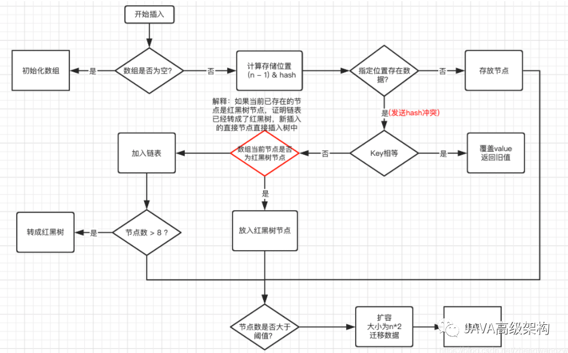
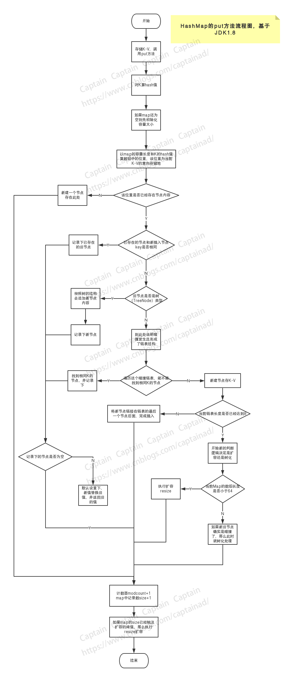
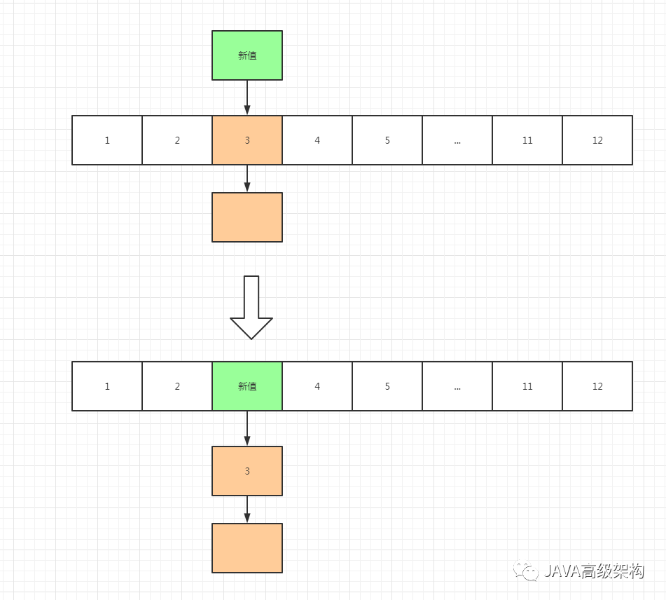

<h1 align="center">21 个刁钻的 HashMap 面试题</h1>

[toc]

## **一、HashMap**

### **1：HashMap 的数据结构？**

A：哈希表结构（链表散列：数组+链表）实现，结合数组和链表的优点。当链表长度超过 8 时，链表转换为红黑树。数组中的每一个元素都是链表。总结来说就是HashMap在JDK1.8之前底层是由数组+链表实现的，在JDK1.8开始底层是由数组+链表或者数组+红黑树实现的。

```java
transient Node<K,V>\[\] table;
```

**追问：为什么在1.8中增加红黑树？**

当需要查找某个元素的时候，线性探索是最直白的方式，它会把所有数据遍历一遍直到找到你所查找的数据，对于数组和链表这种线性结构来说，当链表长度过长（数据有成百上千）的时候，会造成链表过深的问题，这种查找方式效率极低，时间复杂度是O(n)。简单来说红黑树的出现就是为了提高数据检索的速度。

**追问：链表过深问题为什么不用二叉查找树代替，而选择红黑树？为什么不一直使用红黑树？**

二叉树在特殊情况下会变成一条线性结构，这就跟原来的链表结构一样了，选择红黑树就是为了解决二叉树的缺陷。

红黑树在插入数据的时候需要通过左旋、右旋、变色这些操作来保持平衡，为了保持这种平衡是需要付出代价的。当链表很短的时候，没必要使用红黑树，否则会导致效率更低，当链表很长的时候，使用红黑树，保持平衡的操作所消耗的资源要远小于遍历链表锁消耗的效率，所以才会设定一个阈值，去判断什么时候使用链表，什么时候使用红黑树。

**追问：讲一下你对红黑树的认识**

- 每个节点非红即黑
- 根节点总是黑色的
- 如果节点是红色，则它的子节点必须是黑色（反之不一定）
- 每个叶子节点都是黑色的空节点
- 从根节点到叶子节点或者空节点的每条路径必须包含相同数量的黑色节点（黑色节点的深度相同）

### **2：HashMap 的工作原理，put()和get()的过程分别是怎么样的？**

HashMap 底层是 hash 数组和单向链表实现，数组中的每个元素都是链表，由 Node 内部类（实现 Map.Entry接口）实现，HashMap 通过 put & get 方法存储和获取。

存储对象时，将 K/V 键值传给 put() 方法：

①、调用 hash(K) 方法计算 K 的 hash 值，然后结合数组长度，计算得数组下标；

②、调整数组大小（当容器中的元素个数大于 capacity * loadfactor 时，容器会进行扩容resize 为 2n）；

③、i.如果 K 的 hash 值在 HashMap 中不存在，则执行插入，若存在，则发生碰撞；

​    ii.如果 K 的 hash 值在 HashMap 中存在，且它们两者 equals 返回 true，则更新键值对；

​	iii. 如果 K 的 hash 值在 HashMap 中存在，且它们两者 equals 返回 false，则插入链表的尾部（尾插法）或者红黑树中（树的添加方式）。

（JDK 1.7 之前使用头插法、JDK 1.8 使用尾插法）（注意：当碰撞导致链表大于 TREEIFY_THRESHOLD = 8 时，就把链表转换成红黑树）

获取对象时，将 K 传给 get() 方法：①、调用 hash(K) 方法（计算 K 的 hash 值）从而获取该键值所在链表的数组下标；②、顺序遍历链表，equals()方法查找相同 Node 链表中 K 值对应的 V 值。

hashCode 是定位的，存储位置；equals是定性的，比较两者是否相等。

**存储对象时，将key和vaule传给put()方法：**

1. 判断数组是否为空，为空进行初始化;
2. 不为空，计算 k 的 hash 值，通过(n - 1) & hash计算应当存放在数组中的下标 index;
3. 查看 table[index] 是否存在数据，没有数据就构造一个Node节点存放在 table[index] 中；
4. 存在数据，说明发生了hash冲突(存在二个节点key的hash值一样), 继续判断key是否相等，相等，用新的value替换原数据(onlyIfAbsent为false)；
5. 如果不相等，判断当前节点类型是不是树型节点，如果是树型节点，创造树型节点插入红黑树中；(如果当前节点是树型节点证明当前已经是红黑树了)
6. 如果不是树型节点，创建普通Node加入链表中；判断链表长度是否大于8并且数组长度大于64，大于的话链表转换为红黑树；
7. 插入完成之后判断当前节点数是否大于阈值（capacity*loadFactor），如果大于开始扩容为原数组的二倍。

下面以流程图方式更加直观的看一下插入流程：



**获取对象时，将key传给get()方法：**

1. 调用hash(key)方法获取key对应的hash值从而获取该键值对在数组中的下标。
2. 对链表进行顺序遍历，使用equals()方法查找链表中相等的key对应的value值。

**追问：说一下数组是怎么扩容的？**

创建一个新数组，新数组初始化容量大小是旧数组的两倍，对原数组中元素重新进行一次hash从而定位在新数组中的存储位置，元素在新数组中的位置只有两种，原下标位置或原下标+旧数组的大小。

**追问：为什么要对原数组中元素再重新进行一次hash？直接复制到新数组不行吗？**

因为数组长度扩大以后Hash规则也会随之变化。
Hash的公式—> index = HashCode（Key） & （Length - 1）

**追问：在插入元素的时候，JDK1.7与JDK1.8有什么不同？**

1.7是先判断是否需要扩容，再进行插入操作。1.8是先插入，插入完成之后再判断是否需要扩容。

注：hashcode是用来定位的，定键值对在数组中的存储位置。equals()方法是用来定性的，比较两个对象是否相等。

### **3.当两个对象的 hashCode 相同会发生什么？**

[因为 hashCode 相同，不一定就是相等的（equals方法比较），所以两个对象所在数组的下标相同，"碰撞"就此发生。又因为 HashMap 使用链表存储对象，这个 Node 会存储到链表中。为什么要重写 hashcode 和 equals 方法？推荐看下。](http://mp.weixin.qq.com/s?__biz=MzI2MTIzMzY3Mw==&mid=2247489051&idx=4&sn=651c4a067c2f1d59151f484475144c20&chksm=ea5cdb7ddd2b526bcb46214f83f80859c8603497323a3cf933e511b6f018af666dd74b0e584d&scene=21#wechat_redirect)

### **4.你知道 hash 的实现吗？为什么要这样实现？**

JDK 1.8 中，是通过 hashCode() 的高 16 位异或低 16 位实现的：(h = k.hashCode()) ^ (h >>> 16)，主要是从速度，功效和质量来考虑的，减少系统的开销，也不会造成因为高位没有参与下标的计算，从而引起的碰撞。

### **5.为什么要用异或运算符？**

保证了对象的 hashCode 的 32 位值只要有一位发生改变，整个 hash() 返回值就会改变。尽可能的减少碰撞。

### **6.HashMap 的 table 的容量如何确定？loadFactor 是什么？该容量如何变化？这种变化会带来什么问题？**

[①、table 数组大小是由 capacity 这个参数确定的，默认是16，也可以构造时传入，最大限制是1<<30；](http://mp.weixin.qq.com/s?__biz=MzI2MTIzMzY3Mw==&mid=2247489478&idx=4&sn=ad7321cd1948f0c8eaf955aaaa7a2046&chksm=ea5cdaa0dd2b53b67ac2b9ba12935e13cb59250180fa302bd61629968e24f8853f208790fe80&scene=21#wechat_redirect)

[②、loadFactor 是装载因子，主要目的是用来确认table 数组是否需要动态扩展，默认值是0.75，比如table 数组大小为 16，装载因子为 0.75 时，threshold 就是12，当 table 的实际大小超过 12 时，table就需要动态扩容；](http://mp.weixin.qq.com/s?__biz=MzI2MTIzMzY3Mw==&mid=2247489478&idx=4&sn=ad7321cd1948f0c8eaf955aaaa7a2046&chksm=ea5cdaa0dd2b53b67ac2b9ba12935e13cb59250180fa302bd61629968e24f8853f208790fe80&scene=21#wechat_redirect)

[③、扩容时，调用 resize() 方法，将 table 长度变为原来的两倍（注意是 table 长度，而不是 threshold）](http://mp.weixin.qq.com/s?__biz=MzI2MTIzMzY3Mw==&mid=2247489478&idx=4&sn=ad7321cd1948f0c8eaf955aaaa7a2046&chksm=ea5cdaa0dd2b53b67ac2b9ba12935e13cb59250180fa302bd61629968e24f8853f208790fe80&scene=21#wechat_redirect)

④、如果数据很大的情况下，扩展时将会带来性能的损失，在性能要求很高的地方，这种损失很可能很致命。

### **7.HashMap中put方法的过程？**

答：“调用哈希函数获取Key对应的hash值，再计算其数组下标；

如果没有出现哈希冲突，则直接放入数组；如果出现哈希冲突，则以链表的方式放在链表后面；

如果链表长度超过阀值( TREEIFY THRESHOLD==8)，就把链表转成红黑树，链表长度低于6，就把红黑树转回链表;

如果结点的key已经存在，则替换其value即可；

如果集合中的键值对大于12，调用resize方法进行数组扩容。”



### **8.数组扩容的过程？**

创建一个新的数组，其容量为旧数组的两倍，并重新计算旧数组中结点的存储位置。结点在新数组中的位置只有两种，原下标位置或原下标+旧数组的大小。

### **9.拉链法导致的链表过深问题为什么不用二叉查找树代替，而选择红黑树？为什么不一直使用红黑树？**

[之所以选择红黑树是为了解决二叉查找树的缺陷，二叉查找树在特殊情况下会变成一条线性结构（这就跟原来使用链表结构一样了，造成很深的问题），遍历查找会非常慢。推荐：面试问红黑树，我脸都绿了。](http://mp.weixin.qq.com/s?__biz=MzI2MTIzMzY3Mw==&mid=2247489139&idx=2&sn=9670f4aa9a1b240352b5387f776fb284&chksm=ea5cdb15dd2b5203cd904cdadf8e1061b6e1e6af6a51c9116eceee4313f889945e529381162d&scene=21#wechat_redirect)

[而红黑树在插入新数据后可能需要通过左旋，右旋、变色这些操作来保持平衡，引入红黑树就是为了查找数据快，解决链表查询深度的问题，我们知道红黑树属于平衡二叉树，但是为了保持“平衡”是需要付出代价的，但是该代价所损耗的资源要比遍历线性链表要少，所以当长度大于8的时候，会使用红黑树，如果链表长度很短的话，根本不需要引入红黑树，引入反而会慢。](http://mp.weixin.qq.com/s?__biz=MzI2MTIzMzY3Mw==&mid=2247489139&idx=2&sn=9670f4aa9a1b240352b5387f776fb284&chksm=ea5cdb15dd2b5203cd904cdadf8e1061b6e1e6af6a51c9116eceee4313f889945e529381162d&scene=21#wechat_redirect)

### **10.说说你对红黑树的见解？**

- 每个节点非红即黑
- 根节点总是黑色的
- 如果节点是红色的，则它的子节点必须是黑色的（反之不一定）
- 每个叶子节点都是黑色的空节点（NIL节点）
- 从根节点到叶节点或空子节点的每条路径，必须包含相同数目的黑色节点（即相同的黑色高度）

### **11.jdk8中对HashMap做了哪些改变？**

在java 1.8中，如果链表的长度超过了8，那么链表将转换为红黑树。（桶的数量必须大于64，小于64的时候只会扩容）

发生hash碰撞时，java 1.7 会在链表的头部插入，而java 1.8会在链表的尾部插入

在java 1.8中，Entry被Node替代(换了一个马甲。

###  **12.你说JDK1.8之前使用头插法将Entry节点插入链表，那么头插法具体是怎么做的？设计头插法的目的是什么？**

新值会作为链表的头部替换原来的值，原来的值会被顺推到链表当中。下面以图解方式说明一下：



设计者认为后来插入的值被查找的概率比较高，使用头插法可以提高查找的效率。

### **13.之前是头插法，为什么JDK1.8之后要改成尾插法？**

JDK1.8之前扩容的时候，头插法会导致链表反转，在多线程情况下会出现环形链表，导致取值的时候出现死循环，JDK1.8开始在同样的前提下就不会导致死循环，因为在扩容转移前后链表的顺序不变，保持之前节点的引用关系。

例： A线程和B线程同时向同一个下标位置插入节点，遇到容量不够开始扩容，重新hash，放置元素，采用头插法，后遍历到的B节点放入了头部，这样形成了环，如下图所示：


### **14.HashMap是怎么设定初始化容量大小的？**

使用new HashMap()不传值，默认大小是16，负载因子是0.75。如果传入参数K，那么初始化容量大小为大于K的2的最小整数幂。比如传入的是10，那么初始化容量大小就是16（2的4次方）。

追问：为什么HashMap的数组长度要取2的整数幂？

因为这样数组长度-1正好相当于一个“低位掩码”。“与”操作的结果就是散列值的高位全部归零，只保留低位值，用来做数组下标访问。以初始长度16为例，16-1=15。2进制表示是00000000 00000000 00001111。和某散列值做“与”操作如下，结果就是截取了最低的四位值。

###  **15.讲一下HashMap中的哈希函数时怎么实现的？**

key的hashcode是一个32位的int类型值，hash函数就是将hashcode的高16位和低16位进行异或运算。

追问：哈希函数为什么这么设计？

这是一个扰动函数，这样设计的原因主要有两点：

1. 可以最大程度的降低hash碰撞的概率（hash值越分散越好）；
2. 因为是高频操作，所以采用位运算，让算法更加高效；

### **16.HashMap是线程安全的吗？**

不是，在多线程的情况下，1.7的HashMap会导致死循环、数据丢失、数据覆盖。在1.8中如果有多个线程同时put()元素还是会存在数据覆盖的问题。以1.8位例，A线程判断index位置为空后正好挂起，B线程开始向index位置写入节点数据，这时A线程恢复现场，执行赋值操作，就把A线程的数据给覆盖了。

追问：如何解决这个线程不安全的问题？

可以使用HashTable、Collections.synchronizedMap、以及ConcurrentHashMap这些线程安全的Map。

追问：分别讲一下这几种Map都是如何实现线程安全的？

HashTable是直接在操作方法上加synchronized关键字，锁住整个数组，粒度比较大；

Collections.synchronizedMap是使用Collections集合工具的内部类，通过传入Map封装出一个SynchronizedMap对象，内部定义了一个对象锁，方法内通过对象锁实现；

ConcurrentHashMap在JDK1.7中使用分段锁，降低了锁粒度，让并发度大大提高，在JDK 1.8 中直接采用了CAS（无锁算法）+ synchronized的方式来实现线程安全。

### **17.说一下HashMap在JDK1.8中都有哪些改变？**

1. 底层数据结构：1.7中是数组+链表。1.8中是数组+链表或数组+红黑树；
2. 元素插入方式：1.7是头插法插入链表。1.7是尾插法插入链表；
3. 节点类型：1.7中数组中节点类型是Entry节点，1.8中数组中节点类型是Node节点；
4. 元素插入流程：1.7中是先判断是否需要扩容，再插入。1.8中是先插入，插入成功之后再判断是否需要扩容；
5. 扩容方式：1.7中需要对原数组中元素重新进行hash定位在新数组中的位置。1.8中采用更简单的逻辑判断，原下标位置或原下标+旧数组的大小。

### **18.HashMap的内部节点是有序的吗？**

是无序的，根据hash值随机插入。

追问：你知道哪些有序的Map？

LinkedHashMap和TreeMap。

追问：说一下这两种Map分别是怎么实现有序的

LinkedHashMap：LinkedHashMap内部维护了一个单链表，有头尾节点，同时LinkedHashMap节点Entry内部除了继承HashMap的Node属性，还有before 和 after用于标识前置节点和后置节点。可以实现按插入的顺序或访问顺序排序。

TreeHashMap： TreeMap是按照Key的自然顺序或者Comprator的顺序进行排序，内部是通过红黑树来实现。所以要么key所属的类实现Comparable接口，或者自定义一个实现了Comparator接口的比较器，传给TreeMap用于key的比较。

### 19.**把握HashMap的原理需要关注4个方法：hash、put、get、resize。**

- **hash方法。** 将 key 的 hashCode 值的高位数据移位到低位进行异或运算。这么做的原因是有些 key 的 hashCode 值的差异集中在高位，而哈希寻址是忽略容量以上高位的，这种做法可以有效避免哈希冲突。
- **put 方法。**put 方法主要有以下几个步骤：
- 通过 hash 方法获取 hash 值，根据 hash 值寻址。
- 如果未发生碰撞，直接放到桶中。
- 如果发生碰撞，则以链表形式放在桶后。
- 当链表长度大于阈值后会触发树化，将链表转换为红黑树。
- 如果数组长度达到阈值，会调用 resize 方法扩展容量。
- **get方法。**get 方法主要有以下几个步骤：
- 通过 hash 方法获取 hash 值，根据 hash 值寻址。
- 如果与寻址到桶的 key 相等，直接返回对应的 value。
- 如果发生冲突，分两种情况。如果是树，则调用 getTreeNode 获取 value；如果是链表则通过循环遍历查找对应的 value。
- **resize 方法。**resize 做了两件事：
- 将原数组扩展为原来的 2 倍
- 重新计算 index 索引值，将原节点重新放到新的数组中。这一步可以将原先冲突的节点分散到新的桶中。

### 20. **如果 HashMap 的大小超过了负载因子(load factor)定义的容量，怎么办？**

默认的负载因子大小为 0.75，也就是说，当一个 map 填满了 75% 的 bucket 时候，和其它集合类(如 ArrayList 等)一样，将会创建原来 HashMap 大小的两倍的 bucket 数组，来重新调整 map 的大小，并将原来的对象放入新的 bucket 数组中。这个过程叫作 rehashing，因为它调用 hash 方法找到新的 bucket 位置。

### 21. **为什么 String, Interger 这样的 wrapper 类适合作为键?**  

因为 String 是不可变的，也是 final 的，而且已经重写了 equals() 和 hashCode() 方法了。其他的 wrapper 类也有这个特点。不可变性是必要的，因为为了要计算 hashCode()，就要防止键值改变，如果键值在放入时和获取时返回不同的 hashcode 的话，那么就不能从 HashMap 中找到你想要的对象。不可变性还有其他的优点如线程安全。如果你可以仅仅通过将某个 field 声明成 final 就能保证 hashCode 是不变的，那么请这么做吧。因为获取对象的时候要用到 equals() 和 hashCode() 方法，那么键对象正确的重写这两个方法是非常重要的。如果两个不相等的对象返回不同的 hashcode 的话，那么碰撞的几率就会小些，这样就能提高 HashMap 的性能。

## **二、HashMap，HashTable，LinkedHashMap，TreeMap，ConcurrentHashMap**

### **1.HashMap，HashTable，LinkedHashMap，TreeMap 有什么区别？**

关键技术剖析：
Map用于存储键值对，根据键得到值，因此键不允许重复，值可以重复。

 HashMap：是一个最常用的Map，它根据键的hashCode值存储数据，根据键可以直接获取它的值，具有很快的访问速度。HaspMap的键和值都可以为空，HashMap最多只允许一条记录的键为null。HashMap不支持线程的同步，即任一时刻可以有多个线程同时写HashMap，可能会导致数据的不一致。如果需要同步，可以用Collections.synchronizedMap(HashMap map)方法使HashMap具有同步的能力。

HashTable：与HashMap类似，不同的是：它不允许记录的键或者值为空；它支持线程同步，即任一时刻只有一个线程能写HashTable，然而，这也导致了HashTable在写入时会比较慢。

LinkedHashMap：在需要输出的顺序和输入的顺序相同的情况下。保存了记录的插入顺序，在用Iterator比那里LinkedHashMap时，先得到的记录肯定是先插入的。在遍历的时候会比HashMap慢，有HashMap的全部特性。保存了记录的插入顺序，在用 Iterator 遍历时，先取到的记录肯定是先插入的；遍历比 HashMap 慢；TreeMap 实现 SortMap 接口，能够把它保存的记录根据键排序（默认按键值升序排序，也可以指定排序的比较器）

TreeMap：实现 SortMap 接口，能够把它保存的记录根据键排序（默认按键值升序排序，也可以指定排序的比较器）。TreeMap能够把它保存的记录根据键排序，默认是按升序排序，也可以指定排序的比较器。当用Iterator遍历TreeMap时，得到的记录是排过序的。TreeMap的键不能为空，因为它自带比较器，会产生空指针异常。

### **2.HashMap & TreeMap & LinkedHashMap 使用场景？**

一般情况下，使用最多的是 HashMap。

HashMap：在 Map 中插入、删除和定位元素时；

TreeMap：在需要按自然顺序或自定义顺序遍历键的情况下；

LinkedHashMap：在需要输出的顺序和输入的顺序相同的情况下。

### **3.HashMap 和 HashTable 有什么区别？**

①、HashMap 是线程不安全的，HashTable 是线程安全的；

②、由于线程安全，所以 HashTable 的效率比不上 HashMap；

③、HashMap最多只允许一条记录的键为null，允许多条记录的值为null，而 HashTable不允许；

④、HashMap 默认初始化数组的大小为16，HashTable 为 11，前者扩容时，扩大两倍，后者扩大两倍+1；

⑤、HashMap 需要重新计算 hash 值，而 HashTable 直接使用对象的 hashCode

### **4.Java 中的另一个线程安全的与 HashMap 极其类似的类是什么？同样是线程安全，它与 HashTable 在线程同步上有什么不同？**

ConcurrentHashMap 类（是 Java并发包 java.util.concurrent 中提供的一个线程安全且高效的 HashMap 实现）。

HashTable 是使用 synchronize 关键字加锁的原理（就是对对象加锁）；

而针对 ConcurrentHashMap，在 JDK 1.7 中采用 分段锁的方式；JDK 1.8 中直接采用了CAS（无锁算法）+ synchronized。

### **5.HashMap & ConcurrentHashMap 的区别？**

除了加锁，原理上无太大区别。另外，HashMap 的键值对允许有null，但是ConCurrentHashMap 都不允许。

### **6.为什么 ConcurrentHashMap 比 HashTable 效率要高？**

HashTable 使用一把锁（锁住整个链表结构）处理并发问题，多个线程竞争一把锁，容易阻塞；

ConcurrentHashMap

- JDK 1.7 中使用分段锁（ReentrantLock + Segment + HashEntry），相当于把一个 HashMap 分成多个段，每段分配一把锁，这样支持多线程访问。锁粒度：基于 Segment，包含多个 HashEntry。

- JDK 1.8 中使用 CAS + synchronized + Node + 红黑树。锁粒度：Node（首结

   点）（实现 Map.Entry）。锁粒度降低了。

## 三、HashMap版本区别

### 结构图

- **JDK 1.7 HashMap 结构图**


- **JDK 1.8 HashMap 结构图**


[HashMap面试必问的数据结构相关知识总结 - 菜鸟小于 - 博客园 (cnblogs.com)](https://www.cnblogs.com/Young111/p/11519952.html?utm_source=gold_browser_extension)

[每日一面系列之HashMap夺命连环问 (qq.com)](https://mp.weixin.qq.com/s/6N7xa4hqyt4v0c0e4dFHjA)

[HashMap之put方法流程解读 - Captain&D - 博客园 (cnblogs.com)](https://www.cnblogs.com/captainad/p/10905184.html)

