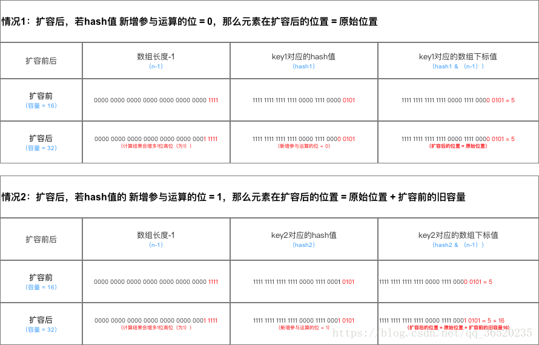
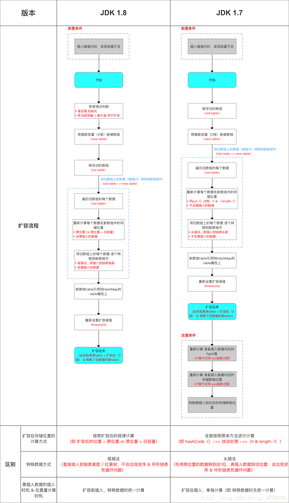
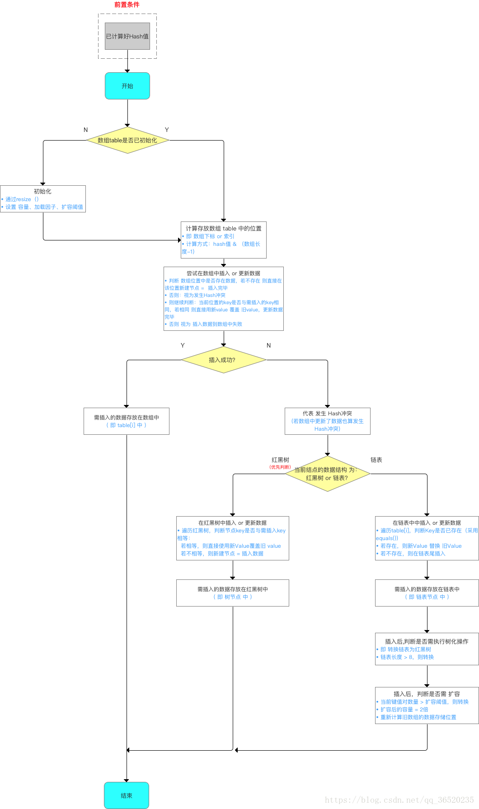
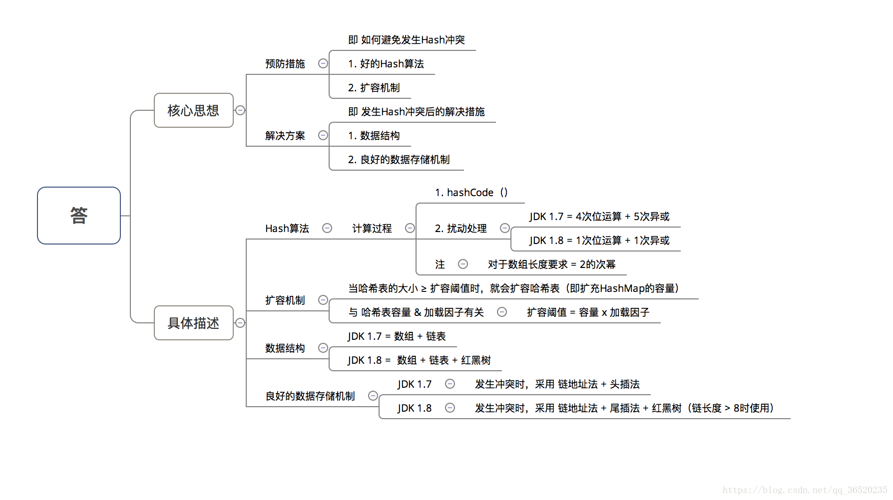
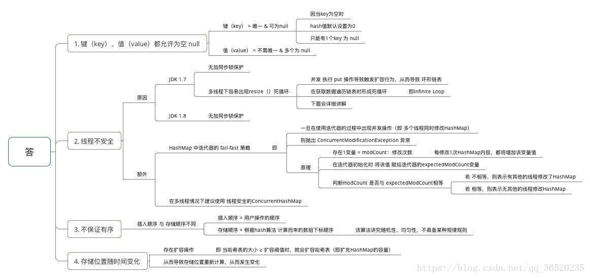
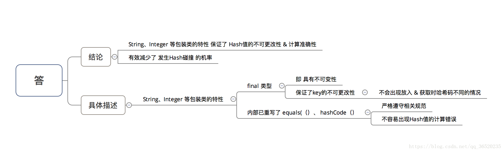
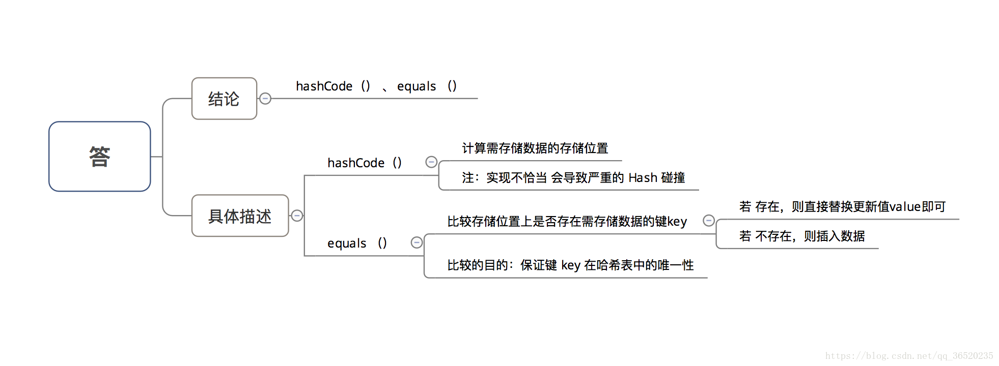

<h1 align="center">Hashmap的结构，1.7和1.8有哪些区别，史上最深入的分析</h1>

（一） 真实面试题之：Hashmap的结构，1.7和1.8有哪些区别
不同点：
（1）JDK1.7用的是头插法，而JDK1.8及之后使用的都是尾插法，那么他们为什么要这样做呢？因为JDK1.7是用单链表进行的纵向延伸，当采用头插法时会容易出现逆序且环形链表死循环问题。但是在JDK1.8之后是因为加入了红黑树使用尾插法，能够避免出现逆序且链表死循环的问题。

（2）扩容后数据存储位置的计算方式也不一样：1. 在JDK1.7的时候是直接用hash值和需要扩容的二进制数进行&（这里就是为什么扩容的时候为啥一定必须是2的多少次幂的原因所在，因为如果只有2的n次幂的情况时最后一位二进制数才一定是1，这样能最大程度减少hash碰撞）（hash值 & length-1）

2、而在JDK1.8的时候直接用了JDK1.7的时候计算的规律，也就是扩容前的原始位置+扩容的大小值=JDK1.8的计算方式，而不再是JDK1.7的那种异或的方法。但是这种方式就相当于只需要判断Hash值的新增参与运算的位是0还是1就直接迅速计算出了扩容后的储存方式。


在计算hash值的时候，JDK1.7用了9次扰动处理=4次位运算+5次异或，而JDK1.8只用了2次扰动处理=1次位运算+1次异或。

**扩容流程对比图：**



**（3）JDK1.7的时候使用的是数组+ 单链表的数据结构。但是在JDK1.8及之后时，使用的是数组+链表+红黑树的数据结构（当链表的深度达到8的时候，也就是默认阈值，就会自动扩容把链表转成红黑树的数据结构来把时间复杂度从O（n）变成O（logN）提高了效率）**



这里在重新进行补充两个问题：（2019-09-03）

**（1）为什么在JDK1.7的时候是先进行扩容后进行插入，而在JDK1.8的时候则是先插入后进行扩容的呢？**

```java
//其实就是当这个Map中实际插入的键值对的值的大小如果大于这个默认的阈值的时候（初始是16*0.75=12）的时候才会触发扩容，
//这个是在JDK1.8中的先插入后扩容
if (++size > threshold)
            resize();
```

* 其实这个问题也是JDK8对HashMap中，主要是因为对链表转为红黑树进行的优化，因为你插入这个节点的时候有可能是普通链表节点，也有可能是红黑树节点，但是为什么1.8之后HashMap变为先插入后扩容的原因，我也有点不是很理解？欢迎来讨论这个问题？
* 但是在JDK1.7中的话，是先进行扩容后进行插入的，就是当你发现你插入的桶是不是为空，如果不为空说明存在值就发生了hash冲突，那么就必须得扩容，但是如果不发生Hash冲突的话，说明当前桶是空的（后面并没有挂有链表），那就等到下一次发生Hash冲突的时候在进行扩容，但是当如果以后都没有发生hash冲突产生，那么就不会进行扩容了，减少了一次无用扩容，也减少了内存的使用
  

```java
void addEntry(int hash, K key, V value, int bucketIndex) {
		//这里当钱数组如果大于等于12（假如）阈值的话，并且当前的数组的Entry数组还不能为空的时候就扩容
    　　if ((size >= threshold) && (null != table[bucketIndex])) {
　　　　　　 //扩容数组，比较耗时
       　　 resize(2 * table.length);
        　　hash = (null != key) ? hash(key) : 0;
        　　bucketIndex = indexFor(hash, table.length);
    　　}

    　　createEntry(hash, key, value, bucketIndex);
　　}

 void createEntry(int hash, K key, V value, int bucketIndex) {
    　　Entry<K,V> e = table[bucketIndex];
　　　　//把新加的放在原先在的前面，原先的是e，现在的是new，next指向e
   　　 table[bucketIndex] = new Entry<>(hash, key, value, e);//假设现在是new
    　　size++;
　　}
```

（2）为什么在JDK1.8中进行对HashMap优化的时候，把链表转化为红黑树的阈值是8,而不是7或者不是20呢（面试蘑菇街问过）？

* 如果选择6和8（如果链表小于等于6树还原转为链表，大于等于8转为树），中间有个差值7可以有效防止链表和树频繁转换。假设一下，如果设计成链表个数超过8则链表转换成树结构，链表个数小于8则树结构转换成链表，如果一个HashMap不停的插入、删除元素，链表个数在8左右徘徊，就会频繁的发生树转链表、链表转树，效率会很低。
* 还有一点重要的就是由于treenodes的大小大约是常规节点的两倍，因此我们仅在容器包含足够的节点以保证使用时才使用它们，当它们变得太小（由于移除或调整大小）时，它们会被转换回普通的node节点，容器中节点分布在hash桶中的频率遵循泊松分布，桶的长度超过8的概率非常非常小。所以作者应该是根据概率统计而选择了8作为阀值
  

```java
	//Java中解释的原因
   * Because TreeNodes are about twice the size of regular nodes, we
     * use them only when bins contain enough nodes to warrant use
     * (see TREEIFY_THRESHOLD). And when they become too small (due to
     * removal or resizing) they are converted back to plain bins.  In
     * usages with well-distributed user hashCodes, tree bins are
     * rarely used.  Ideally, under random hashCodes, the frequency of
     * nodes in bins follows a Poisson distribution
     * (http://en.wikipedia.org/wiki/Poisson_distribution) with a
     * parameter of about 0.5 on average for the default resizing
     * threshold of 0.75, although with a large variance because of
     * resizing granularity. Ignoring variance, the expected
     * occurrences of list size k are (exp(-0.5) * pow(0.5, k) /
     * factorial(k)). The first values are:
     *
     * 0:    0.60653066
     * 1:    0.30326533
     * 2:    0.07581633
     * 3:    0.01263606
     * 4:    0.00157952
     * 5:    0.00015795
     * 6:    0.00001316
     * 7:    0.00000094
     * 8:    0.00000006
     * more: less than 1 in ten million
```

## （二）哈希表如何解决Hash冲突？



## （三）为什么HashMap具备下述特点：键-值（key-value）都允许为空、线程不安全、不保证有序、存储位置随时间变化



## （四）为什么 HashMap 中 String、Integer 这样的包装类适合作为 key 键



## （五）HashMap 中的 key若 Object类型， 则需实现哪些方法？



## 来源

https://blog.csdn.net/qq_36520235/article/details/82417949

