<h1 align="center">分析1.7中HashMap死循环</h1>

[TOC]

在多线程环境下，使用HashMap进行put操作会引起死循环，导致CPU利用率接近100%，HashMap在并发执行put操作时会引起死循环，是因为多线程会导致HashMap的Entry链表

形成环形数据结构，一旦形成环形数据结构，Entry的next节点永远不为空，就会产生死循环获取Entry。那么这个死循环是如何生成的呢？我们来仔细分析下。

## HashMap扩容流程

### **原理**

引发死循环，是在HashMap的扩容操作中，正常的扩容操作是这个流程。HashMap的扩容在put操作中会触发扩容，主要是三个方法：

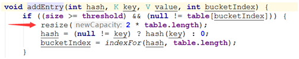

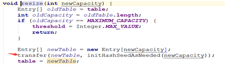

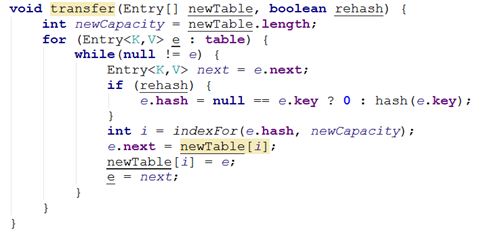

综合来说，HashMap一次扩容的过程：

1、取当前table的2倍作为新table的大小

2、根据算出的新table的大小new出一个新的Entry数组来，名为newTable

3、轮询原table的每一个位置，将每个位置上连接的Entry，算出在新table上的位置，并以链表形式连接

4、原table上的所有Entry全部轮询完毕之后，意味着原table上面的所有Entry已经移到了新的table上，HashMap中的table指向newTable

### 实例

现在hashmap中有三个元素，Hash表的size=2, 所以key = 3, 7, 5，在mod 2以后都冲突在table[1]这里了。

按照方法中的代码

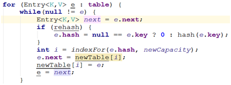

对table[1]中的链表来说，进入while循环，此时e=key(3)，那么next=key(7)，经过计算重新定位e=key(3)在新表中的位置，并把e=key(3)挂在newTable[3]的位置

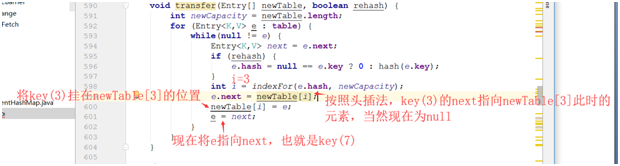

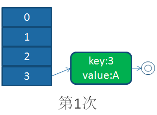

这样循环下去，将table[1]中的链表循环完成后，于是HashMap就完成了扩容

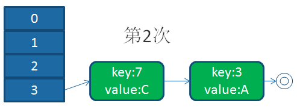

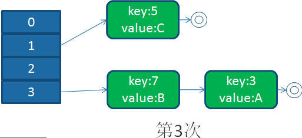

### 并发下的扩容

上面都是单线程下的扩容，当多线程进行扩容时，会是什么样子呢？

初始的HashMap还是：

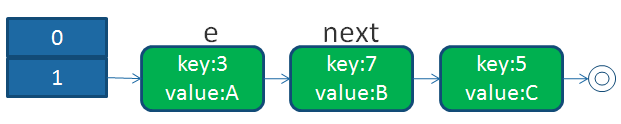

我们现在假设有两个线程并发操作，都进入了扩容操作， 我们以颜色进行区分两个线程。

回顾我们的扩容代码，我们假设，线程1执行到Entry<K,V> next = e.next;时被操作系统调度挂起了，而线程2执行完成了扩容操作

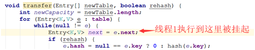

于是，在线程1,2看来，就应该是这个样子

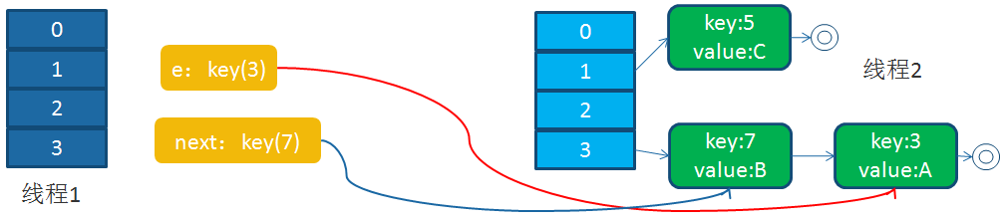

接下来，线程1被调度回来执行：

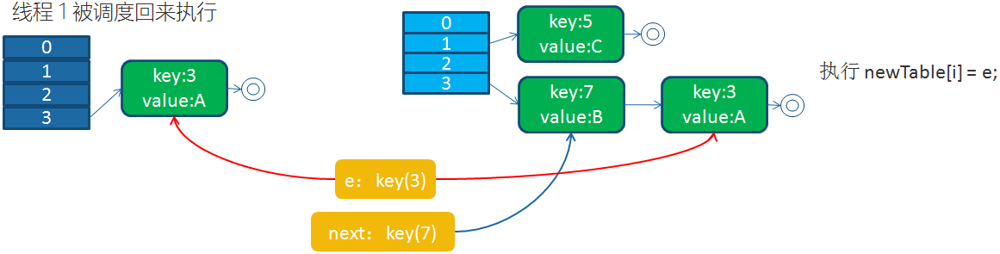

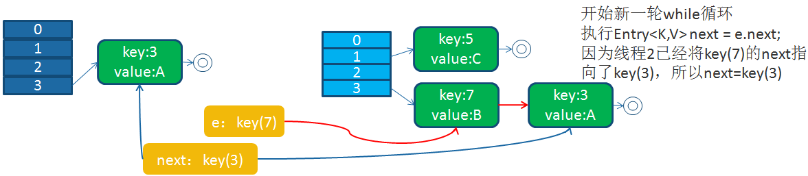

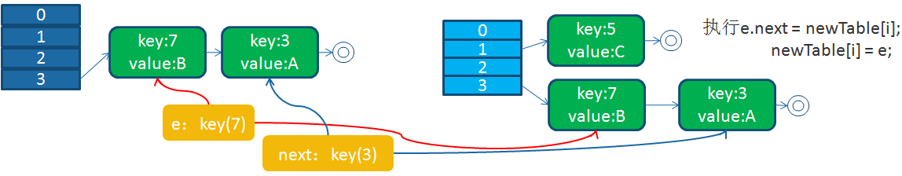

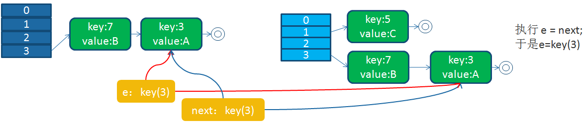

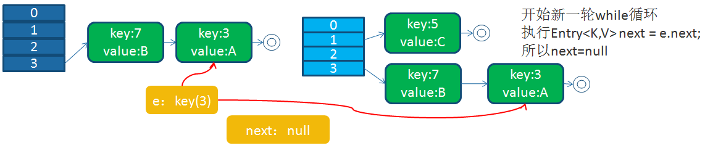

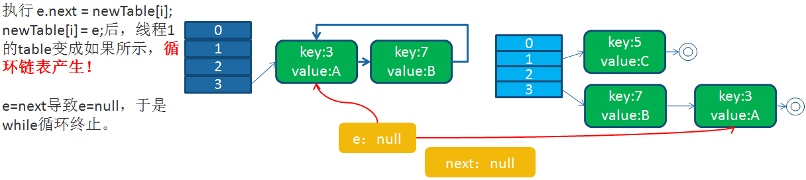

循环列表产生后，一旦线程1调用get（11,15之类的元素）时，就会进入一个死循环的情况，将CPU的消耗到100%。

## 总结

HashMap之所以在并发下的扩容造成死循环，是因为，多个线程并发进行时，因为一个线程先期完成了扩容，将原的链表重新散列到自己的表中，并且链表变成了倒序，后一个线程再扩容时，又进行自己的散列，再次将倒序链表变为正序链表。于是形成了一个环形链表，当表中不存在的元素时，造成死循环。

虽然在JDK1.8中，Java的开发小组修正了这个问题，但是HashMap始终存在着其他的线程安全问题。所以在并发情况下，我们应该使用HastTable或者ConcurrentHashMap来代替HashMap。

## 来源

* [阿里十年技术大咖，教你如何分析1.7中HashMap死循环 (toutiao.com)](https://www.toutiao.com/i6760577925625414151/?tt_from=weixin&utm_campaign=client_share&wxshare_count=1&timestamp=1619621676&app=news_article&utm_source=weixin&utm_medium=toutiao_android&use_new_style=1&req_id=20210428225436010151192016240A2D27&share_token=17444138-bd3f-46f7-a9a2-4ba55cfdea6b&group_id=6760577925625414151)

