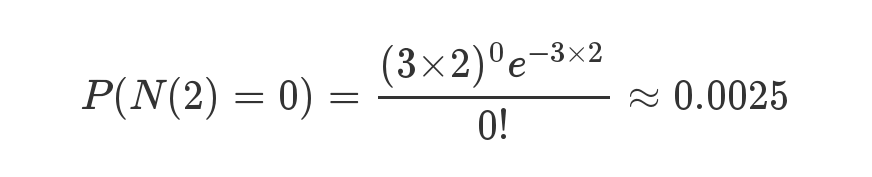
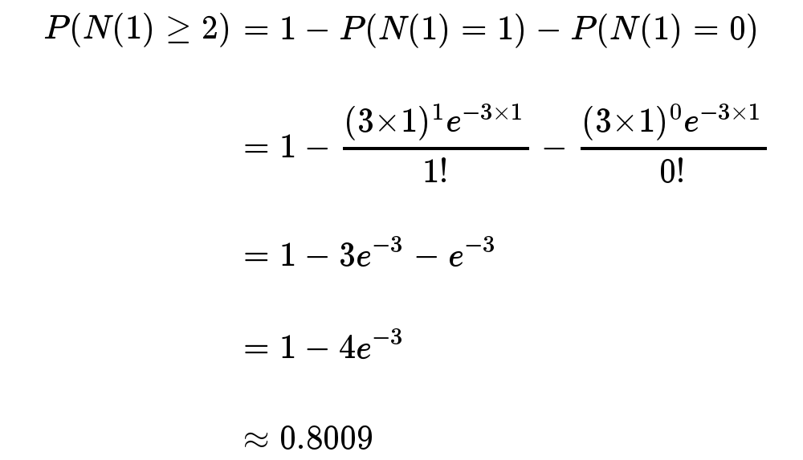
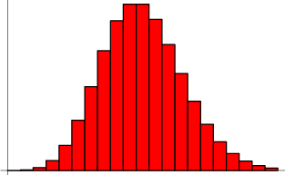
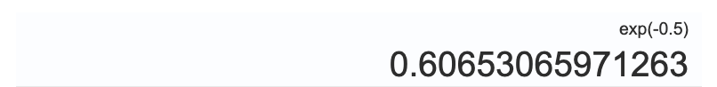

<h1 align="center">用泊松分布来解释为什么HashMap的链表变树的阈值是8</h1>

[TOC]

## 前言

> 有网友指出《面试Java——集合之HashMap和ConcurrentHashMap》一文，关于为什么是8，还可以加一句符合泊松分布。于是我了解一下泊松分布后，确实和网友说的一致，同时非常感谢网友指出文章存在的瑕疵。接下来的内容，大头菜将试图用泊松分布来论证**HashMap的链表变树的阈值为什么是8**。

## 泊松分布

首先，什么是泊松分布？

维基百科官方解释：

> 泊松分布（法语：loi de Poisson，英语：Poisson distribution）又称Poisson分布、帕松分布、布瓦松分布、布阿松分布、普阿松分布、波以松分布、卜氏分布、帕松小数法则（Poisson law of small numbers），是一种统计与概率学里常见到的离散概率分布，由法国数学家西莫恩·德尼·泊松在1838年时发表。
> 泊松分布适合于描述单位时间内随机事件发生的次数的概率分布。如某一服务设施在一定时间内受到的服务请求的次数，电话交换机接到呼叫的次数、汽车站台的候客人数、机器出现的故障数、自然灾害发生的次数、DNA序列的变异数、放射性原子核的衰变数、激光的光子数分布等等。

泊松分布的概率质量函数为：


我总结一下，简单点来说：**泊松分布就是描述单位时间内，独立事件发生的次数。**

简单举个例子，让大家熟悉一下：

比如：某医院平均每小时出生3个婴儿，请问下一个小时，会出生几个？

有可能出生6个，也有可能一个都不出生，这是我们没法知道的。

如果尝试用泊松分布来表示：等号的左边，P 表示概率，N表示某种函数关系，t 表示时间，n 表示数量，1小时内出生3个婴儿的概率，就表示为 P(N(1) = 3) 。等号的右边，λ 表示事件的频率。

接下来两个小时，一个婴儿都不出生的概率是0.25%，基本不可能发生。




接下来一个小时，至少出生两个婴儿的概率是80%。




泊松分布的图形大概是下面的样子。




**可以看到，在频率附近，事件的发生概率最高，然后向两边对称下降，即变得越大和越小都不太可能。每小时出生3个婴儿，这是最可能的结果，出生得越多或越少，就越不可能。**

看完例子后，你应该对泊松分布有一个大概的认识了。接下来，我们尝试使用泊松分布去分析HashMap的链表变树。

## HashMap的链表变树阈值为什么是8

根据泊松分布：单位时间内，独立事件发生的次数。

**HashMap的key碰撞问题，每次key的碰撞，都可以认为是一次独立事件。与上次或下次是否发生key碰撞，都无关系。**


因此，用泊松分布尝试表示：P 表示概率，N表示某种函数关系，t 表示时间，n 表示数量，每1秒key发送碰撞的次数为k，就表示为 P(N(1) = k) 。等号的右边，λ 表示事件的频率。关于一个key是否发生碰撞的概率为0.5。




- e^-0.5 = 0.6065

把相应数值代入泊松分布公式：

> $P(N(1)=k) = \frac{0.6065*(0.5^k)}{k!}$

- 当k=0时，P= 0.6065
- 当k=1时，p= 0.3032
- 当k=2时，p= 0.0758
- 当k=3时，p= 0.0126
- 当k=4时，p= 0.0015
- 当k=5时，p= 0.0001
- 当k=6时，p= 0.000013
- 当k=7时，p= 0.0000009
- 当k=8时，p= 0.00000006
- 当k=9时，p= 0.000000003

有没有发现上述的结果有点熟悉：

对比一下HashMap的注释：

```
    * 0:    0.60653066
     * 1:    0.30326533
     * 2:    0.07581633
     * 3:    0.01263606
     * 4:    0.00157952
     * 5:    0.00015795
     * 6:    0.00001316
     * 7:    0.00000094
     * 8:    0.00000006
     * more: less than 1 in ten million
```

**当k=9时，也就是发生的碰撞次数为9次时，概率为亿分之三，碰撞的概率已经无限接近为0。**

如果设置为9，意味着，几乎永远都不会再次发生碰撞，换句话说，链表的长度此时为8，要发生碰撞才会从链表变树。但永远都不会变树，因为概率太小了。因此设置为9，实在没必要。

**这就是链表变树的阈值为8的原因。**

## 参考资料

- 维基百科
- 阮一峰的网络日志——《泊松分布和指数分布：10分钟教程》

## 来源

[用泊松分布来解释为什么HashMap的链表变树的阈值是8](https://www.toutiao.com/i6950121794334491139/?tt_from=weixin&utm_campaign=client_share&wxshare_count=1&timestamp=1618234914&app=news_article&utm_source=weixin&utm_medium=toutiao_android&use_new_style=1&req_id=20210412214154010151199105380BABF6&share_token=f805ef0b-3975-42ef-ab15-e38bc1b34890&group_id=6950121794334491139)

