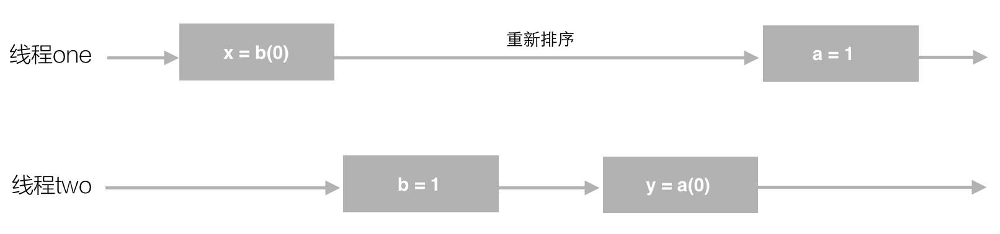
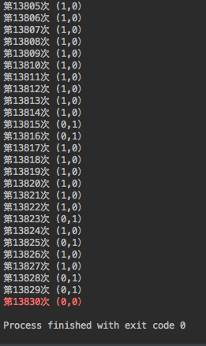
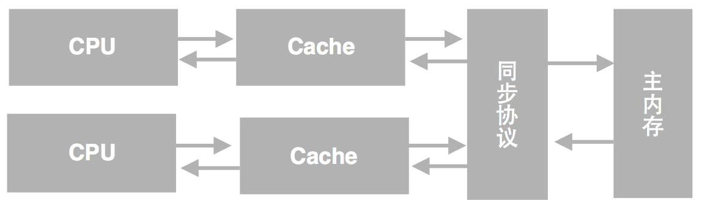
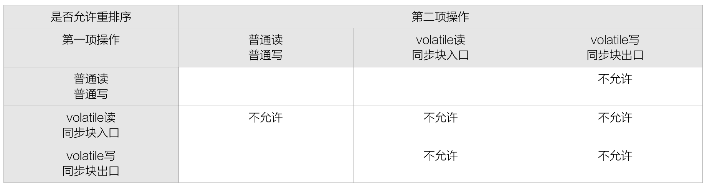
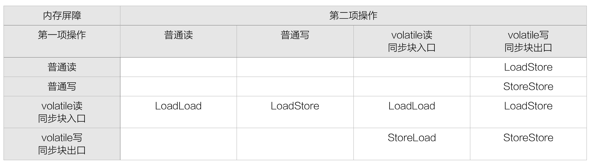

<h1 align="center">Java内存访问重排序的研究</h1>

[TOC]

## 什么是重排序

请先看这样一段代码1：

```java
public class PossibleReordering {
static int x = 0, y = 0;
static int a = 0, b = 0;

public static void main(String[] args) throws InterruptedException {
    Thread one = new Thread(new Runnable() {
        public void run() {
            a = 1;
            x = b;
        }
    });
    
    Thread other = new Thread(new Runnable() {
        public void run() {
            b = 1;
            y = a;
        }
    });
    one.start();other.start();
    one.join();other.join();
    System.out.println(“(” + x + “,” + y + “)”);
}
```

很容易想到这段代码的运行结果可能为(1,0)、(0,1)或(1,1)，因为线程one可以在线程two开始之前就执行完了，也有可能反之，甚至有可能二者的指令是同时或交替执行的。

然而，这段代码的执行结果也可能是(0,0). 因为，在实际运行时，代码指令可能并不是严格按照代码语句顺序执行的。得到(0,0)结果的语句执行过程，如下图所示。值得注意的是，a=1和x=b这两个语句的赋值操作的顺序被颠倒了，或者说，发生了指令“重排序”(reordering)。（事实上，输出了这一结果，并不代表一定发生了指令重排序，内存可见性问题也会导致这样的输出，详见后文）



重排序图解


对重排序现象不太了解的开发者可能会对这种现象感到吃惊，但是，笔者开发环境下做的一个小实验证实了这一结果2。



重排序实验


实验代码是构造一个循环，反复执行上面的实例代码，直到出现a=0且b=0的输出为止。实验结果说明，循环执行到第13830次时输出了(0,0).

大多数现代微处理器都会采用将指令乱序执行（out-of-order execution，简称OoOE或OOE）的方法，在条件允许的情况下，直接运行当前有能力立即执行的后续指令，避开获取下一条指令所需数据时造成的等待3。通过乱序执行的技术，处理器可以大大提高执行效率。

除了处理器，常见的Java运行时环境的JIT编译器也会做指令重排序操作4，即生成的机器指令与字节码指令顺序不一致。

## as-if-serial语义

As-if-serial语义的意思是，所有的动作(Action)5都可以为了优化而被重排序，但是必须保证它们重排序后的结果和程序代码本身的应有结果是一致的。Java编译器、运行时和处理器都会保证单线程下的as-if-serial语义。 比如，为了保证这一语义，重排序不会发生在有数据依赖的操作之中。

- int a = 1;
- int b = 2;
- int c = a + b;

将上面的代码编译成Java字节码或生成机器指令，可视为展开成了以下几步动作（实际可能会省略或添加某些步骤）。

1. 对a赋值1
2. 对b赋值2
3. 取a的值
4. 取b的值
5. 将取到两个值相加后存入c

在上面5个动作中，动作1可能会和动作2、4重排序，动作2可能会和动作1、3重排序，动作3可能会和动作2、4重排序，动作4可能会和1、3重排序。但动作1和动作3、5不能重排序。动作2和动作4、5不能重排序。因为它们之间存在数据依赖关系，一旦重排，as-if-serial语义便无法保证。

为保证as-if-serial语义，Java异常处理机制也会为重排序做一些特殊处理。例如在下面的代码中，y = 0 / 0可能会被重排序在x = 2之前执行，为了保证最终不致于输出x = 1的错误结果，JIT在重排序时会在catch语句中插入错误代偿代码，将x赋值为2，将程序恢复到发生异常时应有的状态。这种做法的确将异常捕捉的逻辑变得复杂了，但是JIT的优化的原则是，尽力优化正常运行下的代码逻辑，哪怕以catch块逻辑变得复杂为代价，毕竟，进入catch块内是一种“异常”情况的表现。6

```java
public class Reordering {
    public static void main(String[] args) {
        int x, y;
        x = 1;
        try {
            x = 2;
            y = 0 / 0;    
        } catch (Exception e) {
        } finally {
            System.out.println("x = " + x);
        }
    }
}
```

## 内存访问重排序与内存可见性

计算机系统中，为了尽可能地避免处理器访问主内存的时间开销，处理器大多会利用缓存(cache)以提高性能。其模型如下图所示：



处理器Cache模型


在这种模型下会存在一个现象，即缓存中的数据与主内存的数据并不是实时同步的，各CPU（或CPU核心）间缓存的数据也不是实时同步的。这导致在同一个时间点，各CPU所看到同一内存地址的数据的值可能是不一致的。从程序的视角来看，就是在同一个时间点，各个线程所看到的共享变量的值可能是不一致的。

有的观点会将这种现象也视为重排序的一种，命名为“内存系统重排序”。因为这种内存可见性问题造成的结果就好像是内存访问指令发生了重排序一样。

这种内存可见性问题也会导致章节一中示例代码即便在没有发生指令重排序的情况下的执行结果也还是(0, 0)。

## 内存访问重排序与Java内存模型

Java的目标是成为一门平台无关性的语言，即Write once, run anywhere. 但是不同硬件环境下指令重排序的规则不尽相同。例如，x86下运行正常的Java程序在IA64下就可能得到非预期的运行结果。为此，JSR-1337制定了Java内存模型(Java Memory Model, JMM)，旨在提供一个统一的可参考的规范，屏蔽平台差异性。从Java 5开始，Java内存模型成为Java语言规范的一部分。

根据Java内存模型中的规定，可以总结出以下几条happens-before规则8。Happens-before的前后两个操作不会被重排序且后者对前者的内存可见。

- 程序次序法则：线程中的每个动作A都happens-before于该线程中的每一个动作B，其中，在程序中，所有的动作B都能出现在A之后。
- 监视器锁法则：对一个监视器锁的解锁 happens-before于每一个后续对同一监视器锁的加锁。
- volatile变量法则：对volatile域的写入操作happens-before于每一个后续对同一个域的读写操作。
- 线程启动法则：在一个线程里，对Thread.start的调用会happens-before于每个启动线程的动作。
- 线程终结法则：线程中的任何动作都happens-before于其他线程检测到这个线程已经终结、或者从Thread.join调用中成功返回，或Thread.isAlive返回false。
- 中断法则：一个线程调用另一个线程的interrupt happens-before于被中断的线程发现中断。
- 终结法则：一个对象的构造函数的结束happens-before于这个对象finalizer的开始。
- 传递性：如果A happens-before于B，且B happens-before于C，则A happens-before于C

Happens-before关系只是对Java内存模型的一种近似性的描述，它并不够严谨，但便于日常程序开发参考使用，关于更严谨的Java内存模型的定义和描述，请阅读JSR-133原文或Java语言规范章节17.4。

除此之外，Java内存模型对volatile和final的语义做了扩展。对volatile语义的扩展保证了volatile变量在一些情况下不会重排序，volatile的64位变量double和long的读取和赋值操作都是原子的。对final语义的扩展保证一个对象的构建方法结束前，所有final成员变量都必须完成初始化（的前提是没有this引用溢出）。

Java内存模型关于重排序的规定，总结后如下表所示：



重排序示意表


表中“第二项操作”的含义是指，第一项操作之后的所有指定操作。如，普通读不能与其之后的所有volatile写重排序。另外，JMM也规定了上述volatile和同步块的规则尽适用于存在多线程访问的情景。例如，若编译器（这里的编译器也包括JIT，下同）证明了一个volatile变量只能被单线程访问，那么就可能会把它做为普通变量来处理。

留白的单元格代表允许在不违反Java基本语义的情况下重排序。例如，编译器不会对对同一内存地址的读和写操作重排序，但是允许对不同地址的读和写操作重排序。

除此之外，为了保证final的新增语义。JSR-133对于final变量的重排序也做了限制。

- 构建方法内部的final成员变量的存储，并且，假如final成员变量本身是一个引用的话，这个final成员变量可以引用到的一切存储操作，都不能与构建方法外的将当期构建对象赋值于多线程共享变量的存储操作重排序。例如对于如下语句：

> x.finalField = v; … ;构建方法边界sharedRef = x; v.afield = 1; x.finalField = v; … ; 构建方法边界sharedRef = x;

这两条语句中，构建方法边界前后的指令都不能重排序。

- 初始读取共享对象与初始读取该共享对象的final成员变量之间不能重排序。例如对于如下语句：

> x = sharedRef; … ; i = x.finalField;

前后两句语句之间不会发生重排序。由于这两句语句有数据依赖关系，编译器本身就不会对它们重排序，但确实有一些处理器会对这种情况重排序，因此特别制定了这一规则。

## 内存屏障

内存屏障（Memory Barrier，或有时叫做内存栅栏，Memory Fence）是一种CPU指令，用于控制特定条件下的重排序和内存可见性问题。Java编译器也会根据内存屏障的规则禁止重排序。

内存屏障可以被分为以下几种类型：

- LoadLoad屏障：对于这样的语句Load1; LoadLoad; Load2，在Load2及后续读取操作要读取的数据被访问前，保证Load1要读取的数据被读取完毕。
- StoreStore屏障：对于这样的语句Store1; StoreStore; Store2，在Store2及后续写入操作执行前，保证Store1的写入操作对其它处理器可见。
- LoadStore屏障：对于这样的语句Load1; LoadStore; Store2，在Store2及后续写入操作被刷出前，保证Load1要读取的数据被读取完毕。
- StoreLoad屏障：对于这样的语句Store1; StoreLoad; Load2，在Load2及后续所有读取操作执行前，保证Store1的写入对所有处理器可见。它的开销是四种屏障中最大的。在大多数处理器的实现中，这个屏障是个万能屏障，兼具其它三种内存屏障的功能。

有的处理器的重排序规则较严，无需内存屏障也能很好的工作，Java编译器会在这种情况下不放置内存屏障。 为了实现上一章中讨论的JSR-133的规定，Java编译器会这样使用内存屏障。



内存屏障示意表


为了保证final字段的特殊语义，也会在下面的语句加入内存屏障。

> x.finalField = v; StoreStore; sharedRef = x;

## Intel 64/IA-32架构下的内存访问重排序

Intel 64和IA-32是我们较常用的硬件环境，相对于其它处理器而言，它们拥有一种较严格的重排序规则。Pentium 4以后的Intel 64或IA-32处理的重排序规则如下。9

在单CPU系统中：

- 读操作不与其它读操作重排序。
- 写操作不与其之前的写操作重排序。
- 写内存操作不与其它写操作重排序，但有以下几种例外
- CLFLUSH的写操作
- 带有non-temporal move指令(MOVNTI, MOVNTQ, MOVNTDQ, MOVNTPS, and MOVNTPD)的streaming写入。
- 字符串操作
- 读操作可能会与其之前的写不同位置的写操作重排序，但不与其之前的写相同位置的写操作重排序。
- 读和写操作不与I/O指令，带锁的指令或序列化指令重排序。
- 读操作不能重排序到LFENCE和MFENCE之前。
- 写操作不能重排序到LFENCE、SFENCE和MFENCE之前。
- LFENCE不能重排序到读操作之前。
- SFENCE不能重排序到写之前。
- MFENCE不能重排序到读或写操作之前。

在多处理器系统中：

- 各自处理器内部遵循单处理器的重排序规则。
- 单处理器的写操作对所有处理器可见是同时的。
- 各自处理器的写操作不会重排序。
- 内存重排序遵守因果性(causality)（内存重排序遵守传递可见性）。
- 任何写操作对于执行这些写操作的处理器之外的处理器来看都是一致的。
- 带锁指令是顺序执行的。

值得注意的是，对于Java编译器而言，Intel 64/IA-32架构下处理器不需要LoadLoad、LoadStore、StoreStore屏障，因为不会发生需要这三种屏障的重排序。

## 一例Intel 64/IA-32架构下的代码性能优化

现在有这样一个场景，一个容器可以放一个东西，容器支持create方法来创建一个新的东西并放到容器里，支持get方法取到这个容器里的东西。我们可以较容易地写出下面的代码：

```java
public class Container {
    public static class SomeThing {
        private int status;

        public SomeThing() {
            status = 1;
        }

        public int getStatus() {
            return status;
        }
    }

    private SomeThing object;

    public void create() {
        object = new SomeThing();
    }

    public SomeThing get() {
        while (object == null) {
            Thread.yield(); //不加这句话可能会在此出现无限循环
        }
        return object;
    }
}
```

在单线程场景下，这段代码执行起来是没有问题的。但是在多线程并发场景下，由不同的线程create和get东西，这段代码是有问题的。问题的原因与普通的双重检查锁定单例模式(Double Checked Locking,DCL)10类似，即SomeThing的构建与将指向构建中的SomeThing引用赋值到object变量这两者可能会发生重排序。导致get中返回一个正被构建中的不完整的SomeThing对象实例。为了解决这一问题，通常的办法是使用volatile修饰object字段。这种方法避免了重排序，保证了内存可见性，摒弃比使用同步块导致的性能损失更小。但是，假如使用场景对object的内存可见性并不敏感的话（不要求一个线程写入了object，object的新值立即对下一个读取的线程可见），在Intel 64/IA-32环境下，有更好的解决方案。

根据上一章的内容，我们知道Intel 64/IA-32下写操作之间不会发生重排序，即在处理器中，构建SomeThing对象与赋值到object这两个操作之间的顺序性是可以保证的。这样看起来，仅仅使用volatile来避免重排序是多此一举的。但是，Java编译器却可能生成重排序后的指令。但令人高兴的是，Oracle的JDK中提供了Unsafe. putOrderedObject，Unsafe. putOrderedInt，Unsafe. putOrderedLong这三个方法，JDK会在执行这三个方法时插入StoreStore内存屏障，避免发生写操作重排序。而在Intel 64/IA-32架构下，StoreStore屏障并不需要，Java编译器会将StoreStore屏障去除。比起写入volatile变量之后执行StoreLoad屏障的巨大开销，采用这种方法除了避免重排序而带来的性能损失以外，不会带来其它的性能开销。

我们将做一个小实验来比较二者的性能差异。一种是使用volatile修饰object成员变量。

```java
public class Container {
    public static class SomeThing {
        private int status;

        public SomeThing() {
            status = 1;
        }

        public int getStatus() {
            return status;
        }
    }

    private volatile  SomeThing object;

    public void create() {
        object = new SomeThing();
    }

    public SomeThing get() {
        while (object == null) {
            Thread.yield(); //不加这句话可能会在此出现无限循环
        }
        return object;
    }
}
```

一种是利用Unsafe. putOrderedObject在避免在适当的位置发生重排序。

```java
public class Container {
    public static class SomeThing {
        private int status;

        public SomeThing() {
            status = 1;
        }

        public int getStatus() {
            return status;
        }
    }

    private SomeThing object;

    private Object value;
    private static final Unsafe unsafe = getUnsafe();
    private static final long valueOffset;
    static {
        try {
            valueOffset = unsafe.objectFieldOffset(Container.class.getDeclaredField("value"));
        } catch (Exception ex) { throw new Error(ex); }
    }

    public void create() {
        SomeThing temp = new SomeThing();
        unsafe.putOrderedObject(this, valueOffset, null);	//将value赋null值只是一项无用操作，实际利用的是这条语句的内存屏障
        object = temp;
    }

    public SomeThing get() {
        while (object == null) {
            Thread.yield();
        }
        return object;
    }


    public static Unsafe getUnsafe() {
        try {
            Field f = Unsafe.class.getDeclaredField("theUnsafe");
            f.setAccessible(true);
            return (Unsafe)f.get(null);
        } catch (Exception e) {
        }
        return null;
    }
}
```

由于直接调用Unsafe.getUnsafe()需要配置JRE获取较高权限，我们利用反射获取Unsafe中的theUnsafe来取得Unsafe的可用实例。
unsafe.putOrderedObject(this, valueOffset, null) 这句仅仅是为了借用这句话功能的防止写重排序，除此之外无其它作用。

利用下面的代码分别测试两种方案的实际运行时间。在运行时开启-server和 -XX:CompileThreshold=1以模拟生产环境下长时间运行后的JIT优化效果。

```java
public static void main(String[] args) throws InterruptedException {
    final int THREADS_COUNT = 20;
    final int LOOP_COUNT = 100000;

    long sum = 0;
    long min = Integer.MAX_VALUE;
    long max = 0;
    for(int n = 0;n <= 100;n++) {
        final Container basket = new Container();
        List<Thread> putThreads = new ArrayList<Thread>();
        List<Thread> takeThreads = new ArrayList<Thread>();
        for (int i = 0; i < THREADS_COUNT; i++) {
            putThreads.add(new Thread() {
                @Override
                public void run() {
                    for (int j = 0; j < LOOP_COUNT; j++) {
                        basket.create();
                    }
                }
            });
            takeThreads.add(new Thread() {
                @Override
                public void run() {
                    for (int j = 0; j < LOOP_COUNT; j++) {
                        basket.get().getStatus();
                    }
                }
            });
        }
        long start = System.nanoTime();
        for (int i = 0; i < THREADS_COUNT; i++) {
            takeThreads.get(i).start();
            putThreads.get(i).start();
        }
        for (int i = 0; i < THREADS_COUNT; i++) {
            takeThreads.get(i).join();
            putThreads.get(i).join();
        }
        long end = System.nanoTime();
        long period = end - start;
        if(n == 0) {
            continue;	//由于JIT的编译，第一次执行需要更多时间，将此时间不计入统计
        }
        sum += (period);
        System.out.println(period);
        if(period < min) {
            min = period;
        }
        if(period > max) {
            max = period;
        }
    }
    System.out.println("Average : " + sum / 100);
    System.out.println("Max : " + max);
    System.out.println("Min : " + min);
}
```

在笔者的计算机上运行测试，采用volatile方案的运行结果如下：

```
Average : 62535770
Max : 82515000
Min : 45161000
```

采用unsafe.putOrderedObject方案的运行结果如下：

```
Average : 50746230
Max : 68999000
Min : 38038000
```

从结果看出，unsafe.putOrderedObject方案比volatile方案平均耗时减少18.9%，最大耗时减少16.4%，最小耗时减少15.8%.另外，即使在其它会发生写写重排序的处理器中，由于StoreStore屏障的性能损耗小于StoreLoad屏障，采用这一方法也是一种可行的方案。但值得再次注意的是，这一方案不是对volatile语义的等价替换，而是在特定场景下做的特殊优化，它仅避免了写写重排序，但不保证内存可见性。

## 序

1. 样例选自《Java并发编程实践》章节16.1
2. 实验代码见附1
3. http://en.wikipedia.org/wiki/Out-of-order_execution
4. Oracle Java Hotspot https://wikis.oracle.com/display/HotSpotInternals/PerformanceTacticIndex IBM JVM http://publib.boulder.ibm.com/infocenter/javasdk/v1r4m2/index.jsp?topic=%2Fcom.ibm.java.doc.diagnostics.142j9%2Fhtml%2Fhowjitopt.html
5. Java语言规范中对“动作”这个词有一个明确而具体的定义，详见http://docs.oracle.com/javase/specs/jls/se7/html/jls-17.html#jls-17.4.2。
6. https://community.oracle.com/thread/1544959
7. http://www.cs.umd.edu/~pugh/java/memoryModel/jsr133.pdf
8. 参见《Java并发编程实践》章节16.1
9. Intel® 64 and IA-32 Architectures Software Developer’s Manual Volume 3 (3A, 3B & 3C): System Programming Guide章节8.2
10. http://www.cs.umd.edu/~pugh/java/memoryModel/DoubleCheckedLocking.html

### 附1 复现重排序现象实验代码

```java
public class Test {
    private static int x = 0, y = 0;
    private static int a = 0, b =0;

    public static void main(String[] args) throws InterruptedException {
        int i = 0;
        for(;;) {
            i++;
            x = 0; y = 0;
            a = 0; b = 0;
            Thread one = new Thread(new Runnable() {
                public void run() {
                    //由于线程one先启动，下面这句话让它等一等线程two. 读着可根据自己电脑的实际性能适当调整等待时间.
                    shortWait(100000);
                    a = 1;
                    x = b;
                }
            });

            Thread other = new Thread(new Runnable() {
                public void run() {
                    b = 1;
                    y = a;
                }
            });
            one.start();other.start();
            one.join();other.join();
            String result = "第" + i + "次 (" + x + "," + y + "）";
            if(x == 0 && y == 0) {
                System.err.println(result);
                break;
            } else {
                System.out.println(result);
            }
        }
    }


    public static void shortWait(long interval){
        long start = System.nanoTime();
        long end;
        do{
            end = System.nanoTime();
        }while(start + interval >= end);
    }
}
```


[Java内存访问重排序的研究 - 美团技术团队 (meituan.com)](https://tech.meituan.com/2014/09/23/java-memory-reordering.html)