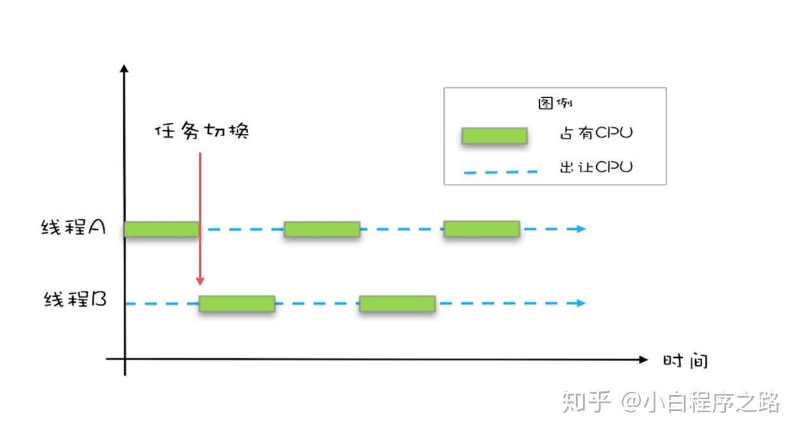
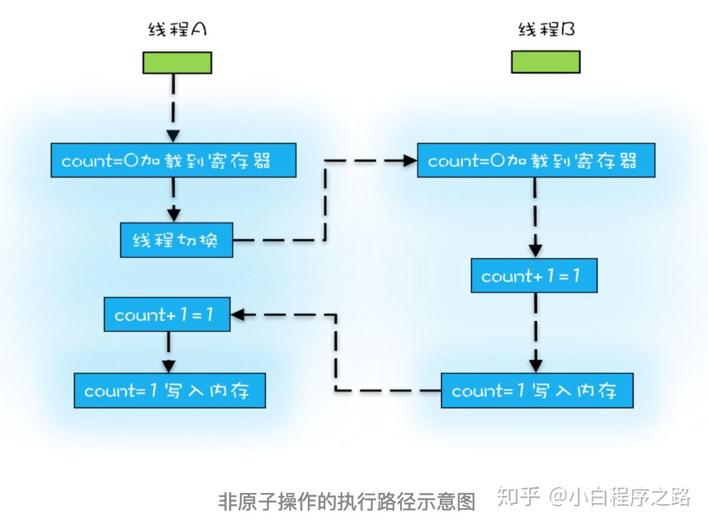

<h1 align="center">Java并发之原子性、有序性、可见性</h1>

[TOC]

## 原子性

 原子性指的是一个或者多个操作在 CPU 执行的过程中不被中断的特性

> **线程切换** 带来的原子性问题

Java 并发程序都是基于多线程的，操作系统为了充分利用CPU的资源，将CPU分成若干个时间片，在多线程环境下，线程会被操作系统调度进行任务切换。



为了直观的了解什么是原子性，我们看下下面哪些操作是原子性操作

```java
int count = 0;  // 1
count++;        // 2
int a = count;  // 3
```

上面展示语句中，除了语句1是原子操作，其它两个语句都不是原子性操作，下面我们来分析一下语句2

其实语句2在执行的时候，包含三个指令操作

- 指令 1：首先，需要把变量 count 从内存加载到 CPU的寄存器
- 指令 2：之后，在寄存器中执行 +1 操作；
- 指令 3：最后，将结果写入内存

对于上面的三条指令来说，如果线程 A 在指令 1 执行完后做线程切换，线程 A 和线程 B 按照下图的序列执行，那么我们会发现两个线程都执行了 count+=1 的操作，但是得到的结果不是我们期望的 2，而是 1。



> 操作系统做任务切换，可以发生在任何一条CPU 指令执行完

## 有序性

 有序性指的是程序按照代码的先后顺序执行

> **编译优化** 带来的有序性问题

为了性能优化，编译器和处理器会进行指令重排序，有时候会改变程序中语句的先后顺序，比如程序：

```java
a =5;       // 1
b =20;      // 2
c = a + b;  // 3
```

编译器优化后可能变成

```java
b =20;      // 1
a =5;       // 2
c = a + b;  // 3
```

在这个例子中，编译器调整了语句的顺序，但是不影响程序的最终结果

**synchronized**（具有有序性、原子性、可见性）表示锁在同一时刻只能由一个线程进行获取，当锁被占用后，其他线程只能等待。

在单例模式的实现上有一种双重检验锁定的方式（Double-checked Locking）

```java
public class Singleton{
    static Singleton instance;
    static Singleton getInstance(){
        if(instance == null){
            synchronized(Singleton.class){
            	if(instance == null)
            		instance = newSingleton();
            }
        }
        return instance;
    }
}
```

我们先看 `instance = new Singleton()` 的未被编译器优化的操作

- 指令 1：分配一块内存 M；
- 指令 2：在内存 M 上初始化 Singleton 对象；
- 指令 3：然后 M 的地址赋值给 instance 变量。

编译器优化后的操作指令

- 指令 1：分配一块内存 M；
- 指令 2：将 M 的地址赋值给 instance 变量；
- 指令 3：然后在内存 M 上初始化 Singleton 对象。

现在有A，B两个线程，我们假设线程A先执行 `getInstance()`方法，当执行编译器优化后的操作指令 `2`时（此时候未完成对象的初始化），这时候发生了线程切换，那么线程B进入，刚好执行到第一次判断 `instance == null`会发现 `instance`不等于 `null`了，所以直接返回 `instance`，而此时的 instance 是没有初始化过的。


现行的比较通用的做法就是采用静态内部类的方式来实现

```java
public class SingletonDemo{
    private SingletonDemo(){
    }
    private static class SingletonDemoHandler{
    	private static SingletonDemo instance =newSingletonDemo();
    }
    public static SingletonDemo getInstance(){
    return SingletonDemoHandler.instance;
    }
}
```

## 可见性

 可见性指的是当一个线程修改了共享变量后，其他线程能够立即得知这个修改

> **缓存** 导致的可见性问题

首先我们来看一下Java内存模型（JMM）


- 我们定义的所有变量都储存在 `主内存`中
- 每个线程都有自己 `独立的工作内存`，里面保存该线程使用到的变量的副本（主内存中该变量的一份拷贝）
- 线程对共享变量所有的操作都必须在自己的工作内存中进行，不能直接从主内存中读写（不能越级）
- 不同线程之间也无法直接访问其他线程的工作内存中的变量，线程间变量值的传递需要通过主内存来进行。（同级不能相互访问）

共享变量可见性的实现原理：

线程1对共享变量的修改要被线程2及时看到的话，要经过如下步骤：

1. 把工作内存1中更新的变量值刷新到主内存
2. 把主内存中的变量的值更新到工作内存2中

> 可以使用 **synchronized** 、**volatile** 、**final** 来保证可见性


source：https://zhuanlan.zhihu.com/p/58855599