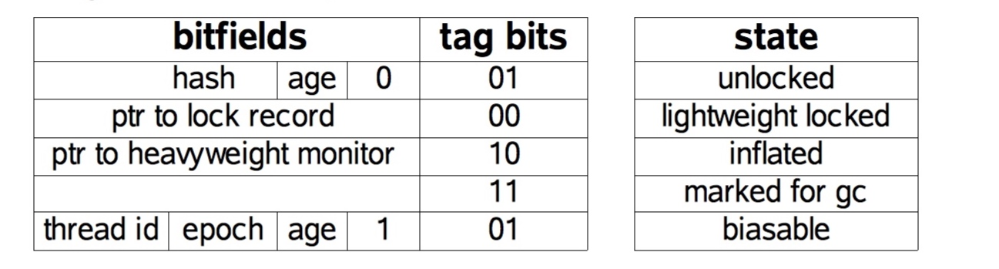
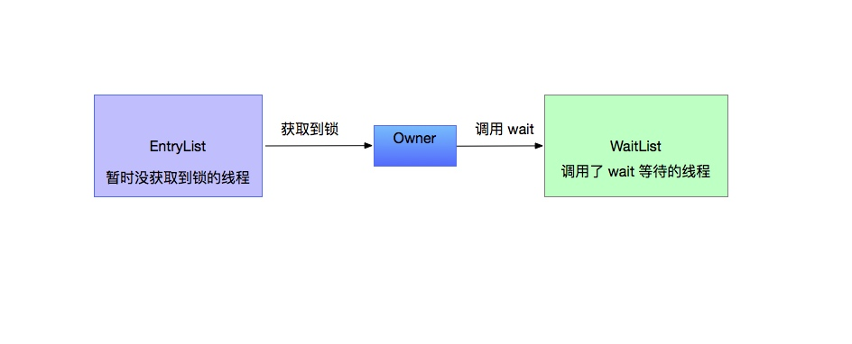
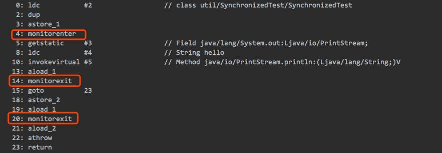
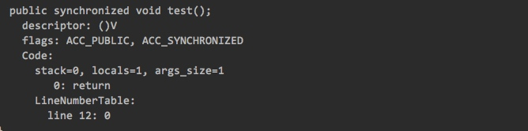

<h1 align="center">synchronized、volatile</h1>

[toc]

## 1.synchronized 介绍

在并发程序中，这个关键字可能是出现频率最高的一个字段，他可以避免多线程中的安全问题，对代码进行同步。同步的方式其实就是隐式的加锁，加锁过程是有 jvm 帮我们完成的，再生成的字节码中会有体现，如果反编译带有不可消除的 synchronized关键字的代码块的 class 文件我们会发现有两个特殊的指令 monitorenter和 monitorexit，这两个就是进入管程和退出管程。为什么说不可消除的 synchronized，这是由于在编译时期会进行锁优化，比如说在 StringBuffer中是加了锁的，也就是锁对象就是他自己，然而我们编译以后会发现根本没有上面的两条指令就是因为，锁消除技术。
   Synchronized使用的一般场景，在对象方法和类方法上使用，以及自定义同步代码块。但是在方法上使用 Synchronized关键字和使用同步代码块是不一样的，方法上采用同步是采用的字节码中的标志位 ACC

_SYNCHRONIZED来进行同步的。而同步代码块则是采用了对象头中的锁指针指向一个监视器（锁），来完成同步。
   当方法调用时，调用指令将会检查方法的 ACC_SYNCHRONIZED 访问标志是否被设置，如果设置了，执行线程将先获取 monitor ，获取成功之后才能执行方法体，方法执行完后再释放 monitor 。在方法执行期间，其他任何线程都无法再获得同一个 monitor 对象。 其实本质上没有区别，只是方法的同步是一种隐式的方式来实现，无需通过字节码来完成。

当它用来修饰一个方法或者一个代码块的时候，能够保证在同一时刻最多只有一个线程执行该段代码。

在 Java 中，每个对象都会有一个 monitor 对象，这个对象其实就是 Java 对象的锁，通常会被称为“内置锁”或“对象锁”。类的对象可以有多个，所以每个对象有其独立的对象锁，互不干扰。针对每个类也有一个锁，可以称为“类锁”，类锁实际上是通过对象锁实现的，即类的 Class 对象锁。每个类只有一个 Class 对象，所以每个类只有一个类锁。

Monitor 是线程私有的数据结构，每一个线程都有一个可用 monitor record 列表，同时还有一个全局的可用列表。每一个被锁住的对象都会和一个 monitor 关联，同时 monitor 中有一个 Owner 字段存放拥有该锁的线程的唯一标识，表示该锁被这个线程占用。Monitor 是依赖于底层的操作系统的 Mutex Lock（互斥锁）来实现的线程同步。

### 根据获取的锁分类

**获取对象锁**

- synchronized(this|object) {}  
- 修饰非静态方法  

**获取类锁**

- synchronized(类.class) {}  
- 修饰静态方法

### 原理

**同步代码块：**

- monitorenter 和 monitorexit 指令实现的

**同步方法**

- 方法修饰符上的 ACC_SYNCHRONIZED 实现

## 2.对象头和锁

 一个对象在内存中分为三部分：对象头、实例数据、对齐填充。

1.对象头中主要存放了 GC 分代年龄、偏向锁、偏向 id、锁类型、hash 值等。jvm 一般会用两个字来存放对象头，(如果对象是数组则会分配3个字，多出来的1个字记录的是数组长度)，其主要结构是由Mark Word 和 Class Metadata Address 组成。MarkWord里默认数据是存储对象的HashCode等信息，但是会随着对象的运行改变而发生变化，不同的锁状态对应着不同的记录存储方式

image


2.实例数据就包括对象字段的值，不仅有自己的值还有继承自父类的字段的值。一般字段的顺序是同类型的字段放在一起，空间比较大的字段放在前面。在满足上面的规则下父类的放在子类的前面。

3.对其填充并非必要的，整个对象需要是 8 字节的整数倍，当不足的时候会进行填充以达到 8 字节整数倍，主要还是为了方便存取。
   这里我们主要分析一下重量级锁也就是通常说synchronized的对象锁，锁标识位为10，其中指针指向的是monitor对象（在 Synchronized 代码块中的监视器 ）的起始地址。每个对象都存在着一个 monitor 与之关联，对象与其 monitor 之间的关系有存在多种实现方式，如 monitor 可以与对象一起创建销毁或当线程试图获取对象锁时自动生成，但当一个 monitor 被某个线程持有后，它便处于锁定状态。。在Java虚拟机(HotSpot)中，monitor是由ObjectMonitor实现的，其主要数据结构如下。

```c++
ObjectMonitor() {
    _count        = 0; //记录个数
    _owner        = NULL; // 运行的线程
    //两个队列
    _WaitSet      = NULL; //调用 wait 方法会被加入到_WaitSet
   _EntryList    = NULL ; //锁竞争失败，会被加入到该列表
}
```


ObjectMonitor中有两个队列，_WaitSet 和 _EntryList，用来保存ObjectWaiter对象列表( 每个等待锁的线程都会被封装成ObjectWaiter对象)，_owner指向持有ObjectMonitor对象的线程，当多个线程同时访问一段同步代码时，首先会进入 _EntryList 集合，当线程获取到对象的monitor 后进入 _Owner 区域并把monitor中的owner变量设置为当前线程同时monitor中的计数器count加1，若线程调用 wait() 方法，将释放当前持有的monitor，owner变量恢复为null，count自减1，同时该线程进入 WaitSe t集合中等待被唤醒。若当前线程执行完毕也将释放monitor(锁)并复位变量的值，以便其他线程进入获取monitor(锁)。


image
## 3.Synchronized 代码块原理

反编译下面的代码得到的字节码如下：

```java
public class SynchronizedTest {
    public static void main(String[] args) {
        synchronized (SynchronizedTest.class) {
            System.out.println("hello");
        }
    }

    public synchronized void test(){

    }
}
```



image
   当执行monitorenter指令时，当前线程将试图获取 objectref(即对象锁) 所对应的 monitor 的持有权，当 objectref 的 monitor 的进入计数器为 0，那线程可以成功取得 monitor，并将计数器值设置为 1，取锁成功。如果当前线程已经拥有 objectref 的 monitor 的持有权，那它可以重入这个 monitor ，重入时计数器的值也会加 1。倘若其他线程已经拥有 objectref 的 monitor 的所有权，那当前线程将被阻塞，直到正在执行线程执行完毕，即monitorexit指令被执行，执行线程将释放 monitor(锁)并设置计数器值为0 ，其他线程将有机会持有 monitor 。值得注意的是编译器将会确保无论方法通过何种方式完成，方法中调用过的每条 monitorenter 指令都有执行其对应 monitorexit 指令，而无论这个方法是正常结束还是异常结束。为了保证在方法异常完成时 monitorenter 和 monitorexit 指令依然可以正确配对执行，编译器会自动产生一个异常处理器，这个异常处理器声明可处理所有的异常，它的目的就是用来执行 monitorexit 指令。所以看到上面有两条 monitorexit ！
## 4.Synchronized 方法原理

先看一个反编译的实例方法的结果，确实比普通的方法多了一个标志字段。方法级的同步是隐式，即无需通过字节码指令来控制的，它实现在方法调用和返回操作之中。当方法调用时，调用指令将会 检查方法的 ACC_SYNCHRONIZED 访问标志是否被设置，如果设置了，执行线程将先持有 monitor ， 然后再执行方法，最后再方法完成(无论是正常完成还是非正常完成)时释放monitor。在方法执行期间，执行线程持有了monitor，其他任何线程都无法再获得同一个monitor。如果一个同步方法执行期间抛 出了异常，并且在方法内部无法处理此异常，那这个同步方法所持有的monitor将在异常抛到同步方法之外时自动释放。


## 5. 偏向锁

偏向锁是 Java 为了提高程序的性能而设计的一个比较优雅的加锁方式。偏向锁的核心思想是，如果一个线程获得了锁，那么锁就进入偏向模式，此时Mark Word 的结构也变为偏向锁结构，当这个线程再次请求锁时，无需再做获取锁的过程。如果有其他线程竞争锁的时候就需要膨胀为轻量级锁。这样就省去了大量有关锁申请的操作，从而也就提供程序的性能。
   所以，对于没有锁竞争的场合，偏向锁有很好的优化效果，毕竟极有可能连续多次是同一个线程申请相同的锁。但是对于锁竞争比较激烈的场合，偏向锁就失效了，因为这样场合极有可能每次申请锁的线程都是不相同的，因此这种场合下不应该使用偏向锁，否则会得不偿失，需要注意的是，偏向锁失败后，并不会立即膨胀为重量级锁，而是先升级为轻量级锁。
   偏向锁获取的过程如下，当锁对象第一次被线程获取的时候，虚拟机把对象头中的标志位设为“01”，即偏向模式。同时使用CAS操作把获取到这个锁的线程的ID记录在对象的Mark Word之中的偏向线程ID，并将是否偏向锁的状态位置置为1。如果CAS操作成功，持有偏向锁的线程以后每次进入这个锁相关的同步块时，直接检查ThreadId是否和自身线程Id一致，
如果一致，则认为当前线程已经获取了锁，虚拟机就可以不再进行任何同步操作（例如Locking、Unlocking及对Mark Word的Update等）。
   其实一般来说偏向锁很少又说去主动释放的，因为只有在其他线程需要获取锁的时候，也就是这个锁不仅仅被一个线程使用，可能有两个线程交替使用，根据对象是否被锁定来决定释放锁（恢复到未锁定状态）还是升级到轻量锁状态。

## 6.轻量级锁

轻量级锁,一般指的是在有两个线程在交替使用锁的时候由于没有同时抢锁属于一种比较和谐的状态，就可以使用轻量级锁。他的基本思想是，当线程要获取锁时把锁对象的 Mark Word 复制一份到当前线程的栈顶，然后执行一个 CAS 操作把锁对象的 Mark Word 更新为指向栈顶的副本的指针，如果成功则当前线程拥有了锁。可以进行同步代码块的执行，而失败则有两种可能，要么是当前线程已经拥有了锁对象的指针，这时可以继续执行。要么是被其他线程抢占了锁对象，这时候说明了在同一时间有两个线程同时需要竞争锁，那么就打破了这种和谐的局面需要膨胀到重量级锁，锁对象的标志修改，获取线程的锁等待。
   在轻量级锁释放的过程就采用 CAS 把栈上的赋值的 Mark Word 替换到锁对象上，如果失败说明有其他线程执抢占过锁，锁对象的 Mark Word 的标志被修改过，在释放的同时唤醒等待的线程。

## 7.volatile

一般提到 volatile，就不得不提到内存模型相关的概念。我们都知道，在程序运行中，每条指令都是由 CPU 执行的，而指令的执行过程中，势必涉及到数据的读取和写入。程序运行中的数据都存放在主存中，这样会有一个问题，由于 CPU 的执行速度是要远高于主存的读写速度，所以直接从主存中读写数据会降低 CPU 的效率。为了解决这个问题，就有了高速缓存的概念，在每个 CPU 中都有高速缓存，它会事先从主存中读取数据，在 CPU 运算之后在合适的时候刷新到主存中。

这样的运行模式在单线程中是没有任何问题的，但在多线程中，会导致缓存一致性的问题。举个简单的例子：`i=i+1` ,在两个线程中执行这句代码，假设i的初始值为0。我们期望两个线程运行后得到2，那么有这样的一种情况，两个线程都从主存中读取i到各自的高速缓存中，这时候两个线程中的i都为0。在线程1执行完毕得到`i=1`，将之刷新到主存后，线程2开始执行，由于线程2中的i是高速缓存中的0，所以在执行完线程2之后刷新到主存的i仍旧是1。

所以这就导致了对共享变量的缓存一致性的问题，那么为了解决这个问题，提出了缓存一致性协议：当 CPU 在写数据时，如果发现操作的是共享变量，它会通知其他 CPU 将它们内部的这个共享变量置为无效状态，当其他 CPU 读取缓存中的共享变量时，发现这个变量是无效的，它会从新从主存中读取最新的值。

**在Java的多线程开发中，有三个重要概念：原子性、可见性、有序性。**

- **原子性：**一个或多个操作要么都不执行，要么都执行。
- **可见性：** 一个线程中对共享变量(类中的成员变量或静态变量)的修改，在其他线程立即可见。
- **有序性：** 程序执行的顺序按照代码的顺序执行。 把一个变量声明为volatile，其实就是保证了可见性和有序性。 可见性我上面已经说过了，在多线程开发中是很有必要的。这个有序性还是得说一下，为了执行的效率，有时候会发生指令重排，这在单线程中指令重排之后的输出与我们的代码逻辑输出还是一致的。但在多线程中就可能发生问题，volatile在一定程度上可以避免指令重排。

volatile的原理是在生成的汇编代码中多了一个lock前缀指令，这个前缀指令相当于一个内存屏障，这个内存屏障有3个作用：

- 确保指令重排的时候不会把屏障后的指令排在屏障前，确保不会把屏障前的指令排在屏障后。
- 修改缓存中的共享变量后立即刷新到主存中。
- 当执行写操作时会导致其他CPU中的缓存无效。

当把变量声明为 volatile 类型后，编译器与运行时都会注意到这个变量是共享的，因此不会将该变量上的操作与其他内存操作一起重排序。volatile 变量不会被缓存在寄存器或者对其他处理器不可见的地方，JVM 保证了每次读变量都从内存中读，跳过 CPU cache 这一步，因此在读取 volatile 类型的变量时总会返回最新写入的值。


当一个变量定义为 volatile 之后，将具备以下特性：

- 保证此变量对所有的线程的可见性，不能保证它具有原子性（可见性，是指线程之间的可见性，一个线程修改的状态对另一个线程是可见的）
- 禁止指令重排序优化
- volatile 的读性能消耗与普通变量几乎相同，但是写操作稍慢，因为它需要在本地代码中插入许多内存屏障指令来保证处理器不发生乱序执行

AtomicInteger 中主要实现了整型的原子操作，防止并发情况下出现异常结果，其内部主要依靠 JDK 中的 unsafe 类操作内存中的数据来实现的。volatile 修饰符保证了 value 在内存中其他线程可以看到其值得改变。CAS（Compare and Swap）操作保证了 AtomicInteger 可以安全的修改value 的值。

## 8.volatile和synchronize的区别

**volatile**

它所修饰的**变量**不保留拷贝，直接访问主内存中的。

在Java内存模型中，有main memory，每个线程也有自己的memory (例如寄存器)。为了性能，一个线程会在自己的memory中保持要访问的变量的副本。这样就会出现同一个变量在某个瞬间，在一个线程的memory中的值可能与另外一个线程memory中的值，或者main memory中的值不一致的情况。 一个变量声明为volatile，就意味着这个变量是随时会被其他线程修改的，因此不能将它cache在线程memory中。

使用场景

您只能在有限的一些情形下使用 volatile 变量替代锁。要使 volatile 变量提供理想的线程安全，必须同时满足下面两个条件：

1)对变量的写操作不依赖于当前值。

2)该变量没有包含在具有其他变量的不变式中。

volatile最适用一个线程写，多个线程读的场合。

如果有多个线程并发写操作，仍然需要使用锁或者线程安全的容器或者原子变量来代替。

**synchronized**

当它用来修饰**一个方法或者一个代码块**的时候，能够保证在同一时刻最多只有一个线程执行该段代码。

1. 当两个并发线程访问同一个对象object中的这个synchronized(this)同步代码块时，一个时间内只能有一个线程得到执行。另一个线程必须等待当前线程执行完这个代码块以后才能执行该代码块。
2. 然而，当一个线程访问object的一个synchronized(this)同步代码块时，另一个线程仍然可以访问该object中的非synchronized(this)同步代码块。
3. 尤其关键的是，当一个线程访问object的一个synchronized(this)同步代码块时，其他线程对object中所有其它synchronized(this)同步代码块的访问将被阻塞。
4. 当一个线程访问object的一个synchronized(this)同步代码块时，它就获得了这个object的对象锁。结果，其它线程对该object对象所有同步代码部分的访问都被暂时阻塞。

**区别**

1. volatile是变量修饰符，而synchronized则作用于一段代码或方法。
2. volatile只是在线程内存和“主”内存间同步某个变量的值；而synchronized通过锁定和解锁某个监视器同步所有变量的值, 显然synchronized要比volatile消耗更多资源。
3. volatile不会造成线程的阻塞；synchronized可能会造成线程的阻塞。
4. volatile保证数据的可见性，但**不能保证原子性**；而synchronized可以保证原子性，也可以间接保证可见性，因为它会将私有内存中和公共内存中的数据做同步。
5. volatile标记的变量不会被编译器优化；synchronized标记的变量可以被编译器优化。

线程安全包含原子性和可见性两个方面，Java的同步机制都是围绕这两个方面来确保线程安全的。

关键字volatile主要使用的场合是在多个线程中可以感知实例变量被修改，并且可以获得最新的值使用，也就是多线程读取共享变量时可以获得最新值使用。

关键字volatile提示线程每次从共享内存中读取变量，而不是私有内存中读取，这样就保证了同步数据的可见性。但是要注意的是：如果修改实例变量中的数据


## 9.Lock

```java
public interface Lock {
    void lock();
    void lockInterruptibly() throws InterruptedException;  
    boolean tryLock();  
    boolean tryLock(long time, TimeUnit unit) throws InterruptedException;  
    void unlock();  
    Condition newCondition();
}
```

| 方法                        | 说明                                                         |
| --------------------------- | ------------------------------------------------------------ |
| ``lock()``                  | 用来获取锁，如果锁被其他线程获取，处于等待状态。如果采用 Lock，必须主动去释放锁，并且在发生异常时，不会自动释放锁。因此一般来说，使用Lock必须在 try{}catch{} 块中进行，并且将释放锁的操作放在finally块中进行，以保证锁一定被被释放，防止死锁的发生。 |
| ``lockInterruptibly()``     | 通过这个方法去获取锁时，如果线程正在等待获取锁，则这个线程能够响应中断，即中断线程的等待状态。 |
| ``tryLock()``               | tryLock 方法是有返回值的，它表示用来尝试获取锁，如果获取成功，则返回 true，如果获取失败（即锁已被其他线程获取），则返回 false，也就说这个方法无论如何都会立即返回。在拿不到锁时不会一直在那等待。 |
| ``tryLock(long，TimeUnit)`` | 与 tryLock 类似，只不过是有等待时间，在等待时间内获取到锁返回 true，超时返回 false。 |

## synchronized关键字和Lock的区别

| 类别     | synchronized                                                 | Lock（底层实现主要是Volatile + CAS）                         |
| -------- | ------------------------------------------------------------ | ------------------------------------------------------------ |
| 存在层次 | Java的关键字，在jvm层面上                                    | 是一个类                                                     |
| 锁的释放 | 1、已获取锁的线程执行完同步代码，释放锁 2、线程执行发生异常，jvm会让线程释放锁。 | 在finally中必须释放锁，不然容易造成线程死锁。                |
| 锁的获取 | 假设A线程获得锁，B线程等待。如果A线程阻塞，B线程会一直等待。 | 分情况而定，Lock有多个锁获取的方式，大致就是可以尝试获得锁，线程可以不用一直等待 |
| 锁状态   | 无法判断                                                     | 可以判断                                                     |
| 锁类型   | 可重入 不可中断 非公平                                       | 可重入 可判断 可公平（两者皆可）                             |
| 性能     | 少量同步                                                     | 大量同步                                                     |


链接：https://www.jianshu.com/p/ce4f5e43e0a8