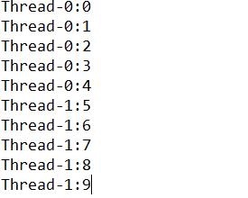
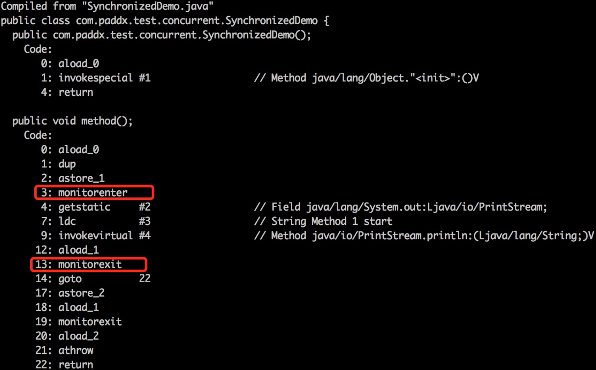
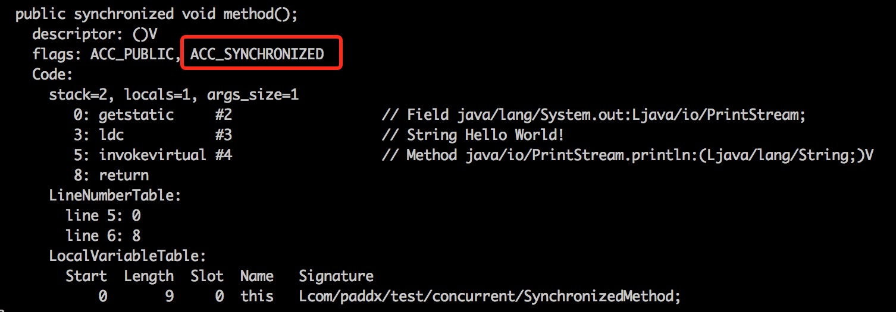

<h1 align="center">同步锁synchronized</h1>

[toc]

## synchronized三种作用

1. 原子性：确保线程互斥的访问同步代码；
2. 可见性：保证共享变量的修改能够及时可见，其实是通过Java内存模型中的 “**对一个变量unlock操作之前，必须要同步到主内存中；如果对一个变量进行lock操作，则将会清空工作内存中此变量的值，在执行引擎使用此变量前，需要重新从主内存中load操作或assign操作初始化变量值**” 来保证的；
3. 有序性：有效解决重排序问题，即 “一个unlock操作先行发生(happen-before)于后面对同一个锁的lock操作”；

## synchronized三种用法

synchronized是Java中的关键字，是一种同步锁。它修饰的对象有以下几种： 

1. 修饰一个**代码块**，被修饰的代码块称为同步语句块，其作用的范围是大括号{}括起来的代码，作用的对象是调用这个代码块的对象； 
2. 修饰一个**方法**，被修饰的方法称为同步方法，其作用的范围是整个方法，作用的对象是调用这个方法的对象； 
3. 修饰一个**静态的方法**，其作用的范围是整个静态方法，作用的对象是这个类的所有对象；
4. 修饰一个**类**，其作用的范围是synchronized后面括号括起来的部分，作用的对象是这个类的所有对象。

## synchronized优化后的锁机制

自旋锁：线程自旋说白了就是让cpu在做无用功，比如：可以执行几次for循环，可以执行几条空的汇编指令，目的是占着CPU不放，等待获取锁的机会。如果旋的时间过长会影响整体性能，时间过短又达不到延迟阻塞的目的。

偏向锁：偏向锁就是一旦线程第一次获得了监视对象，之后让监视对象“偏向”这个线程，之后的多次调用则可以避免CAS操作，说白了就是置个变量，如果发现为true则无需再走各种加锁/解锁流程。

轻量级锁：轻量级锁是由偏向锁升级来的，偏向锁运行在一个线程进入同步块的情况下，当第二个线程加入锁竞争用的时候，偏向锁就会升级为轻量级锁；

重量级锁：重量锁在JVM中又叫对象监视器（Monitor），它很像C中的Mutex，除了具备Mutex(0|1)互斥的功能，它还负责实现了Semaphore(信号量)的功能，也就是说它至少包含一个竞争锁的队列，和一个信号阻塞队列（wait队列），前者负责做互斥，后一个用于做线程同步。

## synchronized用法实例

* **修饰方法**：Synchronized修饰一个方法很简单，就是在方法的前面加synchronized，synchronized修饰方法和修饰一个代码块类似，只是作用范围不一样，修饰代码块是大括号括起来的范围，而修饰方法范围是整个函数。

方法一：
```java
    public synchronized void method()
    {
       // todo
    }
```

方法二：
```java
    public void method()
    {
       synchronized(this) {
          // todo
       }
    }
```

写法一修饰的是一个方法，写法二修饰的是一个代码块，但写法一与写法二是等价的，都是锁定了整个方法时的内容。

**synchronized关键字不能继承。 **

虽然可以使用synchronized来定义方法，但synchronized并不属于方法定义的一部分，因此，synchronized关键字不能被继承。如果在父类中的某个方法使用了synchronized关键字，而在子类中覆盖了这个方法，在子类中的这个方法默认情况下并不是同步的，而必须显式地在子类的这个方法中加上synchronized关键字才可以。当然，还可以在子类方法中调用父类中相应的方法，这样虽然子类中的方法不是同步的，但子类调用了父类的同步方法，因此，子类的方法也就相当于同步了。这两种方式的例子代码如下： 

在子类方法中加上synchronized关键字

```java
    class Parent {
       public synchronized void method() { }
    }
    class Child extends Parent {
       public synchronized void method() { }
    }
```

在子类方法中调用父类的同步方法
```java
    class Parent {
       public synchronized void method() {   }
    }
    class Child extends Parent {
       public void method() { super.method();   }
    } 
```

在定义接口方法时不能使用synchronized关键字。

构造方法不能使用synchronized关键字，但可以使用synchronized代码块来进行同步。 

* **修饰一个代码块**

1）一个线程访问一个对象中的synchronized(this)同步代码块时，其他试图访问该对象的线程将被阻塞

注意下面两个程序的区别

```java
    class SyncThread implements Runnable {
    	   private static int count;
     
    	   public SyncThread() {
    	      count = 0;
    	   }
     
    	   public  void run() {
    	      synchronized(this) {
    	         for (int i = 0; i < 5; i++) {
    	            try {
    	               System.out.println(Thread.currentThread().getName() + ":" + (count++));
    	               Thread.sleep(100);
    	            } catch (InterruptedException e) {
    	               e.printStackTrace();
    	            }
    	         }
    	      }
    	   }
     
    	   public int getCount() {
    	      return count;
    	   }
    }
     
    public class Demo00 {
    	public static void main(String args[]){
    //test01
    //		SyncThread s1 = new SyncThread();
    //		SyncThread s2 = new SyncThread();
    //		Thread t1 = new Thread(s1);
    //		Thread t2 = new Thread(s2);
            
    //test02		
    		SyncThread s = new SyncThread();
    		Thread t1 = new Thread(s);
    		Thread t2 = new Thread(s);
    		
    		t1.start();
    		t2.start();
    	}
    }
```

test01的运行结果


test02的运行结果




当两个并发线程(thread1和thread2)访问同一个对象(syncThread)中的synchronized代码块时，在同一时刻只能有一个线程得到执行，另一个线程受阻塞，必须等待当前线程执行完这个代码块以后才能执行该代码块。Thread1 和thread2 是互斥的，因为在执行synchronized代码块时会锁定当前的对象，只有执行完该代码块才能释放该对象锁，下一个线程才能执行并锁定该对象

为什么上面的例子中thread1和thread2同时在执行。这是因为synchronized只锁定对象，每个对象只有一个锁（lock）与之相关联。

2）当一个线程访问对象的一个synchronized(this)同步代码块时，另一个线程仍然可以访问该对象中的非synchronized(this)同步代码块。 

例：

```java
    class Counter implements Runnable{
       private int count;
     
       public Counter() {
          count = 0;
       }
     
       public void countAdd() {
          synchronized(this) {
             for (int i = 0; i < 5; i ++) {
                try {
                   System.out.println(Thread.currentThread().getName() + ":" + (count++));
                   Thread.sleep(100);
                } catch (InterruptedException e) {
                   e.printStackTrace();
                }
             }
          }
       }
     
       //非synchronized代码块，未对count进行读写操作，所以可以不用synchronized
       public void printCount() {
          for (int i = 0; i < 5; i ++) {
             try {
                System.out.println(Thread.currentThread().getName() + " count:" + count);
                Thread.sleep(100);
             } catch (InterruptedException e) {
                e.printStackTrace();
             }
          }
       }
     
       public void run() {
          String threadName = Thread.currentThread().getName();
          if (threadName.equals("A")) {
             countAdd();
          } else if (threadName.equals("B")) {
             printCount();
          }
       }
    }
     
    public class Demo00{
    	public static void main(String args[]){
    		Counter counter = new Counter();
    		Thread thread1 = new Thread(counter, "A");
    		Thread thread2 = new Thread(counter, "B");
    		thread1.start();
    		thread2.start();
    	}
    }
```


可以看见B线程的调用是非synchronized,并不影响A线程对synchronized部分的调用。从上面的结果中可以看出一个线程访问一个对象的synchronized代码块时，别的线程可以访问该对象的非synchronized代码块而不受阻塞。

3）指定要给某个对象加锁

```java
    
    /**
     * 银行账户类
     */
    class Account {
       String name;
       float amount;
     
       public Account(String name, float amount) {
          this.name = name;
          this.amount = amount;
       }
       //存钱
       public  void deposit(float amt) {
          amount += amt;
          try {
             Thread.sleep(100);
          } catch (InterruptedException e) {
             e.printStackTrace();
          }
       }
       //取钱
       public  void withdraw(float amt) {
          amount -= amt;
          try {
             Thread.sleep(100);
          } catch (InterruptedException e) {
             e.printStackTrace();
          }
       }
     
       public float getBalance() {
          return amount;
       }
    }
     
    /**
     * 账户操作类
     */
    class AccountOperator implements Runnable{
       private Account account;
       public AccountOperator(Account account) {
          this.account = account;
       }
     
       public void run() {
          synchronized (account) {
             account.deposit(500);
             account.withdraw(500);
             System.out.println(Thread.currentThread().getName() + ":" + account.getBalance());
          }
       }
    }
     
    public class Demo00{
    	
    	//public static final Object signal = new Object(); // 线程间通信变量
    	//将account改为Demo00.signal也能实现线程同步
    	public static void main(String args[]){
    		Account account = new Account("zhang san", 10000.0f);
    		AccountOperator accountOperator = new AccountOperator(account);
     
    		final int THREAD_NUM = 5;
    		Thread threads[] = new Thread[THREAD_NUM];
    		for (int i = 0; i < THREAD_NUM; i ++) {
    		   threads[i] = new Thread(accountOperator, "Thread" + i);
    		   threads[i].start();
    		}
    	}
    }
```

运行结果


在AccountOperator 类中的run方法里，我们用synchronized 给account对象加了锁。这时，当一个线程访问account对象时，其他试图访问account对象的线程将会阻塞，直到该线程访问account对象结束。也就是说谁拿到那个锁谁就可以运行它所控制的那段代码。 

当有一个明确的对象作为锁时，就可以用类似下面这样的方式写程序。

```java
    public void method3(SomeObject obj)
    {
       //obj 锁定的对象
       synchronized(obj)
       {
          // todo
       }
    }
```

当没有明确的对象作为锁，只是想让一段代码同步时，可以创建一个特殊的对象来充当锁：
```java
    class Test implements Runnable
    {
       private byte[] lock = new byte[0];  // 特殊的instance变量
       public void method()
       {
          synchronized(lock) {
             // todo 同步代码块
          }
       }
     
       public void run() {
     
       }
    }
```

本例中去掉注释中的signal可以看到同样的运行结果
    
* **修饰一个静态的方法**
Synchronized也可修饰一个静态方法，用法如下：

```java
    public synchronized static void method() {
       // todo
    }
```

静态方法是属于类的而不属于对象的。同样的，synchronized修饰的静态方法锁定的是这个类的所有对象。
```java
    /**
     * 同步线程
     */
    class SyncThread implements Runnable {
       private static int count;
     
       public SyncThread() {
          count = 0;
       }
     
       public synchronized static void method() {
          for (int i = 0; i < 5; i ++) {
             try {
                System.out.println(Thread.currentThread().getName() + ":" + (count++));
                Thread.sleep(100);
             } catch (InterruptedException e) {
                e.printStackTrace();
             }
          }
       }
     
       public synchronized void run() {
          method();
       }
    }
     
    public class Demo00{
    	
    	public static void main(String args[]){
    		SyncThread syncThread1 = new SyncThread();
    		SyncThread syncThread2 = new SyncThread();
    		Thread thread1 = new Thread(syncThread1, "SyncThread1");
    		Thread thread2 = new Thread(syncThread2, "SyncThread2");
    		thread1.start();
    		thread2.start();
    	}
    }
```


syncThread1和syncThread2是SyncThread的两个对象，但在thread1和thread2并发执行时却保持了线程同步。这是因为run中调用了静态方法method，而静态方法是属于类的，所以syncThread1和syncThread2相当于用了同一把锁。 


* **修饰一个类**
Synchronized还可作用于一个类，用法如下：

```java
    class ClassName {
       public void method() {
          synchronized(ClassName.class) {
             // todo
          }
       }
    }
```

```java
/**
 * 同步线程
 */
class SyncThread implements Runnable {
   private static int count;
 
   public SyncThread() {
      count = 0;
   }
 
   public static void method() {
      synchronized(SyncThread.class) {
         for (int i = 0; i < 5; i ++) {
            try {
               System.out.println(Thread.currentThread().getName() + ":" + (count++));
               Thread.sleep(100);
            } catch (InterruptedException e) {
               e.printStackTrace();
            }
         }
      }
   }
 
   public synchronized void run() {
      method();
   }
}
```
本例的的给class加锁和上例的给静态方法加锁是一样的，所有对象公用一把锁

* 总结

    A. 无论synchronized关键字加在方法上还是对象上，如果它作用的对象是非静态的，则它取得的锁是对象；如果synchronized作用的对象是一个静态方法或一个类，则它取得的锁是对类，该类所有的对象同一把锁。 
    
    B. 每个对象只有一个锁（lock）与之相关联，谁拿到这个锁谁就可以运行它所控制的那段代码。 
    
    C. 实现同步是要很大的系统开销作为代价的，甚至可能造成死锁，所以尽量避免无谓的同步控制。

## 同步原理

数据同步需要依赖锁，那锁的同步又依赖谁？**synchronized给出的答案是在软件层面依赖JVM，而j.u.c.Lock给出的答案是在硬件层面依赖特殊的CPU指令。**

当一个线程访问同步代码块时，首先是需要得到锁才能执行同步代码，当退出或者抛出异常时必须要释放锁，那么它是如何来实现这个机制的呢？我们先看一段简单的代码：

```java
package com.paddx.test.concurrent;
public class SynchronizedDemo {
    public void method() {
        synchronized (this) {
            System.out.println("Method 1 start");
        }
    }
}
```

查看反编译后结果： 



反编译结果

1. **monitorenter**：每个对象都是一个监视器锁（monitor）。当monitor被占用时就会处于锁定状态，线程执行monitorenter指令时尝试获取monitor的所有权，过程如下：

   > 1. 如果monitor的进入数为0，则该线程进入monitor，然后将进入数设置为1，该线程即为monitor的所有者；
   > 2. 如果线程已经占有该monitor，只是重新进入，则进入monitor的进入数加1；
   > 3. 如果其他线程已经占用了monitor，则该线程进入阻塞状态，直到monitor的进入数为0，再重新尝试获取monitor的所有权；

2. monitorexit：执行monitorexit的线程必须是objectref所对应的monitor的所有者。指令执行时，monitor的进入数减1，如果减1后进入数为0，那线程退出monitor，不再是这个monitor的所有者。其他被这个monitor阻塞的线程可以尝试去获取这个 monitor 的所有权。

   > monitorexit指令出现了两次，第1次为同步正常退出释放锁；第2次为发生异步退出释放锁；

通过上面两段描述，我们应该能很清楚的看出Synchronized的实现原理，**Synchronized的语义底层是通过一个monitor的对象来完成，其实wait/notify等方法也依赖于monitor对象，这就是为什么只有在同步的块或者方法中才能调用wait/notify等方法，否则会抛出java.lang.IllegalMonitorStateException的异常的原因。**

再来看一下同步方法：

```java
package com.paddx.test.concurrent;

public class SynchronizedMethod {
    public synchronized void method() {
        System.out.println("Hello World!");
    }
}
```

查看反编译后结果： 



反编译结果 

从编译的结果来看，方法的同步并没有通过指令 `monitorenter` 和 `monitorexit` 来完成（理论上其实也可以通过这两条指令来实现），不过相对于普通方法，其常量池中多了 `ACC_SYNCHRONIZED` 标示符。JVM就是根据该标示符来实现方法的同步的：

> 当方法调用时，调用指令将会检查方法的 ACC_SYNCHRONIZED 访问标志是否被设置，如果设置了，执行线程将先获取monitor，获取成功之后才能执行方法体，方法执行完后再释放monitor。**在方法执行期间，其他任何线程都无法再获得同一个monitor对象。**

两种同步方式本质上没有区别，只是方法的同步是一种隐式的方式来实现，无需通过字节码来完成。两个指令的执行是JVM通过调用操作系统的互斥原语mutex来实现，被阻塞的线程会被挂起、等待重新调度，会导致“用户态和内核态”两个态之间来回切换，对性能有较大影响。


## Object.wait() / Object.notify() Object.notifyAll()

任意一个Java对象，都拥有一组监视器方法（定义在java.lang.Object上），主要包括：**wait()**、

**wait(long timeout)、notify()**以及**notifyAll()**方法，这些方法与synchronized同步关键字配合，可以

实现等待/通知模式

1. 使用的前置条件
   当我们想要使用Object的监视器方法时，需要或者该Object的锁，代码如下所示
   
   ```java
   synchronized(obj){ 
       .... 					//1 
       obj.wait();				//2 
       obj.wait(long millis);	//2 
       ....					//3 
   }
   ```
   
   一个线程获得obj的锁,做了一些时候事情之后，发现需要等待某些条件的发生，调用obj.wait()，该线程会释放obj的锁，并阻塞在上述的代码2处
   **obj.wait()** 和 **obj.wait(long millis)** 的区别在于：
   
   * **obj.wait()是无限等待，直到obj.notify()或者obj.notifyAll()调用并唤醒该线程，该线程获取锁之后继续执行代码3**
   * **obj.wait(long millis)是超时等待，我只等待long millis 后，该线程会自己醒来，醒来之后去获取锁，获取锁之后继续执行代码3**
   * **obj.notify()是叫醒任意一个等待在该对象上的线程，该线程获取锁，线程状态从BLOCKED进入RUNNABLE**
   * **obj.notifyAll()是叫醒所有等待在该对象上的线程，这些线程会去竞争锁，得到锁的线程状态从BLOCKED进入RUNNABLE，其他线程依然是BLOCKED,得到锁的线程执行代码3完毕后释放锁，其他线程继续竞争锁，如此反复直到所有线程执行完毕。**
   
   ```java
   synchronized(obj){
       ... 
       obj.notify();
       obj.notifyAll();
       ...
   }
   ```
   
   一个线程获得obj的锁,做了一些时候事情之后，某些条件已经满足，调用obj.notify()或者obj.notifyAll()，该线程会释放obj的锁，并叫醒在obj上等待的线程，
   obj.notify()和obj.notifyAll()的区别在于：
   
   * **obj.notify()叫醒在obj上等待的任意一个线程（由JVM决定)**
   * **obj.notifyAll()叫醒在obj上等待的全部线程**
   
2. 使用范式
   
   ```java
   synchronized(obj){ 
       // 判断条件，这里使用 while ，而不使用 if 
       while(obj满足/不满足 某个条件){ 
           obj.wait() 
       }
   }
   ```
   
   放在while里面，是防止处于WAITING状态下线程监测的对象被别的原因调用了唤醒（notify或者notifyAll）方法，但是while里面的条件并没有满足（也可能当时满足了，但是由于别的线程操作后，又不满足了），就需要再次调用wait将其挂起

## 参考

* http://blog.csdn.net/javazejian/article/details/72828483

* https://blog.csdn.net/luoweifu/article/details/46613015

* https://blog.csdn.net/sinat_32588261/article/details/72880159

* [深入分析Synchronized原理(阿里面试题)](https://www.cnblogs.com/aspirant/p/11470858.html)

