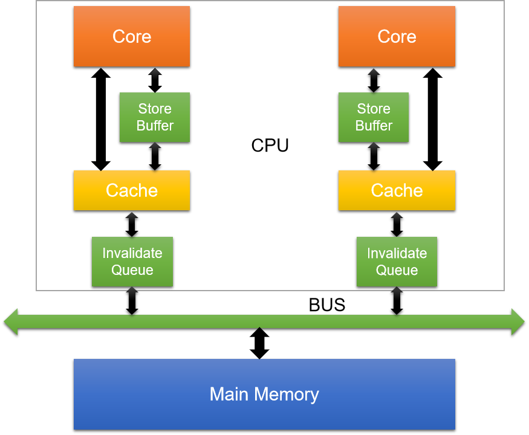

<h1 align="center">volatile关键字？MESI协议？指令重排？内存屏障？这都是啥玩意</h1>

[TOC]

## 一、摘要

三级缓存，MESI缓存一致性协议，指令重排，内存屏障，JMM，volatile。单拿一个出来，想必大家对这些概念应该有一定了解。但是这些东西有什么必然的联系，或者他们之间究竟有什么前世今生想必是困扰大家的一个问题。
为什么有了MESI协议，我们还需要volatile？
内存屏障的由来？
指令重排带来的问题？
下面我们通过分析每一个技术的由来，以及带来的负面影响，跟大家探讨一下这些技术之间的联系。具体每个关键词相关文章也很多不再赘述，只谈个人理解。

## 二、三级缓存篇

### 1，三级缓存的由来

CPU的发展很快，几乎18-24个月，CPU的计算能力就能翻一番，然而内存的发展却相对缓慢，以至于内存的读写速度远远跟不上CPU的计算能力，也就是说，在CPU和内存的资源交换中，CPU常常需要等待内存，而浪费了大量的计算能力。三级缓存的出现正是为了弥补内存的慢和CPU的快而诞生的产物。
CPU将不再直接与内存进行数据的交换而是在二者之间加入一个缓存以解决这种不协调而导致的资源浪费情况。当然了缓存一定是比内存的读写速度更快的，不然也没有这个必要了。那是不是我们直接用缓存就不用内存了，呵呵，钱钱钱。
所谓的三级缓存正是诞生在这样的一个背景下。
三级缓存分为三种：L1 Cache，L2 Cache，L3 Cache


内存以及三级缓存的响应时间如上所示，由此可知内存和缓存的差距还是很大的，当时硬件价格和上图响应时间是成正比的。响应时间越快，价格越贵。

### 2，CPU缓存架构

不同的CPU厂商的架构也有些不同，在这里只介绍流行的缓存架构


  

缓存的意义

1 时间局限性：如果某个数据被访问，那么它在不久的将来有可能被在次访问

2 空间局限性：如果某个缓存行的数据被访问，那么与之相邻的缓存行很快可能被访问到


### 3，缓存带来的问题

缓存的加入是为了解决CPU运算能力和内存读写能力的不匹配问题，简单来说就是为了提升资源利用率。那么在多CPU（一个CPU对应一个或者多个核心）或者多核心下，每个核心都会有一个一级缓存或者二级缓存，也就是说一二级缓存是核心独占的（类似JMM模型，线程的工作内存是线程独占的，主内存是共享的）而三级缓存和主内存是共享的，这样就将导致CPU缓存一致性问题。为了解决这种不一致，大名鼎鼎的MESI协议随之而来。

## 三、MESI缓存一致性协议篇

### 1，MESI协议

MESI协议的由来上个章节已经介绍，在此不做过多介绍

```
MESI：Modified（修改），Exclusive（独占），Shared（共享），Invalid（无效）由以上数据的四种状态的首字母而来。
```

在缓存中数据的存储单元是缓存行（Cache line），主流的CPU缓存行都是64个字节。缓存行的四种状态由两个字节标识。

| M(Modified)  | 这行数据有效，数据被修改了，和内存中的数据不一致，数据只存在于本Cache中。 |
| ------------ | ------------------------------------------------------------ |
| E(Exclusive) | 这行数据有效，数据和内存中的数据一致，数据只存在于本 Cache 中。 |
| S(Shared)    | 这行数据有效，数据和内存中的数据一致，数据存在于很多 Cache 中。 |
| I(Invalid)   | 这行数据无效。                                               |

 

当一个缓存行的状态调整，另外一个缓存行需要调整的状态如下：

|       | **M** | **E** | **S** | **I** |
| ----- | ----- | ----- | ----- | ----- |
| **M** | ×     | ×     | ×     | √     |
| **E** | ×     | ×     | ×     | √     |
| **S** | ×     | ×     | √     | √     |
| **I** | √     | √     | √     | √     |


**模拟缓存行独占（E）过程：**

核心core1发出加载数据指令，通过bus从内存中加载了一个数据A进入到该核心的缓存行，并且发现该数据是没有被别的核心加载的，此时该核心将会将该数据A状态置为独占即E状态。
**模拟缓存行共享（S）过程：**

上面core1已经独占了数据A，此时core2也发指令要读取数据A，此时发现该数据已经被core1占有，然后通知core1“我也要使用该数据”，所以core1将数据A状态改为S即 E >>> S。
**模拟缓存行修改（M）过程：**

假如有三个核心：core 1，core 2分别缓存了数据A。因为多个核心都缓存了该数据，即在各个核心中该数据的状态都是Shared。

此时core 1需要修改数据A。

core 1：内核计算完成，通过指令写入缓存行，数据A的状态将从S >>> M

core 2：core1将通知缓存了该数据的核心“我修改了该数据”，所以core2会将该缓存置为无效。因为数据已经发生了变化，core2缓存的数据A将不再有任何意义。

埋个伏笔，以上过程提到的“通知”的过程可能是很耗时的，在此期间core1将会处于等待回应。浪费了core1的计算能力。

### 2，MESI协议带来的问题

多个core的缓存状态置换是需要消耗时间的，导致内核在此期间将无事可做。甚至一旦某一个内核发生阻塞，将会导致其他内核也处于阻塞，从而带来性能和稳定性的极大消耗。
所以这时指令重排开始发挥它的价值。想想这种等待有时是没有必要的，因为在这个等待时间内内核完全可以去干一些其他事情。即当内核处于等待状态时，不等待当前指令结束接着去处理下一个指令。

## 四、处理器指令重排篇

前面介绍了指令重排将会减少处理器的等待时间进而去处理其他的指令。这种一个指令还未结束便去执行其它指令的行为称之为，指令重排。大白话就是指令未按需执行。

### 1，指令重排的实现


****

 

**Store Buffere---存储缓存**

store buffer即存储缓存。位于内核和缓存之间。当处理器需要处理将计算结果写入在缓存中处于shared状态的数据时，需要通知其他内核将该缓存置为 Invalid（无效），引入store buffer后将不再需要处理器去等待其他内核的响应结果，只需要把修改的数据写到store buffer，通知其他内核，然后当前内核即可去执行其它指令。当收到其他内核的响应结果后，再把store buffer中的数据写回缓存，并修改状态为M。（很类似分布式中，数据一致性保障的异步确认）

**Invalidate Queue---失效队列**

简单说处理器修改数据时，需要通知其它内核将该缓存中的数据置为Invalid（失效），我们将该数据放到了Store Buffere处理。那收到失效指令的这些内核会立即处理这种失效消息吗？答案是不会的，因为就算是一个内核缓存了该数据并不意味着马上要用，这些内核会将失效通知放到Invalidate Queue，然后快速返回Invalidate Acknowledge消息（意思就是尽量不耽误正在用这个数据的内核正常工作）。后续收到失效通知的内核将会从该queue中逐个处理该命令。（意思就是我也不着急用，所以我也不着急处理）。

### 2，指令重排带来的问题---可见性问题

指令重排或者说store buffer或者invalidte queue带来的问题就是可见性问题，通过以上分析，我们不难发现这其实是保障了数据的最终一致性。因为在处理器对数据的修改不是立即对其他内核可见的，因为修改了的数据被放在了store buffer中，通知其他内核的数据修改也不是达到其他内核并被立即处理的。其实有点异步处理的意思。
数据不一致性问题
假设core1对数据A的修改通知没有被core2立即处理（因为在invalidte queue中），core2紧接着又修改了数据A，是不是就造成了数据的不一致。其它内核对数据的修改对本内核是不可见的。
为了提升性能进入了指令重排，而然指令重排可能会导致数据的不一致，这可如何是好？哈哈哈，当然是有解决方案的，答案就是内存屏障。更多精彩内容且听下回分解。

## 五、内存屏障

### 1，内存屏障

上一章节中说到指令重排导致的可见性问题可能会导致数据的不一致。CPU就给我们提供了一直通过软件告知CPU什么指令不能重排，什么指令能重排的机制就是内存屏障。
两个指令：

```
load：将内存中的数据拷贝到内核的缓存中。
store：将内核缓存的数据刷新到内存中。
```

内存屏障：Memory Barrier。
内存屏障又分为四种：

```
LoadLoad Barriers（读屏障），StoreStore Barriers（写屏障），LoadStore Barriers，StoreLoad Barriers
```

不同的CPU架构对内存屏障的实现是不尽相同的，我们这里讨论流行的X86架构。
X86中有三种内存屏障：
**Store Memory Barrier：**写屏障，等同于前文的StoreStore Barriers
告诉处理器在执行这之后的指令之前，执行所有已经在存储缓存（store buffer）中的修改（M）指令。即：所有store barrier之前的修改（M）指令都是对之后的指令可见。
**Load Memory Barrier：**读屏障，等同于前文的LoadLoad Barriers
告诉处理器在执行任何的加载前，执行所有已经在失效队列（Invalidte Queues）中的失效（I）指令。即：所有load barrier之前的store指令对之后（本核心和其他核心）的指令都是可见的。
**Full Barrier：**万能屏障，即Full barrier作用等同于以上二者之和。
即所有store barrier之前的store指令对之后的指令都是可见的，之后（本核心和其他核心）的指令也都是可见的，完全保证了数据的强一致性。


### 2，内存屏障的问题

CPU知道什么时候需要加入内存屏障，什么时候不需要吗？CPU将这个加入内存屏障的时机交给了程序员。在java中这个加入内存屏障的命令就是volatile关键字。
澄清一点，volatile并不是仅仅加入内存屏障这么简单，加入内存屏障只是volatile内核指令级别的内存语义。
除此之外：volatile还可以禁止编译器的指令重排，因为JVM为了优化性能并且不违反happens-before原则的前提下也会进行指令重排。

## 六、Volatile对可见性和有序性的保障

并发下的三个概念：

```
原子性(Atomicity)：一个操作是不可中断的，要么全部执行成功要么全部执行失败。
可见性（Visibility）：所有线程都能看到共享内存的最新状态。
有序性（Ordering）：即程序执行的顺序按照代码的先后顺序执行。
```

Volatile是JMM（Java Memory Model：java内存模型）中对可见性和有序性的保障。
\Volatile内存语义：

```
可见性：可见性是指当多个线程访问同一个变量时，一个线程修改了这个变量的值，其他线程能够立即看得到修改的值。
有序性：对一个volatile域的写，happens-before于任意后续对这个volatile域的读。其实就是禁止指令重排。
```

说了这么多终于说到了Volatile的有序性，**Volatile正是通过对处理器加入内存屏障来禁止指令重排从来保证有序性的**。大白话来说Volatile就是程序员决定加入内存屏障的指令。
当然在java语言中，指令重排并不是只发生在处理器层面。在java编译器中JVM也会存在指令重排优化，以提高程序的性能。Volatile同样可以禁止编译器层面的指令重排。
下面这段话摘自《深入理解Java虚拟机》：
　　“观察加入volatile关键字和没有加入volatile关键字时所生成的汇编代码发现，加入volatile关键字时，会多出一个lock前缀指令”
　　lock前缀指令实际上相当于前文介绍的插入内存屏障指令。（这个lock指令是JMM中的，再往底层就是加入内存屏障指令）
关于JMM，happens-before原则及volatile的其它内容后面打算再写一篇介绍。

## 七、总结

1. **CPU与三级缓存：**为了解决CPU按照摩尔定律提升的计算能力和内存缓慢发展的不平衡，三级缓存以其比内存更加强悍的读写能力，在CPU和内存中间充当了一层缓存，缓解了这种发展不平衡带来的矛盾。
2. **三级缓存与MESI协议：**CPU内核（流行的架构例如X86）有各自的一级缓存或者二级缓存，而三级缓存和主内存是多核共享，内核之间的数据共享和数据独占将导致缓存一致性问题（一句话就是数据共享导致的数据一致性问题），从而有了MESI CPU缓存一致性协议来保证数据的一致性问题。
3. **MESI协议与强一致性：**MESI协议本质上是多核操作共享数据的串行化强一致性保障，这种串行将导致CPU的资源浪费。
4. **指令重排优化与最终一致性：**在多核间Invalidate消息的同步响应浪费了CPU一定的计算资源，从而有了指令重排。在内核处理器中对数据的修改不直接写到缓存中，而是先放入store buffer，然后向其他核心发送Invalidate消息的期间，本内核可以继续执行其他指令。而收到Invalidate消息的内核将Invalidate消息放到Invalidate Queue中延时处理。当本内核收到其他内核关于Invalidate的invalidate acknowledge响应才会将store buffer中的对应指令刷新到缓存中。这样store buffer和Invalidate Queue实现的指令重排就通过异步确认和延时消费（这是分布式的概念，但是我觉在用在这里很合理）保证了数据的最终一致性。
5. **内存屏障与强一致性**：如上所说指令重排是采用的是异步确认和延时消费保障了数据的最终一致性，但是在有些场景下这种机制也将导致数据的不一致，所以在一些特殊场景下我们需要禁止指令重排从而保证数据的强一致性。禁止指令重排的机制就是对CPU加入内存屏障，从而禁止一些会引起错误的指令重排。
6. 在CPU角度，他是无法判断什么时候需要加入内存屏障，什么时候不需要（假如内核自己去判断，相信这个判断将会比保障强一致性更浪费资源，那指令重排就画蛇添足了），所以这个加入内存屏障的活就抛给了上层应用也就是软件层。在Java语言中，如果完全将加入内存屏障的活交给程序员，相信Java程序员会非常痛苦。所以JMM的一些规定比如happens-before和一些可见性和有序性的规则，将会减少程序员的压力，因为在一些JVM可预测的场景中，JMM规范会自动实现这种内存屏障。而程序员需要关心的就是在一些高并发场景下我们可以使用Volatile关键字去告诉JVM和CPU我要加入内存屏障。当然这不是Volatile存在的所有意义。

最后想说一句，想彻底理解Volatile不了解以上那些知识是不够的。


## 参考

[volatile关键字？MESI协议？指令重排？内存屏障？这都是啥玩意](https://www.cnblogs.com/hello-shf/p/12091591.html)