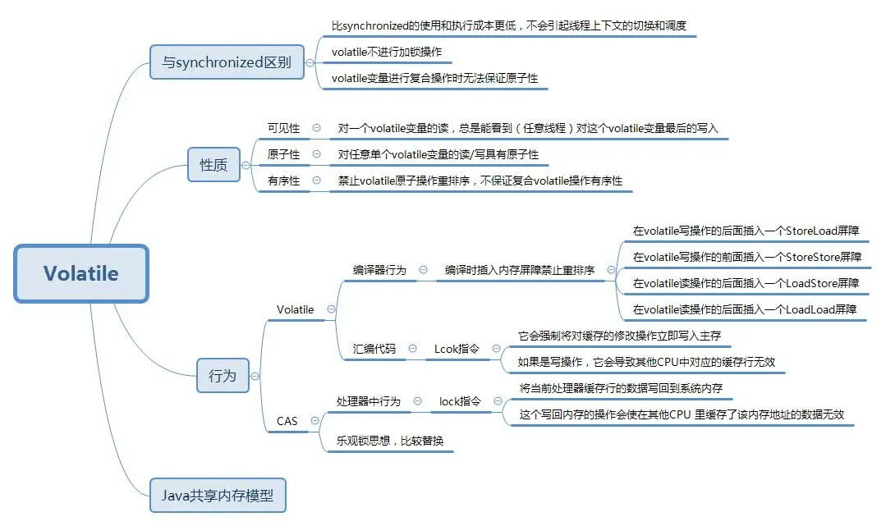
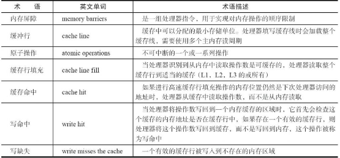
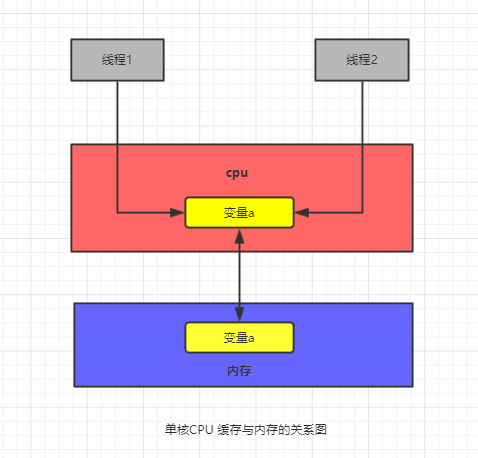
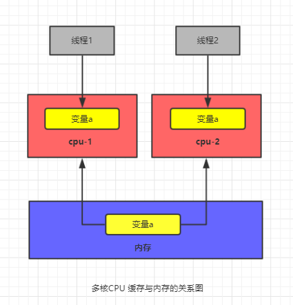
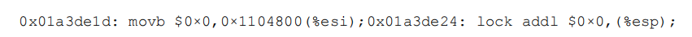
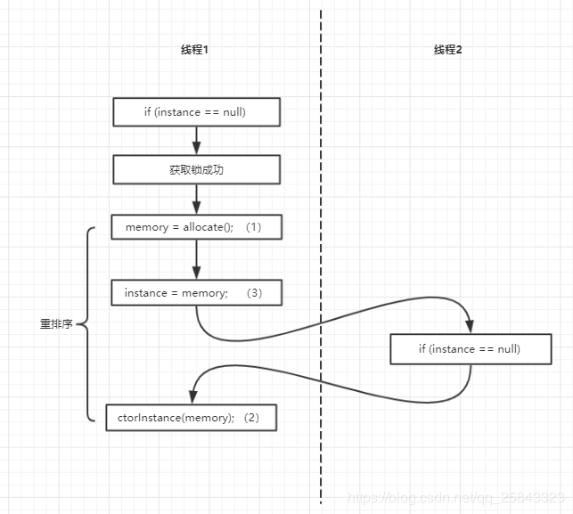
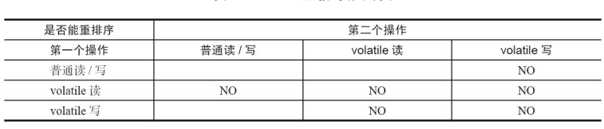
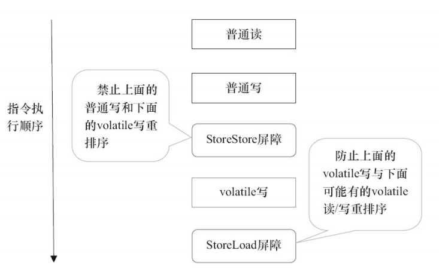
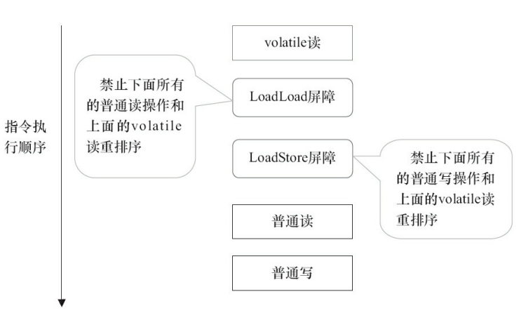
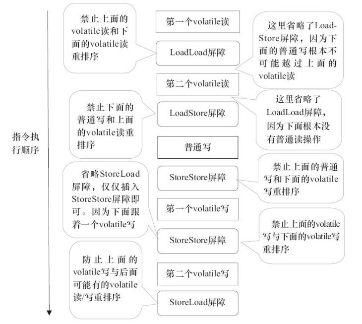

<h1 align="center">万字长文——java内存模型之volatile深入解读</h1>

[toc]

在阅读本文前,请思考以下的面试题？

- volatile是什么?
- volatile的特性
- volatile是如何保证可见性的？
- volatile是如何保证有序性的？
- volatile可以保证原子性吗？
- 使用volatile变量的条件是什么？
- volatile和synchronized的区别
- volatile和atomic原子类的区别是什么？

这一章主要是讲解volatile的原理，在开始本文前，我们来看一张volatile的思维导图，先有个直观的认识。




## 什么是volatile

目前的操作系统大多数都是多CPU,当多线程对一个共享变量进行操作时，会出现数据一致性问题

Java编程语言允许线程访问共享变量，那么为了确保共享变量能被准确和一致的更新，线程应该确保通过排他锁单独获得这个变量，或者把这个变量声明成volatile，可以理解volatile是轻量级的synchronized。

使用volatile可以在Java线程内存模型确保所有线程看到这个变量的值是一致的，在多个处理器中保证了共享变量的“可见性”。

## volatile两核心两性质

两大核心：JMM内存模型（主内存和工作内存）以及happens-before

两条性质：可见性，有序性（禁止指令重排）

## volatile性质

1. 保证了不同线程对这个变量进行操作时的可见性，即一个线程修改了某个变量的值，这新值对其他线程来说是立即可见的。（实现可见性）
2. 禁止进行指令重排序。（实现有序性）
3. 只能保证对单次读/写的原子性。i++ 这种操作不能保证原子性。（不能实现原子性）
4. volatile不会引起上下文的切换和调度

> 总结：volatile保证了可见性和有序性，同时可以保证单次读/写的原子性

## 相关的Cpu术语说明





什么是可见性？

在单核cpu的石器时代，我们所有的线程都是在一颗CPU上执行，CPU缓存与内存的数据一致性容易解决。因为所有线程都是操作同一个CPU的缓存，一个线程对缓存的写，对另外一个线程来说一定是可见的。

例如在下面的图中，线程A和线程B都是操作同一个CPU里面的缓存，所以线程A更新了变量a的值，那么线程B之后再访问变量 a，得到的一定是 a 的最新值（线程 A 写过的值）。




在多核CPU的时代，每颗 CPU 都有自己的缓存，这时 CPU 缓存与内存的数据一致性就没那么容易解决了，当多个线程在不同的CPU上执行时，这些线程操作的是不同的CPU缓存。比如下图中，线程A操作的是CPU-1上的缓存，而线程B操作的是CPU-2上的缓存，很明显，这个时候线程A对变量a的操作对于线程B而言就不具备可见性了。这个就属于硬件程序员给软件程序员挖的“坑”。

> 为了提高处理速度，处理器不直接和内存进行通信，而是先将系统内存的值读到内部缓存（L1，L2或者其他）后再进行操作，但是操作完不知道何时再写回内存。




从上面的分析，我们可以知道，**多核的CPU缓存会导致的可见性**问题。

## volatile是如何保证可见性的

```
instance = new Singleton（）;//instance是volatile变量
```

让我们来看看在处理器下通过工具获取JIT编译器生成的汇编指令来查看对volatile进行写操作的时候，cpu会做什么事？

转换成汇编代码如下：




file

有volatile修饰的共享变量进行写操作的时候会多出第二行汇编代码，也就是jvm会向处理器发送一条Lock前缀的指令，Lock前缀的指令在多核处理器下会引发两件事情：

1. 将当前处理器缓存行的数据写回到系统内存
2. 这个写回内存的操作会使在其他CPU缓存了该内存地址的数据无效，保证各个处理器的缓存是一致的 （通过一致性协议来实现的）

> 一致性协：每个处理器通过嗅探在总线上传播的数据来检查自己的缓存的值是否过期了，当处理器发现自己的缓存行对应的内存过期，在下次访问相同内存地址时，强制执行缓存填充，从系统内存中读取。

简单理解：volatile在其修饰的变量被线程修改时，会强制其他线程在下一次访问该变量时刷新缓存区。

### volatile的两条实现原则

1. Look 前缀指令会引起处理器缓存回写到内存。Lock 前缀指令导致在执行指令期间，声言处理器的LOCK＃信号。在多处理器环境中，LOCK＃信号确保在声言该信号期间，处理器可以独占任何共享内存。但是，在最近的处理器里，LOCK＃信号一般不锁总线，而是锁缓存，毕竟锁总线开销的比较大，对干intel486和Pentiuln处理器，在锁操作时，总是在总线上声言LOCK＃信号。但在P6和目前的处理器中，如果访问的内存区域已经缓存在处理器内部，则不会声言LOCK＃信号。相反，它会锁定这块内存区域的缓存并回写到内存，并使用缓存一致性机制来确保修改的原子性，此操作被称为“缓存锁定”，缓存一致性机制会阻止同时修改由两个以上处理器缓存的内存区域数据。
2. 一个处理器的缓存回写到内存会导致其他处理器的缓存无效。IA-32 处理器和 Iniel 64 处理器使用 MESI （修改、独占、共享、无效）控制协议去维护内部缓存和其他处理器缓存的一致性。在多核处理器系统中进行操作的时候， IA-32和Intel64处理器能嗅探其他处理器访问系统内存和它们的内部缓存。处理器使用嗅探技术保证它的内部缓存、系统内存和其他处理器的缓存的数据在总线上保持一致。例如，在 Pentium 和 P6famaly 处理器中，如果通过嗅探一个处理器来检测其他处理器打算写内存地址，而这个地址当前处干共享状态，那么正在嗅探的处理器将使它的缓存行无效，在下次访问相同内存地址时，强制执行缓存行填充

> 小结
>
> Lock前缀的指令会引起处理器缓存写回内存；
>
> 一个处理器的缓存回写到内存会导致其他处理器的缓存失效；
>
> 当处理器发现本地缓存失效后，就会从内存中重读该变量数据，即可以获取当前最新值。

## volatile是如何保证有序性

在解释有序性前,我们先来看看什么是指令重排？

> 导致程序有序性的原因是编译优化，指令重排序是JVM为了优化指令，提高程序运行效率，在不影响单线程程序执行结果的前提下，尽可能地提高并行度。但是在多线程环境下，有些代码的顺序改变，有可能引发逻辑上的不正确。有序性最直接的办法就是禁用缓存和编译优化，但是这样问题虽然解决了，我们的程序的性能就堪忧了，所以合理的方案是按需禁用缓存或者编译优化。

接下来我们来看一个著名的单例模式**双重检查锁**的实现

```
class Singleton {    private volatile static Singleton instance = null;    private Singleton() {    }    public static Singleton getInstance() {        if (instance == null) {                    //步骤1            synchronized (Singleton.class) {                if (instance == null)              //步骤2                    instance = new Singleton();    //步骤3            }        }        return instance;    }}
```

在以上代码中,instance不用volatile修饰时,输出的结果会是什么呢？我们的预期中代码是这样子执行的：线程A和B同时在调用getInstance()方法,线程A执行步骤1,发现instance为 null,然后同步锁住Singleton类，接着执行步骤2再次判断instance是否为null,发现仍然是null,然后执行步骤3,开始实例化Singleton。这样看好像没啥毛病,可是仔细一想,发现事情并不简单。 这时候,我们来我们先了解一下对象是怎么初始化的？

- 对象在初始化的时候分三个步骤

```
memory = allocate();   //1、分配对象的内存空间ctorInstance(memory);  //2、初始化对象instance = memory;     //3、使instance指向对象的内存空间
```

程序为了优化性能,会将2和3进行重排序,此时执行的顺序是1、3、2,在单线程中,对结果是不会有影响的,可是在多线程程序下,问题就暴露出来了。这时候我们回到刚刚的单例模式中,在实例化的过程中，线程B走到步骤1,发现instance不为空,但是有可能因为指令重排了,导致instance还没有完全初始化,程序就出问题了。为了禁止实例化过程中的重排序,我们用volatile对instance修饰。




volatile内存语义如何实现

对于一般的变量则会被重排序（重排序分析编译器重排序和处理器重排序），而对于volatile则不能，这样会影响其内存语义，所以为了实现volatile的内存语义JMM会限制重排序。

### 其重排序规则如下：




1. 如果第一个操作为volatile读，则不管第二个操作是啥，都不能重排序。这个操作确保volatile读之后的操作不会被编译器重排序到volatile读之前，其前面的所有普通写操作都已经刷新到主内存中；
2. 如果第一个操作volatile写，不管第二个操作是volatile读/写，禁止重排序。
3. 如果第二个操作为volatile写时，则不管第一个操作是啥，都不能重排序。这个操作确保volatile写之前的操作不会被编译器重排序到volatile写之后；
4. 如果第二个操作为volatile读时，不管第二个操作是volatile读/写，禁止重排序

volatile的底层实现是通过插入内存屏障，但是对于编译器来说，发现一个最优布置来最小化插入内存屏障的总数几乎是不可能的，所以，JMM采用了保守策略。如下：

> 在每一个volatile读操作后面插入一个LoadLoad屏障，用来禁止处理器把上面的volatile读与后面任意操作重排序
>
> 在每一个volatile写操作前面插入一个StoreStore屏障，用来禁止volatile写与前面任意操作重排序
>
> 在每一个volatile写操作后面插入一个StoreLoad屏障，用来禁止volatile写与后面可能有的volatile读/写操作重排序
>
> 在每一个volatile读操作前面插入一个LoadStore屏障，用来禁止volatile写与后面可能有的volatile读/写操作重排序

保守策略下，volatile的写插入屏障后生成的指令示意图：




> Storestore 屏障可以保证在volatile写之前，其前面的所有普通写操作已经对任意处理器可见了，Storestore 屏障将保障上面所有的普通写在volatile写之前刷新到主内存。

这里比较有意思的是， volatite 写后面的 StoreLoad 屏障的作用是避免volatile写与后面可能有的volatile 读／写操作重排序。

因为编译器常常无法准确判断在一个volatile写的后面是否需要插入一个StoreLoad屏障。为保证能正确实现volatile的内存语义，JMM在采取了保守策略，在每个volatile写的后面，或者在每个 volatile读的前面插入一个StoreLoad屏障。

保守策略下，volatile的读插入屏障后生成的指令示意图：




上面的内存屏障插入策略非常保守，在实际执行中，只要不改变volatile写-读的内存语义，编译器可根据情况省略不必要的屏障

举个例子：

```java
public class Test {
    int a ;
    volatile int v1 = 1;
    volatile int v2 = 2;
    public  void readWrite(){
        int i = v1;//第一个volatile读
        int j = v2;//第二个volatile读
        a = i+j://普通读
        v1 = i+1;//第一个volatile写
        v2 =j+2;//第二个volatile写
    }
    public synchronized void read(){
        if(flag){
        	System.out.println("---i = " + i);
    	}
    }
}
```

针对readWrite方法，编译器在生成字节码的时候可以做到如下的优化：




> 注意：最后一个storeLoad屏障不能省略。因为第二个volatile写之后，方法立即return，此时编译器无法精准判断后面是否会有vaolatile读或者写。

## 如何正确使用volatile变量

在某些情况下，如果读操作远远大于写操作，volatile 变量可以提供优于锁的性能优势。

可是volatile变量不是说用就能用的，它必须满足两个约束条件：

- 对变量的写操作不依赖于当前值。
- 该变量没有包含在具有其他变量的不变式中。

> 第一个条件的限制使volatile变量不能用作线程安全计数器。虽然 **i++** 看上去类似一个单独操作，实际上它是一个**读取-修改-写入**三个步骤的组合操作，必须以原子方式执行，而 volatile不能保证这种情况下的原子操作。正确的操作需要使i的值在操作期间保持不变，而volatile 变量无法做到这一点。

## volatile和synchronized区别

1. volatile比synchronized执行成本更低，因为它不会引起线程上下文的切换和调度
2. volatile本质是在告诉jvm当前变量在寄存器（工作内存）中的值是不确定的，需要从主存中读取；synchronized则是锁定当前变量，只有当前线程可以访问该变量，其他线程被阻塞住。
3. volatile只能用来修饰变量，而synchronized可以用来修饰变量、方法、和类。
4. volatile可以实现变量的可见性，禁止重排序和单次读/写的原子性；而synchronized则可以变量的可见性，禁止重排序和原子性。
5. volatile不会造成线程的阻塞；synchronized可能会造成线程的阻塞。
6. volatile标记的变量不会被编译器优化；synchronized标记的变量可以被编译器优化。

## volatile和atomic原子类区别

1. Volatile变量可以确保先行关系，即写操作会发生在后续的读操作之前
2. 但是Volatile对复合操作不能保证原子性。例如用volatile修饰i变量，那么i++操作就不是原子性的。
3. atomic原子类提供的atomic方法可以让i++这种操作具有原子性，如getAndIncrement()方法会原子性的进行增量操作把当前值加一，其它数据类型和引用变量也可以进行相似操作，但是atomic原子类一次只能操作一个共享变量，不能同时操作多个共享变量。

## 总结

总结一下volatile的特性

- volatile可见性；对一个volatile的读，总可以看到对这个变量最终的写volatile有序性；JVM底层采用“内存屏障”来实现volatile语义volatile原子性；volatile对单个读/写具有原子性（32位Long、Double），但是复合操作除外，例如i++

## 来源

* [万字长文——java内存模型之volatile深入解读 (toutiao.com)](https://www.toutiao.com/a6823554989319782924/?tt_from=weixin&utm_campaign=client_share&wxshare_count=1&timestamp=1619658852&app=news_article_social&utm_source=weixin&utm_medium=toutiao_ios&use_new_style=1&req_id=202104290914120102120651581120A65F&group_id=6823554989319782924)

