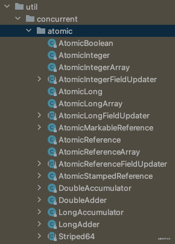
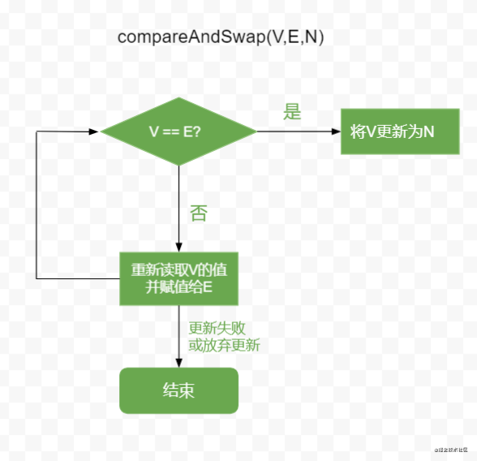
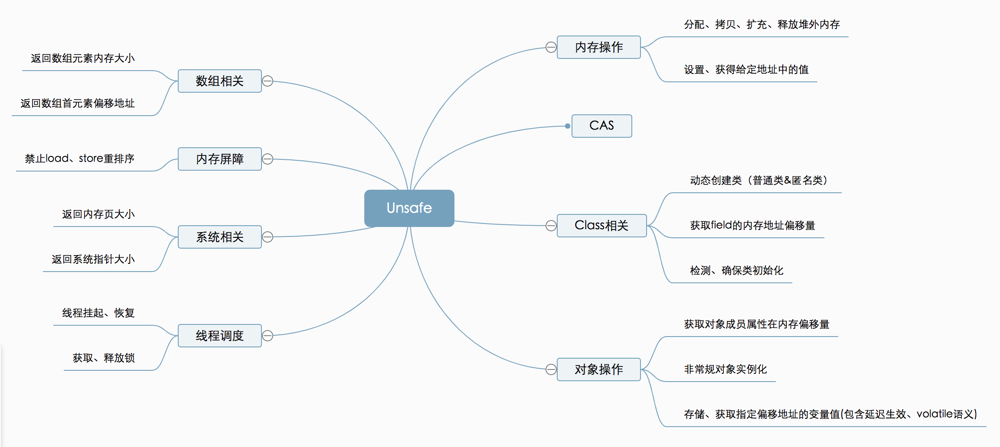

<h1 align="center">这一次，彻底搞懂Java并发包中的Atomic原子类</h1>

[toc]

多线程并发是Java语言中非常重要的一块内容，同时，也是Java基础的一个难点。说它重要是因为多线程是日常开发中频繁用到的知识，说它难是因为多线程并发涉及到的知识点非常之多，想要完全掌握Java的并发相关知识并非易事。也正因此，Java并发成了Java面试中最高频的知识点之一。本系列文章将从Java内存模型、volatile关键字、synchronized关键字、ReetrantLock、Atomic并发类以及线程池等方面来系统的认识Java的并发知识。通过本系列文章的学习你将深入理解volatile关键字的作用，了解到synchronized实现原理、AQS和CLH队列锁，清晰的认识自旋锁、偏向锁、乐观锁、悲观锁…等等一系列让人眼花缭乱的并发知识。

本文是Java并发系列的第三篇文章，将详细的讲解Java中的Atomic并发类与CAS。

[这一次，彻底搞懂Java内存模型与volatile关键字](https://zhpanvip.gitee.io/2021/05/30/37-jmm-volatile/)

[这一次，彻底搞懂Java中的synchronized关键字](https://zhpanvip.gitee.io/2021/06/14/39-synchronized/)

[这一次，彻底搞懂Java中的ReentranLock实现原理](https://zhpanvip.gitee.io/2021/06/19/40-reentranlock/)

[这一次，彻底搞懂Java并发包中的Atomic原子类](https://zhpanvip.gitee.io/2021/06/19/41-Atomic/)

前两篇文章我们深入的讲解了synchronized关键字以及ReentranLock，它们都是在并发过程中通过同步状态来确保只有一个线程操作共享变量的。而本篇文章我们将来认识一个无锁状态也能保证线程安全的方法，它就是JDK1.5中引入的并发包Atomic原子操作类。

## 一、初始Atomic并发包

从JDK1.5开始，Java在java.util.concurrent.atomic包下引入了一些Atomic相关的原子操作类，这些类避免使用加锁来实现同步，从而更加方便、高效的实现原子操作。atomic包下的所有类如下图所示：

[](https://p1-juejin.byteimg.com/tos-cn-i-k3u1fbpfcp/f8479d70d32c46e2ac22bd02405c1030~tplv-k3u1fbpfcp-watermark.image)

[E0515809-563E-49E5-95F0-2B58164BD732.png](https://p1-juejin.byteimg.com/tos-cn-i-k3u1fbpfcp/f8479d70d32c46e2ac22bd02405c1030~tplv-k3u1fbpfcp-watermark.image)


Atomic包下所有的原子类都只适用于单个元素，即只能保证一个基本数据类型、对象、或者数组的原子性。根据使用范围，可以将这些类分为四种类型，分别为原子**更新基本类型**、**原子更新数组**、**原子更新引用**、**原子更新属性**。

### 1.原子更新基本类型

atomic包下原子更新基本数据类型包括AtomicInteger、AtomicLong、AtomicBoolean三个类，分别提供了原子更新整数类型、原子更新长整数类型和原子更新布尔类型的功能。这里，我们以AtomicInteger为例来学习如何使用。

AtomicInteger中提供了很多方法供我们调用，如：

```java
// 获取当前值，然后自加，相当于i++
getAndIncrement()
// 获取当前值，然后自减，相当于i--
getAndDecrement()
// 自加1后并返回，相当于++i
incrementAndGet()
// 自减1后并返回，相当于--i
decrementAndGet()
// 获取当前值，并加上预期值
getAndAdd(int delta)
// 获取当前值，并设置新值
int getAndSet(int newValue)

// ...
```

需要注意的是这些方法都是原子操作，在多线程下也能够保证原子性以incrementAndGet方法为例：

```java
AtomicInteger atomicInteger = new AtomicInteger();

private int index;

public void increase() throws InterruptedException {
    new Thread(() -> {
        for (int i = 0; i < 10000; i++) {
            index = atomicInteger.incrementAndGet();
        }
    }).start();

    new Thread(() -> {
        for (int i = 0; i < 10000; i++) {
            index = atomicInteger.incrementAndGet();
        }
    }).start();

    Thread.sleep(1000);
    System.out.println("-----" + index); // 输出结果20000
}
```

在increase方法中开启了两个线程并使用AtomicInteger对index进行自增操作，每次的输出结果都为20000.

### 2.原子更新引用类型

基本类型的原子类只能更新一个变量，如果需要原子更新多个变量，则需要使用引用类型原子类。引用类型的原子类包括AtomicReference、AtomicStampedReference、AtomicMarkableReference三个。

- **AtomicReference** 引用原子类

- AtomicStampedReference

   

  原子更新带有版本号的引用类型。该类将整数值与引用关联起来，可用于解决原子的更新数据和数据的版本号，可以解决使用 CAS 进行原子更新时可能出现的 ABA 问题。（关于CAS及ABA问题后文详细分析）

  - **AtomicMarkableReference** 原子更新带有标记的引用类型。该类将 boolean 标记与引用关联起来。

接下来以AtomicReference为例来分析，首先看下AtomicReference的类结构：

```java
public class AtomicReference<V> implements java.io.Serializable {

    public final V get() {
        return value;
    }

    public final void set(V newValue) {
        value = newValue;
    }

    public final boolean compareAndSet(V expectedValue, V newValue) {
        return VALUE.compareAndSet(this, expectedValue, newValue);
    }

    // ...省略其他
}
```

可以看到AtomicReference是一个泛型类，内部设置及更新引用类型数据的方法。以compareAndSet方法为例来看如何使用。

```java
public class Book {
    public String name;

    public int price;

    public Book(String name, int price) {
        this.name = name;
        this.price = price;
    }
}
Copy
AtomicReference<Book> atomicReference = new AtomicReference<>();
Book book1 = new Book("三国演义", 42);
atomicReference.set(book1);
Book book2 = new Book("水浒传", 40);
atomicReference.compareAndSet(book1, book2);
System.out.println("Book name is " + atomicReference.get().name + ",价格是" + atomicReference.get().price);
```

输出结果为：

> Book name is 水浒传,价格是40

上述代码首先将book1关联AtomicReference，接着又实例化了book2。调用compareAndSet方法传入book1和book2两个参数，通过CAS更新book。首先判断期望的是不是book1，如果是则更新为book2.否则继续自旋知道更新成功。

### 3.原子更新数组

这里原子更新数组并不是对数组本身的原子操作，而是对数组中的元素。主要包括3个类：AtomicIntegerArray、AtomicLongArray及AtomicReferenceArray，分别表示原子更新整数数组的元素、原子更新长整数数组的元素以及原子更新引用类型数组的元素。我们以AtomicIntegerArray为例来看：

```java
public class AtomicIntegerArray implements java.io.Serializable {
    // final类型的int数组
    private final int[] array;
    // 获取数组中第i个元素
    public final int get(int i) {
        return (int)AA.getVolatile(array, i);
    }
    // 设置数组中第i个元素
    public final void set(int i, int newValue) {
        AA.setVolatile(array, i, newValue);
    }
    // CAS更改第i个元素
    public final boolean compareAndSet(int i, int expectedValue, int newValue) {
        return AA.compareAndSet(array, i, expectedValue, newValue);
    }
    // 获取第i个元素，并加1
    public final int getAndIncrement(int i) {
        return (int)AA.getAndAdd(array, i, 1);
    }
    // 获取第i个元素并减1
    public final int getAndDecrement(int i) {
        return (int)AA.getAndAdd(array, i, -1);
    }
    // 对数组第i个元素加1后再获取
    public final int incrementAndGet(int i) {
        return (int)AA.getAndAdd(array, i, 1) + 1;
    }
    // 对数组第i个元素减1后再获取
    public final int decrementAndGet(int i) {
        return (int)AA.getAndAdd(array, i, -1) - 1;
    }
    // ... 省略
}
```

可以看到，在AtomicIntegerArray内部维护了一个final修饰的int数组，且类中所有的操作都是针对数组元素的操作。同时，这些方法都是原子操作，可以保证多线程下数据的安全性。

### 4.原子更新对象属性

如果直选哟更新某个对象中的某个字段，可以使用更新对象字段的原子类。包括三个类，AtomicIntegerFieldUpdater、AtomicLongFieldUpdater以及AtomicReferenceFieldUpdater。需要注意的是这些类的使用需要满足以下条件才可。

- 被操作的字段不能是static类型；
- 被操纵的字段不能是final类型；
- 被操作的字段必须是volatile修饰的；
- 属性必须对于当前的Updater所在区域是可见的。

下面以AtomicIntegerFieldUpdater为例，结合前例中的Book类来更新Book的价格，注意将price用volatile修饰。

```java
public class Book {
    public String name;

    public volatile int price;

    public Book(String name, int price) {
        this.name = name;
        this.price = price;
    }
}
AtomicIntegerFieldUpdater<Book> updater = AtomicIntegerFieldUpdater.newUpdater(Book.class, "price");
Book book = new Book("三国演义", 42);
updater.set(book, 50);
System.out.println( "更新后的价格是" + updater.get(book));
```

输出结果如下：

> 更新后的价格是50

实例化一个Book，价格为42，通过AtomicIntegerFieldUpdater可以将价格修改为50。

## 二、CAS

前文中已经提到Atomic包下的类是无锁操作，无锁的实现就得益于CAS。在前几篇文章中CAS的概念都有提及。那么这里我们就来详细的认识一下什么是CAS。

CAS是Compare And Swap的简称，即比较并交换的意思。CAS是一种无锁算法，其算法思想如下：

> CAS的函数公式：compareAndSwap(V,E,N)； 其中V表示要更新的变量，E表示预期值，N表示期望更新的值。调用compareAndSwap函数来更新变量V，如果V的值等于期望值E，那么将其更新为N，如果V的值不等于期望值E，则说明有其它线程跟新了这个变量，此时不会执行更新操作，而是重新读取该变量的值再次尝试调用compareAndSwap来更新。

可见CAS其实存在一个循环的过程，如果有多个线程在同时修改这一个变量V，在修改之前会先拿到这个变量的值，再和变量对比看是否相等，如果相等，则说明没有其它线程修改这个变量，自己更新变量即可。如果发现要修改的变量和期望值不一样，则说明再读取变量V的值后，有其它线程对变量V做了修改，那么，放弃本次更新，重新读变量V的值，并再次尝试修改，直到修改成功为止。这个循环过程一般也称作**自旋**，CAS操作的整个过程如下图所示：

[](https://p9-juejin.byteimg.com/tos-cn-i-k3u1fbpfcp/0807dbdc2d47401db8fda3272459195a~tplv-k3u1fbpfcp-watermark.image)

[cas.png](https://p9-juejin.byteimg.com/tos-cn-i-k3u1fbpfcp/0807dbdc2d47401db8fda3272459195a~tplv-k3u1fbpfcp-watermark.image)


### 2.CAS存在的缺点

虽然通过CAS可以实现无锁同步，但是CAS也有其局限性和问题所在。

- （1）只能保证一个共享变量的原子性

CAS不像synchronized和RetranLock一样可以保证一段代码和多个变量的同步。对于多个共享变量操作是CAS是无法保证的，这时候必须使用枷锁来是实现。

- （2）存在性能开销问题

由于CAS是一个自旋操作，如果长时间的CAS不成功会给CPU带来很大的开销。

- （3）ABA问题

因为CAS是通过检查值有没有发生改变来保证原子性的，假若一个变量V的值为A，线程1和线程2同时都读取到了这个变量的值A，此时线程1将V的值改为了B，然后又改回了A，期间线程2一直没有抢到CPU时间片。知道线程1将V的值改回A后线程2才得到执行。那么此时，线程2并不知道V的值曾经改变过。这个问题就被成为**ABA问题**。

ABA问题的解决其实也容易处理，即添加一个版本号，更次更新值同时也更新版本号即可。上文中提到的AtomicStampedReference就是用来解决ABA问题的。

### 3.CPU对CAS的支持

在操作系统中CAS是一种系统原语，原语由多条指令组成，且原语的执行是连续不可中断的。因此CAS实际上是一条CPU的原子指令，虽然看上去CAS是一个先比较再交换的操作，但实际上这个过程是由CPU保证了原子操作。

### 4.CAS与Atomic原子类

了解了CAS，我们就来看下Atomic包中的原子类是如何使用CAS实现原子操作的。我们以AtomicInteger为例来看.

```java
public class AtomicInteger extends Number implements java.io.Serializable {
    private static final jdk.internal.misc.Unsafe U = jdk.internal.misc.Unsafe.getUnsafe();
}

    public final int getAndSet(int newValue) {
        return U.getAndSetInt(this, VALUE, newValue);
    }
    public final int getAndIncrement() {
        return U.getAndAddInt(this, VALUE, 1);
    }

    public final int getAndDecrement() {
        return U.getAndAddInt(this, VALUE, -1);
    }

    public final int getAndAdd(int delta) {
        return U.getAndAddInt(this, VALUE, delta);
    }

    public final int incrementAndGet() {
        return U.getAndAddInt(this, VALUE, 1) + 1;
    }

    public final int decrementAndGet() {
        return U.getAndAddInt(this, VALUE, -1) - 1;
    }
```

可以看到在AtomicInteger类中，所有的操作都是通过一个类型为Unsafe的成员变量来实现的。Unsafe类是位于sun.misc包下的一个类，这个类中提供了用于执行低级别、不安全的操作方法，其中就包括了CAS的能力。

## 三、CAS的实现类–Unsafe

Unsafe是一个神奇且鲜为人知的Java类，因为在平时开发中很少用到它。但是这个类中为我们提供了相当多的功能，它即可以让Java语言像C语言指针一样操作内存，同时还提供了CAS、内存屏障、线程调度、对象操作、数组操作等能力,如下图。
[](https://p3-juejin.byteimg.com/tos-cn-i-k3u1fbpfcp/8837b02d843d4ae4b464d53ce7c0bce3~tplv-k3u1fbpfcp-zoom-1.image)

[Unsafe](https://p3-juejin.byteimg.com/tos-cn-i-k3u1fbpfcp/8837b02d843d4ae4b464d53ce7c0bce3~tplv-k3u1fbpfcp-zoom-1.image)


下面就来简单的认识一下Unsafe类。

### 1.获取Unsafe实例

Unsafe类是一个单例，并且提供了一个getUnsafe的方法来获取Unsafe的实例。但是，这个方法只有在引导类加载器加载Unsafe类是调用才合法，否则会抛出一个SecurityException异常，如下：

```java
Exception in thread "main" java.lang.SecurityException: Unsafe
	at jdk.unsupported/sun.misc.Unsafe.getUnsafe(Unsafe.java:99)
	at atomic.AtomicDemo.increase(AtomicDemo.java:28)
	at atomic.AtomicDemo.main(AtomicDemo.java:34)
```

因此，想要获取Unsafe类的实例就需要另辟蹊径了。使用反射来获取Unsafe实例是一个比较好的方案，实现代码如下：

```java
try {
    Field field = Unsafe.class.getDeclaredField("theUnsafe");
    field.setAccessible(true);
    Unsafe unsafe = (Unsafe) field.get(null);
} catch (Exception e) {
    e.printStackTrace();
}
```

### 2.Unsafe类中的CAS

Unsafe类中与CAS相关的主要有以下几个方法

```java
// 第一个参数o为给定对象，offset为对象内存的偏移量，通过这个偏移量迅速定位字段并设置或获取该字段的值，expected表示期望值，x表示要设置的值，下面3个方法都通过CAS原子指令执行操作。
public final native boolean compareAndSetInt(Object o,long offset,int expected,int x);

public final native boolean compareAndSetObject(Object o, long offset,Object expected,Object x);

public final native boolean compareAndSetLong(Object o, long offset,long expected,long x);
```

可以看到，这些方法都是native方法，调用的底层代码实现。在JDK1.8中还引入了getAndAddInt、getAndAddLong、getAndSetInt、getAndSetLong、getAndSetObject等方法来支持不同类型CAS操作。

而AtomicInteger中也正是使用了这里的方法才实现的CAS操作。

### 3.线程调度相关

在Unsafe中提供了线程挂起、恢复及锁机制相关的方法。

```java
//取消阻塞线程
public native void unpark(Object thread);
//阻塞线程
public native void park(boolean isAbsolute, long time);
//获得对象锁（可重入锁）
@Deprecated
public native void monitorEnter(Object o);
//释放对象锁
@Deprecated
public native void monitorExit(Object o);
//尝试获取对象锁
@Deprecated
public native boolean tryMonitorEnter(Object o);
```

在上篇文章讲解RetranLock与AQS时涉及到线程挂起的操作其实也是调用的Unsafe的park方法。

```java
// LockSupport

private static final Unsafe U = Unsafe.getUnsafe();

public static void park(Object blocker) {
    Thread t = Thread.currentThread();
    setBlocker(t, blocker);
    U.park(false, 0L);
    setBlocker(t, null);
}
```

### 4. 对象操作

Unsafe还提供了对象实例化及操作对象属性相关的方法

```java
//返回对象成员属性在内存地址相对于此对象的内存地址的偏移量
public native long objectFieldOffset(Field f);
//获得给定对象的指定地址偏移量的值，与此类似操作还有：getInt，getDouble，getLong，getChar等
public native Object getObject(Object o, long offset);
//给定对象的指定地址偏移量设值，与此类似操作还有：putInt，putDouble，putLong，putChar等
public native void putObject(Object o, long offset, Object x);
//从对象的指定偏移量处获取变量的引用，使用volatile的加载语义
public native Object getObjectVolatile(Object o, long offset);
//存储变量的引用到对象的指定的偏移量处，使用volatile的存储语义
public native void putObjectVolatile(Object o, long offset, Object x);
//有序、延迟版本的putObjectVolatile方法，不保证值的改变被其他线程立即看到。只有在field被volatile修饰符修饰时有效
public native void putOrderedObject(Object o, long offset, Object x);
//绕过构造方法、初始化代码来创建对象
public native Object allocateInstance(Class<?> cls) throws InstantiationException;
```

Unsafe中提供的allocateInstance方法可以绕过对象的构造方法直接创建对象，Gson解析json反序列化对象时就有用到这个方法。

```java
// 来自Gson#UnsafeAllocator
public abstract <T> T newInstance(Class<T> var1) throws Exception;

public static UnsafeAllocator create() {
        try {
            Class<?> unsafeClass = Class.forName("sun.misc.Unsafe");
            Field f = unsafeClass.getDeclaredField("theUnsafe");
            f.setAccessible(true);
            final Object unsafe = f.get((Object)null);
            final Method allocateInstance = unsafeClass.getMethod("allocateInstance", Class.class);
            return new UnsafeAllocator() {
                public <T> T newInstance(Class<T> c) throws Exception {
                    assertInstantiable(c);
                    return allocateInstance.invoke(unsafe, c);
                }
            };
        } catch (Exception var6) {
            // ...省略异常处理
        }
    }
```

关于Gson使用allocateInstance实例化对象的详细过程可以可以参考[《一个非静态内部类引起的空指针》](https://github.com/zhpanvip/AndroidNote/wiki/项目中遇到的问题)

### 5. Unsafe的其它功能

除了CAS、线程调度、对象相关的功能外，Unsafe还提供了内存操作，可以实现堆外内存的分配。提供的数组相关的方法来定位数组中每个元素在内存中的位置，等等…由于不是本篇文章的重点，这里就不一一介绍了。感兴趣的可以自行查阅。

## 参考&推荐阅读

[Java魔法类：Unsafe应用解析](https://tech.meituan.com/2019/02/14/talk-about-java-magic-class-unsafe.html)

[Java并发编程-无锁CAS与Unsafe类及其并发包Atomic](https://blog.csdn.net/javazejian/article/details/72772470)

[这一次，彻底搞懂Java并发包中的Atomic原子类 - zhangpan's blog (gitee.io)](https://zhpanvip.gitee.io/2021/06/26/41-atomic-cas/)

