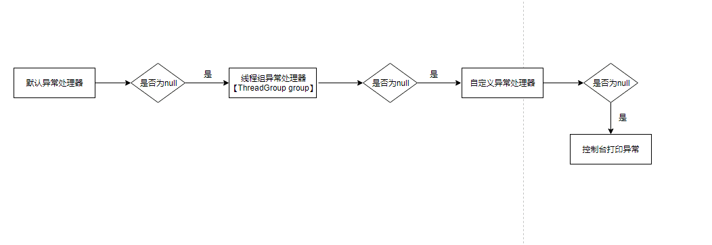

<h1 align="center">Exception</h1>

[toc]

## 异常

- Exception、Error 是 Throwable 类的子类
- Error 类对象由 Java 虚拟机生成并抛出，不可捕捉  
- 不管有没有异常，finally 中的代码都会执行
- 当 try、catch 中有 return 时，finally 中的代码依然会继续执行

| 常见的Error      |                    |                      |
| ---------------- | ------------------ | -------------------- |
| OutOfMemoryError | StackOverflowError | NoClassDeffoundError |

| 常见的Exception          |                                |                               |
| ------------------------ | ------------------------------ | ----------------------------- |
| 常见的非检查性异常       |                                |                               |
| ArithmeticException      | ArrayIndexOutOfBoundsException | ClassCastException            |
| IllegalArgumentException | IndexOutOfBoundsException      | NullPointerException          |
| NumberFormatException    | SecurityException              | UnsupportedOperationException |
| 常见的检查性异常         |                                |                               |
| IOException              | CloneNotSupportedException     | IllegalAccessException        |
| NoSuchFieldException     | NoSuchMethodException          | FileNotFoundException         |

## 异常的分类

- **Checked exception**: 这类异常都是Exception的子类，在代码里必须显式的进行捕获，这是编译器检查的一部分。。异常的向上抛出机制进行处理，假如子类可能产生A异常，那么在父类中也必须throws A异常。可能导致的问题：代码效率低，耦合度过高。
- **Unchecked exception**: **这类异常都是RuntimeException的子类，虽然RuntimeException同样也是Exception的子类，但是它们是非凡的，它们不能通过client code来试图解决**，所以称为Unchecked exception。也就是运行时异常，类似空指针异常、数组越界等，通常是可以避免的逻辑错误，具体根据需求来判断是否需要捕获，并不会在编译器强制要求。

## Exception和Error的区别

Exception 和 Error 都继承于 Throwable，在 Java 中，只有 Throwable 类型的对象才能被 throw 或者 catch，它是异常处理机制的基本组成类型。

Exception 是程序正常运行中，可以预料的意外情况，可能并且应该被捕获，进行相应的处理。

Error 是指在正常情况下，不大可能出现的情况，绝大部分 Error 都会使程序处于非正常、不可恢复的状态。既然是非正常，所以不便于也不需要捕获，常见的 OutOfMemoryError 就是 Error 的子类。

Exception：

- 可以是可被控制(checked) 或不可控制的(unchecked)。
- 表示一个由程序员导致的错误。
- 应该在应用程序级被处理。

Error：

- 总是不可控制的(unchecked)。
- 经常用来用于表示系统错误或低层资源的错误。
- 如何可能的话，应该在系统级被捕捉。

## 线程异常处理

### 线程出现异常测试

- 任务类：Task.java

   ```
   public class Task implements Runnable {
       private int i;
   
       public Task(int i) {
           this.i = i;
       }
   
       @Override
       public void run() {
           if (i == 5) {
               //System.out.println("throw exception");
               throw new IllegalArgumentException();
           }
           System.out.println(i);
       }
   }
   ```

如果i==5，将抛出一个异常

- 线程测试类：TaskTest.java

   ```
   public class TestTask {
       public static void main(String[] args) {
           int i = 0;
           while (true) {
               if (i == 10) break;
               try {
                   new Thread(new Task(i++)).start();
               } catch (Exception e) {
                   System.out.println("catch exception...");
               }
           }
       }
   }
   ```

通过使用try-catch，尝试对抛出的异常进行捕获

- 测试结果

   ```
   Connected to the target VM, address: '127.0.0.1:64551', transport: 'socket'
   0
   1
   2
   3
   4
   6
   7
   8
   9
   Exception in thread "pool-1-thread-1" java.lang.IllegalArgumentException
       at com.h2t.study.thread.Task.run(Task.java:21)
       at java.util.concurrent.ThreadPoolExecutor.runWorker(ThreadPoolExecutor.java:1149)
       at java.util.concurrent.ThreadPoolExecutor$Worker.run(ThreadPoolExecutor.java:624)
       at java.lang.Thread.run(Thread.java:748)
   ```

异常没有被捕获，只是在控制台打印了异常，并且不影响后续任务的执行 emmmm这是为什么呢，捕获不到异常就不知道程序出错了，到时候哪天有个任务不正常排查都排查不到，这样是要不得的。看一下Thread这个类，有个叫dispatchUncaughtException的方法，作用如其名，分发未捕获的异常，把这段代码揪出来：**Thread#dispatchUncaughtException**

```
   private void dispatchUncaughtException(Throwable e) {
       getUncaughtExceptionHandler().uncaughtException(this, e);
   }
```

   find usage是找不到该方法在哪里调用的，因为这个方法只被JVM调用 **Thread#getUncaughtExceptionHandler：** 获取UncaughtExceptionHandler接口实现类

   ```
public UncaughtExceptionHandler getUncaughtExceptionHandler() {
       return uncaughtExceptionHandler != null ?
           uncaughtExceptionHandler : group;
   }
   ```

UncaughtExceptionHandler是Thread中定义的接口，在Thread类中uncaughtExceptionHandler默认是null，因此该方法将返回group，即实现了UncaughtExceptionHandler接口的ThreadGroup类 **UncaughtExceptionHandler#uncaughtException：** ThreadGroup类的uncaughtException方法实现

```
public void uncaughtException(Thread t, Throwable e) {
    if (parent != null) {
        parent.uncaughtException(t, e);
    } else {
        Thread.UncaughtExceptionHandler ueh =
            Thread.getDefaultUncaughtExceptionHandler();
        if (ueh != null) {
            ueh.uncaughtException(t, e);
        } else if (!(e instanceof ThreadDeath)) {
            System.err.print("Exception in thread \""
                             + t.getName() + "\" ");
            e.printStackTrace(System.err);
        }
    }
}
```

因为在Thread类中没有对group【parent】和defaultUncaughtExceptionHandler【Thread.getDefaultUncaughtExceptionHandler】进行赋值，因此将进入最后一层条件，将异常打印到控制台中，对异常不做任何处理。 整个异常处理器调用链如下：



首先判断默认异常处理器【defaultUncaughtExceptionHandler】是不是为null，在判断线程组异常处理器【group】是不是为null，在判断自定义异常处理器【uncaughtExceptionHandler】是不是为null，都为null则在控制台打印异常

### 线程异常处理

分析了一下源码就知道如果想对任务执行过程中的异常进行处理一个就是让ThreadGroup不为null，另外一种思路就是让UncaughtExceptionHandler类型的变量值不为null。

- 异常处理器：ExceptionHandler.java

   ```
   private static class ExceptionHandler implements Thread.UncaughtExceptionHandler {
       @Override
       public void uncaughtException(Thread t, Throwable e) {
           System.out.println("异常捕获到了：" + e);
       }
   }
   ```

- 设置默认异常处理器

   ```
   Thread.setDefaultUncaughtExceptionHandler((t, e) -> System.out.println("异常捕获到  了: " + e));
   int i = 0;
   while (true) {
     if (i == 10) break;
     Thread thread = new Thread(new Task(i++));
     thread.start();
   }
   ```

   打印结果：

   ```
   0
   2
   1
   3
   9
   6
   7
   4
   异常捕获到了：java.lang.IllegalArgumentException
   8
   ```

   通过设置默认异常就不需要为每个线程都设置一次了

- 设置自定义异常处理器

   ```
   Thread t = new Thread(new Task(i++));
   t.setUncaughtExceptionHandler(new ExceptionHandler());
   ```

   打印结果：

   ```
   0
   2
   4
   异常捕获到了：java.lang.IllegalArgumentException
   6
   1
   3
   7
   9
   8
   ```

- 设置线程组异常处理器

   ```
   MyThreadGroup myThreadGroup = new MyThreadGroup("测试线程线程组");
   Thread t = new Thread(myThreadGroup, new Task(i++))
   ```

   自定义线程组：MyThreadGroup.java

   ```
   private static class MyThreadGroup extends ThreadGroup {
       public MyThreadGroup(String name) {
           super(name);
       }
   
       @Override
       public void uncaughtException(Thread t, Throwable e) {
           System.out.println("捕获到异常了：" + e);
       }
   }
   ```

   打印结果：

   ```
   1
   2
   0
   4
   3
   6
   7
   8
   9
   捕获到异常了：java.lang.IllegalArgumentException
   ```

线程组异常捕获处理器很适合为线程进行分组处理的场景，每个分组出现异常的处理方式不相同 设置完异常处理器后异常都能被捕获了，但是不知道为什么设置异常处理器后任务的执行顺序乱了，难道是因为为每个线程设置异常处理器的时间不同【想不通】

### 线程池异常处理

一般应用中线程都是通过线程池创建复用的，因此对线程池的异常处理就是为线程池工厂类【ThreadFactory实现类】生成的线程添加异常处理器

- 默认异常处理器

   ```
    Thread.setDefaultUncaughtExceptionHandler(new  ExceptionHandler());
    ExecutorService es = Executors.newCachedThreadPool();
   es.execute(new Task(i++))
   ```

- 自定义异常处理器

   ```
   ThreadPoolExecutor threadPoolExecutor = new ThreadPoolExecutor(1, 1,
                 0L, TimeUnit.MILLISECONDS,
                 new LinkedBlockingQueue<Runnable>());
   threadPoolExecutor.setThreadFactory(new MyThreadFactory());
   threadPoolExecutor.execute(new Task(i++));
   ```

   自定义工厂类：MyThreadFactory.java

   ```
   private static class MyThreadFactory implements ThreadFactory {
       @Override
       public Thread newThread(Runnable r) {
         Thread t = new Thread();
         //自定义UncaughtExceptionHandler
         t.setUncaughtExceptionHandler(new ExceptionHandler());
         return t;
      }
   }
   ```

### 设计原则，为什么要由线程自身进行捕获

来自JVM的设计理念"线程是**独立**执行的代码片断，线程的问题应该由线程自己来解决，而不要委托到外部"。因此在Java中，线程方法的异常【即任务抛出的异常】，应该在线程代码边界之内处理掉，而不应该在线程方法外面由其他线程处理

### 线程执行Callable任务

前面介绍的是线程执行Runnable类型任务的情况，众所周知，还有一种有返回值的Callable任务类型 测试代码：TestTask.java

```
public class TestTask {
    public static void main(String[] args) {
        int i = 0;
        while (true) {
            if (i == 10) break;
            FutureTask<Integer> task = new FutureTask<>(new CallableTask(i++));
            Thread thread = new Thread(task);
            thread.setUncaughtExceptionHandler(new ExceptionHandler());
            thread.start();
        }
    }
    
    private static class ExceptionHandler implements Thread.UncaughtExceptionHandler {
        @Override
        public void uncaughtException(Thread t, Throwable e) {
            System.out.println("异常捕获到了：" + e);
        }
    }
}
```

打印结果：

```
Disconnected from the target VM, address: '127.0.0.1:64936', transport: 'socket'
0
1
2
3
4
6
7
8
9
```

观察结果，异常没有被捕获，thread.setUncaughtExceptionHandler(new ExceptionHandler())方法设置无效，emmmmm，这又是为什么呢，在问为什么就是十万个为什么儿童了。查看FutureTask的run方法，**FutureTask#run：**

```
public void run() {
        if (state != NEW ||
            !UNSAFE.compareAndSwapObject(this, runnerOffset,
                                         null, Thread.currentThread()))
            return;
        try {
            Callable<V> c = callable;
            if (c != null && state == NEW) {
                V result;
                boolean ran;
                try {
                    result = c.call();
                    ran = true;
                } catch (Throwable ex) {
                    result = null;
                    ran = false;
                    setException(ex);
                }
                if (ran)
                    set(result);
            }
        } finally {
            // runner must be non-null until state is settled to
            // prevent concurrent calls to run()
            runner = null;
            // state must be re-read after nulling runner to prevent
            // leaked interrupts
            int s = state;
            if (s >= INTERRUPTING)
                handlePossibleCancellationInterrupt(s);
        }
    }
```

**FutureTask#setException：**

```
protected void setException(Throwable t) {
    if (UNSAFE.compareAndSwapInt(this, stateOffset, NEW, COMPLETING)) {
      //将异常设置给outcome变量
      outcome = t;
      //设置任务的状态为EXCEPTIONAL
      UNSAFE.putOrderedInt(this, stateOffset, EXCEPTIONAL); // final state
      finishCompletion();
    }
}
```

看到catch这段代码，当执行任务捕获到异常的时候，会将任务的处理结果设置为null，并且调用setException方法对捕获的异常进行处理，因为setUncaughtExceptionHandler只对未捕获的异常进行处理，FutureTask已经对异常进行了捕获处理，因此调用setUncaughtExceptionHandler捕获异常无效 对任务的执行结果调用get方法：

```
int i = 0;
while (true) {
    if (i == 10) break;
    FutureTask<Integer> task = new FutureTask<>(new CallableTask(i++));
    Thread thread = new Thread(task);
    thread.setUncaughtExceptionHandler(new ExceptionHandler());
    thread.start();
    //打印结果
    try {
    System.out.println(task.get());
    } catch (Exception e) {
      System.out.println("异常被抓住了, e: " + e);
    }
}
```

执行结果将会将捕获到的异常打印出来，执行结果：

```
异常被抓住了, e: java.util.concurrent.ExecutionException: java.lang.IllegalArgumentException
Disconnected from the target VM, address: '127.0.0.1:50900', transport: 'socket'
```

**FutureTask#get：**

```
public V get() throws InterruptedException, ExecutionException {
    int s = state;
    if (s <= COMPLETING)
      //未完成等待任务执行完成
      s = awaitDone(false, 0L);
    return report(s);
}
```

**FutureTask#report：**

```
private V report(int s) throws ExecutionException {
    Object x = outcome;
    if (s == NORMAL)
      return (V)x;
    if (s >= CANCELLED)
      throw new CancellationException();
    throw new ExecutionException((Throwable)x);
}
```

outcome在setException方法中被设置为了异常，并且s为state的状态最终8被设置为EXCEPTIONAL，因此方法将捕获的任务抛出【new ExecutionException((Throwable)x)】
 **总结：**
 Callable任务抛出的异常能在代码中通过try-catch捕获到，但是**只有调用get方法**后才能捕获到


## 参考

链接：https://juejin.im/post/6844903997388636174