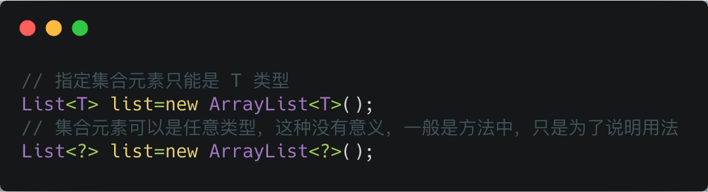
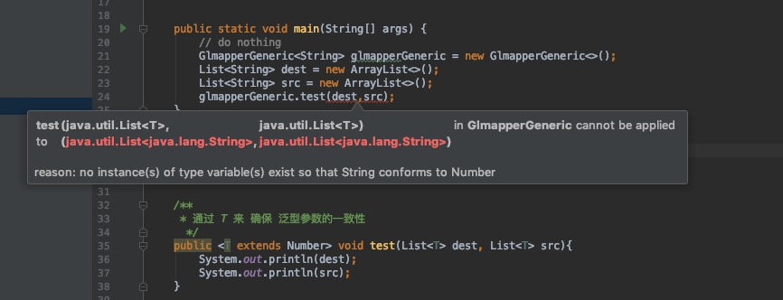
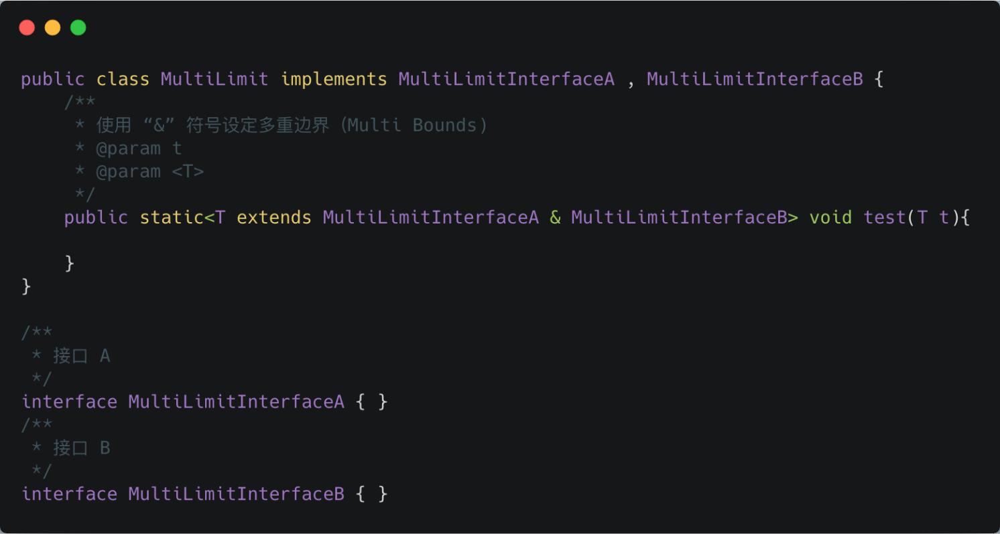
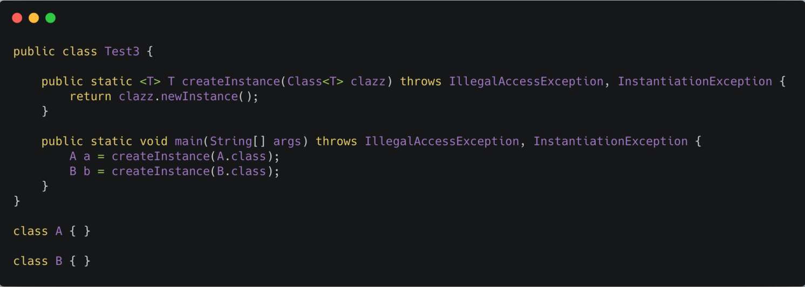

<h1 align="center">泛型（Generic）</h1>

[toc]

## 前言

Java 泛型（generics）是 JDK 5 中引入的一个新特性, 泛型提供了编译时类型安全检测机制，该机制允许开发者在编译时检测到非法的类型。

泛型的本质是参数化类型，也就是说所操作的数据类型被指定为一个参数。

## 泛型带来的好处

在没有泛型的情况的下，通过对类型 Object 的引用来实现参数的“任意化”，“任意化”带来的缺点是要做显式的强制类型转换，而这种转换是要求开发者对实际参数类型可以预知的情况下进行的。对于强制类型转换错误的情况，编译器可能不提示错误，在运行的时候才出现异常，这是本身就是一个安全隐患。

那么泛型的好处就是在编译的时候能够检查类型安全，并且所有的强制转换都是自动和隐式的。

## Java 泛型中的通配符 T，E，K，V，？

在使用泛型类的时候，既可以指定一个具体的类型，如`List<String>`就声明了具体的类型是`String`；也可以用通配符`?`来表示未知类型，如`List<?>`就声明了`List`中包含的元素类型是未知的。 通配符所代表的其实是一组类型，但具体的类型是未知的。`List<?>`所声明的就是所有类型都是可以的。**但是`List<?>`并不等同于`List<Object>`。`List<Object>`实际上确定了`List`中包含的是`Object`及其子类，在使用的时候都可以通过`Object`来进行引用。而`List<?>`则其中所包含的元素类型是不确定**。其中可能包含的是`String`，也可能是 `Integer`。如果它包含了`String`的话，往里面添加`Integer`类型的元素就是错误的。**正因为类型未知，就不能通过new ArrayList<?>()的方法来创建一个新的ArrayList对象。因为编译器无法知道具体的类型是什么。但是对于 List<?>中的元素确总是可以用Object来引用的，因为虽然类型未知，但肯定是Object及其子类**。考虑下面的代码：

```java
public void wildcard(List<?> list) {
    list.add(1);//编译错误
}  
```

>如上所示，试图对一个带通配符的泛型类进行操作的时候，总是会出现编译错误。其原因在于通配符所表示的类型是未知的。

因为对于`List<?>`中的元素只能用`Object`来引用，在有些情况下不是很方便。在这些情况下，可以使用上下界来限制未知类型的范围。 如 **`List<? extends Number>`说明List中可能包含的元素类型是`Number`及其子类。而`List<? super Number>`则说明List中包含的是Number及其父类**。当引入了上界之后，在使用类型的时候就可以使用上界类中定义的方法。

### 1. 常用的 T，E，K，V，？

本质上这些个都是通配符，没啥区别，只不过是编码时的一种约定俗成的东西。比如上述代码中的 T ，我们可以换成 A-Z 之间的任何一个 字母都可以，并不会影响程序的正常运行，但是如果换成其他的字母代替 T ，在可读性上可能会弱一些。**通常情况下，T，E，K，V，？ 是这样约定的：**

- ？ 表示不确定的 java 类型
- T (type) 表示具体的一个java类型
- K V (key value) 分别代表java键值中的Key Value
- E (element) 代表Element

### 2. ？ **无界通配符**

先从一个小例子看起，原文在 [这里](https://codeday.me/bug/20180113/116421.html) 。

我有一个父类 Animal 和几个子类，如狗、猫等，现在我需要一个动物的列表，我的第一个想法是像这样的：

```java
List<Animal> listAnimals
```

但是老板的想法确实这样的：

```java
List<? extends Animal> listAnimals
```

为什么要使用通配符而不是简单的泛型呢？通配符其实在声明局部变量时是没有什么意义的，但是当你为一个方法声明一个参数时，它是非常重要的。

```java
static int countLegs (List<? extends Animal > animals ) {
    int retVal = 0;
    for ( Animal animal : animals )
    {
        retVal += animal.countLegs();
    }
    return retVal;
}

static int countLegs1 (List< Animal > animals ){
    int retVal = 0;
    for ( Animal animal : animals )
    {
        retVal += animal.countLegs();
    }
    return retVal;
}

public static void main(String[] args) {
    List<Dog> dogs = new ArrayList<>();
 	// 不会报错
    countLegs( dogs );
	// 报错
    countLegs1(dogs);
}
```

当调用 countLegs1 时，就会飘红，提示的错误信息如下：


所以，对于不确定或者不关心实际要操作的类型，可以使用无限制通配符（尖括号里一个问号，即 <?> ），表示可以持有任何类型。像 countLegs 方法中，限定了上届，但是不关心具体类型是什么，所以对于传入的 Animal 的所有子类都可以支持，并且不会报错。而 countLegs1 就不行。

### 3. 上界通配符 < ? extends E>

> 上届：用 extends 关键字声明，表示参数化的类型可能是所指定的类型，或者是此类型的子类。

在类型参数中使用 extends 表示这个泛型中的参数必须是 E 或者 E 的子类，这样有两个好处：

- 如果传入的类型不是 E 或者 E 的子类，编译不成功
- 泛型中可以使用 E 的方法，要不然还得强转成 E 才能使用

```java
private <K extends A, E extends B> E test(K arg1, E arg2){
    E result = arg2;
    arg2.compareTo(arg1);
    //.....
    return result;
}
```

> 类型参数列表中如果有多个类型参数上限，用逗号分开

### 4. 下界通配符 < ? super E>

> 下界: 用 super 进行声明，表示参数化的类型可能是所指定的类型，或者是此类型的父类型，直至 Object

在类型参数中使用 super 表示这个泛型中的参数必须是 E 或者 E 的父类。

```java
private <T> void test(List<? super T> dst, List<T> src){
    for (T t : src) {
        dst.add(t);
    }
}

public static void main(String[] args) {
    List<Dog> dogs = new ArrayList<>();
    List<Animal> animals = new ArrayList<>();
    new Test3().test(animals,dogs);
}
// Dog 是 Animal 的子类
class Dog extends Animal {

}
```

dst 类型 “大于等于” src 的类型，这里的“大于等于”是指 dst 表示的范围比 src 要大，因此装得下 dst 的容器也就能装 src 。

### 5. ？ 和 T 的区别




？和 T 都表示不确定的类型，区别在于我们可以对 T 进行操作，但是对 ？ 不行，比如如下这种 ：

```java
// 可以
T t = operate();

// 不可以
？ car = operate();
```

简单总结下：

T 是一个 确定的 类型，通常用于泛型类和泛型方法的定义，？是一个 不确定 的类型，通常用于泛型方法的调用代码和形参，不能用于定义类和泛型方法。

#### 区别1：通过 T 来 确保 泛型参数的一致性

```java
// 通过 T 来 确保 泛型参数的一致性
public <T extends Number> void
test(List<T> dest, List<T> src)

//通配符是 不确定的，所以这个方法不能保证两个 List 具有相同的元素类型
public void
test(List<? extends Number> dest, List<? extends Number> src)
```

像下面的代码中，约定的 T 是 Number 的子类才可以，但是申明时是用的 String ，所以就会飘红报错。



不能保证两个 List 具有相同的元素类型的情况

```java
GlmapperGeneric<String> glmapperGeneric = new GlmapperGeneric<>();
List<String> dest = new ArrayList<>();
List<Number> src = new ArrayList<>();
glmapperGeneric.testNon(dest,src);
```

上面的代码在编译器并不会报错，但是当进入到 testNon 方法内部操作时（比如赋值），对于 dest 和 src 而言，就还是需要进行类型转换。

#### 区别2：类型参数可以多重限定而通配符不行



使用 & 符号设定多重边界（Multi Bounds)，指定泛型类型 T 必须是 MultiLimitInterfaceA 和 MultiLimitInterfaceB 的共有子类型，此时变量 t 就具有了所有限定的方法和属性。对于通配符来说，因为它不是一个确定的类型，所以不能进行多重限定。

#### 区别3：通配符可以使用超类限定而类型参数不行

类型参数 T 只具有 一种 类型限定方式：

```java
T extends A
```

但是通配符 ? 可以进行 两种限定：

```java
? extends A
? super A
```

### 6. `Class<T>` 和 `Class<?>` 区别

前面介绍了 ？ 和 T 的区别，那么对于，`Class<T>` 和 `<Class<?>` 又有什么区别呢？
`Class<T>` 和 `Class<?>`

最常见的是在反射场景下的使用，这里以用一段发射的代码来说明下。

```java
// 通过反射的方式生成  multiLimit 
// 对象，这里比较明显的是，我们需要使用强制类型转换
MultiLimit multiLimit = (MultiLimit)
Class.forName("com.glmapper.bridge.boot.generic.MultiLimit").newInstance();
```

对于上述代码，在运行期，如果反射的类型不是 MultiLimit 类，那么一定会报 java.lang.ClassCastException 错误。

对于这种情况，则可以使用下面的代码来代替，使得在在编译期就能直接 检查到类型的问题：



`Class<T>` 在实例化的时候，T 要替换成具体类。`Class<?>` 它是个通配泛型，? 可以代表任何类型，所以主要用于声明时的限制情况。比如，我们可以这样做申明：

```java
// 可以
public Class<?> clazz;
// 不可以，因为 T 需要指定类型
public Class<T> clazzT;
```

所以当不知道定声明什么类型的 Class 的时候可以定义一 个Class<?>。

```java
public class Test3 {
	public Class<?> clazz;
    public Class<T> clazzT;
}
```

那如果也想 `public Class<T> clazzT;` 这样的话，就必须让当前的类也指定 T ，

```java
public class Test3<T> {
    public Class<?> clazz;
    // 不会报错
    public Class<T> clazzT;
```

### \<T> T getInstance(final Class\<T> type)

\<T>：表示T是一个泛型（）

T：表示返回一个T的类型

Class\<T>：表示传入的参数为T类型

这里就是表示返回一个T类型的实例。


## Refrence:

https://juejin.im/post/5d5789d26fb9a06ad0056bd9

## 类型擦除

Java中的泛型基本上都是在编译器这个层次来实现的，**在生成的Java字节代码中是不包含泛型中的类型信息的。使用泛型的时候加上的类型参数，会被编译器在编译的时候去掉，这个过程就称为类型擦除**。如在代码中定义的`List<Object>`和`List<String>`等类型，在编译之后都会变成`List`。**JVM看到的只是List，而由泛型附加的类型信息对JVM来说是不可见的**。Java编译器会在编译时尽可能的发现可能出错的地方，但是仍然无法避免在运行时刻出现类型转换异常的情况。

很多泛型的奇怪特性都与这个类型擦除的存在有关，包括：

  - **泛型类并没有自己独有的Class类对象**。比如并不存在`List<String>.class`或是`List<Integer>.class`，而只有`List.class`。

  - **静态变量是被泛型类的所有实例所共享的**。对于声明为`MyClass<T>`的类，访问其中的静态变量的方法仍然是 `MyClass.myStaticVar`。不管是通过`new MyClass<String>`还是`new MyClass<Integer>`创建的对象，都是共享一个静态变量。

  - **泛型的类型参数不能用在Java异常处理的catch语句中**。因为异常处理是由`JVM`在运行时刻来进行的。由于类型信息被擦除，`JVM`是无法区分两个异常类型`MyException<String>`和`MyException<Integer>`的。对于`JVM`来说，它们都是 `MyException`类型的。也就无法执行与异常对应的catch语句。

类型擦除的基本过程也比较简单，首先是找到用来替换类型参数的具体类。这个具体类一般是Object。如果指定了类型参数的上界的话，则使用这个上界。把代码中的类型参数都替换成具体的类。同时去掉出现的类型声明，即去掉<>的内容。比如`T get()`方法声明就变成了`Object get()`；`List<String>`就变成了`List`。接下来就可能需要生成一些桥接方法（bridge method）。这是由于擦除了类型之后的类可能缺少某些必须的方法。比如考虑下面的代码：


  ```
  class MyString implements Comparable<String> {
      public int compareTo(String str) {        
          return 0;    
      }
  }
  ```

当类型信息被擦除之后，上述类的声明变成了`class MyString implements Comparable`。但是这样的话，类`MyString`就会有编译错误，因为没有实现接口`Comparable`声明的`int compareTo(Object)`方法。这个时候就由编译器来动态生成这个方法。

## 类型系统

在Java中，大家比较熟悉的是通过继承机制而产生的类型体系结构。比如`String`继承自`Object`。根据`Liskov替换原则`，子类是可以替换父类的。当需要`Object`类的引用的时候，如果传入一个`String`对象是没有任何问题的。但是反过来的话，即用父类的引用替换子类引用的时候，就需要进行强制类型转换。编译器并不能保证运行时刻这种转换一定是合法的。**这种自动的子类替换父类的类型转换机制，对于数组也是适用的。 String[]可以替换Object[]**。但是泛型的引入，对于这个类型系统产生了一定的影响。**正如前面提到的List<String>是不能替换掉List<Object>的**。

引入泛型之后的类型系统增加了两个维度：**一个是类型参数自身的继承体系结构，另外一个是泛型类或接口自身的继承体系结构**。第一个指的是对于 `List<String>`和`List<Object>`这样的情况，类型参数`String`是继承自`Object`的。而第二种指的是 `List`接口继承自`Collection`接口。对于这个类型系统，有如下的一些规则：

  - **相同类型参数的泛型类的关系取决于泛型类自身的继承体系结构**。即`List<String>`是`Collection<String>` 的子类型，`List<String>`可以替换`Collection<String>`。这种情况也适用于带有上下界的类型声明。

  - **当泛型类的类型声明中使用了通配符的时候，其子类型可以在两个维度上分别展开**。如对`Collection<? extends Number>`来说，其子类型可以在`Collection`这个维度上展开，即`List<? extends Number>`和`Set<? extends Number>`等；也可以在`Number`这个层次上展开，即`Collection<Double>`和`Collection<Integer>`等。如此循环下去，`ArrayList<Long>`和 `HashSet<Double>`等也都算是`Collection<? extends Number>`的子类型。

  - 如果泛型类中包含多个类型参数，则对于每个类型参数分别应用上面的规则。