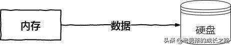
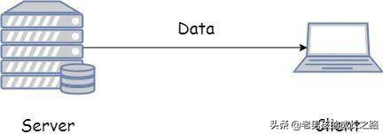
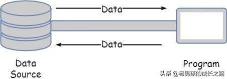
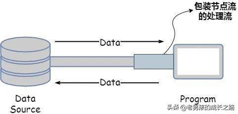
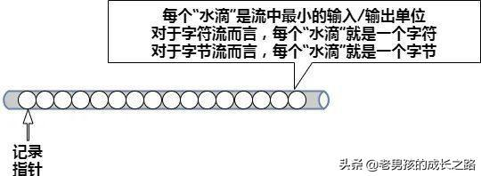
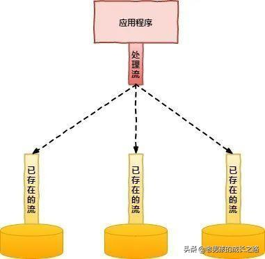
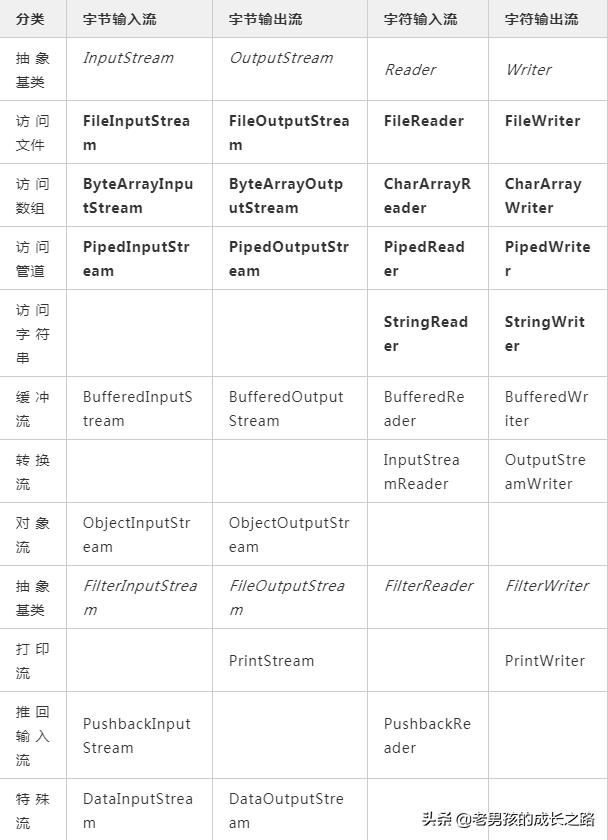
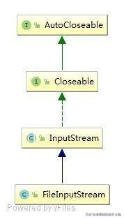

<h1 align="center">IO流详解</h1>

## 前言

现在很多项目的开发都会用到SpringBoot，而SpringBoot的自动配置的底层原理实现就在于，Java提供的IO流将
META-INF/spring-autoconfigure-metadata.properties文件中的数据读取出来，所以适当了解Java的IO流是十分有必要的。本文的介绍内容如下：

### 1. 流的概念和作用

在《Java编程思想》中，流被定义为代表任何有能力产出数据的数据源对象或者有能力接受数据的接收端对象。

也就是说，流的本质其实就是**数据传输，是计算机各部件之间的数据流动**。

流的作用其实也就是**为数据源和目的建立一个传输管道**。

### 2. IO的分类和特性

按照不同的分类方式，可以将把流分为不同的类型。常用的分类有三种：

- 按流的流向划分
- 按操作单元划分
- 按流的角色划分

#### 2.1 按流的流向划分，可以分为输入流和输出流

**输入流**：将数据从外设或外存（如键盘、鼠标、文件等）传递到应用程序的称为输入流（Input Stream）；

**输出流**：将数据从应用程序传递到外设或外存（如屏幕、打印机、文件等）的流（OutputStream）。

可以看到，输入流和输出流都涉及到一个方向的问题。举个栗子，如果数据从内存到硬盘，那么传输过程中的数据流是输入流还是输出流？




答案是输出流。也就是说这里所说的**输入、输出都是从程序运行所在的内存的角度来进行划分**。

再看个例子，数据从服务器（Server）传送到客户端（Client），在这个过程中服务器和客户端的程序分别使用什么流向的流？




其实，在这个过程中因为服务器是从数据库取出数据，数据通过内存经由指定程序发送到流上，所以服务器端的程序使用的是输出流；而客户端是从流上获取数据，内存接受到数据之后交给CPU进行处理，所以客户端的程序使用的是输入流。

> 在Java中，输入流主要是InputStream和Reader作为基类，而输出流则主要是OutputStream和Writer作为基类。它们都是一些抽象基类，并不能直接用于创建对象实例。

#### 2.2 按操作单元划分，可以划分为字节流和字符流

在介绍字节流和字符流之前，我们需要知道字节和字符之间的关系：

- 1字符 = 2字节
- 1字节 = 8位
- 一个汉字占两个字节长度（因为汉字博大精深，所以有些汉字也会占到三个字节的长度）

**字节流**：处理字节数据。每次读取（写出）一个字节，当传输的资源文件中有中文时，就会出现乱码；

**字符流**：处理字符数据。每次读取（写出）两个字节时，有中文时使用该留就可以正确传输显示文字。

> 在Java中，字节流主要是由InputStream和OutputStream作为基类，而字符流则主要有Reader和Writer作为基类。

#### 2.3 按流的角色，可划分为节点流和处理流

**节点流**，就是可以从/向一个特定的IO设备（如磁盘、网络）读/写数据的流。




可以从上图看出，**当使用节点流进行输入和输出数据过程中，程序直接连接到实际的数据源，和实际的输入/输出节点连接**。节点流也被称为低级流。

**处理流**：对一个已存在的流进行连接和封装，通过所封装的流的功能调用实现数据读写。




**当使用处理流进行输入/输出操作时，程序并不会直接连接到实际的数据源，没有与实际的输入和输出节点连接**。只要使用相同的处理流，程序就可以采用完全相同的输入/输出代码来访问不同的数据源，随着处理流所包装的节点流的变化，程序实际访问的数据源也会相应地发生变化。

#### 2.4 IO流的特性

Java的IO流涉及到了40多个类，但其实都是从如下4个抽象基类中派生出来的：

- **InputStream/Reader：所有的输入流的基类，前者是字节输入流，后者是字符输入流；**
- **OutputStream/Writer：所有的输出流的基类，前者是字节输出流，后者是字符输出流。**

我们知道，流的作用就像是一个数据管道，而数据就像是管道中的一滴滴水。字符流和字节流的处理单位不同，但处理方式相似。




输入流使用隐式的记录指针来表示当前正准备从哪个“水滴”开始读取，每当程序从InputStream或Reader中取出“水滴”之后，记录指针自己向后移动，除此之外，InputStream和Reader里面都提供了一些方法来控制记录指针的移动。

而对于输出流OutputStream和Writer而言，它们同样是把输出设备抽象成一个“水管”，当执行输出的时候，程序相当于把水管中的“水滴”依次放出。输出流同样采用隐式指针来表示当前输出水滴的位置，每当程序从OutputStream或Writer中取出水滴的时候，指针也会自动向后移动。

以上展示了JavaIO的基本概念模型，但Java的处理流模型则给我们另一种输入/输出流设计的角度：




**处理流可以在任何已存在的流的基础之上，这就允许Java应用程序采用相同的代码，透明的方式来访问不同的输入和输出设备的数据流**。而在处理流中主要是以增加缓冲的方式来提供输入和输出的效率，且可能提供了一系列便捷的方法来一次性输入和输出大批量的内容，而不是输入/输出一个或多个“水滴”。

在处理流中有一个专门提供了一个内存区域用于输入和输出大批量内容的流——**缓冲流（Buffered Stream）**。

如果每次操作都是以一个字节/字符为单位，显然这样的数据传输效率很低。为了提高数据传输效率，通常使用缓冲流，即为一个流配有一个**缓冲区**（Buffer），这个缓冲区就是专门用于传送数据的一块内存。

**当向一个缓冲流写入数据时，系统将数据发送到缓冲区，而不是直接发送到外部设备。缓冲区自动记录数据，当缓冲区满时，系统将数据全部发送到相应的外部设备**。而且当从一个缓冲流中读取数据时，系统实际是从缓冲区中读取数据。当缓冲区空时，系统就会从相关外部设备自动读取数据，并读取尽可能多的数据填满缓冲区。由此可见，缓冲流提供了内存与外部设备之间的数据传输效率。

从上述我们其实可以窥见**JavaIO的特性**：

- **先进先出**，最先写入输出流的数据最先被输入流读取；
- **顺序存取**，数据的获取和发送是沿着数据序列顺序进行，不能随机访问中间的数据。（但RandomAccessFile可以从文件的任意位置进行存取（输入输出）操作）；
- **只读或只写**，每个流只能是输入流或输出流的一种，不能同时具备两个功能。

#### 2.5 小结

可能看了上面的分类，会有读者不清楚什么时候使用字节流，什么时候用输出流。笔者在此整理这几个步骤：

> 首先要知道自己选择**输入流还是输出流**（请站在**内存的角度**考虑）；在考虑传输数据时，通过判断**是否有中文**来决定是**使用字节流传输还是字符流**；**通过前面两步就可以选出一个合适的节点流**了，如字节输入流InputStream，如果要在此基础上**增强功能**，那么在**处理流**中选择一个合适的即可。

而在JavaIO中常用的流的类型有以下这些（**粗体所标出的类代表节点流，必须直接与指定的物理节点关联；斜体标出的类代表抽象类，不能直接创建实例**）：




\3. 常用的IO流的用法

#### 3.1 IO体系的基类（InputStream/Reader、OutputStream/Writer）

> 因字节流和字符流的处理方式相似，只是操作的单位不同，所以就整理在一起进行介绍。

**InputStream和Reader是所有输入流的抽象基类**，本身并不能创建实例来执行输入，但是它们的方法是所有输入流都可以使用的方法。

在**InputStream**里包含如下三种方法：

方法功能说明int read()从输入流中读取单个字节，返回所读取的字节数据（字节数据可直接转换为int类型）int read(byte[] b)从输入流中最多读取b.length个字节的数据，并将其存储入字节数组b中，返回实际读取的字节数int read(byte[] b, int off, int len)从输入流中最多读取len个字节的数据，并将其存储入字节数组b中，放入数组b中时，从off位置开始进行读取，返回实际读取的字节数

在**Reader**中也包含了如下三个方法：

方法功能说明int read()从输入流中读取单个字符int read(char[] c)从输入流中读最多c.length个字符，存入字符数组c中，返回实际读取的字符数int read(char[] c, int off, int len)从输入流中读最多len个字符，存入字符数组c中从off开始的位置，返回实际读取的字符数

**而OutputStream和Writer是所有输出流的抽象基类**，本身并不能创建实例来执行输出，但是它们的方法是所有输出流都可以使用的方法。

在**OutputStream和Writer**里包含了三种方法：

方法功能说明void write(int c)将指定的字节/字符输出到输出流中，其中c即可以代表字节，也可以代表字符void write(byte[]/char[] buf)将字节数组/字符数组中从off位置开始，长度为len的字节/字符输出到输出流void write(byte[]/char[] buf, int off, int len)将字节数组/字符数组中从off位置开始，长度为len的字节/字符输出到输出流中

因为字符流是直接以字符作为操作单位，所以在Writer中可以使用字符串来代替字符数组，即String对象可作为参数。在Writer中还包含如下两个将String作为操作对象的方法：

方法功能说明void write(String str)将str字符串里面包含的字符串输出到指定输出流中void write(String str, int off, int len)将str字符串里面从off位置开始，将长度为len的字符输出到指定的输出流中

#### 3.2 IO体系中基类文件流的使用

文件流：
FileInputStream/FileReader、
FileOutputStream/FileWriter

上文所介绍的InputStream和Reader是抽象类，并不能用于创建实例，但它们分别有用于读取文件的子类输入流：**FileInputStream和FileReader**，它们都是**节点流，会直接和指定文件关联**。举个栗子：

```java
public class FileTest {
    public static void main(String[] args) throws IOException {
        FileInputStream fis = null;
        try{
            //1. 创建字节输入流
            fis = new FileInputStream("D:\\output.txt");
            //2. 创建一个长度为1024的储水池
            byte[] b = new byte[1024];
            //用于保存的实际字节数
            int hasRead = 0;
            //3. 使用循环来重复取水滴的过程
            while((hasRead = fis.read(b))>0){
                //取出储水池中的水滴（字节），将字节数组转换成字符串输出
                System.out.println(new String(b, 0, hasRead));
            }
        }catch (IOException e){
            e.printStackTrace();
        }finally {
            fis.close();
        }
    }
}
```

因为以上程序中打开的文件IO资源并不属于内存的资源，垃圾回收机制无法回收该资源，所以需要使用fis.close()来显示地关闭打开的IO资源。在JDK1.7时，IO资源类都被改写成实现了**AutoCloseable**接口，因此都可以通过自动关闭资源的try语句来关闭这些IO流。下图是FileInputStream类的继承关系图：




而使用FileReader读取文件的处理方法与FileInputStream相似，只是操作单元不一样：

```java
public class FileTest {
    public static void main(String[] args) throws IOException {
        FileReader fr = null;
        try {
            //1. 创建字节输入流
            fr = new FileReader("D:\\output.txt");
            //2. 创建一个长度为1024的储水池
            char[] b = new char[1024];
            //用于保存的实际字节数
            int hasRead = 0;
            //3. 使用循环来重复取水滴的过程
            while ((hasRead = fr.read(b)) > 0) {
                //取出储水池中的水滴（字节），将字节数组转换成字符串输出
                System.out.println(new String(b, 0, hasRead));
            }
        } catch (IOException e) {
            e.printStackTrace();
        } finally {
            fr.close();
        }
    }
}
```

**
FileOutputStream/FileWriter是IO中的文件输出流**，接下来我们来看个栗子：

```java
public class FileTest {
    public static void main(String[] args) throws IOException {
        FileInputStream fis = null;
        FileOutputStream fos = null;
        try{
            // 创建字节输入流
            fis = new FileInputStream("D:\\output.txt");
            // 创建字节输出流
            fos = new FileOutputStream("D:\\newOutput.txt");

            // 创建一个长度为1024的储水池
            byte[] b = new byte[1024];
            // 用于保存的实际字节数
            int hasRead = 0;
            // 使用循环来重复取水滴的过程
            while((hasRead = fis.read(b))>0){
                // 当输入流FileInputStream读取多少关于output.txt的内容
                // FileOutputStream就写入多少在newOutput.txt
                fos.write(b, 0, hasRead);
            }
        }catch (IOException e){
            e.printStackTrace();
        }finally {
            fis.close();
            fos.close();
        }
    }
}
```

在运行程序之后，可以输出流指定的目录下看到多了一个newOutput.txt文件，该文件中的内容跟output.txt文件的内容完全相同。FileWriter的使用方式和FileOutputStream基本类似，在此就不做赘述了。

> 需要注意的是，使用JavaIO进行输出操作的时候，一定要关闭字符输出流。字节流没有缓冲区，是直接输出的，而字符流是具有缓冲区的。关闭输出流除了可以保证流的物理资源被及时回收之外，可能还可以将输出流缓冲区中的数据flush到物理节点中（因为在执行close()方法之前，会自动执行输出流的flush()方法）。

#### 3.3 缓冲流的使用

缓冲流：
BufferedInputStream/BufferedReader、
BufferedOutputStream/BufferedWriter

在上文有对处理流和缓冲流的原理进行介绍，接下来来介绍一下字节缓存流的用法（字符缓存流与字节缓存流的用法相似，在此就不做赘述了）：

```java
public class BufferedTest {
    public static void main(String[] args) throws IOException {
        FileInputStream fis = null;
        FileOutputStream fos = null;
        BufferedInputStream bis = null;
        BufferedOutputStream bos = null;
        try{
            // 创建字节输入流
            fis = new FileInputStream("D:\\output.txt");
            // 创建字节输出流
            fos = new FileOutputStream("D:\\newOutput.txt");
            // 创建字节缓存输入流
            bis = new BufferedInputStream(fis);
            // 创建字节缓存输出流
            bos = new BufferedOutputStream(fos);

            // 创建一个长度为1024的储水池
            byte[] b = new byte[1024];
            // 用于保存的实际字节数
            int hasRead = 0;
            // 使用循环来重复取水滴的过程
            while((hasRead = bis.read(b))>0){
                // 当输入流FileInputStream读取多少关于output.txt的内容
                // FileOutputStream就写入多少在newOutput.txt
                bos.write(b, 0, hasRead);
            }
        }catch (IOException e){
            e.printStackTrace();
        }finally {
            bis.close();
            bos.close();
        }
    }
}
```

可以看到，使用字节缓存流读取和写入数据的方式和文件流（FileInputStream，FileOutputStream）并没有什么不同，但是因为**缓存流的加入，使得数据可以在缓存区存储到一定的量的时候再写入磁盘，提高了工作效率，还减少对硬盘的读取次数，降低对磁盘的损耗**。从这个栗子我们也可以看到，缓存流，也就是处理流，是一种可以增强流功能的流，可以对已经存在的流进行修饰。

在上面的代码中，我们使用了缓存流和文件流，但我们只关闭了缓存流。因为我们在使用处理流套接到节点流的时候，只需要关闭最上层的处理就可以了，Java会帮我们关闭下层的节点流。

> 对设计模式有所了解的读者应该也发现了，这里处理流的操作，按功能划分流，并通过动态装配这些流，以获得需要的功能，不就是使用到了设计模式中的**装饰模式**嘛！能想到这一步的读者，可以适当奖励一下自己哦~

#### 3.4 转换流的使用

转换流：
InputStreamReader/OutputStreamWriter

当文本文件在硬盘中以字节流的形式进行存储时，通过InputStreamReader读取后可转为字符流给程序处理，程序处理的字符流通过OutputStreamWriter转换为字节流保存。所以转换流主要是在这两种场景中使用：

- 当字节和字符之间有转换动作时；
- 流操作的数据需要编码或解码时。

下面以获取键盘输入为例，来介绍转换流的用法。System.in可以唤起键盘输入功能，但这个标准输入流是InputStream类的实例，使用有所不便，而键盘输入内容都是文本内容，所以**可以使用InputStreamReader将其InputStream包装成BufferedReader**，利用BufferedReader.readLine()方法可以一次读取一行内容：

```java
public class InputStreamReaderTest {
    public static void main(String[] args){
        try{
            //将System.in对象转换为Reader对象
            InputStreamReader reader = new InputStreamReader(System.in);
            //将普通的Reader包装为BufferedReader
            BufferedReader bufferedReader = new BufferedReader(reader);
            String buffer = null;
            while((buffer = bufferedReader.readLine())!=null){
                //如果读取到字符串"quit"则退出程序
                if(buffer.equals("quit")){
                    System.exit(1);
                }
                System.out.println("输入内容："+buffer);
            }
        }catch (IOException e){
            e.printStackTrace();
        }finally {
        }
    }
}
```

## 结语

通过上文我们可以对JavaIO的整体类结构和类的特性有一个初步的了解，我们可以在开发过程中根据需要，灵活地使用不同的IO流进行开发。**如果是在操作二进制文件如图片，就是用字节流；如果操作的是文本文件，就是用字符流。而且尽可能地多用处理流，这样会使我们的代码更加灵活，复用性更好**。

source : https://www.toutiao.com/i6842649175788618248/?tt_from=weixin&utm_campaign=client_share&wxshare_count=1&timestamp=1593206901&app=news_article&utm_source=weixin&utm_medium=toutiao_android&use_new_style=1&req_id=2020062705282101002704913429FC7AB6&group_id=6842649175788618248

