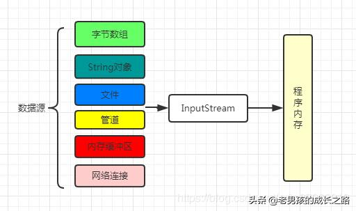
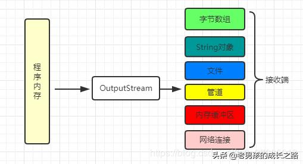
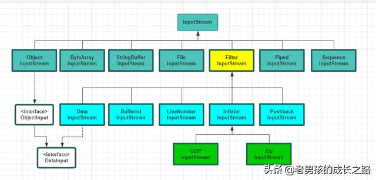
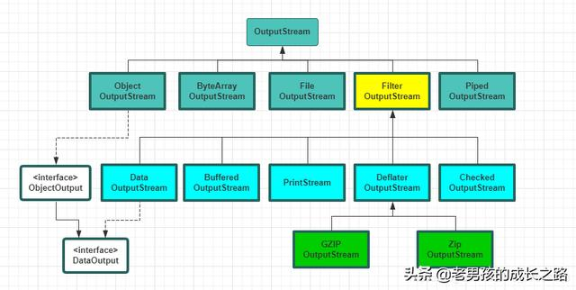
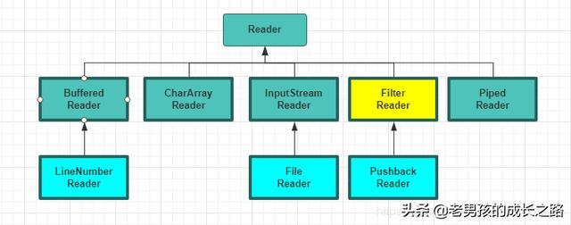
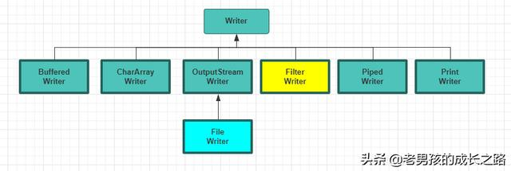
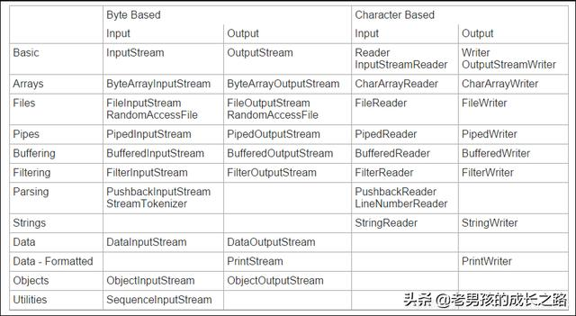
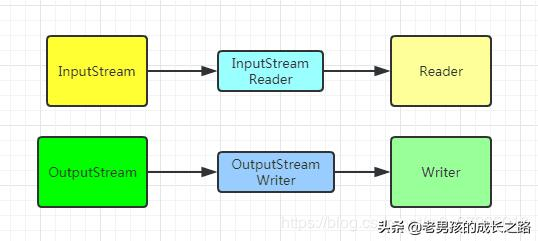
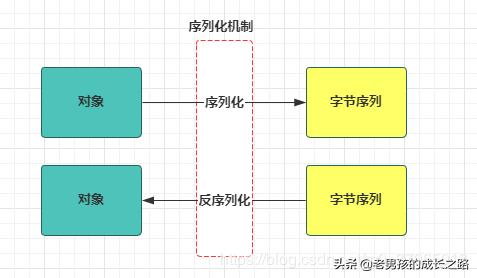

<h1 align="center">一文带你精通Java I/O流</h1>

### Java IO概述

IO就是输入/输出。Java IO类库基于抽象基础类InputStream和OutputStream构建了一套I/O体系，主要解决从数据源读入数据和将数据写入到目的地问题。我们把数据源和目的地可以理解为IO流的两端。当然，通常情况下，这两端可能是文件或者网络连接。

我们用下面的图描述下，加深理解：

> 从一种数据源中通过InputStream流对象读入数据到程序内存中




> 当然我们把上面的图再反向流程，就是OutputStream的示意了。




其实除了面向字节流的InputStream/OutputStream体系外，Java IO类库还提供了面向字符流的Reader/Writer体系。Reader/Writer继承结构主要是为了国际化，因为它能更好地处理16位的Unicode字符。

在学习是这两套IO流处理体系可以对比参照着学习，因为有好多相似之处。

### 要理解总体设计

刚开始写IO代码，总被各种IO流类搞得晕头转向。这么多IO相关的类，各种方法，啥时候能记住。

其实只要我们掌握了IO类库的总体设计思路，理解了它的层次脉络之后，就很清晰。知道啥时候用哪些流对象去组合想要的功能就好了，API的话，可以查手册的嘛。

首先从流的流向上可以分为输入流InputStream或Reader，输出流OutputStream或Writer。任何从InputStream或Reader派生而来的类都有read()基本方法，读取单个字节或字节数组；任何从OutputSteam或Writer派生的类都含有write()的基本方法，用于写单个字节或字节数组。

从操作字节还是操作字符的角度，有面向字节流的类，基本都以XxxStream结尾，面向字符流的类都以XxxReader或XxxWriter结尾。当然这两种类型的流是可以转化的，有两个转化流的类，这个后面会说到。

一般在使用IO流的时候会有下面类似代码：

```java
FileInputStream inputStream = new FileInputStream(new File("a.txt"));
BufferedInputStream bufferedInputStream = new BufferedInputStream(inputStream);
```

这里其实是一种装饰器模式的使用，IO流体系中使用了装饰器模式包装了各种功能流类。

在Java IO流体系中
FilterInputStream/FilterOutStream和FilterReader/FilterWriter就是装饰器模式的接口类，从该类向下包装了一些功能流类。有DataInputStream、BufferedInputStream、LineNumberInputStream、PushbackInputStream等，当然还有输出的功能流类；面向字符的功能流类等。

下面几张图描述了整个IO流的继承体系结构

> InputStream流体系




> OutputStream流体系




> Reader体系




> Writer体系




最后再附加一张表加深印象：




### File其实是个工具类

File类其实不止是代表一个文件，它也能代表一个目录下的一组文件（代表一个文件路径）。下面我们盘点一下File类中最常用到的一些方法

```java
File.delete() 删除文件或文件夹目录。
File.createNewFile() 创建一个新的空文件。
File.mkdir() 创建一个新的空文件夹。
File.list() 获取指定目录下的文件和文件夹名称。
File.listFiles() 获取指定目录下的文件和文件夹对象。
File.exists() 文件或者文件夹是否存在

String   getAbsolutePath()   // 获取绝对路径
long   getFreeSpace()       // 返回分区中未分配的字节数。
String   getName()         // 返回文件或文件夹的名称。
String   getParent()         // 返回父目录的路径名字符串；如果没有指定父目录，则返回 null。
File   getParentFile()      // 返回父目录File对象
String   getPath()         // 返回路径名字符串。
14long   getTotalSpace()      // 返回此文件分区大小。
long   getUsableSpace()    //返回占用字节数。
int   hashCode()             //文件哈希码。
long   lastModified()       // 返回文件最后一次被修改的时间。
long   length()          // 获取长度,字节数。
boolean canRead()  //判断是否可读
boolean canWrite()  //判断是否可写
boolean isHidden()  //判断是否隐藏


// 成员函数
static File[]    listRoots()    // 列出可用的文件系统根。
boolean    renameTo(File dest)    // 重命名7boolean    setExecutable(boolean executable)    // 设置执行权限。
boolean    setExecutable(boolean executable, boolean ownerOnly)    // 设置其他所有用户的执行权限。
boolean    setLastModified(long time)       // 设置最后一次修改时间。
boolean    setReadable(boolean readable)    // 设置读权限。
boolean    setReadable(boolean readable, boolean ownerOnly)    // 设置其他所有用户的读权限。
boolean    setWritable(boolean writable)    // 设置写权限。
boolean    setWritable(boolean writable, boolean ownerOnly)    // 设置所有用户的写权限。
```

需要注意的是，不同系统对文件路径的分割符表是不一样的，比如Windows中是“\”，Linux是“/”。而File类给我们提供了抽象的表示File.separator，屏蔽了系统层的差异。因此平时在代码中不要使用诸如“\”这种代表路径，可能造成Linux平台下代码执行错误。

下面是一些示例：

**根据传入的规则，遍历得到目录中所有的文件构成的File对象数组**

```java
public class Directory {
    public static File[] getLocalFiles(File dir, final String regex){
        return dir.listFiles(new FilenameFilter() {
            private Pattern pattern = Pattern.compile(regex);
            public boolean accept(File dir, String name) {
                return pattern.matcher(new File(name).getName()).matches();
            }
        });
    }

    // 重载方法
    public static File[] getLocalFiles(String path, final String regex){
        return getLocalFiles(new File(path),regex);
    }

    public static void main(String[] args) {
        String dir = "d:";
        File[] files = Directory.getLocalFiles(dir,".*\\.txt");
        for(File file : files){
            System.out.println(file.getAbsolutePath());
        }
    }
}
```

输出结果：

```
d:\\1.txt
d:\\新建文本文档.txt
```

上面的代码中**dir.listFiles(FilenameFilter )** 是策略模式的一种实现，而且使用了匿名内部类的方式。

> 上面的例子是《Java 编程思想》中的示例，这本书中的每个代码示例都很经典，Bruce Eckel大神把面向对象的思想应用的炉火纯青，非常值得细品。

### InputStream和OutputStream

InputStream是输入流，前面已经说到，它是从数据源对象将数据读入程序内容时，使用的流对象。通过看InputStream的源码知道，它是一个抽象类，

```
public abstract class InputStream  extends Object  implements Closeable2
```

提供了一些基础的输入流方法：

```java
//从数据中读入一个字节，并返回该字节，遇到流的结尾时返回-1
abstract int read() 

//读入一个字节数组，并返回实际读入的字节数，最多读入b.length个字节，遇到流结尾时返回-1
int read(byte[] b)

// 读入一个字节数组，返回实际读入的字节数或者在碰到结尾时返回-1.
//b:代表数据读入的数组， off：代表第一个读入的字节应该被放置的位置在b中的偏移量，len：读入字节的最大数量
int read(byte[],int off,int len)

// 返回当前可以读入的字节数量，如果是从网络连接中读入，这个方法要慎用，
int available() 

//在输入流中跳过n个字节，返回实际跳过的字节数
long skip(long n)

//标记输入流中当前的位置
void mark(int readlimit) 

//判断流是否支持打标记，支持返回true
boolean markSupported() 

// 返回最后一个标记，随后对read的调用将重新读入这些字节。
void reset() 

//关闭输入流，这个很重要，流使用完一定要关闭
void close()
```

直接从InputStream继承的流，可以发现，基本上对应了每种数据源类型。

类功能ByteArrayInputStream将字节数组作为
InputStreamStringBufferInputStream将String转成
InputStreamFileInputStream从文件中读取内容PipedInputStream产生用于写入相关PipedOutputStream的数据。实现管道化SequenceInputStream将两个或多个InputStream对象转换成单一的
InputStreamFilterInputStream抽象类，主要是作为“装饰器”的接口类，实现其他的功能流

OutputStream是输出流的抽象，它是将程序内存中的数据写入到目的地（也就是接收数据的一端）。看下类的签名：

```
1public abstract class OutputStream implements Closeable, Flushable {}
```

提供了基础方法相比输入流来说简单多了，主要就是write写方法（几种重载的方法）、flush冲刷和close关闭。

```java
// 写出一个字节的数据
abstract void write(int n)

// 写出字节到数据b
void write(byte[] b)

// 写出字节到数组b，off：代表第一个写出字节在b中的偏移量，len：写出字节的最大数量
void write(byte[] b, int off, int len)

//冲刷输出流，也就是将所有缓冲的数据发送到目的地
void flush()

// 关闭输出流
void close()
```

同样地，OutputStream也提供了一些基础流的实现，这些实现也可以和特定的目的地（接收端）对应起来，比如输出到字节数组或者是输出到文件/管道等。

类功能ByteArrayOutputStream在内存中创建一个缓冲区，所有送往“流”的数据都要放在此缓冲区FileOutputStream将数据写入文件PipedOutputStream和PipedInputStream配合使用。实现管道化FilterOutputStream抽象类，主要是作为“装饰器”的接口类，实现其他的功能流

### 使用装饰器包装有用的流

Java IO 流体系使用了装饰器模式来给哪些基础的输入/输出流添加额外的功能。这写额外的功能可能是：可以将流缓冲起来提高性能、是流能够读写基本数据类型等。

这些通过装饰器模式添加功能的流类型都是从FilterInputStream和FilterOutputStream抽象类扩展而来的。可以再返回文章最开始说到IO流体系的层次时，那几种图加深下印象。

> FilterInputStream类型

类功能DataInputStream和DataOutputStream搭配使用，使得流可以读取int char long等基本数据类型BufferedInputStream使用缓冲区，主要是提高性能LineNumberInputStream跟踪输入流中的行号，可以使用getLineNumber、setLineNumber(int)PushbackInputStream使得流能弹出“一个字节的缓冲区”，可以将读到的最后一个字符回退

> FilterOutStream类型

类功能DataOutputStream和DataInputStream搭配使用，使得流可以写入int char long等基本数据类型PrintStream用于产生格式化的输出BufferedOutputStream使用缓冲区，可以调用flush()清空缓冲区

大多数情况下，其实我们在使用流的时候都是输入流和输出流搭配使用的。目的就是为了转移和存储数据，单独的read()对我们而言有啥用呢，读出来一个字节能干啥？对吧。因此要理解流的使用就是搭配起来或者使用功能流组合起来去转移或者存储数据。

### Reader和Writer

Reader是Java IO中所有Reader的基类。Reader与InputStream类似，不同点在于，Reader基于字符而非基于字节。

Writer是Java IO中所有Writer的基类。与Reader和InputStream的关系类似，Writer基于字符而非基于字节，Writer用于写入文本，OutputStream用于写入字节。

Reader和Writer的基础功能类，可以对比InputStream、OutputStream来学习。

面向字节面向字符
InputStreamReaderOutputStreamWriterFileInputStreamFileReaderFileOutputStreamFileWriterByteArrayInputStreamCharArrayReaderByteArrayOutputStreamCharArrayWriterPipedInputStreamPipedReaderPipedOutputStreamPipedWriterStringBufferInputStream（已弃用）StringReader无对应类StringWriter

有两个“适配器” 流类型，它们可以将字节流转化成字节流。这就是InputStreamReader 可以将InputStream转成为Reader，OutputStreamWriter可以将OutputStream转成为Writer。

> 适配器类，字节流转字符流




当然也有类似字节流的装饰器实现方式，给字符流添加额外的功能或这说是行为。这些功能字符流类主要有：

- BufferedReader
- BufferedWriter
- PrintWriter
- LineNumberReader
- PushbackReader

### System类中的I/O流

想想你的第一个Java程序是啥？我没猜错的话，应该是 hello world。

```
System.out.println("hello world")
```

简单到令人发指，今天就说说标准的输入/输出流。

在标准IO模型中，Java提供了System.in、System.out和System.error。

**先说System.in，看下源码**

```
public final static InputStream in
```

是一个静态域，未被包装过的InputStream。通常我们会使用BufferedReader进行包装然后一行一行地读取输入，这里就要用到前面说的适配器流InputStreamReader。

```java
public class SystemInReader {
    public static void main(String[] args) throws IOException {
        BufferedReader reader = new BufferedReader(new InputStreamReader(System.in));
        String s;
        while ((s = reader.readLine()) != null && s.length() != 0){
            System.out.println(s);
        }
    }
}
```

该程序等待会一直等待我们输入，输入啥，后面会接着输出。输入空字符串可以结束。

```
1
1
123
123
```

System.out是一个PrintStream流。System.out一般会把你写到其中的数据输出到控制台上。System.out通常仅用在类似命令行工具的控制台程序上。System.out也经常用于打印程序的调试信息(尽管它可能并不是获取程序调试信息的最佳方式)。

System.err是一个PrintStream流。System.err与System.out的运行方式类似，但它更多的是用于打印错误文本。

**可以将这些系统流重定向**

尽管System.in, System.out, System.err这3个流是java.lang.System类中的静态成员，并且已经预先在JVM启动的时候初始化完成，你依然可以更改它们。

可以使用setIn(InputStream)、setOut(PrintStream)、setErr(PrintStream)进行重定向。比如可以将控制台的输出重定向到文件中。

```java
OutputStream output = new FileOutputStream("d:/system.out.txt");
PrintStream printOut = new PrintStream(output);
System.setOut(printOut);
```

### 压缩（ZIP文档）

Java IO类库是支持读写压缩格式的数据流的。我们可以把一个或一批文件压缩成一个zip文档。这些压缩相关的流类是按字节处理的。先看下设计压缩解压缩的相关流类。

压缩类功能
CheckedInputStreamgetCheckSum()可以为任何InputStream产生校验和（不仅是解压缩）
CheckedOutputStreamgetCheckSum()可以为任何OutputStream产生校验和（不仅是压缩）DeflaterOutputStream压缩类的基类ZipOutputStream继承自DeflaterOutputStream，将数据压缩成Zip文件格式GZIPOutputStream继承自DeflaterOutputStream，将数据压缩成GZIP文件格式InflaterInputStream解压缩类的基类ZipInputStream继承自InflaterInputStream，解压缩Zip文件格式的数据GZIPInputStream继承自InflaterInputStream，解压缩GZIP文件格式的数据

表格中CheckedInputStream 和 CheckedOutputStream 一般会和Zip压缩解压过程配合使用，主要是为了保证我们压缩和解压过程数据包的正确性，得到的是中间没有被篡改过的数据。

我们以CheckedInputStream 为例，它的构造器需要传入一个Checksum类型：

```java
    public CheckedInputStream(InputStream in, Checksum cksum) {
        super(in);
        this.cksum = cksum;
    }
```

而Checksum 是一个接口，可以看到这里又用到了策略模式，具体的校验算法是可以选择的。Java类库给我提供了两种校验和算法：Adler32 和 CRC32，性能方面可能Adler32 会更好一些，不过CRC32可能更准确。各有优劣吧。

好了，接下来看下压缩/解压缩流的具体使用。

**将多个文件压缩成zip包**

```java
 public class ZipFileUtils {
     public static void compressFiles(File[] files, String zipPath) throws IOException {
 
         // 定义文件输出流，表明是要压缩成zip文件的
         FileOutputStream f = new FileOutputStream(zipPath);
 
         // 给输出流增加校验功能
         CheckedOutputStream checkedOs = new CheckedOutputStream(f,new Adler32());
 
        // 定义zip格式的输出流，这里要明白一直在使用装饰器模式在给流添加功能
        // ZipOutputStream 也是从FilterOutputStream 继承下来的
        ZipOutputStream zipOut = new ZipOutputStream(checkedOs);

        // 增加缓冲功能，提高性能
        BufferedOutputStream buffOut = new BufferedOutputStream(zipOut);

        //对于压缩输出流我们可以设置个注释
        zipOut.setComment("zip test");

        // 下面就是从Files[] 数组中读入一批文件，然后写入zip包的过程
        for (File file : files){

            // 建立读取文件的缓冲流，同样是装饰器模式使用BufferedReader
            // 包装了FileReader
            BufferedReader bfReadr = new BufferedReader(new FileReader(file));

            // 一个文件对象在zip流中用一个ZipEntry表示，使用putNextEntry添加到zip流中
            zipOut.putNextEntry(new ZipEntry(file.getName()));

            int c;
            while ((c = bfReadr.read()) != -1){
                buffOut.write(c);
            }

            // 注意这里要关闭
            bfReadr.close();
            buffOut.flush();
        }
        buffOut.close();
    }

    public static void main(String[] args) throws IOException {
        String dir = "d:";
        String zipPath = "d:/test.zip";
        File[] files = Directory.getLocalFiles(dir,".*\\.txt");
        ZipFileUtils.compressFiles(files, zipPath);
    }
}
```

在main函数中我们使用了本文中 **File其实是个工具类** 章节里的Directory工具类。

**解压缩zip包到目标文件夹**

```java
    public static void unConpressZip(String zipPath, String destPath) throws IOException {
        if(!destPath.endsWith(File.separator)){
            destPath = destPath + File.separator;
            File file = new File(destPath);
            if(!file.exists()){
                file.mkdirs();
            }
        }
        // 新建文件输入流类，
        FileInputStream fis = new FileInputStream(zipPath);

        // 给输入流增加检验功能
        CheckedInputStream checkedIns = new CheckedInputStream(fis,new Adler32());

        // 新建zip输出流，因为读取的zip格式的文件嘛
        ZipInputStream zipIn = new ZipInputStream(checkedIns);

        // 增加缓冲流功能，提高性能
        BufferedInputStream buffIn = new BufferedInputStream(zipIn);

        // 从zip输入流中读入每个ZipEntry对象
        ZipEntry zipEntry;
        while ((zipEntry = zipIn.getNextEntry()) != null){
            System.out.println("解压中" + zipEntry);

            // 将解压的文件写入到目标文件夹下
            int size;
            byte[] buffer = new byte[1024];
            FileOutputStream fos = new FileOutputStream(destPath + zipEntry.getName());
            BufferedOutputStream bos = new BufferedOutputStream(fos, buffer.length);
            while ((size = buffIn.read(buffer, 0, buffer.length)) != -1) {
                bos.write(buffer, 0, size);
            }
            bos.flush();
            bos.close();
        }
        buffIn.close();

        // 输出校验和
        System.out.println("校验和：" + checkedIns.getChecksum().getValue());
    }

    // 在main函数中直接调用
    public static void main(String[] args) throws IOException {
        String dir = "d:";
        String zipPath = "d:/test.zip";
//        File[] files = Directory.getLocalFiles(dir,".*\\.txt");
//        ZipFileUtils.compressFiles(files, zipPath);

        ZipFileUtils.unConpressZip(zipPath,"F:/ziptest");
    }
```

这里解压zip包还有一种更加简便的方法，使用ZipFile对象。该对象的entries()方法直接返回ZipEntry类型的枚举。看下代码片段：

```java
        ZipFile zipFile = new ZipFile("test.zip");
        Enumeration e = zipFile.entries();
        while (e.hasMoreElements()){
            ZipEntry zipEntry = (ZipEntry) e.nextElement();
            System.out.println("file:" + zipEntry);
        }
```

### 对象序列化

**什么是序列化和反序列化呢？**

序列化就是将对象转成字节序列的过程，反序列化就是将字节序列重组成对象的过程。




**为什么要有对象序列化机制**

程序中的对象，其实是存在有内存中，当我们JVM关闭时，无论如何它都不会继续存在了。那有没有一种机制能让对象具有“持久性”呢？序列化机制提供了一种方法，你可以将对象序列化的字节流输入到文件保存在磁盘上。

序列化机制的另外一种意义便是我们可以通过网络传输对象了，Java中的 远程方法调用（RMI），底层就需要序列化机制的保证。

**在Java中怎么实现序列化和反序列化**

首先要序列化的对象必须实现一个Serializable接口（这是一个标识接口，不包括任何方法）

```
public interface Serializable {
}
```

其次需要是用两个对象流类：ObjectInputStream 和ObjectOutputStream。主要使用ObjectInputStream对象的readObject方法读入对象、ObjectOutputStream的writeObject方法写入对象到流中

下面我们通过序列化机制将一个简单的pojo对象写入到文件，并再次读入到程序内存。

```java
public class User implements Serializable {
    private String name;
    private int age;

    public User(String name, int age) {
        this.name = name;
        this.age = age;
    }

    @Override
    public String toString() {
        return "User{" +
                "name='" + name + '\'' +
                ", age='" + age + '\'' +
                '}';
    }

    public static void main(String[] args) throws IOException, ClassNotFoundException {
        User user = new User("a",18);
        ObjectOutputStream objectOps = new ObjectOutputStream(new FileOutputStream("f:/user.out"));
        objectOps.writeObject(user);
        objectOps.close();

        // 再从文件中取出对象
        ObjectInputStream objectIns = new ObjectInputStream(new FileInputStream("f:/user.out"));

        // 这里要做一次强转
        User user1 = (User) objectIns.readObject();
        System.out.println(user1);
        objectIns.close();
    }
}
```

程序运行结果：

```
User{name='a', age='18'}
```

**不想序列化的数据使用transient（瞬时）关键字屏蔽**

如果我们上面的user对象有一个password字段，属于敏感信息，这种是不能走序列化的方式的，但是实现了Serializable 接口的对象会自动序列化所有的数据域，怎么办呢？在password字段上加上关键字transient就好了。

```java
private transient String password;
```

序列化机制就简单介绍到这里吧。这是Java原生的序列化，现在市面上有好多序列化协议可以选择，比如Json、FastJson、Thrift、Hessian 、protobuf等。

### I/O流的典型使用方式

IO流种类繁多，可以通过不同的方式组合I/O流类，但平时我们常用的也就几种组合。下盘通过示例的方式盘点几种I/O流的典型用法。

**缓冲输入文件**

```java
public class BufferedInutFile {
    public static String readFile(String fileName) throws IOException {
        BufferedReader bf = new BufferedReader(new FileReader(fileName));
        String s;

        // 这里读取的内容存在了StringBuilder，当然也可以做其他处理
        StringBuilder sb = new StringBuilder();
        while ((s = bf.readLine()) != null){
            sb.append(s + "\n");
        }
        bf.close();
        return sb.toString();
    }

    public static void main(String[] args) throws IOException {
        System.out.println(BufferedInutFile.readFile("d:/1.txt"));
    }
}
```

**格式化内存输入**

要读取格式化的数据，可以使用DataInputStream。

```java
public class FormattedMemoryInput {
    public static void main(String[] args) throws IOException {
        try {
            DataInputStream dataIns = new DataInputStream(
                    new ByteArrayInputStream(BufferedInutFile.readFile("f:/FormattedMemoryInput.java").getBytes()));
            while (true){
                System.out.print((char) dataIns.readByte());
            }
        } catch (EOFException e) {
            System.err.println("End of stream");
        }
    }
}
```

上面程序会在控制台输出当前类本身的所有代码，并且会抛出一个EOFException异常。抛出异常的原因是已经到留的结尾了还在读数据。这里可以使用available()做判断还有多少可以的字符。

```java
package com.herp.pattern.strategy;
 
import java.io.ByteArrayInputStream;
import java.io.DataInputStream;
import java.io.IOException;
 
public class FormattedMemoryInput {
    public static void main(String[] args) throws IOException {
        DataInputStream dataIns = new DataInputStream(
                new ByteArrayInputStream(BufferedInutFile.readFile("FormattedMemoryInput.java").getBytes()));
        while (true){
            System.out.println((char) dataIns.readByte());
        }
    }
}
```

**基本的文件输出**

FileWriter对象可以向文件写入数据。首先创建一个FileWriter和指定的文件关联，然后使用BufferedWriter将其包装提供缓冲功能，为了提供格式化机制，它又被装饰成为PrintWriter。

```java
public class BasicFileOutput {
    static String file = "BasicFileOutput.out";

    public static void main(String[] args) throws IOException {
        BufferedReader in = new BufferedReader(new StringReader(BufferedInutFile.readFile("f:/BasicFileOutput.java")));
        PrintWriter out = new PrintWriter(new BufferedWriter(new FileWriter(file)));

        int lineCount = 1;
        String s;
        while ((s = in.readLine()) != null){
            out.println(lineCount ++ + ": " + s);
        }
        out.close();
        in.close();
    }
}
```

下面是我们写出的BasicFileOutput.out文件，可以看到我们通过代码字节加上了行号

```java
 package com.herp.pattern.strategy;
 
 import java.io.*;
 
 public class BasicFileOutput {
     static String file = "BasicFileOutput.out";
  
     public static void main(String[] args) throws IOException {
         BufferedReader in = new BufferedReader(new StringReader(BufferedInutFile.readFile("f:/BasicFileOutput")));
       PrintWriter out = new PrintWriter(new BufferedWriter(new FileWriter(file)));

        int lineCount = 1;
        String s;
        while ((s = in.readLine()) != null){
            out.println(lineCount ++ + ": " + s);
        }
        out.close();
        in.close();
    }
}
```

**数据的存储和恢复**

为了输出可供另一个“流”恢复的数据，我们需要使用DataOutputStream写入数据，然后使用DataInputStream恢复数据。当然这些流可以是任何形式（这里的形式其实就是我们前面说过的流的两端的类型），比如文件。

```
public class StoringAndRecoveringData {
    public static void main(String[] args) throws IOException {
        DataOutputStream out = new DataOutputStream(new BufferedOutputStream(new FileOutputStream("data.txt")));
        out.writeDouble(3.1415926);
        out.writeUTF("我是a");
        out.writeInt(125);
        out.writeUTF("点赞加关注");
        out.close();

        DataInputStream in = new DataInputStream(new BufferedInputStream(new FileInputStream("data.txt")));
        System.out.println(in.readDouble());
        System.out.println(in.readUTF());
        System.out.println(in.readInt());
        System.out.println(in.readUTF());
        in.close();
    }
}
```

输出结果：

```java
3.1415926
我是a
125
点赞加关注
```

需要注意的是我们使用writeUTF()和readUTF()来写入和读取字符串。

好了。关于Java I/O流体系就总结这么多吧。

source : https://www.toutiao.com/i6813982246177866251/?tt_from=weixin&utm_campaign=client_share&wxshare_count=1&timestamp=1593206843&app=news_article&utm_source=weixin&utm_medium=toutiao_android&use_new_style=1&req_id=2020062705272201002607608639FD304E&group_id=6813982246177866251