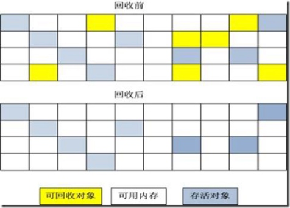
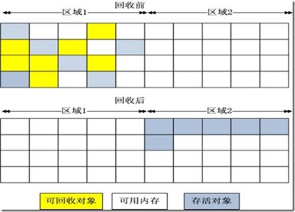
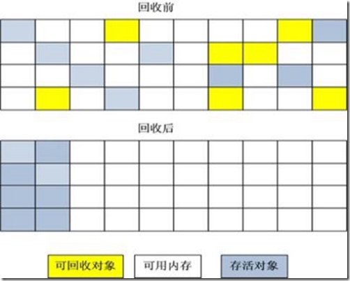
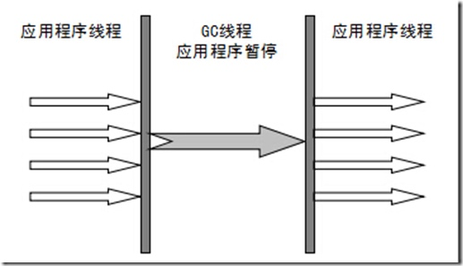
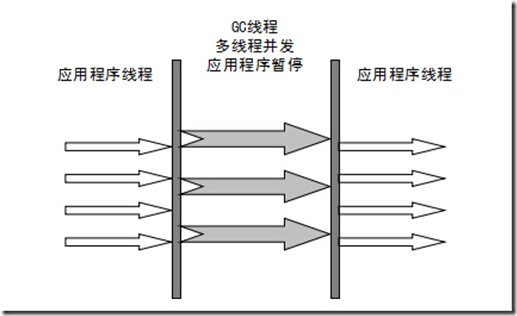
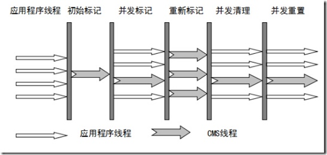
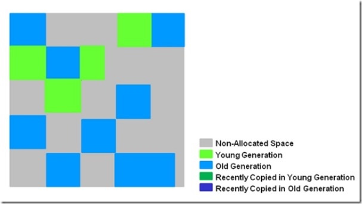
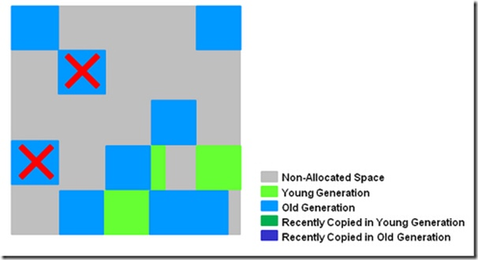
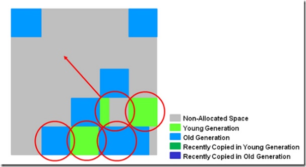
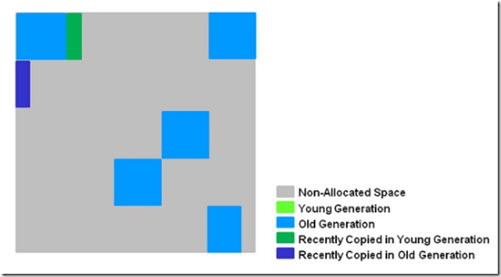

<h1 align="center">Java的内存回收机制详解</h1>

说到java内存回收机制，就得先说内存回收的意义。

#### 1 垃圾回收的意义
在C++中，对象所占的内存在程序结束运行之前一直被占用，在明确释放之前不能分配给其它对象；而在Java中，当没有对象引用指向原先分配给某个对象的内存时，该内存便成为垃圾。JVM的一个系统级线程会自动释放该内存块。垃圾回收意味着程序不再需要的对象是"无用信息"，这些信息将被丢弃。当一个对象不再被引用的时候，内存回收它占领的空间，以便空间被后来的新对象使用。事实上，除了释放没用的对象，垃圾回收也可以清除内存记录碎片。由于创建对象和垃圾回收器释放丢弃对象所占的内存空间，内存会出现碎片。碎片是分配给对象的内存块之间的空闲内存洞。碎片整理将所占用的堆内存移到堆的一端，JVM将整理出的内存分配给新的对象。

　　垃圾回收能自动释放内存空间，减轻编程的负担。这使Java 虚拟机具有一些优点。首先，它能使编程效率提高。在没有垃圾回收机制的时候，可能要花许多时间来解决一个难懂的存储器问题。在用Java语言编程的时候，靠垃圾回收机制可大大缩短时间。其次是它保护程序的完整性， 垃圾回收是Java语言安全性策略的一个重要部份。
　　
　　垃圾回收的一个潜在的缺点是它的开销影响程序性能。Java虚拟机必须追踪运行程序中有用的对象，而且最终释放没用的对象。这一个过程需要花费处理器的时间。其次垃圾回收算法的不完备性，早先采用的某些垃圾回收算法就不能保证100%收集到所有的废弃内存。当然随着垃圾回收算法的不断改进以及软硬件运行效率的不断提升，这些问题都可以迎刃而解。

GC( Garbage Collection)主要从GC算法和垃圾收集器去分析

#### 2 GC算法分析

Java语言规范没有明确地说明JVM使用哪种垃圾回收算法，但是任何一种垃圾回收算法一般要做2件基本的事情：（1）发现无用信息对象；（2）回收被无用对象占用的内存空间，使该空间可被程序再次使用。

　　大多数垃圾回收算法使用了根集(root set)这个概念；所谓根集就是正在执行的Java程序可以访问的引用变量的集合(包括局部变量、参数、类变量)，程序可以使用引用变量访问对象的属性和调用对象的方法。垃圾回收首先需要确定从根开始哪些是可达的和哪些是不可达的，从根集可达的对象都是活动对象，它们不能作为垃圾被回收，这也包括从根集间接可达的对象。而根集通过任意路径不可达的对象符合垃圾收集的条件，应该被回收。下面介绍几个常用的算法。

##### 标记 -清除算法
   “标记-清除”（Mark-Sweep）算法，如它的名字一样，算法分为“标记”和“清除”两个阶段：首先标记出所有需要回收的对象，在标记完成后统一回收掉所有被标记的对象。之所以说它是最基础的收集算法，是因为后续的收集算法都是基于这种思路并对其缺点进行改进而得到的。
它的主要缺点有两个：一个是效率问题，标记和清除过程的效率都不高；另外一个是空间问题，标记清除之后会产生大量不连续的内存碎片，空间碎片太多可能会导致，当程序在以后的运行过程中需要分配较大对象时无法找到足够的连续内存而不得不提前触发另一次垃圾收集动作。



##### 复制算法
“复制”（Copying）的收集算法，它将可用内存按容量划分为大小相等的两块，每次只使用其中的一块。当这一块的内存用完了，就将还存活着的对象复制到另外一块上面，然后再把已使用过的内存空间一次清理掉。
这样使得每次都是对其中的一块进行内存回收，内存分配时也就不用考虑内存碎片等复杂情况，只要移动堆顶指针，按顺序分配内存即可，实现简单，运行高效。只是这种算法的代价是将内存缩小为原来的一半，持续复制长生存期的对象则导致效率降低。



##### 标记-压缩算法
复制收集算法在对象存活率较高时就要执行较多的复制操作，效率将会变低。更关键的是，如果不想浪费50%的空间，就需要有额外的空间进行分配担保，以应对被使用的内存中所有对象都100%存活的极端情况，所以在老年代一般不能直接选用这种算法。
根据老年代的特点，有人提出了另外一种“标记-整理”（Mark-Compact）算法，标记过程仍然与“标记-清除”算法一样，但后续步骤不是直接对可回收对象进行清理，而是让所有存活的对象都向一端移动，然后直接清理掉端边界以外的内存



##### 分代收集算法
GC分代的基本假设：绝大部分对象的生命周期都非常短暂，存活时间短。
“分代收集”（Generational Collection）算法，把Java堆分为新生代和老年代，这样就可以根据各个年代的特点采用最适当的收集算法。在新生代中，每次垃圾收集时都发现有大批对象死去，只有少量存活，那就选用复制算法，只需要付出少量存活对象的复制成本就可以完成收集。而老年代中因为对象存活率高、没有额外空间对它进行分配担保，就必须使用“标记-清理”或“标记-整理”算法来进行回收。

 **说到这里顺便补充下关于新生代，老年代，持久代的定义：**

##### 年轻代（Young Generation）

1.所有新生成的对象首先都是放在年轻代的。年轻代的目标就是尽可能快速的收集掉那些生命周期短的对象。

2.新生代内存按照8:1:1的比例分为一个eden区和两个survivor(survivor0,survivor1)区。一个Eden区，两个 Survivor区(一般而言)。大部分对象在Eden区中生成。回收时先将eden区存活对象复制到一个survivor0区，然后清空eden区，当这个survivor0区也存放满了时，则将eden区和survivor0区存活对象复制到另一个survivor1区，然后清空eden和这个survivor0区，此时survivor0区是空的，然后将survivor0区和survivor1区交换，即保持survivor1区为空， 如此往复。

3.当survivor1区不足以存放 eden和survivor0的存活对象时，就将存活对象直接存放到老年代。若是老年代也满了就会触发一次Full GC，也就是新生代、老年代都进行回收

4.新生代发生的GC也叫做Minor GC，MinorGC发生频率比较高(不一定等Eden区满了才触发)

##### 年老代（Old Generation）
1.在年轻代中经历了N次垃圾回收后仍然存活的对象，就会被放到年老代中。因此，可以认为年老代中存放的都是一些生命周期较长的对象。

2.内存比新生代也大很多(大概比例是1:2)，当老年代内存满时触发Major GC即Full GC，Full GC发生频率比较低，老年代对象存活时间比较长，存活率标记高。

##### 持久代（Permanent Generation）
用于存放静态文件，如Java类、方法等。持久代对垃圾回收没有显著影响，但是有些应用可能动态生成或者调用一些class，例如Hibernate 等，在这种时候需要设置一个比较大的持久代空间来存放这些运行过程中新增的类。

#### 3 GC收集器

##### Serial收集器
串行收集器是最古老，最稳定以及效率高的收集器，可能会产生较长的停顿，只使用一个线程去回收。新生代、老年代使用串行回收；新生代复制算法、老年代标记-压缩；垃圾收集的过程中会Stop The World（服务暂停）
参数控制：-XX:+UseSerialGC  串行收集器



 

##### ParNew收集器
ParNew收集器其实就是Serial收集器的多线程版本。新生代并行，老年代串行；新生代复制算法、老年代标记-压缩


 

##### Parallel收集器
Parallel Scavenge收集器类似ParNew收集器，Parallel收集器更关注系统的吞吐量。可以通过参数来打开自适应调节策略，虚拟机会根据当前系统的运行情况收集性能监控信息，动态调整这些参数以提供最合适的停顿时间或最大的吞吐量；也可以通过参数控制GC的时间不大于多少毫秒或者比例；新生代复制算法、老年代标记-压缩
参数控制：-XX:+UseParallelGC  使用Parallel收集器+ 老年代串行
         
##### Parallel Old 收集器
Parallel Old是Parallel Scavenge收集器的老年代版本，使用多线程和“标记－整理”算法。这个收集器是在JDK 1.6中才开始提供
参数控制： -XX:+UseParallelOldGC 使用Parallel收集器+ 老年代并行

##### CMS收集器
CMS（Concurrent Mark Sweep）收集器是一种以获取最短回收停顿时间为目标的收集器。目前很大一部分的Java应用都集中在互联网站或B/S系统的服务端上，这类应用尤其重视服务的响应速度，希望系统停顿时间最短，以给用户带来较好的体验。
从名字（包含“Mark Sweep”）上就可以看出CMS收集器是基于“标记-清除”算法实现的，它的运作过程相对于前面几种收集器来说要更复杂一些，整个过程分为4个步骤，包括： 

初始标记（CMS initial mark）
并发标记（CMS concurrent mark）
重新标记（CMS remark）
并发清除（CMS concurrent sweep）

 其中初始标记、重新标记这两个步骤仍然需要“Stop The World”。初始标记仅仅只是标记一下GC Roots能直接关联到的对象，速度很快，并发标记阶段就是进行GC Roots Tracing的过程，而重新标记阶段则是为了修正并发标记期间，因用户程序继续运作而导致标记产生变动的那一部分对象的标记记录，这个阶段的停顿时间一般会比初始标记阶段稍长一些，但远比并发标记的时间短。 

      由于整个过程中耗时最长的并发标记和并发清除过程中，收集器线程都可以与用户线程一起工作，所以总体上来说，CMS收集器的内存回收过程是与用户线程一起并发地执行。老年代收集器（新生代使用ParNew）
  优点:并发收集、低停顿 
   缺点：产生大量空间碎片、并发阶段会降低吞吐量



##### G1收集器
G1是目前技术发展的最前沿成果之一，HotSpot开发团队赋予它的使命是未来可以替换掉JDK1.5中发布的CMS收集器。与CMS收集器相比G1收集器有以下特点：
1. 空间整合，G1收集器采用标记整理算法，不会产生内存空间碎片。分配大对象时不会因为无法找到连续空间而提前触发下一次GC。
2. 可预测停顿，这是G1的另一大优势，降低停顿时间是G1和CMS的共同关注点，但G1除了追求低停顿外，还能建立可预测的停顿时间模型，能让使用者明确指定在一个长度为N毫秒的时间片段内，消耗在垃圾收集上的时间不得超过N毫秒，这几乎已经是实时Java（RTSJ）的垃圾收集器的特征了。
上面提到的垃圾收集器，收集的范围都是整个新生代或者老年代，而G1不再是这样。使用G1收集器时，Java堆的内存布局与其他收集器有很大差别，它将整个Java堆划分为多个大小相等的独立区域（Region），虽然还保留有新生代和老年代的概念，但新生代和老年代不再是物理隔阂了，它们都是一部分（可以不连续）Region的集合。



G1的新生代收集跟ParNew类似，当新生代占用达到一定比例的时候，开始出发收集。和CMS类似，G1收集器收集老年代对象会有短暂停顿。

##### 收集步骤：
1、标记阶段，首先初始标记(Initial-Mark),这个阶段是停顿的(Stop the World Event)，并且会触发一次普通Mintor GC。对应GC log:GC pause (young) (inital-mark)

2、Root Region Scanning，程序运行过程中会回收survivor区(存活到老年代)，这一过程必须在young GC之前完成。

3、Concurrent Marking，在整个堆中进行并发标记(和应用程序并发执行)，此过程可能被young GC中断。在并发标记阶段，若发现区域对象中的所有对象都是垃圾，那个这个区域会被立即回收(图中打X)。同时，并发标记过程中，会计算每个区域的对象活性(区域中存活对象的比例)。




4、Remark, 再标记，会有短暂停顿(STW)。再标记阶段是用来收集 并发标记阶段 产生新的垃圾(并发阶段和应用程序一同运行)；G1中采用了比CMS更快的初始快照算法:snapshot-at-the-beginning (SATB)。

5、Copy/Clean up，多线程清除失活对象，会有STW。G1将回收区域的存活对象拷贝到新区域，清除Remember Sets，并发清空回收区域并把它返回到空闲区域链表中。




6、复制/清除过程后。回收区域的活性对象已经被集中回收到深蓝色和深绿色区域。


 

##### 关于收集器的小的总结：
**Serial收集器（复制算法)**
新生代单线程收集器，标记和清理都是单线程，优点是简单高效。
**Serial Old收集器(标记-整理算法)**
老年代单线程收集器，Serial收集器的老年代版本。
**ParNew收集器(停止-复制算法)　**
新生代收集器，可以认为是Serial收集器的多线程版本,在多核CPU环境下有着比Serial更好的表现。
**Parallel Scavenge收集器(停止-复制算法)**
并行收集器，追求高吞吐量，高效利用CPU。吞吐量一般为99%， 吞吐量= 用户线程时间/(用户线程时间+GC线程时间)。适合后台应用等对交互相应要求不高的场景。
**Parallel Old收集器(停止-复制算法)**
Parallel Scavenge收集器的老年代版本，并行收集器，吞吐量优先
**CMS(Concurrent Mark Sweep)收集器（标记-清理算法）**
高并发、低停顿，追求最短GC回收停顿时间，cpu占用比较高，响应时间快，停顿时间短，多核cpu 追求高响应时间的选择
由于对象进行了分代处理，因此垃圾回收区域、时间也不一样。GC有两种类型：Scavenge GC和Full GC。
**Scavenge GC**
一般情况下，当新对象生成，并且在Eden申请空间失败时，就会触发Scavenge GC，对Eden区域进行GC，清除非存活对象，并且把尚且存活的对象移动到Survivor区。然后整理Survivor的两个区。这种方式的GC是对年轻代的Eden区进行，不会影响到年老代。因为大部分对象都是从Eden区开始的，同时Eden区不会分配的很大，所以Eden区的GC会频繁进行。因而，一般在这里需要使用速度快、效率高的算法，使Eden去能尽快空闲出来。
**Full GC**
对整个堆进行整理，包括Young、Tenured和Perm。Full GC因为需要对整个堆进行回收，所以比Scavenge GC要慢，因此应该尽可能减少Full GC的次数。在对JVM调优的过程中，很大一部分工作就是对于FullGC的调节。有如下原因可能导致Full GC：
1.年老代（Tenured）被写满
2.持久代（Perm）被写满
3.System.gc()被显示调用
4.上一次GC之后Heap的各域分配策略动态变化

##### Java有了GC同样会出现内存泄露问题

1.静态集合类像HashMap、Vector等的使用最容易出现内存泄露，这些静态变量的生命周期和应用程序一致，所有的对象Object也不能被释放，因为他们也将一直被Vector等应用着。
```java
Static Vector v = new Vector();
for (int i = 1; i<100; i++) {
    Object o = new Object();
    v.add(o);
    o = null;
}
```

在这个例子中，代码栈中存在Vector 对象的引用 v 和 Object 对象的引用 o 。在 For 循环中，我们不断的生成新的对象，然后将其添加到 Vector 对象中，之后将 o 引用置空。问题是当 o 引用被置空后，如果发生 GC，我们创建的 Object 对象是否能够被 GC 回收呢？答案是否定的。因为， GC 在跟踪代码栈中的引用时，会发现 v 引用，而继续往下跟踪，就会发现 v 引用指向的内存空间中又存在指向 Object 对象的引用。也就是说尽管o 引用已经被置空，但是 Object 对象仍然存在其他的引用，是可以被访问到的，所以 GC 无法将其释放掉。如果在此循环之后， Object 对象对程序已经没有任何作用，那么我们就认为此 Java 程序发生了内存泄漏。
2.各种连接，数据库连接，网络连接，IO连接等没有显示调用close关闭，不被GC回收导致内存泄露。
3.监听器的使用，在释放对象的同时没有相应删除监听器的时候也可能导致内存泄露。

参考：
[http://my.oschina.net/hosee/blog/644618](http://my.oschina.net/hosee/blog/644618)
[http://www.cnblogs.com/ityouknow/p/5614961.html](http://www.cnblogs.com/ityouknow/p/5614961.html)
[http://www.cnblogs.com/andy-zcx/p/5522836.html](http://www.cnblogs.com/andy-zcx/p/5522836.html)