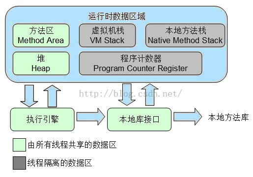
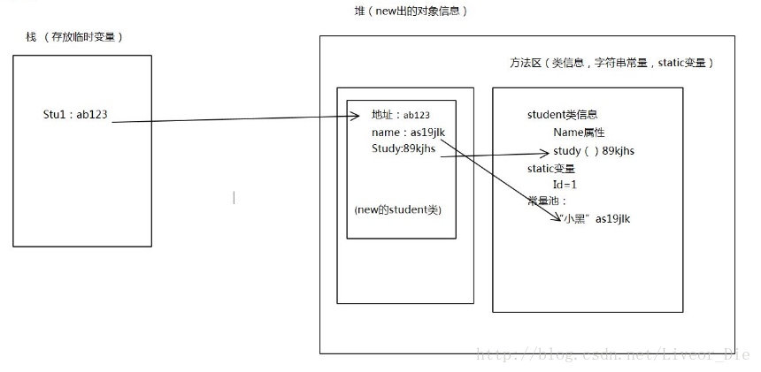
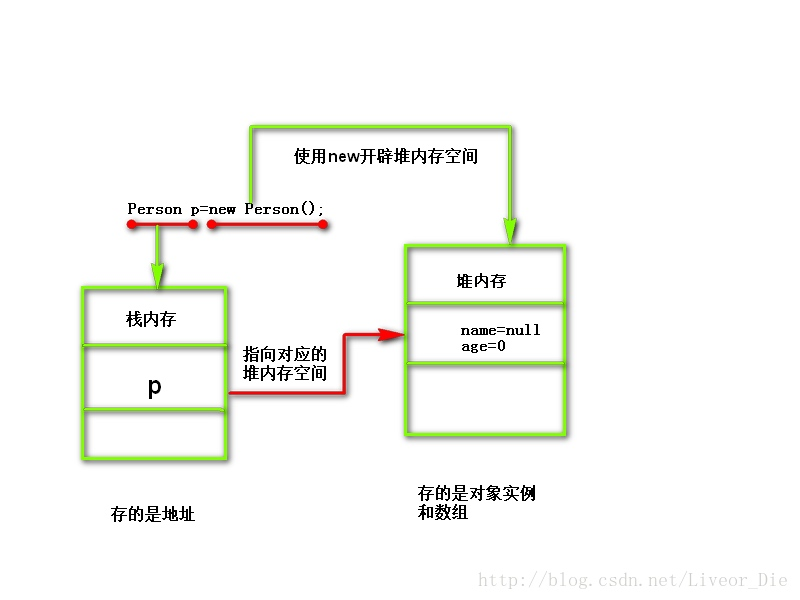
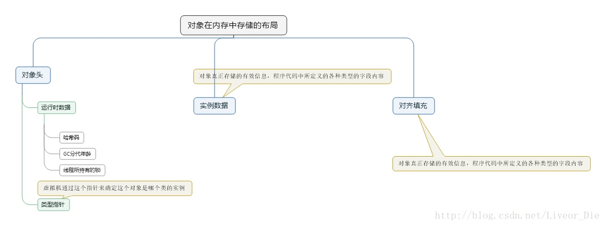
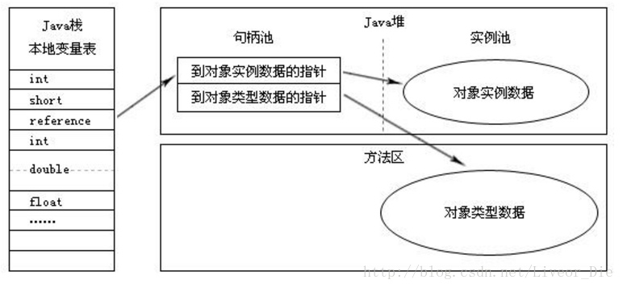
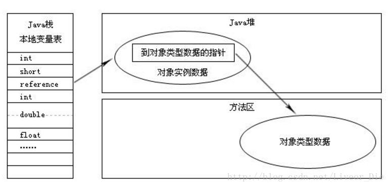
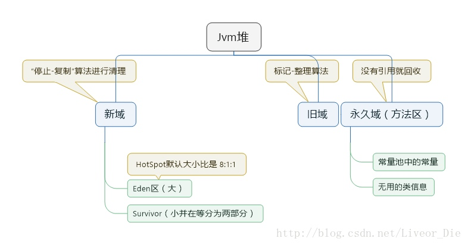

# java内存管理（堆、栈、方法区）

[TOC]

## 简介

首先我们要了解我们为什么要学习java虚拟机的内存管理，不是java的gc垃圾回收机制都帮我们释放了内存了吗？但是在写程序的过程中却也往往因为不懂内存管理而造成了一些不容易察觉到的内存问题，并且在内存问题出现的时候，也不能很快的定位并解决。因此，了解并掌握Java的内存管理是我们必须要做的是事，也只有这样才能写出更好的程序，更好地优化程序的性能。
## 概述
Java虚拟机在执行Java程序的过程中会把它所管理的内存划分为若干不同的数据区域，这些区域都有各自的用途以及创建和销毁的时间。Java虚拟机所管理的内存将会包括以下几个运行时数据区域，如下图所示：



我认为我们最重要的是了解栈内存（Stack）和堆内存（Heap）和方法区（Method Area）这三部分，这样我们对于初学者就简单了许多，也更容易我们理解
#### 程序计数器（了解）
程序计数器，可以看做是当前线程所执行的字节码的行号指示器。在虚拟机的概念模型里，字节码解释器工作就是通过改变程序计数器的值来选择下一条需要执行的字节码指令，分支、循环、跳转、异常处理、线程恢复等基础功能都要依赖这个计数器来完成。
#### Java虚拟机栈（了解）
Java虚拟机栈也是线程私有的 ，它的生命周期与线程相同。虚拟机栈描述的是Java方法执行的内存模型：每个方法在执行的同时都会创建一个栈帧用于存储局部变量表、操作数栈、动态链表、方法出口信息等。每一个方法从调用直至执行完成的过程，就对应着一个栈帧在虚拟机栈中入栈到出栈的过程。
局部变量表中存放了编译器可知的各种基本数据类型(boolean、byte、char、short、int、float、long、double)、对象引用和returnAddress类型(指向了一条字节码指令的地址)。 
如果扩展时无法申请到足够的内存，就会抛出OutOfMemoryError异常。
#### 本地方法栈（了解） 
本地方法栈与虚拟机的作用相似，不同之处在于虚拟机栈为虚拟机执行的Java方法服务，而本地方法栈则为虚拟机使用到的Native方法服务。有的虚拟机直接把本地方法栈和虚拟机栈合二为一。
会抛出stackOverflowError和OutOfMemoryError异常。
## Java堆
堆内存用来存放由new创建的对象实例和数组。（重点）
　　Java堆是所有线程共享的一块内存区域，在虚拟机启动时创建，此内存区域的唯一目的就是存放对象实例 。
　　Java堆是垃圾收集器管理的主要区域。由于现在收集器基本采用分代回收算法，所以Java堆还可细分为：新生代和老年代。从内存分配的角度来看，线程共享的Java堆中可能划分出多个线程私有的分配缓冲区(TLAB)。
　　Java堆可以处于物理上不连续的内存空间，只要逻辑上连续的即可。在实现上，既可以实现固定大小的，也可以是扩展的。
　　如果堆中没有内存完成实例分配，并且堆也无法完成扩展时，将会抛出OutOfMemoryError异常。
## Java栈
在栈内存中保存的是堆内存空间的访问地址，或者说栈中的变量指向堆内存中的变量（Java中的指针）（重点）。
　　Java栈是Java方法执行的内存模型每个方法在执行的同时都会创建一个栈帧的用于存储局部变量表、操作数栈、动态链接、方法出口等信息。每个方法从调用直至执行完成的过程就对应着一个栈帧在虚拟机中入栈和出栈的过程。

## 堆和栈的联系
当在堆中产生了一个数组或者对象时，可以在栈中定义一个特殊的变量，让栈中的这个变量的取值等于数组或对象在堆内存中的首地址，栈中的这个变量就成了数组或对象的引用变量，以后就可以在程序中使用栈中的引用变量来访问堆中的数组或者对象，引用变量就相当于是为数组或者对象起的一个名称。引用变量是普通的变量，定义时在栈中分配，引用变量在程序运行到其作用域之外后被释放。而数组和对象本身在堆中分配，即使程序运行到使用new产生数组或者对象的语句所在的代码块之外，数组和对象本身占据的内存不会被释放，数组和对象在没有引用变量指向它的时候，才变为垃圾，不能在被使用，但仍然占据内存空间不放，在随后的一个不确定的时间被垃圾回收器收走（释放掉）。例如：


由上图我们知道，对象名称p被保存在了栈内存中，具体实例保存在堆内存中。也就是说，在栈内存中保存的是堆内存空间的访问地址，或者说栈中的变量指向堆内存中的变量（Java中的指针）。
## 堆和栈的比较
从堆和栈的功能和作用来通俗的比较,堆主要用来存放对象的，栈主要是用来执行程序的.而这种不同又主要是由于堆和栈的特点决定的:
　　在编程中，例如C/C++中，所有的方法调用都是通过栈来进行的,所有的局部变量,形式参数都是从栈中分配内存空间的。实际上也不是什么分配,只是从栈顶向上用就行,就好像工厂中的传送带一样,Stack Pointer会自动指引你到放东西的位置,你所要做的只是把东西放下来就行.退出函数的时候，修改栈指针就可以把栈中的内容销毁.这样的模式速度最快, 当然要用来运行程序了.需要注意的是,在分配的时候,比如为一个即将要调用的程序模块分配数据区时,应事先知道这个数据区的大小,也就说是虽然分配是在程序运行时进行的,但是分配的大小多少是确定的,不变的,而这个”大小多少”是在编译时确定的,不是在运行时.
　　堆是应用程序在运行的时候请求操作系统分配给自己内存，由于从操作系统管理的内存分配,所以在分配和销毁时都要占用时间，因此用堆的效率非常低.但是堆的优点在于,编译器不必知道要从堆里分配多少存储空间，也不必知道存储的数据要在堆里停留多长的时间,因此,用堆保存数据时会得到更大的灵活性。事实上,面向对象的多态性,堆内存分配是必不可少的,因为多态变量所需的存储空间只有在运行时创建了对象之后才能确定.在C++中，要求创建一个对象时，只需用 new命令编制相关的代码即可。执行这些代码时，会在堆里自动进行数据的保存.当然，为达到这种灵活性，必然会付出一定的代价:在堆里分配存储空间时会花掉更长的时间。

## 方法区
方法区是各个线程共享的内存区域，它用于存储已被虚拟机加载的类信息、常量、静态变量、即时编译器编译后的代码等数据 （重点）。
　　相对而言，垃圾收集行为在这个区域比较少出现，但并非数据进了方法区就永久的存在了，这个区域的内存回收目标主要是针对常量池的回收和对类型的卸载，
　　当方法区无法满足内存分配需要时，将抛出OutOfMemoryError异常。
　　运行时常量池：是方法区的一部分，它用于存放编译期生成的各种字面量和符号引用。



## 对象管理机制
接下来探讨以hotspot虚拟机在Java堆中对象分配、布局和访问的全过程。
#### 对象创建

创建一个对象通常是需要new关键字，当虚拟机遇到一条new指令时，首先检查这个指令的参数是否在常量池中定位到一个类的符号引用，并且检查这个符号引用代表的类是否已被加载、解析和初始化过。如果那么执行相应的类加载过程。
　　类加载检查通过后，虚拟机将为新生对象分配内存。为对象分配空间的任务等同于把一块确定大小的内存从Java堆中划分出来。
　　分配的方式有两种：
　　　一种叫 指针碰撞 ，假设Java堆中内存是绝对规整的，用过的和空闲的内存各在一边，中间放着一个指针作为分界点的指示器，分配内存就是把那个指针向空闲空间的那边挪动一段与对象大小相等的距离。
　　　另一种叫 空闲列表 ：如果Java堆中的内存不是规整的，虚拟机就需要维护一个列表，记录哪个内存块是可用的，在分配的时候从列表中找到一块足够大的空间划分给对象实例，并更新列表上的记录。
　　采用哪种分配方式是由*Java堆是否规整决定的，而Java堆是否规整是由所采用的垃圾收集器是否带有压缩整理功能决定的。 另 外一个需要考虑的问题就是对象创建时的线程安全问题*，有两种解决方案：一是对分配内存空间的动作进行同步处理；另一种是吧内存分配的动作按照线程划分在不 同的空间之中进行，即每个线程在Java堆中预先分配一小块内存(TLAB)，哪个线程要分配内存就在哪个线程的TLAB上分配，只有TLAB用完并分配 新的TLAB时才需要同步锁定。
　　内存分配完成后，虚拟机需要将分配到的内存空间初始化为零值。这一步操作保证了对象的实例字段在Java代码中可以不赋初始值就可以直接使用。
　　接下来虚拟机要对对象进行必要的设置，例如这个对象是哪个类的实例、如何才能找到类的元数据信息等，这些信息存放在对象的对象头中。
　　上面的工作都完成以后，从虚拟机的角度来看一个新的对象已经产生了。但是从Java程序的角度，还需要执行init方法，把对象按照程序员的意愿进行初始化，这样一个真正可用的对象才算完全产生出来。
执行过程如图：（这是简化过程）



## 对象的内存布局
在HotSpot虚拟机中，对象在内存中存储的布局可分为三个部分： 对象头、实例数据和对齐填充。
　　对象头包括两个部分：第一部分用于存储对象自身的运行时数据，如哈希码、GC分代年龄、线程所持有的锁等。官方称之为“Mark Word”。第二个部分为是类型指针，即对象指向它的类元数据的指针，虚拟机通过这个指针来确定这个对象是哪个类的实例。
　　实例数据是对象真正存储的有效信息，也是程序代码中所定义的各种类型的字段内容。
　　对齐填充并不是必然存在的，仅仅起着占位符的作用。、Hotpot VM要求对象起始地址必须是8字节的整数倍，对象头部分正好是8字节的倍数，所以当实例数据部分没有对齐时，需要通过对齐填充来对齐。



## 对象的访问定位
Java程序通过栈上的reference数据来操作堆上的具体对象。目前主流的访问方式由“使用句柄”和“直接指针”。
　　如果使用句柄访问的话，Java堆中将会划分出一块内存来作为句柄池，reference中存储的就是对象的句柄地址，而句柄中包含了对象实例数据与类型数据的具体各自的地址信息。如下图：



如果使用直接指针访问的话，Java堆对象的布局中就必须考虑如何放置访问类型数据的相关信息，reference中存储的直接就是对象地址，如下图：


对比
　　使用句柄来访问的最大好处就是reference中存储的是稳定句柄地址，在对象被移动（垃圾收集时移动对象是非常普遍的行为）时只会改变句柄中的实例数据指针，而reference本身不需要被修改。
　　使用直接指针来访问最大的好处就是速度更快，它节省了一次指针定位的时间开销，由于对象访问的在Java中非常频繁，因此这类开销积小成多也是一项非常可观的执行成本。
## Java GC机制
Java GC（Garbage Collection，垃圾收集，垃圾回收）机制，是Java与C++/C的主要区别之一，作为Java开发者，一般不需要专门编写内存回收和垃圾清理代 码，对内存泄露和溢出的问题，也不需要像C程序员那样战战兢兢。这是因为在Java虚拟机中，存在自动内存管理和垃圾清扫机制。概括地说，该机制对 JVM（Java Virtual Machine）中的内存进行标记，并确定哪些内存需要回收，根据一定的回收策略，自动的回收内存，永不停息（Nerver Stop）的保证JVM中的内存空间，放置出现内存泄露和溢出问题。
　gc回收的是无用对象，而对象创建后再jvm堆中所以我们要先来看jvm堆 
JVM堆分为
* 　　(1) 新域：存储所有新成生的对象(使用“停止-复制”算法进行清理)
    * 新生代内存分为2部分，1部分 Eden区较大，1部分Survivor比较小，并被划分为两个等量的部分。
* 　　(2) 旧域：新域中的对象，经过了一定次数的GC循环后，被移入旧域(算法是标记-整理算法)
* 　　(3)永久域：存储类和方法对象，从配置的角度看，这个域是独立的，不包括在JVM堆内。默认为4M。
    * 方法区（永久域）： 
    永久域的回收有两种：常量池中的常量，无用的类信息，常量的回收很简单，没有引用了就可以被回收。对于无用的类进行回收，必须保证3点：
    * 类的所有实例都已经被回收
    * 加载类的ClassLoader已经被回收
    * 类对象的Class对象没有被引用（即没有通过反射引用该类的地方）
    永久代的回收并不是必须的，可以通过参数来设置是否对类进行回收。
    示例图：
    

## Gc 流程
* 当eden满了，触发young GC；
* young GC做2件事：一，去掉一部分没用的object；二，把老的还被引用的object发到survior里面，等下几次GC以后，survivor再放到old里面。
* 当old满了，触发full GC。full GC很消耗内存，把old，young里面大部分垃圾回收掉。这个时候用户线程都会被block。
再具体旧不会了，大概理解下它的流程就好了，在向下理解就需要更深的知识现在就不分析了，等以后会了我会在写写关于这方面的
下面分享几个简单的gc题
#### 1 简述JVM垃圾回收机制
　参考答案
　　垃圾回收机制是Java提供的自动释放内存空间的机制。 
　　垃圾回收器（Garbage Collection，GC）是JVM自带的一个线程，用于回收没有被引用的对象。 
#### 2 Java程序是否会出现内存泄露
参考答案 
　　会出现内存泄漏。
　　一般来说内存泄漏有两种情况。一是在堆中分配的内存，在没有将其释放掉的时候，就将所有能访问这块内存的方式都删掉；另一种情况则是在内存对象明明已经不需要的时候，还仍然保留着这块内存和它的访问方式（引用）。第一种情况，在Java中已经由于垃圾回收机制的引入，得到了很好的解决。所以，Java中的内存泄漏，主要指的是第二种情况。
　　下面给出了一个简单的内存泄露的例子。在这个例子中，我们循环申请Object对象，并将所申请的对象放入一个List中，如果我们仅仅释放引用本身，那么List仍然引用该对象，所以这个对象对GC来说是不可回收的。代码如下所示：
　　

```java
	List list=new ArrayList(10);
    for (int i=1;i<100; i++)
    {
        Object o=new Object();
        list.add(o);
        o=null;    
    }
```

​    
　　此时，所有的Object对象都没有被释放，因为变量list引用这些对象。

### 3 JVM如何管理内存，分成几个部分？分别有什么用途？说出下面代码的内存实现原理：

```jade
Foo foo = new Foo(); 
foo.f();
```

参考答案
　　JVM内存分为“堆”、“栈”和“方法区”三个区域，分别用于存储不同的数据。 
　　堆内存用于存储使用new关键字所创建的对象；栈内存用于存储程序运行时在方法中声明的所有的局部变量；方法区用于存放类的信息，Java程序运行时，首先会通过类装载器载入类文件的字节码信息，经过解析后将其装入方法区。类的各种信息（包括方法）都在方法区存储。

```java
Foo foo = new Foo(); 
foo.f();
```


以上代码的内存实现原理为： 
　　1.Foo类首先被装载到JVM的方法区，其中包括类的信息，包括方法和构造等。 
　　2.在栈内存中分配引用变量foo。 
　　3.在堆内存中按照Foo类型信息分配实例变量内存空间；然后，将栈中引用foo指向foo对象堆内存的首地址。 
　　4.使用引用foo调用方法，根据foo引用的类型Foo调用f方法。