# Java线程池-ThreadPoolExecutor源码解析(基于Java8)


ExecutorService接口的两个主要的具体实现

它们都是某种线程池,可以控制线程创建,释放,并通过某种策略尝试复用线程去执行任务的一个管理框架
在Java8中,按照线程池的创建方法来看
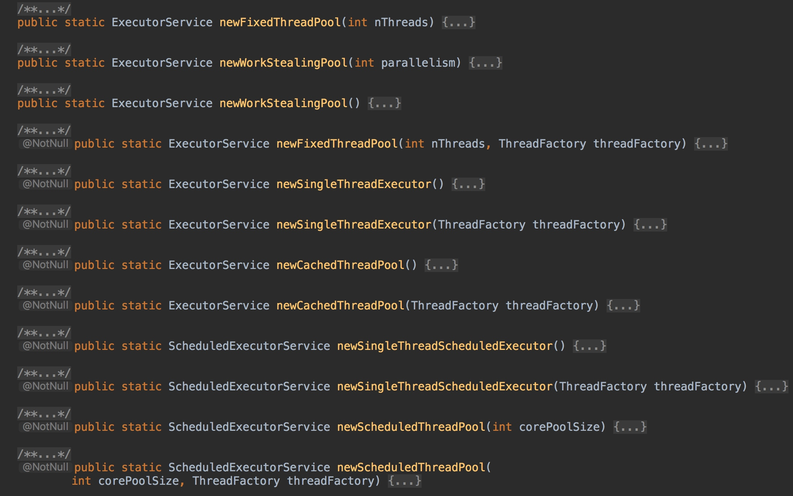


有五种线程池,创建方法如下
```java
ExecutorService singleThreadPool = Executors.newSingleThreadExecutor();
ExecutorService fixedThreadPool = Executors.newFixedThreadPool(5);
ExecutorService cachedThreadPool = Executors.newCachedThreadPool();
ScheduledExecutorService singleThreadScheduledPool = Executors.newSingleThreadScheduledExecutor();
ScheduledExecutorService scheduledPool = Executors.newScheduledThreadPool(5);
```

进一步查看源码发现,这些方法最终都调用了ThreadPoolExecutor和ScheduledExecutorService的构造函数
而ScheduledExecutorService继承自ThreadPoolExecutor,因此最终所有线程池的构造函数都调用了Java5后推出的ThreadPoolExecutor的如下构造函数
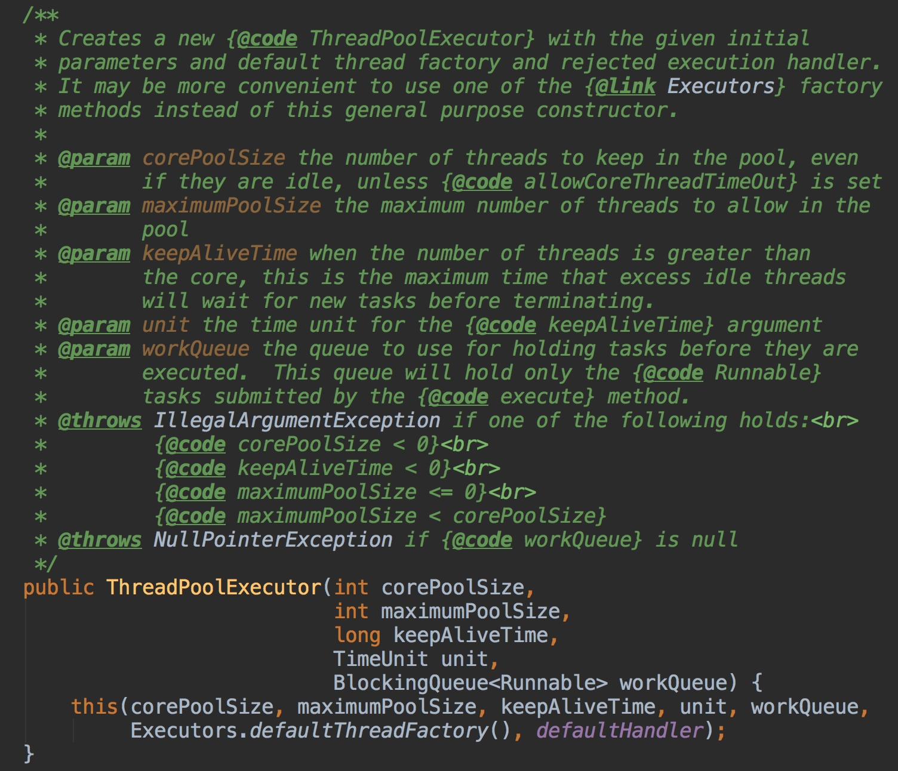

## Java默认提供的线程池
Java中的线程池是运用场景最多的并发框架,几乎所有需要异步或并发执行任务的程序都可以使用线程池

* new Thread弊端
  * 每次new Thread新对象，性能差
  * 线程缺乏统一管理，可能无限制的新建线程，相互竞争，有可能占用过多系统资源导致死机或者OOM
  * 缺少更多功能，如更多执行、定期执行、线程中断
* 重用存在的线程，减少对象创建、消亡的开销，性能佳
* 可有效控制最大并发线程数，提高系统资源利用率，同时可以避免过多资源竞争，避免阻塞
* 提供定时执行，定期执行，单线程并发数量控制等功能。

在开发中,合理地使用线程池能够带来3个好处
* 降低资源消耗通过重复利用已创建的线程,降低创建和销毁线程造成的系统资源消耗
* 提高响应速度当任务到达时,任务可以不需要等到线程创建就能立即执行
* 提高线程的可管理性线程是稀缺资源,如果过多地创建,不仅会消耗系统资源，还会降低系统的稳定性，导致使用线程池可以进行统一分配、调优和监控。
我们只需要将待执行的方法放入 run 方法中，将 Runnable 接口的实现类交给线程池的
execute 方法，作为他的一个参数，比如：
```java
Executor e=Executors.newSingleThreadExecutor();           
e.execute(new Runnable(){ //匿名内部类
     public  void run(){  
	//需要执行的任务 
     } 
}); 
```

## 1　线程池的实现原理
当向线程池提交一个任务之后,线程池是如何处理这个任务的呢?
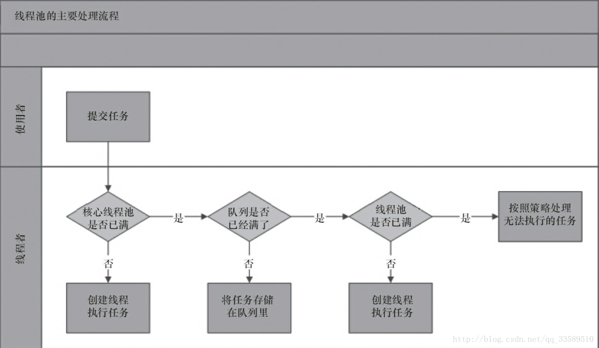

处理流程图
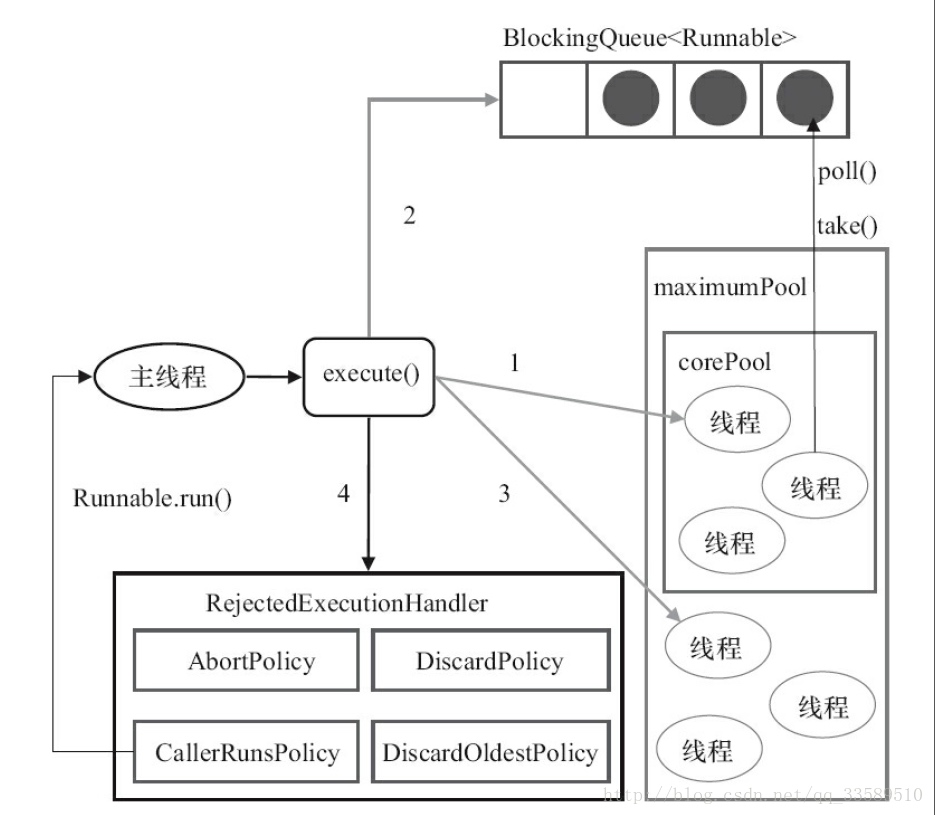

ThreadPoolExecutor执行execute()方法

ThreadPoolExecutor执行execute()分4种情况
* 若当前运行的线程少于corePoolSize,则创建新线程来执行任务(执行这一步需要获取全局锁)
* 若运行的线程多于或等于corePoolSize,则将任务加入BlockingQueue
* 若无法将任务加入BlockingQueue,则创建新的线程来处理任务(执行这一步需要获取全局锁)
* 若创建新线程将使当前运行的线程超出maximumPoolSize,任务将被拒绝,并调用RejectedExecutionHandler.rejectedExecution()
采取上述思路,是为了在执行execute()时,尽可能避免获取全局锁
在ThreadPoolExecutor完成预热之后（当前运行的线程数大于等于corePoolSize),几乎所有的execute()方法调用都是执行步骤2,而步骤2不需要获取全局锁
## 源码分析
上面的流程分析让我们很直观地了解了线程池的工作原理,让我们再通过源码来看看是如何实现的,线程池执行任务的方法如下

```java
   /**
     * Executes the given task sometime in the future.  The task
     * may execute in a new thread or in an existing pooled thread.
     *
     * If the task cannot be submitted for execution, either because this
     * executor has been shutdown or because its capacity has been reached,
     * the task is handled by the current {@code RejectedExecutionHandler}.
     *
     * @param command the task to execute
     * @throws RejectedExecutionException at discretion of
     *         {@code RejectedExecutionHandler}, if the task
     *         cannot be accepted for execution
     * @throws NullPointerException if {@code command} is null
     */
    public void execute(Runnable command) {
        if (command == null)
            throw new NullPointerException();
        /*
         * Proceed in 3 steps:
         *
         * 1. If fewer than corePoolSize threads are running, try to
         * start a new thread with the given command as its first
         * task.  The call to addWorker atomically checks runState and
         * workerCount, and so prevents false alarms that would add
         * threads when it shouldn't, by returning false.
         *
         * 2. If a task can be successfully queued, then we still need
         * to double-check whether we should have added a thread
         * (because existing ones died since last checking) or that
         * the pool shut down since entry into this method. So we
         * recheck state and if necessary roll back the enqueuing if
         * stopped, or start a new thread if there are none.
         *
         * 3. If we cannot queue task, then we try to add a new
         * thread.  If it fails, we know we are shut down or saturated
         * and so reject the task.
         */
        int c = ctl.get();
        // 如果线程数小于基本线程数，则创建线程并执行当前任务
        if (workerCountOf(c) < corePoolSize) {
            if (addWorker(command, true))
                return;
            c = ctl.get();
        }
        // 如线程数大于等于基本线程数或线程创建失败，则将当前任务放到工作队列中。
        if (isRunning(c) && workQueue.offer(command)) {
            int recheck = ctl.get();
            if (! isRunning(recheck) && remove(command))
                reject(command);
            else if (workerCountOf(recheck) == 0)
                addWorker(null, false);
        }
        else if (!addWorker(command, false))
            // 抛出RejectedExecutionException异常
            reject(command);
    }
```

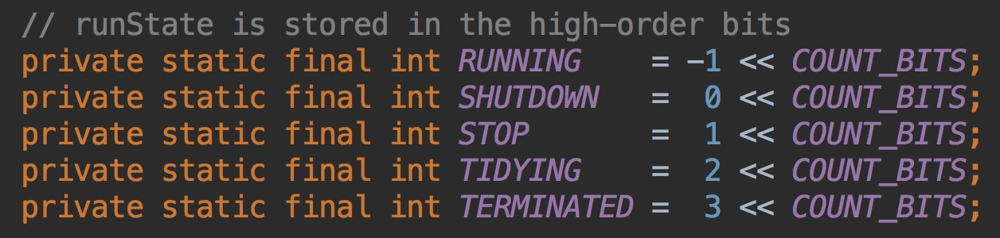


```java
   /**
     * 检查是否可以根据当前池状态和给定的边界（核心或最大)
     * 添加新工作线程。如果是这样,工作线程数量会相应调整，如果可能的话,一个新的工作线程创建并启动
     * 将firstTask作为其运行的第一项任务。
     * 如果池已停止此方法返回false
     * 如果线程工厂在被访问时未能创建线程,也返回false
     * 如果线程创建失败，或者是由于线程工厂返回null，或者由于异常（通常是在调用Thread.start（）后的OOM）），我们干净地回滚。
     *
     * @param core if true use corePoolSize as bound, else
     * maximumPoolSize. (A boolean indicator is used here rather than a
     * value to ensure reads of fresh values after checking other pool
     * state).
     * @return true if successful
     */
    private boolean addWorker(Runnable firstTask, boolean core) {
        retry:
        for (;;) {
            int c = ctl.get();
            int rs = runStateOf(c);
      
            
    /**
     * Check if queue empty only if necessary.
     * 
     * 如果线程池已关闭，并满足以下条件之一，那么不创建新的 worker：
     *      1. 线程池状态大于 SHUTDOWN，也就是 STOP, TIDYING, 或 TERMINATED
     *      2. firstTask != null
     *      3. workQueue.isEmpty()
     * 简单分析下：
     *      状态控制的问题，当线程池处于 SHUTDOWN ，不允许提交任务，但是已有任务继续执行
     *      当状态大于 SHUTDOWN ，不允许提交任务，且中断正在执行任务
     *      多说一句：若线程池处于 SHUTDOWN，但 firstTask 为 null，且 workQueue 非空，是允许创建 worker 的
     *  
     */
            if (rs >= SHUTDOWN &&
                ! (rs == SHUTDOWN &&
                   firstTask == null &&
                   ! workQueue.isEmpty()))
                return false;

            for (;;) {
                int wc = workerCountOf(c);
                if (wc >= CAPACITY ||
                    wc >= (core ? corePoolSize : maximumPoolSize))
                    return false;
                // 如果成功，那么就是所有创建线程前的条件校验都满足了，准备创建线程执行任务
                // 这里失败的话，说明有其他线程也在尝试往线程池中创建线程
                if (compareAndIncrementWorkerCount(c))
                    break retry;
                // 由于有并发，重新再读取一下 ctl
                c = ctl.get();  // Re-read ctl
                // 正常如果是 CAS 失败的话，进到下一个里层的for循环就可以了
                // 可如果是因为其他线程的操作，导致线程池的状态发生了变更，如有其他线程关闭了这个线程池
                // 那么需要回到外层的for循环
                if (runStateOf(c) != rs)
                    continue retry;
                // else CAS failed due to workerCount change; retry inner loop
            }
        }

     /* *
        * 到这里，我们认为在当前这个时刻，可以开始创建线程来执行任务
        */
         
        // worker 是否已经启动
        boolean workerStarted = false;
        // 是否已将这个 worker 添加到 workers 这个 HashSet 中
        boolean workerAdded = false;
        Worker w = null;
        try {
           // 把 firstTask 传给 worker 的构造方法
            w = new Worker(firstTask);
            // 取 worker 中的线程对象，Worker的构造方法会调用 ThreadFactory 来创建一个新的线程
            final Thread t = w.thread;
            if (t != null) {
               //先加锁
                final ReentrantLock mainLock = this.mainLock;
                // 这个是整个类的全局锁，持有这个锁才能让下面的操作“顺理成章”，
                // 因为关闭一个线程池需要这个锁，至少我持有锁的期间，线程池不会被关闭
                mainLock.lock();
                try {
                    // Recheck while holding lock.
                    // Back out on ThreadFactory failure or if
                    // shut down before lock acquired.
                    int rs = runStateOf(ctl.get());

                    // 小于 SHUTTDOWN 即 RUNNING
                    // 如果等于 SHUTDOWN，不接受新的任务，但是会继续执行等待队列中的任务
                    if (rs < SHUTDOWN ||
                        (rs == SHUTDOWN && firstTask == null)) {
                        // worker 里面的 thread 不能是已启动的
                        if (t.isAlive()) // precheck that t is startable
                            throw new IllegalThreadStateException();
                        // 加到 workers 这个 HashSet 中
                        workers.add(w);
                        int s = workers.size();
                        if (s > largestPoolSize)
                            largestPoolSize = s;
                        workerAdded = true;
                    }
                } finally {
                    mainLock.unlock();
                }
               // 若添加成功
                if (workerAdded) {
                    // 启动线程
                    t.start();
                    workerStarted = true;
                }
            }
        } finally {
            // 若线程没有启动，做一些清理工作，若前面 workCount 加了 1，将其减掉
            if (! workerStarted)
                addWorkerFailed(w);
        }
        // 返回线程是否启动成功
        return workerStarted;
    }
```

看下 addWorkFailed
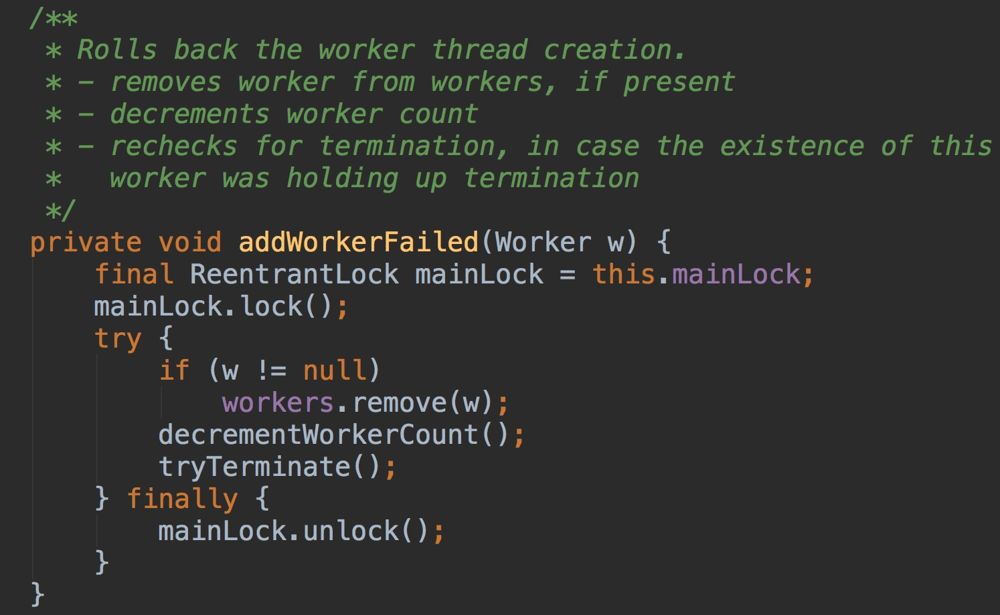

workers 中删除掉相应的 worker,workCount 减 1 private void addWor
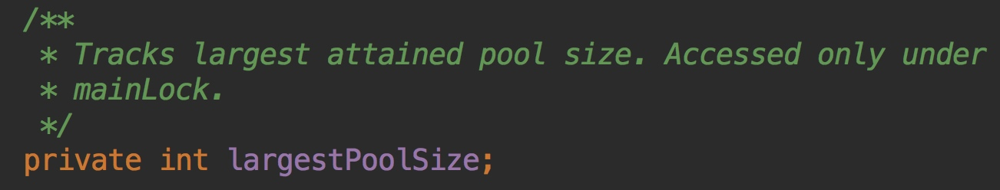

记录 workers 中的个数的最大值,因为 workers 是不断增加减少的，通过这个值可以知道线程池的大小曾经达到的最大值


worker中的线程 start后，其 run方法会调用 runWorker
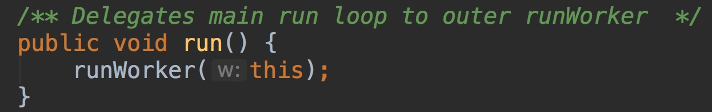


继续往下看 runWorker

```java
//  worker 线程启动后调用,while 循环(即自旋!)不断从等待队列获取任务并执行
//  worker 初始化时，可指定 firstTask，那么第一个任务也就可以不需要从队列中获取
final void runWorker(Worker w) {
    Thread wt = Thread.currentThread();
    // 该线程的第一个任务(若有)
    Runnable task = w.firstTask;
    w.firstTask = null;
    // 允许中断
    w.unlock(); 
 
    boolean completedAbruptly = true;
    try {
        // 循环调用 getTask 获取任务
        while (task != null || (task = getTask()) != null) {
            w.lock();          
            // 若线程池状态大于等于 STOP，那么意味着该线程也要中断
              /**
               * 若线程池STOP，请确保线程 已被中断
               * 如果没有，请确保线程未被中断
               * 这需要在第二种情况下进行重新检查，以便在关中断时处理shutdownNow竞争
               */
            if ((runStateAtLeast(ctl.get(), STOP) ||
                 (Thread.interrupted() &&
                  runStateAtLeast(ctl.get(), STOP))) &&
                !wt.isInterrupted())
                wt.interrupt();
            try {
                // 这是一个钩子方法，留给需要的子类实现
                beforeExecute(wt, task);
                Throwable thrown = null;
                try {
                    // 到这里终于可以执行任务了
                    task.run();
                } catch (RuntimeException x) {
                    thrown = x; throw x;
                } catch (Error x) {
                    thrown = x; throw x;
                } catch (Throwable x) {
                    // 这里不允许抛出 Throwable，所以转换为 Error
                    thrown = x; throw new Error(x);
                } finally {
                    // 也是一个钩子方法，将 task 和异常作为参数，留给需要的子类实现
                    afterExecute(task, thrown);
                }
            } finally {
                // 置空 task，准备 getTask 下一个任务
                task = null;
                // 累加完成的任务数
                w.completedTasks++;
                // 释放掉 worker 的独占锁
                w.unlock();
            }
        }
        completedAbruptly = false;
    } finally {
        // 到这里，需要执行线程关闭
        // 1. 说明 getTask 返回 null，也就是说，这个 worker 的使命结束了，执行关闭
        // 2. 任务执行过程中发生了异常
        //    第一种情况，已经在代码处理了将 workCount 减 1，这个在 getTask 方法分析中说
        //    第二种情况，workCount 没有进行处理，所以需要在 processWorkerExit 中处理
        processWorkerExit(w, completedAbruptly);
    }
}
```

看看 getTask()
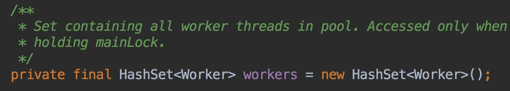

```java
// 此方法有三种可能
// 1. 阻塞直到获取到任务返回。默认 corePoolSize 之内的线程是不会被回收的，它们会一直等待任务
// 2. 超时退出。keepAliveTime 起作用的时候，也就是如果这么多时间内都没有任务，那么应该执行关闭
// 3. 如果发生了以下条件，须返回 null
//     池中有大于 maximumPoolSize 个 workers 存在(通过调用 setMaximumPoolSize 进行设置)
//     线程池处于 SHUTDOWN，而且 workQueue 是空的，前面说了，这种不再接受新的任务
//     线程池处于 STOP，不仅不接受新的线程，连 workQueue 中的线程也不再执行
private Runnable getTask() {
    boolean timedOut = false; // Did the last poll() time out?

   for (;;) {
   // 允许核心线程数内的线程回收，或当前线程数超过了核心线程数，那么有可能发生超时关闭
 
            // 这里 break，是为了不往下执行后一个 if (compareAndDecrementWorkerCount(c))
            // 两个 if 一起看：如果当前线程数 wc > maximumPoolSize，或者超时，都返回 null
            // 那这里的问题来了，wc > maximumPoolSize 的情况，为什么要返回 null？
            // 换句话说，返回 null 意味着关闭线程。
            // 那是因为有可能开发者调用了 setMaximumPoolSize 将线程池的 maximumPoolSize 调小了
        
            // 如果此 worker 发生了中断，采取的方案是重试
            // 解释下为什么会发生中断，这个读者要去看 setMaximumPoolSize 方法，
            // 如果开发者将 maximumPoolSize 调小了，导致其小于当前的 workers 数量，
            // 那么意味着超出的部分线程要被关闭。重新进入 for 循环，自然会有部分线程会返回 null
            int c = ctl.get();
            int rs = runStateOf(c);

            // Check if queue empty only if necessary.
            if (rs >= SHUTDOWN && (rs >= STOP || workQueue.isEmpty())) {
                // CAS 操作，减少工作线程数
                decrementWorkerCount();
                return null;
            }

            int wc = workerCountOf(c);

            // Are workers subject to culling?
            boolean timed = allowCoreThreadTimeOut || wc > corePoolSize;

            if ((wc > maximumPoolSize || (timed && timedOut))
                && (wc > 1 || workQueue.isEmpty())) {
                if (compareAndDecrementWorkerCount(c))
                    return null;
                continue;
            }

            try {
                Runnable r = timed ?
                    workQueue.poll(keepAliveTime, TimeUnit.NANOSECONDS) :
                    workQueue.take();
                if (r != null)
                    return r;
                timedOut = true;
            } catch (InterruptedException retry) {
            // 如果此 worker 发生了中断，采取的方案是重试
            // 解释下为什么会发生中断，这个读者要去看 setMaximumPoolSize 方法，
            // 如果开发者将 maximumPoolSize 调小了，导致其小于当前的 workers 数量，
            // 那么意味着超出的部分线程要被关闭。重新进入 for 循环，自然会有部分线程会返回 null
                timedOut = false;
            }
        }
}
```

到这里，基本上也说完了整个流程，回到 execute(Runnable command) 方法，看看各个分支，我把代码贴过来一下：
```java
/**
     * Executes the given task sometime in the future.  The task
     * may execute in a new thread or in an existing pooled thread.
     *
     * If the task cannot be submitted for execution, either because this
     * executor has been shutdown or because its capacity has been reached,
     * the task is handled by the current {@code RejectedExecutionHandler}.
     *
     * @param command the task to execute
     * @throws RejectedExecutionException at discretion of
     *         {@code RejectedExecutionHandler}, if the task
     *         cannot be accepted for execution
     * @throws NullPointerException if {@code command} is null
     */
    public void execute(Runnable command) {
        if (command == null)
            throw new NullPointerException();
        /*
         * Proceed in 3 steps:
         *
         * 1. If fewer than corePoolSize threads are running, try to
         * start a new thread with the given command as its first
         * task.  The call to addWorker atomically checks runState and
         * workerCount, and so prevents false alarms that would add
         * threads when it shouldn't, by returning false.
         *
         * 2. If a task can be successfully queued, then we still need
         * to double-check whether we should have added a thread
         * (because existing ones died since last checking) or that
         * the pool shut down since entry into this method. So we
         * recheck state and if necessary roll back the enqueuing if
         * stopped, or start a new thread if there are none.
         *
         * 3. If we cannot queue task, then we try to add a new
         * thread.  If it fails, we know we are shut down or saturated
         * and so reject the task.
         */
        //表示 “线程池状态” 和 “线程数” 的整数
        int c = ctl.get();
        // 如果当前线程数少于核心线程数，直接添加一个 worker 执行任务，
        // 创建一个新的线程，并把当前任务 command 作为这个线程的第一个任务(firstTask)
        if (workerCountOf(c) < corePoolSize) {
        // 添加任务成功，即结束
        // 执行的结果，会包装到 FutureTask 
        // 返回 false 代表线程池不允许提交任务
            if (addWorker(command, true))
                return;
           
            c = ctl.get();
        }

        // 到这说明，要么当前线程数大于等于核心线程数，要么刚刚 addWorker 失败
  
        // 如果线程池处于 RUNNING ，把这个任务添加到任务队列 workQueue 中
        if (isRunning(c) && workQueue.offer(command)) {
            /* 若任务进入 workQueue，我们是否需要开启新的线程
             * 线程数在 [0, corePoolSize) 是无条件开启新线程的
             * 若线程数已经大于等于 corePoolSize，则将任务添加到队列中，然后进到这里
             */
            int recheck = ctl.get();
            // 若线程池不处于 RUNNING ，则移除已经入队的这个任务，并且执行拒绝策略
            if (! isRunning(recheck) && remove(command))
                reject(command);
            // 若线程池还是 RUNNING ，且线程数为 0，则开启新的线程
            // 这块代码的真正意图：担心任务提交到队列中了，但是线程都关闭了
            else if (workerCountOf(recheck) == 0)
                addWorker(null, false);
        }
        // 若 workQueue 满，到该分支
        // 以 maximumPoolSize 为界创建新 worker，
        // 若失败，说明当前线程数已经达到 maximumPoolSize，执行拒绝策略
        else if (!addWorker(command, false))
            reject(command);
    }
```

工作线程:线程池创建线程时,会将线程封装成工作线程Worker,Worker在执行完任务后,还会循环获取工作队列里的任务来执行.我们可以从Worker类的run()方法里看到这点

```java
  public void run() {
        try {
            Runnable task = firstTask;
            firstTask = null;
            while (task != null || (task = getTask()) != null) {
                runTask(task);
                task = null;
            }
        } finally {
            workerDone(this);
        }
    }
 boolean workerStarted = false;
        boolean workerAdded = false;
        Worker w = null;
        try {
            w = new Worker(firstTask);

            final Thread t = w.thread;
            if (t != null) {
               //先加锁
                final ReentrantLock mainLock = this.mainLock;
                mainLock.lock();
                try {
                    // Recheck while holding lock.
                    // Back out on ThreadFactory failure or if
                    // shut down before lock acquired.
                    int rs = runStateOf(ctl.get());

                    if (rs < SHUTDOWN ||
                        (rs == SHUTDOWN && firstTask == null)) {
                        if (t.isAlive()) // precheck that t is startable
                            throw new IllegalThreadStateException();
                        workers.add(w);
                        int s = workers.size();
                        if (s > largestPoolSize)
                            largestPoolSize = s;
                        workerAdded = true;
                    }
                } finally {
                    mainLock.unlock();
                }
                if (workerAdded) {
                    t.start();
                    workerStarted = true;
                }
            }
        } finally {
            if (! workerStarted)
                addWorkerFailed(w);
        }
        return workerStarted;
    }
```
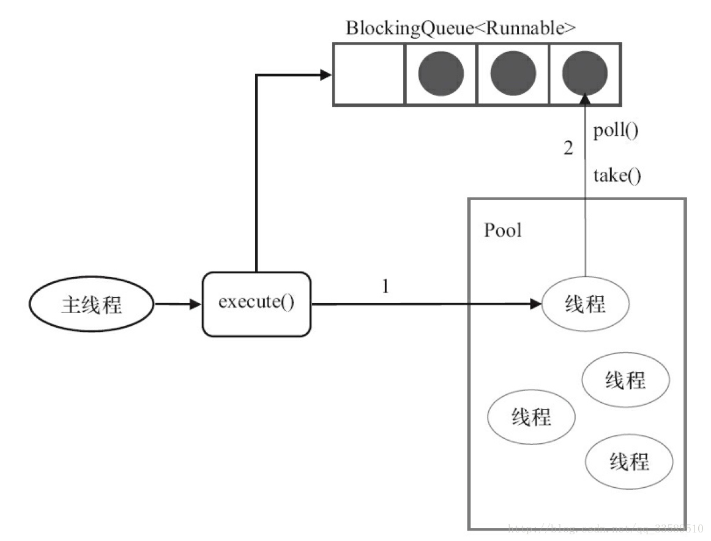


ThreadPoolExecutor中线程执行任务

线程池中的线程执行任务分两种情况
* 在execute()方法中创建一个线程时，会让这个线程执行当前任务
* 这个线程执行完上图中 1 的任务后，会反复从BlockingQueue获取任务来执行
## 2　线程池的使用
#### 2.1　线程池的创建
我们可以通过ThreadPoolExecutor来创建一个线程池
创建一个线程池时需要的参数
* corePoolSize(核心线程数量)：线程池中应该保持的主要线程的数量。即使线程处于空闲状态，除非设置了allowCoreThreadTimeOut这个参数，当提交一个任务到线程池时，若线程数量<corePoolSize，线程池会创建一个新线程放入works(一个HashSet)中执行任务，即使其他空闲的基本线程能够执行新任务也还是会创建新线程，等到需要执行的任务数大于线程池基本大小时就不再创建，会尝试放入等待队列workQueue(一个BlockingQueue)，如果调用了线程池的prestartAllCoreThreads()，线程池会提前创建并启动所有核心线程
* workQueue：存储待执行任务的阻塞队列，这些任务必须是Runnable的对象（如果是Callable对象，会在submit内部转换为Runnable对象）
* runnableTaskQueue(任务队列)：用于保存等待执行的任务的阻塞队列。可以选择以下几个阻塞队列。
    * LinkedBlockingQueue：一个基于链表结构的阻塞队列，此队列按FIFO排序元素，吞吐量通常要高于ArrayBlockingQueue。静态工厂方法Executors.newFixedThreadPool()使用了这个队列
    * SynchronousQueue：一个不存储元素的阻塞队列。每个插入操作必须等到另一个线程调用移除操作，否则插入操作一直处于阻塞状态，吞吐量通常要高于Linked-BlockingQueue，静态工厂方法Executors.newCachedThreadPool使用了这个队列
* maximumPoolSize（线程池最大线程数）：线程池允许创建的最大线程数。若队列满,并且已创建的线程数小于最大线程数，则线程池会再创建新的线程放入works中执行任务，CashedThreadPool的关键，固定线程数的线程池无效，若使用了无界任务队列，这个参数就没什么效果
* ThreadFactory：用于设置创建线程的工厂，可以通过线程工厂给每个创建出来的线程设置更有意义的名字。使用开源框架guava提供ThreadFactoryBuilder可以快速给线程池里的线程设置有意义的名字，代码如下
new ThreadFactoryBuilder().setNameFormat("XX-task-%d").build()；

* RejectedExecutionHandler（饱和策略）：当队列和线程池都满，说明线程池处于饱和，必须采取一种策略处理提交的新任务。策略默认AbortPolicy，表无法处理新任务时抛出异常。在JDK 1.5中Java线程池框架提供了以下4种策略
    * AbortPolicy：丢弃任务，抛出 RejectedExecutionException
    * CallerRunsPolicy：只用调用者所在线程来运行任务，有反馈机制，使任务提交的速度变慢。
    * DiscardOldestPolicy：若没有发生shutdown，尝试丢弃队列里最近的一个任务，并执行当前任务，丢弃任务缓存队列中最老的任务，并且尝试重新提交新的任务
    * DiscardPolicy：不处理,丢弃掉, 拒绝执行，不抛异常
    当然，也可以根据应用场景需要来实现RejectedExecutionHandler接口自定义策略。如记录日志或持久化存储不能处理的任务

```java
   /**
     * Invokes the rejected execution handler for the given command.
     * Package-protected for use by ScheduledThreadPoolExecutor.
     */
    final void reject(Runnable command) {
        // 执行拒绝策略
        handler.rejectedExecution(command, this);
    }
```

handler构造线程池时候就传的参数，RejectedExecutionHandler的实例
RejectedExecutionHandler在 ThreadPoolExecutor中有四个实现类可供我们直接使用，当然，也可以实现自己的策略，一般也没必要。

```java
    //只要线程池没有被关闭，由提交任务的线程自己来执行这个任务
    public static class CallerRunsPolicy implements RejectedExecutionHandler {

        public CallerRunsPolicy() { }

        /**
         * Executes task r in the caller's thread, unless the executor
         * has been shut down, in which case the task is discarded.
         *
         * @param r the runnable task requested to be executed
         * @param e the executor attempting to execute this task
         */
        public void rejectedExecution(Runnable r, ThreadPoolExecutor e) {
            if (!e.isShutdown()) {
                r.run();
            }
        }
    }

    // 不管怎样，直接抛出 RejectedExecutionException 异常
    // 默认的策略，如果我们构造线程池的时候不传相应的 handler ，则指定使用这个
    public static class AbortPolicy implements RejectedExecutionHandler {
       
        public AbortPolicy() { }

        /**
         * Always throws RejectedExecutionException.
         *
         * @param r the runnable task requested to be executed
         * @param e the executor attempting to execute this task
         * @throws RejectedExecutionException always
         */
        public void rejectedExecution(Runnable r, ThreadPoolExecutor e) {
            throw new RejectedExecutionException("Task " + r.toString() +
                                                 " rejected from " +
                                                 e.toString());
        }
    }

    // 不做任何处理，直接忽略掉这个任务
    public static class DiscardPolicy implements RejectedExecutionHandler {
        /**
         * Creates a {@code DiscardPolicy}.
         */
        public DiscardPolicy() { }

        /**
         * Does nothing, which has the effect of discarding task r.
         *
         * @param r the runnable task requested to be executed
         * @param e the executor attempting to execute this task
         */
        public void rejectedExecution(Runnable r, ThreadPoolExecutor e) {
        }
    }

    // 若线程池未被关闭
    // 把队列队头的任务(也就是等待了最长时间的)直接扔掉，然后提交这个任务到等待队列中
    public static class DiscardOldestPolicy implements RejectedExecutionHandler {
      
        public DiscardOldestPolicy() { }

        /**
         * Obtains and ignores the next task that the executor
         * would otherwise execute, if one is immediately available,
         * and then retries execution of task r, unless the executor
         * is shut down, in which case task r is instead discarded.
         *
         * @param r the runnable task requested to be executed
         * @param e the executor attempting to execute this task
         */
        public void rejectedExecution(Runnable r, ThreadPoolExecutor e) {
            if (!e.isShutdown()) {
                e.getQueue().poll();
                e.execute(r);
            }
        }
    }
```

* keepAliveTime（线程活动保持时间）：线程没有任务执行时最多保持多久时间终止，线程池的工作线程空闲后，保持存活的时间。所以，如果任务很多，并且每个任务执行的时间比较短，可以调大时间，提高线程的利用率
* TimeUnit（线程活动保持时间的单位）：指示第三个参数的时间单位；可选的单位有天（DAYS）、小时（HOURS）、分钟（MINUTES）、毫秒（MILLISECONDS）、微秒（MICROSECONDS，千分之一毫秒）和纳秒（NANOSECONDS，千分之一微秒）
再来看这五种线程池
* 单线程池：newSingleThreadExecutor()方法创建，五个参数分别是ThreadPoolExecutor(1, 1, 0L, TimeUnit.MILLISECONDS, new LinkedBlockingQueue())。含义是池中保持一个线程，最多也只有一个线程，也就是说这个线程池是顺序执行任务的，多余的任务就在队列中排队。
* 固定线程池：newFixedThreadPool(nThreads)方法创建
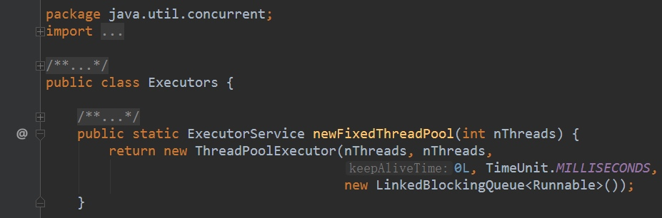

池中保持nThreads个线程，最多也只有nThreads个线程，多余的任务也在队列中排队。


ThreadPoolExecutor的构造器-1

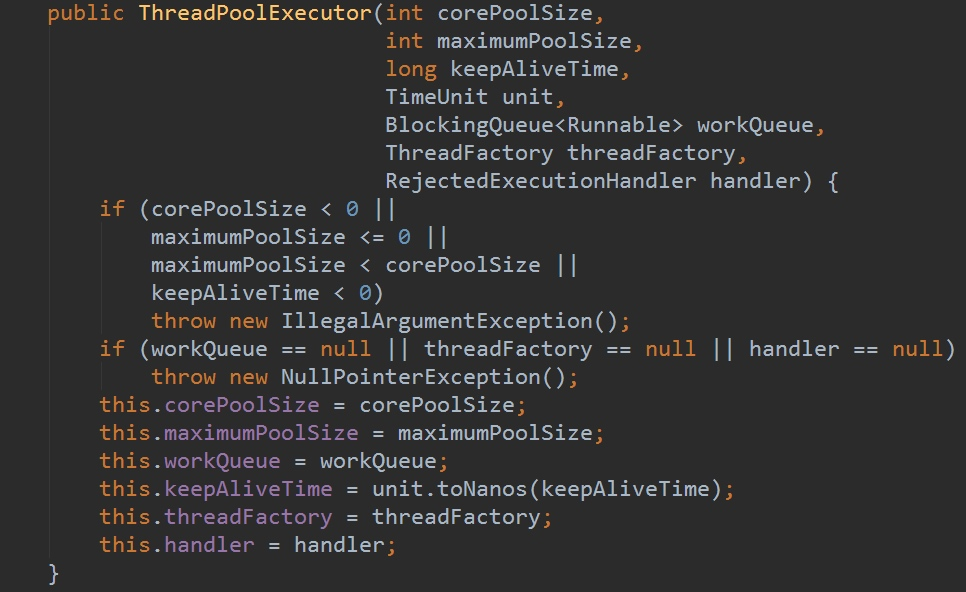

ThreadPoolExecutor的构造器-2，线程数固定且线程不超时
* 缓存线程池：newCachedThreadPool()创建，五个参数分别是ThreadPoolExecutor(0, Integer.MAX_VALUE, 60L, TimeUnit.SECONDS, new SynchronousQueue())。
含义是池中不保持固定数量的线程，随需创建，最多可以创建Integer.MAX_VALUE个线程（说一句，这个数量已经大大超过目前任何操作系统允许的线程数了），空闲的线程最多保持60秒，多余的任务在SynchronousQueue（所有阻塞、并发队列在后续文章中具体介绍）中等待。
为什么单线程池和固定线程池使用的任务阻塞队列是LinkedBlockingQueue()，而缓存线程池使用的是SynchronousQueue()呢？
因为单线程池和固定线程池中，线程数量是有限的，因此提交的任务需要在LinkedBlockingQueue队列中等待空余的线程；而缓存线程池中，线程数量几乎无限（上限为Integer.MAX_VALUE），因此提交的任务只需要在SynchronousQueue队列中同步移交给空余线程即可。
* 单线程调度线程池：newSingleThreadScheduledExecutor()创建，五个参数分别是 (1, Integer.MAX_VALUE, 0, NANOSECONDS, new DelayedWorkQueue())。含义是池中保持1个线程，多余的任务在DelayedWorkQueue中等待。
* 固定调度线程池：newScheduledThreadPool(n)创建，五个参数分别是 (n, Integer.MAX_VALUE, 0, NANOSECONDS, new DelayedWorkQueue())。含义是池中保持n个线程，多余的任务在DelayedWorkQueue中等待。
有一项技术可以缓解执行时间较长任务造成的影响，即限定任务等待资源的时间，而不要无限的等待
先看第一个例子，测试单线程池、固定线程池和缓存线程池（注意增加和取消注释）：

```java
public class ThreadPoolExam {
    public static void main(String[] args) {
        //first test for singleThreadPool
        ExecutorService pool = Executors.newSingleThreadExecutor();
        //second test for fixedThreadPool
//        ExecutorService pool = Executors.newFixedThreadPool(2);
        //third test for cachedThreadPool
//        ExecutorService pool = Executors.newCachedThreadPool();
        for (int i = 0; i < 5; i++) {
            pool.execute(new TaskInPool(i));
        }
        pool.shutdown();
    }
}

class TaskInPool implements Runnable {
    private final int id;

    TaskInPool(int id) {
        this.id = id;
    }

    @Override
    public void run() {
        try {
            for (int i = 0; i < 5; i++) {
                System.out.println("TaskInPool-["+id+"] is running phase-"+i);
                TimeUnit.SECONDS.sleep(1);
            }
            System.out.println("TaskInPool-["+id+"] is over");
        } catch (InterruptedException e) {
            e.printStackTrace();
        }
    }
}
```

#### 2.2 向线程池提交任务
可以使用两个方法向线程池提交任务
##### 2.2.1 execute()
用于提交不需要返回值的任务,所以无法判断任务是否被线程池执行成功.通过以下代码可知execute()方法输入的任务是一个Runnable类的实例.

```java
    threadsPool.execute(new Runnable() {
            @Override
            public void run() {
                   // TODO Auto-generated method stub
            }
        });
```

从运行结果可以看出，单线程池中的线程是顺序执行的。固定线程池（参数为2）中，永远最多只有两个线程并发执行。缓存线程池中，所有线程都并发执行。
第二个例子，测试单线程调度线程池和固定调度线程池。

```java
public class ScheduledThreadPoolExam {
    public static void main(String[] args) {
        //first test for singleThreadScheduledPool
        ScheduledExecutorService scheduledPool = Executors.newSingleThreadScheduledExecutor();
        //second test for scheduledThreadPool
//        ScheduledExecutorService scheduledPool = Executors.newScheduledThreadPool(2);
        for (int i = 0; i < 5; i++) {
            scheduledPool.schedule(new TaskInScheduledPool(i), 0, TimeUnit.SECONDS);
        }
        scheduledPool.shutdown();
    }
}

class TaskInScheduledPool implements Runnable {
    private final int id;

    TaskInScheduledPool(int id) {
        this.id = id;
    }

    @Override
    public void run() {
        try {
            for (int i = 0; i < 5; i++) {
                System.out.println("TaskInScheduledPool-["+id+"] is running phase-"+i);
                TimeUnit.SECONDS.sleep(1);
            }
            System.out.println("TaskInScheduledPool-["+id+"] is over");
        } catch (InterruptedException e) {
            e.printStackTrace();
        }
    }
}
```

从运行结果可以看出，单线程调度线程池和单线程池类似，而固定调度线程池和固定线程池类似。
总结：
* 如果没有特殊要求，使用缓存线程池总是合适的；
* 如果只能运行一个线程，就使用单线程池。
* 如果要运行调度任务，则按需使用调度线程池或单线程调度线程池
* 如果有其他特殊要求，则可以直接使用ThreadPoolExecutor类的构造函数来创建线程池，并自己给定那五个参数。
##### 2.2.2 submit()
用于提交需要返回值的任务.线程池会返回一个future类型对象,通过此对象可以判断任务是否执行成功
并可通过get()获取返回值,get()会阻塞当前线程直到任务完成,而使用get（long timeout，TimeUnit unit）方法则会阻塞当前线程一段时间后立即返回,这时候可能任务没有执行完.

```java
    Future<Object> future = executor.submit(harReturnValuetask);
        try {
            Object s = future.get();
        } catch (InterruptedException e) {
            // 处理中断异常
        } catch (ExecutionException e) {
            // 处理无法执行任务异常
        } finally {
            // 关闭线程池
            executor.shutdown();
        }
```

#### 2.3 关闭线程池
可通过调用线程池的shutdown或shutdownNow方法来关闭线程池.
它们的原理是遍历线程池中的工作线程,然后逐个调用线程的interrupt方法来中断线程,所以无法响应中断的任务可能永远无法终止.
但是它们存在一定的区别
* shutdownNow首先将线程池的状态设置成STOP,然后尝试停止所有的正在执行或暂停任务的线程,并返回等待执行任务的列表
* shutdown只是将线程池的状态设置成SHUTDOWN状态，然后中断所有没有正在执行任务的线程.
只要调用了这两个关闭方法中的任意一个,isShutdown方法就会返回true.
当所有的任务都已关闭后,才表示线程池关闭成功,这时调用isTerminaed方法会返回true.
至于应该调用哪一种方法,应该由提交到线程池的任务的特性决定,通常调用shutdown方法来关闭线程池,若任务不一定要执行完,则可以调用shutdownNow方法.
#### 2.4 合理配置
要想合理地配置线程池,就必须首先分析任务特性,可从以下几个角度来分析
* 任务的性质：CPU密集型任务、IO密集型任务和混合型任务
* 任务的优先级：高、中和低
* 任务的执行时间：长、中和短
* 任务的依赖性：是否依赖其他系统资源，如数据库连接。
性质不同的任务可以用不同规模的线程池分开处理.
* CPU密集型任务应配置尽可能小的线程,如配置N(CPU)+1个线程的线程池
* 由于I/O密集型任务线程并不是一直在执行任务,则应配置尽可能多的线程，如2*N(CPU)
* 混合型的任务,如果可以拆分，将其拆分成一个CPU密集型任务和一个IO密集型任务，只要这两个任务执行的时间相差不是太大，那么分解后执行的吞吐量将高于串行执行的吞吐量。如果这两个任务执行时间相差太大，则没必要进行分解。可以通过Runtime.getRuntime().availableProcessors()方法获得当前设备的CPU个数。优先级不同的任务可以使用PriorityBlockingQueue处理。它可以让优先级高的任务先执行.注意　如果一直有优先级高的任务提交到队列里，那么优先级低的任务可能永远不能执行，执行时间不同的任务可以交给不同规模的线程池来处理，或者可以使用优先级队列，让执行时间短的任务先执行。
依赖数据库连接池的任务，因为线程提交SQL后需要等待数据库返回结果，等待的时间越长，则CPU空闲时间就越长，那么线程数应该设置得越大，这样才能更好地利用CPU.
建议使用有界队列有界队列能增加系统的稳定性和预警能力，可以根据需要设大一点，比如几千.
假如系统里后台任务线程池的队列和线程池全满了，不断抛出抛弃任务的异常，通过排查发现是数据库出现了问题，导致执行SQL变得非常缓慢，因为后台任务线程池里的任务全是需要向数据库查询和插入数据的，所以导致线程池里的工作线程全部阻塞，任务积压在线程池里。
如果我们设置成无界队列，那么线程池的队列就会越来越多，有可能会撑满内存，导致整个系统不可用，而不只是后台任务出现问题。
#### 2.5　线程池的监控
如果在系统中大量使用线程池,则有必要对线程池进行监控,方便在出现问题时,可以根据线程池的使用状况快速定位问题.可通过线程池提供的参数进行监控,在监控线程池的时候可以使用以下属性:
* taskCount：线程池需要执行的任务数量
* completedTaskCount：线程池在运行过程中已完成的任务数量，小于或等于taskCount。
* largestPoolSize：线程池里曾经创建过的最大线程数量.通过这个数据可以知道线程池是否曾经满过。如该数值等于线程池的最大大小，则表示线程池曾经满过。
* getPoolSize：线程池的线程数量。如果线程池不销毁的话，线程池里的线程不会自动销毁，所以这个大小只增不减。
* getActiveCount：获取活动的线程数。
通过扩展线程池进行监控。可以通过继承线程池来自定义线程池，重写线程池的beforeExecute、afterExecute和terminated方法，也可以在任务执行前、执行后和线程池关闭前执行一些代码来进行监控。例如，监控任务的平均执行时间、最大执行时间和最小执行时间等。
这几个方法在线程池里是空方法。
protected void beforeExecute(Thread t, Runnable r) { }

#### 2.6 线程池的状态
1.当线程池创建后，初始为 running 状态

2.调用 shutdown 方法后，处 shutdown 状态，此时不再接受新的任务，等待已有的任务执行完毕

3.调用 shutdownnow 方法后，进入 stop 状态，不再接受新的任务，并且会尝试终止正在执行的任务。

4.当处于 shotdown 或 stop 状态，并且所有工作线程已经销毁，任务缓存队列已清空，线程池被设为 terminated 状态。

## 总结
总结
#### java 线程池有哪些关键属性？
* corePoolSize 到 maximumPoolSize 之间的线程会被回收，当然 corePoolSize 的线程也可以通过设置而得到回收（allowCoreThreadTimeOut(true)）。
* workQueue 用于存放任务，添加任务的时候，如果当前线程数超过了 corePoolSize，那么往该队列中插入任务，线程池中的线程会负责到队列中拉取任务。
* keepAliveTime 用于设置空闲时间，如果线程数超出了 corePoolSize，并且有些线程的空闲时间超过了这个值，会执行关闭这些线程的操作
* rejectedExecutionHandler 用于处理当线程池不能执行此任务时的情况，默认有抛出 RejectedExecutionException 异常、忽略任务、使用提交任务的线程来执行此任务和将队列中等待最久的任务删除，然后提交此任务这四种策略，默认为抛出异常。
#### 线程池中的线程创建时机？

* 如果当前线程数少于 corePoolSize，那么提交任务的时候创建一个新的线程，并由这个线程执行这个任务；
* 如果当前线程数已经达到 corePoolSize，那么将提交的任务添加到队列中，等待线程池中的线程去队列中取任务；
* 如果队列已满，那么创建新的线程来执行任务，需要保证池中的线程数不会超过 maximumPoolSize，如果此时线程数超过了 maximumPoolSize，那么执行拒绝策略。
#### 任务执行过程中发生异常怎么处理？
如果某个任务执行出现异常，那么执行任务的线程会被关闭，而不是继续接收其他任务。然后会启动一个新的线程来代替它。
#### 什么时候会执行拒绝策略？

* workers 的数量达到了 corePoolSize，任务入队成功，以此同时线程池被关闭了，而且关闭线程池并没有将这个任务出队，那么执行拒绝策略。这里说的是非常边界的问题，入队和关闭线程池并发执行，读者仔细看看 execute 方法是怎么进到第一个 reject(command) 里面的。
* workers 的数量大于等于 corePoolSize，准备入队，可是队列满了，任务入队失败，那么准备开启新的线程，可是线程数已经达到 maximumPoolSize，那么执行拒绝策略。


作者：一生只为虞美人
链接：https://www.jianshu.com/p/0562edd19cd9
來源：简书
简书著作权归作者所有，任何形式的转载都请联系作者获得授权并注明出处。