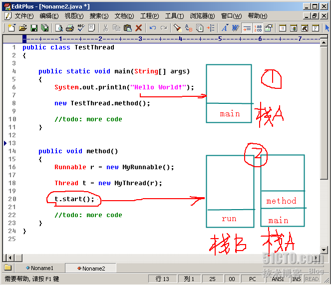
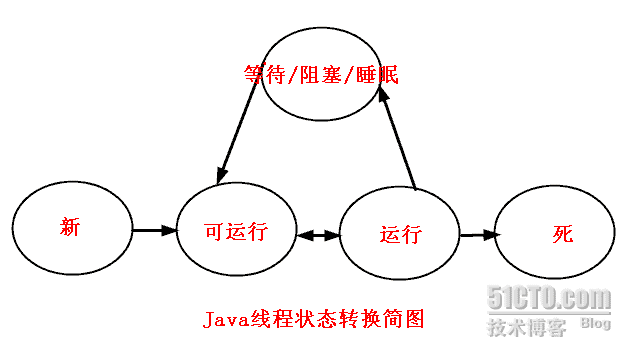
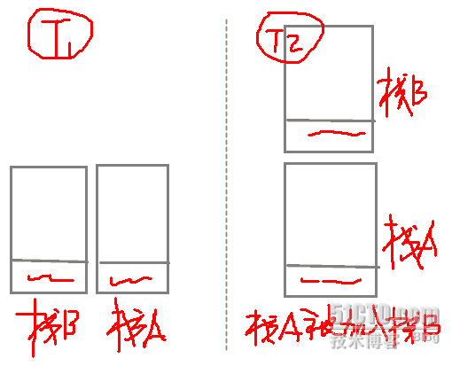

<h1 align="center">Java线程详解（深度好文）</h1>

[toc]

## Java线程：概念与原理

### 一、进程与线程

进程是指一个内存中运行的应用程序，每个进程都有自己独立的一块内存空间，即进程空间或（虚空间）。进程不依赖于线程而独立存在，一个进程中可以启动多个线程。比如在Windows系统中，一个运行的exe就是一个进程。

线程是指进程中的一个执行流程，一个进程中可以运行多个线程。比如java.exe进程中可以运行很多线程。线程总是属于某个进程，线程没有自己的虚拟地址空间，与进程内的其他线程一起共享分配给该进程的所有资源。

“同时”执行是人的感觉，在线程之间实际上轮换执行。

进程在执行过程中拥有独立的内存单元，进程有独立的地址空间，而多个线程共享内存，从而极大地提高了程序的运行效率。

线程在执行过程中与进程还是有区别的。每个独立的线程有一个程序运行的入口、顺序执行序列和程序的出口。但是线程不能够独立执行，必须依存在应用程序中，由应用程序提供多个线程执行控制。

进程是具有一定独立功能的程序关于某个数据集合上的一次运行活动，进程是系统进行资源分配和调度的一个独立单位。

线程是进程的一个实体，是CPU调度和分派的基本单位，它是比进程更小的能独立运行的基本单位。线程自己基本上不拥有系统资源，只拥有一点在运行中必不可少的资源（如程序计数器,一组寄存器和栈），但是它可与同属一个进程的其他的线程共享进程所拥有的全部资源。

线程有自己的堆栈和局部变量，但线程之间没有单独的地址空间，一个线程包含以下内容：

-  一个指向当前被执行指令的指令指针；
- 一个栈；
- 一个寄存器值的集合，定义了一部分描述正在执行线程的处理器状态的值
- 一个私有的数据区。

我们使用Join()方法挂起当前线程，直到调用Join()方法的线程执行完毕。该方法还存在包含参数的重载版本，其中的参数用于指定等待线程结束的最长时间（即超时）所花费的毫秒数。如果线程中的工作在规定的超时时段内结束，该版本的Join()方法将返回一个布尔量True。

简而言之：

- 一个程序至少有一个进程，一个进程至少有一个线程。
- 线程的划分尺度小于进程，使得多进程程序的并发性高。
- 另外，进程在执行过程中拥有独立的内存单元，而多个线程共享内存，从而极大地提高了程序的运行效率。
- 线程在执行过程中与进程还是有区别的。每个独立的线程有一个程序运行的入口、顺序执行序列和程序的出口。但是线程不能够独立执行，必须依存在应用程序中，由应用程序提供多个线程执行控制。
- 从逻辑角度来看，多线程的意义在于一个应用程序中，有多个执行部分可以同时执行。但操作系统并没有将多个线程看做多个独立的应用，来实现进程的调度和管理以及资源分配。这就是进程和线程的重要区别。

在Java中，每次程序运行至少启动2个线程：一个是main线程，一个是垃圾收集线程。因为每当使用java命令执行一个类的时候，实际上都会启动一个JVM，每一个JVM实际上就是在操作系统中启动了一个进程。

### 二、Java中的线程

在Java中，“线程”指两件不同的事情：

1、java.lang.Thread类的一个实例；

2、线程的执行。

在 Java程序中，有两种方法创建线程：

一是对 Thread 类进行派生并覆盖 run方法；

二是通过实现Runnable接口创建。

使用java.lang.Thread类或者java.lang.Runnable接口编写代码来定义、实例化和启动新线程。

一个Thread类实例只是一个对象，像Java中的任何其他对象一样，具有变量和方法，生死于堆上。

Java中，每个线程都有一个调用栈，即使不在程序中创建任何新的线程，线程也在后台运行着。

一个Java应用总是从main()方法开始运行，main()方法运行在一个线程内，他被称为主线程。

一旦创建一个新的线程，就产生一个新的调用栈。

线程总体分两类：用户线程和守候线程。

当所有用户线程执行完毕的时候，JVM自动关闭。但是守候线程却不独立于JVM，守候线程一般是由操作系统或者用户自己创建的。

## Java线程：创建与启动

### 一、定义线程

1、扩展java.lang.Thread类。

​    此类中有个run()方法，应该注意其用法：public void run()

​    如果该线程是使用独立的Runnable运行对象构造的，则调用该Runnable对象的run方法；否则，该方法不执行任何操作并返回。

​    Thread的子类应该重写该方法。

2、实现java.lang.Runnable接口。

​    void run()

​    使用实现接口Runnable的对象创建一个线程时，启动该线程将导致在独立执行的线程中调用对象的run方法。

​    方法run的常规协定是，它可能执行任何所需的操作。

## 二、实例化线程

1、如果是扩展java.lang.Thread类的线程，则直接new即可。

2、如果是实现了java.lang.Runnable接口的类，则用Thread的构造方法：

```java
1. Thread(Runnabletarget) 
2. Thread(Runnabletarget, String name) 
3. Thread(ThreadGroupgroup, Runnable target) 
4. Thread(ThreadGroupgroup, Runnable target, String name) 
5. Thread(ThreadGroupgroup, Runnable target, String name, **long** stackSize) 
```

其中：

Runnable target：实现了Runnable接口的类的实例。 

1. Thread类也实现了Runnable接口，因此，从Thread类继承的类的实例也可以作为target传入这个构造方法。
2. 直接实现Runnable接口类的实例。
3. 线程池建立多线程。

String name：线程的名子。这个名子可以在建立Thread实例后通过Thread类的setName方法设置。默认线程名：Thread-N，N是线程建立的顺序，是一个不重复的正整数。

ThreadGroup group：当前建立的线程所属的线程组。如果不指定线程组，所有的线程都被加到一个默认的线程组中。

long stackSize：线程栈的大小，这个值一般是CPU页面的整数倍。如x86的页面大小是4KB.在x86平台下，默认的线程栈大小是12KB。

### 三、启动线程

在线程的Thread对象上调用start()方法，而不是run()或者别的方法。

在调用start()方法之前：线程处于新状态中，新状态指有一个Thread对象，但还没有一个真正的线程。

在调用start()方法之后：发生了一系列复杂的事情——

启动新的执行线程（具有新的调用栈）；

该线程从新状态转移到可运行状态；

当该线程获得机会执行时，其目标run()方法将运行。

注意：对Java来说，run()方法没有任何特别之处。像main()方法一样，它只是新线程知道调用的方法名称（和签名）。因此，在Runnable上或者Thread上调用run方法是合法的。但并不启动新的线程。

### 四、例子

1、实现Runnable接口的多线程例子

```java
/** 
 * 实现Runnable接口的类 
 */  
public class RunnableImpl implements Runnable{  
    private Stringname;  
    public RunnableImpl(String name) {  
       this.name = name;  
    }  
    @Override  
    public void run() {  
       for (int i = 0; i < 5; i++) {  
           for(long k=0;k<100000000;k++);  
           System.out.println(name+":"+i);  
       }       
    }  
}  
   
/** 
 * 测试Runnable类实现的多线程程序 
 */  
public class TestRunnable {  
   
    public static void main(String[] args) {  
       RunnableImpl ri1=new RunnableImpl("李白");  
       RunnableImpl ri2=new RunnableImpl("屈原");  
       Thread t1=new Thread(ri1);  
       Thread t2=new Thread(ri2);  
       t1.start();  
       t2.start();  
    }  
}  
```

执行结果：

```
屈原:0  
李白:0  
屈原:1  
李白:1  
屈原:2  
李白:2  
李白:3  
屈原:3  
李白:4  
屈原:4 
```

2、扩展Thread类实现的多线程例子

```java
/** 
 * 测试扩展Thread类实现的多线程程序 
 */  
public class TestThread extends Thread {  
    public TestThread(String name){  
       super(name);  
    }  
    @Override  
    public void run() {  
       for(int i=0;i<5;i++){  
           for(long k=0;k<100000000;k++);  
           System.out.println(this.getName()+":"+i);  
       }  
    }  
    public static void main(String[] args){  
       Thread t1=new TestThread("李白");  
       Thread t2=new TestThread("屈原");  
       t1.start();  
       t2.start();        
    }  
}  
```

执行结果：

```
屈原:0  
李白:0  
屈原:1  
李白:1  
屈原:2  
李白:2  
屈原:3  
屈原:4  
李白:3  
李白:4  
```

对于上面的多线程程序代码来说，输出的结果是不确定的。其中的一条语句for(long k=0;k<100000000;k++);是用来模拟一个非常耗时的操作的。

### 五、一些常见问题

1、线程的名字，一个运行中的线程总是有名字的，名字有两个来源，一个是虚拟机自己给的名字，一个是你自己的定的名字。在没有指定线程名字的情况下，虚拟机总会为线程指定名字，并且主线程的名字总是mian，非主线程的名字不确定。

2、线程都可以设置名字，也可以获取线程的名字，连主线程也不例外。

3、获取当前线程的对象的方法是：Thread.currentThread()；

4、在上面的代码中，只能保证：每个线程都将启动，每个线程都将运行直到完成。一系列线程以某种顺序启动并不意味着将按该顺序执行。对于任何一组启动的线程来说，调度程序不能保证其执行次序，持续时间也无法保证。

5、当线程目标run()方法结束时该线程完成。

6、一旦线程启动，它就永远不能再重新启动。只有一个新的线程可以被启动，并且只能一次。一个可运行的线程或死线程可以被重新启动。

7、线程的调度是JVM的一部分，在一个CPU的机器上上，实际上一次只能运行一个线程。一次只有一个线程栈执行。JVM线程调度程序决定实际运行哪个处于可运行状态的线程。

众多可运行线程中的某一个会被选中做为当前线程。可运行线程被选择运行的顺序是没有保障的。

8、尽管通常采用队列形式，但这是没有保障的。队列形式是指当一个线程完成“一轮”时，它移到可运行队列的尾部等待，直到它最终排队到该队列的前端为止，它才能被再次选中。事实上，我们把它称为可运行池而不是一个可运行队列，目的是帮助认识线程并不都是以某种有保障的顺序排列而成一个一个队列的事实。

9、尽管我们没有无法控制线程调度程序，但可以通过别的方式来影响线程调度的方式。

## Java线程：线程栈模型与线程的变量

要理解线程调度的原理，以及线程执行过程，必须理解线程栈模型。

线程栈是指某时刻时内存中线程调度的栈信息，当前调用的方法总是位于栈顶。线程栈的内容是随着程序的运行动态变化的，因此研究线程栈必须选择一个运行的时刻（实际上指代码运行到什么地方)。

下面通过一个示例性的代码说明线程（调用）栈的变化过程。

 

这幅图描述在代码执行到两个不同时刻1、2时候，虚拟机线程调用栈示意图。

当程序执行到t.start();时候，程序多出一个分支（增加了一个调用栈B），这样，栈A、栈B并行执行。

从这里就可以看出方法调用和线程启动的区别了。

## Java线程：线程状态的转换

### 一、线程状态

线程的状态转换是线程控制的基础。线程状态总的可以分为五大状态。用一个图来描述如下：



1、新状态：线程对象已经创建，还没有在其上调用start()方法。

2、可运行状态：当线程有资格运行，但调度程序还没有把它选定为运行线程时线程所处的状态。当start()方法调用时，线程首先进入可运行状态。在线程运行之后或者从阻塞、等待或睡眠状态回来后，也返回到可运行状态。

3、运行状态：线程调度程序从可运行池中选择一个线程作为当前线程时线程所处的状态。这也是线程进入运行状态的唯一一种方式。

4、等待/阻塞/睡眠状态：这是线程有资格运行时它所处的状态。实际上这个三状态组合为一种，其共同点是：线程仍旧是活的，但是当前没有条件运行。换句话说，它是可运行的，但是如果某件事件出现，他可能返回到可运行状态。

5、死亡态：当线程的run()方法完成时就认为它死去。这个线程对象也许是活的，但是，它已经不是一个单独执行的线程。线程一旦死亡，就不能复生。如果在一个死去的线程上调用start()方法，会抛出java.lang.IllegalThreadStateException异常。

### 二、阻止线程执行

对于线程的阻止，考虑一下三个方面，不考虑IO阻塞的情况：

睡眠；

等待；

因为需要一个对象的锁定而被阻塞。

1、睡眠

Thread.sleep(longmillis)和Thread.sleep(long millis, int nanos)静态方法强制当前正在执行的线程休眠（暂停执行），以“减慢线程”。当线程睡眠时，它入睡在某个地方，在苏醒之前不会返回到可运行状态。当睡眠时间到期，则返回到可运行状态。

线程睡眠的原因：线程执行太快，或者需要强制进入下一轮，因为Java规范不保证合理的轮换。

睡眠的实现：调用静态方法。    

```java
try {  
	Thread.sleep(123);  
} catch (InterruptedException e) {  
    e.printStackTrace();   
}
```

睡眠的位置：为了让其他线程有机会执行，可以将Thread.sleep()的调用放线程run()之内。这样才能保证该线程执行过程中会睡眠。

例如，在前面的例子中，将一个耗时的操作改为睡眠，以减慢线程的执行。可以这么写：

```java
	for(int i=0;i<5;i++){  
         // 很耗时的操作，用来减慢线程的执行  
         //for(longk=0;k<100000000;k++);  
         try {  
              Thread.sleep(3);  
          } catch (InterruptedException e) {  
              e.printStackTrace();  
          }  
         System.out.println(this.getName()+":"+i);  
    } 
```

执行结果：

```
李白:0  
李白:1  
屈原:0  
李白:2  
屈原:1  
李白:3  
屈原:2  
李白:4  
屈原:3  
屈原:4 
```

这样，线程在每次执行过程中，总会睡眠3毫秒，睡眠了，其他的线程就有机会执行了。

注意：

1、线程睡眠是帮助所有线程获得运行机会的最好方法。

2、线程睡眠到期自动苏醒，并返回到可运行状态，不是运行状态。sleep()中指定的时间是线程不会运行的最短时间。因此，sleep()方法不能保证该线程睡眠到期后就开始执行。

3、sleep()是静态方法，只能控制当前正在运行的线程。

下面给个例子：

```java
/** 
 * 一个计数器，计数到100，在每个数字之间暂停1秒，每隔10个数字输出一个字符串 
 */  
public class CalcThread extends Thread {  
    public void run(){  
       for(int i=0;i<100;i++){  
           if ((i)%10==0) {  
              System.out.println("--------"+i);  
           }  
           System.out.print(i);  
           try {  
              Thread.sleep(1);  
              System.out.print("    线程睡眠1毫秒！\n");  
           } catch (InterruptedException e) {  
              e.printStackTrace();  
           }  
       }  
    }  
   
    public static void main(String[] args) {  
       new CalcThread().start();  
    }  
}  
```

执行结果：

```
--------0  
0    线程睡眠1毫秒！  
1    线程睡眠1毫秒！  
2    线程睡眠1毫秒！  
3    线程睡眠1毫秒！  
4    线程睡眠1毫秒！  
5    线程睡眠1毫秒！  
6    线程睡眠1毫秒！  
7    线程睡眠1毫秒！  
8    线程睡眠1毫秒！  
9    线程睡眠1毫秒！  
--------10  
10    线程睡眠1毫秒！  
11    线程睡眠1毫秒！  
12    线程睡眠1毫秒！  
13    线程睡眠1毫秒！  
14    线程睡眠1毫秒！  
15    线程睡眠1毫秒！  
16    线程睡眠1毫秒！  
17    线程睡眠1毫秒！  
18    线程睡眠1毫秒！  
19    线程睡眠1毫秒！  
--------20  
20    线程睡眠1毫秒！  
21    线程睡眠1毫秒！  
22    线程睡眠1毫秒！  
23    线程睡眠1毫秒！  
24    线程睡眠1毫秒！  
25    线程睡眠1毫秒！  
26    线程睡眠1毫秒！  
27    线程睡眠1毫秒！  
28    线程睡眠1毫秒！  
29    线程睡眠1毫秒！  
--------30  
30    线程睡眠1毫秒！  
31    线程睡眠1毫秒！  
32    线程睡眠1毫秒！  
33    线程睡眠1毫秒！  
34    线程睡眠1毫秒！  
35    线程睡眠1毫秒！  
36    线程睡眠1毫秒！  
37    线程睡眠1毫秒！  
38    线程睡眠1毫秒！  
39    线程睡眠1毫秒！  
--------40  
40    线程睡眠1毫秒！  
41    线程睡眠1毫秒！  
42    线程睡眠1毫秒！  
43    线程睡眠1毫秒！  
44    线程睡眠1毫秒！  
45    线程睡眠1毫秒！  
46    线程睡眠1毫秒！  
47    线程睡眠1毫秒！  
48    线程睡眠1毫秒！  
49    线程睡眠1毫秒！  
--------50  
50    线程睡眠1毫秒！  
51    线程睡眠1毫秒！  
52    线程睡眠1毫秒！  
53    线程睡眠1毫秒！  
54    线程睡眠1毫秒！  
55    线程睡眠1毫秒！  
56    线程睡眠1毫秒！  
57    线程睡眠1毫秒！  
58    线程睡眠1毫秒！  
59    线程睡眠1毫秒！  
--------60  
60    线程睡眠1毫秒！  
61    线程睡眠1毫秒！  
62    线程睡眠1毫秒！  
63    线程睡眠1毫秒！  
64    线程睡眠1毫秒！  
65    线程睡眠1毫秒！  
66    线程睡眠1毫秒！  
67    线程睡眠1毫秒！  
68    线程睡眠1毫秒！  
69    线程睡眠1毫秒！  
--------70  
70    线程睡眠1毫秒！  
71    线程睡眠1毫秒！  
72    线程睡眠1毫秒！  
73    线程睡眠1毫秒！  
74    线程睡眠1毫秒！  
75    线程睡眠1毫秒！  
76    线程睡眠1毫秒！  
77    线程睡眠1毫秒！  
78    线程睡眠1毫秒！  
79    线程睡眠1毫秒！  
--------80  
80    线程睡眠1毫秒！  
81    线程睡眠1毫秒！  
82    线程睡眠1毫秒！  
83    线程睡眠1毫秒！  
84    线程睡眠1毫秒！  
85    线程睡眠1毫秒！  
86    线程睡眠1毫秒！  
87    线程睡眠1毫秒！  
88    线程睡眠1毫秒！  
89    线程睡眠1毫秒！  
--------90  
90    线程睡眠1毫秒！  
91    线程睡眠1毫秒！  
92    线程睡眠1毫秒！  
93    线程睡眠1毫秒！  
94    线程睡眠1毫秒！  
95    线程睡眠1毫秒！  
96    线程睡眠1毫秒！  
97    线程睡眠1毫秒！  
98    线程睡眠1毫秒！  
99    线程睡眠1毫秒！ 
```

2、线程的优先级和线程让步yield()

线程的让步是通过Thread.yield()来实现的。yield()方法的作用是：暂停当前正在执行的线程对象，并执行其他线程。

要理解yield()，必须了解线程的优先级的概念。线程总是存在优先级，优先级范围在1~10之间。JVM线程调度程序是基于优先级的抢先调度机制。在大多数情况下，当前运行的线程优先级将大于或等于线程池中任何线程的优先级。但这仅仅是大多数情况。

注意：当设计多线程应用程序的时候，一定不要依赖于线程的优先级。因为线程调度优先级操作是没有保障的，只能把线程优先级作用作为一种提高程序效率的方法，但是要保证程序不依赖这种操作。

当线程池中线程都具有相同的优先级，调度程序的JVM实现自由选择它喜欢的线程。这时候调度程序的操作有两种可能：一是选择一个线程运行，直到它阻塞或者运行完成为止。二是时间分片，为池内的每个线程提供均等的运行机会。

设置线程的优先级：线程默认的优先级是创建它的执行线程的优先级。可以通过setPriority(int newPriority)更改线程的优先级。例如：

```java
Thread t = new MyThread();  
t.setPriority(8);  
t.start();
```

线程优先级为1~10之间的正整数，JVM从不会改变一个线程的优先级。然而，1~10之间的值是没有保证的。一些JVM可能不能识别10个不同的值，而将这些优先级进行每两个或多个合并，变成少于10个的优先级，则两个或多个优先级的线程可能被映射为一个优先级。

线程默认优先级是5，Thread类中有三个常量，定义线程优先级范围：

```java
static intMAX_PRIORITY：线程可以具有的最高优先级。  
static intMIN_PRIORITY：线程可以具有的最低优先级。  
static intNORM_PRIORITY：分配给线程的默认优先级。
```

3、Thread.yield()方法

Thread.yield()方法作用是：暂停当前正在执行的线程对象，并执行其他线程。

yield()应该做的是让当前运行线程回到可运行状态，以允许具有相同优先级的其他线程获得运行机会。因此，使用yield()的目的是让相同优先级的线程之间能适当的轮转执行。但是，实际中无法保证yield()达到让步目的，因为让步的线程还有可能被线程调度程序再次选中。

结论：yield()从未导致线程转到等待/睡眠/阻塞状态。在大多数情况下，yield()将导致线程从运行状态转到可运行状态，但有可能没有效果。

4、join()方法

Thread的非静态方法join()让一个线程B“加入”到另外一个线程A的尾部。在A执行完毕之前，B不能工作。例如：

```java
Thread t = new MyThread();  
t.start();  
t.join(); 
```

另外，join()方法还有带超时限制的重载版本。例如t.join(5000);则让线程等待5000毫秒，如果超过这个时间，则停止等待，变为可运行状态。

线程的加入join()对线程栈导致的结果是线程栈发生了变化，当然这些变化都是瞬时的。下面给示意图：



小结

到目前位置，介绍了线程离开运行状态的3种方法：

1、调用Thread.sleep()：使当前线程睡眠至少多少毫秒（尽管它可能在指定的时间之前被中断）。

2、调用Thread.yield()：不能保障太多事情，尽管通常它会让当前运行线程回到可运行性状态，使得有相同优先级的线程有机会执行。

3、调用join()方法：保证当前线程停止执行，直到该线程所加入的线程完成为止。然而，如果它加入的线程没有存活，则当前线程不需要停止。

除了以上三种方式外，还有下面几种特殊情况可能使线程离开运行状态：

1、线程的run()方法完成。

2、在对象上调用wait()方法（不是在线程上调用）。

3、线程不能在对象上获得锁定，它正试图运行该对象的方法代码。

4、线程调度程序可以决定将当前运行状态移动到可运行状态，以便让另一个线程获得运行机会，而不需要任何理由。

## Java线程：线程的同步与锁

### 一、同步问题提出

线程的同步是为了防止多个线程访问一个数据对象时，对数据造成的破坏。

例如：两个线程ThreadA、ThreadB都操作同一个对象Foo对象，并修改Foo对象上的数据。

```java
public class Foo {  
    private int x = 100;  
    public int getX() {  
        return x;  
    }  
    public int fix(int y) {  
        x = x - y;  
        return x;  
    }  
}   
   
public class FooRunnable implements Runnable {  
    private Foo foo =new Foo();  
   
    public static void main(String[] args) {  
       FooRunnable r = new FooRunnable();  
        Thread ta = new Thread(r,"Thread-A");  
        Thread tb = new Thread(r,"Thread-B");  
        ta.start();  
        tb.start();  
    }  
   
    @Override  
    public void run() {  
       for (int i = 0; i < 3; i++) {  
            this.fix(30);  
            try {  
                Thread.sleep(1);  
            } catch (InterruptedException e) {  
                e.printStackTrace();  
            }  
            System.out.println(Thread.currentThread().getName()+ " :当前foo对象的x值= " + foo.getX());  
        }  
    }  
   
    public int fix(int y) {  
       return foo.fix(y);  
    }  
}  
```

执行结果：

```
Thread-B :当前foo对象的x值= 40  
Thread-A :当前foo对象的x值= 10  
Thread-B :当前foo对象的x值= -20  
Thread-A :当前foo对象的x值= -50  
Thread-B :当前foo对象的x值= -80  
Thread-A :当前foo对象的x值= -80  
```

从结果发现，这样的输出值明显是不合理的，原因是两个线程不加控制的访问Foo对象并修改其数据所致。

如果要保持结果的合理性，只需要达到一个目的，就是将对Foo的访问加以限制，每次只能有一个线程在访问。这样就能保证Foo对象中数据的合理性了。

在具体的Java代码中需要完成以下两个操作：

把竞争访问的资源类Foo变量x标识为private；

同步修改变量的代码，使用synchronized关键字同步方法或代码。

### 二、同步和锁定

1、锁的原理

Java中每个对象都有一个内置锁。

当程序运行到非静态的synchronized同步方法上时，自动获得与正在执行代码类的当前实例（this实例）有关的锁。获得一个对象的锁也称为获取锁、锁定对象、在对象上锁定或在对象上同步。

当程序运行到synchronized同步方法或代码块时才该对象锁才起作用。

一个对象只有一个锁。所以，如果一个线程获得该锁，就没有其他线程可以获得锁，直到第一个线程释放（或返回）锁。这也意味着任何其他线程都不能进入该对象上的synchronized方法或代码块，直到该锁被释放。

释放锁是指持锁线程退出了synchronized同步方法或代码块。

关于锁和同步，有一下几个要点：

1）只能同步方法，而不能同步变量和类；

2）每个对象只有一个锁；当提到同步时，应该清楚在什么上同步？也就是说，在哪个对象上同步？

3）不必同步类中所有的方法，类可以同时拥有同步和非同步方法。

4）如果两个线程要执行一个类中的synchronized方法，并且两个线程使用相同的实例来调用方法，那么一次只能有一个线程能够执行方法，另一个需要等待，直到锁被释放。也就是说：如果一个线程在对象上获得一个锁，就没有任何其他线程可以进入（该对象的）类中的任何一个同步方法。

5）如果线程拥有同步和非同步方法，则非同步方法可以被多个线程自由访问而不受锁的限制。

6）线程睡眠时，它所持的任何锁都不会释放。

7）线程可以获得多个锁。比如，在一个对象的同步方法里面调用另外一个对象的同步方法，则获取了两个对象的同步锁。

8）同步损害并发性，应该尽可能缩小同步范围。同步不但可以同步整个方法，还可以同步方法中一部分代码块。

9）在使用同步代码块时候，应该指定在哪个对象上同步，也就是说要获取哪个对象的锁。例如：

```java
public int fix(int y) {  
       synchronized (this) {  
           x = x - y;  
       }  
       return x;  
   }  
```

当然，同步方法也可以改写为非同步方法，但功能完全一样的，例如：

```java
public synchronized int getX() {  
    return x++;  
}  
```

 与  

```java
public int getX() {  
      synchronized (this) {  
          return x;  
      }  
  } 
```

效果是完全一样的。

### 三、静态方法同步

要同步静态方法，需要一个用于整个类对象的锁，这个对象是就是这个类（XXX.class)。

例如：

```java
public staticsynchronized int setName(String name){  
      Xxx.name = name;  
} 
```

等价于

```java
public static intsetName(String name){  
      synchronized(Xxx.class){  
            Xxx.name = name;  
      }  
}
```

### 四、如果线程不能获得锁会怎么样

如果线程试图进入同步方法，而其锁已经被占用，则线程在该对象上被阻塞。实质上，线程进入该对象的一种池中，必须在那里等待，直到其锁被释放，该线程再次变为可运行或运行为止。

当考虑阻塞时，一定要注意哪个对象正被用于锁定：

1、调用同一个对象中非静态同步方法的线程将彼此阻塞。如果是不同对象，则每个线程有自己的对象的锁，线程间彼此互不干预。

2、调用同一个类中的静态同步方法的线程将彼此阻塞，它们都是锁定在相同的Class对象上。

3、静态同步方法和非静态同步方法将永远不会彼此阻塞，因为静态方法锁定在Class对象上，非静态方法锁定在该类的对象上。

4、对于同步代码块，要看清楚什么对象已经用于锁定（synchronized后面括号的内容）。在同一个对象上进行同步的线程将彼此阻塞，在不同对象上锁定的线程将永远不会彼此阻塞。

### 五、何时需要同步

在多个线程同时访问互斥（可交换）数据时，应该同步以保护数据，确保两个线程不会同时修改更改它。

对于非静态字段中可更改的数据，通常使用非静态方法访问。

对于静态字段中可更改的数据，通常使用静态方法访问。

如果需要在非静态方法中使用静态字段，或者在静态字段中调用非静态方法，问题将变得非常复杂。

### 六、线程安全类

当一个类已经很好的同步以保护它的数据时，这个类就称为“线程安全的”。

即使是线程安全类，也应该特别小心，因为操作的线程之间仍然不一定安全。

举个形象的例子，比如一个集合是线程安全的，有两个线程在操作同一个集合对象，当第一个线程查询集合非空后，删除集合中所有元素的时候。第二个线程也来执行与第一个线程相同的操作，也许在第一个线程查询后，第二个线程也查询出集合非空，但是当第一个执行清除后，第二个再执行删除显然是不对的，因为此时集合已经为空了。

举个例子：

```java
public class NameList {  
    private List nameList = Collections.synchronizedList(newLinkedList());  
   
    public void add(String name) {  
        nameList.add(name);  
    }  
   
    public String removeFirst() {  
       if (nameList.size()>0) {  
       return (String) nameList.remove(0);  
       } else {  
           return null;  
       }  
    }    
}  
   
public class TestNameList {  
    public static void main(String[] args) {  
        final NameList nl =new NameList();  
         nl.add("苏东坡");  
         class NameDropper extends Thread{  
           @Override  
           public void run() {  
              String name = nl.removeFirst();  
                System.out.println(name);  
           }          
         }  
         Thread t1=new NameDropper();  
         Thread t2=new NameDropper();  
         t1.start();  
         t2.start();  
    }  
}  
```

​    执行结果：

```
苏东坡  
null 
```

虽然集合对象

```java
private List nameList =Collections.synchronizedList(new LinkedList());  
```

是同步的，但是程序还不是线程安全的。

出现这种事件的原因是，上例中一个线程操作列表过程中无法阻止另外一个线程对列表的其他操作。

解决上面问题的办法是，在操作集合对象的NameList上面做一个同步。改写后的代码如下：

```java
public class NameList {  
    private List nameList = Collections.synchronizedList(newLinkedList());  
   
    public synchronized void add(String name) {  
        nameList.add(name);  
    }  
   
    public synchronized StringremoveFirst() {  
       if (nameList.size()>0) {  
        return (String) nameList.remove(0);  
       } else {  
           return null;  
       }  
    }    
}  
```

这样，当一个线程访问其中一个同步方法时，其他线程只有等待。

### 七、线程死锁

死锁对Java程序来说，是很复杂的，也很难发现问题。当两个线程被阻塞，每个线程在等待另一个线程时就发生死锁。

还是看一个比较直观的死锁例子：

```java
public class Deadlock {  
    private static class Resource{  
       public int value;  
    }  
    private Resource resourceA=new Resource();  
    private Resource resourceB=new Resource();  
    public int read(){  
       synchronized (resourceA) {  
           synchronized (resourceB) {  
              return resourceB.value+resourceA.value;  
           }  
       }  
    }  
    public void write(int a,int b){  
       synchronized(resourceB){  
           synchronized (resourceA) {  
              resourceA.value=a;  
              resourceB.value=b;  
           }  
       }  
    }  
}  

```

假设read()方法由一个线程启动，write()方法由另外一个线程启动。读线程将拥有resourceA锁，写线程将拥有resourceB锁，两者都坚持等待的话就出现死锁。

实际上，上面这个例子发生死锁的概率很小。因为在代码内的某个点，CPU必须从读线程切换到写线程，所以，死锁基本上不能发生。

但是，无论代码中发生死锁的概率有多小，一旦发生死锁，程序就死掉。有一些设计方法能帮助避免死锁，包括始终按照预定义的顺序获取锁这一策略。已经超出SCJP的考试范围。

### 八、线程同步小结

1、线程同步的目的是为了保护多个线程反问一个资源时对资源的破坏。

2、线程同步方法是通过锁来实现，每个对象都有切仅有一个锁，这个锁与一个特定的对象关联，线程一旦获取了对象锁，其他访问该对象的线程就无法再访问该对象的其他同步方法。

3、对于静态同步方法，锁是针对这个类的，锁对象是该类的Class对象。静态和非静态方法的锁互不干预。一个线程获得锁，当在一个同步方法中访问另外对象上的同步方法时，会获取这两个对象锁。

4、对于同步，要时刻清醒在哪个对象上同步，这是关键。

5、编写线程安全的类，需要时刻注意对多个线程竞争访问资源的逻辑和安全做出正确的判断，对“原子”操作做出分析，并保证原子操作期间别的线程无法访问竞争资源。

6、当多个线程等待一个对象锁时，没有获取到锁的线程将发生阻塞。

7、死锁是线程间相互等待锁锁造成的，在实际中发生的概率非常的小。真让你写个死锁程序，不一定好使，呵呵。但是，一旦程序发生死锁，程序将死掉。

## Java线程：线程的交互

线程交互是比较复杂的问题，SCJP要求不很基础：给定一个场景，编写代码来恰当使用等待、通知和通知所有线程。

### 一、线程交互的基础知识

SCJP所要求的线程交互知识点需要从java.lang.Object的类的三个方法来学习：

```
void notify()——唤醒在此对象监视器上等待的单个线程。  
void notifyAll()——唤醒在此对象监视器上等待的所有线程。  
void wait()——导致当前的线程等待，直到其他线程调用此对象的 notify()方法或 notifyAll()方法。
```

当然，wait()还有另外两个重载方法：

```
void wait(longtimeout)——导致当前的线程等待，直到其他线程调用此对象的 notify()方法或 notifyAll()方法，或者超过指定的时间量。  
void wait(longtimeout, int nanos)——导致当前的线程等待，直到其他线程调用此对象的 notify()方法或 notifyAll()方法，或者其他某个线程中断当前线程，或者已超过某个实际时间量。
```

以上这些方法是帮助线程传递线程关心的时间状态。

关于等待/通知，要记住的关键点是：

必须从同步环境内调用wait()、notify()、notifyAll()方法。线程不能调用对象上等待或通知的方法，除非它拥有那个对象的锁。

wait()、notify()、notifyAll()都是Object的实例方法。与每个对象具有锁一样，每个对象可以有一个线程列表，他们等待来自该信号（通知）。线程通过执行对象上的wait()方法获得这个等待列表。从那时候起，它不再执行任何其他指令，直到调用对象的notify()方法为止。如果多个线程在同一个对象上等待，则将只选择一个线程（不保证以何种顺序）继续执行。如果没有线程等待，则不采取任何特殊操作。

下面看个例子就明白了：

```java
/** 
 * 计算输出其他线程锁计算的数据 
 */  
public class ThreadA {  
    public static void main(String[] args) {  
       ThreadB b=new ThreadB();  
       //启动计算线程  
       b.start();  
       //线程A拥有b对象上的锁。线程为了调用wait()或notify()方法，该线程必须是那个对象锁的拥有者  
       synchronized (b) {  
           try {  
              System.out.println("等待对象b完成计算......");  
              b.wait();  
           } catch (InterruptedException e) {  
              e.printStackTrace();  
           }  
           System.out.println("b对象计算的总和是：" + b.total);  
       }  
    }  
}  
   
/** 
 * 计算1+2+3+...+100的和 
 */  
public class ThreadB extends Thread {  
    int total;  
    public void run(){  
       synchronized (this) {  
           for (int i=0;i<101;i++){  
              total+=i;  
           }  
           //（完成计算了）唤醒在此对象监视器上等待的单个线程，在本例中线程A被唤醒  
           notify();  
       }  
    }  
}  
```

执行结果：

```
等待对象b完成计算......  
b对象计算的总和是：5050  
```

千万注意：

当在对象上调用wait()方法时，执行该代码的线程立即放弃它在对象上的锁。然而调用notify()时，并不意味着这时线程会放弃其锁。如果线程荣然在完成同步代码，则线程在移出之前不会放弃锁。因此，只要调用notify()并不意味着这时该锁变得可用。

### 二、多个线程在等待一个对象锁时候使用notifyAll()

在多数情况下，最好通知等待某个对象的所有线程。如果这样做，可以在对象上使用notifyAll()让所有在此对象上等待的线程冲出等待区，返回到可运行状态。

举个例子：

```java
/** 
 * 计算线程 
 */  
public class Calculator extends Thread {  
    int total;  
    @Override  
    public void run() {  
       synchronized (this) {  
           for(int i=0;i<101;i++){  
              total+=i;  
           }  
        }  
       //通知所有在此对象上等待的线程  
       notifyAll();  
    }    
}  
   
/** 
 * 获取计算结果并输出 
 */  
public class ReaderResult extends Thread {  
    Calculator c;  
    public ReaderResult(Calculator c) {  
       this.c = c;  
    }  
    public void run(){  
       synchronized (c) {  
           try {  
              System.out.println(Thread.currentThread() + "等待计算结果......");  
              c.wait();  
           } catch (InterruptedException e) {  
              e.printStackTrace();  
           }  
            System.out.println(Thread.currentThread()+ "计算结果为：" + c.total);  
       }  
    }  
    public static void main(String[] args) {  
       Calculator calculator=new Calculator();  
       //启动三个线程，分别获取计算结果  
       new ReaderResult(calculator).start();  
       new ReaderResult(calculator).start();  
       new ReaderResult(calculator).start();  
       //启动计算线程  
       calculator.start();  
    }  
} 
```

执行结果：

```
Thread[Thread-1,5,main]等待计算结果......  
Thread[Thread-2,5,main]等待计算结果......  
Thread[Thread-3,5,main]等待计算结果......  
Exception in thread"Thread-0" java.lang.IllegalMonitorStateException  
    atjava.lang.Object.notifyAll(Native Method)  
    attest.Calculator.run(Calculator.java:15)  
Thread[Thread-3,5,main]计算结果为：5050  
Thread[Thread-2,5,main]计算结果为：5050  
Thread[Thread-1,5,main]计算结果为：5050 
```

运行结果表明，程序中有异常，并且多次运行结果可能有多种输出结果。这就是说明，这个多线程的交互程序还存在问题。究竟是出了什么问题，需要深入的分析和思考，下面将做具体分析。

实际上，上面这个代码中，我们期望的是读取结果的线程在计算线程调用notifyAll()之前等待即可。但是，如果计算线程先执行，并在读取结果线程等待之前调用了notify()方法，那么又会发生什么呢？这种情况是可能发生的。因为无法保证线程的不同部分将按照什么顺序来执行。幸运的是当读取线程运行时，它只能马上进入等待状态----它没有做任何事情来检查等待的事件是否已经发生。 ----因此，如果计算线程已经调用了notifyAll()方法，那么它就不会再次调用notifyAll()，----并且等待的读取线程将永远保持等待。这当然是开发者所不愿意看到的问题。

因此，当等待的事件发生时，需要能够检查notifyAll()通知事件是否已经发生。

通常，解决上面问题的最佳方式是利用某种循环，该循环检查某个条件表达式，只有当正在等待的事情还没有发生的情况下，它才继续等待。

## Java线程：线程的调度-休眠

java线程调度是Java多线程的核心，只有良好的调度，才能充分发挥系统的性能，提高程序的执行效率。

这里要明确的一点，不管程序员怎么编写调度，只能最大限度的影响线程执行的次序，而不能做到精准控制。

线程休眠的目的是使线程让出CPU的最简单的做法之一，线程休眠时候，会将CPU资源交给其他线程，以便能轮换执行，当休眠一定时间后，线程会苏醒，进入准备状态等待执行。

线程休眠的方法是Thread.sleep(long millis)和Thread.sleep(long millis, int nanos)，均为静态方法，那调用sleep休眠的哪个线程呢？简单说，哪个线程调用sleep，就休眠哪个线程。

```java
/** 
 * Java线程：线程的调度-休眠 
 */  
public class TestSleep {  
    public static void main(String[] args) {  
       Thread t1=new MyThread1();  
       Thread t2=new Thread(new MyRunnable());  
       t1.start();  
       t2.start();  
    }  
}  
class MyThread1 extends Thread{  
    @Override  
    public void run() {  
       for(int i=0;i<3;i++){  
           System.out.println("线程1第"+i+"次执行！");  
           try {  
              Thread.sleep(50);  
           } catch (InterruptedException e) {  
              e.printStackTrace();  
           }  
       }  
    }    
}  
class MyRunnable implements Runnable{  
    @Override  
    public void run() {       
       for(int i=0;i<3;i++){  
           System.out.println("线程2第"+i+"次执行！");  
           try {  
              Thread.sleep(50);  
           } catch (InterruptedException e) {  
              e.printStackTrace();  
           }  
       }  
    }    
}  
```

执行结果：

```
线程1第0次执行！  
线程2第0次执行！  
线程2第1次执行！  
线程1第1次执行！  
线程2第2次执行！  
线程1第2次执行！ 
```

从上面的结果输出可以看出，无法精准保证线程执行次序。

## Java线程：线程的调度-优先级

与线程休眠类似，线程的优先级仍然无法保障线程的执行次序。只不过，优先级高的线程获取CPU资源的概率较大，优先级低的并非没机会执行。

线程的优先级用1-10之间的整数表示，数值越大优先级越高，默认的优先级为5。

在一个线程中开启另外一个新线程，则新开线程称为该线程的子线程，子线程初始优先级与父线程相同。

```java
/** 
 * Java线程：线程的调度-优先级 
 */  
public class TestPriority {  
    public static void main(String[] args) {  
       Thread t1=new MyThread1();  
       Thread t2=new Thread(new MyRunnable());  
       t1.setPriority(10);  
       t2.setPriority(1);  
       t1.start();  
       t2.start();  
    }  
}  
class MyThread1 extends Thread{  
    @Override  
    public void run() {  
       for(int i=0;i<10;i++){  
           System.out.println("线程1第"+i+"次执行！");  
           try {  
              Thread.sleep(100);  
           } catch (InterruptedException e) {  
              e.printStackTrace();  
           }  
       }  
    }    
}  
class MyRunnable implements Runnable{  
    @Override  
    public void run() {       
       for(int i=0;i<10;i++){  
           System.out.println("线程2第"+i+"次执行！");  
           try {  
              Thread.sleep(100);  
           } catch (InterruptedException e) {  
              e.printStackTrace();  
           }  
       }  
    }    
}  
```

执行结果：

```
线程1第0次执行！  
线程1第1次执行！  
线程1第2次执行！  
线程2第0次执行！  
线程1第3次执行！  
线程2第1次执行！  
线程1第4次执行！  
线程2第2次执行！  
线程1第5次执行！  
线程2第3次执行！  
线程1第6次执行！  
线程2第4次执行！  
线程1第7次执行！  
线程2第5次执行！  
线程1第8次执行！  
线程2第6次执行！  
线程1第9次执行！  
线程2第7次执行！  
线程2第8次执行！  
线程2第9次执行！
```

## Java线程：线程的调度-让步

线程的让步含义就是使当前运行着线程让出CPU资源，但是让给谁不知道，仅仅是让出，线程状态回到可运行状态。

线程的让步使用Thread.yield()方法，yield()为静态方法，功能是暂停当前正在执行的线程对象，并执行其他线程。

```java
/** 
 * Java线程：线程的调度-让步 
 */  
public class Test {  
    public static void main(String[] args) {  
       Thread t1=new MyThread1();  
       Thread t2=new Thread(new MyRunnable());  
       t1.start();  
       t2.start();  
    }  
}  
class MyThread1 extends Thread{  
    @Override  
    public void run() {  
       for(int i=0;i<10;i++){  
           System.out.println("线程1第"+i+"次执行！");          
       }  
    }    
}  
class MyRunnable implements Runnable{  
    @Override  
    public void run() {       
       for(int i=0;i<10;i++){  
           System.out.println("线程2第"+i+"次执行！");  
           Thread.yield();  
       }  
    }    
} 
```

执行结果：

```

线程2第0次执行！  
线程1第0次执行！  
线程1第1次执行！  
线程1第2次执行！  
线程1第3次执行！  
线程1第4次执行！  
线程1第5次执行！  
线程1第6次执行！  
线程1第7次执行！  
线程1第8次执行！  
线程1第9次执行！  
线程2第1次执行！  
线程2第2次执行！  
线程2第3次执行！  
线程2第4次执行！  
线程2第5次执行！  
线程2第6次执行！  
线程2第7次执行！  
线程2第8次执行！  
线程2第9次执行！  
```

## Java线程：线程的调度-合并

线程的合并的含义就是将几个并行线程的线程合并为一个单线程执行，应用场景是当一个线程必须等待另一个线程执行完毕才能执行时可以使用join方法。

join为非静态方法，定义如下：

```
void join()——等待该线程终止。     
void join(longmillis)——等待该线程终止的时间最长为 millis毫秒。     
void join(longmillis,int nanos)——等待该线程终止的时间最长为 millis毫秒 + nanos 纳秒。  
```

```java
/** 
 * Java线程：线程的调度-合并 
 */  
public class Test {  
    public static void main(String[] args) {  
       Thread t1=new MyThread1();       
       t1.start();  
       for (int i = 0; i < 20; i++) {  
           System.out.println("主线程第" + i +"次执行！");  
           if (i>2) {  
              try {  
                  ///t1线程合并到主线程中，主线程停止执行过程，转而执行t1线程，直到t1执行完毕后继续。  
                  t1.join();  
              } catch (InterruptedException e) {  
                  e.printStackTrace();  
              }  
           }  
       }  
    }  
}  
class MyThread1 extends Thread{  
    @Override  
    public void run() {  
       for(int i=0;i<10;i++){  
           System.out.println("线程1第"+i+"次执行！");          
       }  
    }    
} 
```

执行结果：

```
主线程第0次执行！  
主线程第1次执行！  
主线程第2次执行！  
主线程第3次执行！  
线程1第0次执行！  
线程1第1次执行！  
线程1第2次执行！  
线程1第3次执行！  
线程1第4次执行！  
线程1第5次执行！  
线程1第6次执行！  
线程1第7次执行！  
线程1第8次执行！  
线程1第9次执行！  
主线程第4次执行！  
主线程第5次执行！  
主线程第6次执行！  
主线程第7次执行！  
主线程第8次执行！  
主线程第9次执行！  
主线程第10次执行！  
主线程第11次执行！  
主线程第12次执行！  
主线程第13次执行！  
主线程第14次执行！  
主线程第15次执行！  
主线程第16次执行！  
主线程第17次执行！  
主线程第18次执行！  
主线程第19次执行！ 
```

## Java线程：线程的调度-守护线程

守护线程与普通线程写法上基本么啥区别，调用线程对象的方法setDaemon(true)，则可以将其设置为守护线程。

守护线程使用的情况较少，但并非无用，举例来说，JVM的垃圾回收、内存管理等线程都是守护线程。还有就是在做数据库应用时候，使用的数据库连接池，连接池本身也包含着很多后台线程，监控连接个数、超时时间、状态等等。

setDaemon方法的详细说明：

```
public final void setDaemon(boolean on)将该线程标记为守护线程或用户线程。当正在运行的线程都是守护线程时，Java虚拟机退出。
```

该方法必须在启动线程前调用。该方法首先调用该线程的 checkAccess方法，且不带任何参数。这可能抛出 SecurityException（在当前线程中）。

参数：on - 如果为true，则将该线程标记为守护线程。
​   抛出：
​   IllegalThreadStateException- 如果该线程处于活动状态。
​   SecurityException- 如果当前线程无法修改该线程。
​   另请参见：
​   isDaemon(),checkAccess()

```java
/** 
 * Java线程：线程的调度-守护线程 
 */  
public class Test {  
    public static void main(String[] args) {  
       Thread t1=new MyCommon();  
       Thread t2=new Thread(new MyDaemon());  
       t2.setDaemon(true);//设置为守护线程  
       t2.start();  
       t1.start();        
    }  
}  
class MyCommon extends Thread{  
    @Override  
    public void run() {  
       for(int i=0;i<5;i++){  
           System.out.println("线程1第"+i+"次执行！");  
           try {  
              Thread.sleep(7);  
           } catch (InterruptedException e) {  
              e.printStackTrace();  
           }  
       }  
    }    
}  
class MyDaemon implements Runnable{  
    @Override  
    public void run() {  
       for (long i = 0; i < 9999999L; i++) {  
           System.out.println("后台线程第" + i +"次执行！");  
           try {  
              Thread.sleep(7);  
           } catch (InterruptedException e) {  
              e.printStackTrace();  
           }  
       }  
    }    
}  
```

执行结果：

```
线程1第0次执行！  
后台线程第0次执行！  
后台线程第1次执行！  
线程1第1次执行！  
后台线程第2次执行！  
线程1第2次执行！  
后台线程第3次执行！  
线程1第3次执行！  
后台线程第4次执行！  
线程1第4次执行！  
后台线程第5次执行！  
后台线程第6次执行！  
后台线程第7次执行！  
后台线程第8次执行！  
后台线程第9次执行！  
后台线程第10次执行!
```

从上面的执行结果可以看出：

前台线程是保证执行完毕的，后台线程还没有执行完毕就退出了。

实际上：JRE判断程序是否执行结束的标准是所有的前台执线程行完毕了，而不管后台线程的状态，因此，在使用后台县城时候一定要注意这个问题。


## Java线程：线程的同步-同步方法

线程的同步是保证多线程安全访问竞争资源的一种手段。

线程的同步是Java多线程编程的难点，往往开发者搞不清楚什么是竞争资源、什么时候需要考虑同步，怎么同步等等问题，当然，这些问题没有很明确的答案，但有些原则问题需要考虑，是否有竞争资源被同时改动的问题？

在本部分之前，请参阅《Java线程：线程的同步与锁》部分，本部分是在此基础上所写的。

对于同步，在具体的Java代码中需要完成一下两个操作：

把竞争访问的资源标识为private；

同步哪些修改变量的代码，使用synchronized关键字同步方法或代码。

当然这不是唯一控制并发安全的途径。

synchronized关键字使用说明

synchronized只能标记非抽象的方法，不能标识成员变量。

为了演示同步方法的使用，构建了一个信用卡账户，起初信用额为100w，然后模拟透支、存款等多个操作。显然银行账户User对象是个竞争资源，而多个并发操作的是账户方法oper(int x)，当然应该在此方法上加上同步，并将账户的余额设为私有变量，禁止直接访问。

```java
/** 
 * Java线程：线程的同步 
 */  
public class Test {  
    public static void main(String[] args) {  
       User u = new User("张三", 100);  
       MyThread t1 = new MyThread("线程A", u, 20);  
       MyThread t2 = new MyThread("线程B", u, -60);  
       MyThread t3 = new MyThread("线程C", u, -80);  
       MyThread t4 = new MyThread("线程D", u, -30);  
       MyThread t5 = new MyThread("线程E", u, 32);  
       MyThread t6 = new MyThread("线程F", u, 21);  
       t1.start();  
       t2.start();  
       t3.start();  
       t4.start();  
       t5.start();  
       t6.start();  
    }  
}  
   
class MyThread extends Thread {  
    private User u;  
    private int y = 0;  
   
    MyThread(String name, User u, int y) {  
       super(name);  
       this.u = u;  
       this.y = y;  
    }  
    public void run() {  
       u.oper(y);  
    }  
}  
   
class User {  
    private String code;  
    private int cash;  
    User(String code, int cash) {  
       this.code = code;  
       this.cash = cash;  
    }  
    public String getCode() {  
       return code;  
    }  
    public void setCode(String code) {  
       this.code = code;  
    }  
   
    /** 
     * 业务方法 
     * @param x  添加x万元 
     */  
    public synchronized void oper(int x) {  
       try {  
           Thread.sleep(10L);  
           this.cash += x;  
           System.out.println(Thread.currentThread().getName() + "运行结束，增加“"  
                  + x + "”，当前用户账户余额为：" + cash);  
           Thread.sleep(10L);  
       } catch (InterruptedException e) {  
           e.printStackTrace();  
       }  
    }  
    @Override  
    public String toString() {  
       return "User{" + "code='" + code + '\'' + ",cash=" + cash + '}';  
    }  
}  
```

执行结果：

```

线程A运行结束，增加“20”，当前用户账户余额为：120  
线程F运行结束，增加“21”，当前用户账户余额为：141  
线程D运行结束，增加“-30”，当前用户账户余额为：111  
线程B运行结束，增加“-60”，当前用户账户余额为：51  
线程E运行结束，增加“32”，当前用户账户余额为：83  
线程C运行结束，增加“-80”，当前用户账户余额为：3 
```

反面教材，不同步的情况，也就是去掉oper(int x)方法的synchronized修饰符，然后运行程序，结果如下：

```
线程F运行结束，增加“21”，当前用户账户余额为：121  
线程D运行结束，增加“-30”，当前用户账户余额为：91  
线程B运行结束，增加“-60”，当前用户账户余额为：31  
线程E运行结束，增加“32”，当前用户账户余额为：63  
线程A运行结束，增加“20”，当前用户账户余额为：3  
线程C运行结束，增加“-80”，当前用户账户余额为：-17 
```

很显然，上面的结果是错误的，导致错误的原因是多个线程并发访问了竞争资源u，并对u的属性做了改动。

可见同步的重要性。

注意：

通过前文可知，线程退出同步方法时将释放掉方法所属对象的锁，但还应该注意的是，同步方法中还可以使用特定的方法对线程进行调度。这些方法来自于java.lang.Object类。

 ```
void notify()      
                    唤醒在此对象监视器上等待的单个线程。      
void notifyAll()      
                    唤醒在此对象监视器上等待的所有线程。      
void wait()      
                    导致当前的线程等待，直到其他线程调用此对象的 notify()方法或 notifyAll()方法。      
void wait(long timeout)      
                    导致当前的线程等待，直到其他线程调用此对象的 notify()方法或 notifyAll()方法，或者超过指定的时间量。      
void wait(long timeout,int nanos)      
                    导致当前的线程等待，直到其他线程调用此对象的 notify()方法或 notifyAll()方法，或者其他某个线程中断当前线程，或者已超过某个实际时间量。
 ```

结合以上方法，处理多线程同步与互斥问题非常重要，著名的生产者-消费者例子就是一个经典的例子，任何语言多线程必学的例子。

## Java线程：线程的同步-同步块

对于同步，除了同步方法外，还可以使用同步代码块，有时候同步代码块会带来比同步方法更好的效果。

追其同步的根本的目的，是控制竞争资源的正确的访问，因此只要在访问竞争资源的时候保证同一时刻只能一个线程访问即可，因此Java引入了同步代码快的策略，以提高性能。

在上个例子的基础上，对oper方法做了改动，由同步方法改为同步代码块模式，程序的执行逻辑并没有问题。

```java
/** 
 * Java线程：线程的同步-同步代码块 
 */  
public class Test {  
    public static void main(String[] args) {  
       User u = new User("张三", 100);  
       MyThread t1 = new MyThread("线程A", u, 20);  
       MyThread t2 = new MyThread("线程B", u, -60);  
       MyThread t3 = new MyThread("线程C", u, -80);  
       MyThread t4 = new MyThread("线程D", u, -30);  
       MyThread t5 = new MyThread("线程E", u, 32);  
       MyThread t6 = new MyThread("线程F", u, 21);  
       t1.start();  
       t2.start();  
       t3.start();  
       t4.start();  
       t5.start();  
       t6.start();  
    }  
}  
   
class MyThread extends Thread{  
    private User u;  
    private int y = 0;  
   
    MyThread(String name, User u, int y) {  
       super(name);  
       this.u = u;  
       this.y = y;  
    }  
    public void run() {  
       u.oper(y);  
    }  
}  
   
class User {  
    private String code;  
    private int cash;  
    User(String code, int cash) {  
       this.code = code;  
       this.cash = cash;  
    }  
    public String getCode() {  
       return code;  
    }  
    public void setCode(String code) {  
       this.code = code;  
    }  
   
    /** 
     * 业务方法 
     * @param x  添加x万元 
     */  
    public void oper(int x) {  
       try {  
           Thread.sleep(10L);  
           synchronized (this) {  
              this.cash += x;  
              System.out.println(Thread.currentThread().getName() + "运行结束，增加“"  
                     + x + "”，当前用户账户余额为：" + cash);  
           }           
           Thread.sleep(10L);  
       } catch (InterruptedException e) {  
           e.printStackTrace();  
       }  
    }  
    @Override  
    public String toString() {  
       return "User{" + "code='" + code + '\'' + ",cash=" + cash + '}';  
    }  
}  
```

执行结果：

```
线程B运行结束，增加“-60”，当前用户账户余额为：40  
线程D运行结束，增加“-30”，当前用户账户余额为：10  
线程F运行结束，增加“21”，当前用户账户余额为：31  
线程E运行结束，增加“32”，当前用户账户余额为：63  
线程C运行结束，增加“-80”，当前用户账户余额为：-17  
线程A运行结束，增加“20”，当前用户账户余额为：3
```

注意：

在使用synchronized关键字时候，应该尽可能避免在synchronized方法或synchronized块中使用sleep或者yield方法，因为synchronized程序块占有着对象锁，你休息那么其他的线程只能一边等着你醒来执行完了才能执行。不但严重影响效率，也不合逻辑。

同样，在同步程序块内调用yeild方法让出CPU资源也没有意义，因为你占用着锁，其他互斥线程还是无法访问同步程序块。当然与同步程序块无关的线程可以获得更多的执行时间。

## Java线程：并发协作-生产者消费者模型

对于多线程程序来说，不管任何编程语言，生产者和消费者模型都是最经典的。就像学习每一门编程语言一样，Hello World！都是最经典的例子。

实际上，准确说应该是“生产者-消费者-仓储”模型，离开了仓储，生产者消费者模型就显得没有说服力了。

对于此模型，应该明确一下几点：

1. 生产者仅仅在仓储未满时候生产，仓满则停止生产。
2. 消费者仅仅在仓储有产品时候才能消费，仓空则等待。
3. 当消费者发现仓储没产品可消费时候会通知生产者生产。
4. 生产者在生产出可消费产品时候，应该通知等待的消费者去消费。

此模型将要结合java.lang.Object的wait与notify、notifyAll方法来实现以上的需求。这是非常重要的。

```java
/** 
 * Java线程：并发协作-生产者消费者模型 
 */  
public class Test {  
    public static void main(String[] args) {  
       Godown godown=new Godown(30);  
       Consumer c1=new Consumer(50,godown);  
       Consumer c2=new Consumer(20,godown);  
       Consumer c3=new Consumer(30,godown);  
       Producer p1=new Producer(10,godown);  
       Producer p2=new Producer(10,godown);  
       Producer p3=new Producer(10,godown);  
       Producer p4=new Producer(10,godown);  
       Producer p5=new Producer(10,godown);  
       Producer p6=new Producer(10,godown);  
       Producer p7=new Producer(80,godown);  
       c1.start();  
       c2.start();  
       c3.start();  
       p1.start();  
       p2.start();  
       p3.start();  
       p4.start();  
       p5.start();  
       p6.start();  
       p7.start();  
    }  
}  
/** 
 * 仓库 
 */  
class Godown{  
    public static final int max_size=100;//最大库存量  
    public int curnum;//当前库存量  
    Godown() {  
    }  
    Godown(int curnum){  
       this.curnum=curnum;  
    }  
    /** 
     * 生产指定数量的产品 
     */  
    public synchronized void produce(int neednum){  
       //测试是否需要生产  
       while(neednum+curnum>max_size){  
           System.out.println("要生产的产品数量" + neednum +"超过剩余库存量" + (max_size - curnum) +"，暂时不能执行生产任务!");  
           try {  
              //当前的生产线程等待  
              wait();  
           } catch (InterruptedException e) {  
              e.printStackTrace();  
           }  
       }  
       //满足生产条件，则进行生产，这里简单的更改当前库存量  
       curnum+=neednum;  
       System.out.println("已经生产了"+neednum+"个产品，现仓储量为"+curnum);  
       //唤醒在此对象监视器上等待的所有线程  
       notifyAll();  
    }  
    /** 
     * 消费指定数量的产品 
     */  
    public synchronized void consume(int neednum){  
       //测试是否可以消费  
       while(curnum<neednum){  
           try {  
              //当前的生产线程等待  
              wait();  
           } catch (InterruptedException e) {  
              e.printStackTrace();  
           }  
       }  
       //满足消费条件，则进行消费，这里简单的更改当前库存  
       curnum-=neednum;  
       System.out.println("已经消费了" + neednum +"个产品，现仓储量为" + curnum);  
       //唤醒在此对象监视器上等待的所有线程  
       notifyAll();  
    }  
}  
//生产者  
class Producer extends Thread{  
    private int neednum;//生产产品的数量  
    private Godown godown;//仓库  
    Producer(int neednum, Godown godown) {  
       this.neednum = neednum;  
       this.godown = godown;  
    }  
    public void run(){  
       //生产指定数量的产品  
       godown.produce(neednum);  
    }  
}  
//消费者  
class Consumer extends Thread{  
    private int neednum;//消费产品的数量  
    private Godown godown;//仓库  
    Consumer(int neednum, Godown godown) {  
       this.neednum = neednum;  
       this.godown = godown;  
    }  
    public void run(){  
       //消费指定数量的产品  
       godown.consume(neednum);  
    }  
}  
```

​    执行结果：

```
已经消费了20个产品，现仓储量为10  
已经生产了10个产品，现仓储量为20  
已经生产了10个产品，现仓储量为30  
已经生产了10个产品，现仓储量为40  
要生产的产品数量80超过剩余库存量60，暂时不能执行生产任务!  
已经消费了30个产品，现仓储量为10  
已经生产了10个产品，现仓储量为20  
已经生产了10个产品，现仓储量为30  
已经生产了10个产品，现仓储量为40  
要生产的产品数量80超过剩余库存量60，暂时不能执行生产任务! 
```

说明：

对于本例，要说明的是当发现不能满足生产或者消费条件的时候，调用对象的wait方法，wait方法的作用是释放当前线程的所获得的锁，并调用对象的notifyAll()方法，通知（唤醒）该对象上其他等待线程，使得其继续执行。这样，整个生产者、消费者线程得以正确的协作执行。

notifyAll() 方法，起到的是一个通知作用，不释放锁，也不获取锁。只是告诉该对象上等待的线程“可以竞争执行了，都醒来去执行吧”。

本例仅仅是生产者消费者模型中最简单的一种表示，本例中，如果消费者消费的仓储量达不到满足，而又没有生产者，则程序会一直处于等待状态，这当然是不对的。实际上可以将此例进行修改，修改为，根据消费驱动生产，同时生产兼顾仓库，如果仓不满就生产，并对每次最大消费量做个限制，这样就不存在此问题了，当然这样的例子更复杂，更难以说明这样一个简单模型。

## Java线程：并发协作-死锁

线程发生死锁可能性很小，即使看似可能发生死锁的代码，在运行时发生死锁的可能性也是小之又小。

发生死锁的原因一般是两个对象的锁相互等待造成的。

在《Java线程：线程的同步与锁》部分，简述了死锁的概念与简单例子，但是所给的例子是不完整的，这里给出一个完整的例子。

```java
/** 
 * Java线程：并发协作-死锁 
 */  
public class Test {  
    public static void main(String[] args) {  
       DeadlockRisk dead = new DeadlockRisk();  
       MyThread t1 = new MyThread(dead, 1, 2);  
       MyThread t2 = new MyThread(dead, 3, 4);  
       MyThread t3 = new MyThread(dead, 5, 6);  
       MyThread t4 = new MyThread(dead, 7, 8);  
       t1.start();  
       t2.start();  
       t3.start();  
       t4.start();  
    }  
}  
   
class MyThread extends Thread {  
    private DeadlockRisk dead;  
    private int a, b;  
   
    MyThread(DeadlockRisk dead, int a, int b) {  
       this.dead = dead;  
       this.a = a;  
       this.b = b;  
    }  
    @Override  
    public void run() {  
       dead.read();  
       dead.write(a, b);  
    }  
}  
   
class DeadlockRisk {  
    private static class Resource {  
       public int value;  
    }  
    private Resource resourceA = new Resource();  
    private Resource resourceB = new Resource();  
    public int read() {  
       synchronized (resourceA) {  
           System.out.println("read():" + Thread.currentThread().getName()  
                  + "获取了resourceA的锁！");  
           synchronized (resourceB) {  
              System.out.println("read():" + Thread.currentThread().getName()  
                     + "获取了resourceB的锁！");  
              return resourceB.value + resourceA.value;  
           }  
       }  
    }  
    public void write(int a, int b) {  
       synchronized (resourceB) {  
           System.out.println("write():" + Thread.currentThread().getName()  
                  + "获取了resourceA的锁！");  
           synchronized (resourceA) {  
              System.out.println("write():"  
                     + Thread.currentThread().getName() + "获取了resourceB的锁！");  
              resourceA.value = a;  
              resourceB.value = b;  
           }  
       }  
    }  
}  
```

执行结果：

```
read():Thread-1获取了resourceA的锁！  
read():Thread-1获取了resourceB的锁！  
write():Thread-1获取了resourceA的锁！  
write():Thread-1获取了resourceB的锁！  
read():Thread-3获取了resourceA的锁！  
read():Thread-3获取了resourceB的锁！  
write():Thread-3获取了resourceA的锁！  
write():Thread-3获取了resourceB的锁！  
read():Thread-2获取了resourceA的锁！  
read():Thread-2获取了resourceB的锁！  
write():Thread-2获取了resourceA的锁！  
write():Thread-2获取了resourceB的锁！  
read():Thread-0获取了resourceA的锁！  
read():Thread-0获取了resourceB的锁！  
write():Thread-0获取了resourceA的锁！  
write():Thread-0获取了resourceB的锁！
```

## Java线程：volatile关键字

Java语言包含两种内在的同步机制：同步块（或方法）和 volatile变量。这两种机制的提出都是为了实现代码线程的安全性。其中 Volatile变量的同步性较差（但有时它更简单并且开销更低），而且其使用也更容易出错。

谈及到volatile关键字，不得不提的一篇文章是：《Java理论与实践:正确使用 Volatile 变量》，这篇文章对volatile关键字的用法做了相当精辟的阐述。

之所以要单独提出volatile这个不常用的关键字原因是这个关键字在高性能的多线程程序中也有很重要的用途，只是这个关键字用不好会出很多问题。

首先考虑一个问题，为什么变量需要volatile来修饰呢？

要搞清楚这个问题，首先应该明白计算机内部都做什么了。比如做了一个i++操作，计算机内部做了三次处理：读取－修改－写入。

同样，对于一个long型数据，做了个赋值操作，在32系统下需要经过两步才能完成，先修改低32位，然后修改高32位。

假想一下，当将以上的操作放到一个多线程环境下操作时候，有可能出现的问题，是这些步骤执行了一部分，而另外一个线程就已经引用了变量值，这样就导致了读取脏数据的问题。

通过这个设想，就不难理解volatile关键字了。

volatile可以用在任何变量前面，但不能用于final变量前面，因为final型的变量是禁止修改的。也不存在线程安全的问题。

更多的内容，请参看：《Java理论与实践:正确使用 Volatile 变量》一文，写得很好。

## Java线程：新特征-线程池

Sun在Java5中，对Java线程的类库做了大量的扩展，其中线程池就是Java5的新特征之一，除了线程池之外，还有很多多线程相关的内容，为多线程的编程带来了极大便利。为了编写高效稳定可靠的多线程程序，线程部分的新增内容显得尤为重要。

有关Java5线程新特征的内容全部在java.util.concurrent下面，里面包含数目众多的接口和类，熟悉这部分API特征是一项艰难的学习过程。目前有关这方面的资料和书籍都少之又少，大所属介绍线程方面书籍还停留在java5之前的知识层面上。

当然新特征对做多线程程序没有必须的关系，在java5之前通用可以写出很优秀的多线程程序。只是代价不一样而已。

线程池的基本思想还是一种对象池的思想，开辟一块内存空间，里面存放了众多（未死亡）的线程，池中线程执行调度由池管理器来处理。当有线程任务时，从池中取一个，执行完成后线程对象归池，这样可以避免反复创建线程对象所带来的性能开销，节省了系统的资源。

在Java5之前，要实现一个线程池是相当有难度的，现在Java5为我们做好了一切，我们只需要按照提供的API来使用，即可享受线程池带来的极大便利。

Java5的线程池分好多种：固定尺寸的线程池、单任务线程池、可变尺寸连接池、延迟连接池、单任务延迟连接池、自定义线程池。

在使用线程池之前，必须知道如何去创建一个线程池，在Java5中，需要了解的是java.util.concurrent.Executors类的API，这个类提供大量创建连接池的静态方法，是必须掌握的。

### 一、固定大小的线程池

```java
import java.util.concurrent.ExecutorService;  
import java.util.concurrent.Executors;  
   
/** 
 * Java线程：线程池 
 */  
public class Test {  
    public static void main(String[] args) {  
       //创建一个可重用固定线程数的线程池  
       ExecutorService pool =Executors.newFixedThreadPool(2);  
       //创建实现了Runnable接口对象，Thread对象当然也实现了Runnable接口  
       Thread t1 = new MyThread();  
       Thread t2 = new MyThread();  
        Thread t3 = new MyThread();  
        Thread t4 = new MyThread();  
        Thread t5 = new MyThread();  
        //将线程放入线程池中进行执行  
        pool.execute(t1);  
        pool.execute(t2);  
        pool.execute(t3);  
        pool.execute(t4);  
        pool.execute(t5);  
        //关闭线程池  
        pool.shutdown();  
    }  
}  
class MyThread extends Thread{  
    public void run(){  
       System.out.println(Thread.currentThread().getName()+"正在执行...");  
    }  
}  
```

执行结果：

```
pool-1-thread-1正在执行...  
pool-1-thread-2正在执行...  
pool-1-thread-2正在执行...  
pool-1-thread-2正在执行...  
pool-1-thread-1正在执行... 
```

### 二、单任务线程池

在上例的基础上改一行创建pool对象的代码为：

```
//创建一个使用单个 worker线程的 Executor，以无界队列方式来运行该线程。  
ExecutorService pool=Executors.newSingleThreadExecutor(); 
```

执行结果：

```
pool-1-thread-1正在执行...  
pool-1-thread-1正在执行...  
pool-1-thread-1正在执行...  
pool-1-thread-1正在执行...  
pool-1-thread-1正在执行... 
```

对于以上两种连接池，大小都是固定的，当要加入的池的线程（或者任务）超过池最大尺寸时候，则入此线程池需要排队等待。

一旦池中有线程完毕，则排队等待的某个线程会入池执行。

### 三、可变尺寸的线程池

与上面的类似，只是改动下pool的创建方式：

```
//创建一个可根据需要创建新线程的线程池，但是在以前构造的线程可用时将重用它们。  
ExecutorService pool=Executors.newCachedThreadPool();
```

执行结果：

```
pool-1-thread-2正在执行...  
pool-1-thread-4正在执行...  
pool-1-thread-1正在执行...  
pool-1-thread-3正在执行...  
pool-1-thread-5正在执行... 
```

### 四、延迟连接池

```java
import java.util.concurrent.Executors;  
import java.util.concurrent.ScheduledExecutorService;  
import java.util.concurrent.TimeUnit;  
   
/** 
 * Java线程：线程池 
 */  
public class Test {  
    public static void main(String[] args) {  
       //创建一个线程池，它可安排在给定延迟后运行命令或者定期地执行。  
        ScheduledExecutorServicepool=Executors.newScheduledThreadPool(2);  
       //创建实现了Runnable接口对象，Thread对象当然也实现了Runnable接口  
       Threadt1 = new MyThread();  
       Threadt2 = new MyThread();  
        Thread t3 = new MyThread();  
        Thread t4 = new MyThread();  
        Thread t5 = new MyThread();  
        //将线程放入线程池中进行执行  
        pool.execute(t1);  
        pool.execute(t2);  
        pool.execute(t3);  
        //使用延迟执行风格的方法  
        pool.schedule(t4, 10, TimeUnit.MILLISECONDS);  
        pool.schedule(t5, 10, TimeUnit.MILLISECONDS);  
        //关闭线程池  
        pool.shutdown();  
    }  
}  
class MyThread extends Thread{  
    public void run(){  
       System.out.println(Thread.currentThread().getName()+"正在执行...");  
    }  
}  
```

执行结果：

```
pool-1-thread-1正在执行...  
pool-1-thread-1正在执行...  
pool-1-thread-1正在执行...  
pool-1-thread-1正在执行...  
pool-1-thread-2正在执行...
```

### 五、单任务延迟连接池

在四代码基础上，做改动

```
//创建一个单任务执行线程池，它可安排在给定延迟后运行命令或者定期地执行。  
 ScheduledExecutorServicepool=Executors.newSingleThreadScheduledExecutor();  
```

执行结果：

```
pool-1-thread-1正在执行...  
pool-1-thread-1正在执行...  
pool-1-thread-1正在执行...  
pool-1-thread-1正在执行...  
pool-1-thread-1正在执行... 
```

   ###  六、自定义线程池

```java
import java.util.concurrent.ArrayBlockingQueue;  
import java.util.concurrent.BlockingQueue;  
import java.util.concurrent.ThreadPoolExecutor;  
import java.util.concurrent.TimeUnit;  
   
/** 
 * Java线程：线程池-自定义线程池 
 */  
public class Test {  
    public static void main(String[] args) {  
       //创建等待队列  
       BlockingQueue<Runnable> bqueue=newArrayBlockingQueue<Runnable>(20);  
       //创建一个单线程执行任务，它可安排在给定延迟后运行命令或者定期地执行。  
        ThreadPoolExecutor pool=newThreadPoolExecutor(2, 3, 2, TimeUnit.MILLISECONDS, bqueue);  
       //创建实现了Runnable接口对象，Thread对象当然也实现了Runnable接口  
       Thread t1 = new MyThread();  
       Thread t2 = new MyThread();  
        Thread t3 = new MyThread();  
        Thread t4 = new MyThread();  
        Thread t5 = new MyThread();  
        Thread t6 = new MyThread();  
        Thread t7 = new MyThread();  
        //将线程放入线程池中进行执行  
        pool.execute(t1);  
        pool.execute(t2);  
        pool.execute(t3);  
        pool.execute(t4);  
        pool.execute(t5);  
        pool.execute(t6);  
        pool.execute(t7);  
        //关闭线程池  
        pool.shutdown();  
    }  
}  
class MyThread extends Thread{  
    public void run(){  
       System.out.println(Thread.currentThread().getName()+"正在执行...");  
       try {  
           Thread.sleep(100L);  
       } catch (InterruptedException e) {  
           e.printStackTrace();  
       }  
    }  
}  
```

执行结果：

```
pool-1-thread-1正在执行...  
pool-1-thread-2正在执行...  
pool-1-thread-1正在执行...  
pool-1-thread-2正在执行...  
pool-1-thread-1正在执行...  
pool-1-thread-2正在执行...  
pool-1-thread-1正在执行...  
```

创建自定义线程池的构造方法很多，本例中参数ThreadPoolExecutor的含义如下：

```java

public ThreadPoolExecutor(int corePoolSize,  
                         int maximumPoolSize,  
                         long keepAliveTime,  
                          TimeUnit unit,  
                         BlockingQueue<Runnable> workQueue) 
```

用给定的初始参数和默认的线程工厂及处理程序创建新的ThreadPoolExecutor。使用Executors工厂方法之一比使用此通用构造方法方便得多。

参数：

```
corePoolSize -池中所保存的线程数，包括空闲线程。  
maximumPoolSize -池中允许的最大线程数。  
keepAliveTime -当线程数大于核心时，此为终止前多余的空闲线程等待新任务的最长时间。  
unit -keepAliveTime参数的时间单位。  
workQueue -执行前用于保持任务的队列。此队列仅保持由execute方法提交的Runnable任务。 
```

抛出：

```
IllegalArgumentException-如果 corePoolSize或 keepAliveTime小于零，或者 maximumPoolSize小于或等于零，或者 corePoolSize大于 maximumPoolSize。  
NullPointerException-如果workQueue为 null  
自定义连接池稍微麻烦些，不过通过创建的ThreadPoolExecutor线程池对象，可以获取到当前线程池的尺寸、正在执行任务的线程数、工作队列等等。
```

## Java线程：新特征-有返回值的线程

在Java5之前，线程是没有返回值的，常常为了“有”返回值，破费周折，而且代码很不好写。或者干脆绕过这道坎，走别的路了。现在Java终于有可返回值的任务（也可以叫做线程）了。

可返回值的任务必须实现Callable接口，类似的，无返回值的任务必须Runnable接口。

执行Callable任务后，可以获取一个Future的对象，在该对象上调用get就可以获取到Callable任务返回的Object了。

下面是个很简单的例子：

```java
import java.util.concurrent.Callable;  
import java.util.concurrent.ExecutionException;  
import java.util.concurrent.ExecutorService;  
import java.util.concurrent.Executors;  
import java.util.concurrent.Future;  
   
/** 
 * Java线程：线程池-有返回值的线程 
 */  
public class Test {  
    public static void main(String[] args)throwsExecutionException,InterruptedException {  
       //创建一个线程池  
       ExecutorService pool = Executors.newFixedThreadPool(2);  
       //创建两个有返回值的任务  
       Callable c1=new MyCallable("A");  
       Callable c2=new MyCallable("B");  
       //执行任务并获取Future对象  
       Future f1=pool.submit(c1);  
       Future f2=pool.submit(c2);  
       //从Future对象上获取任务的返回值，并输出到控制台  
       System.out.println(">>>"+f1.get().toString());  
       System.out.println(">>>"+f2.get().toString());  
        //关闭线程池  
        pool.shutdown();  
    }  
}  
class MyCallable implements Callable{  
    private String oid;   
    MyCallable(String oid) {  
       this.oid = oid;  
    }  
    @Override  
    public Object call() throws Exception {  
       return oid+"任务返回的内容";  
        
    }    
}  
```

执行结果：

```
>>>A任务返回的内容  
>>>B任务返回的内容 
```

## Java线程：新特征-锁（上）

在Java5中，专门提供了锁对象，利用锁可以方便的实现资源的封锁，用来控制对竞争资源并发访问的控制，这些内容主要集中在java.util.concurrent.locks包下面，里面有三个重要的接口Condition、Lock、ReadWriteLock。

```
Condition将Object监视器方法（wait、notify和 notifyAll）分解成截然不同的对象，以便通过将这些对象与任意Lock实现组合使用，为每个对象提供多个等待 set（wait-set）。  
Lock实现提供了比使用synchronized方法和语句可获得的更广泛的锁定操作。  
ReadWriteLock维护了一对相关的锁定，一个用于只读操作，另一个用于写入操作。 
```

举个例子：

```java
import java.util.concurrent.ExecutorService;  
import java.util.concurrent.Executors;  
import java.util.concurrent.locks.Lock;  
import java.util.concurrent.locks.ReentrantLock;  
   
/** 
 * Java线程：线程池-锁 
 */  
public class Test {  
    public static void main(String[] args){  
       //创建并发访问的账户  
       MyCount myCount=new MyCount("6215580000000000000",10000);  
       //创建一个锁对象  
       Lock lock=new ReentrantLock();  
       //创建一个线程池  
       ExecutorService pool = Executors.newCachedThreadPool();  
       //创建一些并发访问用户，一个信用卡，存的存，取的取  
       User u1 = new User("张三", myCount, -4000, lock);  
        User u2 = new User("张三他爹", myCount, 6000, lock);  
        User u3 = new User("张三他弟", myCount, -8000, lock);  
        User u4 = new User("张三", myCount, 800, lock);  
        //在线程池中执行各个用户的操作  
        pool.execute(u1);  
        pool.execute(u2);  
        pool.execute(u3);  
        pool.execute(u4);  
        //关闭线程池  
        pool.shutdown();  
    }  
}  
//信用卡用户  
class User implements Runnable{  
     private String name;                //用户名  
     private MyCount myCount;        //所要操作的账户  
     private int iocash;                //操作的金额，当然有正负之分了  
     private Lock myLock;                //执行操作所需的锁对象  
     User(String name, MyCount myCount, int iocash, LockmyLock) {  
         this.name = name;  
         this.myCount = myCount;  
         this.iocash = iocash;  
         this.myLock = myLock;  
 }  
    @Override  
    public void run() {  
       //获取锁  
        myLock.lock();  
        //执行现金业务  
        System.out.println(name + "正在操作" + myCount +"账户，金额为" + iocash +"，当前金额为" + myCount.getCash());  
        myCount.setCash(myCount.getCash() + iocash);  
        System.out.println(name + "操作" + myCount +"账户成功，金额为" + iocash +"，当前金额为" + myCount.getCash());  
        //释放锁，否则别的线程没有机会执行了  
        myLock.unlock();  
    }    
}  
//信用卡账户，可随意透支  
class MyCount {  
    private String oid;        //账号  
    private int cash;            //账户余额  
    MyCount(String oid, int cash) {  
       this.oid = oid;  
       this.cash = cash;  
    }  
    public String getOid() {  
       return oid;  
    }  
    public void setOid(String oid) {  
       this.oid = oid;  
    }  
    public int getCash() {  
       return cash;  
    }  
    public void setCash(int cash) {  
       this.cash = cash;  
    }  
    @Override  
    public String toString() {  
            return"MyCount{" +  
                            "oid='" + oid + '\'' +  
                            ", cash=" + cash +  
                            '}';  
    }  
}  
```

执行结果：

```
张三他爹正在操作MyCount{oid='6215580000000000000', cash=10000}账户，金额为6000，当前金额为10000  
张三他爹操作MyCount{oid='6215580000000000000', cash=16000}账户成功，金额为6000，当前金额为16000  
张三正在操作MyCount{oid='6215580000000000000', cash=16000}账户，金额为800，当前金额为16000  
张三操作MyCount{oid='6215580000000000000',cash=16800}账户成功，金额为800，当前金额为16800  
张三正在操作MyCount{oid='6215580000000000000', cash=16800}账户，金额为-4000，当前金额为16800  
张三操作MyCount{oid='6215580000000000000',cash=12800}账户成功，金额为-4000，当前金额为12800  
张三他弟正在操作MyCount{oid='6215580000000000000', cash=12800}账户，金额为-8000，当前金额为12800  
张三他弟操作MyCount{oid='6215580000000000000', cash=4800}账户成功，金额为-8000，当前金额为4800  
```

从上面的输出可以看到，利用锁对象太方便了，比直接在某个不知情的对象上用锁清晰多了。

但一定要注意的是，在获取了锁对象后，用完后应该尽快释放锁，以便别的等待该锁的线程有机会去执行

## Java线程：新特征-锁（下）

在上文中提到了Lock接口以及对象，使用它，很优雅的控制了竞争资源的安全访问，但是这种锁不区分读写，称这种锁为普通锁。为了提高性能，Java提供了读写锁，在读的地方使用读锁，在写的地方使用写锁，灵活控制，在一定程度上提高了程序的执行效率。

Java中读写锁有个接口java.util.concurrent.locks.ReadWriteLock，也有具体的实现ReentrantReadWriteLock，详细的API可以查看JavaAPI文档。

下面这个例子是在文例子的基础上，将普通锁改为读写锁，并添加账户余额查询的功能，代码如下：

```java
import java.util.concurrent.ExecutorService;  
import java.util.concurrent.Executors;  
import java.util.concurrent.locks.ReadWriteLock;  
import java.util.concurrent.locks.ReentrantReadWriteLock;  
   
/** 
 * Java线程：线程池-锁 
 */  
public class Test {  
    public static void main(String[] args){  
       //创建并发访问的账户  
       MyCount myCount=new MyCount("6215580000000000000",10000);  
       //创建一个锁对象  
       ReadWriteLock lock=new ReentrantReadWriteLock(false);  
       //创建一个线程池  
       ExecutorService pool = Executors.newCachedThreadPool();  
       //创建一些并发访问用户，一个信用卡，存的存，取的取  
       User u1 = new User("张三", myCount, -4000, lock, false);  
        User u2 = new User("张三他爹", myCount, 6000, lock, false);  
        User u3 = new User("张三他弟", myCount, -8000, lock, false);  
        User u4 = new User("张三", myCount, 800, lock,false);  
        User u5 = new User("张三他爹", myCount, 0, lock,true);  
        //在线程池中执行各个用户的操作  
        pool.execute(u1);  
        pool.execute(u2);  
        pool.execute(u3);  
        pool.execute(u4);  
        pool.execute(u5);  
        //关闭线程池  
        pool.shutdown();  
    }  
}  
//信用卡用户  
class User implements Runnable{  
    private String name;                //用户名  
    private MyCount myCount;        //所要操作的账户  
    private int iocash;                //操作的金额，当然有正负之分了  
    private ReadWriteLock myLock;                //执行操作所需的锁对象  
    private boolean ischeck;       //是否查询  
    User(String name, MyCount myCount, int iocash,ReadWriteLock myLock,boolean ischeck) {  
        this.name = name;  
        this.myCount = myCount;  
        this.iocash = iocash;  
        this.myLock = myLock;  
        this.ischeck = ischeck;  
}  
    @Override  
    public void run() {  
       if (ischeck) {  
            //获取读锁  
            myLock.readLock().lock();  
            System.out.println("读：" + name +"正在查询" + myCount +"账户，当前金额为" + myCount.getCash());  
            //释放读锁  
            myLock.readLock().unlock();  
       } else {  
            //获取写锁  
            myLock.writeLock().lock();  
            //执行现金业务  
            System.out.println("写：" + name +"正在操作" + myCount +"账户，金额为" + iocash +"，当前金额为" + myCount.getCash());  
           myCount.setCash(myCount.getCash() + iocash);  
            System.out.println("写：" + name +"操作" + myCount +"账户成功，金额为" + iocash +"，当前金额为" + myCount.getCash());  
            //释放写锁  
            myLock.writeLock().unlock();  
       }  
    }    
}  
//信用卡账户，可随意透支  
class MyCount {  
    private String oid;        //账号  
    private int cash;            //账户余额  
    MyCount(String oid, int cash) {  
       this.oid = oid;  
       this.cash = cash;  
    }  
    public String getOid() {  
       return oid;  
    }  
    public void setOid(String oid) {  
       this.oid = oid;  
    }  
    public int getCash() {  
       return cash;  
    }  
    public void setCash(int cash) {  
       this.cash = cash;  
    }  
    @Override  
    public String toString() {  
            return"MyCount{" +  
                            "oid='" + oid + '\'' +  
                            ",cash=" + cash +  
                            '}';  
    }  
}  
```

执行结果：

```
写：张三他爹正在操作MyCount{oid='6215580000000000000', cash=10000}账户，金额为6000，当前金额为10000  
写：张三他爹操作MyCount{oid='6215580000000000000', cash=16000}账户成功，金额为6000，当前金额为16000  
写：张三正在操作MyCount{oid='6215580000000000000', cash=16000}账户，金额为-4000，当前金额为16000  
写：张三操作MyCount{oid='6215580000000000000', cash=12000}账户成功，金额为-4000，当前金额为12000  
写：张三他弟正在操作MyCount{oid='6215580000000000000', cash=12000}账户，金额为-8000，当前金额为12000  
写：张三他弟操作MyCount{oid='6215580000000000000', cash=4000}账户成功，金额为-8000，当前金额为4000  
读：张三他爹正在查询MyCount{oid='6215580000000000000', cash=4000}账户，当前金额为4000  
写：张三正在操作MyCount{oid='6215580000000000000', cash=4000}账户，金额为800，当前金额为4000  
写：张三操作MyCount{oid='6215580000000000000', cash=4800}账户成功，金额为800，当前金额为4800  
```

在实际开发中，最好在能用读写锁的情况下使用读写锁，而不要用普通锁，以求更好的性能。


## Java线程：新特征-信号量

Java的信号量实际上是一个功能完毕的计数器，对控制一定资源的消费与回收有着很重要的意义，信号量常常用于多线程的代码中，并能监控有多少数目的线程等待获取资源，并且通过信号量可以得知可用资源的数目等等，这里总是在强调“数目”二字，但不能指出来有哪些在等待，哪些资源可用。

因此，本人认为，这个信号量类如果能返回数目，还能知道哪些对象在等待，哪些资源可使用，就非常完美了，仅仅拿到这些概括性的数字，对精确控制意义不是很大。目前还没想到更好的用法。

下面是一个简单例子：

```java
import java.util.concurrent.ExecutorService;  
import java.util.concurrent.Executors;  
import java.util.concurrent.Semaphore;  
   
/** 
 * Java线程：线程池-信号量 
 */  
public class Test {  
    public static void main(String[] args){  
       MyPool myPool = new MyPool(20);  
        //创建线程池  
        ExecutorService threadPool = Executors.newFixedThreadPool(2);  
        MyThread t1 = new MyThread("任务A", myPool, 3);  
        MyThread t2 = new MyThread("任务B", myPool, 12);  
        MyThread t3 = new MyThread("任务C", myPool, 7);  
        //在线程池中执行任务  
        threadPool.execute(t1);  
        threadPool.execute(t2);  
        threadPool.execute(t3);  
        //关闭池  
        threadPool.shutdown();  
    }  
}  
class MyPool {  
    private Semaphore sp;    //池相关的信号量  
   
    /** 
     * 池的大小，这个大小会传递给信号量 
     * @param size 池的大小 
     */  
    MyPool(int size) {  
            this.sp =new Semaphore(size);  
    }  
   
    public Semaphore getSp() {  
            return sp;  
    }  
   
    public void setSp(Semaphore sp) {  
            this.sp = sp;  
    }  
}  
class MyThread extends Thread {  
    private String threadname;            //线程的名称  
    private MyPool pool;                 //自定义池  
    private int x;                      //申请信号量的大小  
   
    MyThread(String threadname, MyPool pool, int x) {  
            this.threadname = threadname;  
            this.pool = pool;  
            this.x = x;  
    }  
    public void run() {  
            try {  
                    //从此信号量获取给定数目的许可  
                    pool.getSp().acquire(x);  
                    //todo：也许这里可以做更复杂的业务  
                    System.out.println(threadname + "成功获取了" + x +"个许可！");  
            } catch (InterruptedException e) {  
                    e.printStackTrace();  
            } finally {  
                    //释放给定数目的许可，将其返回到信号量。  
                    pool.getSp().release(x);  
                    System.out.println(threadname + "释放了" + x +"个许可！");  
            }  
    }  
}  
```

执行结果：

```
任务A成功获取了3个许可！  
任务B成功获取了12个许可！  
任务B释放了12个许可！  
任务A释放了3个许可！  
任务C成功获取了7个许可！  
任务C释放了7个许可！ 
```

从结果可以看出，信号量仅仅是对池资源进行监控，但不保证线程的安全，因此，在使用时候，应该自己控制线程的安全访问池资源。

## **Java线程：新特征-阻塞队列**

阻塞队列是Java5线程新特征中的内容，Java定义了阻塞队列的接口java.util.concurrent.BlockingQueue，阻塞队列的概念是，一个指定长度的队列，如果队列满了，添加新元素的操作会被阻塞等待，直到有空位为止。同样，当队列为空时候，请求队列元素的操作同样会阻塞等待，直到有可用元素为止。 

有了这样的功能，就为多线程的排队等候的模型实现开辟了便捷通道，非常有用。 

java.util.concurrent.BlockingQueue继承了java.util.Queue接口，可以参看API文档。 

下面给出一个简单应用的例子：

```java
import java.util.concurrent.ArrayBlockingQueue;  
import java.util.concurrent.BlockingQueue;  
   
/** 
 * Java线程：线程池-阻塞队列 
 */  
public class Test {  
    public static void main(String[] args) throws InterruptedException{  
       BlockingQueue bqueue = new ArrayBlockingQueue(20);  
        for (int i = 0; i < 30; i++) {  
                //将指定元素添加到此队列中，如果没有可用空间，将一直等待（如果有必要）。  
                bqueue.put(i);  
                System.out.println("向阻塞队列中添加了元素:" + i);  
        }  
        System.out.println("程序到此运行结束，即将退出----");  
    }  
}  
```

执行结果：

```
向阻塞队列中添加了元素:0  
向阻塞队列中添加了元素:1  
向阻塞队列中添加了元素:2  
向阻塞队列中添加了元素:3  
向阻塞队列中添加了元素:4  
向阻塞队列中添加了元素:5  
向阻塞队列中添加了元素:6  
向阻塞队列中添加了元素:7  
向阻塞队列中添加了元素:8  
向阻塞队列中添加了元素:9  
向阻塞队列中添加了元素:10  
向阻塞队列中添加了元素:11  
向阻塞队列中添加了元素:12  
向阻塞队列中添加了元素:13  
向阻塞队列中添加了元素:14  
向阻塞队列中添加了元素:15  
向阻塞队列中添加了元素:16  
向阻塞队列中添加了元素:17  
向阻塞队列中添加了元素:18  
向阻塞队列中添加了元素:19  
```

可以看出，输出到元素19时候，就一直处于等待状态，因为队列满了，程序阻塞了。

这里没有用多线程来演示，没有这个必要。

另外，阻塞队列还有更多实现类，用来满足各种复杂的需求：ArrayBlockingQueue, DelayQueue,LinkedBlockingQueue, PriorityBlockingQueue, SynchronousQueue，具体的API差别也很小。

## Java线程：新特征-阻塞栈

对于阻塞栈，与阻塞队列相似。不同点在于栈是“后入先出”的结构，每次操作的是栈顶，而队列是“先进先出”的结构，每次操作的是队列头。

这里要特别说明一点的是，阻塞栈是Java6的新特征。

Java为阻塞栈定义了接口：java.util.concurrent.BlockingDeque，其实现类也比较多，具体可以查看JavaAPI文档。

下面看一个简单例子：

```java
import java.util.concurrent.BlockingDeque;  
import java.util.concurrent.LinkedBlockingDeque;  
   
/** 
 * Java线程：线程池-阻塞栈 
 */  
public class Test {  
    public static void main(String[] args) throws InterruptedException{  
       BlockingDeque bDeque = new LinkedBlockingDeque(20);  
        for (int i = 0; i < 30; i++) {  
        //将指定元素添加到此阻塞栈中，如果没有可用空间，将一直等待（如果有必要）。  
            bDeque.putFirst(i);  
            System.out.println("向阻塞栈中添加了元素:" + i);  
        }  
        System.out.println("程序到此运行结束，即将退出----");  
    }  
}  
```

执行结果：

```
向阻塞栈中添加了元素:0  
向阻塞栈中添加了元素:1  
向阻塞栈中添加了元素:2  
向阻塞栈中添加了元素:3  
向阻塞栈中添加了元素:4  
向阻塞栈中添加了元素:5  
向阻塞栈中添加了元素:6  
向阻塞栈中添加了元素:7  
向阻塞栈中添加了元素:8  
向阻塞栈中添加了元素:9  
向阻塞栈中添加了元素:10  
向阻塞栈中添加了元素:11  
向阻塞栈中添加了元素:12  
向阻塞栈中添加了元素:13  
向阻塞栈中添加了元素:14  
向阻塞栈中添加了元素:15  
向阻塞栈中添加了元素:16  
向阻塞栈中添加了元素:17  
向阻塞栈中添加了元素:18  
向阻塞栈中添加了元素:19 
```

从上面结果可以看到，程序并没结束，而是阻塞住了，原因是栈已经满了，后面追加元素的操作都被阻塞了。

## Java线程：新特征-条件变量

条件变量是Java5线程中很重要的一个概念，顾名思义，条件变量就是表示条件的一种变量。但是必须说明，这里的条件是没有实际含义的，仅仅是个标记而已，并且条件的含义往往通过代码来赋予其含义。

这里的条件和普通意义上的条件表达式有着天壤之别。

条件变量都实现了java.util.concurrent.locks.Condition接口，条件变量的实例化是通过一个Lock对象上调用newCondition()方法来获取的，这样，条件就和一个锁对象绑定起来了。因此，Java中的条件变量只能和锁配合使用，来控制并发程序访问竞争资源的安全。

条件变量的出现是为了更精细控制线程等待与唤醒，在Java5之前，线程的等待与唤醒依靠的是Object对象的wait()和notify()/notifyAll()方法，这样的处理不够精细。

而在Java5中，一个锁可以有多个条件，每个条件上可以有多个线程等待，通过调用await()方法，可以让线程在该条件下等待。当调用signalAll()方法，又可以唤醒该条件下的等待的线程。有关Condition接口的API可以具体参考JavaAPI文档。

条件变量比较抽象，原因是他不是自然语言中的条件概念，而是程序控制的一种手段。

下面以一个银行存取款的模拟程序为例来揭盖Java多线程条件变量的神秘面纱：

有一个账户，多个用户（线程）在同时操作这个账户，有的存款有的取款，存款随便存，取款有限制，不能透支，任何试图透支的操作都将等待里面有足够存款才执行操作。

```java
import java.util.concurrent.ExecutorService;  
import java.util.concurrent.Executors;  
import java.util.concurrent.locks.Condition;  
import java.util.concurrent.locks.Lock;  
import java.util.concurrent.locks.ReentrantLock;  
   
/** 
 * Java线程：条件变量 
 */  
public class Test {  
    public static void main(String[] args){  
       //创建并发访问的账户  
       MyCount myCount=new MyCount("6215580000000000000",10000);  
       //创建一个线程池  
       ExecutorService pool = Executors.newFixedThreadPool(2);  
       Thread t1 = new SaveThread("张三", myCount, 2000);  
        Thread t2 = new SaveThread("李四", myCount, 3600);  
        Thread t3 = new DrawThread("王五", myCount, 2700);  
        Thread t4 = new SaveThread("老张", myCount, 600);  
        Thread t5 = new DrawThread("老牛", myCount, 1300);  
        Thread t6 = new DrawThread("胖子", myCount, 800);  
        //执行各个线程  
        pool.execute(t1);  
        pool.execute(t2);  
        pool.execute(t3);  
        pool.execute(t4);  
        pool.execute(t5);  
        pool.execute(t6);  
        //关闭线程池  
        pool.shutdown();  
    }  
}  
//存款线程类  
class SaveThread extends Thread {  
    private String name;            //操作人  
    private MyCount myCount;        //账户  
    private int x;                  //存款金额  
     
    SaveThread(String name, MyCount myCount, int x) {  
            this.name = name;  
            this.myCount = myCount;  
            this.x = x;  
    }  
    public void run() {  
            myCount.saving(x, name);  
    }  
}  
//取款线程类  
class DrawThread extends Thread {  
    private String name;                //操作人  
    private MyCount myCount;        //账户  
    private int x;                            //存款金额  
   
    DrawThread(String name, MyCount myCount, int x) {  
            this.name = name;  
            this.myCount = myCount;  
            this.x = x;  
    }  
    public void run() {  
            myCount.drawing(x, name);  
    }  
}  
//普通银行账户，不可透支  
class MyCount {  
     private String oid;                        //账号  
     private int cash;                            //账户余额  
     private Lock lock =new ReentrantLock();         //账户锁  
     private Condition _save = lock.newCondition();    //存款条件  
     private Condition _draw = lock.newCondition();    //取款条件  
     MyCount(String oid, int cash) {       
         this.oid = oid;  
         this.cash = cash;  
     }  
     /** 
      * 存款 
      * @param x 存款金额 
      * @param name 存款人 
      */  
     public void saving(int x,String name){  
         lock.lock();                        //获取锁  
       if (x > 0) {  
           cash += x; // 存款  
           System.out.println(name + "存款" + x + "，当前余额为" + cash);  
       }  
         _draw.signalAll();            //唤醒所有等待线程。  
         lock.unlock();                    //释放锁  
     }  
     //取款  
     public void drawing(int x, String name) {  
     lock.lock();                                 //获取锁  
       try {  
           if (cash - x < 0) {  
              _draw.await(); // 阻塞取款操作  
           } else {  
              cash -= x; // 取款  
              System.out.println(name + "取款" + x + "，当前余额为" + cash);  
           }  
           _save.signalAll(); // 唤醒所有存款操作  
       } catch (InterruptedException e) {  
           e.printStackTrace();  
       } finally {  
           lock.unlock(); // 释放锁  
       }  
     }  
}  
```

执行结果：

```
张三存款2000，当前余额为12000  
王五取款2700，当前余额为9300  
老张存款600，当前余额为9900  
老牛取款1300，当前余额为8600  
胖子取款800，当前余额为7800  
李四存款3600，当前余额为11400  
```

假如我们不用锁和条件变量，如何实现此功能呢？下面是实现代码：

```java
import java.util.concurrent.ExecutorService;  
import java.util.concurrent.Executors;  
   
/** 
 * Java线程：不用条件变量 
 */  
public class Test {  
    public static void main(String[] args){  
       //创建并发访问的账户  
       MyCount myCount=new MyCount("6215580000000000000",10000);  
       //创建一个线程池  
       ExecutorService pool = Executors.newFixedThreadPool(2);  
       Thread t1 = new SaveThread("张三", myCount, 2000);  
        Thread t2 = new SaveThread("李四", myCount, 3600);  
        Thread t3 = new DrawThread("王五", myCount, 2700);  
        Thread t4 = new SaveThread("老张", myCount, 600);  
        Thread t5 = new DrawThread("老牛", myCount, 1300);  
        Thread t6 = new DrawThread("胖子", myCount, 800);  
        //执行各个线程  
        pool.execute(t1);  
        pool.execute(t2);  
        pool.execute(t3);  
        pool.execute(t4);  
        pool.execute(t5);  
        pool.execute(t6);  
        //关闭线程池  
        pool.shutdown();  
    }  
}  
//存款线程类  
class SaveThread extends Thread {  
    private String name;            //操作人  
    private MyCount myCount;        //账户  
    private int x;                  //存款金额  
     
    SaveThread(String name, MyCount myCount, int x) {  
            this.name = name;  
            this.myCount = myCount;  
            this.x = x;  
    }  
    public void run() {  
            myCount.saving(x, name);  
    }  
}  
//取款线程类  
class DrawThread extends Thread {  
    private String name;                //操作人  
    private MyCount myCount;        //账户  
    private int x;                            //存款金额  
   
    DrawThread(String name, MyCount myCount, int x) {  
            this.name = name;  
            this.myCount = myCount;  
            this.x = x;  
    }  
    public void run() {  
            myCount.drawing(x, name);  
    }  
}  
//普通银行账户，不可透支  
class MyCount {  
     private String oid;                        //账号  
     private int cash;                            //账户余额  
     MyCount(String oid, int cash) {       
         this.oid = oid;  
         this.cash = cash;  
     }  
     /** 
      * 存款 
      * @param x 存款金额 
      * @param name 存款人 
      */  
     public synchronized void saving(int x,Stringname){         
       if (x > 0) {  
           cash += x; // 存款  
           System.out.println(name + "存款" + x + "，当前余额为" + cash);  
       }  
       notifyAll(); //唤醒所有等待线程。  
     }  
     //取款  
     public synchronized void drawing(int x, String name){       
       if (cash - x < 0) {  
           try {  
              wait();  
           } catch (InterruptedException e) {  
              e.printStackTrace();  
           }  
       } else {  
           cash -= x; // 取款  
           System.out.println(name + "取款" + x + "，当前余额为" + cash);  
       }  
       notifyAll(); // 唤醒所有存款操作       
     }  
}  
```

执行结果：

```
张三存款2000，当前余额为12000  
王五取款2700，当前余额为9300  
李四存款3600，当前余额为12900  
老牛取款1300，当前余额为11600  
胖子取款800，当前余额为10800  
老张存款600，当前余额为11400 
```

结合先前同步代码知识，举一反三，将此例改为同步代码块来实现，代码如下：

```java
import java.util.concurrent.ExecutorService;  
import java.util.concurrent.Executors;  
   
/** 
 * Java线程：改用同步代码块 
 */  
public class Test {  
    public static void main(String[] args){  
       //创建并发访问的账户  
       MyCount myCount=new MyCount("6215580000000000000",10000);  
       //创建一个线程池  
       ExecutorService pool = Executors.newFixedThreadPool(2);  
       Thread t1 = new SaveThread("张三", myCount, 2000);  
        Thread t2 = new SaveThread("李四", myCount, 3600);  
        Thread t3 = new DrawThread("王五", myCount, 2700);  
        Thread t4 = new SaveThread("老张", myCount, 600);  
        Thread t5 = new DrawThread("老牛", myCount, 1300);  
        Thread t6 = new DrawThread("胖子", myCount, 800);  
        //执行各个线程  
        pool.execute(t1);  
        pool.execute(t2);  
        pool.execute(t3);  
        pool.execute(t4);  
        pool.execute(t5);  
        pool.execute(t6);  
        //关闭线程池  
        pool.shutdown();  
    }  
}  
//存款线程类  
class SaveThread extends Thread {  
    private String name;            //操作人  
    private MyCount myCount;        //账户  
    private int x;                  //存款金额  
     
    SaveThread(String name, MyCount myCount, int x) {  
            this.name = name;  
            this.myCount = myCount;  
            this.x = x;  
    }  
    public void run() {  
            myCount.saving(x, name);  
    }  
}  
//取款线程类  
class DrawThread extends Thread {  
    private String name;                //操作人  
    private MyCount myCount;        //账户  
    private int x;                           //存款金额  
   
    DrawThread(String name, MyCount myCount, int x) {  
            this.name = name;  
            this.myCount = myCount;  
            this.x = x;  
    }  
    public void run() {  
            myCount.drawing(x, name);  
    }  
}  
//普通银行账户，不可透支  
class MyCount {  
     private String oid;                        //账号  
     private int cash;                            //账户余额  
     MyCount(String oid, int cash) {       
         this.oid = oid;  
         this.cash = cash;  
     }  
     /** 
      * 存款 
      * @param x 存款金额 
      * @param name 存款人 
      */  
     public void saving(int x,String name){        
       if (x > 0) {  
           synchronized (this) {  
              cash += x; // 存款  
              System.out.println(name + "存款" + x + "，当前余额为" + cash);  
              notifyAll(); //唤醒所有等待线程。  
           }  
       }       
     }  
     //取款  
     public synchronized void drawing(int x, String name) {      
     synchronized (this) {  
        if (cash - x < 0) {  
            try {  
               wait();  
            }catch (InterruptedException e) {  
               e.printStackTrace();  
            }  
        } else {  
            cash -= x; // 取款  
            System.out.println(name + "取款" + x + "，当前余额为" + cash);  
        }               
     }  
     notifyAll(); // 唤醒所有存款操作  
     }  
}  
```

执行结果：

```
李四存款3600，当前余额为13600  
王五取款2700，当前余额为10900  
老张存款600，当前余额为11500  
老牛取款1300，当前余额为10200  
胖子取款800，当前余额为9400  
张三存款2000，当前余额为11400 
```

对比以上三种方式，从控制角度上讲，第一种最灵活，第二种代码最简单，第三种容易犯错。

## Java线程：新特征-原子量

所谓的原子量即操作变量的操作是“原子的”，该操作不可再分，因此是线程安全的。

为何要使用原子变量呢，原因是多个线程对单个变量操作也会引起一些问题。在Java5之前，可以通过volatile、synchronized关键字来解决并发访问的安全问题，但这样太麻烦。

Java5之后，专门提供了用来进行单变量多线程并发安全访问的工具包java.util.concurrent.atomic，其中的类也很简单。

下面给出一个反面例子（切勿模仿）：

```java
import java.util.concurrent.ExecutorService;  
import java.util.concurrent.Executors;  
import java.util.concurrent.atomic.AtomicLong;  
   
/** 
 * Java线程：新特征-原子量 
 */  
public class Test {  
    public static void main(String[] args){  
       //创建一个线程池  
       ExecutorService pool = Executors.newFixedThreadPool(2);  
       Runnable t1 = new MyRunnable("张三", 2000);  
       Runnable t2 = new MyRunnable("李四", 3600);  
       Runnable t3 = new MyRunnable("王五", 2700);  
       Runnable t4 = new MyRunnable("老张", 600);  
       Runnable t5 = new MyRunnable("老牛", 1300);  
       Runnable t6 = new MyRunnable("胖子", 800);  
        //执行各个线程  
        pool.execute(t1);  
        pool.execute(t2);  
        pool.execute(t3);  
        pool.execute(t4);  
        pool.execute(t5);  
        pool.execute(t6);  
        //关闭线程池  
        pool.shutdown();  
    }  
}  
class MyRunnable implements Runnable{  
    private static AtomicLong aLong =newAtomicLong(10000);        //原子量，每个线程都可以自由操作  
    private String name;          //操作人  
    private int x;                //操作数额  
   
    MyRunnable(String name, int x) {  
            this.name = name;  
            this.x = x;  
    }  
    public void run() {  
            System.out.println(name + "执行了" + x +"，当前余额：" + aLong.addAndGet(x));  
    }  
}  
```

多次执行结果：

```
李四执行了3600，当前余额：13600  
王五执行了2700，当前余额：16300  
老张执行了600，当前余额：16900  
老牛执行了1300，当前余额：18200  
胖子执行了800，当前余额：19000  
张三执行了2000，当前余额：21000  
```

```
张三执行了2000，当前余额：12000  
王五执行了2700，当前余额：14700  
老张执行了600，当前余额：15300  
老牛执行了1300，当前余额：20200  
李四执行了3600，当前余额：18900  
胖子执行了800，当前余额：21000 
```

```
张三执行了2000，当前余额：12000  
王五执行了2700，当前余额：14700  
李四执行了3600，当前余额：18300  
老牛执行了1300，当前余额：20200  
胖子执行了800，当前余额：21000  
老张执行了600，当前余额：18900 
```

从运行结果可以看出，虽然使用了原子量，但是程序并发访问还是有问题，那究竟问题出在哪里了？

这里要注意的一点是，原子量虽然可以保证单个变量在某一个操作过程的安全，但无法保证你整个代码块，或者整个程序的安全性。因此，通常还应该使用锁等同步机制来控制整个程序的安全性。

下面是对这个错误修正：

```java
import java.util.concurrent.ExecutorService;  
import java.util.concurrent.Executors;  
import java.util.concurrent.atomic.AtomicLong;  
import java.util.concurrent.locks.Lock;  
import java.util.concurrent.locks.ReentrantLock;  
   
/** 
 * Java线程：新特征-原子量 
 */  
public class Test {  
    public static void main(String[] args){  
       //创建一个线程池  
       ExecutorService pool = Executors.newFixedThreadPool(2);  
       Lock lock=new ReentrantLock(false);  
       Runnable t1 = new MyRunnable("张三", 2000,lock);  
       Runnable t2 = new MyRunnable("李四", 3600,lock);  
       Runnable t3 = new MyRunnable("王五", 2700,lock);  
       Runnable t4 = new MyRunnable("老张", 600,lock);  
       Runnable t5 = new MyRunnable("老牛", 1300,lock);  
       Runnable t6 = new MyRunnable("胖子", 800,lock);  
        //执行各个线程  
        pool.execute(t1);  
        pool.execute(t2);  
        pool.execute(t3);  
        pool.execute(t4);  
        pool.execute(t5);  
        pool.execute(t6);  
        //关闭线程池  
        pool.shutdown();  
    }  
}  
class MyRunnable implements Runnable {  
    private static AtomicLong aLong =newAtomicLong(10000);   //原子量，每个线程都可以自由操作  
    private String name;          //操作人  
    private int x;                //操作数额  
    private Lock lock;  
    MyRunnable(String name, int x,Lock lock) {  
            this.name = name;  
            this.x = x;  
            this.lock=lock;  
    }  
    public void run() {  
    lock.lock();  
        System.out.println(name + "执行了" + x +"，当前余额：" + aLong.addAndGet(x));  
        lock.unlock();  
    }  
}  
```

执行结果：

```
张三执行了2000，当前余额：12000  
王五执行了2700，当前余额：14700  
老张执行了600，当前余额：15300  
老牛执行了1300，当前余额：16600  
胖子执行了800，当前余额：17400  
李四执行了3600，当前余额：21000
```

这里使用了一个对象锁，来控制对并发代码的访问。不管运行多少次，执行次序如何，最终余额均为21000，这个结果是正确的。

有关原子量的用法很简单，关键是对原子量的认识，原子仅仅是保证变量操作的原子性，但整个程序还需要考虑线程安全的。

## Java线程：新特征-障碍器

Java5中，添加了障碍器类，为了适应一种新的设计需求，比如一个大型的任务，常常需要分配好多子任务去执行，只有当所有子任务都执行完成时候，才能执行主任务，这时候，就可以选择障碍器了。

障碍器是多线程并发控制的一种手段，用法很简单。下面给个例子：

```java
import java.util.concurrent.BrokenBarrierException;  
import java.util.concurrent.CyclicBarrier;  
   
/** 
 * Java线程：新特征-障碍器 
 */  
public class Test {  
    public static void main(String[] args){  
       //创建障碍器，并设置MainTask为所有定数量的线程都达到障碍点时候所要执行的任务(Runnable)  
        CyclicBarrier cb = new CyclicBarrier(7,new MainTask());  
        new SubTask("A", cb).start();  
        new SubTask("B", cb).start();  
        new SubTask("C", cb).start();  
        new SubTask("D", cb).start();  
        new SubTask("E", cb).start();  
        new SubTask("F", cb).start();  
        new SubTask("G", cb).start();  
    }  
}  
//主任务  
class MainTask implements Runnable {  
    public void run() {  
    System.out.println(">>>>主任务执行了！<<<<");  
    }  
}  
//子任务  
class SubTask extends Thread {  
     private String name;  
     private CyclicBarrier cb;  
     SubTask(String name, CyclicBarrier cb) {  
     this.name = name;  
     this.cb = cb;  
     }  
     public void run(){  
     System.out.println("[子任务"+name+"]开始执行了！");  
     for(int i=0;i<999999;i++);//模拟耗时的任务  
     System.out.println("[子任务" + name +"]开始执行完成了，并通知障碍器已经完成！");  
     try {  
             //通知障碍器已经完成  
             cb.await();  
         } catch(InterruptedException e) {  
                e.printStackTrace();  
         } catch(BrokenBarrierException e) {  
                 e.printStackTrace();  
         }  
     }  
}  
```

执行结果：

```
1. [子任务B]开始执行了！ 
2. [子任务A]开始执行了！ 
3. [子任务D]开始执行了！ 
4. [子任务A]开始执行完成了，并通知障碍器已经完成！ 
5. [子任务D]开始执行完成了，并通知障碍器已经完成！ 
6. [子任务C]开始执行了！ 
7. [子任务C]开始执行完成了，并通知障碍器已经完成！ 
8. [子任务F]开始执行了！ 
9. [子任务B]开始执行完成了，并通知障碍器已经完成！ 
10. [子任务E]开始执行了！ 
11. [子任务F]开始执行完成了，并通知障碍器已经完成！ 
12. [子任务G]开始执行了！ 
13. [子任务E]开始执行完成了，并通知障碍器已经完成！ 
14. [子任务G]开始执行完成了，并通知障碍器已经完成！ 
15. \>>>>主任务执行了！<<<< 
```

从执行结果可以看出，所有子任务完成的时候，主任务执行了，达到了控制的目标。

## 来源

https://blog.csdn.net/kwame211/article/details/78963044