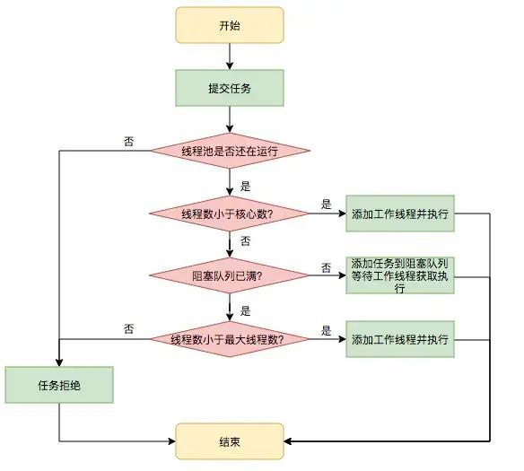

<h1 align="center">Java线程进阶之ThreadPoolExecutor线程池执行原理机制详解</h1>

## 前言

线程池有很多优点：

降低资源消耗;

提高响应速度;

提高线程的可管理性等等;

今天我们就来分析探讨下原理实现


## 一、线程池接口简单分析


### 1、Executor接口

```java
public interface Executor {
// 执行一个任务。任务都被封装成Runnable的实现
    void execute(Runnable command);
}
```

### 2、 ExecutorService接口

```java
public interface ExecutorService extends Executor {
	// 启动有序的关闭，之前提交的任务将会被执行，但不会接受新的任务。
  void shutdown();
	// 尝试停止所有正在执行的任务，停止等待处理的任务，病返回任务列表
  List<Runnable> shutdownNow();
	// 判断线程池是否已经关闭
  boolean isShutdown();
	// 如果关闭后所有任务都已完成。但是前提是必须先执行：shutdown 或者 shutdownNow
  boolean isTerminated();
	// 在开启shutdown之后，阻止所有的任务知道执行完成
  boolean awaitTermination(long timeout, TimeUnit unit)
        throws InterruptedException;
	// 提交任务，带返回结果的
  <T> Future<T> submit(Callable<T> task);
	// 提交任务，封装返回结果为T
  <T> Future<T> submit(Runnable task, T result);
 	// 提交一个普通任务，返回结果任意
  Future<?> submit(Runnable task);
	// 执行一批任务，返回结果为 List<Future<T>>
  <T> List<Future<T>> invokeAll(Collection<? extends Callable<T>> tasks)
        throws InterruptedException;
  <T> List<Future<T>> invokeAll(Collection<? extends Callable<T>> tasks,
                                  long timeout, TimeUnit unit)
        throws InterruptedException;
  <T> T invokeAny(Collection<? extends Callable<T>> tasks)
        throws InterruptedException, ExecutionException;
  <T> T invokeAny(Collection<? extends Callable<T>> tasks,
                    long timeout, TimeUnit unit)
        throws InterruptedException, ExecutionException, TimeoutException;
}
```

其具有5个核心的内部类。其中4内部类对应的是拒绝策略。Worker是核心的执行代码;

### 3、 RejectedExecutionHandler

```java
public interface RejectedExecutionHandler { 
  // 拒绝执行策略     
  void rejectedExecution(Runnable r, ThreadPoolExecutor executor); 
} 
```

### 4、 AbortPolicy 策略

Java线程池默认的阻塞策略，不执行此任务，而且直接抛出一个运行时异常

```java
public static class AbortPolicy implements RejectedExecutionHandler {
  public AbortPolicy() { }
  // 直接抛出异常，描述前线程的基本信息
  public void rejectedExecution(Runnable r, ThreadPoolExecutor e) {
    	throw new RejectedExecutionException("Task " + r.toString() + " rejected from " + e.toString());
  }
} 
```

### 5、DiscardPolicy策略

空方法，不做任何处理

```java
public static class DiscardPolicy implements RejectedExecutionHandler {
  public DiscardPolicy() { }
  public void rejectedExecution(Runnable r, ThreadPoolExecutor e) {
  } 
} 
```

### 6、DiscardOldestPolicy 策略

从队列里面抛弃一个最老的任务，并再次execute 此task

```java
public static class DiscardOldestPolicy implements RejectedExecutionHandler {
  public DiscardOldestPolicy() { }
  public void rejectedExecution(Runnable r, ThreadPoolExecutor e) {
    if (!e.isShutdown()) {
      // 从队列里面取出最老的一个任务
      e.getQueue().poll();
      // 手动调用execute方法执行，将任务添加到队列中 
      e.execute(r);
    }
  }
} 
```

### 7、CallerRunsPolicy 策略

```java
public static class CallerRunsPolicy implements RejectedExecutionHandler {
  /**          
  * Creates a {@code CallerRunsPolicy}.
  */ 
  public CallerRunsPolicy() { }
  // 如果当前线程池没有关闭，则调用线程的run方法
  public void rejectedExecution(Runnable r, ThreadPoolExecutor e) {
    if (!e.isShutdown()) {
      r.run();
    }
  }
} 
```

### 8、ThreadPoolExecutor

构造函数详解

```java
public class ThreadPoolExecutor extends AbstractExecutorService {
  public ThreadPoolExecutor(int corePoolSize, 
                            int maximumPoolSize, 
                            long keepAliveTime, 
                            TimeUnit unit, 
                            BlockingQueue<Runnable> workQueue) {
    this(corePoolSize, maximumPoolSize, keepAliveTime, unit, workQueue, Executors.defaultThreadFactory(), defaultHandler);
  } 
} 
```

构造函数参数说明：

- corePoolSize:线程池中的核心线程数，空闲时候线程也不会回收，除非把allowCoreThreadTimeOut设置为 true，这时核心线程才会被回收;
- maximumPoolSize:线程池中可以创建的最大线程数，限定为2^29-1;
- keepAliveTime:当线程池中创建的线程超过了核心线程数的时候，在没有新任务加入的等待时间;
- workQueue:存放任务的队列，只有当线程数 > 核心线程数，才会把其他的任务放入queue，一般常用的是queue就是ArrayBlockingQueue，LinkedBlockingQueue，SynchronousQueue;
- threadFactory:创建线程的工厂类;
- handler:当queue满了和线程数达到最大限制，对于继续到达的任务采取的策略。默认采取AbortPolicy ， 也就是拒绝策略，直接抛出异常;

### 9、核心成员变量分析

- 线程池中设计非常巧妙的一个地方是把线程池的状态和运行的线程数量用一个int类型进行存储;这样一来可以保持线程池状态和线程池活跃线程数量的一致性。因为AtomicInteger是线程安全的;
- workerCount：线程池中当前活动的线程数量，占据ctl的低29位;
- runState：线程池运行状态，占据ctl的高3位，有RUNNING、SHUTDOWN、STOP、TIDYING、TERMINATED五种状态;
- 为了将线程池的状态和线程池中的工作线程的数量放到一个int里面进行管理。他们利用了二进制数据进行位运算。其中int类型有4个字节，一个字节8位。总共有32位。其中高的3位表示线程的状态。低29位代表线程的数量;

其中32位中，高三位代表的是状态：

```java
	111 > RUNNING 
  000 > SHUTDOWN 
  001 > STOP 
  010 > TIDYING 
  110 > TERMINATED 
```

低29位代表线程的数量。所以最大的线程数为 2^29 -1 = 536870911;

// 记录线程池状态和线程数量(总共32位，前三位表示线程池状态，后29位表示线程数量)，保证线程安全性

```java
private final AtomicInteger ctl = new AtomicInteger(ctlOf(RUNNING, 0)); 
// int 字节32位，COUNT_BITS代表的是29位
private static final int COUNT_BITS = Integer.SIZE - 3;
// 线程的最大容量：000 11111111111111111111111111111
private static final int CAPACITY   = (1 << COUNT_BITS) - 1;
// 运行状态：111 00000000000000000000000000000 
private static final int RUNNING    = -1 << COUNT_BITS; 
// 关闭状态：000 00000000000000000000000000000     
private static final int SHUTDOWN   =  0 << COUNT_BITS; 
// 停止状态：001 00000000000000000000000000000     
private static final int STOP       =  1 << COUNT_BITS; 
// 整理状态：010 00000000000000000000000000000     
private static final int TIDYING    =  2 << COUNT_BITS; 
// 终止状态：011 00000000000000000000000000000     
private static final int TERMINATED =  3 << COUNT_BITS; 
/** 
* 是按位取反的意思，CAPACITY表示的是高位的3个0，和低位的29个1，而~CAPACITY则表示高位的3个1，2低位的9个0， 
* 然后再与入参c执行按位与操作，即高3位保持原样，低29位全部设置为0，也就获取了线程池的运行状态runState 
*/     
private static int runStateOf(int c) {
  return c & ~CAPACITY; 
} 
/** 
* 返回当前线程的数量。其中c代表线程池的状态，即是高三位。： 
* 而CAPACITY 代表的是线程的容量，即000 11111111111111111111111111111 
* c & CAPACITY ，只有当都为1的时候，才为真，这样直接舍弃高位 
*/
private static int workerCountOf(int c)  {
  return c & CAPACITY; 
} 
/** 
* 传入的rs表示线程池运行状态runState，其是高3位有值，低29位全部为0的int， 
* 而wc则代表线程池中有效线程的数量workerCount，其为高3位全部为0，而低29位有值得int， 
* 将runState和workerCount做或操作|处理，即用runState的高3位,workerCount的低29位填充的数字，而默认传入的  
*/
private static int ctlOf(int rs, int wc) { 
  return rs | wc; 
} 
```

线程池的状态转换：

```java
	// 调用了shutdown()方法 
	RUNNING -> SHUTDOWN  
	// 调用了shutdownNow()  
  (RUNNING 或 SHUTDOWN) -> STOP  
	// 当队列和线程池为空  
  SHUTDOWN -> TIDYING  
	// 当线程池为空  
  STOP -> TIDYING  
	// 当terminated()钩子方法执行完成  
  TIDYING -> TERMINATED  
```


## 二、线程池执行流程源码分析



### 1、程序入口：execute 方法

```java
public void execute(Runnable command) {
  if (command == null)
    throw new NullPointerException(); 
  //获取当前线程池的状态+线程个数变量 
  int c = ctl.get(); 
  //当前线程池线程个数是否小于corePoolSize,小于则开启新线程运行 
  if (workerCountOf(c) < corePoolSize) {
    if (addWorker(command, true))
      return;
    c = ctl.get();
  }
  //如果线程池处于RUNNING状态，则添加任务到阻塞队列 
  if (isRunning(c) && workQueue.offer(command)) {
    //二次检查
    int recheck = ctl.get();
    //如果当前线程池状态不是RUNNING则从队列删除任务，并执行拒绝策略 
    if (! isRunning(recheck) && remove(command)) 
      reject(command);
    //否者如果当前线程池线程空，则添加一个线程 
    else if (workerCountOf(recheck) == 0) 
      addWorker(null, false);
  }
  //如果队列满了，则新增线程，新增失败则执行拒绝策略
  else if (!addWorker(command, false))
    reject(command);
} 
```

- 如果当前线程池线程个数小于corePoolSize则开启新线程;
- 否则添加任务到任务队列;
- 如果任务队列满了，则尝试新开启线程执行任务，如果线程个数>maximumPoolSize则执行拒绝策略;

重点看addWorkder方法：

```java
private boolean addWorker(Runnable firstTask, boolean core) {
  retry:
  for (;;) { 
    int c = ctl.get();
    int rs = runStateOf(c); 
    //1、 检查队列是否只在必要时为空.
    if (rs >= SHUTDOWN && ! (rs == SHUTDOWN && firstTask == null && ! workQueue.isEmpty())) 
      return false; 
    //循环cas增加线程个数 
    for (;;) { 
      int wc = workerCountOf(c);
      //如果线程个数超限则返回false 
      if (wc >= CAPACITY || wc >= (core ? corePoolSize : maximumPoolSize)) 
        return false;
      //cas增加线程个数，同时只有一个线程成功 
      if (compareAndIncrementWorkerCount(c)) 
        break retry; 
      //cas失败了，则看线程池状态是否变化了，变化则跳到外层循环重试重新获取线程池状态，否者内层循环重新cas。
      c = ctl.get(); 
      // Re-read ctl
      if (runStateOf(c) != rs)
        continue retry;
    }
  } 
  //2、到这里说明cas成功了
  boolean workerStarted = false;
  boolean workerAdded = false;
  Worker w = null; 
  try {
    //创建worker
    final ReentrantLock mainLock = this.mainLock; 
    w = new Worker(firstTask); 
    final Thread t = w.thread;
    if (t != null) { 
      //加独占锁，为了workers同步，因为可能多个线程调用了线程池的execute方法。
      mainLock.lock();
      try { 
        //重新检查线程池状态，为了避免在获取锁前调用了shutdown接口 
        int c = ctl.get(); 
        int rs = runStateOf(c); 
        if (rs < SHUTDOWN || (rs == SHUTDOWN && firstTask == null)) {  
          if (t.isAlive()) 
            // precheck that t is startable 
            throw new IllegalThreadStateException();
          //添加任务
          workers.add(w); 
          int s = workers.size(); 
          if (s > largestPoolSize) 
            largestPoolSize = s; 
          workerAdded = true; 
        } 
      } finally {
        mainLock.unlock(); 
      } 
      //添加成功则启动任务 
      if (workerAdded) { 
        t.start();   
        workerStarted = true;  
      }  
    }
  } finally {
    if (! workerStarted) 
      addWorkerFailed(w); 
  } 
  return workerStarted; 
} 
```

- 第(1)双重循环目的是通过cas增加线程池线程个数;
- 第(2)主要是并发安全的把任务添加到workers里面，并且启动任务执行;

```java
rs >= SHUTDOWN && ! (rs == SHUTDOWN && firstTask == null && ! workQueue.isEmpty()) 
```

也就是说下面几种情况下会返回false：

- 当前线程池状态为STOP，TIDYING，TERMINATED;
- 当前线程池状态为SHUTDOWN并且已经有了第一个任务;
- 当前线程池状态为SHUTDOWN并且任务队列为空;
- 内层循环作用是使用cas增加线程个数，如果线程个数超限则返回false，否者进行cas，cas成功则退出双循环，否者cas失败了，要看当前线程池的状态是否变化了，如果变了，则重新进入外层循环重新获取线程池状态，否者进入内层循环继续进行cas尝试;
- 到了第(2)说明CAS成功了，也就是说线程个数加一了，但是现在任务还没开始执行，这里使用全局的独占锁来控制workers里面添加任务，其实也可以使用并发安全的set，但是性能没有独占锁好;
- 这里需要注意的是要在获取锁后重新检查线程池的状态，这是因为其他线程可可能在本方法获取锁前改变了线程池的状态，比如调用了shutdown方法。添加成功则启动任务执行;

### 2、 工作线程Worker

先看下构造函数：

```java
Worker(Runnable firstTask) {
  setState(-1); 
  // 在调用runWorker前禁止中断
  this.firstTask = firstTask;
  this.thread = getThreadFactory().newThread(this);
  //创建一个线程
} 
```

- 这里添加一个新状态-1是为了避免当前线程worker线程被中断;
- 这里设置了-1所以条件不满足就不会中断该线程了;
- 运行runWorker时候会调用unlock方法，该方法吧status变为了0，所以这时候调用shutdownNow会中断worker线程;

```java
final void runWorker(Worker w) {
  Thread wt = Thread.currentThread(); 
  Runnable task = w.firstTask;
  w.firstTask = null;
  w.unlock(); 
  // status设置为0，允许中断 
  boolean completedAbruptly = true;
  try {
    while (task != null || (task = getTask()) != null) { 
      w.lock(); 
      // 如果线程池当前状态至少是stop，则设置中断标志; 
      // 如果线程池当前状态是RUNNININ，则重置中断标志，重置后需要重新 
      //检查下线程池状态，因为当重置中断标志时候，可能调用了线程池的shutdown方法 
      //改变了线程池状态。
      if ((runStateAtLeast(ctl.get(), STOP) || (Thread.interrupted() && runStateAtLeast(ctl.get(), STOP))) && !wt.isInterrupted())                    wt.interrupt(); 
      try { 
        //任务执行前干一些事情 
        beforeExecute(wt, task);
        Throwable thrown = null; 
        try {
          task.run();//执行任务
        } catch (RuntimeException x) {
          thrown = x; throw x;
        } catch (Error x) { 
          thrown = x; throw x;
        } catch (Throwable x) {
          thrown = x; throw new Error(x);
        } finally {  
          //任务执行完毕后干一些事情 
          afterExecute(task, thrown);
        } 
      } finally {    
        task = null;  
        //统计当前worker完成了多少个任务 
        w.completedTasks++;    
        w.unlock();        
      }    
    }     
    completedAbruptly = false; 
  } finally {    
    //执行清了工作   
    processWorkerExit(w, completedAbruptly);
  }   
} 
```

- 如果当前task为空，则直接执行;
- 否者调用getTask从任务队列获取一个任务执行，如果任务队列为空，则worker退出;

```java
private Runnable getTask() {
  boolean timedOut = false; 
  // Did the last poll() time out?    
  retry:    
  for (;;) { 
    int c = ctl.get();    
    int rs = runStateOf(c);   
    // 如果当前线程池状态>=STOP 或者线程池状态为shutdown并且工作队列为空则，减少工作线程个数   
    if (rs >= SHUTDOWN && (rs >= STOP || workQueue.isEmpty())) {     
      decrementWorkerCount();   
      return null;    
    }     
    boolean timed;  
    // Are workers subject to culling?      
    for (;;) {         
      int wc = workerCountOf(c);  
      timed = allowCoreThreadTimeOut || wc > corePoolSize;  
      if (wc <= maximumPoolSize && ! (timedOut && timed))  
        break;      
      if (compareAndDecrementWorkerCount(c))    
        return null;      
      c = ctl.get();  
      // Re-read ctl     
      if (runStateOf(c) != rs)      
        continue retry;      
      // else CAS failed due to workerCount change; retry inner loop  
    } 
    try {   
      //根据timed选择调用poll还是阻塞的take    
      Runnable r = timed ?         
        workQueue.poll(keepAliveTime, TimeUnit.NANOSECONDS) :   
      workQueue.take();         
      if (r != null)        
        return r;         
      timedOut = true;     
    } catch (InterruptedException retry) {     
      timedOut = false; 
    }   
  }
} 
private void processWorkerExit(Worker w, boolean completedAbruptly) {  
  if (completedAbruptly) // If abrupt, then workerCount wasn't adjusted
    decrementWorkerCount();  
  //统计整个线程池完成的任务个数    
  final ReentrantLock mainLock = this.mainLock; 
  mainLock.lock();  
  try {     
    completedTaskCount += w.completedTasks;  
    workers.remove(w);   
  } finally {       
    mainLock.unlock(); 
  }   
  //尝试设置线程池状态为TERMINATED，如果当前是shutdonw状态并且工作队列为空   
  //或者当前是stop状态当前线程池里面没有活动线程   
  tryTerminate();   
  //如果当前线程个数小于核心个数，则增加 
  int c = ctl.get();    
  if (runStateLessThan(c, STOP)) {  
    if (!completedAbruptly) {       
      int min = allowCoreThreadTimeOut ? 0 : corePoolSize;  
      if (min == 0 && ! workQueue.isEmpty())     
        min = 1;       
      if (workerCountOf(c) >= min)  
        return; // replacement not needed 
    }  
    addWorker(null, false); 
  } 
} 
```

### **3、 shutdown操作**

- 调用shutdown后，线程池就不会在接受新的任务了;
- 但是工作队列里面的任务还是要执行的，但是该方法立刻返回的，并不等待队列任务完成在返回;

```java
public void shutdown() {  
  final ReentrantLock mainLock = this.mainLock;   
  mainLock.lock();  
  try { 
    //权限检查     
    checkShutdownAccess();   
    //设置当前线程池状态为SHUTDOWN，如果已经是SHUTDOWN则直接返回   
    advanceRunState(SHUTDOWN);    
    //设置中断标志        
    interruptIdleWorkers();   
    onShutdown();  // hook for ScheduledThreadPoolExecutor   
  } finally {  
    mainLock.unlock();  
  }    
  //尝试状态变为TERMINATED 
  tryTerminate();
} 
```

如果当前状态>=targetState则直接返回，否者设置当前状态为targetState;

```java
private void advanceRunState(int targetState) {  
  for (;;) {      
    int c = ctl.get();   
    if (runStateAtLeast(c, targetState) || ctl.compareAndSet(c, ctlOf(targetState, workerCountOf(c)))) 
      break;   
  } 
} 
private void interruptIdleWorkers() {  
  interruptIdleWorkers(false); 
} 
```

- 设置所有线程的中断标志，主要这里首先加了全局锁;
- 同时只有一个线程可以调用shutdown时候设置中断标志，然后尝试获取worker自己的锁，获取成功则设置中断标示;

```java
private void interruptIdleWorkers(boolean onlyOne) { 
  final ReentrantLock mainLock = this.mainLock;  
  mainLock.lock();   
  try {       
    for (Worker w : workers) { 
      Thread t = w.thread;       
      if (!t.isInterrupted() && w.tryLock()) {   
        try {          
          t.interrupt();  
        } catch (SecurityException ignore) {   
        } finally {                   
          w.unlock();   
        }          
      }      
      if (onlyOne)   
        break;    
    }   
  } finally { 
    mainLock.unlock(); 
  }
} 
```

### 4、shutdownNow操作

调用shutdown后，线程池就不会在接受新的任务了，并且丢弃工作队列里面里面的任务，正在执行的任务会被中断，但是该方法立刻返回的，并不等待激活的任务执行完成在返回。返回队列里面的任务列表;

```java
public List<Runnable> shutdownNow() { 
  List<Runnable> tasks;    
  final ReentrantLock mainLock = this.mainLock; 
  mainLock.lock();   
  try {     
    checkShutdownAccess();//权限检查    
    advanceRunState(STOP);// 设置线程池状态为stop   
    interruptWorkers();//中断线程        
    tasks = drainQueue();//移动队列任务到tasks   
  } finally {   
    mainLock.unlock();  
  }   
  tryTerminate();   
  return tasks; 
} 
```

- 调用队列的drainTo一次当前队列的元素到taskList;
- 可能失败，如果调用drainTo后队列海不为空，则循环删除，并添加到taskList;

```java
private List<Runnable> drainQueue() { 
  BlockingQueue<Runnable> q = workQueue; 
  List<Runnable> taskList = new ArrayList<Runnable>();   
  q.drainTo(taskList);    
  if (!q.isEmpty()) { 
    for (Runnable r : q.toArray(new Runnable[0])) { 
      if (q.remove(r))         
        taskList.add(r);   
    }   
  }   
  return taskList;
} 
```

### 5、 awaitTermination操作

- 等待线程池状态变为TERMINATED则返回，或者时间超时;
- 由于整个过程独占锁，所以一般调用shutdown或者shutdownNow后使用;

```java
public boolean awaitTermination(long timeout, TimeUnit unit) 
  throws InterruptedException {      
  long nanos = unit.toNanos(timeout);    
  final ReentrantLock mainLock = this.mainLock;    
  mainLock.lock();     
  try {        
    for (;;) {        
      if (runStateAtLeast(ctl.get(), TERMINATED))       
        return true;              
      if (nanos <= 0)           
        return false;         
      nanos = termination.awaitNanos(nanos);  
    }     
  } finally {
    mainLock.unlock();    
  }   
} 
```


## 总结

当往线程池中添加任务的时候，每次添加一个任务都回去新增一个线程。直到不满足 wc < corePoolSize;

当前线程池的大小已经达到了corePoolSize的时候，每次添加任务会被存放到阻塞任务队列中。等待执行;

等等待任务队列也满的时候，且添加失败。此时在来新的任务，就会接着增加线程的个数，直到满足：wc >= maximumPoolSize ，添加线程失败执行拒绝策略;

线程池中，把线程的状态和数量通过int类型进行维护，高三位表示状态，低29位表示线程数量。这样可以保证线程的状态和数量的一致性;

线程池巧妙的使用一个Integer类型原子变量来记录线程池状态和线程池线程个数;


[Java线程进阶之ThreadPoolExecutor线程池执行原理机制详解 (qq.com)](https://mp.weixin.qq.com/s/2FFFg_U5A8_ij4f3iAQ1nw)

