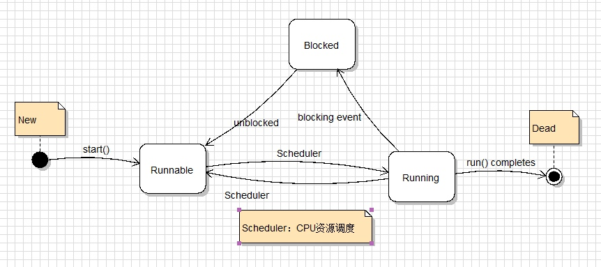

<h1 align="center">Thread</h1>

[toc]

## 线程定义

**线程（英语：thread）是操作系统能够进行运算调度的最小单位。它被包含在进程之中，是进程中的实际运作单位。一条线程指的是进程中一个单一顺序的控制流，一个进程中可以并发多个线程，每条线程并行执行不同的任务**。在`Unix System V`及`SunOS`中也被称为轻量进程（`lightweight processes`），但轻量进程更多指内核线程（`kernel thread`），而把用户线程（`user thread`）称为线程。

线程是独立调度和分派的基本单位。线程可以操作系统内核调度的内核线程，如Win32线程；由用户进程自行调度的用户线程，如Linux平台的`POSIX Thread`；或者由内核与用户进程，如Windows 7的线程，进行混合调度。

同一进程中的多条线程将共享该进程中的全部系统资源，如虚拟地址空间，文件描述符和信号处理等等。但同一进程中的多个线程有各自的调用栈（`call stack`），自己的寄存器环境（`register context`），自己的线程本地存储（`thread-local storage`）。

## 线程的生命周期

当线程被创建并启动以后，它既不是一启动就进入了执行状态，也不是一直处于执行状态，在线程的生命周期中，它要经过新建（New）、就绪（Runnable）、运行（Running）、阻塞（Blocked）和死亡（Dead）五种状态。尤其是当线程启动以后，它不能一直“霸占”着CPU独自运行，所以CPU需要在多条线程之间切换，于是线程状态也会多次在运行、阻塞之间切换。

### 1. 新建和就绪状态

当程序使用new关键字创建了一个线程之后，该线程就处于新建状态，此时它和其他Java对象一样，仅仅由Java虚拟机为其分配了内存，并初始化了其成员变量值。此时的线程对象没有表现出任何线程的动态特征，程序也不会执行线程的线程执行体。
  当线程对象调用了start()方法之后，该线程处于就绪状态，Java虚拟机会为其创建方法调用栈和程序计数器，处于这个状态的线程并没有开始运行，它只是表示该线程可以运行了。至于该线程何时开始运行，取决于JVM里线程调度器的调度。

### 2. 运行和阻塞状态

如果处于就绪状态的线程获得了CPU，开始执行run方法的线程执行体，则该线程处于运行状态。
当发生如下情况下，线程将会进入阻塞状态：

1. 线程调用sleep方法主动放弃所占用的处理器资源。
2. 线程调用了一个阻塞式IO方法，在该方法返回之前，该线程被阻塞。
3. 线程试图获得一个同步监视器，但该同步监视器正被其他线程锁持有。关于同步监视器的知识将在后面有更深入的介绍
4. 线程在等待某个通知(notify)。
5. 程序调用了线程的suspend方法将该线程挂起。不过这个方法容易导致死锁，所以程序应该尽量避免使用该方法。

当前正在执行的线程被阻塞之后，其他线程就可以获得执行的机会了。被阻塞的线程会在合适时候重新进入就绪状态，注意是就绪状态而不是运行状态。也就是
说被阻塞线程的阻塞解除后，必须重新等待线程调度器再次调度它。
针对上面的几种情况，当发生如下特定的情况将可以解除上面的阻塞，让该线程重新进入就绪状态：

1. 调用sleep方法的线程经过了指定时间。
2. 程调用的阻塞式IO方法已经返回。
3. 线程成功地获得了试图取得同步监视器。
4. 程正在等待某个通知时，其他线程发出了一个通知。
5. 处于挂起状态的线程被调用了resume恢复方法。

线程状态转换图：



### 3. 线程死亡

线程会以以下三种方式之一结束，结束后就处于死亡状态：
1. run()方法执行完成，线程正常结束。
2. 线程抛出一个未捕获的Exception或Error。
3. 直接调用该线程的stop()方法来结束该线程——该方法容易导致死锁，通常不推荐使用。

### 4. sleep 和 wait 的区别

- sleep 方法是 Thread 类中的静态方法，wait 是 Object 类中的方法
- sleep 并不会释放同步锁，而 wait 会释放同步锁
- sleep 可以在任何地方使用，而 wait 只能在同步方法或者同步代码块中使用
- sleep 中必须传入时间，而 wait 可以传，也可以不传，不传时间的话只有 notify 或者 notifyAll 才能唤醒，传时间的话在时间之后会自动唤醒

### 5. join 的用法

join 方法通常是保证线程间顺序调度的一个方法，它是 Thread 类中的方法。比方说在线程 A 中执行线程 `B.join()`，这时线程 A 会进入等待状态，直到线程 B 执行完毕之后才会唤醒，继续执行A线程中的后续方法。

join 方法可以传时间参数，也可以不传参数，不传参数实际上调用的是 `join(0)`。它的原理其实是使用了 wait 方法，join 的原理如下：

```java
public final synchronized void join(long millis)
    throws InterruptedException {
        long base = System.currentTimeMillis();
        long now = 0;
        if (millis < 0) {
            throw new IllegalArgumentException("timeout value is negative");
        }
        if (millis == 0) {
            while (isAlive()) {
                wait(0);
            }
        } else {
            while (isAlive()) {
                long delay = millis - now;
                if (delay <= 0) {
                    break;
                }
                wait(delay);
                now = System.currentTimeMillis() - base;
            }
        }
    }
```

### 6. 属性

| 属性     | 说明                                                         |
| -------- | ------------------------------------------------------------ |
| id       | 线程 id 用于标识不同的线程。编号可能被后续创建的线程使用。编号是只读属性，不能修改 |
| name     | 名字的默认值是 Thread-(id)                                   |
| daemon   | 分为守护线程和用户线程，我们可以通过 setDaemon(true) 把线程设置为守护线程。守护线程通常用于执行不重要的任务，比如监控其他线程的运行情况，GC 线程就是一个守护线程。setDaemon() 要在线程启动前设置，否则 JVM 会抛出非法线程状态异常，可被继承。 |
| priority | 线程调度器会根据这个值来决定优先运行哪个线程（不保证），优先级的取值范围为 1~10，默认值是 5，可被继承。Thread 中定义了下面三个优先级常量：<br>- 最低优先级：MIN_PRIORITY = 1<br>- 默认优先级：NORM_PRIORITY = 5<br>- 最高优先级：MAX_PRIORITY = 10 |

### 7. 状态


| 状态          | 说明                                                         |
| ------------- | ------------------------------------------------------------ |
| New           | 新创建了一个线程对象，但还没有调用start()方法。              |
| Runnable      | Ready 状态 线程对象创建后，其他线程(比如 main 线程）调用了该对象的 start() 方法。该状态的线程位于可运行线程池中，等待被线程调度选中 获取 cpu 的使用权。Running 绪状态的线程在获得 CPU 时间片后变为运行中状态（running）。 |
| Blocked       | 线程因为某种原因放弃了cpu 使用权（等待锁），暂时停止运行     |
| Waiting       | 线程进入等待状态因为以下几个方法：<br>- Object#wait()<br>- Thread#join()<br>- LockSupport#park() |
| Timed Waiting | 有等待时间的等待状态。                                       |
| Terminated    | 表示该线程已经执行完毕。                                     |

### 8. 状态控制

- wait() / notify() / notifyAll()

``wait()``，``notify()``，``notifyAll()`` 是定义在Object类的实例方法，用于控制线程状态，三个方法都必须在synchronized 同步关键字所限定的作用域中调用，否则会报错 ``java.lang.IllegalMonitorStateException``。

| 方法             | 说明                                                         |
| ---------------- | ------------------------------------------------------------ |
| ``wait()``       | 线程状态由 的使用权。Running 变为 Waiting, 并将当前线程放入等待队列中 |
| ``notify()``     | notify() 方法是将等待队列中一个等待线程从等待队列移动到同步队列中 |
| ``notifyAll() `` | 则是将所有等待队列中的线程移动到同步队列中                   |

被移动的线程状态由 Running 变为 Blocked，notifyAll 方法调用后，等待线程依旧不会从 wait() 返回,需要调用 notify() 或者 notifyAll() 的线程释放掉锁后，等待线程才有机会从 wait() 返回。

- join() / sleep() / yield()

在很多情况，主线程创建并启动子线程，如果子线程中需要进行大量的耗时计算，主线程往往早于子线程结束。这时，如果主线程想等待子线程执行结束之后再结束，比如子线程处理一个数据，主线程要取得这个数据，就要用 ``join()`` 方法。

``sleep(long)`` 方法在睡眠时不释放对象锁，而 ``join()`` 方法在等待的过程中释放对象锁。

``yield()`` 方法会临时暂停当前正在执行的线程，来让有同样优先级的正在等待的线程有机会执行。如果没有正在等待的线程，或者所有正在等待的线程的优先级都比较低，那么该线程会继续运行。执行了yield方法的线程什么时候会继续运行由线程调度器来决定。

## 线程实现

Java中的线程都是调用的原生系统的本地函数，Java线程模型是基于操作系统原生线程模型实现的，实现线程有三种方式：内核线程实现、用户线程实现、混合线程实现。

### 内核线程实现

直接由操作系统内核支持的线程，通过内核来完成进程切换。每个内核线程就是一个内核的分身，这样操作系统就可以同时处理多件事情，支持多线程的内核被称为多线程内核。

程序一般不直接使用内核线程，而是使用一种高级接口——轻量级进程，轻量级进程就是我们通常意义上的线程，可以获得内核线程的支持，与内核线程构成`1:1`的线程模型。


由于得到内核线程的支持，每个轻量级进程都成为一个独立的调度单元，即时有一个轻量级进程在系统调用中阻塞，也不会影响整个进程，但也有其局限性：由于是基于内核线程实现的，各种操作，如创建、销毁及同步，都需要进行系统调用。而系统调用代价较高，需要在内核态和用户态来回切换。

### 用户线程实现

从广义上说，一个线程不是内核线程，就是用户线程，所以轻量级进程也属于用户线程。狭义的用户线程是指完全建立在用户空间上的，系统内核不能感知到其存在。

用户线程的创建、同步、销毁和调度都是在用户空间实现的，因此相对较快，代价相对较低。这种用户线程和进程是`N:1`的线程模型。


由于用户线程没有内核的支持，线程的创建、切换和调度是需要自己实现的，而且由于操作系统只把CPU资源分配到进程，那诸如“阻塞如何处理”、“多处理器系统中如何将线程映射到其他处理器”这类问题解决起来异常复杂。

### 混合实现

这种实现模式将内核线程与用户线程一起使用，在这种方式下既存在用户线程，也存在轻量级进程。用户线程还是完全建立在用户空间，因此用户线程的创建、切换等操作依旧低廉。而操作系统提供的轻量级进程则作为用户线程和内核线程的桥梁，这样就可以使用内核提供的线程调度及处理器映射。这种实现下，用户线程和轻量级进程是`M:N`的模式。


## Java线程调度

线程调度分为协同式和抢占式。

  * `协同式调度`：线程的执行时间由线程自己控制，这种的实现很简单，但是很可能造成很严重的后果。
  * `抢占式调度`：由操作系统分配线程执行的时间，线程切换的决定权在操作系统。

有时候我们需要为某些线程多分配时间，这时我们就需要用到线程优先级的方法，Java提供了10种优先级。Java优先级是在操作系统的原生线程优先级上实现的，所以对于同一个优先级，不同的操作系统可能有不同的表现，也就是说 **Java线程优先级不是可靠的**。

## Java线程状态切换

Java线程模型定义了 6 种状态，在任意一个时间点，一个线程有且只有其中一个状态：

  * `新建（New）`：新建的Thread，尚未开始。
  * `运行（Runable）`：包含操作系统线程状态中的Running、Ready，也就是处于正在执行或正在等待CPU分配时间的状态。
  * `无限期等待（Waiting）`：处于这种状态的线程不会被分配CPU时间，等待其他线程唤醒。
  * `限期等待（Timed Waiting）`：处于这种状态的线程不会被分配CPU时间，在一定时间后会由系统自动唤醒。
  * `阻塞（Blocked）`：在等待获得排他锁。
  * `结束（Terminated）`：已终止的线程。


## 线程安全

多线程访问同一代码，不会产生不确定的结果。

## 线程如何关闭，以及如何防止线程的内存泄漏

有三种方法可以结束线程：

1. 使用退出标志，使线程正常退出，也就是当run方法完成后线程终止

2. 使用interrupt()方法中断线程

3. 使用stop方法强行终止线程（不推荐使用，可能发生不可预料的结果）

防止线程内存泄漏：线程接口Runnable采用静态内部类的方式。

## 线程的几个常见方法的比较

1. **Thread.sleep(long millis)**，一定是**当前线程**调用此方法，当前线程进入TIMED_WAITING状态，但不释放对象锁，millis后线程自动苏醒进入就绪状态。作用：给其它线程执行机会的最佳方式。
2. **Thread.yield()**，一定是**当前线程**调用此方法，当前线程放弃获取的CPU时间片，但不释放锁资源，由运行状态变为就绪状态，让OS再次选择线程。作用：让相同优先级的线程轮流执行，但并不保证一定会轮流执行。实际中无法保证yield()达到让步目的，因为让步的线程还有可能被线程调度程序再次选中。Thread.yield()不会导致阻塞。该方法与sleep()类似，只是不能由用户指定暂停多长时间。
3. **thread.join()/thread.join(long millis)**，**当前线程里调用其它线程thread的join方法**，当前线程进入WAITING/TIMED_WAITING状态，当前线程不会释放已经持有的对象锁。线程thread执行完毕或者millis时间到，当前线程进入就绪状态。
4. **thread.interrupt()**,**当前线程里调用其它线程thread的interrupt()方法,中断指定的线程。**
   如果指定线程调用了wait()方法组或者join方法组在阻塞状态，那么指定线程会抛出InterruptedException
5. **Thread.interrupted**，一定是**当前线程**调用此方法，检查当前线程是否被设置了中断，**该方法会重置当前线程的中断标志**，返回当前线程是否被设置了中断。
6. **thread.isInterrupted()**，**当前线程里调用其它线程thread的isInterrupted()方法,返回指定线程是否被中断**
7. **object.wait()**，**当前线程**调用**对象的wait()**方法，当前线程释放对象锁，进入等待队列。依靠notify()/notifyAll()唤醒或者wait(long timeout) timeout时间到自动唤醒。
8. **object.notify()**唤醒在此**对象监视器上等待的单个线程，选择是任意性的**。notifyAll()唤醒在此对象监视器上等待的所有线程。