<h1 align="center">我画了25张图展示线程池工作原理和实现原理</h1>

[toc]

> 为什么要使用线程池

平时讨论多线程处理，大佬们必定会说使用线程池，那为什么要使用线程池？其实，这个问题可以反过来思考一下，不使用线程池会怎么样？当需要多线程并发执行任务时，只能不断的通过new Thread创建线程，每创建一个线程都需要在堆上分配内存空间，同时需要分配虚拟机栈、本地方法栈、程序计数器等线程私有的内存空间，当这个线程对象被可达性分析算法标记为不可用时被GC回收，这样频繁的创建和回收需要大量的额外开销。再者说，JVM的内存资源是有限的，如果系统中大量的创建线程对象，JVM很可能直接抛出OutOfMemoryError异常，还有大量的线程去竞争CPU会产生其他的性能开销，更多的线程反而会降低性能，所以必须要限制线程数。

既然不使用线程池有那么多问题，我们来看一下使用线程池有哪些好处：

- 使用线程池可以复用池中的线程，不需要每次都创建新线程，减少创建和销毁线程的开销；
- 同时，线程池具有队列缓冲策略、拒绝机制和动态管理线程个数，特定的线程池还具有定时执行、周期执行功能，比较重要的一点是线程池可实现线程环境的隔离，例如分别定义支付功能相关线程池和优惠券功能相关线程池，当其中一个运行有问题时不会影响另一个。

## 如何构造一个线程池对象

本文内容我们只聊线程池ThreadPoolExecutor，查看它的源码会发现它继承了AbstractExecutorService抽象类，而AbstractExecutorService实现了ExecutorService接口，ExecutorService继承了Executor接口，所以ThreadPoolExecutor间接实现了ExecutorService接口和Executor接口，它们的关系图如下。

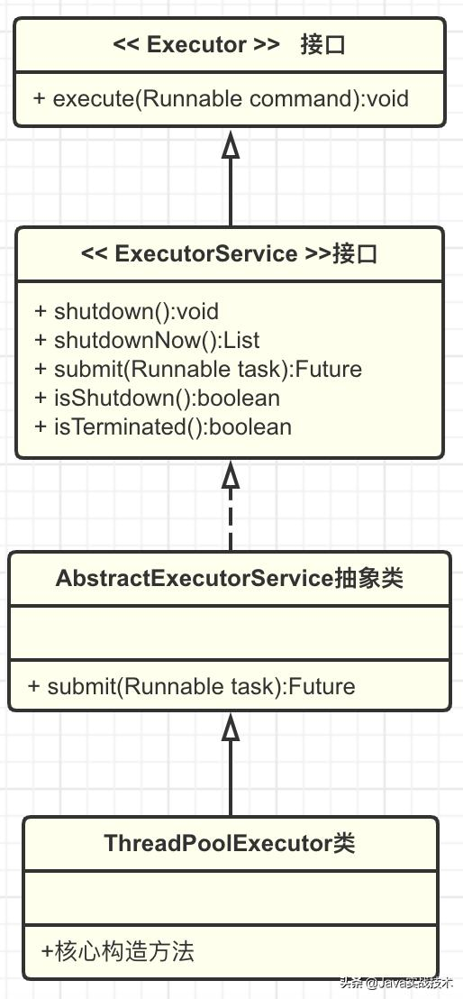

一般我们使用的execute方法是在Executor接口中定义的，而submit方法是在ExecutorService接口中定义的，所以当我们创建一个Executor类型变量引用ThreadPoolExecutor对象实例时可以使用execute方法提交任务，当我们创建一个ExecutorService类型变量时可以使用submit方法，当然我们可以直接创建ThreadPoolExecutor类型变量使用execute方法或submit方法。

ThreadPoolExecutor定义了七大核心属性，这些属性是线程池实现的基石。


corePoolSize(int)：核心线程数量。默认情况下，在创建了线程池后，线程池中的线程数为0，当有任务来之后，就会创建一个线程去执行任务，当线程池中的线程数目达到corePoolSize后，就会把到达的任务放到任务队列当中。线程池将长期保证这些线程处于存活状态，即使线程已经处于闲置状态。除非配置了allowCoreThreadTimeOut=true，核心线程数的线程也将不再保证长期存活于线程池内，在空闲时间超过keepAliveTime后被销毁。

workQueue：阻塞队列，存放等待执行的任务，线程从workQueue中取任务，若无任务将阻塞等待。当线程池中线程数量达到corePoolSize后，就会把新任务放到该队列当中。JDK提供了四个可直接使用的队列实现，分别是：基于数组的有界队列ArrayBlockingQueue、基于链表的无界队列LinkedBlockingQueue、只有一个元素的同步队列SynchronousQueue、优先级队列PriorityBlockingQueue。在实际使用时一定要设置队列长度。

maximumPoolSize(int)：线程池内的最大线程数量，线程池内维护的线程不得超过该数量，大于核心线程数量小于最大线程数量的线程将在空闲时间超过keepAliveTime后被销毁。当阻塞队列存满后，将会创建新线程执行任务，线程的数量不会大于maximumPoolSize。

keepAliveTime(long)：线程存活时间，若线程数超过了corePoolSize，线程闲置时间超过了存活时间，该线程将被销毁。除非配置了allowCoreThreadTimeOut=true，核心线程数的线程也将不再保证长期存活于线程池内，在空闲时间超过keepAliveTime后被销毁。

TimeUnit unit：线程存活时间的单位，例如TimeUnit.SECONDS表示秒。

RejectedExecutionHandler：拒绝策略，当任务队列存满并且线程池个数达到maximunPoolSize后采取的策略。ThreadPoolExecutor中提供了四种拒绝策略，分别是：抛RejectedExecutionException异常的AbortPolicy(如果不指定的默认策略)、使用调用者所在线程来运行任务CallerRunsPolicy、丢弃一个等待执行的任务，然后尝试执行当前任务DiscardOldestPolicy、不动声色的丢弃并且不抛异常DiscardPolicy。项目中如果为了更多的用户体验，可以自定义拒绝策略。

threadFactory：创建线程的工厂，虽说JDK提供了线程工厂的默认实现DefaultThreadFactory，但还是建议自定义实现最好，这样可以自定义线程创建的过程，例如线程分组、自定义线程名称等。

一般我们使用类的构造方法创建它的对象，ThreadPoolExecutor提供了四个构造方法。

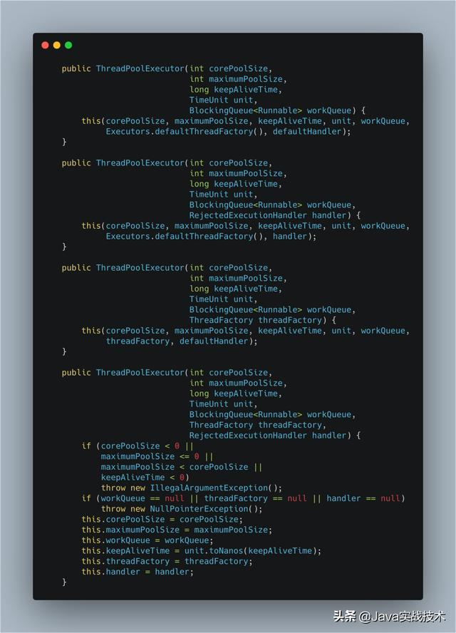

可以看到前三个方法最终都调用了最后一个、参数列表最长的那个方法，在这个方法中给七个属性赋值。创建线程池对象，强烈建议通过使用ThreadPoolExecutor的构造方法创建，不要使用Executors，至于建议的理由上文中也有说过，这里再引用阿里《Java开发手册》中的一段描述。

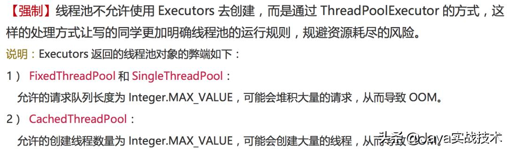

## 线程池的优点

- 重用线程池中的线程，避免因为线程的创建和销毁带来性能开销。
- 能有效控制线程池的最大并发数，避免大量的线程之间因互相抢占系统资源而导致的阻塞现象。
- 能够对线程进行管理，并提供定时执行以及定间隔循环执行等功能。

java 中，ThreadPoolExecutor 是线程池的真正实现：

``ThreadPoolExecutor.java``

```java
/**
    * Creates a new {@code ThreadPoolExecutor} with the given initial
    * parameters.
    *
    * @param corePoolSize 核心线程数
    * @param maximumPoolSize 最大线程数
    * @param keepAliveTime 非核心线程闲置的超时时长
    * @param unit 用于指定 keepAliveTime 参数的时间单位
    * @param 任务队列，通过线程池的 execute 方法提交的 Runnable 对象会存储在这个参数中
    * @param threadFactory 线程工厂，用于创建新线程
    * @param handler 任务队列已满或者是无法成功执行任务时调用
    */
public ThreadPoolExecutor(int corePoolSize,
                            int maximumPoolSize,
                            long keepAliveTime,
                            TimeUnit unit,
                            BlockingQueue<Runnable> workQueue,
                            ThreadFactory threadFactory,
                            RejectedExecutionHandler handler) {
    ···
}
```

| 类型                 | 创建方法                                           | 说明                                                         |
| -------------------- | -------------------------------------------------- | ------------------------------------------------------------ |
| FixedThreadPool      | Executors.newFixedThreadPool(int nThreads)         | 一种线程数量固定的线程池，只有核心线程并且不会被回收，没有超时机制 |
| CachedThreadPool     | Executors.newCachedThreadPool()                    | 一种线程数量不定的线程池，只有非核心线程，当线程都处于活动状态时，会创建新线程来处理新任务，否则会利用空闲的线程，超时时长为60s |
| ScheduledThreadPool  | Executors.newScheduledThreadPool(int corePoolSize) | 核心线程数是固定的，非核心线程数没有限制，非核心线程闲置时立刻回收，主要用于执行定时任务和固定周期的重复任务 |
| SingleThreadExecutor | Executors.newSingleThreadExecutor()                | 只有一个核心线程，确保所有任务在同一线程中按顺序执行         |

## 手撸样例

了解了线程池ThreadPoolExecutor的基本构造，接下来手撸一段代码看看如何使用，样例代码中的参数仅为了配合原理解说使用。

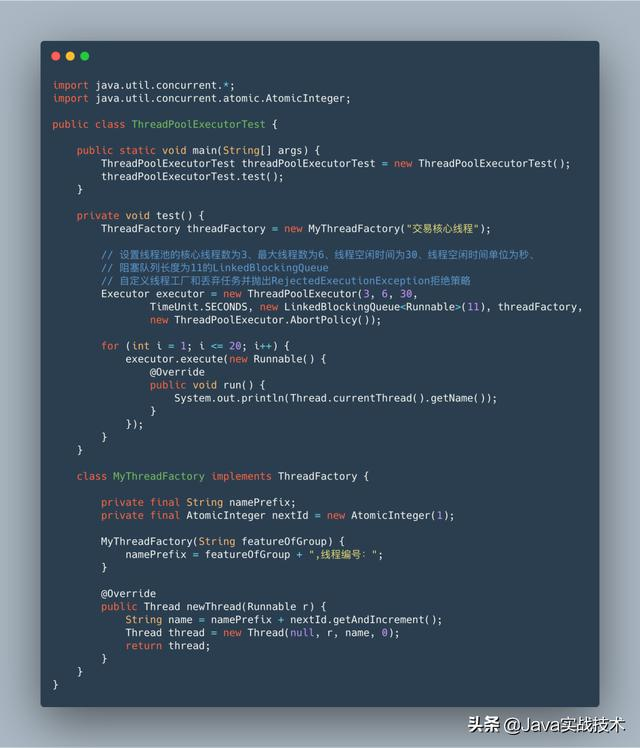

## 线程池工作原理

关于线程池的工作原理，我用下面的7幅图来展示。

1.通过execute方法提交任务时，当线程池中的线程数小于corePoolSize时，新提交的任务将通过创建一个新线程来执行，即使此时线程池中存在空闲线程。

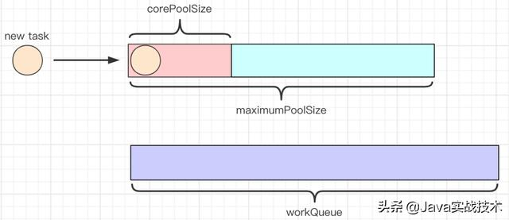

2.通过execute方法提交任务时，当线程池中线程数量达到corePoolSize时，新提交的任务将被放入workQueue中，等待线程池中线程调度执行。

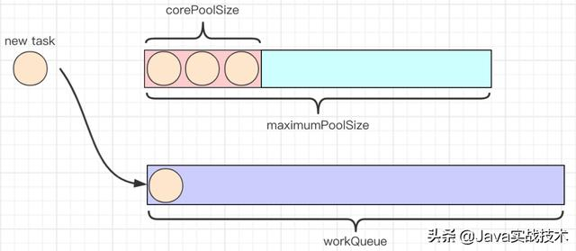

3.通过execute方法提交任务时，当workQueue已存满，且maximumPoolSize大于corePoolSize时，新提交的任务将通过创建新线程执行。

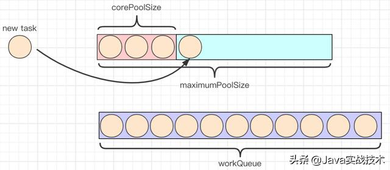

4.当线程池中的线程执行完任务空闲时，会尝试从workQueue中取头结点任务执行。

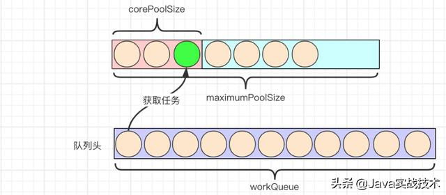

5.通过execute方法提交任务，当线程池中线程数达到maxmumPoolSize，并且workQueue也存满时，新提交的任务由RejectedExecutionHandler执行拒绝操作。

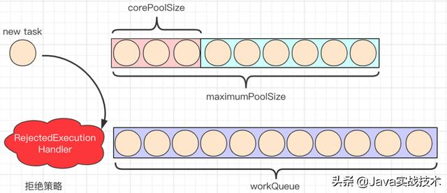

6.当线程池中线程数超过corePoolSize，并且未配置allowCoreThreadTimeOut=true，空闲时间超过keepAliveTime的线程会被销毁，保持线程池中线程数为corePoolSize。

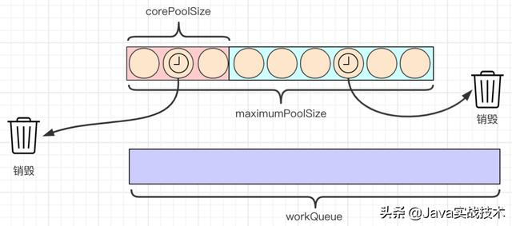

**注意**：上图表达的是销毁空闲线程，保持线程数为corePoolSize，不是销毁corePoolSize中的线程。

7.当设置allowCoreThreadTimeOut=true时，任何空闲时间超过keepAliveTime的线程都会被销毁。

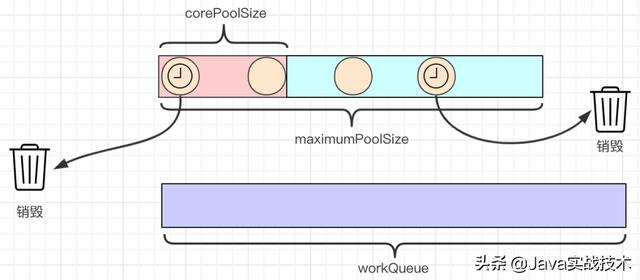

## 线程池底层实现原理

查看ThreadPoolExecutor的源码，发现ThreadPoolExecutor的实现还是比较复杂的，下面简单介绍几个重要的全局常量和方法。

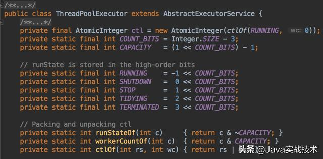

ctl用于表示线程池的状态和线程数，在ThreadPoolExecutor中使用32位二进制数来表示线程池的状态和线程池中线程数量，其中前3位表示线程池状态，后29位表示线程池中线程数。private final AtomicInteger ctl = new AtomicInteger(ctlOf(RUNNING, 0))初始化线程池状态为RUNNING、线程池数量为0。


COUNT_BITS值等于Integer.SIZE - 3，在源码中Integer.SIZE是32，所以COUNT_BITS=29。CAPACITY表示线程池允许的最大线程数，转算后的结果如下。

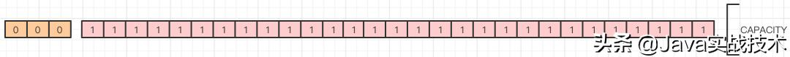

RUNNING、SHUTDOWN、STOP、TIDYING和TERMINATED分别表示线程池的不同状态，转算后的结果如下。

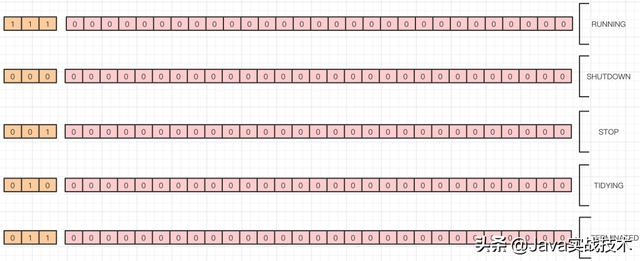

线程池处在不同的状态时，它的处理能力是不同的。

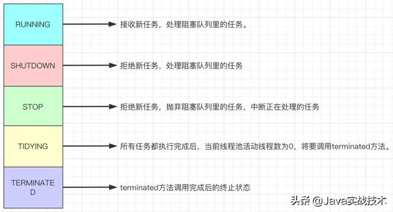

线程池不同状态之间的转换时机及转换关系如下图。

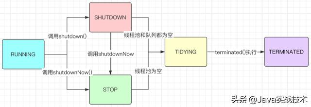

runStateOf获取ctl高三位，也就是线程池的状态。workerCountOf获取ctl低29位，也就是线程池中线程数。ctlOf计算ctlOf新值，也就是线程池状态和线程池个数。

你可能会疑问“为什么要介绍上面这些？”，这是因为接下来的源码分析会用到这些基础的知识点。一般，我们使用ThreadPoolExecutor的execute方法提交任务，所以从execute的源码入手。


为了更轻松的理解上图中的源码，我又画了一个流程图。

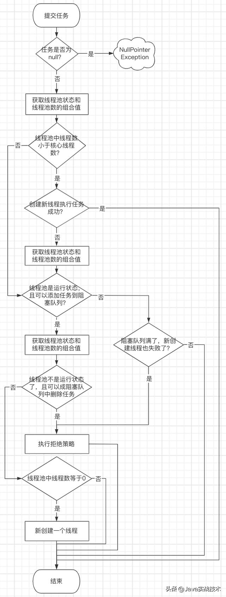

到这里线程池的基本实现原理已经很清晰了，接下来我们重点分析一下线程池中线程是如何执行任务、如何复用线程和线程空闲时间超限如何判断的。还是从execute方法入手，我们直接看它里面调用的addWorker方法，它实现了创建新线程执行任务。

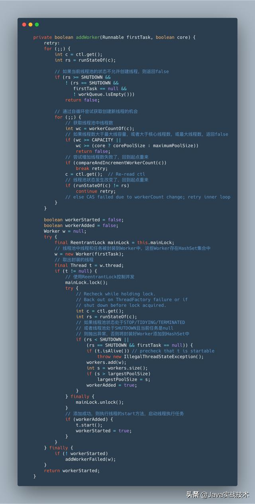

源码中将线程和任务封装到了Worker中，然后将Worker添加到HashSet集合中，添加成功后通过线程对象的start方法启动线程执行任务，既然这样那我们就来看看上图代码中的w = new Worker(firstTask)到底是如何执行的。

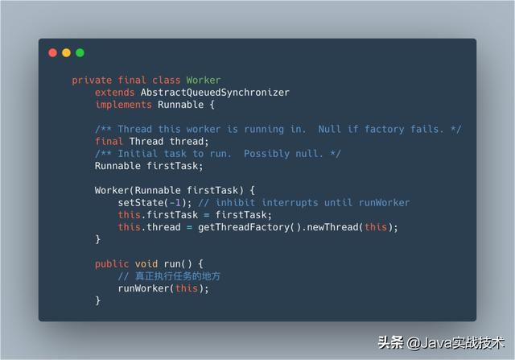

Worker继承了
AbstractQueuedSynchronizer，并且实现了Runnable接口，看到这里很清楚了任务最终由Worker中的run方法执行，而run方法里调用了runWorker方法，所以重点还是runWorker方法。

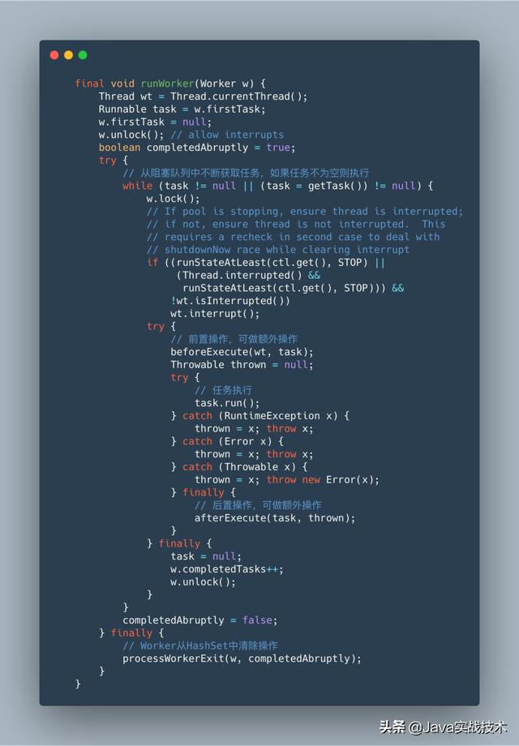

在runWorker方法中，使用循环，通过getTask方法，不断从阻塞队列中获取任务执行，如果任务不为空则执行任务，这里实现了线程的复用，不断的获取任务执行，不用重新创建线程；队列中获取的任务为null，则将Worker从HashSet集合中清除，注意这个清除就是空闲线程的回收。那getTask何时返回null？接着看getTask源码。

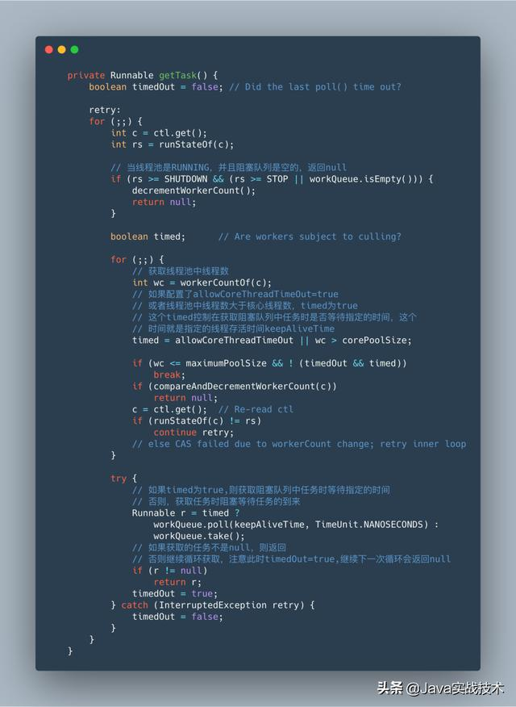

到这里，线程池中线程是如何执行任务、如何复用线程，以及线程空闲时间超限如何判断都已经清楚了。

最后，关于线程池的实现原理，我画了一张思维导图。ps：如果平台显示的不是高清图，可以在文末评论区或留言区@我，另外，本文全图文已收录到GitHub：wind7rui，后续其它内容也会更新到这里，欢迎follow、start。


## 聊一聊实战经验

**使用构造方法创建线程池**

细心的朋友会发现，全文竟没有介绍Executors，这个创建线程池的辅助工具类。是的，我强烈不推荐使用它，因为Executors中的newFixedThreadPool和newSingleThreadExecutor方法创建的线程池中，阻塞队列LinkedBlockingQueue的长度是Integer.MAX_VALUE，可能会堆积大量的任务，从而导致 OOM；而newCachedThreadPool方法创建的线程池中最大线程数是Integer.MAX_VALUE，会创建大量的线程，从而导致OOM。如果创建线程池，通过ThreadPoolExecutor的构造方法创建，这样使用这个线程池的人会更加明确线程池的各个参数的设置及运行方式，提前避免隐藏问题的发生。

**使用自定义线程工厂**

为什么要这么做呢？是因为，当项目规模逐渐扩展，各系统中线程池也不断增多，当发生线程执行问题时，通过自定义线程工厂创建的线程设置有意义的线程名称可快速追踪异常原因，高效、快速的定位问题。

**使用自定义拒绝策略**

虽然，JDK给我们提供了一些默认的拒绝策略，但我们可以根据项目需求的需要，或者是用户体验的需要，定制拒绝策略，完成特殊需求。

**线程池划分隔离**

不同业务、执行效率不同的分不同线程池，避免因某些异常导致整个线程池利用率下降或直接不可用，进而影响整个系统或其它系统的正常运行。


## 小结

实际工作中，我们经常使用线程池，对这块的要求不仅是常规的如何使用，原理我们也要清楚是怎么回事。同时，线程池工作原理和底层实现原理也是面试必问的考题，所以，这块是一定要掌握的。

source : https://www.toutiao.com/a6830397115303199246/