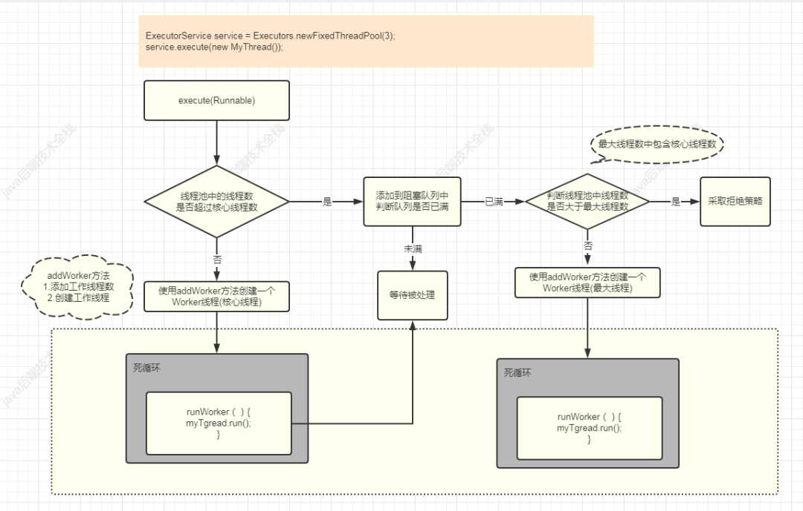

<h1 align="center">并发编程面试题</h1>

[TOC]

## 线程池整体图

## 1、为什么要创建线程池？

学了线程不懂线程池，那是远远不够的，因为我们通常使用线程的时候，都会涉及到线程池。

数据库也有连接池，也就是大家所讲的池化技术。

线程也有线程池，对于池的概念大家一定把握好两个关键：

- 控制资源的数量
- 重复利用资源

为什么要创建线程池，回答这个问题，我们可以说一下它的三个优点。

第一个，降低资源消耗。通过重复利用线程池中的线程，能规避我们不断创建线程和不断销毁线程造成的资源消耗。

第二个，提高响应速度。当任务到达线程池中，任务可以不需要等待线程创建就能立即执行。

第三个，提高线程的可管理性。大家都知道，线程是稀缺资源，如果无限制的创建，不仅会消耗系统资源，还会降低系统的稳定性。使用线程池，可以进行统一的分配、调优和监控。

回答完上面三个线程池的好处以后，面试官肯定会继续问：创建线程池的方式有哪些？

## 2、创建线程池有哪些方式？

在java中创建线程有两种方式：

- Executors
- ThreadPoolExecutor

这两个都在juc目录下面。其中，Executors可以理解为一个工具类，是用来生成线程池的。另外，Executors 的大部分创建线程方式最终使用的都是ThreadPoolExecutor。

并且在阿里开发规范中，建议不要使用Executors 来创建线程池。因为线程池的类型以及线程相关参数都是在Executors 中就已经封装好了，如果我们在代码中使用不当，可能会造成系统出问题。建议使用ThreadPoolExecutor创建线程，然后，根据自己的业务实际情况进行创建线程池。

## 3、Executors能创建几种常用线程池？

上面我们说到，创建线程池的两种方式。

其实，大部分面试官想要我们回答的是Executors 创建线程池的方式有哪几种？所以肯定会继续追问，Executors 创建线程池的几种方式。今天就来看看，如何回答这个问题。

我们可以把Executors 类理解成为一个工厂类，该类可以为我们提供六种创建线程池的方法：

* 第1种，newSingleThreadExecutor，创建了一个单线程的线程池，此线程池保证了所有任务的执行顺序都是按照任务的提交顺序执行。也就是说，这个池子里只有一个线程。

* 第2种，newFixedThreadPool，创建指定数量线程的线程池；

* 第3种，newCachedThreadPool，创建一个可缓存的线程池，伸缩性、动态调整，60s回收一次；

* 第4种，newScheduledThreadPool，创建一个大小无限的线程池；

* 第5种，newSingleThreadScheduledExecutor()，创建一个单例线程池，定期或延时执行任务，很多框架中使用此实现定时心跳检测。

* 第6种，newWorkStealingPool，这是Java 8 新增创建线程池的方法。

回答完上面内容后，面试就会问：线程池有哪些参数？

## 4、线程池有哪些参数？

这个问题也算是老掉牙的面试题，但是面试中频率是相当高，经久不衰。

线程池一共有7个参数：

* 第1个，maximumPoolSize，指的是最大线程数

* 第2个，corePoolSize，指的是核心线程数

* 第3个，keepAliveTime ，指的是最大线程活跃时间

* 第4个，unit: 指定了keepAliveTime的单位，可以为毫秒，秒，分，小时等；

* 第5个，workQueue: 存储未执行的任务的队列；

* 第6个，threadFactory: 创建线程的工厂，如果未指定则使用默认的线程工厂；

* 第7个，handler: 指定了当任务队列已满，并且没有可用线程执行任务时对新添加的任务的处理策略；

面试中，如果你能说出maximumPoolSize、corePoolSize、keepAliveTime 、workQueue、handler五个核心参数也算可以了，但还是建议大家把七个参数都回答出来。

## 5，能说说线程池原理吗？

这道题，我本人在面试中最喜欢用生活中的例子来回答，请看我是怎么回答的：

一家工厂，订单来了，正式员工们就开始生产零件。但是订单越来越多，正式员工处理不来了，就先把任务放到仓库里，但是遇到订单爆棚的时候，仓库也都放不下了，这时候，工厂就会想到找点临时工来帮忙生产零件，如果订单实在是太多了，这时候工厂可能就会想办法拒绝那些不是很有利润的订单。同时，生意也有惨淡的时候，这时候工厂也许就会清理临时工，让他们等以后忙的时候再来帮忙。

在这里，订单就是我们创建的线程，工厂就就是线程池，正式员工就是核心线程，临时员工就是最大线程，仓库就是阻塞队列，订单实在太多了，就会考虑到订单的利润，也就是说，利润太少了那就不干了，这就是拒绝策略。

> 建议结合前面整体图进行理解。

## 6、线程池有哪些拒绝策略？

线程池核心参数中，有个很重要的参数就是拒绝策略，面试官也是非常喜欢问的，大家可以这么回答。

线程池中主要有4种拒绝策略：

* 第1种，AbortPolicy，这是默认策略，指的是丢弃任务，抛出异常；

* 第2种，CallerRunsPolicy，简单的说，就是后面排队的线程就在那等着，被拒绝的任务在主线程中运行，所以主线程就被阻塞了，别的任务只能在被拒绝的任务执行完后，才会继续被提交到线程池中。

* 第3种，DiscardOldestPolicy，指的是丢弃等待队列中最久的任务，并且执行当前任务；

* 第4种，DiscardPolicy，直接丢弃任务，也不抛异常。

我们说完了线程池核心参数中一个拒绝策略，也有的面试官喜欢问另外一个参数，那就是阻塞队列。

## 7、线程池中使用到了阻塞队列，那你知道有哪些阻塞队列？

这个问题，也属于java集合框架的内容，所以，还是很有必要掌握的。

JDK7及以后一共有7种阻塞队列：

* 第1种，ArrayBlockingQueue ，由数组结构组成的有界阻塞队列。

* 第2种，LinkedBlockingQueue ，由链表结构组成的有界阻塞队列。

* 第3种，PriorityBlockingQueue ，支持优先级排序的无界阻塞队列。

* 第4种，DelayQueue，使用优先级队列实现的无界阻塞队列。

* 第5种，SynchronousQueue，不存储元素的阻塞队列。

* 第6种，LinkedTransferQueue，由链表结构组成的无界阻塞队列。

* 第7种，LinkedBlockingDeque，由链表结构组成的双向阻塞队列。

另外，Executors 中使用最多的是LinkedBlockingDeque，还用了SynchronousQueue。

回答完以上七种后，请记住把Executors 中使用的两种也强调一下，表示你对此非常熟悉。

还有可能会继续问一个非常重要的参数，那就是核心线程数。

## 8、线程池中的核心线程如何设置呢？

回答这个问题，我们首先得知道，线程和CPU有关，所以，如何设置核心线程数，肯定也是和CPU有关的，核心线程数设置和任务的类型也有关，任务类型有两种：

* 一种是CPU密集型， 比如像加解密、压缩、计算等一系列需要大量耗费 CPU 资源的任务，大部分场景下都是纯 CPU 计算。所以，核心线程数可以设置为：**核心线程数 = CPU个数 + 1**。

* 另外一种，就是IO密集型， 比如像 MySQL 数据库、文件的读写、网络通信等任务，这类任务不会特别消耗 CPU 资源，但是 IO 操作比较耗时，会占用比较多的时间。所以，核心线程数可以设置为：**核心线程数 = CPU个数 * 2**。

这个只是个理论值，具体设置大小，建议在本地、测试、准生产环境下调试出相对最优参数大小。

回答完这些后，有的面试官可能会问：你知道线程池的状态吗？

## 9、知道线程池有哪些状态吗？

很多人，平时估计都不知道线程池居然也有状态，都只知道线程状态。所以这种问题如果不准备，只要被问到必挂。

线程池有5种状态，

* 第1种，RUNNING，指的是线程池的初始化状态，可添加待执行的任务。

* 第2种，SHUTDOWN，指的是线程池处于待关闭状态，不接收新任务，仅处理已接收的任务。

* 第3种，STOP，指的是线程池立即关闭，不接收新的任务，放弃缓存队列中的任务并且中断正在处理的任务。

* 第4种，TIDYING，指的是线程池自主整理状态，我们可以调用 terminated() 方法进行线程池整理。

* 第5种，TERMINATED，指的是线程池终止状态。

回答完线程池状态后，下面这个问题是非常经典的，也基本上是问中高级的。

## 10、线程池中的线程是如何复用的？

这里的线程复用指的是线程池的中线程被重复利用，这里注意了，很多人也许都还没明白这点！再强调一次，

我们手动创建的线程放到线程池中，其实，这时候它变成了一个任务。

线程池执行这些任务的时候，不再是调用线程（任务）的start()方法，而是由线程池中的线程去执行这些任务。

然后线程池中的这些线程就不断地去循环，执行我们丢进去的任务，并调用这些任务的run()方法。此时调用的run()方法就相当于调用一个普通对象的put方法，通过重复使用这些固定线程来执行所有任务。

## 11、Java线程池中submit() 和 execute()方法有什么区别？

不知道你是否还记得，我们创建线程，然后把线程提交到线程池中时候，通常有两种方法：submit 和 execute 。所以面试官很有可能会问这个问题，这个问题也很有可能出现在笔试中。

回答这个问题，我们得先说说两者的相同点，

submit() 和 execute()方法都是用来提交任务的，指的是把我们创建的任务提交到线程池中。

两者的不同点在于，调用 execute() 方法提交任务不能拿到任务的返回值，而调用 submit() 可以使用 Future 接收线程池执行任务的返回值。

这里就可以联想到，我们创建线程的方式中，有的方式可以拿到线程返回值，有的拿不到。

另外，execute()方法是ThreadPoolExecutor的方法，而submit() 方法是ThreadPoolExecutor的父类AbstractExecutorService中的方法。

## 12、在工作中，有使用过线程池吗？

这道问题，对于99%的人都很害怕，因为工作中可能真的没用过，所以，心里很没底儿。有的人用过了，却没注意项目中是怎么样用，可能是组长或者其他人写了个工具类，自己用也是拷贝别人代码改改，然后也挺好的。

其实大家可以编造自己的业务场景哈，即使没有，你也可以自己编造点呀，不图羊嘛。这世道就是套路多多滴。这个没有具体答案，答案还得靠你结合你所做项目来回答哈。

## 来源

[并发编程的12个连环炮，你扛得住几个？](https://www.toutiao.com/i6948711152285237797/?tt_from=weixin&utm_campaign=client_share&wxshare_count=1&timestamp=1618461660&app=news_article&utm_source=weixin&utm_medium=toutiao_android&use_new_style=1&req_id=2021041512410001015120510436024345&share_token=5e61af5e-78b2-4e48-9fe7-00ec8ba45806&group_id=6948711152285237797)

