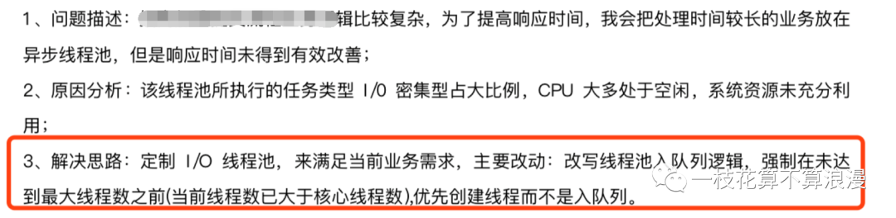
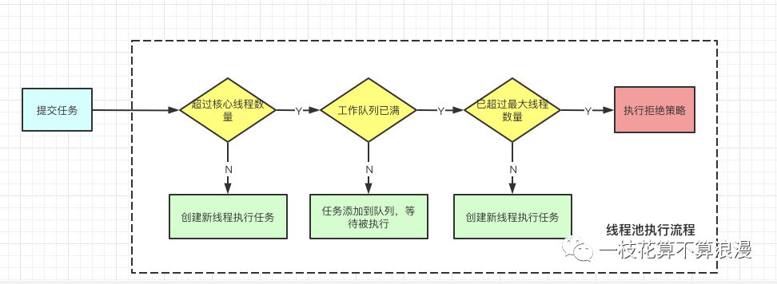
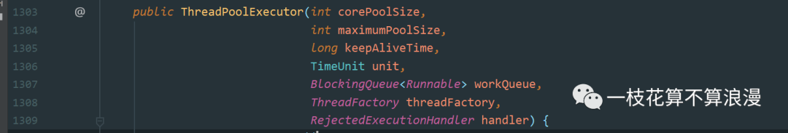
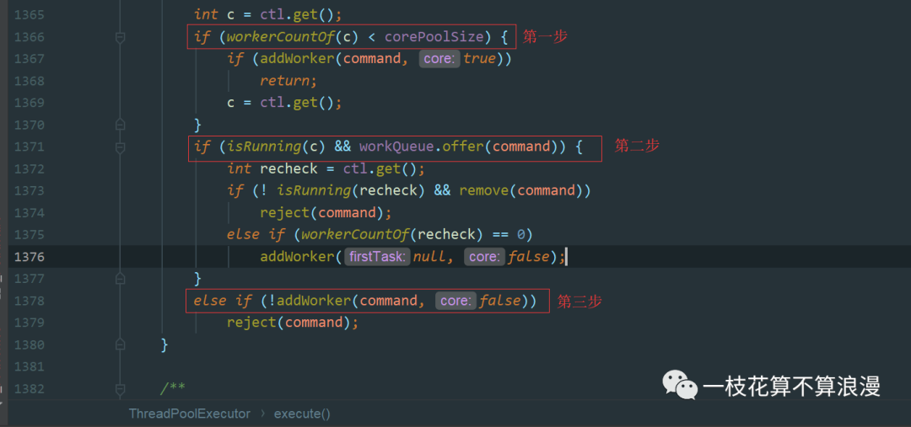
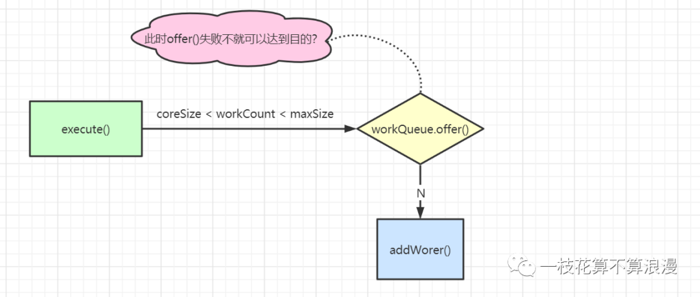
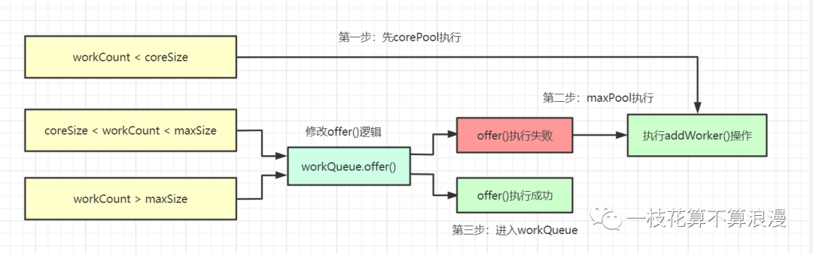
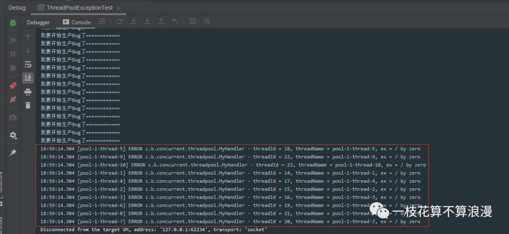
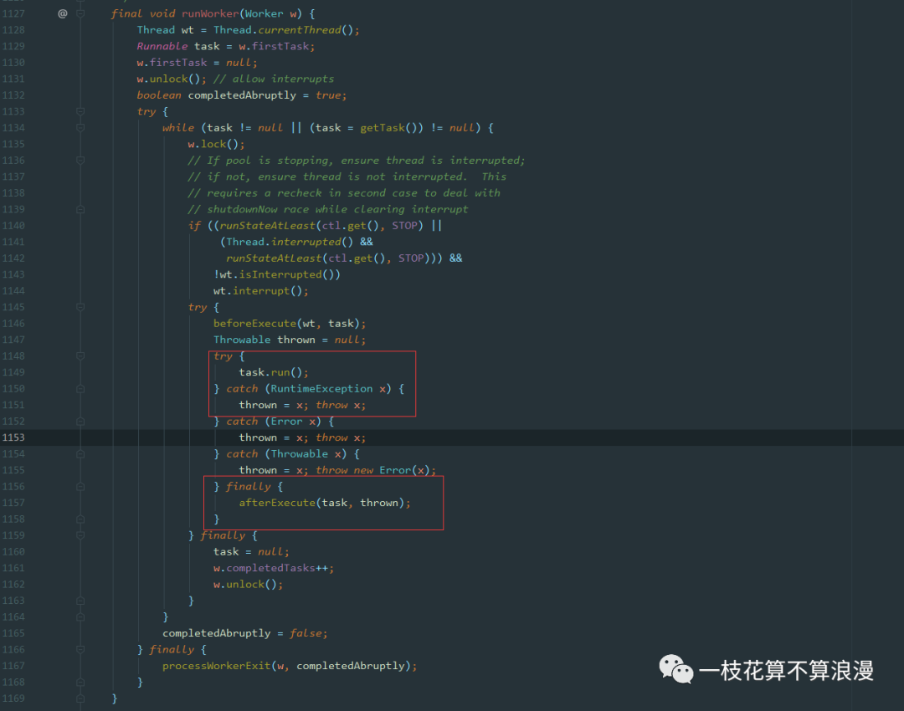
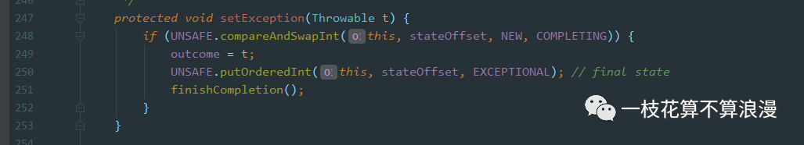

<h1 align="center">线程池如何按照core、max、queue的执行循序去执行？</h1>

[toc]

### 前言

**这是一个真实的面试题。**

前几天一个朋友在群里分享了他刚刚面试候选者时问的问题：**"线程池如何按照core、max、queue的执行循序去执行？"**。

我们都知道线程池中代码执行顺序是：**corePool->workQueue->maxPool**，源码我都看过，你现在问题让我改源码？？

一时间群里炸开了锅，小伙伴们纷纷打听他所在的公司，然后拉黑避坑。**(手动狗头，大家一起调侃٩(๑❛ᴗ❛๑)۶)**

**关于线程池他一共问了这么几个问题：**

- 线程池如何按照core、max、queue的顺序去执行？
- 子线程抛出的异常，主线程能感知到么？
- 线程池发生了异常改怎样处理？

全是一些有意思的问题，我之前也写过一篇很详细的图文教程：[【万字图文-原创】 | 学会Java中的线程池，这一篇也许就够了！](http://mp.weixin.qq.com/s?__biz=Mzg5ODA5NDIyNQ==&mid=2247484595&idx=1&sn=30e213125ed42a6c15767250e75f8fd5&chksm=c066814df711085b9fd7c0ea106bd1827b8941f7b6dca9a34a862f1e5dc32feae0992629b465&scene=21#wechat_redirect) ，不了解的小伙伴可以再回顾下~

但是针对这几个问题，可能大家一时间也有点懵。今天的文章我们以源码为基础来分析下该如何回答这三个问题。**（之前没阅读过源码也没关系，所有的分析都会贴出源码及图解）**

### 线程池如何按照core、max、queue的顺序执行？

#### 问题思考

对于这个问题，很多小伙伴肯定会疑惑：**"别人源码中写好的执行流程你为啥要改？这面试官脑子有病吧……"**

这里来思考一下现实工作场景中是否有这种需求？之前也看到过一份简历也写到过这个问题：

场景描述.png

一个线程池执行的任务属于`IO`密集型，`CPU`大多属于闲置状态，系统资源未充分利用。如果一瞬间来了大量请求，如果线程池数量大于`coreSize`时，多余的请求都会放入到等待队列中。等待着`corePool`中的线程执行完成后再来执行等待队列中的任务。

**试想一下，这种场景我们该如何优化？**

我们可以修改线程池的执行顺序为**corePool->maxPool->workQueue**。这样就能够充分利用`CPU`资源，提交的任务会被优先执行。当线程池中线程数量大于`maxSize`时才会将任务放入等待队列中。

你就说巧不巧？面试官的这个问题显然是经过认真思考来提问的，这是一个很有意思的问题，下面就一起看看如何解决吧。

#### 线程池运行流程

我们都知道线程池执行流程是先`corePool`再`workQueue`，最后才是`maxPool`的一个执行流程。

执行流程.png

#### 线程池核心参数

在回顾下`ThreadPoolExecutor.execute()`源码前我们先回顾下线程池中的几个重要参数：

线程池核心参数.png

我们来看下这几个参数的定义：
`corePoolSize`: 线程池中核心线程数量
`maximumPoolSize`: 线程池中最大线程数量
`keepAliveTime`: 非核心的空闲线程等待新任务的时间
`unit`: 时间单位。配合`allowCoreThreadTimeOut`也会清理核心线程池中的线程。
`workQueue`: 基于`Blocking`的任务队列，最好选用有界队列，指定队列长度
`threadFactory`: 线程工厂，最好自定义线程工厂，可以自定义每个线程的名称
`handler`: 拒绝策略，默认是`AbortPolicy`

#### ThreadPoolExecutor.execute()源码分析

我们可以看下`execute()`如下：

execute执行源码.png

接着来分析下执行过程：

1. 第一步：`workerCountOf(c)`时间计算当前线程池中线程的个数，当线程个数小于核心线程数
2. 第二步：线程池线程数量大于核心线程数，此时提交的任务会放入`workQueue`中，使用`offer()`进行操作
3. 第三步：`workQueue.offer()`执行失败，新提交的任务会直接执行，`addWorker()`会判断如果当前线程池数量大于最大线程数，则执行拒绝策略

好了，到了这里我们都已经很清楚了，关键在于第二步和第三步如何交换顺序执行呢？

#### 解决思路

仔细想一想，如果修改`workQueue.offer()`的实现不就可以达到目的了？我们先来画图来看一下：

问题思路.png

现在的问题就在于，如果当前线程池中`coreSize < workCount < maxSize`时，一定会先执行`offer()`操作。

我们如果修改`offer`的实现是否可以完成执行顺序的更换呢？这里也是画图来展示一下：

解决方式.png

#### Dubbo中EagerThreadPool解决方案

凑巧`Dubbo`中也有类似的实现，在`Dubbo`的`EagerThreadPool`自定义了一个`BlockingQueue`，在`offer()`方法中，如果当前线程池数量小于最大线程池时，直接返回`false`，这里就达到了调节线程池执行顺序的目的。

dubbo中解决方案.png

**源码直达**：https://github.com/apache/dubbo/blob/master/dubbo-common/src/main/java/org/apache/dubbo/common/threadpool/support/eager/TaskQueue.java

看到这里一切都真相大白了，解决思路以及方案都很简单，学会了没有？

这个问题背后还隐藏了一些场景的优化、源码的扩展等等知识，果然是一个值得思考的好问题。

### 子线程抛出的异常，主线程能感知到么？

#### 问题思考

这个问题其实也很容易回答，也仅仅是一个面试题而已，实际工作中子线程的异常不应该由主线程来捕获。

**针对这个问题，希望大家清楚的是：** 我们要明确线程代码的边界，异步化过程中，子线程抛出的异常应该由子线程自己去处理，而不是需要主线程感知来协助处理。

#### 解决方案

解决方案很简单，在虚拟机中，当一个线程如果没有显式处理异常而抛出时会将该异常事件报告给该线程对象的 `java.lang.Thread.UncaughtExceptionHandler` 进行处理，如果线程没有设置 `UncaughtExceptionHandler`，则默认会把异常栈信息输出到终端而使程序直接崩溃。

所以如果我们想在线程意外崩溃时做一些处理就可以通过实现 `UncaughtExceptionHandler` 来满足需求。

我们使用线程池设置`ThreadFactory`时可以指定`UncaughtExceptionHandler`，这样就可以捕获到子线程抛出的异常了。

#### 代码示例

具体代码如下：

```java
/**
 * 测试子线程异常问题
 *
 * @author wangmeng
 * @date 2020/6/13 18:08
 */
public class ThreadPoolExceptionTest {

    public static void main(String[] args) throws InterruptedException {
        MyHandler myHandler = new MyHandler();
        ExecutorService execute = new ThreadPoolExecutor(10, 10,
                0L, TimeUnit.MILLISECONDS, new LinkedBlockingQueue<Runnable>(), new ThreadFactoryBuilder().setUncaughtExceptionHandler(myHandler).build());

        TimeUnit.SECONDS.sleep(5);
        for (int i = 0; i < 10; i++) {
            execute.execute(new MyRunner());
        }
    }


    private static class MyRunner implements Runnable {
        @Override
        public void run() {
            int count = 0;
            while (true) {
                count++;
                System.out.println("我要开始生产Bug了============");
                if (count == 10) {
                    System.out.println(1 / 0);
                }

                if (count == 20) {
                    System.out.println("这里是不会执行到的==========");
                    break;
                }
            }
        }
    }
}

class MyHandler implements Thread.UncaughtExceptionHandler {
    private final static Logger LOGGER = LoggerFactory.getLogger(MyHandler.class);
    @Override
    public void uncaughtException(Thread t, Throwable e) {
        LOGGER.error("threadId = {}, threadName = {}, ex = {}", t.getId(), t.getName(), e.getMessage());
    }
}
```

执行结果：

执行结果.png

#### UncaughtExceptionHandler 解析

我们来看下`Thread`中的内部接口`UncaughtExceptionHandler`：

```java
public class Thread {
    ......
    /**
     * 当一个线程因未捕获的异常而即将终止时虚拟机将使用 Thread.getUncaughtExceptionHandler()
     * 获取已经设置的 UncaughtExceptionHandler 实例，并通过调用其 uncaughtException(...) 方
     * 法而传递相关异常信息。
     * 如果一个线程没有明确设置其 UncaughtExceptionHandler，则将其 ThreadGroup 对象作为其
     * handler，如果 ThreadGroup 对象对异常没有什么特殊的要求，则 ThreadGroup 会将调用转发给
     * 默认的未捕获异常处理器（即 Thread 类中定义的静态未捕获异常处理器对象）。
     *
     * @see #setDefaultUncaughtExceptionHandler
     * @see #setUncaughtExceptionHandler
     * @see ThreadGroup#uncaughtException
     */
    @FunctionalInterface
    public interface UncaughtExceptionHandler {
        /**
         * 未捕获异常崩溃时回调此方法
         */
        void uncaughtException(Thread t, Throwable e);
    }

    /**
     * 静态方法，用于设置一个默认的全局异常处理器。
     */
    public static void setDefaultUncaughtExceptionHandler(UncaughtExceptionHandler eh) {
         defaultUncaughtExceptionHandler = eh;
     }

    /**
     * 针对某个 Thread 对象的方法，用于对特定的线程进行未捕获的异常处理。
     */
    public void setUncaughtExceptionHandler(UncaughtExceptionHandler eh) {
        checkAccess();
        uncaughtExceptionHandler = eh;
    }

    /**
     * 当 Thread 崩溃时会调用该方法获取当前线程的 handler，获取不到就会调用 group（handler 类型）。
     * group 是 Thread 类的 ThreadGroup 类型属性，在 Thread 构造中实例化。
     */
    public UncaughtExceptionHandler getUncaughtExceptionHandler() {
        return uncaughtExceptionHandler != null ?
            uncaughtExceptionHandler : group;
    }

    /**
     * 线程全局默认 handler。
     */
    public static UncaughtExceptionHandler getDefaultUncaughtExceptionHandler() {
        return defaultUncaughtExceptionHandler;
    }
    ......
}
```

部分内容参考自：https://mp.weixin.qq.com/s/ghnNQnpou6-NemhFjpl4Jg

### 线程池发生了异常改怎样处理？

线程池中线程运行过程中出现了异常该怎样处理呢？线程池提交任务有两种方式，分别是`execute()`和`submit()`，这里会依次说明。

#### ThreadPoolExecutor.runWorker()实现

不管是使用`execute()`还是`submit()`提交任务，最终都会执行到`ThreadPoolExecutor.runWorker()`，我们来看下源码（源码基于JDK1.8）：

runWorker().png

我们看到在执行`task.run()`时，出现异常会直接向上抛出，这里处理的最好的方式就是在我们业务代码中使用`try...catch()`来捕获异常。

#### FutureTask.run()实现

如果我们使用`submit()`来提交任务，在`ThreadPoolExecutor.runWorker()`方法执行时最终会调用到`FutureTask.run()`方法里面去，不清楚的小伙伴也可以看下我之前的文章：

[线程池续：你必须要知道的线程池submit()实现原理之FutureTask！](http://mp.weixin.qq.com/s?__biz=Mzg5ODA5NDIyNQ==&mid=2247484617&idx=1&sn=147008d520f26857844de99bbc5e829c&chksm=c0668137f7110821198dca2cf22746cf5b5863c66dfdb7b07fe6f3a04a4441220906aea7a967&scene=21#wechat_redirect)

FutureTask.run().png

这里可以看到，如果业务代码抛出异常后，会被`catch`捕获到，然后调用`setExeception()`方法：

FutureTask.setException().png

可以看到其实类似于直接吞掉了，当我们调用`get()`方法的时候异常信息会包装到FutureTask内部的变量outcome中，我们也会获取到对应的异常信息。

在`ThreadPoolExecutor.runWorker()`最后`finally`中有一个`afterExecute()`钩子方法，如果我们重写了`afterExecute()`方法，就可以获取到子线程抛出的具体异常信息`Throwable`了。

#### 结论

对于线程池、包括线程的异常处理推荐以下方式:

1. 直接使用`try/catch`，这个也是最推荐的方式
2. 在我们构造线程池的时候，重写`uncaughtException()`方法，上面示例代码也有提到：

```java
public class ThreadPoolExceptionTest {

    public static void main(String[] args) throws InterruptedException {
        MyHandler myHandler = new MyHandler();
        ExecutorService execute = new ThreadPoolExecutor(10, 10,
                0L, TimeUnit.MILLISECONDS, new LinkedBlockingQueue<Runnable>(), new ThreadFactoryBuilder().setUncaughtExceptionHandler(myHandler).build());

        TimeUnit.SECONDS.sleep(5);
        for (int i = 0; i < 10; i++) {
            execute.execute(new MyRunner());
        }
    }
}

class MyHandler implements Thread.UncaughtExceptionHandler {
    private final static Logger LOGGER = LoggerFactory.getLogger(MyHandler.class);
    @Override
    public void uncaughtException(Thread t, Throwable e) {
        LOGGER.error("threadId = {}, threadName = {}, ex = {}", t.getId(), t.getName(), e.getMessage());
    }
}
```

3 直接重写`afterExecute()`方法，感知异常细节

### 总结

这篇文章到这里就结束了，不知道小伙伴们有没有一些感悟或收获？

通过这几个面试问题，我也深刻的感受到学习知识要多思考，看源码的过程中要多设置一些场景，这样才会收获更多。

### 来源

https://mp.weixin.qq.com/s/Vs9-Yto_t5t85xgJXazsLQ