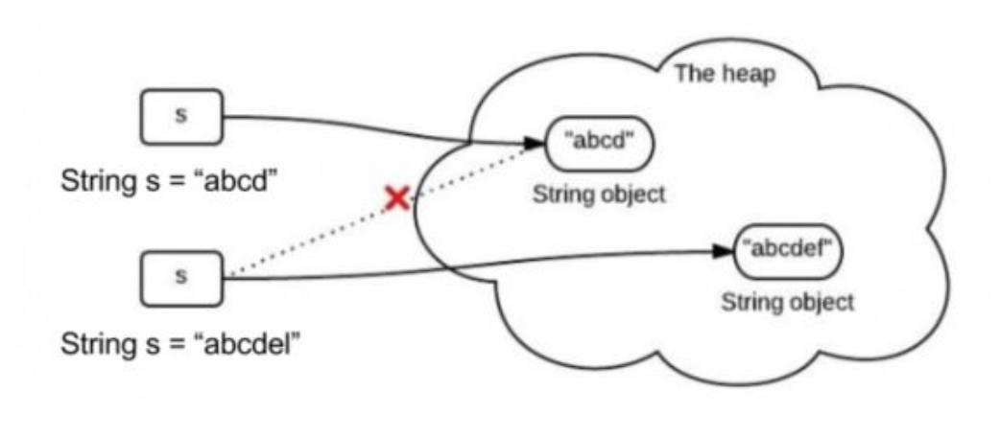
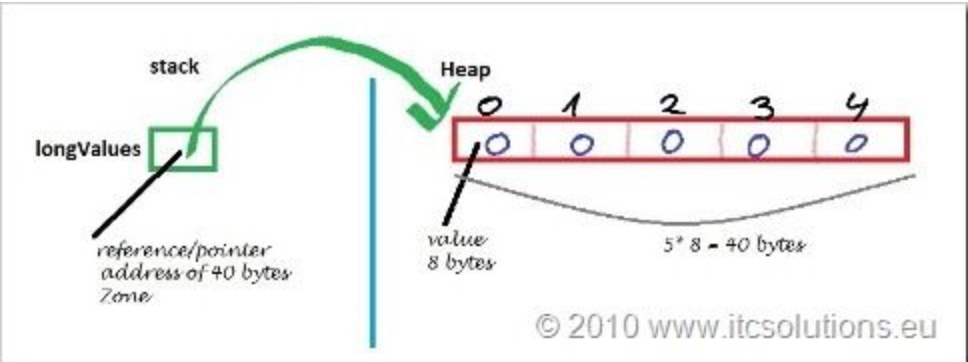
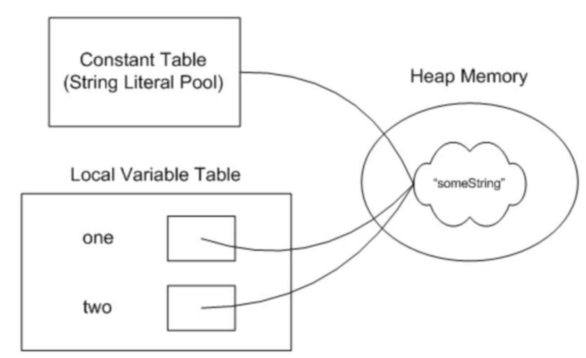

<h1 align="center">String</h1>

[toc]

## String 为什么要设计成不可变的？

### 1. 什么是不可变？

String不可变很简单，如下图，给一个已有的字符串“abcd”第二次赋值成“abcdel”，不是在原内存地址上修改数据，而是重新指向一个新对象，新地址。




### 2. String为什么不可变？

翻开JDK源码，java.lang.String类起前三行，是这样写的：

```java
public final class String implements java.io.Serializable, Comparable<String>, CharSequence {
		/**String 本质是个char数组，而且用final关键字修饰*/
		private final char value[];
		...
		...
}
```

首先String类是用final关键字修饰，这说明String不可继承。再看下面，String类的主力成员字段value是个char[]数组，而且是用final修饰的。final修饰的字段创建以后不可改变。

有的人以为故事这样完了，其实没有。因为虽然value是不可变，也只是value这个引用地址不可变。挡不住Array数据是可变的事实。Array数据结构如下图：



也就是说Array变量只是stack上的一个引用，数组的本体结构在heap堆。String类里的value用final修饰，只是说stack里的这个叫value的引用地址不可变。没有说堆里的array本身数据不可变。看下面这个例子：

```java
final int[] value = {1, 2, 3};
int[] another = {4, 5, 6};
value = another; // 编译器报错，final不可变
```

value用final修饰，编译器不允许我把value指向堆区另外一个地址。但如果我直接堆数组元素动手，分分钟搞定。

```java
final int[] value = {1, 2, 3};
value[2] = 100; // 这时候数组已经是{1, 2, 100}
```

所以String是不可变的，关键是因为SUN公司的工程师，在后面所有String的方法里很小心的没有去动Array里的元素，没有暴露内部成员字段。private final char value[]这一句里，private的私有访问权限的作用比final大。而且设计师很小心的把整个String设成final禁止继承，避免被其他人继承后破坏。所以String是不可变的关键都在底层的实现，而不是一个final。考验的是工程师构造数据类型，封装数据的功力。

### 3. 不可变有什么好处？

这个简单的原因，就是为了安全。看下面这个场景，一个函数appendStr()在不可变的String参数后面加上一段“bbb”后返回。appendSb()负责在可变的StringBuilder后面加“bbb”。

```java
class Test {
		// 不可变的String
	public static String appendStr(String s) {
			s += "bbb";
			return s;
  }
  // 可变的StringBuilder
  public static StringBuilder appendSb(StringBuilder sb) {
    return sb.append("bbb");
  }
  
  public static void main(String[] args) {
    // String做参数
    String s = new String("aaa");
    String ns = Test.appendStr(s);
    System.out.pringln("String aaa >>> " + s.toString());
    
    // StringBuilder做参数
    StringBuilder sb = new StringBuilder("aaa");
    StringBuilder nsb = Test.appendSb(sb);
    System.out.println("StringBuilder aaa >>> " + sb.toString());
  }
}

// Output:
// String aaa >>> aaa
// StringBuilder aaa >>> aaabbb
```

如果程序员不小心像上面例子里，直接在传进来的参数上加“bbb”，因为Java对象参数传的是引用，所以可变的StringBuilder参数就被修改了。可以看到变量sb在Test.appendSb(sb)操作之后，就变成了“aaabbb”，有的时候这可能不是程序员的本意。所以String不可变的安全性就体现在这里。

再看下面这个HashSet用StringBuilder做元素的场景，问题就更严重了，而且更隐蔽。

```java
class Test {
	public static void main(String[] args) {
    HashSet<StringBuilder> hs = new HashSet<>();
    StringBuilder sb1 = new StringBuilder("aaa");
    StringBuilder sb2 = new StringBuilder("aaabbb");
    hs.add(sb1);
    hs.add(sb2);// 这时候HashSet里是{"aaa", "aaabbb"}
    StringBuilder sb3 = sb1;
    sb3.append("bbb");// 这时候HashSet里是{"aaabbb", "aaabbb"}
    System.out.println(hs);
  }
}
// Output:
// [aaabbb, aaabbb]
```

StringBuilder型变量sb1和sb2分别指向了堆内的字面量"aaa"和"aaabbb"。把他们都插入一个HashSet。到这一步没有问题。但是如果后面我把变量sb3也指向sb1的地址，再改变sb3的值，因为StringBuilder没有不可变性的保护，sb3直接在原先"aaa"的地址上改。导致sb1的值也变了。这时候，HashSet上就出想两个键值"aaabbb"。破坏了HashSet键值得唯一性。所以千万不可用可变类型做HashMap和HashSet的键值。

还有一个大家都知道，就是在并发场景下，多个线程同时读一个资源，是不会引发竞争态条件的。只有对资源做写操作才有危险。不可变对象不能被写，所以线程安全。

最后别忘了String另外一个字符串常量池的属性。像下面这样字符串one和two都用字面量"something"赋值。他们其实都指向同一个内存地址。

```java
String one = "something";
String two = "something";
```



这样在大量使用字符串的情况下，可以节省内存空间，提高效率。但之所以能实现这个特性，String的不可变性是最基本的一个必要条件。要是内存里字符串内容能改来改去，这么做就完全没有意义了。

前两天有个同学看书看到System.arraycopy()函数式浅拷贝（只拷贝对象的引用，而非对象本身的复制），就试了下，下面代码把字符串数组s1的3个元素拷贝到s2，

```java
String[] s1 = new String[]{"Hi", "Hi", "Hi"};
String[] s2 = new String[s1.length];
System.arraycopy(s1, 0, s2, 0, si.length);
```

然后他修改了s1中某个元素的值，希望看到s2中对应元素值也改变，但结果没有。

```java
s1[2] = "Hier";
System.out.println(Arrays.toString(s1));// output: [Hi, Hi, Hier]

// 他期待输出：[Hi, Hi, Hier]
// 实际输出：[Hi, Hi, Hi]
```

问题就在String的而不可变性上。s1[2] = "Hier"为元素赋值，实际上不是将s1[2]元素的值改成Hier，而是重新指向了一个新的字符串对象。

同样的问题还会出现在自动装箱类，用int类型为Integer对象赋值时，实际是创建了一个新对象（这点自动装箱和String有点不同，只有[-128, 127]区间的数字，虚拟机才缓存）。

```java
Integer i = 1000;
Integer j = 1000;
System.out.println(i == j);// false

Integer i = 10;
Integer j = 10;
System.out.println(i == j);// true
```

## Java中的String，StringBuilder，StringBuffer三者的区别

这三个类之间的区别主要是在两个方面，即运行速度和线程安全这两方面。

* 首先说运行速度，或者说是执行速度，

   **在这方面运行速度快慢为：StringBuilder > StringBuffer > String**

   **String最慢的原因：**

   **String为字符串常量，而StringBuilder和StringBuffer均为字符串变量，即String对象一旦创建之后该对象是不可更改的，但后两者的对象是变量，是可以更改的。** 以下面一段代码为例：

```java
String str="abc";
System.out.println(str);
str=str+"de";
System.out.println(str);
```

　　如果运行这段代码会发现先输出“abc”，然后又输出“abcde”，好像是str这个对象被更改了，其实，这只是一种假象罢了，JVM对于这几行代码是这样处理的，首先创建一个String对象str，并把“abc”赋值给str，然后在第三行中，其实JVM又创建了一个新的对象也名为str，然后再把原来的str的值和“de”加起来再赋值给新的str，而原来的str就会被JVM的垃圾回收机制（GC）给回收掉了，所以，str实际上并没有被更改，也就是前面说的String对象一旦创建之后就不可更改了。所以，Java中对String对象进行的操作实际上是一个不断创建新的对象并且将旧的对象回收的一个过程，所以执行速度很慢。

　　而StringBuilder和StringBuffer的对象是变量，对变量进行操作就是直接对该对象进行更改，而不进行创建和回收的操作，所以速度要比String快很多。

　　另外，有时候我们会这样对字符串进行赋值

```java
String str="abc"+"de";
StringBuilder stringBuilder=new StringBuilder().append("abc").append("de");
System.out.println(str);
System.out.println(stringBuilder.toString());
```

　　这样输出结果也是“abcde”和“abcde”，但是String的速度却比StringBuilder的反应速度要快很多，这是因为第1行中的操作和

　　String str="abcde";

　　是完全一样的，所以会很快，而如果写成下面这种形式

```java
String str1="abc";
String str2="de";
String str=str1+str2;
```

　　那么JVM就会像上面说的那样，不断的创建、回收对象来进行这个操作了。速度就会很慢。

* 再来说线程安全

　　在线程安全上，StringBuilder是线程不安全的，而StringBuffer是线程安全的

　　如果一个StringBuffer对象在字符串缓冲区被多个线程使用时，StringBuffer中很多方法可以带有synchronized关键字，所以可以保证线程是安全的，但StringBuilder的方法则没有该关键字，所以不能保证线程安全，有可能会出现一些错误的操作。所以如果要进行的操作是多线程的，那么就要使用StringBuffer，但是在单线程的情况下，还是建议使用速度比较快的StringBuilder。

* 总结一下

  * String：适用于少量的字符串操作的情况
  * StringBuilder：适用于单线程下在字符缓冲区进行大量操作的情况
  * StringBuffer：适用多线程下在字符缓冲区进行大量操作的情况

## StringBuilder

`StringBuilder`类也封装了一个字符数组，定义如下：

```java
char[] value;
```

与`String`不同，它不是`final`的，可以修改。另外，与`String`不同，字符数组中不一定所有位置都已经被使用，它有一个实例变量，表示数组中已经使用的字符个数，定义如下：

```java
int count;
```

`StringBuilder`继承自`AbstractStringBuilder`，它的默认构造方法是：

```java
public StringBuilder() {
    super(16);
}
```

调用父类的构造方法，父类对应的构造方法是：

```java
AbstractStringBuilder(int capacity) {
    value = new char[capacity];
}
```

也就是说，`new StringBuilder()`这句代码，内部会创建一个长度为16的字符数组，count的默认值为0。

### append的实现

```java
public AbstractStringBuilder append(String str) {
    if (str == null) str = "null";
    int len = str.length();
    ensureCapacityInternal(count + len);
    str.getChars(0, len, value, count);
    count += len;
    return this;
}
```

`append`会直接拷贝字符到内部的字符数组中，如果字符数组长度不够，会进行扩展，实际使用的长度用`count`体现。具体来说，`ensureCapacityInternal(count+len)`会确保数组的长度足以容纳新添加的字符，`str.getChars`会拷贝新添加的字符到字符数组中，`count+=len`会增加实际使用的长度。

`ensureCapacityInternal`的代码如下：

```java
private void ensureCapacityInternal(int minimumCapacity) {
    if (minimumCapacity - value.length > 0)
        expandCapacity(minimumCapacity);
}
```

如果字符数组的长度小于需要的长度，则调用`expandCapacity`进行扩展，`expandCapacity`的代码是：

```java
void expandCapacity(int minimumCapacity) {
     int newCapacity = value.length * 2 + 2;
     if (newCapacity - minimumCapacity < 0)
        newCapacity = minimumCapacity;
     if (newCapacity < 0) {
        if (minimumCapacity < 0)
            throw new OutOfMemoryError();
        newCapacity = Integer.MAX_VALUE;
     }
     value = Arrays.copyOf(value, newCapacity);
}
```

扩展的逻辑是，分配一个足够长度的新数组，然后将原内容拷贝到这个新数组中，最后让内部的字符数组指向这个新数组，这个逻辑主要靠下面这句代码实现：

```java
value = Arrays.copyOf(value, newCapacity);
```

### toString实现

字符串构建完后，我们来看toString代码：

```java
public String toString() {
    return new String(value, 0, count);
}
```


## String可以有多长

### 1、考察什么

- 对字符串编码有深入了解（中级）
- 对字符串在内存中的 存储形式有深入了解（中级）
- 对 Java 虚拟机字节码有足够的了解（中级）
- 对 Java 虚拟机指令有一定认识（中级）


### 2、题目剖析

- 字符串多长是指字符数还是字节数？

- 字符串有几种存在形式？
- 字符串不同形式受到何种限制？


### 3、Java String

- 栈 - 

```java
String longString = "aaa......aa"
```

- 堆 - 

```java
byte[] bytes = loadFromFile(new File("superLongText.txt"))

String superLongString = new String(bytes);
```


