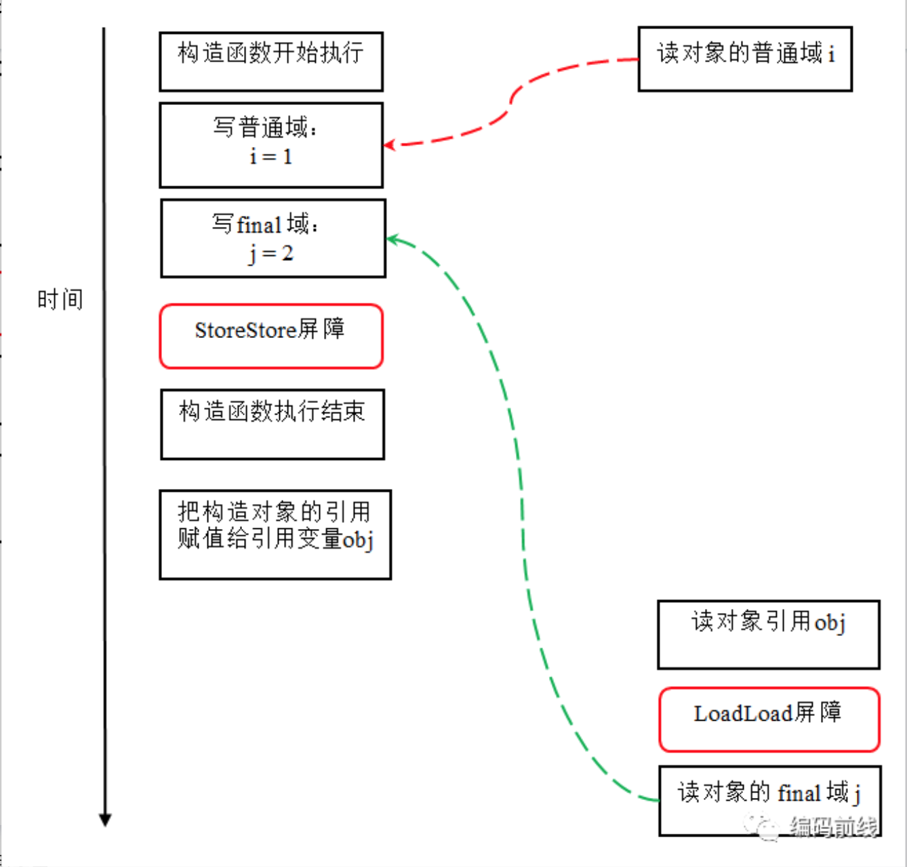

<h1 align="center">final、finally、finalize</h1>

[toc]

## **概念**

final在Java中是一个保留的关键字，可以声明成员变量、方法、类以及本地变量。

一旦你将引用声明作final，你将不能改变这个引用了，编译器会检查代码，如果你试图将变量再次初始化的话，编译器会报编译错误。

## **一、final变量**

final成员变量表示常量，只能被赋值一次，赋值后值不再改变（final要求地址值不能改变）

当final修饰一个基本数据类型时，表示该基本数据类型的值一旦在初始化后便不能发生变化；如果final修饰一个引用类型时，则在对其初始化之后便不能再让其指向其他对象了，但该引用所指向的对象的内容是可以发生变化的。本质上是一回事，因为引用的值是一个地址，final要求值，即地址的值不发生变化。

final修饰一个成员变量（属性），必须要显示初始化。这里有两种初始化方式，一种是在变量声明的时候初始化；第二种方法是在声明变量的时候不赋初值，但是要在这个变量所在的类的所有的构造函数中对这个变量赋初值。

## **二、final方法**

使用final方法的原因有两个。

第一个原因是把方法锁定，以防任何继承类修改它的含义，不能被重写；

第二个原因是效率，final方法比非final方法要快，因为在编译的时候已经静态绑定了，不需要在运行时再动态绑定。

（注：类的private方法会隐式地被指定为final方法）

## **三、final类**

当用final修饰一个类时，表明这个类不能被继承。

final类中的成员变量可以根据需要设为final，但是要注意final类中的所有成员方法都会被隐式地指定为final方法。

在使用final修饰类的时候，要注意谨慎选择，除非这个类真的在以后不会用来继承或者出于安全的考虑，尽量不要将类设计为final类。

## **四、final使用总结**

### **final关键字的好处：**

（1）final关键字提高了性能。JVM和Java应用都会缓存final变量。

（2）final变量可以安全的在多线程环境下进行共享，而不需要额外的同步开销。

（3）使用final关键字，JVM会对方法、变量及类进行优化。

### **关于final的重要知识点**

- final关键字可以用于成员变量、本地变量、方法以及类。
- final成员变量必须在声明的时候初始化或者在构造器中初始化，否则就会报编译错误。
- 你不能够对final变量再次赋值。
- 本地变量必须在声明时赋值。
- 在匿名类中所有变量都必须是final变量。
- final关键字不同于finally关键字，后者用于异常处理。
- final关键字容易与finalize()方法搞混，后者是在Object类中定义的方法，是在垃圾回收之前被JVM调用的方法。
- 接口中声明的所有变量本身是final的。
- final和abstract这两个关键字是反相关的，final类就不可能是abstract的。
- final方法在编译阶段绑定，称为静态绑定(static binding)。
- 没有在声明时初始化final变量的称为空白final变量(blank final variable)，它们必须在构造器中初始化，或者调用this()初始化。不这么做的话，编译器会报错“final变量(变量名)需要进行初始化”。
- 将类、方法、变量声明为final能够提高性能，这样JVM就有机会进行估计，然后优化。
- 按照Java代码惯例，final变量就是常量，而且通常常量名要大写。
- 对于集合对象声明为final指的是引用不能被更改，但是你可以向其中增加，删除或者改变内容。

- **final 成员变量** 只能被赋值一次，赋值后值不再改变（final要求地址值不能改变）。必须在声明的时候初始化或者在构造器中初始化，否则就会报编译错误
- **final 局部、静态变量** 当final修饰一个基本数据类型时，表示该基本数据类型的值一旦在初始化后便不能发生变化；如果final修饰一个引用类型时，则在对其初始化之后便不能再让其指向其他对象了，但该引用所指向的对象的内容是可以发生变化的。本质上是一回事，因为引用的值是一个地址，final要求值，即地址的值不发生变化。
- **final 方法** 
  - 第一个原因是把方法锁定，以防任何继承类修改它的含义，不能被重写；
  - 第二个原因是效率，final方法比非final方法要快，因为在编译的时候已经静态绑定了，不需要在运行时再动态绑定。（注：类的private方法会隐式地被指定为final方法）
- **final 类** 当用final修饰一个类时，表明这个类不能被继承。也就是说，如果一个类你永远不会让他被继承，就可以用final进行修饰。final类中的成员变量可以根据需要设为final，但是要注意final类中的所有成员方法都会被隐式地指定为final方法。
- **final 关键字** 将类、方法、变量声明为final能够提高性能，JVM 和 Java 应用都会缓存 final 变量，会对方法、变量及类进行优化
- 方法的内部类访问方法中的局部变量，但必须用 final 修饰才能访问

## **五、final原理**

注：最好先理解java内存模型，后期专门开专题讲解

对于final域，编译器和处理器要遵守两个重排序规则：

1.在构造函数内对一个final域的写入，与随后把这个被构造对象的引用赋值给一个引用变量，这两个操作之间不能重排序。

　　（先写入final变量，后调用该对象引用）

　　原因：编译器会在final域的写之后，插入一个StoreStore屏障

2.初次读一个包含final域的对象的引用，与随后初次读这个final域，这两个操作之间不能重排序。

　　（先读对象的引用，后读final变量）

　　编译器会在读final域操作的前面插入一个LoadLoad屏障

示例1：

```javascript
public class FinalExample {
    int i; // 普通变量
    final int j; // final 变量
    static FinalExample obj;

    public void FinalExample() { // 构造函数
        i = 1; // 写普通域
        j = 2; // 写 final 域
    }

    public static void writer() { // 写线程 A 执行
        obj = new FinalExample();
    }

    public static void reader() { // 读线程 B 执行
        FinalExample object = obj; // 读对象引用
        int a = object.i; // 读普通域         a=1或者a=0或者直接报错i没有初始化
        int b = object.j; // 读 final域      b=2
    }}
```

### **第一种情况**

写普通域的操作被编译器重排序到了构造函数之外

而写 final 域的操作，被写 final 域的重排序规则“限定”在了构造函数之内，读线程 B 正确的读取了 final 变量初始化之后的值。

写 final 域的重排序规则可以确保：在对象引用为任意线程可见之前，对象的 final 域已经被正确初始化过了，而普通域不具有这个保障。


### **第二种情况**

读对象的普通域的操作被处理器重排序到读对象引用之前

而读 final 域的重排序规则会把读对象 final 域的操作“限定”在读对象引用之后，此时该 final 域已经被 A 线程初始化过了，这是一个正确的读取操作。

读 final 域的重排序规则可以确保：在读一个对象的 final 域之前，一定会先读包含这个 final 域的对象的引用。



示例2：如果 final 域是引用类型

对于引用类型，写 final 域的重排序规则对编译器和处理器增加了如下约束：

在构造函数内对一个 final 引用的对象的成员域的写入，与随后在构造函数外把这个被构造对象的引用赋值给一个引用变量，这两个操作之间不能重排序。

```javascript
public class FinalReferenceExample {
    final int[] intArray; // final 是引用类型
    static FinalReferenceExample obj;

    public FinalReferenceExample() { // 构造函数
        intArray = new int[1]; // 1
        intArray[0] = 1; // 2
    }

    public static void writerOne() { // 写线程 A 执行
        obj = new FinalReferenceExample(); // 3
    }

    public static void writerTwo() { // 写线程 B 执行
        obj.intArray[0] = 2; // 4
    }

    public static void reader() { // 读线程 C 执行
        if (obj != null) { // 5
            int temp1 = obj.intArray[0]; // 6  temp1=1或者temp1=2，不可能等于0
        }
    }}
```

假设首先线程 A 执行 writerOne() 方法，执行完后线程 B 执行 writerTwo() 方法，执行完后线程 C 执行 reader () 方法。


在上图中 1 是对 final 域的写入； 2 是对这个 final 域引用的对象的成员域的写入； 3 是把被构造的对象的引用赋值给某个引用变量。这里除了前面提到的 1 不能和 3 重排序外，2 和 3 也不能重排序。

JMM 可以确保读线程 C 至少能看到写线程 A 在构造函数中对 final 引用对象的成员域的写入。即 C 至少能看到数组下标 0 的值为 1。而写线程 B 对数组元素的写入，读线程 C 可能看的到，也可能看不到。JMM 不保证线程 B 的写入对读线程 C 可见，因为写线程 B 和读线程 C 之间存在数据竞争，此时的执行结果不可预知。


## 六、final、finally、finalize区别

final 可以修饰类、变量和方法。修饰类代表这个类不可被继承。修饰变量代表此变量不可被改变。修饰方法表示此方法不可被重写 (override)。

finally 是保证重点代码一定会执行的一种机制。通常是使用 try-finally 或者 try-catch-finally 来进行文件流的关闭等操作。

finalize 是 Object 类中的一个方法，它的设计目的是保证对象在垃圾收集前完成特定资源的回收。finalize 机制现在已经不推荐使用，并且在 JDK 9已经被标记为 deprecated。

另外特例需要了解一下。比如，下面代码会输出什么？

```javascript
try { 
    // do something  
    System.exit(1);
} finally {  
    System.out.println(“Print from finally”);
}
```

上面finally里面的代码可不会被执行的哦。

## 来源

https://zhuanlan.zhihu.com/p/53093428