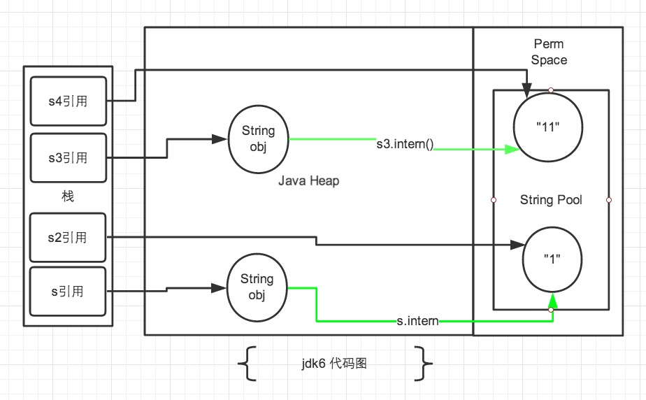
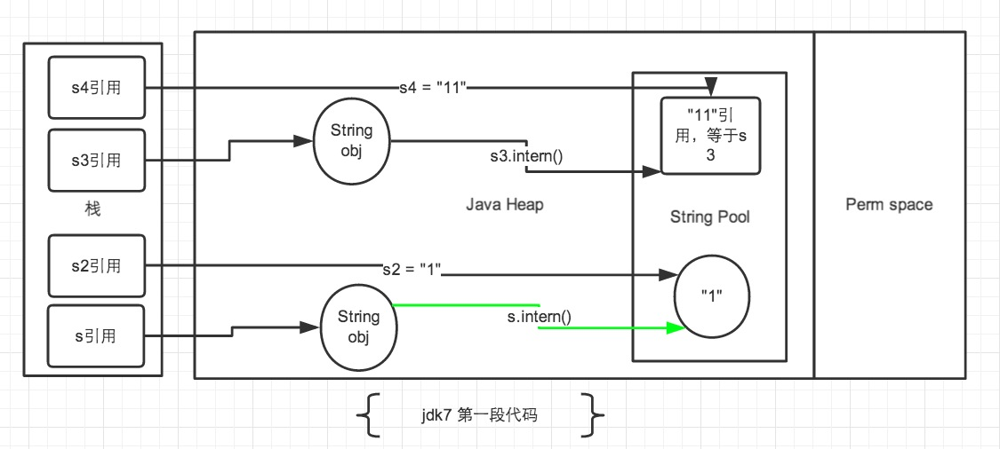
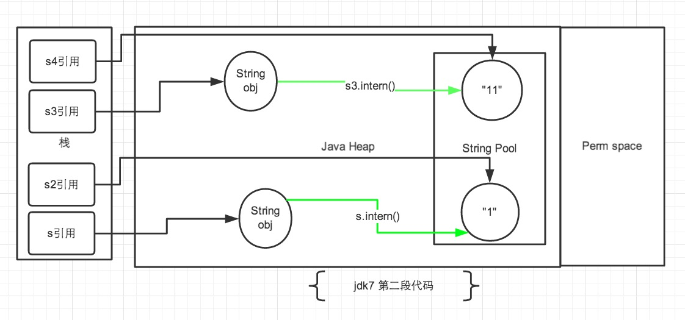

<h1 align="center">深入解析String#intern</h1>

[TOC]

在 JAVA 语言中有8中基本类型和一种比较特殊的类型`String`。这些类型为了使他们在运行过程中速度更快，更节省内存，都提供了一种常量池的概念。常量池就类似一个JAVA系统级别提供的缓存。

8种基本类型的常量池都是系统协调的，`String`类型的常量池比较特殊。它的主要使用方法有两种：

- 直接使用双引号声明出来的`String`对象会直接存储在常量池中。
- 如果不是用双引号声明的`String`对象，可以使用`String`提供的`intern`方法。intern 方法会从字符串常量池中查询当前字符串是否存在，若不存在就会将当前字符串放入常量池中

接下来我们主要来谈一下`String#intern`方法。

首先深入看一下它的实现原理。

## 1，JAVA 代码

```java
/** 
 * Returns a canonical representation for the string object. 
 * <p> 
 * A pool of strings, initially empty, is maintained privately by the 
 * class <code>String</code>. 
 * <p> 
 * When the intern method is invoked, if the pool already contains a 
 * string equal to this <code>String</code> object as determined by 
 * the {@link #equals(Object)} method, then the string from the pool is 
 * returned. Otherwise, this <code>String</code> object is added to the 
 * pool and a reference to this <code>String</code> object is returned. 
 * <p> 
 * It follows that for any two strings <code>s</code> and <code>t</code>, 
 * <code>s.intern()&nbsp;==&nbsp;t.intern()</code> is <code>true</code> 
 * if and only if <code>s.equals(t)</code> is <code>true</code>. 
 * <p> 
 * All literal strings and string-valued constant expressions are 
 * interned. String literals are defined in section 3.10.5 of the 
 * <cite>The Java&trade; Language Specification</cite>. 
 * 
 * @return  a string that has the same contents as this string, but is 
 *          guaranteed to be from a pool of unique strings. 
 */  
public native String intern();  
```

`String#intern`方法中看到，这个方法是一个 native 的方法，但注释写的非常明了。“如果常量池中存在当前字符串, 就会直接返回当前字符串. 如果常量池中没有此字符串, 会将此字符串放入常量池中后, 再返回”。

## 2，native 代码

在 jdk7后，oracle 接管了 JAVA 的源码后就不对外开放了，根据 jdk 的主要开发人员声明 openJdk7 和 jdk7 使用的是同一分主代码，只是分支代码会有些许的变动。所以可以直接跟踪 openJdk7 的源码来探究 intern 的实现。

\####native实现代码: \openjdk7\jdk\src\share\native\java\lang\String.c

```c++
Java_java_lang_String_intern(JNIEnv *env, jobject this)  
{  
    return JVM_InternString(env, this);  
}  
```

\openjdk7\hotspot\src\share\vm\prims\jvm.h

```c++
/* 
* java.lang.String 
*/  
JNIEXPORT jstring JNICALL  
JVM_InternString(JNIEnv *env, jstring str);   
```

\openjdk7\hotspot\src\share\vm\prims\jvm.cpp

```c++
// String support ///////////////////////////////////////////////////////////////////////////  
JVM_ENTRY(jstring, JVM_InternString(JNIEnv *env, jstring str))  
  JVMWrapper("JVM_InternString");  
  JvmtiVMObjectAllocEventCollector oam;  
  if (str == NULL) return NULL;  
  oop string = JNIHandles::resolve_non_null(str);  
  oop result = StringTable::intern(string, CHECK_NULL);
  return (jstring) JNIHandles::make_local(env, result);  
JVM_END   
```

\openjdk7\hotspot\src\share\vm\classfile\symbolTable.cpp

```c
oop StringTable::intern(Handle string_or_null, jchar* name,  
                        int len, TRAPS) {  
  unsigned int hashValue = java_lang_String::hash_string(name, len);  
  int index = the_table()->hash_to_index(hashValue);  
  oop string = the_table()->lookup(index, name, len, hashValue);  
  // Found  
  if (string != NULL) return string;  
  // Otherwise, add to symbol to table  
  return the_table()->basic_add(index, string_or_null, name, len,  
                                hashValue, CHECK_NULL);  
}   
```

\openjdk7\hotspot\src\share\vm\classfile\symbolTable.cpp

```c
oop StringTable::lookup(int index, jchar* name,  
                        int len, unsigned int hash) {  
  for (HashtableEntry<oop>* l = bucket(index); l != NULL; l = l->next()) {  
    if (l->hash() == hash) {  
      if (java_lang_String::equals(l->literal(), name, len)) {  
        return l->literal();  
      }  
    }  
  }  
  return NULL;  
}  
```

它的大体实现结构就是: JAVA 使用 jni 调用c++实现的`StringTable`的`intern`方法, `StringTable`的`intern`方法跟Java中的`HashMap`的实现是差不多的, 只是不能自动扩容。默认大小是1009。

要注意的是，String的String Pool是一个固定大小的`Hashtable`，默认值大小长度是1009，如果放进String Pool的String非常多，就会造成Hash冲突严重，从而导致链表会很长，而链表长了后直接会造成的影响就是当调用`String.intern`时性能会大幅下降（因为要一个一个找）。

在 jdk6中`StringTable`是固定的，就是1009的长度，所以如果常量池中的字符串过多就会导致效率下降很快。在jdk7中，`StringTable`的长度可以通过一个参数指定：

- `-XX:StringTableSize=99991`

相信很多 JAVA 程序员都做做类似 `String s = new String("abc")`这个语句创建了几个对象的题目。 这种题目主要就是为了考察程序员对字符串对象的常量池掌握与否。上述的语句中是创建了2个对象，第一个对象是”abc”字符串存储在常量池中，第二个对象在JAVA Heap中的 String 对象。

来看一段代码：

```java
public static void main(String[] args) {
    String s = new String("1");
    s.intern();
    String s2 = "1";
    System.out.println(s == s2);

    String s3 = new String("1") + new String("1");
    s3.intern();
    String s4 = "11";
    System.out.println(s3 == s4);
}
```

打印结果是

- jdk6 下`false false`
- jdk7 下`false true`

具体为什么稍后再解释，然后将`s3.intern();`语句下调一行，放到`String s4 = "11";`后面。将`s.intern();` 放到`String s2 = "1";`后面。是什么结果呢

```java
public static void main(String[] args) {
    String s = new String("1");
    String s2 = "1";
    s.intern();
    System.out.println(s == s2);

    String s3 = new String("1") + new String("1");
    String s4 = "11";
    s3.intern();
    System.out.println(s3 == s4);
}
```

打印结果为：

- jdk6 下`false false`
- jdk7 下`false false`

\####1，jdk6中的解释



jdk6图


注：图中绿色线条代表 string 对象的内容指向。 黑色线条代表地址指向。

如上图所示。首先说一下 jdk6中的情况，在 jdk6中上述的所有打印都是 false 的，因为 jdk6中的常量池是放在 Perm 区中的，Perm 区和正常的 JAVA Heap 区域是完全分开的。上面说过如果是使用引号声明的字符串都是会直接在字符串常量池中生成，而 new 出来的 String 对象是放在 JAVA Heap 区域。所以拿一个 JAVA Heap 区域的对象地址和字符串常量池的对象地址进行比较肯定是不相同的，即使调用`String.intern`方法也是没有任何关系的。

\####2，jdk7中的解释

再说说 jdk7 中的情况。这里要明确一点的是，在 Jdk6 以及以前的版本中，字符串的常量池是放在堆的 Perm 区的，Perm 区是一个类静态的区域，主要存储一些加载类的信息，常量池，方法片段等内容，默认大小只有4m，一旦常量池中大量使用 intern 是会直接产生`java.lang.OutOfMemoryError: PermGen space`错误的。 所以在 jdk7 的版本中，字符串常量池已经从 Perm 区移到正常的 Java Heap 区域了。为什么要移动，Perm 区域太小是一个主要原因，当然据消息称 jdk8 已经直接取消了 Perm 区域，而新建立了一个元区域。应该是 jdk 开发者认为 Perm 区域已经不适合现在 JAVA 的发展了。

正式因为字符串常量池移动到 JAVA Heap 区域后，再来解释为什么会有上述的打印结果。



jdk7图1


- 在第一段代码中，先看 s3和s4字符串。`String s3 = new String("1") + new String("1");`，这句代码中现在生成了2最终个对象，是字符串常量池中的“1” 和 JAVA Heap 中的 s3引用指向的对象。中间还有2个匿名的`new String("1")`我们不去讨论它们。此时s3引用对象内容是”11”，但此时常量池中是没有 “11”对象的。
- 接下来`s3.intern();`这一句代码，是将 s3中的“11”字符串放入 String 常量池中，因为此时常量池中不存在“11”字符串，因此常规做法是跟 jdk6 图中表示的那样，在常量池中生成一个 “11” 的对象，关键点是 jdk7 中常量池不在 Perm 区域了，这块做了调整。常量池中不需要再存储一份对象了，可以直接存储堆中的引用。这份引用指向 s3 引用的对象。 也就是说引用地址是相同的。
- 最后`String s4 = "11";` 这句代码中”11”是显示声明的，因此会直接去常量池中创建，创建的时候发现已经有这个对象了，此时也就是指向 s3 引用对象的一个引用。所以 s4 引用就指向和 s3 一样了。因此最后的比较 `s3 == s4` 是 true。
- 再看 s 和 s2 对象。 `String s = new String("1");` 第一句代码，生成了2个对象。常量池中的“1” 和 JAVA Heap 中的字符串对象。`s.intern();` 这一句是 s 对象去常量池中寻找后发现 “1” 已经在常量池里了。
- 接下来`String s2 = "1";` 这句代码是生成一个 s2的引用指向常量池中的“1”对象。 结果就是 s 和 s2 的引用地址明显不同。图中画的很清晰。



jdk7图2


- 来看第二段代码，从上边第二幅图中观察。第一段代码和第二段代码的改变就是 `s3.intern();` 的顺序是放在`String s4 = "11";`后了。这样，首先执行`String s4 = "11";`声明 s4 的时候常量池中是不存在“11”对象的，执行完毕后，“11“对象是 s4 声明产生的新对象。然后再执行`s3.intern();`时，常量池中“11”对象已经存在了，因此 s3 和 s4 的引用是不同的。
- 第二段代码中的 s 和 s2 代码中，`s.intern();`，这一句往后放也不会有什么影响了，因为对象池中在执行第一句代码`String s = new String("1");`的时候已经生成“1”对象了。下边的s2声明都是直接从常量池中取地址引用的。 s 和 s2 的引用地址是不会相等的。

\####小结 从上述的例子代码可以看出 jdk7 版本对 intern 操作和常量池都做了一定的修改。主要包括2点：

- 将String常量池 从 Perm 区移动到了 Java Heap区
- `String#intern` 方法时，如果存在堆中的对象，会直接保存对象的引用，而不会重新创建对象。

## 1,intern 正确使用例子

接下来我们来看一下一个比较常见的使用`String#intern`方法的例子。

代码如下：

```java
static final int MAX = 1000 * 10000;
static final String[] arr = new String[MAX];

public static void main(String[] args) throws Exception {
    Integer[] DB_DATA = new Integer[10];
    Random random = new Random(10 * 10000);
    for (int i = 0; i < DB_DATA.length; i++) {
        DB_DATA[i] = random.nextInt();
    }
	long t = System.currentTimeMillis();
    for (int i = 0; i < MAX; i++) {
        //arr[i] = new String(String.valueOf(DB_DATA[i % DB_DATA.length]));
         arr[i] = new String(String.valueOf(DB_DATA[i % DB_DATA.length])).intern();
    }

	System.out.println((System.currentTimeMillis() - t) + "ms");
    System.gc();
}
```

运行的参数是：`-Xmx2g -Xms2g -Xmn1500M` 上述代码是一个演示代码，其中有两条语句不一样，一条是使用 intern，一条是未使用 intern。结果如下图

2160ms

使用 intern


826ms

未使用 intern


通过上述结果，我们发现不使用 intern 的代码生成了1000w 个字符串，占用了大约640m 空间。 使用了 intern 的代码生成了1345个字符串，占用总空间 133k 左右。其实通过观察程序中只是用到了10个字符串，所以准确计算后应该是正好相差100w 倍。虽然例子有些极端，但确实能准确反应出 intern 使用后产生的巨大空间节省。

细心的同学会发现使用了 intern 方法后时间上有了一些增长。这是因为程序中每次都是用了 `new String` 后，然后又进行 intern 操作的耗时时间，这一点如果在内存空间充足的情况下确实是无法避免的，但我们平时使用时，内存空间肯定不是无限大的，不使用 intern 占用空间导致 jvm 垃圾回收的时间是要远远大于这点时间的。 毕竟这里使用了1000w次intern 才多出来1秒钟多的时间。

## 2，intern 不当使用

看过了 intern 的使用和 intern 的原理等，我们来看一个不当使用 intern 操作导致的问题。

在使用 fastjson 进行接口读取的时候，我们发现在读取了近70w条数据后，我们的日志打印变的非常缓慢，每打印一次日志用时30ms左右，如果在一个请求中打印2到3条日志以上会发现请求有一倍以上的耗时。在重新启动 jvm 后问题消失。继续读取接口后，问题又重现。接下来我们看一下出现问题的过程。

\####1，根据 log4j 打印日志查找问题原因

在使用`log4j#info`打印日志的时候时间非常长。所以使用 housemd 软件跟踪 info 方法的耗时堆栈。

- trace SLF4JLogger.
- trace AbstractLoggerWrapper:
- trace AsyncLogger

```java
org/apache/logging/log4j/core/async/AsyncLogger.actualAsyncLog(RingBufferLogEvent)                sun.misc.Launcher$AppClassLoader@109aca82            1            1ms    org.apache.logging.log4j.core.async.AsyncLogger@19de86bb  
org/apache/logging/log4j/core/async/AsyncLogger.location(String)                                  sun.misc.Launcher$AppClassLoader@109aca82            1           30ms    org.apache.logging.log4j.core.async.AsyncLogger@19de86bb  
org/apache/logging/log4j/core/async/AsyncLogger.log(Marker, String, Level, Message, Throwable)    sun.misc.Launcher$AppClassLoader@109aca82            1           61ms    org.apache.logging.log4j.core.async.AsyncLogger@19de86bb  
```

代码出在 `AsyncLogger.location` 这个方法上. 里边主要是调用了 `return Log4jLogEvent.calcLocation(fqcnOfLogger);`和`Log4jLogEvent.calcLocation()`

`Log4jLogEvent.calcLocation()`的代码如下:

```java
public static StackTraceElement calcLocation(final String fqcnOfLogger) {  
    if (fqcnOfLogger == null) {  
        return null;  
    }  
    final StackTraceElement[] stackTrace = Thread.currentThread().getStackTrace();  
    boolean next = false;  
    for (final StackTraceElement element : stackTrace) {  
        final String className = element.getClassName();  
        if (next) {  
            if (fqcnOfLogger.equals(className)) {  
                continue;  
            }  
            return element;  
        }  
        if (fqcnOfLogger.equals(className)) {  
            next = true;  
        } else if (NOT_AVAIL.equals(className)) {  
            break;  
        }  
    }  
    return null;  
}  
```

经过跟踪发现是 `Thread.currentThread().getStackTrace();` 的问题。

\####2, 跟踪Thread.currentThread().getStackTrace()的 native 代码，验证String#intern

`Thread.currentThread().getStackTrace();`native的方法:

```java
public StackTraceElement[] getStackTrace() {  
    if (this != Thread.currentThread()) {  
        // check for getStackTrace permission  
        SecurityManager security = System.getSecurityManager();  
        if (security != null) {  
            security.checkPermission(  
                SecurityConstants.GET_STACK_TRACE_PERMISSION);  
        }  
        // optimization so we do not call into the vm for threads that  
        // have not yet started or have terminated  
        if (!isAlive()) {  
            return EMPTY_STACK_TRACE;  
        }        StackTraceElement[][] stackTraceArray = dumpThreads(new Thread[] {this});  
        StackTraceElement[] stackTrace = stackTraceArray[0];  
        // a thread that was alive during the previous isAlive call may have  
        // since terminated, therefore not having a stacktrace.  
        if (stackTrace == null) {  
            stackTrace = EMPTY_STACK_TRACE;  
        }  
        return stackTrace;  
    } else {  
        // Don't need JVM help for current thread  
        return (new Exception()).getStackTrace();  
    }  
}  

private native static StackTraceElement[][] dumpThreads(Thread[] threads);   
```

下载 openJdk7的源码查询 jdk 的 native 实现代码，列表如下【这里因为篇幅问题，不详细罗列涉及到的代码，有兴趣的可以根据文件名称和行号查找相关代码】：

\openjdk7\jdk\src\share\native\java\lang\Thread.c
\openjdk7\hotspot\src\share\vm\prims\jvm.h line:294: \openjdk7\hotspot\src\share\vm\prims\jvm.cpp line:4382-4414:
\openjdk7\hotspot\src\share\vm\services\threadService.cpp line:235-267: \openjdk7\hotspot\src\share\vm\services\threadService.cpp line:566-577:
\openjdk7\hotspot\src\share\vm\classfile\javaClasses.cpp line:1635-[1651,1654,1658]:

完成跟踪了底层的 jvm 源码后发现，是下边的三条代码引发了整个程序的变慢问题。

```java
oop classname = StringTable::intern((char*) str, CHECK_0);  
oop methodname = StringTable::intern(method->name(), CHECK_0);  
oop filename = StringTable::intern(source, CHECK_0);  
```

这三段代码是获取类名、方法名、和文件名。因为类名、方法名、文件名都是存储在字符串常量池中的，所以每次获取它们都是通过`String#intern`方法。但没有考虑到的是默认的 StringPool 的长度是1009且不可变的。因此一旦常量池中的字符串达到的一定的规模后，性能会急剧下降。

\####3,fastjson 不当使用 String#intern

导致这个 intern 变慢的原因是因为 fastjson 对`String#intern`方法的使用不当造成的。跟踪 fastjson 中的实现代码发现，

\####`com.alibaba.fastjson.parser.JSONScanner#scanFieldSymbol()`

```java
if (ch == '\"') {
    bp = index;
    this.ch = ch = buf[bp];
    strVal = symbolTable.addSymbol(buf, start, index - start - 1, hash);
    break;
}
```

\####`com.alibaba.fastjson.parser.SymbolTable#addSymbol()`:

```java
/**
 * Constructs a new entry from the specified symbol information and next entry reference.
 */
public Entry(char[] ch, int offset, int length, int hash, Entry next){
    characters = new char[length];
    System.arraycopy(ch, offset, characters, 0, length);
    symbol = new String(characters).intern();
    this.next = next;
    this.hashCode = hash;
    this.bytes = null;
}
```

fastjson 中对所有的 json 的 key 使用了 intern 方法，缓存到了字符串常量池中，这样每次读取的时候就会非常快，大大减少时间和空间。而且 json 的 key 通常都是不变的。这个地方没有考虑到大量的 json key 如果是变化的，那就会给字符串常量池带来很大的负担。

这个问题 fastjson 在1.1.24版本中已经将这个漏洞修复了。程序加入了一个最大的缓存大小，超过这个大小后就不会再往字符串常量池中放了。

[1.1.24版本的`com.alibaba.fastjson.parser.SymbolTable#addSymbol()` Line:113]代码

```java
public static final int MAX_SIZE           = 1024;

if (size >= MAX_SIZE) {
    return new String(buffer, offset, len);
}
```

这个问题是70w 数据量时候的引发的，如果是几百万的数据量的话可能就不只是30ms 的问题了。因此在使用系统级提供的`String#intern`方式一定要慎重！

本文大体的描述了 `String#intern`和字符串常量池的日常使用，jdk 版本的变化和`String#intern`方法的区别，以及不恰当使用导致的危险等内容，让大家对系统级别的 `String#intern`有一个比较深入的认识。让我们在使用和接触它的时候能避免出现一些 bug，增强系统的健壮性。

以下是几个比较关键的几篇博文。感谢！

- [Save Memory by Using String Intern in Java](https://blog.codecentric.de/en/2012/03/save-memory-by-using-string-intern-in-java/)
- [Java String array: is there a size of method?](http://stackoverflow.com/questions/921384/java-string-array-is-there-a-size-of-method)
- [Understanding String Table Size in HotSpot](http://xmlandmore.blogspot.com/2013/05/understanding-string-table-size-in.html)
- [How is Java’s String#intern() method implemented?](http://stackoverflow.com/questions/3323608/how-is-javas-stringintern-method-implemented)
- [JDK7里的String.intern的变化](http://hellojava.info/?p=61)


## 来源

https://tech.meituan.com/2014/03/06/in-depth-understanding-string-intern.html