<h1 align="center">Java反射原理</h1>

[TOC]

## JAVA反射机制
JAVA反射机制是在运行状态中，

对于任意一个类，都能够知道这个类的所有属性和方法；

对于任意一个对象，都能够调用它的任意一个属性和方法；

这种动态获取的信息以及动态调用对象的方法的功能称为 java语言的反射机制。

反射：reflection

* 程序可以访问、检测和修改它本身状态或行为的能力，即自描述和自控制。
* 可以在运行时加载、探知和使用编译期间完全未知的类。
* 给Java插上动态语音特性的翅膀，弥补强类型语音的不足。
* java.lang.reflect包，在java2时代就有，在java5得到完善


## 使用场景
IDE自动提示功能，对象（提示：属性、方法）

不知道类或者对象的具体信息，应该使用反射来实现。

> 比如类的名称放在XML文件中，属性和属性值放在XML文件中，需要在运行时读取XML文件，动态获取类的信息。

## 原理

Java在编译之后会生成一个class文件，反射通过字节码文件找到其类中的方法和属性等

## 功能

* 在运行中分析类的能力
* 在运行中查看和操作对象
  * 基于反射自由创建对象
  * 反射构建出无法直接访问的类
  * set或者get到无法访问的成员变量
  * 调用不可访问的方法
* 实现通用的数组操作代码
* 类似函数指针的功能


## 关键类


## Class对象

**类型标识**，JVM中为每个对象都保留其类型标识信息。

包含类的所有信息

可以通过该对象获取到构造方法，成员变量，成员方法和接口等信息

获取方法：

* 通过字面量直接获取，例如XXX.class，不会触发类的初始化但XXX类已经被加载到方法区。
* 通过Object类的getClass方法，例如Object.getClass()。触发类的初始化
* 通过Class的静态方法，例如Class.forName()。触发类的初始化


## Field
成员变量，类中的属性对象。

通过Class类的getDeclaredField()或getDeclaredFields()方法获取

```java
class A {
    public int age;
    private String name;
    
    public A(int age, String name) {
        this.age = age;
        this.name = name;
    }
}

A obj = new A(20, "Tom");
Class c = obj.getClass();

// 获取本类及父类所有的public字段
Field[] fs = c.getFields();
System.out.println(fs[0].getName + ":" + fs[0].get(obj));

// 获取本类所有声明的字段
Field[] fs2 = c.getDeclaredFields();
for (Field f : fs2) {
    f.getAccessible(true);
    System.out.println(f.getName() + ":" + f.get(obj));
}
```

> Field的方法主要分为两大类，即getXXX和setXXX

## Method
类中的方法对象。包括了静态方法和成员方法（包括抽象方法在内）。

通过invoke()来完成方法被动态调用的目的。

> 非静态变量，需要添加对象参数

getMethods()：返回本来所有父类的所有的public方法；

getDeclaredMethods()：返回本类自定义的方法，包括private的方法，但不包括父类的方法。

```java
class B {
    public void f1() {
        System.out.println("B.f1()...");
    }
    
    private String f2(String s) {
        System.out.println("B.f2()...");
        return s;
    }
}

B obj = new B();
Class c = obj.getClass();

// 获取public方法，包括父类和父接口
Method[] ms = c.getMethods();
for (Method m : ms) {
    if ("f1".equals(m.getName())) {
        m.invoke(obj, null);
    }
}

// 获取该类的所有方法
Method[] ms2 = c.getDeclaredMethods();
for (Method m : ms2) {
    if ("f2".equals(m.getName())) {
        m.setAccessible(true);
        String result = (String) m.invoke(obj, "abc");
        System.out.println(result);
    }
}
```

> setAccessible()方法不影响其他对象和原方法

### getDeclaredMethod
可以获取指定方法名和参数的方法对象 Method。

```java
@CallerSensitive
public Method getDeclaredMethod(String name, Class<?>... parameterTypes)
    throws NoSuchMethodException, SecurityException {
    checkMemberAccess(Member.DECLARED, Reflection.getCallerClass(), true);
    //从返回的方法列表里找到一个匹配名称和参数的方法对象。
    Method method = searchMethods(privateGetDeclaredMethods(false), name, parameterTypes);
    if (method == null) {
        throw new NoSuchMethodException(getName() + "." + name + argumentTypesToString(parameterTypes));
    }
    return method;
}
```

其中`privateGetDeclaredMethods`方法从缓存或JVM中获取该`Class`中申明的方法列表，`searchMethods`方法将从返回的方法列表里找到一个匹配名称和参数的方法对象。

### privateGetDeclaredMethods

从缓存或JVM中获取该Class中申明的方法列表。

### searchMethods

从返回的方法列表里找到一个匹配名称和参数的方法对象。

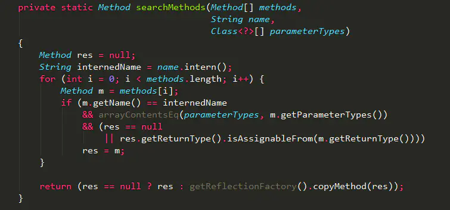

如果找到一个匹配的Method，则重新copy一份返回，即Method.copy()方法。

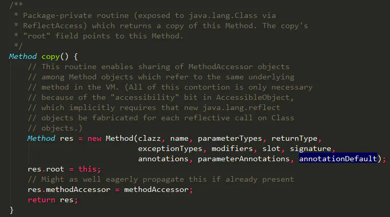

所次每次调用`getDeclaredMethod`方法返回的`Method`对象其实都是一个新的对象，且新对象的`root`属性都指向原来的`Method`对象，如果需要频繁调用，最好把`Method`对象缓存起来。

### privateGetDeclaredMethods

从缓存或JVM中获取该`Class`中申明的方法列表，实现如下：

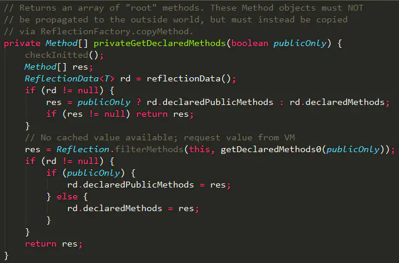

其中`reflectionData()`（用来缓存从JVM中读取类的如下属性数据）方法实现如下：

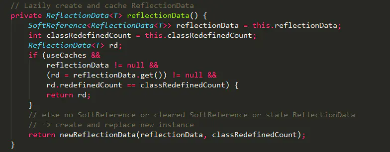

这里有个比较重要的数据结构`ReflectionData`，用来缓存从JVM中读取类的如下属性数据：

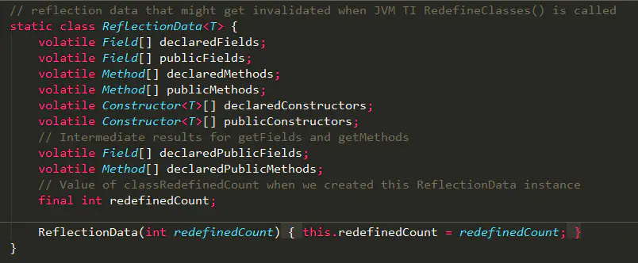

从`reflectionData()`方法实现可以看出：`reflectionData`对象是`SoftReference`类型的，说明在内存紧张时可能会被回收，不过也可以通过`-XX:SoftRefLRUPolicyMSPerMB`参数控制回收的时机，只要发生GC就会将其回收，如果`reflectionData`被回收之后，又执行了反射方法，那只能通过`newReflectionData`方法重新创建一个这样的对象了，`newReflectionData`方法实现如下：

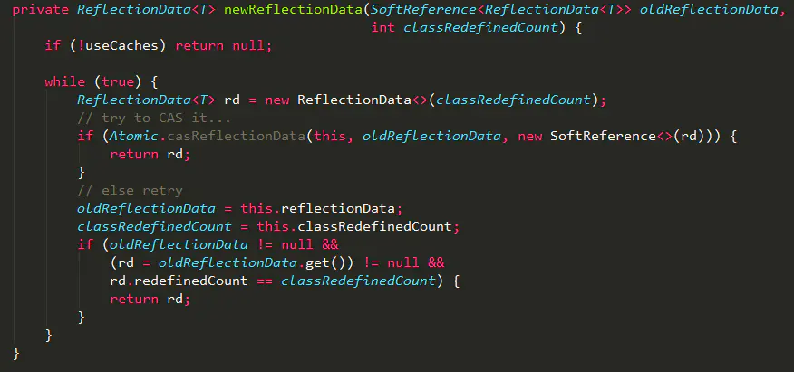

通过`unsafe.compareAndSwapObject`方法重新设置`reflectionData`字段；

在`privateGetDeclaredMethods`方法中，如果通过`reflectionData()`获得的`ReflectionData`对象不为空，则尝试从`ReflectionData`对象中获取`declaredMethods`属性，如果是第一次，或则被GC回收之后，重新初始化后的类属性为空，则需要重新到JVM中获取一次，并赋值给`ReflectionData`，下次调用就可以使用缓存数据了。

### Method调用

获取到指定的方法对象`Method`之后，就可以调用它的`invoke`方法了，`invoke`实现如下：

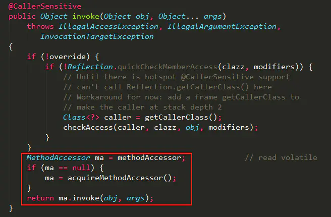

应该注意到：这里的`MethodAccessor`对象是`invoke`方法实现的关键，一开始`methodAccessor`为空，需要调用`acquireMethodAccessor`生成一个新的`MethodAccessor`对象，`MethodAccessor`本身就是一个接口，实现如下：

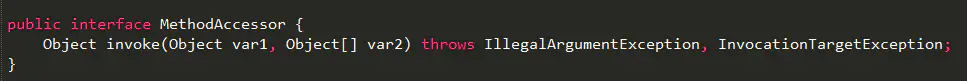

在`acquireMethodAccessor`方法中，会通过`ReflectionFactory`类的`newMethodAccessor`创建一个实现了`MethodAccessor`接口的对象，实现如下：

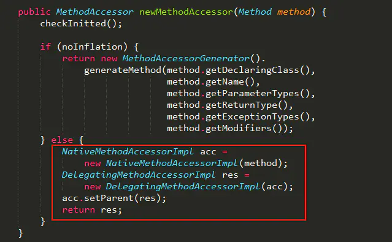

在`ReflectionFactory`类中，有2个重要的字段：`noInflation`(默认`false`)和`inflationThreshold`(默认15)，在`checkInitted`方法中可以通过`-Dsun.reflect.inflationThreshold=xxx`和`-Dsun.reflect.noInflation=true`对这两个字段重新设置，而且只会设置一次；

如果`noInflation`为`false`，方法`newMethodAccessor`都会返回`DelegatingMethodAccessorImpl`对象，`DelegatingMethodAccessorImpl`的类实现

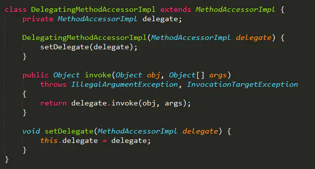

其实，`DelegatingMethodAccessorImpl`对象就是一个代理对象，负责调用被代理对象`delegate`的`invoke`方法，其中`delegate`参数目前是`NativeMethodAccessorImpl`对象，所以最终`Method`的`invoke`方法调用的是`NativeMethodAccessorImpl`对象`invoke`方法，实现如下：

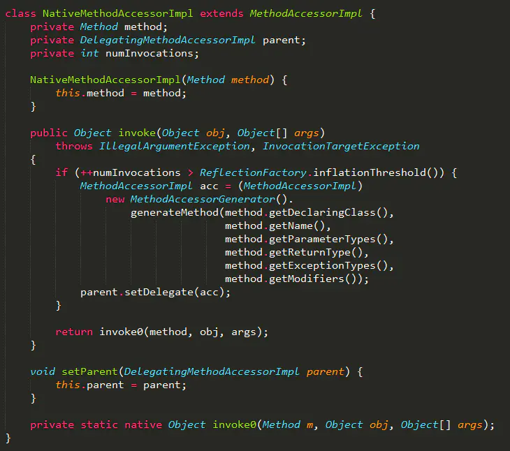

这里用到了`ReflectionFactory`类中的`inflationThreshold`，当`delegate`调用了15次`invoke`方法之后，如果继续调用就通过`MethodAccessorGenerator`类的`generateMethod`方法生成`MethodAccessorImpl`对象，并设置为`delegate`对象，这样下次执行`Method.invoke`时，就调用新建的`MethodAccessor`对象的`invoke()`方法了。

**这里需要注意的是：**
 `generateMethod`方法在生成`MethodAccessorImpl`对象时，会在内存中生成对应的字节码，并调用`ClassDefiner.defineClass`创建对应的class对象，实现如下：

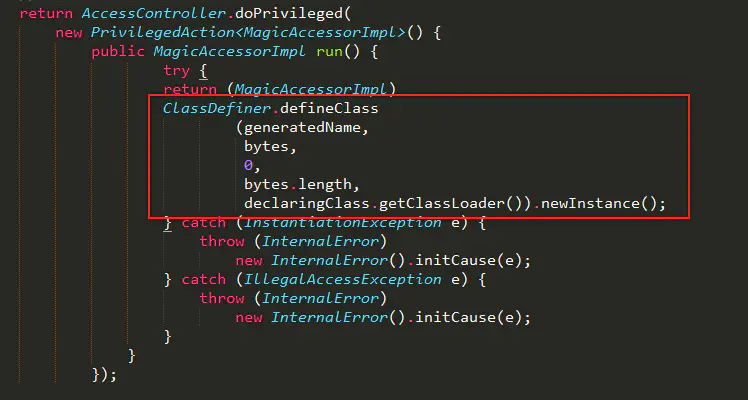

在`ClassDefiner.defineClass`方法实现中，每被调用一次都会生成一个`DelegatingClassLoader`类加载器对象

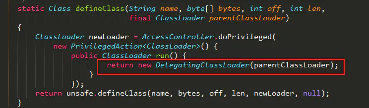

这里每次都生成新的类加载器，是为了性能考虑，在某些情况下可以卸载这些生成的类，因为类的卸载是只有在类加载器可以被回收的情况下才会被回收的，如果用了原来的类加载器，那可能导致这些新创建的类一直无法被卸载，从其设计来看本身就不希望这些类一直存在内存里的，在需要的时候有就行了。


### Constructor

构造函数。类的构造方法

getConstructor() ：获取匹配的构造方法

```java
class D {
    private int num;
    public D() {
        this.num = 10;
    }
    public D(int num) {
        this.num = num;
    }
    public void printNum() {
        System.out.println(this.num);
    }
}

D d = new D();
Class c = d.getClass();

Constructor[] cons = c.getConstructors();
for (Constructor con : cons) {
    if (con.getParameterCount() > 0) {
        // 有参构造函数
        D obj = (D) con.newInstance();
        obj.printNum();
    } else {
        // 无参构造函数
        D obj = (D) con.newInstance();
        obj.printNum();
    }
}
```

步骤：

1. 先获取所有的constructors, 然后通过进行参数类型比较；
2. 找到匹配后，通过 ReflectionFactory，copy一份constructor返回；
3. 否则抛出 NoSuchMethodException;

## 父类/父接口

```java
class Father {}

class Son extends Father implements Cloneable, Comparable {
    protected Object clone() throws CloneNotSupportedException {
        return super.clone();
    }
    
    public int compareTo(Object o) {
        return 0;
    }
}

Son son = new Son();
Class c = son.getClass();
Class father = c.getSuperClass();
System.out.println(father.getName());

Class[] inters = c.getInterfaces();
for (Class inter : inters) {
    System.out.println(inter.getName());
}
```


## 优点
通过反射，java可以动态的加载未知的外部配置对象，临时生成字节码进行加载使用，使代码更灵活，极大地提高应用的扩展性。

## 缺点
性能是一个问题，反射相当于一系列解释操作，通知jvm要做的事情，性能比直接的java代码要慢很多。

## 总结
咱们玩归玩，闹归闹，别拿面试开玩笑。

Java的反射特性是java的高级特性，在面试中屡屡碰到。面试官问的问题往往都是有关联性的,一旦问到了，大家一定要回答正确，不要丢三落四，回答到点上。大家面试前要把反射特性的原理、应用场景、功能和关键类（Class、Fileds、Methods、Constructor等）熟记。

## 参考

参考链接：https://www.icourse163.org/learn/ECNU-1206500807

原文链接：https://blog.csdn.net/JAck_chen0309/article/details/105427350

​		https://www.jianshu.com/p/3ea4a6b57f87

