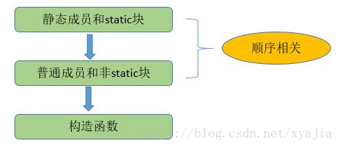
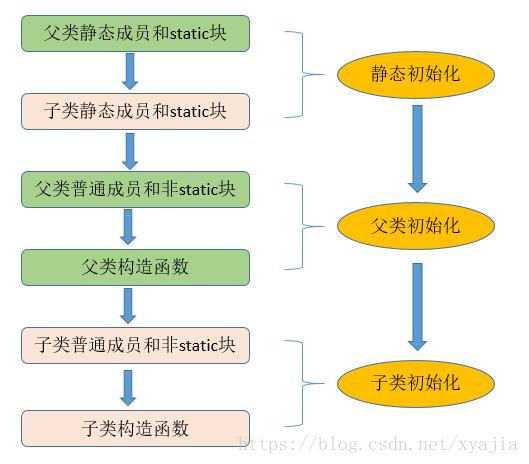

<h1 align="center">class</h1>

[TOC]

## 类的初始化顺序

对于静态变量、静态初始化块、变量、初始化块、构造器，它们的初始化顺序依次是（静态变量、静态初始化块）>（变量、初始化块）> 构造器。

初始化顺序图示：






我们也可以通过下面的测试代码来验证这一点：

```java
public class Block {

    public boolean smile;

}

public abstract class A<T> {

    protected String super_field = "父类---变量";

    {
        System.out.println(super_field);
        System.out.println("父类---初始化块");
    }

    protected static String STATIC_SUPPER_FIELD = "父类---静态变量";

    static {
        System.out.println(STATIC_SUPPER_FIELD);
        System.out.println("父类---静态初始化块");
    }

    public A(T data) {
        System.out.println("父类---构造函数");
        bindData(data);
    }

    public abstract boolean needSmile();

    protected abstract void bindData(T data);

}

public class B extends A<Block> {

    private boolean needSmile = false;

    protected String super_field = "子类---变量";

    {
        System.out.println(super_field);
        System.out.println("子类---初始化块");
    }

    protected static String STATIC_SUPPER_FIELD = "子类---静态变量";

    static {
        System.out.println(STATIC_SUPPER_FIELD);
        System.out.println("子类---静态初始化块");
    }
    public B(Block data) {
        super(data);
        System.out.println("子类---构造函数");
    }

    @Override
    public boolean needSmile() {
        return needSmile;
    }

    @Override
    protected void bindData(Block data) {
        needSmile = data.smile;
        System.out.println("子类---bindData: " + needSmile);
    }
}

public class Main {

    public static void main(String[] args) {

        Block block = new Block();
        block.smile = true;

        A a = new B(block);
        System.out.println("a.needSmile: " + a.needSmile());
        if (a.needSmile()) {
            System.out.println("smile");
        }
    }

}
```

结果：

```
> Task :Main.main()
父类---静态变量
父类---静态初始化块
子类---静态变量
子类---静态初始化块
父类---变量
父类---初始化块
父类---构造函数
子类---bindData: true
子类---变量
子类---初始化块
子类---构造函数
a.needSmile: false
```


现在，结果已经不言自明了。子类的静态变量和静态初始化块的初始化是在父类的变量、初始化块和构造器初始化之前就完成了。
静态变量、静态初始化块，变量、初始化块初始化了顺序取决于它们在类中出现的先后顺序。

执行过程分析

1. 访问SubClass.main(),(这是一个static方法)，于是装载器就会为你寻找已经编译的SubClass类的代码（也就是SubClass.class文件）。在装载的过程中，装载器注意到它有一个基类（也就是extends所要表示的意思），于是它再装载基类。不管你创不创建基类对象，这个过程总会发生。如果基类还有基类，那么第二个基类也会被装载，依此类推。
2. 执行根基类的static初始化，然后是下一个派生类的static初始化，依此类推。这个顺序非常重要，因为派生类的“static初始化”有可能要依赖基类成员的正确初始化。
3. 当所有必要的类都已经装载结束，开始执行main()方法体，并用new SubClass（）创建对象。
4. 类SubClass存在父类，则调用父类的构造函数，你可以使用super来指定调用哪个构造函数（也就是Beetle（）构造函数所做的第一件事）。基类的构造过程以及构造顺序，同派生类的相同。首先基类中各个变量按照字面顺序进行初始化，然后执行基类的构造函数的其余部分。

5. 对子类成员数据按照它们声明的顺序初始化，执行子类构造函数的其余部分。

## 参考

* https://blog.csdn.net/xyajia/article/details/80922329