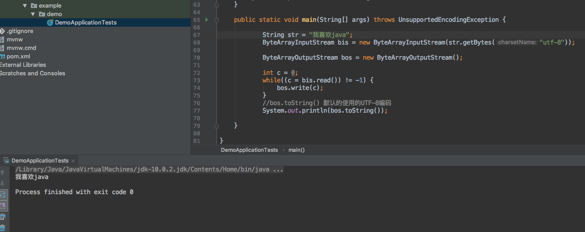
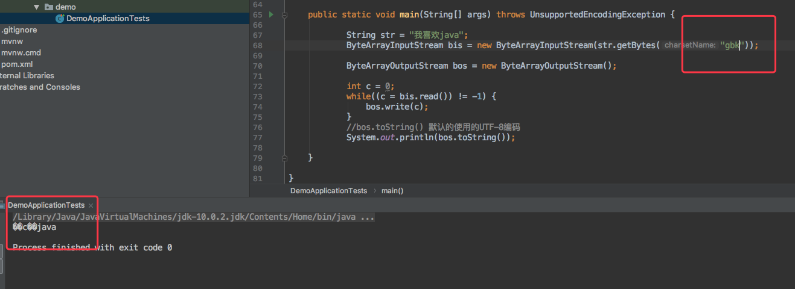
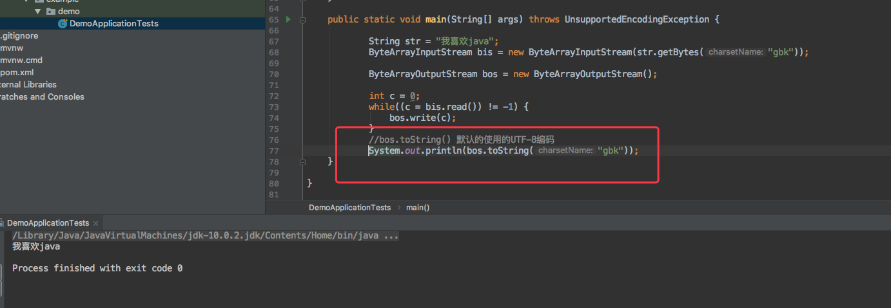
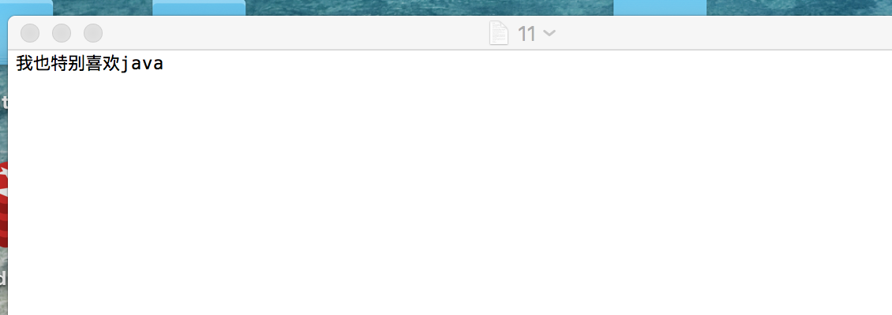
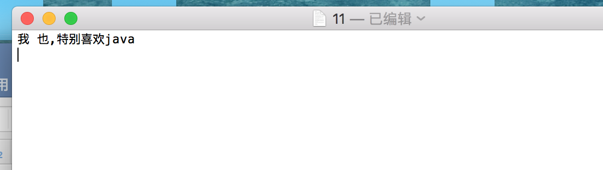
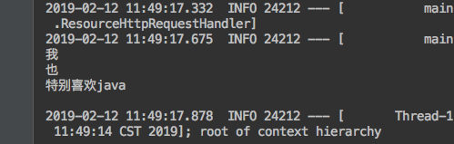

<h1 align="center">JDK10新特性详解</h1>

#### 1、局部变量var

   将前端思想var关键字引入java后段，自动检测所属于类型，一种情况除外，不能为null，因为不能判断具体类型，会报异常。

```
@Test
public void test1(){
    var number = 10;
    var str    = "i like java";
    var list   = new ArrayList<>();
    var map    = new HashMap<>();
    var set    = new HashSet<>();

    list.add("test var is list");

    map.put("1","test var is map");

    set.add("test var is set");

    System.out.println(number);

    System.out.println(str);

    System.out.println(list.toString());

    System.out.println(map.toString());

    System.out.println(set.toString());

}
```

   结果：

```
10
i like java
[test var is list]
{1=test var is map}
[test var is set]
```

   var可以用于任何类型，基本类型，集合，以及实体类等等都可以，省略了我们在前面写入具体的类型，我们尽管var，让它自己去判断就好了。


#### 2、copyOf方法

   在java.util.List、java.util.Set、java.util.Map新增加了一个静态方法copyOf，这些方法按照其迭代顺序返回一个不可修改的列表、集合或映射包含了给定的元素的集合。但是如果将返回后的集合继续修改，那么报异常。

```
@Test
public void test2(){
    var list = new ArrayList<>();

    list.add("first");
    list.add("second");
    list.add("third");

    var result = List.copyOf(list);

    System.out.println(result.toString());
}
```

   结果：

```
[first, second, third]
```


#### 3、ByteArrayOutputStream

   Java.io.ByteArrayOutputStream，重载toString()方法，通过使用指定的字符集编码字节，将缓冲区的内容转换为字符串，以前是默认没有参数，现在加了一个编码的字符方法。

```
public static void main(String[] args) throws Exception {
    String str = "我喜欢java";
    ByteArrayInputStream bis = new ByteArrayInputStream(str.getBytes("utf-8"));

    ByteArrayOutputStream bos = new ByteArrayOutputStream();

    int c = 0;
    while((c = bis.read()) != -1) {
        bos.write(c);
    }
    //bos.toString() 默认的使用的UTF-8编码
    System.out.println(bos.toString());
}
```





   这个是我们正常的格式，但是当我们修改代码，str.getBytes("gbk")的时候，创建的txt为乱码，那么我们使用toString()的新增方法，替换gbk。




#### 4、PrintStream、PrintWriter

   Java.io.PrintStream,Java.io.PrintWriter，这两个类都有三个新的构造方法，他们需要而外的参数charset

```
@Test
public void test3() throws FileNotFoundException, UnsupportedEncodingException {
    String str = "我也特别喜欢java";
    var pri    = new PrintWriter("/Users/tentsuuhou/Desktop/11.txt");
    pri.println(str);
    pri.flush();
    pri.close();
}
```

   我这个路径是mac电脑的，如果你是windows，可以写“d:/aa.txt“ 不过都需要提前创建好txt文件夹

   结果为：



   但是我们这个txt默认的都是utf-8格式的，如果突然改成gbk的话，格式会不匹配出现乱码，毕竟txt文件格式要和输出的格式一致才可以，这是我们可以使用一下。

```
var pri = new PrintWriter("/Users/tentsuuhou/Desktop/11.txt","gbk");
```

   我们直接在后面添加一个格式参数就可以直接解决啦


#### 5、Reader:transferTo方法

Java.io.Reader:transferTo从这个Reader中读取所有字符串，并按照所读取的顺序将字符串写入给指定的Writer

```
@Test
public void test4() throws IOException {
    var reader = new BufferedReader(new InputStreamReader(new FileInputStream("/Users/tentsuuhou/Desktop/11.txt"), "utf-8"));
    var p = new PrintWriter(new File("/Users/tentsuuhou/Desktop/12.txt"));
    reader.transferTo(p);
    p.flush();
    p.close();
    reader.close();
}
```

   结果：12.txt文件将11.txt文件拷贝过来了，注意编码格式也要一致才可以。用这个方法方便了许多。


#### 6、Formatter、Scanner

   java.util.Formatter、java.util.Scanner新增三个构造方法，除了其他参数之外，都需要一个charset参数，将11.txt内容替换成这样



```
@Test
public void test5() throws FileNotFoundException {
    var scan = new Scanner(new FileInputStream(new File("/Users/tentsuuhou/Desktop/11.txt")),"utf-8");
    scan.useDelimiter(" |,");
    while(scan.hasNext()) {
        System.out.println(scan.next());
    }

}
```

   scan.useDelimiter(" |,"); 这是空格或者‘,’ 都要分割，如下结果为：




#### 7、垃圾收集器的优化

```
1、JDK9垃圾收集器 ：新生代：ParNew收集器；老年代：Parallel Old收集器   Stop The World

2、JDK10垃圾收集器：JDK10：G1（Garbage-Frist）全收集器
```

source: https://my.oschina.net/mdxlcj/blog/3009128