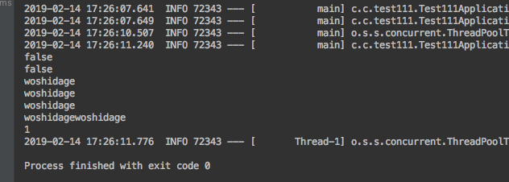
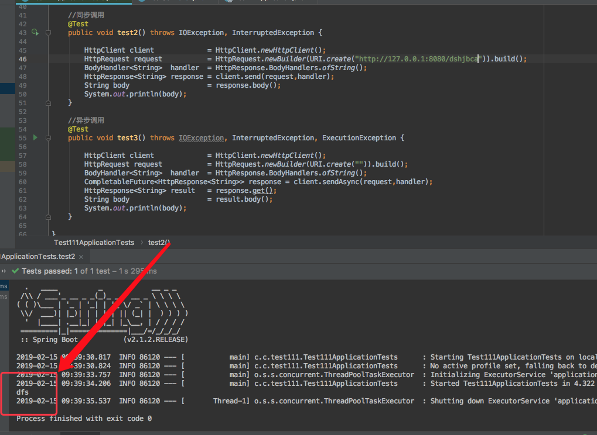

<h1 align="center">JDK11新特性详解</h1>

#### 1、增强局部变量类型推断var

```
Consumer<String> consumer = t -> System.out.println(t.toUpperCase());
Consumer<String> consumer = (var t) -> System.out.println(t.toUpperCase());

错误的形式：必须要有类型，可以加上var
Consumer<String> consumer = (@Deprecated t) ->System.out.println(t.toUpperCase())
正确的形式
Consumer<String> consumer = (@Deprecated var t) ->System.out.println(t.toUpperCase())
```


#### 2、增加一些实用的API

   自JDK9和JDK10都为java增加了许多的API，如今JDK11又增加了许多字符串自带方法，如下

```
@Test
public void contextLoads() {
    String str = "woshidage";
    boolean isblank = str.isBlank();  //判断字符串是空白
    boolean isempty = str.isEmpty();  //判断字符串是否为空
    String  result1 = str.strip();    //首位空白
    String  result2 = str.stripTrailing();  //去除尾部空白
    String  result3 = str.stripLeading();  //去除首部空白
    String  copyStr = str.repeat(2);  //复制几遍字符串
    long  lineCount = str.lines().count();  //行数统计

    System.out.println(isblank);
    System.out.println(isempty);
    System.out.println(result1);
    System.out.println(result2);
    System.out.println(result3);
    System.out.println(copyStr);
    System.out.println(lineCount);
}
```

   结果为：




#### 3、移除和废弃的内容

   3.1 移除项

```
1、移除了com.sun.awt.AWTUtilities

2、移除了sun.misc.Unsafe.defineClass，使用java.lang.invoke.MethodHandles.Lookup.defineClass来替代

3、移除了Thread.destroy()以及 Thread.stop(Throwable)方法

4、移除了sun.nio.ch.disableSystemWideOverlappingFileLockCheck、sun.locale.formatasdefault属性

5、移除了jdk.snmp模块

6、移除了javafx，openjdk估计是从java10版本就移除了，oracle jdk10还尚未移除javafx，而java11版本则oracle的jdk版本也移除了javafx

7、移除了Java Mission Control，从JDK中移除之后，需要自己单独下载

8、移除了这些Root Certificates ：Baltimore Cybertrust Code Signing CA，SECOM ，AOL and Swisscom
```

   3.2 废弃项

```
1、-XX+AggressiveOpts选项

2、-XX:+UnlockCommercialFeatures

3、-XX:+LogCommercialFeatures选项也不再需要
```


#### 4、HttpClient加强方法

   现在 Java 自带了这个 HTTP Client API，我们以后还有必要用 Apache 的 HttpClient 工具包吗？

   4.1 需要远程调用的接口

```
@RequestMapping(value = "/dshjbca")
public String test1(){
    return "dfs";
}
```

   4.2 HttpClient调用该接口

```
//同步调用
@Test
public void test2() throws IOException, InterruptedException {

    HttpClient client             = HttpClient.newHttpClient();
    HttpRequest request           = HttpRequest.newBuilder(URI.create("")).build();
    BodyHandler<String>  handler  = HttpResponse.BodyHandlers.ofString();
    HttpResponse<String> response = client.send(request,handler);
    String body                   = response.body();
    System.out.println(body);
}

//异步调用
@Test
public void test3() throws IOException, InterruptedException, ExecutionException {

    HttpClient client             = HttpClient.newHttpClient();
    HttpRequest request           = HttpRequest.newBuilder(URI.create("")).build();
    BodyHandler<String>  handler  = HttpResponse.BodyHandlers.ofString();
    CompletableFuture<HttpResponse<String>> response = client.sendAsync(request,handler);
    HttpResponse<String> result   = response.get();
    String body                   = result.body();
    System.out.println(body);
}
```

   结果：




#### 5、Unicode 10

   Unicode 10 增加了8518个字符, 总计达到了136690个字符. 并且增加了4个脚本.同时还有56个新的emoji表情符号。


#### 6、Remove the JavaEE and CORBA Moudles

   在java11中移除了不太使用的JavaEE模块和CORBA技术，在java11中将java9标记废弃的Java EE及CORBA模块移除掉。

```
1、java.xml.ws,

2、java.xml.bind，

3、java.xml.ws，

4、java.xml.ws.annotation，

5、jdk.xml.bind，

6、jdk.xml.ws被移除，

    只剩下java.xml，java.xml.crypto,jdk.xml.dom这几个模块

7、java.corba，

8、java.se.ee，

9、java.activation，

10、java.transaction被移除，但是java11新增一个java.transaction.xa模块
```


#### 7、JEP : 335 : Deprecate the Nashorn JavaScript Engine

   废除Nashorn javascript引擎，在后续版本准备移除掉，有需要的可以考虑使用GraalVM。


#### 8、JEP : 336 : Deprecate the Pack200 Tools and API

   Java5中带了一个压缩工具:Pack200，这个工具能对普通的jar文件进行高效压缩。其 实现原理是根据Java类特有的结构，合并常数 池，去掉无用信息等来实现对java类的高效压缩。由于是专门对Java类进行压缩的，所以对普通文件的压缩和普通压缩软件没有什么两样，但是对于Jar 文件却能轻易达到10-40%的压缩率。这在Java应用部署中很有用，尤其对于移动Java计算，能够大大减小代码下载量。

   Java5中还提供了这一技术的API接口，你可以将其嵌入到你的程序中使用。使用的方法很简单，下面的短短几行代码即可以实现jar的压缩和解压：

压缩

```
Packer packer=Pack200.newPacker();

OutputStream output=new BufferedOutputStream(new  FileOutputStream(outfile));

packer.pack(new JarFile(jarFile), output);

output.close();
```

解压

```
Unpacker unpacker=Pack200.newUnpacker();

output=new JarOutputStream(new FileOutputStream(jarFile));

unpacker.unpack(pack200File, output);

output.close();
```

   Pack200的压缩和解压缩速度是比较快的，而且压缩率也是很惊人的，在我是使用 的包4.46MB压缩后成了1.44MB（0.322%），而且随着包的越大压缩率会根据明显，据说如果jar包都是class类可以压缩到1/9的大 小。其实JavaWebStart还有很多功能，例如可以按不同的jar包进行lazy下载和 单独更新，设置可以根据jar中的类变动进行class粒度的下载。但是在java11中废除了pack200以及unpack200工具以及java.util.jar中的Pack200 API。因为Pack200主要是用来压缩jar包的工具，由于网络下载速度的提升以及java9引入模块化系统之后不再依赖Pack200，因此这个版本将其移除掉。


#### 9、新的Epsilon垃圾收集器

   A NoOp Garbage Collector JDK上对这个特性的描述是: 开发一个处理内存分配但不实现任何实际内存回收机制的GC, 一旦可用堆内存用完, JVM就会退出.

如果有System.gc()调用, 实际上什么也不会发生(这种场景下和-XX:+DisableExplicitGC效果一样), 因为没有内存回收, 这个实现可能会警告用户尝试强制GC是徒劳.

   用法 : -XX:+UnlockExperimentalVMOptions -XX:+UseEpsilonGC

   选项-XX:+UseEpsilonGC, 程序很快就因为堆空间不足而退出

   原因 :提供完全被动的GC实现, 具有有限的分配限制和尽可能低的延迟开销,但代价是内存占用和内存吞吐量, java实现可广泛选择高度可配置的GC实现. 各种可用的收集器最终满足不同的需求, 即使它们的可配置性使它们的功能相交. 有时更容易维护单独的实现, 而不是在现有GC实现上堆积另一个配置选项.

主要用途如下 :

```
1、性能测试(它可以帮助过滤掉GC引起的性能假象)

2、内存压力测试(例如,知道测试用例 应该分配不超过1GB的内存, 我们可以使用-Xmx1g –XX:+UseEpsilonGC, 如果程序有问题, 则程序会崩溃)

3、非常短的JOB任务(对象这种任务, 接受GC清理堆那都是浪费空间)

4、VM接口测试

5、Last-drop 延迟&吞吐改进
```


### 10、ZGC

```
ZGC, 这应该是JDK11最为瞩目的特性, 没有之一. 但是后面带了Experimental, 说明这还不建议用到生产环境。
    GC暂停时间不会超过10ms，既能处理几百兆的小堆, 也能处理几个T的大堆(OMG)，和G1相比, 应用吞吐能力不会下降超过15%，为未来的GC功能和利用colord指针以及Load barriers优化奠定基础，初始只支持64位系统
    ZGC的设计目标是：支持TB级内存容量，暂停时间低（<10ms），对整个程序吞吐量的影响小于15%。 将来还可以扩展实现机制，以支持不少令人兴奋的功能，例如多层堆（即热对象置于DRAM和冷对象置于NVMe闪存），或压缩堆。
    GC是java主要优势之一，当GC停顿太长, 就会开始影响应用的响应时间.消除或者减少GC停顿时长, java将对更广泛的应用场景是一个更有吸引力的平台. 此外, 现代系统中可用内存不断增长,用户和程序员希望JVM能够以高效的方式充分利用这些内存, 并且无需长时间的GC暂停时间
```

   用法 : -XX:+UnlockExperimentalVMOptions –XX:+UseZGC, 因为ZGC还处于实验阶段, 所以需要通过JVM参数来解锁这个特性


#### 11、完全支持Linux容器（包括Docker）

   许多运行在Java虚拟机中的应用程序（包括Apache Spark和Kafka等数据服务以及传统的企业应用程序）都可以在Docker容器中运行。但是在Docker容器中运行Java应用程序一直存在一个问题，那就是在容器中运行JVM程序在设置内存大小和CPU使用率后，会导致应用程序的性能下降。这是因为Java应用程序没有意识到它正在容器中运行。随着Java 10的发布，这个问题总算得以解决，JVM现在可以识别由容器控制组（cgroups）设置的约束。可以在容器中使用内存和CPU约束来直接管理Java应用程序，其中包括：

```
遵守容器中设置的内存限制

在容器中设置可用的CPU

在容器中设置CPU约束

Java 10的这个改进在Docker for Mac、Docker for Windows以及Docker Enterprise Edition等环境均有效。

容器的内存限制

在Java 9之前，JVM无法识别容器使用标志设置的内存限制和CPU限制。而在Java 10中，内存限制会自动被识别并强制执行。Java将服务器类机定义为具有2个CPU和2GB内存，以及默认堆大小为物理内存的1/4。
```


#### 12、支持G1上的并行完全垃圾收集

   对于 G1 GC，相比于 JDK 8，升级到 JDK 11 即可免费享受到：并行的 Full GC，快速的 CardTable 扫描，自适应的堆占用比例调整（IHOP），在并发标记阶段的类型卸载等等。这些都是针对 G1 的不断增强，其中串行 Full GC 等甚至是曾经被广泛诟病的短板，你会发现 GC 配置和调优在 JDK11 中越来越方便。

source : https://my.oschina.net/mdxlcj/blog/3010342