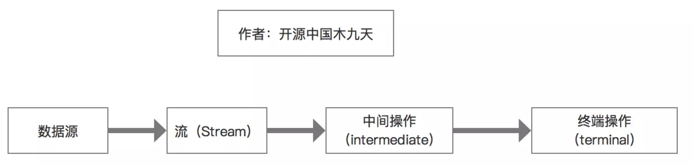
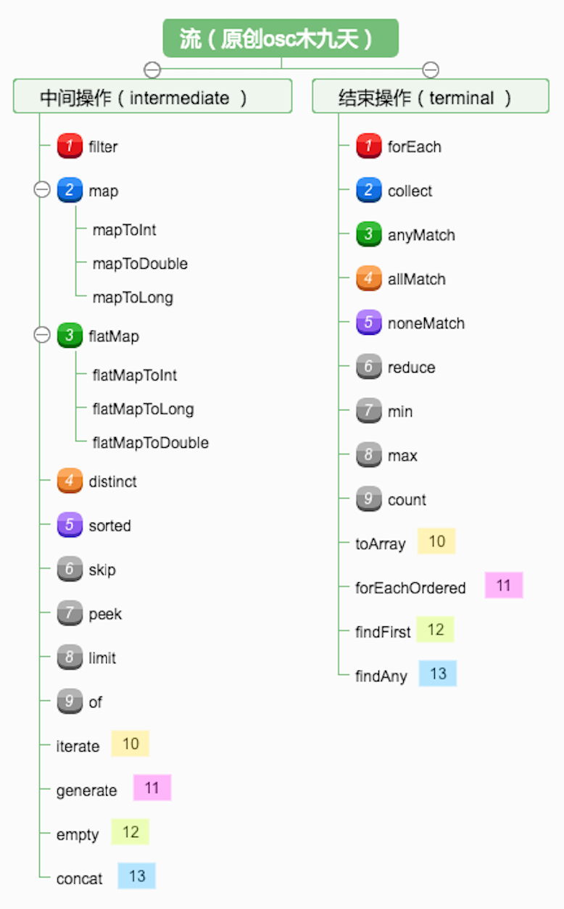
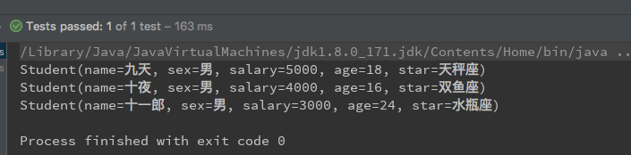
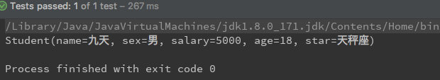
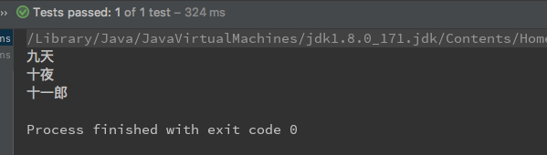

<h1 align="center">JDK8新特性详解</h1>

   简介：JDK8的主要新特性四个：Lambda、Stream、Date、新注解，前两者主要用于集合中。

### **1、Lambda演变过程**

```java
@Data
@ToString
@NoArgsConstructor
@AllArgsConstructor
public class Student {
    //名字
    private String name;
    //性别
    private String sex;
    //薪水
    private int salary;
    //年龄
    private int age;
    //星座
    private String star;
}
```

#### **1.1、普通筛选**

   将这个集合遍历，然后依次的判断，这是最为普通的一种方式。

```java
@Test
public void test1(){
    //首先创建一个
    List<Student> list = Arrays.asList(
            new Student("九天","男",5000,18,"天秤座"),
            new Student("十夜","男",4000,16,"双鱼座"),
            new Student("十一郎","男",3000,24,"水瓶座")
    );

    List<Student> result = new ArrayList<>();
    for (Student student:list){
        if ("天秤座".equals(student.getStar())){
            result.add(student);
        }
    }
    System.out.println(result);
}
```

#### 1.2、匿名内部类筛选

   通过匿名内部类的方法，在内部类中添加判断条件进行筛选,首先创建一个公共接口：

```
public interface FilterProcess<T> {
    boolean process(T t);
}
```

   接下来通过一个公共函数，对集合以及筛选条件做一个共同方法，筛选到班级里星座是天秤星座的学生

```
public List<Student> filterStudent(List<Student> students, FilterProcess<Student> mp){
    List<Student> list = new ArrayList<>();

    for (Student student : students) {
        if(mp.process(student)){
            list.add(student);
        }
    }
    return list;
}
```

   最后是通过匿名内部类和该方法得到结果：

```
@Test
public void test2(){
    List<Student> students = Arrays.asList(
            new Student("九天","男",5000,18,"天秤座"),
            new Student("十夜","男",4000,16,"双鱼座"),
            new Student("十一郎","男",3000,24,"水瓶座")
    );

    List<Student> list = filterStudent(students, new FilterProcess<Student>() {
        @Override
        public boolean process(Student student) {
            return student.getStar().equals("天秤座");
        }
    });
    for (Student student : list) {
        System.out.println(student);
    }
}
```

结果如图：


#### 1.3、半Lambda方法

   但是通过这两种代码都是很多，所以java8在这一点上提供了对集合筛选最大程度的删减代码，就是第三种方法。第三种方法：通过Lambda直接判断，一步到位，不需要在写其他的方法。

```java
@Test
public void test3(){
    List<Student> list = Arrays.asList(
            new Student("九天","男",5000,18,"天秤座"),
            new Student("十夜","男",4000,16,"双鱼座"),
            new Student("十一郎","男",3000,24,"水瓶座")
    );
    List<Student> result = filterStudent(list,(e)->e.getStar().equals("天秤座"));
    System.out.println(result);
}
```

   测试结果：

```java
[Student(name=九天, sex=男, salary=5000, age=18, star=天秤座)]
```

   但是现在又会有人会问这个问题，我的那个方法中是这样子的

```java
filterStudent(List<Student> students, FilterProcess<Student> mp)
```

   为什么我的代码参数却是这样子的呢

```java
filterStudent(list,(e)->e.getStar().equals("天秤座")
```

   其实 -> 这个是一个连接符，左边代表参数，而右边代表函数体（也就是我们说的条件），这个e就是代表 FilterProcess<Student> mp 这个参数的，只不过我们得java8 中lambda可以给这个参数附加上了条件，这些条件筛选都是封装到jdk8中内部类中自己实现的，所以我们只要附加条件就可以了，那个(e)就代表传了参数。

#### 1.4、真正运用lambda方法

```java
@Test
public void test1() {
    List<Student> list = Arrays.asList(
            new Student("九天","男",5000,18,"天秤座"),
            new Student("十夜","男",4000,16,"双鱼座"),
            new Student("十一郎","男",3000,24,"水瓶座")
    );

    list.stream().filter((e) -> e.getStar().equals("天秤座"))
            .forEach(System.out::println);
}
```

   结果依然是相同的答案，直到第4个方法出来，对比前三个方法，简单了很多，这就是我们lambda演练的过程。

   总结：lambda主要是针对集合中条件的筛选，包括数组等等。接下来我们介绍Stream API ,这个和Lambda息息相关，论重要性，lambda只是基础，Stream API 才是真正的升级版

### 2、StreamAPI详解



#### 2.0、功能

   父类：BasicStream

   子类：Stream、IntStream、LongStream、DoubleStream

   包含两个类型，中间操作(intermediate operations)和结束操作(terminal operations)

   下面是所有方法的属于那一端操作的方法：

​       

   然后准备一个测试类，和一个静态变量，图下：

```java
public class JdkTest {
    public static List<Student> list = Arrays.asList(
            new Student("九天", "男", 5000, 18, "天秤座"),
            new Student("十夜", "男", 4000, 16, "双鱼座"),
            new Student("十一郎", "男", 3000, 24, "水瓶座")
    );
}
```

   接下来我们一个一个方法解析他们的作用

#### 2.1、stream

   将集合转换成流,一般会使用流继续后续操作。

```java
@Test
public void test0() {
    list.stream();
}
```

#### 2.2、forEach遍历

   forEach遍历集合，System.out::println等同于System.out.println()

```java
@Test
public void test1() {
    list.forEach(System.out::println);
}
```

   结果为：



#### 2.3、filter过滤

   该方法中是一个筛选条件，等同于sql查询的where后面的筛选。

```java
@Test
public void test2() {
    list.stream().filter((e) -> e.getStar().equals("天秤座"))
            .forEach(System.out::println);
}
```

  

#### 2.4、map转换集合

   将List<Student> 转换为List<String>, collect是将结果转换为List

```java
@Test
public void test3() {
    List<String> names = list.stream().map(Student::getName).collect(Collectors.toList());
    names.stream().forEach(System.out::println);
}
```

   结果：   

#### 2.5、mapToInt转换数值流

   转换数值流，等同mapToLong、mapToDouble，如下这个是取最大值

```java
@Test
public void test4() {
    IntStream intStream = list.stream().mapToInt(Student::getAge);
    Stream<Integer> integerStream = intStream.boxed();
    Optional<Integer> max   = integerStream.max(Integer::compareTo);
    System.out.println(max.get());
}
```

   结果为：

```
24
```

#### 2.6、flatMap合并成一个流

   将流中的每一个元素 T 映射为一个流，再把每一个流连接成为一个流

```java
@Test
public void test5() {
    List<String> list2 = new ArrayList<>();
    list2.add("aaa bbb ccc");
    list2.add("ddd eee fff");
    list2.add("ggg hhh iii");
    list2 = list2.stream().map(s -> s.split(" ")).flatMap(Arrays::stream).collect(Collectors.toList());
    System.out.println(list2);
}
```

   结果为：

```
[aaa, bbb, ccc, ddd, eee, fff, ggg, hhh, iii]
```

#### 2.7、distinct去重

```java
@Test
public void test6() {
    List<String> list2 = new ArrayList<>();
    list2.add("aaa bbb ccc");
    list2.add("ddd eee fff");
    list2.add("ggg hhh iii");
    list2.add("ggg hhh iii");

    list2.stream().distinct().forEach(System.out::println);
}
```

   结果：

```
aaa bbb ccc
ddd eee fff
ggg hhh iii
```

#### 2.8、sorted排序

```java
@Test
public void test7() {

    //asc排序
    	list.stream().sorted(Comparator.comparingInt(Student::getAge)).forEach(System.out::println);
    System.out.println("----------------------------");

	//desc排序
    list.stream().sorted(Comparator.comparingInt(Student::getAge).reversed()).forEach(System.out::println);
}
```

   结果：

```
Student(name=十夜, sex=男, salary=4000, age=16, star=双鱼座)
Student(name=九天, sex=男, salary=5000, age=18, star=天秤座)
Student(name=十一郎, sex=男, salary=3000, age=24, star=水瓶座)
----------------------------------------------
Student(name=十一郎, sex=男, salary=3000, age=24, star=水瓶座)
Student(name=九天, sex=男, salary=5000, age=18, star=天秤座)
Student(name=十夜, sex=男, salary=4000, age=16, star=双鱼座)
```

#### 2.9、skip跳过前n个

```java
@Test
public void test8() {
    list.stream().skip(1).forEach(System.out::println);
}
```

#### 2.10、limit截取前n个

```java
@Test
public void test10() {
    list.stream().limit(1).forEach(System.out::println);
}
```

   结果为：

```
Student(name=九天, sex=男, salary=5000, age=18, star=天秤座)
```

#### 2.11、anyMatch

   只要有其中任意一个符合条件

```java
@Test
public void test11() {
    boolean isHave = list.stream().anyMatch(student -> student.getAge() == 16);
    System.out.println(isHave);
}
```

#### 2.12、allMatch

   全部符合

```java
@Test
public void test12() {
    boolean isHave = list.stream().allMatch(student -> student.getAge() == 16);
    System.out.println(isHave);
}
```

#### 2.13、noneMatch

   是否满足没有符合的

```java
@Test
public void test13() {
    boolean isHave = list.stream().noneMatch(student -> student.getAge() == 16);
    System.out.println(isHave);
}
```

#### 2.14、findAny

   找到其中一个元素 （使用 stream() 时找到的是第一个元素；使用 parallelStream() 并行时找到的是其中一个元素）

```java
@Test
public void test14() {
    Optional<Student> student = list.stream().findAny();
    System.out.println(student.get());
}
```

#### 2.15、findFirst

   找到第一个元素

```java
@Test
public void test15() {
    Optional<Student> student = list.stream().findFirst();
    System.out.println(student.get());
}
```

#### 2.17、count计数

```java
@Test
public void test17() {
    long count = list.stream().count();
    System.out.println(count);
}
```

#### 2.18、of

   生成一个字符串流

```java
@Test
public void test18() {
    Stream<String> stringStream = Stream.of("i","love","you");
}
```

#### 2.19、empty

   生成一个空流

```java
@Test
public void test19() {
    Stream<String> stringStream = Stream.empty();
}
```

#### 2.20、iterate

```java
@Test
public void test20() {
    List<String> list = Arrays.asList("a", "b", "c", "c", "d", "f", "a");
    Stream.iterate(0, i -> i + 1).limit(list.size()).forEach(i -> {
        System.out.println(String.valueOf(i) + list.get(i));
    });
}
```

### 3、Date

#### 3.1、JDK7 Date缺点

```
1、所有的日期类都是可变的，因此他们都不是线程安全的，这是Java日期类最大的问题之一

2、Java的日期/时间类的定义并不一致，在java.util和java.sql的包中都有日期类，此外用于格式化和解析的类在java.text包中定义

3、java.util.Date同时包含日期和时间，而java.sql.Date仅包含日期，将其纳入java.sql包并不合理。另外这两个类都有相同的名字，这本身就是一个非常糟糕的设计。对于时间、时间戳、格式化以及解析，并没有一些明确定义的类。对于格式化和解析的需求，我们有java.text.DateFormat抽象类，但通常情况下，SimpleDateFormat类被用于此类需求

4、日期类并不提供国际化，没有时区支持，因此Java引入了java.util.Calendar和java.util.TimeZone类，但他们同样存在上述所有的问题
```

#### 3.2、JDK8 Date优势

```
1、不变性：新的日期/时间API中，所有的类都是不可变的，这对多线程环境有好处。

2、关注点分离：新的API将人可读的日期时间和机器时间（unix timestamp）明确分离，它为日期（Date）、时间（Time）、日期时间（DateTime）、时间戳（unix timestamp）以及时区定义了不同的类。

3、清晰：在所有的类中，方法都被明确定义用以完成相同的行为。举个例子，要拿到当前实例我们可以使用now()方法，在所有的类中都定义了format()和parse()方法，而不是像以前那样专门有一个独立的类。为了更好的处理问题，所有的类都使用了工厂模式和策略模式，一旦你使用了其中某个类的方法，与其他类协同工作并不困难。

4、实用操作：所有新的日期/时间API类都实现了一系列方法用以完成通用的任务，如：加、减、格式化、解析、从日期/时间中提取单独部分，等等。

5、可扩展性：新的日期/时间API是工作在ISO-8601日历系统上的，但我们也可以将其应用在非IOS的日历上。
```

#### 3.3、JDK8 Date新增字段

   Java.time包中的是类是不可变且线程安全的。新的时间及日期API位于java.time中，java8 time包下关键字段解读。

| 属性          | 含义                                                         |
| ------------- | ------------------------------------------------------------ |
| Instant       | 代表的是时间戳                                               |
| LocalDate     | 代表日期，比如2020-01-14                                     |
| LocalTime     | 代表时刻，比如12:59:59                                       |
| LocalDateTime | 代表具体时间 2020-01-12 12:22:26                             |
| ZonedDateTime | 代表一个包含时区的完整的日期时间，偏移量是以UTC/  格林威治时间为基准的 |
| Period        | 代表时间段                                                   |
| ZoneOffset    | 代表时区偏移量，比如：+8:00                                  |
| Clock         | 代表时钟，比如获取目前美国纽约的时间                         |

#### 3.4、获取当前时间

```java
Instant instant = Instant.now(); //获取当前时间戳

LocalDate localDate = LocalDate.now();  //获取当前日期

LocalTime localTime = LocalTime.now();  //获取当前时刻

LocalDateTime localDateTime = LocalDateTime.now();  //获取当前具体时间

ZonedDateTime zonedDateTime = ZonedDateTime.now();   //获取带有时区的时间
```

#### 3.5、字符串转换

```java
// jdk8：
String str = "2019-01-11";
DateTimeFormatter formatter = DateTimeFormatter.ofPattern("yyyy-MM-dd");
LocalDate localDate = LocalDate.parse(str, formatter);

// jdk7:
SimpleDateFormat simpleDateFormat = new SimpleDateFormat("yyyy-MM-dd");
try {
    Date date = simpleDateFormat.parse(str); 
} catch (ParseException e){ 
    e.printStackTrace();
}
```

#### 3.6、Date转换LocalDate

```java
import java.time.Instant;
import java.time.LocalDate;
import java.time.ZoneId;
import java.util.Date;

public class Test {

    public static void main(String[] args) {
        Date date = new Date();
        Instant instant = date.toInstant();
        ZoneId zoneId = ZoneId.systemDefault();

        // atZone()方法返回在指定时区从此Instant生成的ZonedDateTime。
        LocalDate localDate = instant.atZone(zoneId).toLocalDate();
        System.out.println("Date = " + date);
        System.out.println("LocalDate = " + localDate);
    }
}
```

#### 3.7、LocalDate转Date

```java
import java.time.LocalDate;
import java.time.ZoneId;
import java.time.ZonedDateTime;
import java.util.Date;

public class Test {

    public static void main(String[] args) {
        ZoneId zoneId = ZoneId.systemDefault();
        LocalDate localDate = LocalDate.now();
        ZonedDateTime zdt = localDate.atStartOfDay(zoneId);

        Date date = Date.from(zdt.toInstant());

        System.out.println("LocalDate = " + localDate);
        System.out.println("Date = " + date);

    }
}
```

#### 3.8、时间戳转LocalDateTime

```java
long timestamp = System.currentTimeMillis();

Instant instant = Instant.ofEpochMilli(timestamp);

LocalDateTime.ofInstant(instant, ZoneId.systemDefault());
```

#### 3.9、LocalDateTime转时间戳

```java
LocalDateTime dateTime = LocalDateTime.now();

dateTime.toInstant(ZoneOffset.ofHours(8)).toEpochMilli();

dateTime.toInstant(ZoneOffset.of("+08:00")).toEpochMilli();

dateTime.atZone(ZoneId.systemDefault()).toInstant().toEpochMilli();
```

#### 3.10、LocalDate方法总结

```java
getYear()                         int        获取当前日期的年份
getMonth()                        Month      获取当前日期的月份对象
getMonthValue()                   int        获取当前日期是第几月
getDayOfWeek()                    DayOfWeek  表示该对象表示的日期是星期几
getDayOfMonth()                   int        表示该对象表示的日期是这个月第几天
getDayOfYear()                    int        表示该对象表示的日期是今年第几天
withYear(int year)                LocalDate  修改当前对象的年份
withMonth(int month)              LocalDate  修改当前对象的月份
withDayOfMonth(intdayOfMonth)     LocalDate  修改当前对象在当月的日期
isLeapYear()                      boolean    是否是闰年
lengthOfMonth()                   int        这个月有多少天
lengthOfYear()                    int        该对象表示的年份有多少天（365或者366）
plusYears(longyearsToAdd)         LocalDate  当前对象增加指定的年份数
plusMonths(longmonthsToAdd)       LocalDate  当前对象增加指定的月份数
plusWeeks(longweeksToAdd)         LocalDate  当前对象增加指定的周数
plusDays(longdaysToAdd)           LocalDate  当前对象增加指定的天数
minusYears(longyearsToSubtract)   LocalDate  当前对象减去指定的年数
minusMonths(longmonthsToSubtract) LocalDate  当前对象减去注定的月数
minusWeeks(longweeksToSubtract)   LocalDate  当前对象减去指定的周数
minusDays(longdaysToSubtract)     LocalDate  当前对象减去指定的天数
compareTo(ChronoLocalDateother)   int        比较当前对象和other对象在时间上的大小，返回值如果为正，则当前对象时间较晚，
isBefore(ChronoLocalDateother)    boolean    比较当前对象日期是否在other对象日期之前
isAfter(ChronoLocalDateother)     boolean    比较当前对象日期是否在other对象日期之后
isEqual(ChronoLocalDateother)     boolean    比较两个日期对象是否相等
```

source: https://my.oschina.net/mdxlcj/blog/1622718