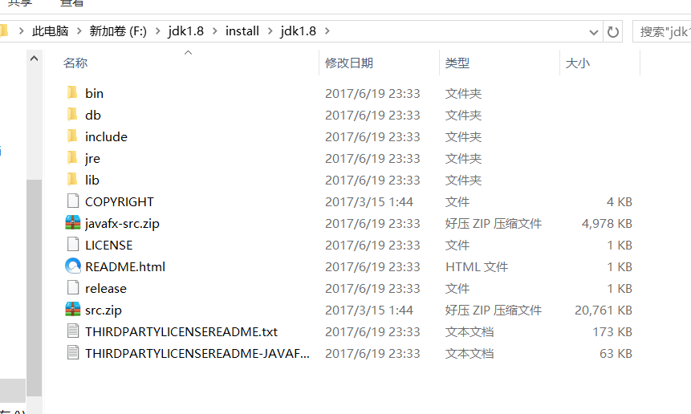
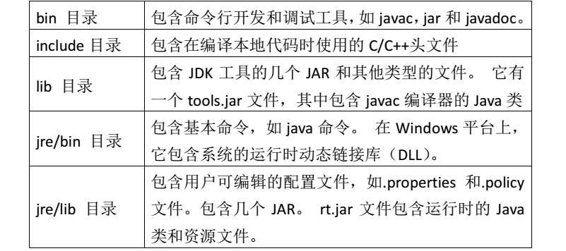
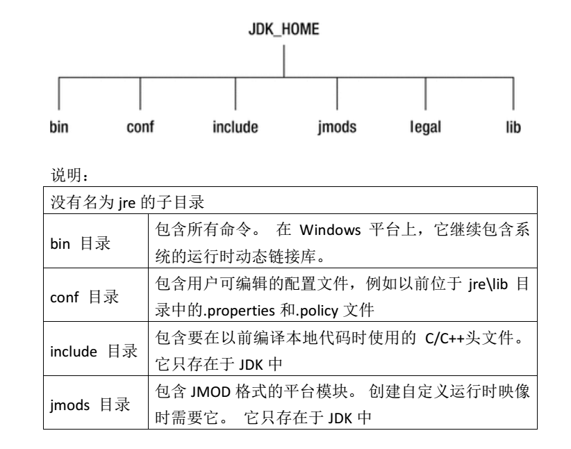
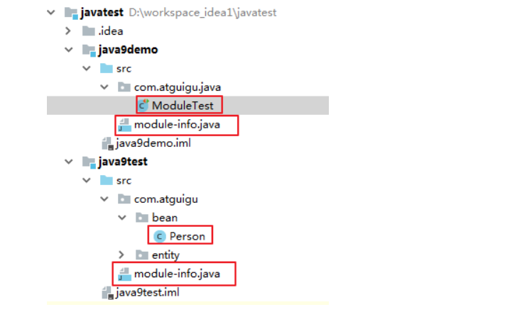
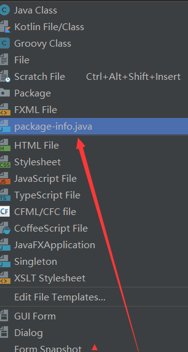
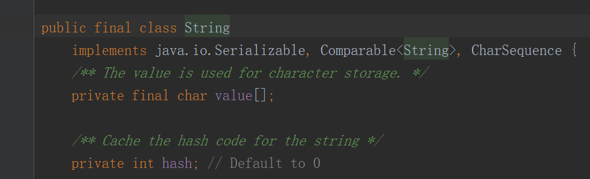
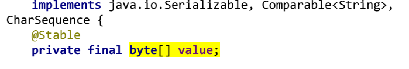
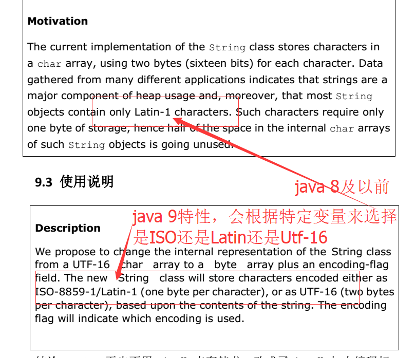
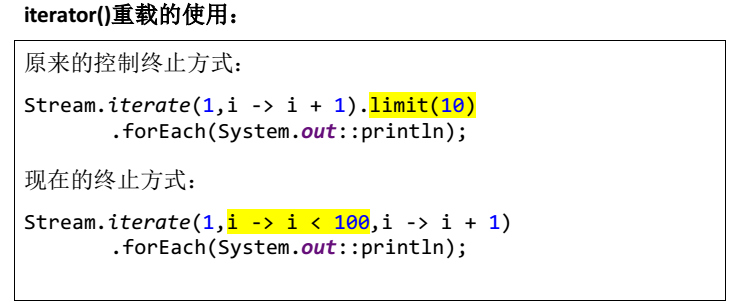

<h1 align="center">JDK9新特性详解</h1>

#### 1、Java9新特性之目录结构

   包含jdk8及以前的jdk版本，所有目录结构以及目录含义如图：

 



​    jdk9之后，目录结构发生变化如图：

  

   这个新特性只要了解下就可以了，这个目录结构是方便为了接下来新特性做保证


#### 2、Java9新特性之JShell工具

   怎么理解，怎么用呢？这个只是针对于java9来说，相当于cmd工具，你可以和cmd一样，直接写方法等等，不过我认为只是适用于初学者做一些最简单的运算和写一些方法，在cmd中打开这个工具：

​    

​     进入工具后可以做一些简单的java操作

​    

​    等等，我认为只适用于初学者学习java不用其他编辑工具就可以学习java


#### 3、Java9新特性之模块化

​    一个大型的项目，比如淘宝商城等，都会包含多个模块，比如订单模块，前台模块，后台管理模块，广告位模块，会员模块.....等等，各个模块之间会相互调用，不过这种情况下会很少，只针对特殊情况，如果一个项目有30个模块系统进行开发，但是只要某个单独模块运行时，都会带动所有的模块，这样对于jvm来说在内存和性能上会很低，所以，java9提供了这一个特性，某一个模块运行的时候，jvm只会启动和它有依赖的模块，并不会加载所有的模块到内存中，这样性能大大的提高了。写法上如下：

​    

​    一个项目中的两个模块，模块之间通过module-info.java来关联，在IDEA编辑器右键创建package-info.java

​    

​    在这个两个模块java9Demo和java9Test中，java9demo编写一个实体类Person,在java9Test调用这样一个过程

​    这个是java9Demo 将 java9Test 模块需要的文件导出 exports  把它所在的包导出 

```
module java9Demo{
    exports com.mdxl.layer_cj.entity;
}
```

​    然后在java9Test模块中创建一个package-info.java,引入java9Demo模块导出包名

```
module java9Test{
    requires java9Demo;
}
```

   这样就可以直接在java9Test中引入Person实体类了，exports 控制着那些包可以被模块访问，所以不被导出的包不能被其他模块访问。


#### 4、Java9新特性之多版本兼容Jar包

​    怎么理解呢？

​    好多公司用的JDK大部分还是老版本，JDK6、7都有，他们都不敢升级主要是因为兼容的问题，但是JDK9做到了这一点，就是不管公司的项目是用的JDK6、7、8甚至5，他都可以兼容不出错，打个比方，你之前用的是iphone5，现在出现了iPhone6，iphone7，iphon8和iphone9，但是你不敢买9，因为你自己已经适应了iphone5的所有手机的运行流程，6,7,8每个手机的运行流程不一样，但是这个9很强大，它能够识别你现在所用的版本iphone是5，所以当你升级到iphone9的时候，你的这个手机运行流程还是iphone5的流程，只是在原有基础上拥有了更多的iphone9的所有优势。


#### 5、Java9新特性之接口Interface的升级

```
public interface FilterProcess<T> {

    //java 7 及以前 特性  全局常量 和抽象方法
    public static final String a ="22";
    boolean process(T t);

    //java 8 特性 静态方法和默认方法
    default void love(){
        System.out.println("java8 特性默认方法");
    }
    static void haha(){
        System.out.println("java8 特性静态方法");
    }

    //java 8 特性 支持私有方法
    private void java9(){}
}
```


#### 6、Java9新特性之钻石操作符的升级

```
//java6及以前
Map<String,String> map7 = new HashMap<String,String>();
//java7和8 <>没有了数据类型
Map<String,String> map8 = new HashMap<>();
//java9 添加了匿名内部类的功能 后面添加了大括号{}  可以做一些细节的操作
Map<String,String> map9 = new HashMap<>(){};
```


#### 7、Java9新特性之异常处理try升级

   首先看下jdk6,7,8,9 的try catch的比较

   Java6处理方式：

```
//java7及以前写法  每一个流打开的时候都要关闭
@Test
public void test7(){
    InputStreamReader reader = null;
    try{
        reader = new InputStreamReader(System.in);
        reader.read();
    }catch (IOException e){
        e.printStackTrace();
    }finally {
        if (reader != null){
            try {
                reader.close();
            } catch (IOException e) {
                e.printStackTrace();
            }
        }
    }
}
```

   JDK7,8 共同的处理方式：

```
//java7和8及 每一个流打开的时候都要关闭,但是在try的括号中来进行关闭
@Test
public void test7(){
    try(InputStreamReader reader =new InputStreamReader(System.in)){
        reader.read();
    }catch (IOException e){
        e.printStackTrace();
    }
}
```

   java9的处理方式：

```
//java9及 每一个流打开的时候都要关闭,但是在try的括号中来进行关闭，在
//java8的基础上进一步升级 直接在try括号中直接写入 变量就好，如果有多个流，就用分号隔开
//try(reader;writer){}
@Test
public void test7(){
    InputStreamReader reader =new InputStreamReader(System.in);
    try(reader){
        reader.read();
    }catch (IOException e){
        e.printStackTrace();
    }
}
```


#### 8、Java9新特性之特殊标识符增加限制

   JDK8之前 String _ ="hello";  这样的标识符可以用，JDK9就用不到。


#### 9、Java9新特性之String底层存储结构更换

   JDK8之前 String的底层结构类型都是 char[] ,但是JDK9 就替换成 byte[] 这样来讲，更节省了空间和提高了性能。

  

  

   之所以替换是因为 之前一直是最小单位是一个char，用到两个byte,但是JDK8是基于latin1的，而这个latin1编码可以用一个byte标识，所以当你数据明明可以用到一个byte的时候，我们用到了一个最小单位chat两个byte，就多出了一个byte的空间。所以JDK9在这一方面进行了更新，现在的JDK9 是基于ISO/latin1/Utf-16  ,latin1和ISO用一个byte标识,UTF-16用两个byte标识，JDK9会自动识别用哪个编码，当数据用到1byte，就会使用iSO或者latin1 ，当空间数据满足2byte的时候，自动使用utf-16,节省了很多空间。

  

   *****同理，StringBuilder StringBuffer也更换了底层数据结构*************


#### 10、Java9新特性之Stream API 新方法的添加

   在原有Stream API 新添加了4个方法，takeWhile dropWhile ofNullable iterate(新重载方法)

   首先解释 takeWhile 当达到一定条件就结束：输出结果为45 43，如图

  

   而 dropWhile 则和takeWhile 相反

   ofNullable, 在java8中 Stream中的元素不能完全为null，否则空指针异常，而在java9的升级中，允许创建null

   iterate 不加条件无线循环

  


#### 11、Java9新特性之引进HttpClient

   以往我们都是通过maven添加httpclient ,java9直接引入即可

   Java9所有特性都是为了提高性能和内存。。。。

source : https://my.oschina.net/mdxlcj/blog/1622984