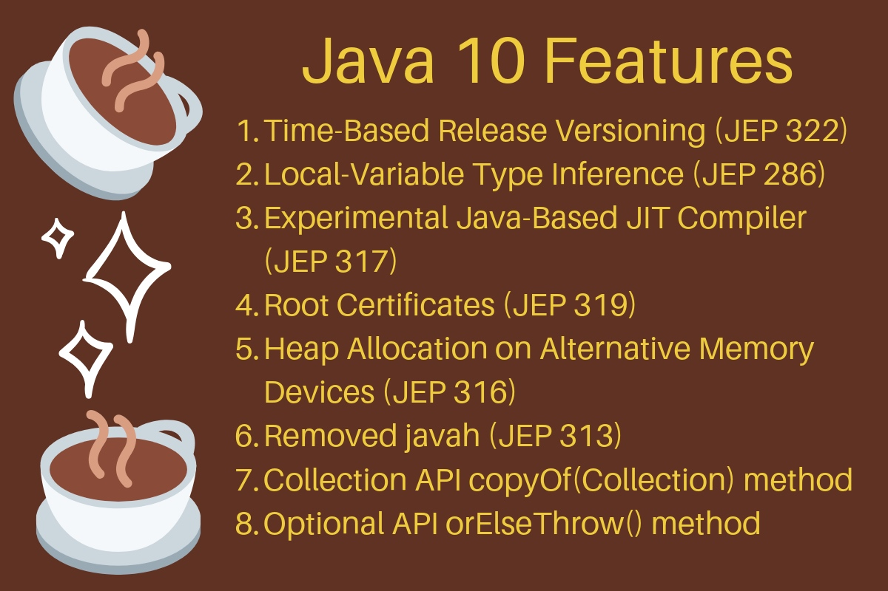

<h1 align="center">Java 10 Features</h1>



Java 10 is the fastest release of a java version in its 23-year history. Java has been criticized for its slow growth and evolution, but Java 10 just shattered that concept. Java 10 is a release with many futuristic changes, the scope, and impact of which may not be obvious but are far-fetching.

In this article, we will discuss the various features added in Java10 release. Before that, let’s go over some changes introduced to java release model.

Table of Contents[[hide](https://www.journaldev.com/20395/java-10-features#)]

- - [0.1 Long Term Support Model](https://www.journaldev.com/20395/java-10-features#long-term-support-model)
  - [0.2 Oracle JDK vs Open JDK](https://www.journaldev.com/20395/java-10-features#oracle-jdk-vs-open-jdk)

- 1 Java 10 Features

  - [1.1 Time-Based Release Versioning (JEP 322)](https://www.journaldev.com/20395/java-10-features#time-based-release-versioning-jep-322)
  - [1.2 Local-Variable Type Inference (JEP 286)](https://www.journaldev.com/20395/java-10-features#local-variable-type-inference-jep-286)
  - [1.3 Experimental Java-Based JIT Compiler (JEP 317)](https://www.journaldev.com/20395/java-10-features#experimental-java-based-jit-compiler-jep-317)
  - [1.4 Application Class-Data Sharing (JEP 310)](https://www.journaldev.com/20395/java-10-features#application-class-data-sharing-jep-310)
  - [1.5 Parallel Full GC for G1 (JEP 307)](https://www.journaldev.com/20395/java-10-features#parallel-full-gc-for-g1-jep-307)
  - [1.6 Garbage-Collector Interface (JEP 304)](https://www.journaldev.com/20395/java-10-features#garbage-collector-interface-jep-304)
  - [1.7 Additional Unicode Language-Tag Extensions (JEP 314)](https://www.journaldev.com/20395/java-10-features#additional-unicode-language-tag-extensions-jep-314)
  - [1.8 Root Certificates (JEP 319)](https://www.journaldev.com/20395/java-10-features#root-certificates-jep-319)
  - [1.9 Thread-Local Handshakes (JEP 312)](https://www.journaldev.com/20395/java-10-features#thread-local-handshakes-jep-312)
  - [1.10 Heap Allocation on Alternative Memory Devices (JEP 316)](https://www.journaldev.com/20395/java-10-features#heap-allocation-on-alternative-memory-devices-jep-316)
  - [1.11 Remove the Native-Header Generation Tool – javah (JEP 313)](https://www.journaldev.com/20395/java-10-features#remove-the-native-header-generation-tool-javah-jep-313)
  - [1.12 Consolidate the JDK Forest into a Single Repository (JEP 296)](https://www.journaldev.com/20395/java-10-features#consolidate-the-jdk-forest-into-a-single-repository-jep-296)
  - [1.13 API Changes](https://www.journaldev.com/20395/java-10-features#api-changes)

- [2 Conclusion](https://www.journaldev.com/20395/java-10-features#conclusion)

### Long Term Support Model

Starting 2017, Oracle & the Java community announced its shift to a new 6-month cadence for Java. It moved to a Long Term Support (LTS) model for Oracle Java SE products.

**What does this mean?**

LTS version of the products will offer premier and sustained support from Oracle and it will be targeted every 3 years.

Each Java release is modeled after one or two major feature, these features drive the release. Any obstacle postpones the release and late to market. Project Jigsaw was a major feature of [Java 9](https://www.journaldev.com/13121/java-9-features-with-examples), it pushed out the release dates a couple of times and the release was delayed by more than 1.5 years. 6 months cadence release will follow a release train. Release train will have a schedule every 6 months. Features which make the cut get boarded on the train; else they wait for the next scheduled train.

### Oracle JDK vs Open JDK

In order to be more developer-friendly, Oracle & Java community now promotes the OpenJDK binaries as primary JDK going forward. This is a big relief from earlier days, where the JDK binaries were propriety and licensed by Oracle, which had various restrictions around redistribution. Oracle will, however, keep producing their JDK, but only for long term support releases. This is a move towards being more cloud & container friendly, as the open JDK binaries can be distributed as part of a container.

**What does this mean?**

Open JDK binaries will be released every 6 months, while Oracle JDK binaries will be released every 3 years (LTS version).

**Which JDK binaries will be adopted?**

Large organizations take time to move between the versions; they cling on to the version until they can. Industry adoption for Java 6 was more than Java 7 and then Industry is gradually moving to [Java 8](https://www.journaldev.com/13121/java-9-features-with-examples). In my opinion, the LTS version will be the most favored ones by the enterprises. However, whether it would be the LTS version of Oracle JDK or the Open JDK is yet to know, partly because there’s a lot going on the cloud space.

[Java 9](https://www.journaldev.com/13121/java-9-features-with-examples) & 10 are non-LTS release. Java 11 which is due in September 2018 will be a LTS release.

## Java 10 Features

Let’s take a sneak peek of the features available in Java 10.

1. ### Time-Based Release Versioning (JEP 322)

2. With the adoption of the time-based release cycle, Oracle changed the version-string scheme of the Java SE Platform and the JDK, and related versioning information, for present and future time-based release models.

3. The new pattern of the Version number is:

4. `$FEATURE.$INTERIM.$UPDATE.$PATCH`

5. **$FEATURE**: counter will be incremented every 6 months and will be based on feature release versions, e.g: JDK 10, JDK 11.

6. **$INTERIM**: counter will be incremented for non-feature releases that contain compatible bug fixes and enhancements but no incompatible changes. Usually, this will be zero, as there will be no interim release in a six month period. This kept for a future revision to the release model.

7. **$UPDATE**: counter will be incremented for compatible update releases that fix security issues, regressions, and bugs in newer features. This is updated one month after the feature release and every 3 months thereafter. The April 2018 release is JDK 10.0.1, the July release is JDK 10.0.2, and so forth

8. **$PATCH**: counter will be incremented for an emergency release to fix a critical issue.
   New API’s have been added to get these counter values programmatically. Let’s take a look;

9. ```
   Version version = Runtime.version();
   version.feature();
   version.interim();
   version.update();
   version.patch();
   ```

10. Now, let us take a look at Java launcher which returns the version information:

11. ```
    $ java -version
    java version "10" 2018-03-20
    Java(TM) SE Runtime Environment 18.3 (build 10+46)
    Java HotSpot(TM) 64-Bit Server VM 18.3 (build 10+46, mixed mode)
    ```

12. The version number format is “10” as there’s no other counter which is other than zero. The date of release is added. 18.3 can be read as the Year 2018 & 3rd Month, build 10+46 is 46th build for version 10. For a hypothetical build 93 of JDK 10.0.1, the build will be 10.0.1+93

13. ### Local-Variable Type Inference (JEP 286)

14. Local-Variable Type Inference is the biggest new feature in Java 10 for developers. It adds type inference to declarations of local variables with initializers. Local type inference can be used only in the following scenarios:

15. - Limited only to Local Variable with initializer
    - Indexes of enhanced for loop or indexes
    - Local declared in for loop

16. Let’s take a look at its usage:

17. ```
    var numbers = List.of(1, 2, 3, 4, 5); // inferred value ArrayList<String>
    // Index of Enhanced For Loop
    for (var number : numbers) {
    	System.out.println(number);
    }
    // Local variable declared in a loop
    for (var i = 0; i < numbers.size(); i++) {
    	System.out.println(numbers.get(i));
    }
    ```

18. You can read more about it at our exclusive post on [java 10 local variable type inference](https://www.journaldev.com/19871/java-10-local-variable-type-inference).

19. ### Experimental Java-Based JIT Compiler (JEP 317)

20. This feature enables the Java-based JIT compiler, Graal, to be used as an experimental JIT compiler on the Linux/x64 platform. This is by far the most futuristic inclusion in the Java 10 feature list.

21. Graal was introduced in Java 9. It’s an alternative to the JIT compiler which we have been used to. It’s a plugin to the JVM, which means that the JIT compiler is not tied to JVM and it can be dynamically plugged in and replaced with any another plugin which JVMCI compliant (Java-Level JVM Compiler Interface). It also brings Ahead of Time (AOT) compilation in java world. It also supports polyglot language interpretation.

22. “A Java-based Just in Time Compiler written in Java to convert the java bytecode to machine code.” Is it confusing? If JVM is written in Java, then don’t you need a JVM to run the JVM? The JVM can be compiled AOT and then JIT compiler can be used within JVM it for enhancing performance through live code optimization.

23. Graal is a complete rewrite of the JIT compiler in Java from scratch. Previous JIT compiler was written in c++. It’s considered one for the final stage of evolution for any programming language.

24. You can switch to Graal with following jvm parameters:

25. ```
    -XX:+UnlockExperimentalVMOptions -XX:+UseJVMCICompiler
    ```

26. You can learn more about Graal from [Chris Seaton presentation](https://chrisseaton.com/truffleruby/jokerconf17/).

27. ### Application Class-Data Sharing (JEP 310)

28. This feature helps in improving the startup footprint, extends the existing Class-Data Sharing (“CDS”) feature to allow application classes to be placed in the shared archive.

29. JVM while starting performs some preliminary steps, one of which is loading classes in memory. If there are several jars having multiple classes, then the lag in the first request is clearly visible. This becomes an issue with serverless architecture, where the boot time is critical. In order to bring down application startup time, Application class-data sharing can be used. The idea is to reduce footprint by sharing common class metadata across different Java processes. This can be achieved by the following 3 steps:

30. **Determining the classes to archive**: Use the java launcher to create a list of files to archive, this can be achieved by the following parameters:

31. ```
    $java -Xshare:off -XX:+UseAppCDS -XX:DumpLoadedClassList=hello.lst -cp hello.jar HelloWorld
    ```

32. **Creating the AppCDS archive**: Use java launcher to create the archive of the list of files to be used for Application CDS, this can be achieved by following parameters:

33. ```
    $java -Xshare:dump -XX:+UseAppCDS -XX:SharedClassListFile=hello.lst -XX:SharedArchiveFile=hello.jsa -cp hello.jar
    ```

34. **Using the AppCDS archive**: Use Java launcher with the following parameters to use Application CDS.

35. ```
    $java -Xshare:on -XX:+UseAppCDS -XX:SharedArchiveFile=hello.jsa -cp hello.jar HelloWorld
    ```

36. ### Parallel Full GC for G1 (JEP 307)

37. G1 [garbage collector](https://www.journaldev.com/16659/garbage-collection-in-java) was made default in JDK 9. G1 Garbage collector avoids any full garbage collection, but when concurrent threads for collection cannot revive the memory fast enough users experience is impacted.

38. This change improves the G1 worst-case latency by making the full GC parallel. The mark-sweep-compact algorithm from G1 collector is parallelized as part of this change and will be triggered when concurrent threads for collection can’t revive the memory fast enough.

39. ### Garbage-Collector Interface (JEP 304)

40. This JEP is futuristic change. It improves the code isolation of different garbage collectors by introducing a common Garbage Collector Interface.

41. This change provides better modularity to the Internal GC Code. It will help in the future for adding new GC without changing existing codebase, also help in removing or housekeeping of the previous GC.

42. ### Additional Unicode Language-Tag Extensions (JEP 314)

43. This feature enhances java.util.Locale and related APIs to implement additional Unicode extensions of BCP 47 language tags. As of Java SE 9, the supported BCP 47 U language-tag extensions are “ca” and “nu”. This JEP will add support for the following additional extensions:

44. - cu (currency type)
    - fw (first day of week)
    - rg (region override)
    - tz (time zone)

45. In order to support these additional extensions, changes are made to various APIs to provide information based on U or additional extensions.

46. ```
    java.text.DateFormat::get*Instance
    java.text.DateFormatSymbols::getInstance
    java.text.DecimalFormatSymbols::getInstance
    java.text.NumberFormat::get*Instance
    java.time.format.DateTimeFormatter::localizedBy
    java.time.format.DateTimeFormatterBuilder::getLocalizedDateTimePattern
    java.time.format.DecimalStyle::of
    java.time.temporal.WeekFields::of
    java.util.Calendar::{getFirstDayOfWeek,getMinimalDaysInWeek}
    java.util.Currency::getInstance
    java.util.Locale::getDisplayName
    java.util.spi.LocaleNameProvider
    ```

47. ### Root Certificates (JEP 319)

48. In order to promote OpenJDK and make it more appealing to community users, this feature provides a default set of root Certification Authority (CA) certificates in the JDK. This will also mean that both Oracle & Open JDK binaries will be functionally the same.

49. Critical security components such as TLS will work by default in OpenJDK builds going forward.

50. ### Thread-Local Handshakes (JEP 312)

51. This is an internal JVM feature to improve performance.

52. A handshake operation is a callback that is executed for each JavaThread while that thread is in a safepoint state. The callback is executed either by the thread itself or by the VM thread while keeping the thread in a blocked state.

53. This feature provides a way to execute a callback on threads without performing a global VM safepoint. Make it both possible and cheap to stop individual threads and not just all threads or none.

54. ### Heap Allocation on Alternative Memory Devices (JEP 316)

55. Applications have become memory hungry, there’s an increase in cloud-native applications, in-memory databases, streaming applications. In order to cater to these services, there are various memory architectures available. This feature enhances the capability of HotSpot VM to allocate the Java object heap on an alternative memory device, such as an NV-DIMM, specified by the user.

56. This JEP targets alternative memory devices that have the same semantics as DRAM, including the semantics of atomic operations, and can, therefore, be used instead of DRAM for the object heap without any change to existing application code.

57. ### Remove the Native-Header Generation Tool – javah (JEP 313)

58. This is a housekeeping change to remove javah tool from JDK. The tool functionality is added in `javac` as part of JDK 8, which provides ability to write native header files at the compile-time rendering `javah` useless.

59. ### Consolidate the JDK Forest into a Single Repository (JEP 296)

60. Over the years there have been various Mercurial repositories in for JDK codebase. Different repositories do provide some advantage, but they also had various operational downsides. As part of this change, numerous repositories of the JDK forest are combined into a single repository in order to simplify and streamline development.

61. ### API Changes

62. Java 10 has added and removed (Yes It’s not a Typo) API’s.

63. Java 9 introduced enhanced deprecation where certain API’s were marked to be removed in future releases.

64. **API’s Removed**: You can find the API’s removed [here](https://cr.openjdk.java.net/~iris/se/10/latestSpec/#APIs-removed).

65. **API’s Added**: 73 new API’s was added in Java 10. You can find the API’s added along with comparison [here](https://cr.openjdk.java.net/~iris/se/10/latestSpec/apidiffs/overview-summary.html).

66. Let’s go through a few additions:

67. - List, Map & Set Interfaces are added with a static copyOf(Collection) method. Its returns an unmodifiable List, Map or Set containing the entries provided. For a List, if the given List is subsequently modified, the returned List will not reflect such modifications.
    - Optional & its primitive variations get a method orElseThrow(). This is exactly same as get(), however the java doc states that it is a preferred alternative then get()
    - Collectors class gets various methods for collecting unmodifiable collections (Set, List, Map)

68. ```
    List<String> actors = new ArrayList<>();
    actors.add("Jack Nicholson");
    actors.add("Marlon Brando");
    System.out.println(actors); // prints [Jack Nicholson, Marlon Brando]
    // New API added - Creates an UnModifiable List from a List.
    List<String> copyOfActors = List.copyOf(actors);
    System.out.println(copyOfActors); // prints [Jack Nicholson, Marlon Brando]
    // copyOfActors.add("Robert De Niro"); Will generate an
    // UnsupportedOperationException
    actors.add("Robert De Niro");
    System.out.println(actors);// prints [Jack Nicholson, Marlon Brando, Robert De Niro]
    System.out.println(copyOfActors); // prints [Jack Nicholson, Marlon Brando]
    		
    String str = "";
    Optional<String> name = Optional.ofNullable(str);
    // New API added - is preferred option then get() method
    name.orElseThrow(); // same as name.get()  
    
    // New API added - Collectors.toUnmodifiableList
    List<String> collect = actors.stream().collect(Collectors.toUnmodifiableList());
    // collect.add("Tom Hanks"); // Will generate an
    // UnsupportedOperationException
    ```

## Conclusion

In this article, we went through the different new feature addition of Java 10. If you think anything important got missed here, please let us know through comments.

As usual you can check the complete code at GitHub [here](https://github.com/askrakesh/examples/tree/master/src/com/askrakesh/java10).


souce: https://www.journaldev.com/20395/java-10-features